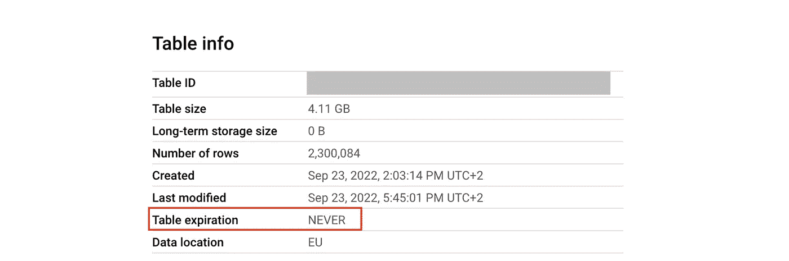
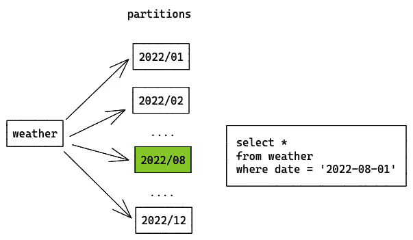
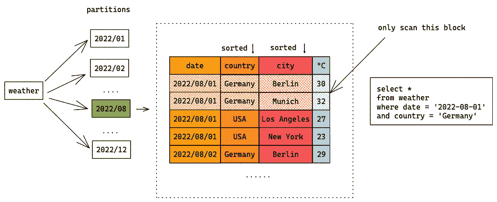
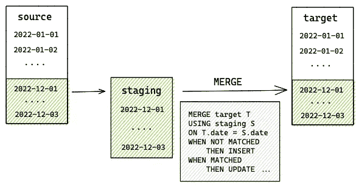
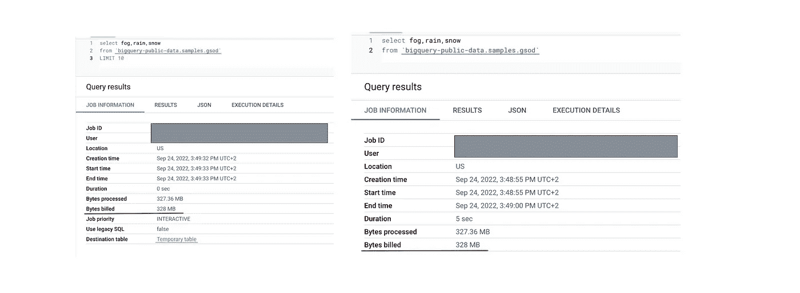
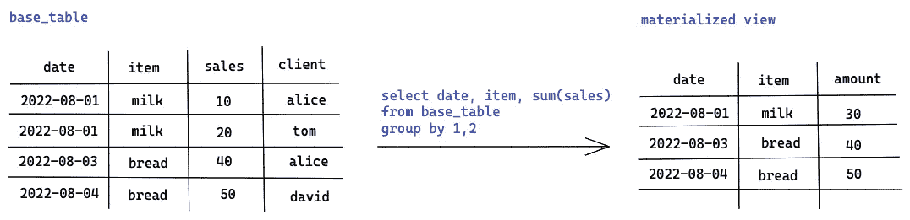

# BigQuery 的 7 个成本优化实践

> 原文：<https://towardsdatascience.com/7-cost-optimization-practices-for-bigquery-6f776582e62d>

## 在需要的时候花钱

在 [Unsplash](https://unsplash.com/) 上由 [micheile dot com](https://unsplash.com/@micheile) 拍摄的照片

云的好处之一是其无限的可扩展性。数据存储、计算能力和网络都可以在大多数云计算基础设施中扩展，如 GCP 和 AWS。然而，可扩展性会导致云浪费—过度配置资源、非最佳数据存储、过多的闲置资源等。2021 年，公司可能会浪费高达 260 亿美元，这是有史以来最高的云浪费金额。

因此，在本文中，让我们看看 BigQuery 的一些成本优化实践——一个无服务器和多云化的数据仓库。根据谷歌的说法，与其他基于云的平台相比，BigQuery 已经是一个具有成本效益的数据仓库。但是我们仍然可以做很多事情来保持更低的成本。

如果您想知道如何监控 BigQuery 的成本，您可以查看我的另一篇文章 [*我如何为成本节约和容量规划构建实时 BigQuery 管道*](/how-i-build-a-real-time-bigquery-pipeline-for-cost-saving-and-capacity-planning-15712c97f058) *。*

## 1.选择正确的定价模式

BigQuery 提供了几种对成本有直接影响的计算定价模型。总的来说，BigQuery 提供了两种定价模型，并增加了一些内容。

[按需定价](https://cloud.google.com/bigquery/pricing#on_demand_pricing):您为每个查询处理的字节数付费(每 TB 5 美元)。您可以通过**减少查询处理的字节数**来直接降低成本。

[统一费率定价](https://cloud.google.com/bigquery/pricing#flat-rate_pricing):您需要为专用的查询处理能力付费，以时间段来衡量(2000 美元/月/100 个时间段)。您可以通过使用更少的槽让您的查询更有效地运行来降低成本。

在选择定价模式方面，Google 给出了[以下建议](https://cloud.google.com/blog/products/data-analytics/choosing-bigquery-pricing):

*   如果您刚开始使用少量数据，按需定价模式对您很有好处。您只需为您消费的内容付费，如果您不进行查询，这些插槽的容量将为零。如果您计划了具有可预测的扫描数据量的工作流(例如，在查询中使用重新加载窗口)，这种模式也是首选，因为您确切知道您将支付多少费用。
*   随着数据的增长，成本也会相应增加。如果您开始有更繁重的工作流或临时请求，您可能希望切换到弹性费率定价模式。它确保您不会对未经优化的即席查询感到惊讶。如果您的 BigQuery 项目对整个组织开放，包括不一定了解所有这些 SQL 最佳实践的人，这种情况就会发生。
*   按需定价模式和弹性费率定价模式并不相互排斥。BigQuery 引入了 **Flex Slots** ,它为短期预留了插槽。您可以将它用于需要额外容量的周期性工作负载，或者需要在短时间内处理大量数据的工作负载。(例如，由于某些用户活动，需要每月运行一次的报告管道，在国庆节期间，等等)。

很难说什么时候是转换到另一种定价模式的最佳时机。但是如果你觉得你支付的太多了(例如，超过$ 10K/月)，你可以随时为新的定价模式做一个概念验证，如果它不符合你的期望，就切换回来。

## 2.为短期表设置表过期时间

BigQuery 的存储有两种价格:

*   0.02 美元/GB 用于活动存储，包括在过去 90 天内修改过的表或表分区。
*   对于过去 90 天内未修改的长期存储，每 GB 0.01 美元。

您可以通过设置表的[到期时间](https://cloud.google.com/bigquery/docs/managing-tables#updating_a_tables_expiration_time)或数据集的[默认表到期时间](https://cloud.google.com/bigquery/docs/updating-datasets#table-expiration)以及分区表的[分区到期时间](https://cloud.google.com/bigquery/docs/managing-partitioned-tables#partition-expiration)来控制存储成本。这在以下几种情况下很有用:

*   您有许多每日快照表，并且只想保留最近 X 天的数据。然后，您可以将每个新快照表的到期时间设置为 X 天。
*   您有一个仅包含临时数据的操场数据集。然后，您可以将整个数据集的默认过期时间设置为 X 天。
*   您有一个按天进行分区的表，并且您只想要最近 X 天的数据。然后，您可以设置分区过期时间。

BigQuery 中的表过期

这种简单的做法会自动清理空闲的表并节省存储成本。

## 3.分区和集群

[分区](https://cloud.google.com/bigquery/docs/partitioned-tables)您的数据可以帮助降低处理查询的成本并提高性能。您可以使用摄取时间或任何时间戳和日期列对表进行分区，并选择每天、每小时、每月和每年作为粒度。对于巨大的表，建议应用**必需的分区过滤器**，这样用户将被迫减少扫描的数据量。

例如，您对一个包含过去 12 个月的每日天气数据的`weather`表进行分区。分区字段为`date`，粒度为月。当你搜索`2022–08–01`的天气时，BigQuery 只扫描`august`分区中的数据。您只需为该分区中的数据付费，而不是整个表。

表分区(由作者创建)

最重要的是，您可以基于最多四列对您的表进行[聚类。BigQuery 根据指定的列顺序对每个分区中的数据进行排序。当您的查询搜索这些列时，BigQuery 只扫描分区的相关块。](https://cloud.google.com/bigquery/docs/clustered-tables)

例如，我们向`weather`表添加 3 个聚类字段:`date`、`country`和`city`。当我搜索德国八月份的天气时，BigQuery 只会扫描一个分区和有限的可以找到德国数据的区块。

表聚类(由作者创建)

一个专业建议是使用更可能被筛选的列作为聚类字段。此外，划分字段也可以是聚类字段。在`weather`表中，`date`按月粒度进行分区，并按天级别在每个分区中排序。它将提高查询性能并降低成本。

## 4.使用增量表更新

当您构建数据管道时，一个重要的步骤是将数据接收到 BigQuery 中。如果表很小，您可以定期完全重新加载表。但是如果表很大，每次进行完全刷新是非常昂贵和耗时的，通常的做法是执行增量表更新。

例如，源表每天接收新记录，而每日计划查询捕获源表中的更改，并相应地更新目标表。执行完全刷新显然是浪费金钱，因为旧数据不会改变。

一个解决方案是定义一个重载窗口。为了不遗漏源表中的任何数据，通常重载窗口大于源表的更新频率。假设我们有一个 3 天的重装窗口。每天，该查询只从源表中选择最近 3 天的数据，并将其存储在 CTE 或临时表中。稍后，查询可以使用`MERGE`语句来更新目标表。

本例中的`MERGE`语句意味着‘如果临时表包含目标表中不存在的带有新`date`的记录，则插入该记录，否则更新目标表。’在这种情况下，“更新目标表”实际上不会改变任何东西，它只是用相同的数据覆盖它。

增量更新(由作者创建)

拥有一个重新加载窗口可以大大减少要扫描的数据量。您可以在数据管道中利用这种技术。

## 5.避免选择*只要你能+限制 100 是一个幻想

[BigQuery 以列格式](https://cloud.google.com/bigquery/docs/storage_overview#:~:text=BigQuery%20stores%20table%20data%20in,very%20large%20number%20of%20records.)存储数据，这意味着它单独存储每一列。这也意味着`SELECT *`是一种非常昂贵的数据查询方式。一个简单的技巧是**只选择您需要的列。**您可以随时使用`SCHEMA`和`PREVIEW`选项卡来免费查看数据。

还要注意，应用限制条款并不能节省一分钱。如果希望扫描较少的行，则应用分区筛选器。

有/没有限制的查询(由作者创建)

## 6.INT64 列上的 ORDER BY 或 JOIN

在 BigQuery 中，使用`INT64`而不是`STRING`数据类型来连接列更便宜也更有效。这里有一篇关于[列类型如何影响数据仓库中连接速度的有趣文章？](/how-do-column-types-effect-join-speeds-in-data-warehouses-5ddd1933211e)

## 7.使用实体化视图

要回答分析问题，您需要一个组合了来自不同表的大量数据的复杂查询。一些流行的问题可以被问很多次，多次运行相同的复杂查询是浪费金钱。BigQuery 提供了[物化视图](https://cloud.google.com/bigquery/docs/materialized-views-intro),允许您在聚合事实表中汇总数据。它是一个预先计算的视图，定期缓存查询结果以提高性能和效率。

物化视图**不是从基表中检索数据，而是从基表中只读 detla 变化来计算最新结果。**而且一般速度更快，扫描数据更少。

物化视图(由作者创建)

例如，物化视图可用于聚合流数据、预过滤数据或预连接带有小表的数据。根据 BigQuery，当基表发生变化时，视图会在后台重新计算，以便可以返回新数据。

## 结论

和往常一样，我希望这篇文章对你有用，并能给你启发。BigQuery 为新用户提供免费积分，这很好，你可能不在乎一开始的费用，这没关系。但是，随着您的技术堆栈和数据不断增长，有一天您会撞墙并注意到您的账单呈指数级增长。如果你知道一些节省成本的小技巧，并且本文中的大部分小技巧都很容易实现，那将会很有帮助，这样你就可以从一开始就避免大额账单。干杯！