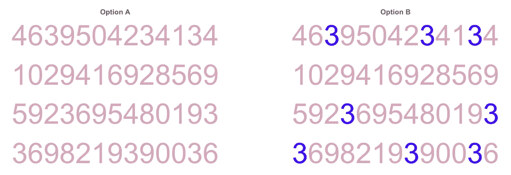
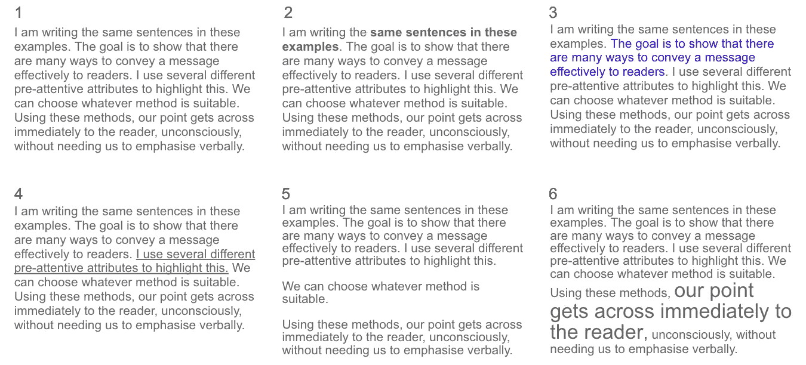
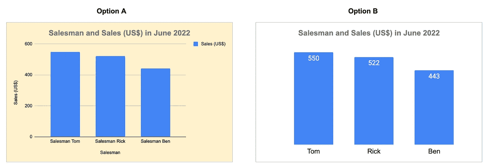
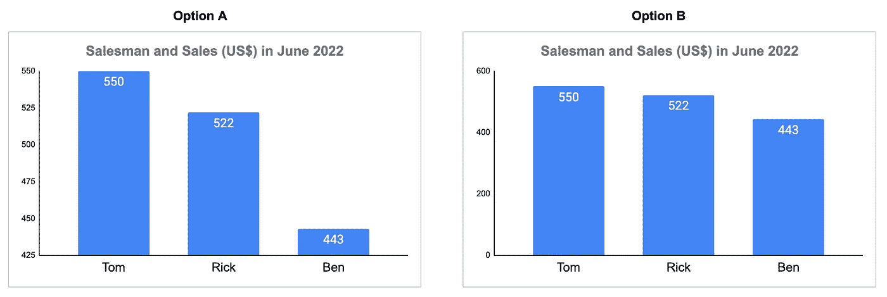
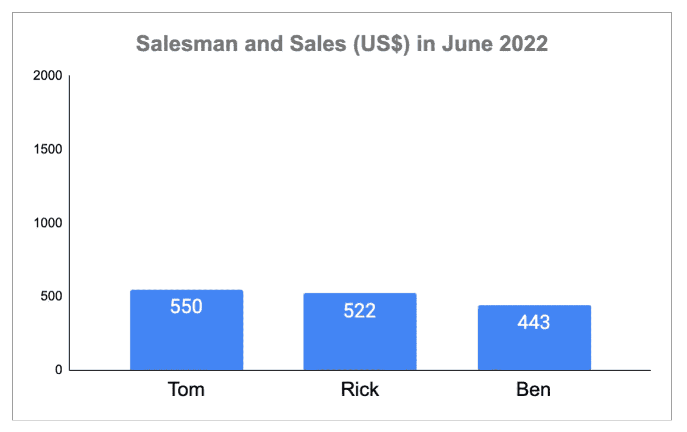
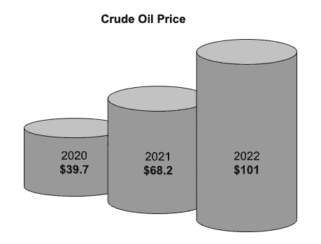
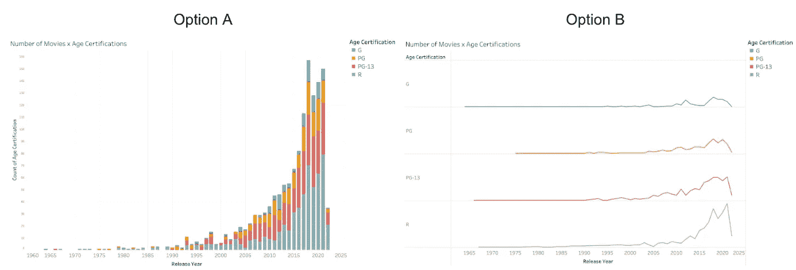
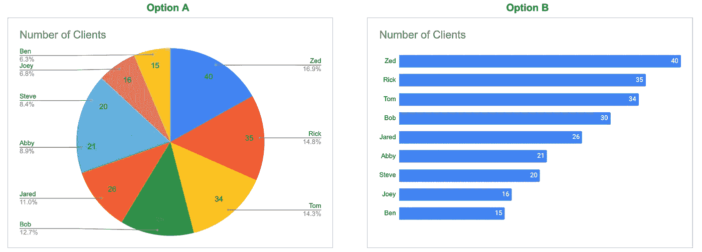

# 每个人都必须知道的 7 个数据可视化最佳实践

> 原文：<https://towardsdatascience.com/7-data-visualization-best-practices-everyone-must-know-b68ebe329b1e>

## 数据可视化

## 以更有效的方式传达你的故事

米利安·耶西耶在 [Unsplash](https://unsplash.com?utm_source=medium&utm_medium=referral) 上拍摄的照片

对 21 世纪的大多数工作来说，可视化数据是一项基本技能。如果你从事数据科学工作，这一点毫无疑问，但这一技能对于大多数其他工作也至关重要，包括分析师、客户服务、运营、营销、金融、企业家等。这是因为可视化数据不仅仅是将数字转换成图表。在最好的情况下，这是一个讲故事的练习，有助于以视觉形式传达任何信息。除了图表，这项技能在写电子邮件、设计咖啡馆菜单、报告和演示幻灯片时也很有用。

在撰写本文时，我已经有了三年的工作经验，为高级管理层制作了许多演示幻灯片和图表，一年的商业分析硕士课程，以及一年的数据分析师经验。

这七个最佳实践是我在四年的职业生涯中收集到的，也是我在硕士学位课上学到的。

## 1.前注意属性

当看一个图像时，我们的大脑自然会首先注意几个不同的特征。这些特征或属性在学术上被称为前注意属性。这些是我们潜意识里注意到和处理的，甚至在分析数据、模式甚至破译眼前的东西之前。

为了说明，我们来看看下图。

**数一数每张图片中的 3！你需要多少秒？**

预先注意的属性:颜色|作者图片

在阅读说明之前，你注意到选项 B 中的数字 3 了吗？

在选项 A 和选项 B 中，这组数字完全相同。然而，在选项 A 中，我花了大约十秒钟来数 3 的数目，而在选项 B 中，我只花了两秒钟。

我们的眼睛很自然地被选项 b 中独特的颜色所吸引。这使得我们很容易注意到、识别图案和分析数据(在这种情况下，计算 3 的数量)。这是突出信息、传达信息的最直接、最简单的方式之一。

除了颜色，还有许多其他的预先注意属性，如下图所示。随意放大。

预先注意属性的示例|作者图片

从上图中，我们可以注意到六个示例中的这些差异:

1.  没有预先注意的属性
2.  大胆的
3.  颜色
4.  强调
5.  空间/段落的使用
6.  字体大小

每一种前注意属性都以不同的方式起作用，有些更明显，而有些则更微妙。根据使用案例、情况、读者和风格，一些预先注意的属性可能比其他属性更受青睐。但总的来说，有了预先注意的属性，读者就不会错过你想表达的观点。

下次你写电子邮件、报告或幻灯片时，看看添加这些预先注意的属性是否有助于传达你的信息并提升讲故事的体验。

## 2.数据-油墨比

数据墨水是图形不可擦除的核心(来自书本[量化信息的可视化显示](https://www.amazon.com/Visual-Display-Quantitative-Information/dp/1930824130))。

简而言之，这意味着有效显示数据需要多少墨水。这应该尽可能保持最小。

让我们来看看下面的图像，使用一个虚拟数据对销售人员和他们各自的销售业绩。

数据-油墨比|作者提供的图像和数据

选项 B 在呈现数据时更清晰、更有效。在选项 A 中，有许多冗余信息(因此有更多的墨迹)分散了我们对数据的破译。例如，在选项 A 中:

1.  销售*(美元)传奇*是多余的，当标题和轴已经提到*推销员*。
2.  x 轴的*销售员*这个词在读者已经知道是销售员名字的情况下是多余的，标题也提到了。x 轴职称*业务员也是一样。*
3.  背景颜色是不必要的墨水，可能会分散我们的注意力。
4.  网格线不是必需的。它们会增加墨水量，但不会增加任何值。
5.  有争议的是，y 轴也可以被删除，因为我们可以像选项 b 一样在每个条形图上放置精确的数字。但是，请参见第 4 节关于 y 轴的操作，以及为什么这可能是一个问题。

总之，选项 B 的数据-油墨比要小得多，是一个更好的选项。原则是不要让不重要的内容分散读者对相关信息的注意力。因此，读者可以更快地了解数据。

## 3.图表垃圾

有时，我们试图用视觉上吸引人的图像和图标来美化我们的观想。虽然它在某些情况下可能有用，但我们必须小心不要添加没有附加值的图片，这只会增加读者的认知负荷。

例如，以上面的销售人员图表为例，假设我们在图表上为每个销售人员添加了不同的销售人员图标。这是不必要的，这些图标会被归类为图表垃圾，只会减慢我们传达信息的速度。

## 4.操纵 y 轴

这是一个很常见的谬误，很容易被忽视，甚至被用作操纵工具。

想象一下，我们想要传达的信息是，本是 2022 年 6 月表现最差的。然后，我们截断 y 轴，并在选项 a 中显示图表。销售额的差异看起来确实很大。

截断的 y 轴|作者的图像和数据

利益相关者或图表的读者应该注意这个技巧。看选项 B，y 轴从 0 开始，销售额的差异不再明显。

在另一个极端情况下，为了隐藏销售中的巨大差异，可以将 y 轴的最大值扩展到一个非常大的数字，因此所有条形图的高度将或多或少相等。有时这可能是偶然的，有一个非常高的 bar 异常类别。

按作者操作 y 轴|图像和数据

## 5.谎言因素

有时，我们也想创建 3D 图表，而不是简单的条形图和折线图。例如，当想象原油价格上涨时，我们可能会认为用石油桶的形式(相对于条形图或折线图)来想象是一个天才和创造性的想法。

原油价格|作者提供的图片和数据

然而，这里有一个我们必须考虑的谎言因素。

*   价格标签与桶的高度相对应。
*   然而，人们会通过枪管的**容积来感知它。**
*   体积: **π r h** ，其中 r 为桶的半径，h 为桶的高度。

因此，使用此图表，价格上涨的影响被感知为比实际大得多(高π r)。

## 6.堆积条形图

在我的职业生涯中，堆叠条形图被大量使用，有时被滥用。特别是对于在一段时间内按类别分组的可视化指标，堆积条形图总是最受欢迎的。

使用关于网飞电影的数据集，我们展示了这些年来电影年龄认证的数量(例如，PG，PG-13，R)。

堆积条形图与小倍数|图片由作者提供，数据来自 [Kaggle 数据集](https://www.kaggle.com/datasets/victorsoeiro/netflix-tv-shows-and-movies?select=titles.csv)

堆积条形图(选项 A)的缺点是很难比较每个组成部分(除了最靠近 x 轴的部分)。很难比较每种颜色的度量，因为它们的起点不同。

选项 B 是一个更好的选择。这种相对不太为人所知的图表被称为小倍数图表或面板图表，也称为刻面。通过将类别分解成多个更小的独立图表，我们可以轻松地比较每个类别的趋势。通过这种方式，我们也能够用折线图来可视化，这更适合于时间序列数据。

虽然这看起来像是创建许多折线图并将它们组合成一个图表，但细微的区别是所有这些图表都共享同一个 x 轴(数据墨迹更少)。这也可以使用可视化工具快速生成，如 Tableau、Power BI、R 等。不要烦恼，没有必要花费额外的时间来生成多个图表！

## 7.饼图之死

有些人对饼状图的喜爱超过了他们应该有的程度，真的。对我来说，使用饼状图实际上没有什么好处。理想情况下，饼图用于表示部分到整体的关系。然而，有其他更好更有效的方法来观想这一点。

下面是我制作的虚拟销售人员图表。

对照饼图|作者提供的图片和数据

在选项 A(饼图)中，从视觉上很难比较，例如，艾比是否比 T2 拥有更多的客户。我们的大脑不习惯区分哪个角度或馅饼面积更大。尤其是有很多商品(因此有很多颜色)的时候，很难一眼看出馅饼的大小。另一方面，选项 B 以条形图的形式对此进行可视化，这使我们能够立即区分哪个类别有更多的产品。这是因为比较一根棒的长度要容易得多。

然而，如果情况(例如，不可说服的老板或利益相关者)需要你创建一个饼状图，这些提示可能有助于更好地形象化它:

*   坚持 5 片或更少，包括“其他”类别。
*   仅使用饼图显示一个时间点的比较。
*   考虑将其转换为圆环图(与饼图相同，但中间是空心的)，以减少数据墨迹。

## 结论

谢谢你读到这里。我希望你喜欢阅读这篇文章，并发现上面的七个最佳实践是有用的。请在评论区分享您的评论和其他最佳实践！

PS:如果你喜欢数据可视化并愿意联系，我可以在 [LinkedIn](https://www.linkedin.com/in/nathanthandoko/) 找到你。

**支持我！**

 [## 通过我的推荐链接加入 Medium-Nathan Timothy Handoko

### 作为一个媒体会员，你的会员费的一部分会给你阅读的作家，你可以完全接触到每一个故事…

nathanthandoko.medium.com](https://nathanthandoko.medium.com/membership) 

加入我的电子邮件列表，每当我发布新帖子时都会收到通知！
https://nathanthandoko.medium.com/subscribe

**查看我的其他文章:**

 [## 数据科学职业转换:硕士值得吗？(第二部分)

### 在计划职业转换之前要学习的编程语言和要问的三个问题

towardsdatascience.com](/data-science-career-switch-is-masters-degree-worth-it-part-2-1110c3440e4b)