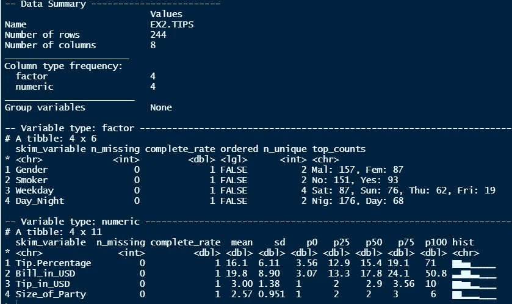
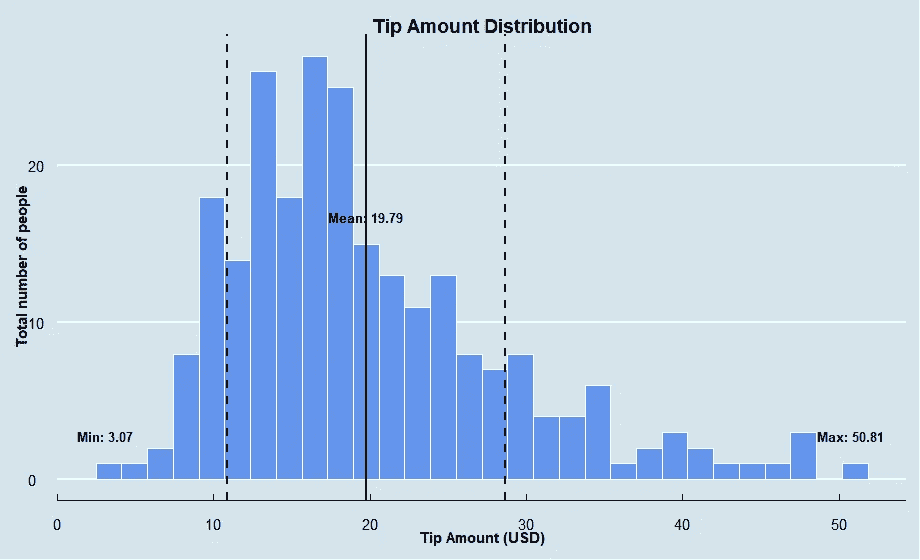
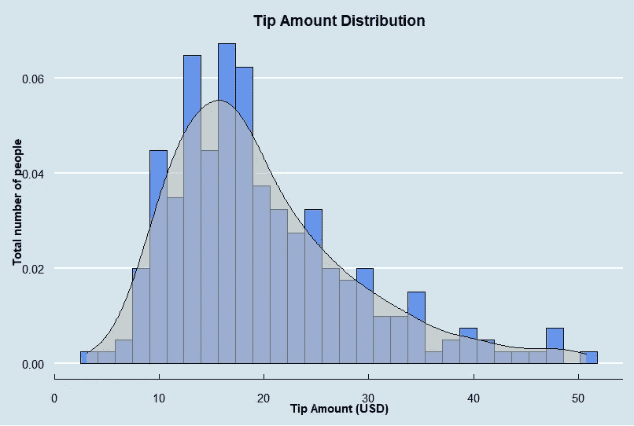
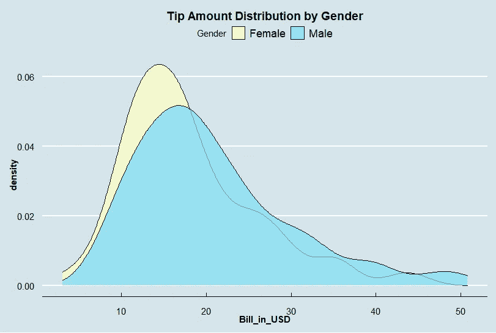
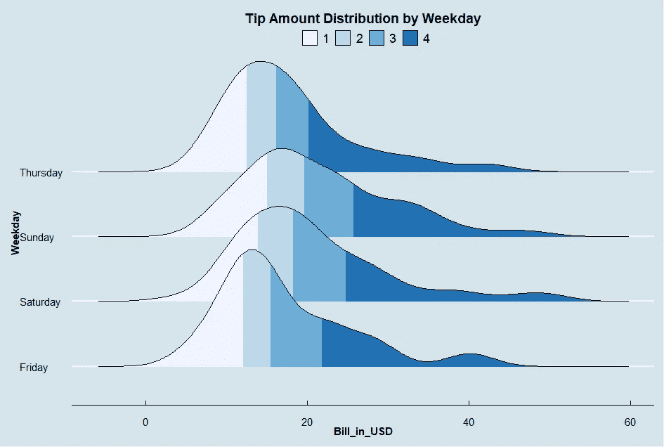
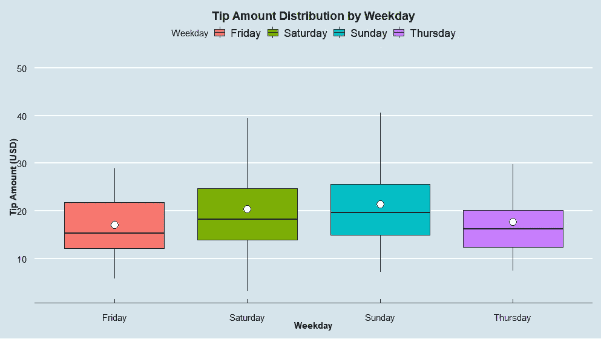
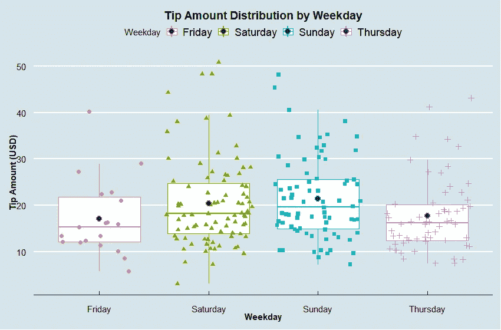
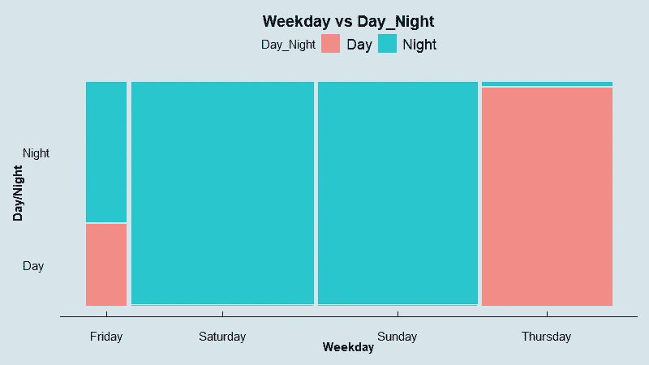
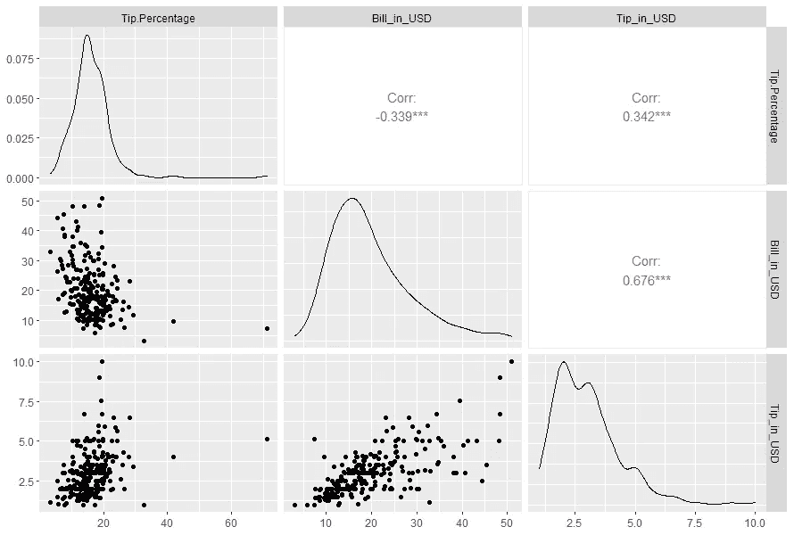

# 7 天挑战—掌握 Ggplot2:第 4 天—惊人的统计图表

> 原文：<https://towardsdatascience.com/7-day-challenge-mastering-ggplot2-day-4-stunning-statistical-graphs-a3d005e55e19>

## 通过有洞察力的图表了解您的数据


[Hồ Ngọc Hải](https://unsplash.com/@hongochai10?utm_source=medium&utm_medium=referral) 在 [Unsplash](https://unsplash.com?utm_source=medium&utm_medium=referral) 上拍照

# 第一句话

经过几周的期末考试，我现在可以休息了，继续我的 Ggplot2 学习挑战。

虽然有很多数据可视化的工具，但是我相信理解 R 可视化还是很有必要的。所说的 R 是一种专门为统计研究设计的语言，它包括美观的可视化工具，如 ggplot2、scatterplot3D 和其他有助于解释统计数据的工具。

下面是三篇关于 [***条形图***](/7-day-challenge-mastering-ggplot2-day-1-bar-chart-4b2ced928a31)[***线图***](/7-day-challenge-mastering-ggplot2-day-2-line-graph-2cfbdf164c81) 和[***SlopI ' draph***](/7-day-challenge-mastering-ggplot2-day-3-slope-graph-a7cb373dc252)的文章，我想分享一下我在寻找对统计有帮助的图表时的发现。

# 我们涵盖的内容

本文将介绍一些我认为统计挖掘所必需的统计操作的图表。有:

1.  显示数据分布的图形:直方图、箱形图、小提琴图、点状图、密度和抖动图。
2.  显示解释变量和响应变量之间关系的图表:散点图矩阵、镶嵌图。

# 资料组

EX2。TIPS，不同聚会中小费金额的记录，是我对本文所用数据集的选择。我在以前的文章中也使用了这个数据，因为它很容易生成。可以快速获取 R `regclass`包中的数据集。

```
library(regclass)
data(EX2.TIPS)
skim(EX2.TIPS)
```



图 1:数据汇总—按作者分类的图片

# 直方图

直方图是一种通过绘制不同高度的条形来可视化连续样本数据分布的方法。每个条柱代表一个数值范围，条柱越高，意味着相应范围内的数据越多。

在 ggplot2 中，您可以使用`ggplot()`和`geom_histogram()`轻松生成直方图。此外，我们还可以通过控制独特的属性来自定义图形，例如:

*   `bins`:设置您想要在图表中显示的箱子数量。默认数字是 30。如果您希望您的直方图类似于密度图，您可以使用大量的面元。或者，如果你想让你的图更大，设置一个更小的箱数。
*   `fill`:帮你自定义条块的填充颜色。垃圾箱的默认颜色是灰色，看起来很沉闷。
*   `color`:控制箱子的颜色边框。
*   `binwidth`:修改条形的宽度。
*   `scale_y_continuous(labels = percent)`:改变 y 轴来表示占总数的百分比。

我相信每个人都很熟悉直方图的基本图形。但是，下面是一些我认为有助于提供分析所需的更高级的属性:

*   `geom_vline`:用于说明数据的平均值、偏离平均值的标准偏差数等。
*   `geom_density`:结合密度图，传达更有见地的观点。
*   `geom_text:`为重要点添加注释，如最小值、最大值、中间值等。

这是我在定制了图表的不同图层后得到的结果。在图中，我将可视化所有参加聚会的人的小费金额分布。



图 2a:完整的直方图——按作者分类的图像

图 2b:直方图代码—按作者分类的图像

# 密度图

如果您想将直方图与密度图结合起来，使图表更具洞察力，以下是您的操作方法:



图 2c:密度图—作者图片

当进行不同组的分布比较时，在唯一的图中绘制不同组的密度图有时是有用的。例如，下图显示了男性和女性的小费金额分布。看一下图表，很容易看出女人给的小费往往比男人少。



图 3:按性别划分的密度图——按作者划分的图像

在另一种情况下，如果您想要创建脊线可视化，可以尝试使用`geom_density_ridges()`进行可视化。我们甚至可以通过设置`stat(quantile)`到`fill`并调用`calc_ecdf`和`geom = "density_ridges_gradient".`来用不同的颜色填充数据分位数。下图描述了一周中每个人每天支付的小费数量。



图 4: D `ensity ridges` —作者图片

# 箱线图

通常，通过显示数据百分位数和平均值，箱线图或小提琴图可视化可以帮助理解数据分布和偏斜度。

使用 ggplot 的盒图可视化非常简单，例如使用`ggplot()`和`geom_boxplot().`，仍然使用**“小费金额”**数据，让我们看看这些数据如何按**“工作日”**分布。



图 5:添加平均分数的箱线图——作者图片

对于基本的箱形图，平均点不会显示在图形中。这就是为什么我们必须在剧情中加入`stat_summary(fun="mean")`才能让它出现。我们可以看到，对于每个级别的**、**、【中值】、**、【小费金额】、**各不相同。因此，我们可能会怀疑小费和一周中的天数之间的关系。

# 抖动图

有时，添加抖动点有助于探索数据的基本分布。在上面的例子中，让我们看看我是如何可视化添加了抖动点的图形的。

代码其实很简单，只需要给盒子剧情代码加一层`geom_jitter()`，下面就是结果:



图 6:方框图和抖动点的组合—作者图片

# 马赛克图

镶嵌图用于描述两个分类变量之间的模式，并检查它们之间的关系。例如，如果我想检查**【工作日】**和**【白天 _ 夜晚】**变量之间的关系，马赛克图可能是一个有用的方法。在下面的图 7 中:

*   **每个条形的宽度**代表相应的总值。由于周六的酒吧最宽，这意味着周六参加派对的人数最多。与此同时，根据数据，人们似乎在周五比其他日子出门少。
*   对于 x 的每一级，y 的分布是不同的。所以，我们可以怀疑 x 和 y 变量之间的关系。



图 7:分类变量的镶嵌图——作者图片

# 散点图矩阵

最后，检查变量之间关系的一个非常有用的可视化函数是`ggpairs()`。通过一行代码，我们可以快速生成所有变量的相关矩阵。例如，小费和账单之间的线性关系如下图所示。

```
library(GGally)ggpairs(EX2.TIPS[c("Tip.Percentage","Bill_in_USD","Tip_in_USD")])
```



图 8:相关矩阵——作者图片

# 临终遗言

在学习这些可视化的同时，我发现了一些学习 R 有用的页面，分别是 [**R-blog**](https://www.r-bloggers.com/2020/05/4-great-alternatives-to-standard-graphs-using-ggplot/) 和**[**R-charts**](https://r-charts.com/)。他们一步一步地描述生成你期望的图形。如果你想了解更多关于 ggplot 的知识，并以更复杂的方式定制你的图表，我强烈推荐这两个。**

**希望文章有帮助。**

**新年快乐。**

# **参考**

**[](https://r-charts.com/) [## R CHARTS |用 R 编程语言制作的图表和图形集合

### 这个网站是作为学习如何用 R 语言创建图表的参考而创建的，也是一个寻找…

r-charts.com](https://r-charts.com/) [](https://www.r-bloggers.com/) [## r 博客

### 由数百个 R 博客提供的 R 新闻和教程

www.r-bloggers.com](https://www.r-bloggers.com/)**