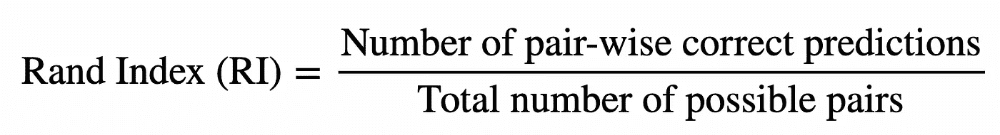
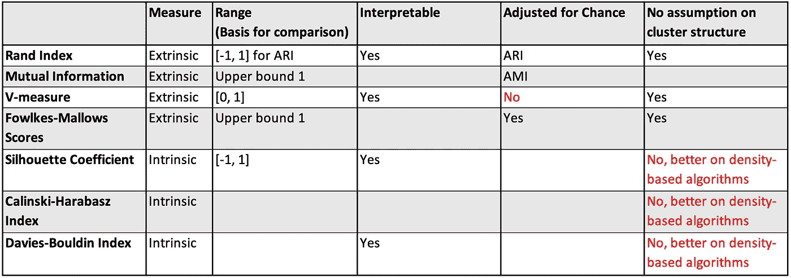
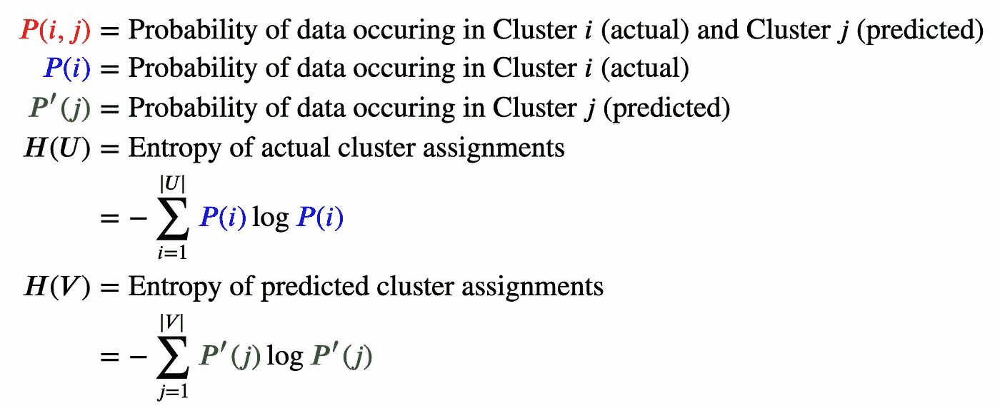
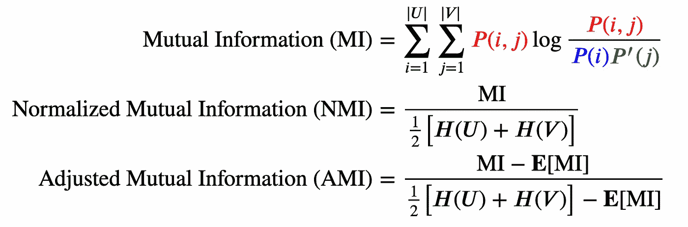
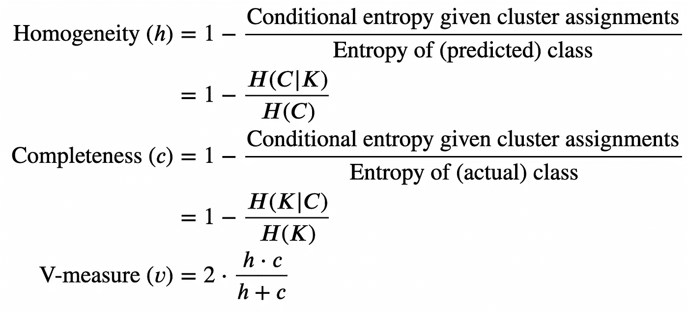
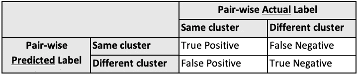
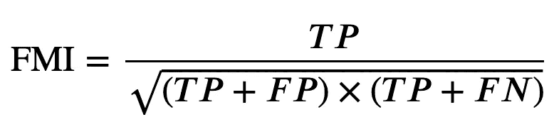
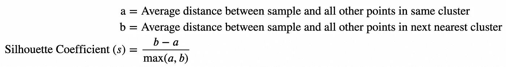
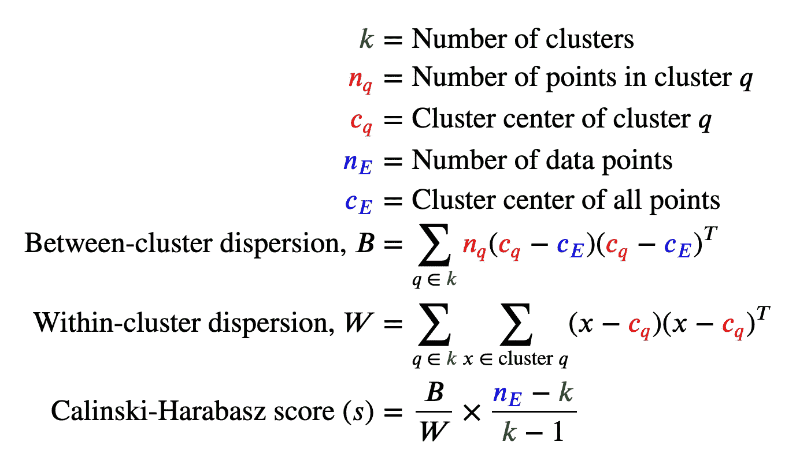
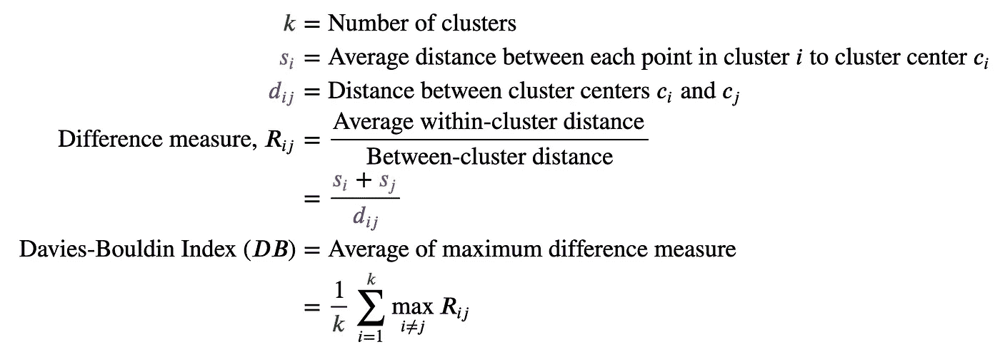

# 聚类算法的 7 个评估指标

> 原文：<https://towardsdatascience.com/7-evaluation-metrics-for-clustering-algorithms-bdc537ff54d2>

## 用 Python 示例深入解释无监督学习评估指标


马库斯·斯皮斯克在 [Unsplash](https://unsplash.com?utm_source=medium&utm_medium=referral) 上的照片

在监督学习中，标签是已知的，可以通过将预测值与标签进行比较来计算正确程度，从而进行评估。然而，在无监督学习中，标签是未知的，这使得很难评估正确的程度，因为没有**地面真理**。

也就是说，*好的*聚类算法的聚类具有**小的类内方差**(类中的数据点彼此相似)和**大的类间方差**(类与其他类不同)。

有两种类型的聚类评估指标，

*   **外在测量**:这些测量需要基本事实标签，但在实践中可能无法获得
*   **内在度量**:这些度量不需要基础事实标签(适用于所有无监督学习结果)

本文将讨论聚类算法的各种评估指标，重点是它们的定义、直觉、何时使用它们，以及如何用`sklearn`库实现它们。所有算法的公式都可以在文章的附录部分找到。

> **注**:我手动检查了所有的算法和公式，如果你需要计算，请联系我！另外，对于每种算法，变量和公式都用文字和等式来解释，以便更好地理解——更多信息请见附录:)

# 目录

## **外在措施**

*   [兰德指数](https://medium.com/p/bdc537ff54d2/#7226)
*   [相互信息](https://medium.com/p/bdc537ff54d2/#ebd4)
*   [垂直测量](https://medium.com/p/bdc537ff54d2/#7bda)
*   [福尔克斯-马洛得分](https://medium.com/p/bdc537ff54d2/#2a9e)

## 内在措施

*   [轮廓系数](https://medium.com/p/bdc537ff54d2/#2071)
*   [卡林斯基-哈拉巴斯指数](https://medium.com/p/bdc537ff54d2/#949d)
*   [戴维斯-波尔丁指数](https://medium.com/p/bdc537ff54d2/#5f41)

## [附录:措施公式](https://medium.com/p/bdc537ff54d2/#0968)


照片由[安格拉·坎普](https://unsplash.com/@angelekamp?utm_source=medium&utm_medium=referral)在 [Unsplash](https://unsplash.com?utm_source=medium&utm_medium=referral) 上拍摄

> 外在测量需要地面真实标签，这可能是不可用的或需要人工标记。

# №1.兰德指数

> Rand Index (RI，ARI)通过进行成对比较来测量聚类分配之间的相似性。更高的分数意味着更高的相似性。

对于每一对，如果当它们在同一个聚类中时，预测该对在同一个聚类中，则认为是正确的(有点像“真正”)，如果当它们确实在不同的聚类中时，预测该对在不同的聚类中，则认为是正确的(有点像“真负”)。



图 1:兰德指数公式——作者图片

但是，兰德指数不考虑偶然性；如果群集分配是随机的，那么可能会有许多侥幸“真阴性”的情况。理想情况下，我们希望随机(统一)标签分配的分数接近 0，这需要随机调整。

**调整后的 Rand 指数(ARI)** 通过贴现一个机会标准化项来调整机会。ARI 的公式可以在本文的附录(图 2)中找到，以避免视觉混乱。

## 何时使用兰德指数

*   你想要**可解释性** : RI 直观且易于理解。
*   您**对聚类结构**不确定:RI 和 ARI 不对聚类结构做出假设，并且可以应用于所有聚类算法。
*   你想要一个**的比较基础** : RI 有界在`[0, 1]`区间，ARI 有界在`[-1, 1]`区间。有界范围便于比较不同算法之间的分数。

## 何时不使用 Rand 指数

*   您没有基本事实标签:RI 和 ARI 是外部度量，需要基本事实聚类分配。

## 实施兰德指数

```
from sklearn.metrics import rand_score, adjusted_rand_score
labels = [0, 0, 0, 1, 1, 1]
labels_pred = [1, 1, 2, 2, 3, 3]

RI = rand_score(labels, labels_pred)
ARI = adjusted_rand_score(labels, labels_pred)
```

# №2.相互信息(MI、NMI、AMI)

> 互信息(MI、NMI、AMI)测量集群分配之间的一致性。更高的分数意味着更高的相似性。

聚类之间的一致程度通过联合概率和边际概率来计算。互信息有两种变体:**归一化互信息(NMI)** 和**调整互信息(AMI)** 。

归一化 MI 是指 MI 除以平均聚类熵，通常在文献中使用，而调整 MI 是指通过贴现机会归一化项对机会进行调整的归一化 MI。MI、NMI 和 AMI 的公式可在本文的附录中找到(图 3 和图 4)。

## 何时使用互信息

*   你需要一个**的比较基础** : MI、NMI 和 AMI 的上界都是 1。

## 何时不使用交互信息

*   您没有基本事实标签:MI、NMI 和 AMI 是外部度量，需要基本事实聚类分配。

## 实现相互信息

```
from sklearn.metrics import (
    mutual_info_score,
    normalized_mutual_info_score,
    adjusted_mutual_info_score,
)
labels = [0, 0, 0, 1, 1, 1]
labels_pred = [1, 1, 2, 2, 3, 3]

MI = mutual_info_score(labels, labels_pred)
NMI = normalized_mutual_info_score(labels, labels_pred)
AMI = adjusted_mutual_info_score(labels, labels_pred)
```

# №3.垂直测量

> V-measure 使用条件熵分析来测量聚类分配的正确性。更高的分数意味着更高的相似性。

两个度量标准衡量聚类分配的正确性，这是直观的，因为它们来自监督学习。

*   **同质性**:每个集群只包含一个类的成员(有点像“*精度*”)
*   **完整性**:给定类的所有成员都被分配到同一个集群中(有点像“*回忆*”)

V-measure 是同质性和完整性度量的调和平均值，类似于 F-score 是精确度和召回率的调和平均值。同质性、完整性和 V-measure 的公式可以在本文的附录中找到(图 5)。

## 何时使用垂直测量

*   您需要**可解释性** : V-measure 在同质性和完整性方面直观且易于理解。
*   您**对聚类结构**不确定:V-measure 不对聚类结构做出假设，并且可以应用于所有聚类算法。
*   您需要一个**基础来进行比较**:同质性、完整性和 V-measure 在`[0, 1]`范围内。有界范围便于比较不同算法之间的分数。

## 何时不使用垂直测量

*   您没有基本事实标签:同质性、完整性和 V-measure 是外在度量，需要基本事实聚类分配。
*   您的样本大小小于 1000，而聚类数大于 10: V-measure 不针对机会进行调整。这意味着随机标记不会产生零分，尤其是当聚类数量很大时。

## 实施垂直测量

```
from sklearn.metrics import (
    homogeneity_score,
    completeness_score,
    v_measure_score,
)
labels = [0, 0, 0, 1, 1, 1]
labels_pred = [1, 1, 2, 2, 3, 3]

HS = homogeneity_score(labels, labels_pred)
CS = completeness_score(labels, labels_pred)
V = v_measure_score(labels, labels_pred, beta=1.0)
```

# №4.福尔克斯-马洛分数

> Fowlkes-Mallows 分数使用成对精度和召回率来测量聚类分配的正确性。更高的分数意味着更高的相似性。

V-measure 是同质性("*精度*")和完整性("*召回*")之间的调和平均值，而 Fowlkes-Mallows 指数(FMI)是成对精度和召回的几何平均值，使用真阳性(TP)、假阳性(FP)和假阴性(FN)。

We Fowlkes-Mallows 评分不考虑真阴性(TN)，它不会受到偶然性的影响，也不需要偶然性调整，不像 Rand 指数和互信息。

TP、FP、FN 的定义以及 Fowlkes-Mallows 指数(FMI)的公式见本文附录(图 6 和图 7)。

## 何时使用 Fowlkes-Mallows 评分

*   你**不确定聚类结构** : Fowlkes-Mallows Score 不对聚类结构做任何假设，可以应用于所有聚类算法。
*   你要一个**的对比基础** : Fowlkes-Mallows 评分有一个上限`1`。有界范围便于比较不同算法之间的分数。

## 何时不使用福尔克斯-马洛分数

*   您没有基本事实标签:Fowlkes-Mallows 分数是外在的度量，需要基本事实聚类分配。

## 实现 Fowlkes-Mallows 评分

```
from sklearn.metrics import fowlkes_mallows_score
labels = [0, 0, 0, 1, 1, 1]
labels_pred = [1, 1, 2, 2, 3, 3]

FMI = fowlkes_mallows_score(labels, labels_pred)
```


照片由[皮埃尔·巴明](https://unsplash.com/@bamin?utm_source=medium&utm_medium=referral)在 [Unsplash](https://unsplash.com?utm_source=medium&utm_medium=referral) 上拍摄

> 内在的措施不需要地面真相标签，使他们适用于所有聚类结果

# №5.轮廓系数

> 剪影系数衡量聚类之间的距离与聚类内的距离。较高的分数表示更好定义的聚类。

样本的轮廓系数测量样本与下一个最近聚类中所有其他点相对于其聚类中所有其他点的平均距离。较高的比率表示该聚类远离其最近的聚类，并且该聚类被更好地定义。

一组样本的轮廓系数取每个样本的平均轮廓系数。该公式可在本文的附录中找到(图 8)。

## 何时使用轮廓系数

*   你要**可解释性**:廓形系数直观易懂。
*   你要一个**的比较基础**:剪影系数有一个`[-1, 1]`的范围，从不正确的聚类到高度密集的聚类，`0`是重叠的聚类。有界范围便于比较不同算法之间的分数。
*   您将好的聚类定义为**定义明确的聚类**:剪影系数遵循好的聚类的一般定义，即密集且分离良好。

## 何时不使用轮廓系数

*   您正在比较不同类型的聚类算法:基于密度的聚类算法的轮廓系数得分往往更高，与其他类型的聚类算法进行比较是不公平的。

## 实施轮廓系数

```
from sklearn.metrics import silhouette_score
data = [
    [5.1, 3.5, 1.4, 0.2],
    [4.9, 3\. , 1.4, 0.2],
    [4.7, 3.2, 1.3, 0.2],
    [4.6, 3.1, 1.5, 0.2],
    [5\. , 3.6, 1.4, 0.2],
    [5.4, 3.9, 1.7, 0.4],
]
clusters = [1, 1, 2, 2, 3, 3]

s = silhouette_score(data, clusters, metric="euclidean")
```

# №6.卡林斯基-哈拉巴斯指数

> Calinski-Harabasz 指数衡量的是组间离差和组内离差。较高的分数表示更好定义的聚类。

Calinski-Harabasz 指数或方差比标准衡量组间离差之和与组内离差之和，其中离差是距离平方之和。

较高的比率表示该分类远离其其他分类，并且该分类更加明确。该公式可在本文的附录中找到(图 9)。

## 何时使用卡林斯基-哈拉巴斯指数

*   你想要效率:卡林斯基-哈拉巴斯指数计算起来很快
*   你将好的集群定义为**定义明确的集群** : Calinski-Harabasz 指数遵循好的集群的一般定义，即密集且分离良好。

## 何时不使用卡林斯基-哈拉巴斯指数

*   您正在比较不同类型的聚类算法:对于基于密度的聚类算法，Calinski-Harabasz 指数往往更高，与其他类型的聚类算法进行比较是不公平的。

## 实施卡林斯基-哈拉巴斯指数

```
from sklearn.metrics import calinski_harabasz_score
data = [
    [5.1, 3.5, 1.4, 0.2],
    [4.9, 3\. , 1.4, 0.2],
    [4.7, 3.2, 1.3, 0.2],
    [4.6, 3.1, 1.5, 0.2],
    [5\. , 3.6, 1.4, 0.2],
    [5.4, 3.9, 1.7, 0.4],
]
clusters = [1, 1, 2, 2, 3, 3]

s = calinski_harabasz_score(data, clusters)
```

# №7.戴维斯-波尔丁指数

> Davies-Bouldin 指数根据簇之间的平均距离来测量簇的大小。较低的分数表示更好定义的聚类。

Davies-Bouldin 指数衡量聚类之间的平均相似性，其中相似性将聚类的大小与聚类之间的距离进行比较。

较低的分数意味着该聚类与到另一个聚类的距离相比相对较小，因此定义良好。该公式可在本文的附录中找到(图 10)。

## 何时使用戴维斯-波尔丁指数

*   你想要**可解释性**:戴维斯-波尔丁指数比剪影分数更容易计算，它使用逐点距离。

## 何时不使用戴维斯-波尔丁指数

*   您正在比较不同类型的聚类算法:基于密度的聚类的 Davies-Bouldin 指数往往更高，与其他类型的聚类算法进行比较是不公平的。
*   除了欧几里德距离之外，您还需要其他距离度量:由质心距离计算的聚类大小将距离度量限制在欧几里德空间。

## 实施戴维斯-波尔丁指数

```
from sklearn.metrics import davies_bouldin_score
data = [
    [5.1, 3.5, 1.4, 0.2],
    [4.9, 3\. , 1.4, 0.2],
    [4.7, 3.2, 1.3, 0.2],
    [4.6, 3.1, 1.5, 0.2],
    [5\. , 3.6, 1.4, 0.2],
    [5.4, 3.9, 1.7, 0.4],
]
clusters = [1, 1, 2, 2, 3, 3]

DB = davies_bouldin_score(data, clusters)
```

# 结论

每种算法的特征总结如下:



表 1:聚类算法的特征—按作者分类的图片

我希望您已经更多地了解了评估聚类算法的不同方法——根据您是否有基本事实标签，使用内部和外部度量。在实践中，我们可能更关心集群**是否有商业意义**，而不是通过统计测量集群内部或之间的距离。尽管如此，这些评估指标仍然值得了解！

# 附录

## 兰德指数(ARI)公式

机会标准化项考虑在实际聚类分配和预测聚类分配中出现在同一聚类中的对的数量。


图 2:机会标准化术语和调整后的 Rand 指数的公式——作者图片

## 互信息公式(MI，NMI，AMI)

联合概率、边际概率和熵的公式构成了计算互信息的基础。



图 3:联合概率、边际概率和熵的公式——作者图片



图 4:MI、标准化 MI 和调整 MI 的公式——作者图片

## V-measure 公式



图 5:同质性、完整性和 V-measure 公式——作者图片

## 福尔克斯-马洛得分公式

Fowlkes-Mallows 指数(FMI)是使用真阳性、假阳性和假阴性计算的。TP、FP 和 FN 的定义是通过计算成对点的数量来完成的，如果它们被分配在预测和实际标签的相同或不同聚类中的话。



图 6:TP、FP、TN、FN 的定义——作者图片



图 7:fowl KES-Mallows 评分公式——作者图片

## 轮廓系数公式

请注意，对于`b`的计算，它考虑的是距离样本本身最近的下一个聚类，而不是距离指定聚类最近的下一个聚类。



图 8:剪影系数公式—作者图片

## 卡林斯基-哈拉巴斯指数



图 9:卡林斯基-哈拉巴斯指数公式——作者图片

## 戴维斯-波尔丁指数



图 10:戴维斯-波尔丁指数公式——作者图片

# 相关链接

*   `sklearn`文档:[https://sci kit-learn . org/stable/modules/clustering . html # clustering-performance-evaluation](https://scikit-learn.org/stable/modules/clustering.html#clustering-performance-evaluation)