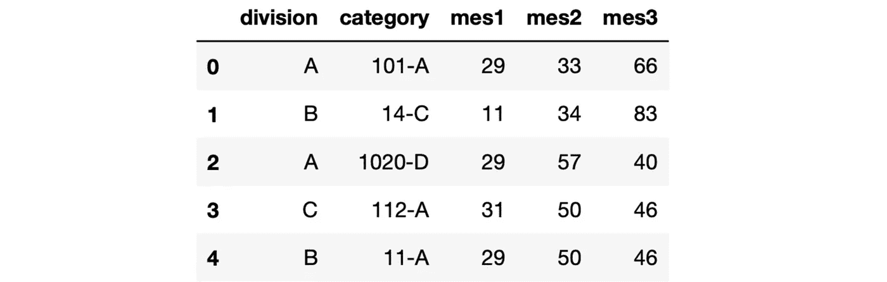
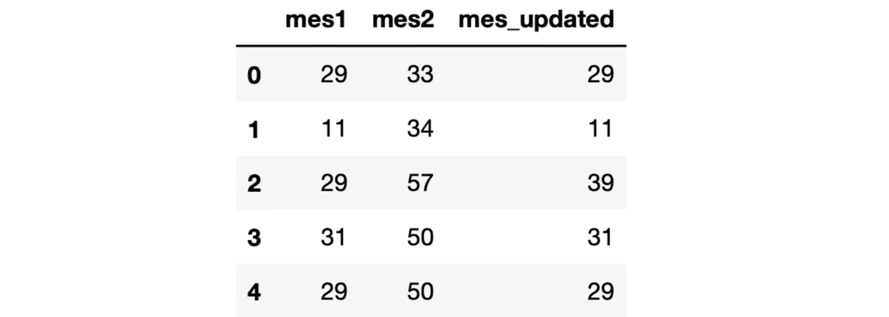
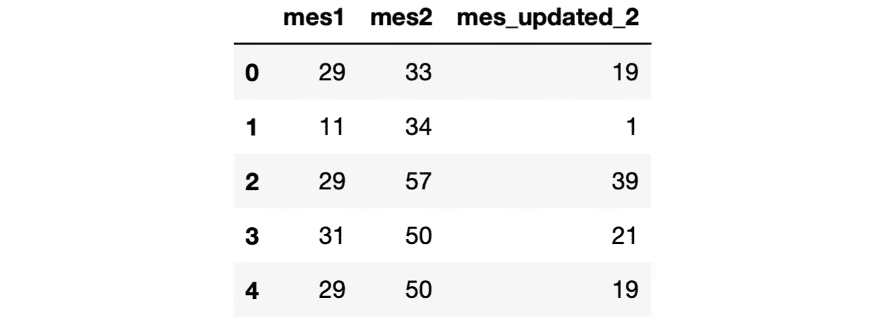
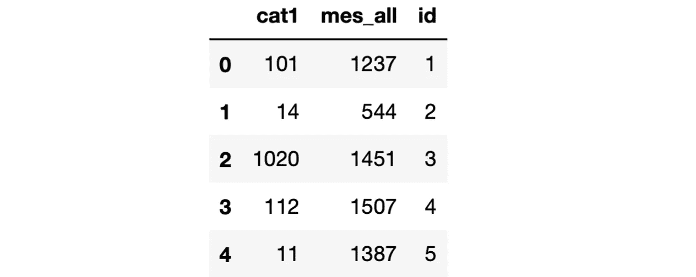
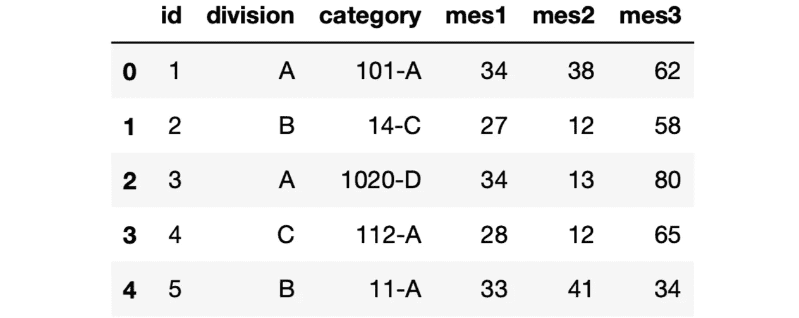
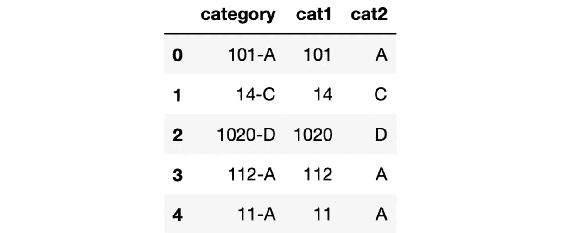

# 您可以使用 7 个函数在 Pandas 数据框架中创建新列

> 原文：<https://towardsdatascience.com/7-functions-you-can-use-to-create-new-columns-in-a-pandas-dataframe-a6b480cf8b30>

## 数据分析、数据清理和特征工程中的典型任务


莱尔·哈斯蒂在 [Unsplash](https://unsplash.com/s/photos/seven?utm_source=unsplash&utm_medium=referral&utm_content=creditCopyText) 上的照片

Pandas DataFrame 是一个二维数据结构，带有标记的行和列。一行代表一个观察值(即一个数据点)，列是描述观察值的特征。

我们有时需要创建一个新列来添加一条关于数据点的信息。这些列可以从现有列派生，也可以从外部数据源派生新列。

在本文中，我们将了解 7 个可用于创建新列的函数。

让我们从创建一个样本数据帧开始。

```
import numpy as np
import pandas as pddf = pd.DataFrame({ "division": ["A", "B", "A", "C", "B"],
    "category": ["101-A", "14-C", "1020-D", "112-A", "11-A"],
    "mes1": np.random.randint(10, 40, size=5),
    "mes2": np.random.randint(10, 60, size=5),
    "mes3": np.random.randint(10, 100, size=5)

})df
```



df(作者图片)

# 1.熊猫在哪里

Pandas 的 where 函数可用于根据其他列中的值创建一个列。

我们定义一个条件或一组条件，然后取一列。对于符合条件的行，此列中的值保持不变。其他值将替换为指定的值。

用一个例子更容易理解。假设我们希望根据 mes2 列上的条件更新 mes1 列中的值。

如果 mes2 中的值大于 50，我们要在 mes1 中的值上加 10。否则，我们希望保持值不变。下面是我们如何使用 where 函数来执行这个操作。

```
df["mes_updated"] = df["mes1"].where(

    df["mes2"] <= 50, 
    df["mes1"] + 10)df[["mes1", "mes2", "mes_updated"]]
```



(图片由作者提供)

正如我们在上面的输出中看到的，符合条件(mes2 ≤ 50)的值保持不变。其他值通过加 10 来更新。

# 2.哪里的数字

NumPy 的 where 功能比熊猫灵活。我们能够为符合给定条件的行赋值。这对于熊猫的 where 函数是不可能的，因为符合条件的值保持不变。

让我们做同样的例子。如果 mes2 中的值大于 50，我们要在 mes1 中的值上加 10。否则，我们要减去 10。

```
df["mes_updated_2"] = np.where(

    df["mes2"] <= 50, 
    df["mes1"] - 10,
    df["mes1"] + 10)df[["mes1", "mes2", "mes_updated_2"]]
```



(图片由作者提供)

# 3.数字选择

where 函数根据一组条件赋值。select 函数更进一步。它接受多组条件，并且能够为每组条件分配不同的值。

让我们基于以下条件创建一个新列:

*   如果除法是 A 并且 mes1 大于 10，则值为 1
*   如果除法是 B 且 mes1 大于 10，则值为 2
*   否则，该值为 0

```
conditions = [

  (df["division"] == "A") & (df["mes1"] > 10),
  (df["division"] == "B") & (df["mes1"] > 10)

]values = [1, 2]df["select_col"] = np.select(conditions, values, default=0)df[["division", "mes1", "select_col"]]
```


(图片由作者提供)

条件和相关值写在单独的 Python 列表中。默认参数指定不符合任何列出条件的行的值。

# **4。熊猫分配**

Pandas 的分配功能可用于在一次操作中创建多个列。我们可以基于现有的列派生列，或者从头开始创建。如果我们采用后者，我们需要确保变量的长度与数据帧中的行数相同。

我们来做一个例子。

```
df = df.assign(

    cat1 = df["category"].str.split("-", expand=True)[0],
    mes_all = lambda x: x.mes1 ** 2 + x.mes2 * 10 + x.mes3,
    id = [1, 2, 3, 4, 5])
```

我们创建了 3 个新列:

*   第一个是类别列中字符串的第一部分，通过字符串拆分得到。
*   第二个是使用涉及 mes1、mes2 和 mes3 列的计算创建的。
*   第三个只是一个整数列表。

以下是新列:



(图片由作者提供)

# 5.熊猫插页

当我们为数据帧创建一个新列时，它被添加到末尾，因此它成为最后一列。insert 函数允许根据列索引指定新列的位置。

让我们创建一个 id 列，并将其作为数据帧中的第一列。

```
df.insert(0, "id", [1, 2, 3, 4, 5])df
```



(图片由作者提供)

insert 函数有 3 个参数:

*   第一个是新列的索引(0 表示第一个)。
*   第二个是新列的名称。
*   第三个是新列的值。

# 6.熊猫分裂了

在处理文本数据时，split 函数非常有用。假设我们有一个包含多条信息的文本列。我们可以拆分它，为每个部分创建一个单独的列。

> **注意**:在 str 访问器下可以使用 split 函数。

让我们通过拆分 category 列来创建 cat1 和 cat2 列。

```
df[["cat1","cat2"]] = df["category"].str.split("-", expand=True)df[["category","cat1","cat2"]]
```



(图片由作者提供)

# 7.熊猫猫

cat 功能与 split 功能相反。它可用于通过组合字符串列来创建新列。在 str 访问器下也可以使用 cat 函数。

下面是我们如何通过合并 cat1 和 cat2 列来创建 category 列。

```
df["category"] = df["cat1"].str.cat(df["cat2"], sep="-")
```

在用于机器学习的数据分析、数据清理和特征工程的典型任务中创建新列。幸运的是，Pandas 通过提供几个函数和方法使它变得非常容易。在本文中，我们介绍了加速和简化这些操作的 7 个功能。

*你可以成为* [*媒介会员*](https://sonery.medium.com/membership) *解锁我的全部写作权限，外加其余媒介。如果你已经是了，别忘了订阅**如果你想在我发表新文章时收到电子邮件。***

*感谢您的阅读。如果您有任何反馈，请告诉我。*