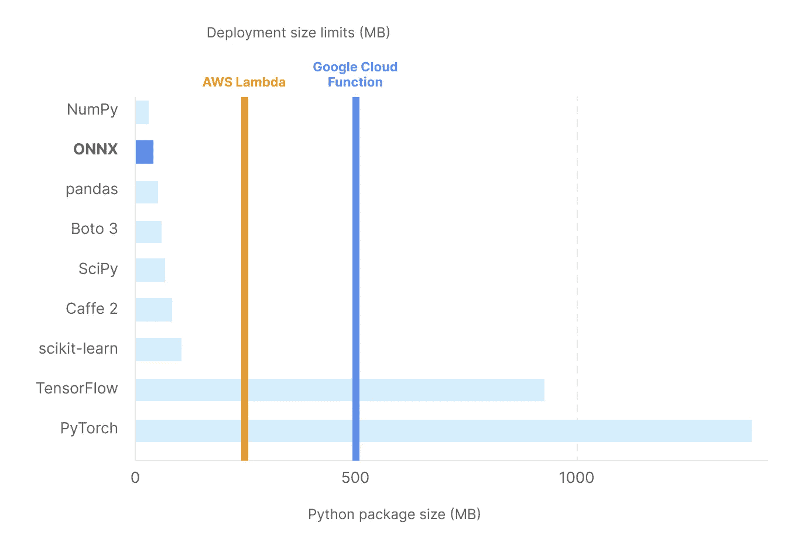

# 我从使用 ONNX 部署机器学习模型中学到的 7 个教训

> 原文：<https://towardsdatascience.com/7-lessons-ive-learnt-from-deploying-machine-learning-models-using-onnx-3e993da4028c>

## 一次构建，随处部署的绝佳方式


奥丽雅·丹尼尔维奇在[的照片](https://www.pexels.com/photo/man-sitting-in-front-of-three-computers-4974915/)

在本帖中，我们将概述从一个在 AWS Lambda 函数中使用 ONNX 运行时 API 在 sci-kit 学习模型上运行推理的真实示例中获得的关键知识。这不是一个教程，而是一个指南，集中在有用的技巧，要考虑的要点，和可能会让你省掉一些挠头的怪癖！

# ONNX 是什么？

[开放神经网络交换(ONNX)](https://onnx.ai/) 格式有点像把你的薯条蘸上奶昔；它不应该工作，但它就是工作。(嗯，反正对我来说)。

ONNX 允许我们使用所有我们知道并喜欢的训练框架(如 PyTorch 和 TensorFlow)来建立模型，并将其打包成许多硬件架构和操作系统支持的格式。ONNX 运行时是一个简单的 API，它是跨平台的，并提供最佳的性能来在 ONNX 模型上运行推理，只要你需要:云、移动设备、物联网设备，你能想到的！

我们选择的编程语言或运行时决定我们如何构建人工智能的日子已经一去不复返了。

要更深入地了解 ONNX，请查看本文: [ONNX —变得简单](/onnx-made-easy-957e60d16e94)。

# 我们怎么知道它有效？

在 [Bazaarvoice](https://www.bazaarvoice.com/) ，我们通过增强产品的用户生成内容(UGC)来改善数百万人的电子商务体验。其中很大一部分是产品匹配的过程，或者换句话说，确定两种产品在零售商之间是相同的。由于唯一的产品标识符，大部分工作可以自动完成，但是，有数百万种产品缺少这种重要的数据。

为了解决这个问题，我们建立了一个机器学习模型，它可以自动化产品匹配过程，并在全球范围内部署它，现在它可以准确匹配世界上一些最大品牌的数百万种产品。

# 先决条件

虽然其中一些经验适用于多个工作流，但需要注意的是，它们是基于我的团队对我们使用的技术的经验:

*   机器学习模型是使用 [scikit-learn](https://scikit-learn.org/stable/) 作为训练框架用 Python 编写的
*   我们使用 [onnxruntime-node npm 包](https://www.npmjs.com/package/onnxruntime-node)在 Node.js 环境中运行 ONNX 模型
*   使用[无服务器框架将模型部署到 AWS Lambda](https://www.serverless.com/framework/docs/providers/aws/guide/intro)

# 🌎第 1 课:一次构建，随处部署

ONNX 的最大卖点之一是它的多功能性和防止框架锁定的能力，所以不要陷入选择语言或部署环境，甚至是操作系统的困境。**选择适合自己和项目的。**

有许多与 ONNX 格式兼容的[培训框架](https://onnx.ai/supported-tools.html#buildModel)和各种流行的[部署运行时](https://onnx.ai/supported-tools.html#deployModel)。你可以在这里找到方便的兼容性指南。

关于 web 应用部署目标的更多信息可以在 [ONNX 运行时文档](https://onnxruntime.ai/docs/reference/build-web-app.html)中找到。

# ⚠️第二课:“错误:非张量类型暂时不被支持。”

标题中的错误是我们在试图使用 [onnxruntime-node](https://www.npmjs.com/package/onnxruntime-node) npm 包在 Node.js 运行时运行从 Python (scikit-learn)导出的 ONNX 模型时遇到的问题。

由于错误消息，所有线索都暗示问题出在 onnxruntime-node 包中，但是，**问题的根源在于从 scikit-learn 到 ONNX 的转换代码**。

修复非常简单，使用来自 [onnx.ai](http://onnx.ai) 网站的 [sklearn-onnx 示例](https://onnx.ai/sklearn-onnx/index.html)代码示例，**我们需要添加一个** `**options**` **变量，并将** `**zipmap**` **设置为 false** :

```
# Convert into ONNX format
from skl2onnx import convert_sklearn
from skl2onnx.common.data_types import FloatTensorType
initial_type = [('float_input', FloatTensorType([None, 4]))]
onx = convert_sklearn(clr, initial_types=initial_type, **options={'zipmap': False})**  # enables getting probabilities in Node
with open("rf_iris.onnx", "wb") as f:
    f.write(onx.SerializeToString())
```

通过将`zipmap`设置为 false，我们现在可以在 Node.js 运行时接收概率输出。

有关导出的更多信息，请参见 [ONNX 教程 GitHub repo](https://github.com/onnx/tutorials#services) 。它为使用[机器学习框架](https://github.com/onnx/tutorials#converting-to-onnx-format)和[云服务](https://github.com/onnx/tutorials#services)开发的模型提供了很好的描述和例子。

# 📚第 3 课:用于数据帧操作的 JavaScript 库

几个 npm 库提供了 DataFrame 风格的数据转换(拆分、连接、分组等)。选择最好的取决于您的用例。我们使用的两个库是 [danfo.js](https://danfo.jsdata.org/) 和 [dataframe-js](https://www.npmjs.com/package/dataframe-js) 。

danfo-js 建立在 [tensorflow-js](https://www.tensorflow.org/js) 之上，将数据处理、机器学习和人工智能工具带到 JavaScript 开发者的手中。它深受熊猫的启发。这意味着如果你熟悉熊猫 API，danfo.js 应该是一个平滑的过渡。

dataframe-js 是用更具功能性的编程启发的 API 构建的，所以如果你更熟悉 JavaScript，你可能会觉得使用 dataframe-js 比 danfo-js 更舒服。

danfo-js 和 dataframe-js 都非常适合我们的用例，并提供了复杂特征工程所需的所有功能。**danfo-js 的主要缺点是包的大小。对于我们的无服务器应用程序来说，它太大了，而“dataframe-js”打包在 1Mb 以下，这是无服务器应用程序的理想选择。**

选择库时要考虑的一些其他标准是:

*   语言支持(NodeJS vs browser JS vs Typescript)
*   依赖性(即，如果它使用底层库)
*   积极支持(积极的用户基础、积极的资源存储库等)
*   JS 库的大小/速度
*   表演
*   功能/灵活性
*   易于使用
*   内置可视化功能

其他数据帧操作库包括:

*   [数据伪造](https://github.com/data-forge/data-forge-ts)
*   [jsdataframe](https://www.npmjs.com/package/jsdataframe)
*   [数据框](https://www.npmjs.com/package/dataframe)
*   [SQL 框架](https://sqlframes.com/)

# 📦第四课:使用 [*无服务器-插件-优化*](https://www.npmjs.com/package/serverless-plugin-optimize) 插件

在进行无服务器部署时，保持项目包较小是非常重要的。下图显示了数据科学家最常用的一些库的 Python 包大小。我们可以看到他们如何吃掉 AWS Lambdas 和 Google Cloud 功能的大量部署规模限制。



流行框架的 Python 包大小和云部署限制。作者照片

然而，我们可以在这些限制内工作。ONNX 将 PyTorch、Tensorflow 和 pandas 等创建的模型转换成与相对较小的 ONNX 运行时包(~13MB)兼容的模型。这适用于某些情况，但是添加一个庞大的 *node_modules* 文件夹，超出部署限制的情况仍然很常见。

**[**无服务器-插件-优化**](https://www.npmjs.com/package/serverless-plugin-optimize) **插件显著减小了无服务器包的大小**。在我们的例子中，插件允许我们在 [50Mb 之内轻松地打包我们的模型、依赖项和代码。AWS Lambdas 的 zip 文件部署限制](https://docs.aws.amazon.com/lambda/latest/dg/gettingstarted-limits.html)。**

**要允许 AWS Lambda 访问 onnxruntime-node 包和 onnx 模型，请将以下几行添加到您的`serverless.yml`文件中:**

```
custom:
 optimize:
 external: ['onnxruntime-node', 'onnxruntime-common']
 includePaths: ['PATH_TO_ONNX_MODEL']
```

# **🚀第 5 课:将[*onnxruntime-node*](https://www.npmjs.com/package/onnxruntime-node)部署到 AWS**

**使用 [onnxruntime-node](https://www.npmjs.com/package/onnxruntime-node) 时需要注意的重要一点是 ***其中*** 你正在运行的 app 决定了 ***你应该如何*** 安装包。如果在部署时没有将它安装到正确的体系结构和/或平台上，您将会看到抛出缺失模块错误，如下所示:**

```
Runtime.ImportModuleError: Error: Cannot find module '../bin/napi-v3/linux/x64/onnxruntime_binding.node'
```

**大多数本地节点模块使用 [node-pre-gyp](https://github.com/mapbox/node-pre-gyp) ，它使用一个安装脚本来为您的 OS、arch 和 v8 ABI 组合搜索预构建的二进制文件，如果没有一个可用的，则回退到本地构建。**

**这意味着一个简单的`npm install onnxruntime-node`在本地运行时可以工作，但是**在云函数中无服务器运行时，我们需要明确地安装到我们的环境中**。**

**在我们的例子中，我们使用的 AWS Lambda 具有 x64 架构，并在 Linux 机器上运行，因此我们必须在部署 之前运行 ***的 npm 安装命令是:*****

```
npm install --arch=x64 --platform=linux onnxruntime-node
```

# **📅第 6 课:日程安排**

**如果您需要您的模型按计划自动运行，而不想手动运行您的模型——如果您使用 AWS，请尝试[将 EventBridge 添加到您的无服务器配置](https://www.serverless.com/framework/docs/providers/aws/events/event-bridge)。使用 [cron 表达式](https://docs.aws.amazon.com/eventbridge/latest/userguide/eb-create-rule-schedule.html#eb-cron-expressions)或[速率表达式](https://docs.aws.amazon.com/eventbridge/latest/userguide/eb-create-rule-schedule.html#eb-rate-expressions)设置时间表。**

**以下是添加到`serverless.yml`文件的配置示例:**

```
events:
 - http:
   path: really-cool-onnx-project
   method: post
 - eventBridge:
   enabled: true
   schedule: cron(0/20 6-13 * * ? *) # Runs every 20 minutes between 6am and 2pm (UTC) every day
   input:
    stageParams:
     stage: prod
```

**需要注意的重要一点是，**如果您的 AWS Lambda 函数在 EventBridge 调用期间超时，它将一直调用，直到执行完成**。**

**Google Cloud Functions 和 Azure Functions 也都有基于 cron-job 的调度能力，分别有[云调度器](https://cloud.google.com/scheduler)和[定时器触发器](https://docs.microsoft.com/en-us/azure/azure-functions/functions-create-scheduled-function)。**

# **📈第 7 课:高效扩展无服务器应用**

**在性能和成本之间找到最佳平衡是大规模运行无服务器应用的一个重要方面。**

**在我们的用例中，我们为每次 AWS Lambda 调用生成 10，000 个产品的预测。这是需要处理的大量数据。出于这个原因，理解 Lambda 的两个方面以优化性能是很重要的:执行时间(避免超时)和成本效率。**

**我们用六种不同的 Lambda 内存大小配置测试了我们的无服务器应用程序，并推断了我们在内存大小、执行时间和成本方面可以找到的任何结果。**

**使用六种不同的 Lambda 内存大小配置测试我们的无服务器应用的结果**

**如您所见，随着内存大小翻倍，执行时间几乎减半——直到它稳定在 4096MB，达到收益递减点。**使用更高的分配内存大小也** [**增加了 Lambda 函数**可用的虚拟 CPU](https://docs.aws.amazon.com/lambda/latest/operatorguide/computing-power.html) **的数量，从而节省了成本，因为它减少了总执行时间。****

**2048MB 的内存大小最终成为最便宜的——令人惊讶的是甚至比 256MB 还便宜，同时还快了大约 10 倍。因此，对于我们的用例，2048MB 是性能和成本之间的最佳平衡。**

# **结束语**

**希望这篇帖子在用 ONNX 和 Serverless 开发的时候对你有所帮助。在 Bazaarvoice，我们通过在全球范围内使用 ONNX 提供人工智能解决方案来支持这些技术。如果您想了解更多关于我们的 ONNX 解决方案的信息，请查看由我们的一位机器学习工程师所做的[本次会议报告](https://youtu.be/C_DWbsmrrTk?t=10680)。**

```
💻 If you have any questions, please reach out / [matthewleyburn.com](https://matthewleyburn.com/)
```

****你用过 ONNX 吗？在评论里告诉我，说说你们的经历吧！****