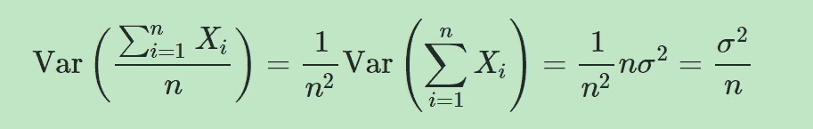
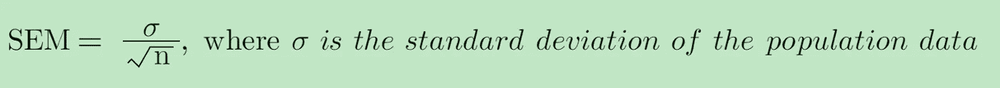
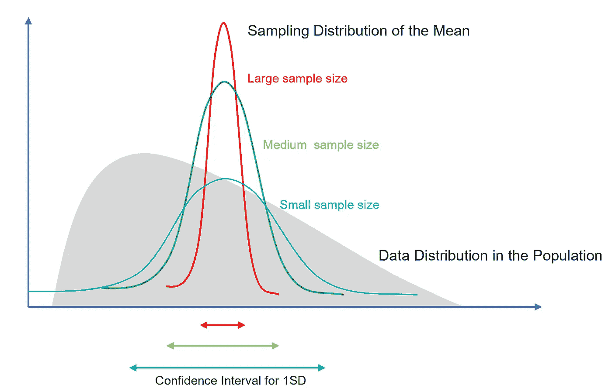

# 中心极限定理的 7 个常见问题

> 原文：<https://towardsdatascience.com/7-most-asked-questions-on-central-limit-theorem-82e95eb7d964>

## 理解中心极限定理的重要性

迈克尔·奥尔森在 [Unsplash](https://unsplash.com?utm_source=medium&utm_medium=referral) 上的照片

在本帖中，我们将解开统计学中最重要的定理之一:T4 中心极限定理。我将向你介绍这个定理的各个方面，并讨论为什么它为许多统计应用奠定了基础。

## #1:什么是中心极限定理？

> 中心极限定理指出，给定足够大的样本量，不管总体中的数据分布如何，**样本均值**的**抽样分布**将近似为**正态分布**。

如果这个定义听起来很抽象，让你感到困惑，不要担心。这篇文章将把这个复杂的定义分解成更容易理解的部分。

## #2:什么是抽样分布？

与描述总体中所有可能值的频率的**样本分布**(或数据分布)不同，**抽样分布**描述来自同一总体的多个样本的**样本统计量**(例如样本均值)的分布(即**重复抽样**)。

例如，我们从总体中收集 100 个数据点，并计算样本均值。我们重复这个过程 1000 次，有 1000 个不同的样本均值。这 1000 个样本均值的分布称为样本均值的抽样分布。

## #3:中心极限定理的条件是什么？

为了让中心极限定理发挥作用，我们需要确保满足以下 3 个条件。

1.  样本量**足够大**。
2.  样本为**独立同分布(IID)随机变量**。
3.  人口分布有**有限方差**。

## #4:如果人口分布不正态，中心极限定理是否成立？是啊！

在总体中，基础数据可以遵循不同种类的分布，例如，正态、左偏、右偏、均匀分布等。

不管总体分布如何，只要样本量足够大，样本均值的抽样分布将接近正态分布。这是统计学中一个强有力的定理。

## #5:需要多大的样本量才能产生正态近似？

> 请记住，在中心极限定理的上下文中讨论的“样本大小”不仅仅是一个样本的样本大小，它适用于抽样分布中的所有样本(即，所有样本需要具有来自同一总体的相同且足够大数量的观察值)。

样本量越大，样本均值的抽样分布就越接近正态分布。

通常，我们认为 **30** 的样本量足够大。

*   **如果样本量小于 30** ，中心极限定理不再适用。只有当总体分布也是正态分布时，样本均值的抽样分布才服从正态分布。
*   **如果样本量大于 30** ，则适用中心极限定理，无论人口分布如何，抽样分布都将遵循正态分布。然而，强偏斜分布需要更大的样本量。

## #6:样本大小如何影响均值的抽样分布？

随着样本量的增加，

*   抽样分布将收敛于正态分布。
*   抽样分布的平均值将收敛于总体平均值
*   而样本分布的标准差(又名，spread，[均值的标准差【T7，】SEM)，等于σ/√n，会更小。](/standard-deviation-vs-standard-error-whats-the-difference-ae969f48adef)

这很容易用一点数学来证明。

> 随着样本量(n)的增加，公式的分母变大，然后 SEM 变得**更小**，抽样分布变得**更紧**，而**更** **精确**样本均值可以用来估计总体均值。

作者图片

## #7:为什么中心极限定理很重要？

1.  **正态假设**:

在现实世界的数据中，异常值、偏斜度和不对称性是很常见的。许多统计实践，如假设检验、置信区间和 t 检验，都是基于正态假设的。使用适当的样本量和中心极限定理有助于我们解决数据的非正态性问题。

2.**估算的精度**:

实际上，我们通常只有一组随机样本。我们经常使用统计推断来使用样本统计(例如，样本均值)估计总体参数(例如，总体均值)。样本均值是总体均值的最佳线性无偏估计量(蓝色)。然而，使用点估计(如样本均值)来推断总体均值是不够的，因为它几乎总是不准确的。

如果我们一次又一次地随机抽取样本并计算所有样本的平均值。这将是对人口平均数的一个非常好的估计。样本均值的抽样分布还允许我们量化变异性，即样本均值和总体均值之间的差异。

> 幸运的是，我们不需要重复抽样来估计样本均值的抽样分布。如果我们一次又一次地抽取随机样本，中心极限定理允许我们仅仅基于一组随机样本来这样做。

此外，中心极限定理的性质告诉我们，随着样本量的增加，我们对总体均值的估计将更加精确，并且可变性更小。

## 结论:

当数据不是正态分布时，中心极限定理证明了统计推断的正态性假设，并告诉我们用更大的样本量来提高总体均值估计的精度。

如果你想探索更多与**统计**相关的帖子，请查看我的文章:

*   [**7 中心极限定理最常问的问题**](/7-most-asked-questions-on-central-limit-theorem-82e95eb7d964)
*   [**标准差 vs 标准差:有什么区别？**](/standard-deviation-vs-standard-error-whats-the-difference-ae969f48adef)
*   [**3 种最常见的曲解:假设检验、置信区间、P 值**](/the-most-common-misinterpretations-hypothesis-testing-confidence-interval-p-value-4548a10a5b72)
*   [**线性回归模型中误差项是否呈正态分布？**](/are-the-error-terms-normally-distributed-in-a-linear-regression-model-15e6882298a4)
*   [**线性回归模型中的 OLS 估计量是否呈正态分布？**](/are-ols-estimators-normally-distributed-in-a-linear-regression-model-89b688fa8dc3)
*   [**什么是正则化:偏差-方差权衡**](/machine-learning-bias-variance-tradeoff-and-regularization-94846f945131)
*   [**方差 vs 协方差 vs 相关性:有什么区别？**](https://medium.com/geekculture/variance-vs-covariance-vs-correlation-what-is-the-difference-95adff96d542)
*   [**置信区间 vs 预测区间:有什么区别？**](/confidence-interval-vs-prediction-interval-what-is-the-difference-64c45146d47d)
*   I 型和 II 型错误哪个更糟糕？

# 感谢您的阅读！！！

如果你喜欢这篇文章，并且想**请我喝杯咖啡，**请[点击这里](https://ko-fi.com/aaronzhu)。

您可以注册一个 [**会员**](https://aaron-zhu.medium.com/membership) 来解锁我的文章的全部访问权限，并且可以无限制地访问介质上的所有内容。如果你想在我发表新文章时收到电子邮件通知，请订阅。