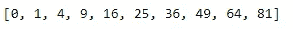

# 提高生产力的 7 个 Python 编程技巧

> 原文：<https://towardsdatascience.com/7-python-programming-tips-to-improve-your-productivity-a57802f225b6>

## 通过修正一些常见的不良编程实践，使您的 Python 编码更加有效和高效


由 [Unsplash](https://unsplash.com?utm_source=medium&utm_medium=referral) 上的[窗口](https://unsplash.com/@windows?utm_source=medium&utm_medium=referral)拍摄

编码可以带来很多乐趣！获得你正在处理的问题的解决方案或者独自解决一个复杂的项目是非常令人兴奋的。然而，在完成特定任务的过程中，你可能会发现自己陷入了几次停顿。

即使你成功地构建了你努力完成的项目，也有很大的机会可以进行一些改进，以提高代码的质量、代码的可读性、降低空间和时间的复杂性，以及实现整体高生产率的其他必要的修正。

由于 Python 编程语言在数据科学、人工智能、物联网等领域的大量使用，它在当今社会的重要性与日俱增，仅仅了解这种语言是不够的。用这种语言编码的专业知识是获得最佳结果的必要条件。因此，在开发复杂项目时，应该遵循一些最佳实践。

本文假设读者对 Python 编程有基本的了解。如果您对 Python 没有足够的了解，我建议您查看我以前的一些文章，在这些文章中，我更方便地讨论了这个主题。我也推荐看看我之前的一部作品，在那里我们讨论了从下面提供的链接学习编程的十个最好的网站。

[](/10-best-free-websites-to-learn-programming-939ec029009b) [## 学习编程的 10 个最佳免费网站

### 快速浏览 10 个最好的免费网站，从中学习编程并提高您的编码技能

towardsdatascience.com](/10-best-free-websites-to-learn-programming-939ec029009b) 

# 提高生产率的 7 个最佳 Python 编程实践:


照片由[马库斯·温克勒](https://unsplash.com/@markuswinkler?utm_source=medium&utm_medium=referral)在 [Unsplash](https://unsplash.com?utm_source=medium&utm_medium=referral) 上拍摄

在本文的这一部分，我将分解七个最重要的实践，我认为程序员在用 Python 编程时应该利用它们来获得最有益的结果。这些技巧不仅有助于您简化编码和生活，还能让您的 Python 项目获得最高的性能提升。

## 1.利用 F 弦:

Python 编程语言提供的最有用和最基本的工具之一是 f 字符串。它用最少的语法简化了字符串连接的过程。用更简单的话来说，有了这些 string，您可以轻松地将变量和字符串字符的用法结合在一起。让我们用一个例子来理解这个概念的意义。

```
fruit = "Apple"
color = "Red"print("%s is tasty. It is %s in color." %(fruit, color))
print("{0} is tasty. It is {1} in color." .format(fruit, color))
```

## 输出:

```
Apple is tasty. It is Red in color.
Apple is tasty. It is Red in color.
```

让我们在 f 字符串的帮助下，尝试打印完全相同的语句。下面是执行类似操作的代码片段。

```
print(f"{fruit} is tasty. It is {color} in color.")
```

## 输出:

```
Apple is tasty. It is Red in color.
```

请注意，f 字符串在 Python 3.6 以上的版本中可用。Python 的所有其他版本都不支持 f 字符串，因此，必须使用更普通的字符串连接方法。虽然提到的另外两种使用“%s”符号的方法和 format 方法在某些情况下是可用的，但是随着语句长度和可读性的增加，程序员必须开始适应 f 字符串以获得更好的结果。

## 2.使用 Try 和 Except 语句:

我发现的另一个主要条件缺乏实用性的地方是使用了 try 和 except 语句，这在很多情况下会派上用场。假设程序员想在达到某个条件后继续运行一个执行，但是他们不能这样做，因为会显示一个错误消息。一旦显示错误信息，程序的运行时间将被终止。

为了避免这些情况，我们可以利用 try 和 except 代码块。当条件满足时，将执行 try 语句中的代码块，以在代码行中产生所需的结果。但是，当代码没有产生令人满意的结果或导致错误发生时，except 语句会捕获这些异常。让我们看一个代码片段来理解一个例子。

```
a = 10
b = 0try:
    c = a/b
    print(f"Division Successful, The Quotient Is {c}")

except:
    print("Zero Division Error Has Most Likely Occurred.")
```

## 输出:

```
Zero Division Error Has Most Likely Occurred.
```

上面的代码块很容易理解。当除法任务可能时，执行正常除法的过程。但是，对于特定的失败情况，将返回零错误异常。当您正在读取用户的音频或图像输入，并且希望等到用户输入他们的输入，并且在没有输入的情况下不终止程序时，此选项也很有用。我还建议检查一下特定的异常情况和可以添加到这些代码块中的“finally”语句。

## 3.列表理解:

我们知道 Python 中的列表数据结构是这种编程语言的一个重要方面。列表是 Python 中最重要的数据结构之一，因为它们是可变的，并且您可以用列表的正确功能构建许多项目。它们是一种有序的数据结构，列表中的每个元素都被分配了一个特定的索引号，通过该索引号可以对其进行访问。

利用列表中的单个 for 循环，列表理解有助于简化更复杂的代码块。列表理解提供了一种创建列表的简洁方法。它们最常见的应用是创建新的列表，其中每个元素都是应用于另一个序列或 iterable 的每个成员的一些操作的结果，或者创建满足特定条件的那些元素的子序列。让我们看一个成功利用这些列表理解的例子。

```
squares = []
for x in range(10):
    squares.append(x**2)squares
```

## 输出:



现在，让我们看看代码片段，它允许我们通过利用列表理解更容易地接收相同的输出。

```
squares = [i**2 for i in range(10)]
print(squares)
```

如果您有兴趣学习更多关于 Python 中的列表数据结构的知识，并掌握与该主题相关的所有基本概念，我建议您查看我以前的一篇文章，在这篇文章中，我非常详细地介绍了该主题。下面是博客的链接，可以了解更多关于这个概念的信息。

[](/mastering-python-lists-for-programming-5423b011d937) [## 掌握 Python 列表进行编程！

### 对编程所需的所有列表概念的详细理解。为什么使用列表进行数据科学和…

towardsdatascience.com](/mastering-python-lists-for-programming-5423b011d937) 

## 4.熟悉数学运算:


丹-克里斯蒂安·pădureț在 [Unsplash](https://unsplash.com?utm_source=medium&utm_medium=referral) 上拍摄的照片

在处理任何类型的编程时，很有可能你会遇到一些需要你运用数学技巧来解决的问题。无论您选择哪个领域，了解 Python 为用户提供的一些数学工具都是非常重要的。Python 编程简化了大多数数学运算。让我们探索一下数学的一些基本功能，每个 Python 程序员都必须知道如何使用这些功能。下面是一个代码片段，涵盖了大多数基本概念。

```
a = 10 
b = 5add = a + b 
sub = a - b
mult = a * b
div = a / b
floor_div = a//b
mod = a % b
exp = a ** b
```

## 输出:

```
Sum = 15
Difference = 5
Product = 50
Quotient = 2.0
Floor Division = 2
Reminder = 0
Exponential Operation = 100000
```

除了这些基本的数学运算，Python 还允许其程序员独占访问数学库，通过数学库可以进行一些数学计算。让我们看一个简单的示例代码片段，其中我们在导入数学库模块后，对 int 类型变量使用了一些数学函数。

```
import matha = 5.6print("The rounded value is:", round(a))
print("The ceiled value is:", math.ceil(a))
print("The floored value is:", math.floor(a))
```

## 输出:

```
The rounded value is: 6
The ceiled value is: 6
The floored value is: 5
```

我建议你去看看数学库的其他基本概念，它们可以让你完成大部分必要的数学计算。即使你在编码时没有从事机器学习或深度学习项目，数学也很重要。如果您有兴趣了解更多关于简化数学主题的知识，如机器学习的微分和积分，请通过下面提供的链接查看我以前的一篇文章。

[](/best-library-to-simplify-math-for-machine-learning-ed64cbe536ac) [## 为机器学习简化数学的最佳库！

### 使用 sympy Python 库简化用于机器学习的微积分

towardsdatascience.com](/best-library-to-simplify-math-for-machine-learning-ed64cbe536ac) 

## 5.利用多个 Python 文件:


维克多·塔拉舒克在 [Unsplash](https://unsplash.com?utm_source=medium&utm_medium=referral) 上拍摄的照片

在处理较大的项目时，很明显完成项目所需的行数可能会非常庞大。有时候，这些代码行的范围可以从几百到几千个代码语句。在处理这样的项目时，通常最好将内容划分到单独的文件中，类似于您如何利用函数和类来降低信誉并提高整体效率。

让我们考虑一个你选择构建的游戏项目的例子。对于这些类型的项目，最好是利用一些或更多的 Python 文件来相应地分离代码。您可以为实用程序、资产创建单独的 Python 文件，并以您认为合适的方式划分其他必要的功能。在主 Python 文件中，您可以导入所有其他编程文件并创建所需的代码。

另一个理解在创建项目时使用多个文件的好例子是当你设计一个网站的时候。当进行网站设计时，如果您试图运行任何类型的项目，如机器学习示例或任何类似的项目，最好创建一个 Python 文件来存储一些基本的代码相关元素，同时利用其他附加的 HTML、CSS 或 JavaScript 文件进行整体设计。

## 6.处理操作系统功能:


照片由 [Artiom Vallat](https://unsplash.com/@virussinside?utm_source=medium&utm_medium=referral) 在 [Unsplash](https://unsplash.com?utm_source=medium&utm_medium=referral) 上拍摄

对于最复杂的项目来说，最基本的主题之一就是能够遍历不同的工作文件和目录。为了管理和操作大量文件夹并获取所需文件，我们将使用 Python 编程中的“os”库模块。它允许开发者通过允许使用依赖于操作系统的功能的可移植方式来管理目录结构。

为了理解操作系统模块的基本用途，让我们看看 Python 编程中经常使用的一些关键组件。下面代码片段中讨论的大部分元素都是基本的操作系统功能，经常用于构建 Python 项目。熟悉它们对于创建更复杂的项目是必要的。

```
import os# get current working directory
cwd = os.getcwd()
print("Current Working Directory", cwd)# Join directories
parent_dir = "D:/Cool Projects/Blogs/"
current_dir = "7 best Python Programming Tips/"
final_path = os.path.join(parent_dir, current_dir)
print(final_path)# Make a new directory
os.mkdir(final_path + "test/")
```

Python 编程中还有其他几个操作系统命令。强烈建议开发人员熟悉这些基本功能，因为它们对于构建、创建和开发更复杂的项目非常重要，在这些项目中，您需要访问用户各自的操作系统来保存文件、访问所需的文件等等。

## 7.更好地使用调试技术:

当您最终在处理 Python 代码时遇到错误时，您通常会得到追踪到错误位置的特定行。这些错误可能是逻辑错误、语法错误或运行时警告。虽然大多数与语法相关的错误在设计良好的集成开发环境和一些分析的帮助下更容易修复，但长时间停留在代码中的某个特定点并不罕见。

现在，这给我们带来了一个问题，我们可以做些什么来改进我们的方法，以调试由编程引起的不可避免的错误。确保使用大量的打印声明，以确保您的项目或您计划的方法按预期进行。您可以注释掉这些语句或稍后删除它们，但是在处理项目时，请确保您正在使用它们。

理想情况下，一旦您对 Python 编程语言的工作原理有了基本的了解，最好从一个简单的文本编辑器(如 Python IDLE)切换到其他流行的 IDE，如 Pycharm 或 Visual Studio 代码(有 Kite 支持)，这将通过突出显示 IDE 解释错误可能发生的实例来帮助您识别较小的错误或有时较大的错误。

每当你在编程的某一点上停滞不前的时候，谷歌一下这个错误并查看一个像 GitHub 或 Stack Overflow 这样的网站总是一个好主意。您可能遇到的几乎每一个常见的 bug 或错误都可能已经有人遇到过了，这个有用的社区为这些常见问题提供了多种解决方案。

在调试 Python 代码时，程序员还可以利用其他一些工具来获得更好的结果。然而，Python 本身提供了一个令人惊叹的内置工具来成功调试 Python 代码。查看我以前的一篇关于 PDB (Python 调试器)库的文章，通过下面提供的链接，可以有效地修复 Python 代码中的错误。

[](/must-use-built-in-tool-for-debugging-your-python-code-d5f69fecbdbe) [## 必须使用内置工具来调试你的 Python 代码！

### python 调试器模块指南，包含有用的代码和命令。有效且高效地利用这一工具…

towardsdatascience.com](/must-use-built-in-tool-for-debugging-your-python-code-d5f69fecbdbe) 

# 结论:


多梅尼科·洛亚在 [Unsplash](https://unsplash.com?utm_source=medium&utm_medium=referral) 上拍摄的照片

> 如果说调试是去除软件 bug 的过程，那么编程一定是把 bug 放进去的过程。
> ***—艾德斯特拉***

一旦你理解了基础知识，编程表面上看起来很容易。然而，无论你成为多么专业的程序员，你总是会遇到一些问题，需要你在互联网上寻找一段代码或额外的功能。你仍然可能犯最愚蠢的错误，或者没有以最有效的方式编写代码来达到预期的结果。事后看来，虽然所有这些提到的约束本身都很好，但适应最佳编码策略仍然非常有益。

在本文中，我们讨论了提高 Python 编程效率的七种最佳方法。这篇博客中提到的要点是一些最好的技术，可以部署到您自己的代码和项目中，以提高所获得结果的生产率和整体效率。遵循这些提示将帮助您创建更有效的 Python 代码，以构建更好更大的项目！

如果你想在我的文章发表后第一时间得到通知，请点击下面的[链接](https://bharath-k1297.medium.com/subscribe)订阅邮件推荐。如果你希望支持其他作者和我，请订阅下面的链接。

[](https://bharath-k1297.medium.com/membership) [## 通过我的推荐链接加入媒体

### 作为一个媒体会员，你的会员费的一部分会给你阅读的作家，你可以完全接触到每一个故事…

bharath-k1297.medium.com](https://bharath-k1297.medium.com/membership) 

如果你对这篇文章中提到的各点有任何疑问，请在下面的评论中告诉我。我会尽快给你回复。

看看我的一些与本文主题相关的文章，你可能也会喜欢阅读！

[](/how-to-perform-sentiment-analysis-on-earnings-call-of-companies-122275f47e26) [## 如何对公司财报电话会议进行情感分析

### 利用 Python 和人工智能部署情感分析来分析公司的收益电话

towardsdatascience.com](/how-to-perform-sentiment-analysis-on-earnings-call-of-companies-122275f47e26) [](/how-to-deploy-your-own-optimized-speech-to-text-web-app-with-python-c956c7838ec8) [## 如何使用 Python 部署您自己优化的语音转文本 Web 应用程序

### 一个详细的指南，告诉你如何构建自己的语音到文本的网络应用程序，以最佳的方式将音频转换成…

towardsdatascience.com](/how-to-deploy-your-own-optimized-speech-to-text-web-app-with-python-c956c7838ec8) [](/the-ultimate-tensorflow-gpu-installation-guide-for-2022-and-beyond-27a88f5e6c6e) [## 2022 年及以后的终极 TensorFlow-GPU 安装指南

### 无论如何，始终在您的 PC 上安装最新 GPU 版本的 TensorFlow 的终极指南

towardsdatascience.com](/the-ultimate-tensorflow-gpu-installation-guide-for-2022-and-beyond-27a88f5e6c6e) 

谢谢你们坚持到最后。我希望你们都喜欢这篇文章。祝大家有美好的一天！