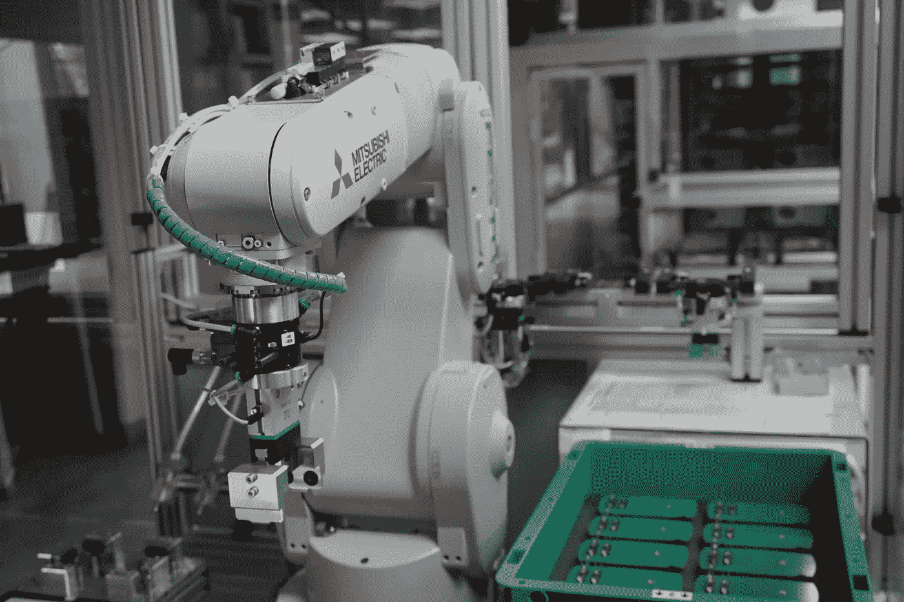

# 强化学习的 7 个实际应用

> 原文：<https://towardsdatascience.com/7-real-world-applications-of-reinforcement-learning-f80955cefcd5>

## 我们离日常生活中的强化学习有多近？以下是强化学习的真实使用案例——从机器人到个性化你的网飞建议。

迈克尔·泽兹奇在 [Unsplash](https://unsplash.com/s/photos/artificial-intelligence?utm_source=unsplash&utm_medium=referral&utm_content=creditCopyText) 上的照片

强化学习是机器学习的一个子域，其中代理通过与他们的环境交互来学习做出决策。最近，它通过在围棋、象棋、Dota 和星际争霸 2 等游戏中实现超人水平的能力而广受欢迎。

在本文中，我列出了强化学习在现实世界用例中应用的 7 个例子。

# 1.使用 Wayve 的自动驾驶

由[叶夫根尼·切博塔列夫](https://unsplash.com/@ev25?utm_source=unsplash&utm_medium=referral&utm_content=creditCopyText)在 [Unsplash](https://unsplash.com/s/photos/car?utm_source=unsplash&utm_medium=referral&utm_content=creditCopyText) 拍摄

历史上，自动驾驶汽车的方法包括定义逻辑规则。这可能很难扩展到无人驾驶汽车在公共道路上可能遇到的无数情况。这就是[深度强化学习可能有前途的地方](https://arxiv.org/pdf/2002.00444.pdf)。

[Wayve](https://wayve.ai/) 是一家总部位于英国的公司，自 2018 年以来一直在公共道路上测试自动驾驶汽车。在他们的论文“[在一天内学会驾驶](https://arxiv.org/pdf/1807.00412.pdf)”中，他们描述了他们如何使用深度强化学习来训练一个使用单目图像作为输入的模型。奖励是车辆在没有安全驾驶员控制的情况下行驶的距离。该模型在驾驶模拟中进行训练，然后在现实世界中部署在 250 米的路段上。

虽然他们的自动驾驶汽车技术继续发展，但他们声称强化学习继续在**运动规划**中发挥作用(确保目标点和目的点之间存在可行的路径)。

# 2.个性化您的网飞推荐

[自由股票](https://unsplash.com/@freestocks?utm_source=unsplash&utm_medium=referral&utm_content=creditCopyText)在 [Unsplash](https://unsplash.com/s/photos/netflix?utm_source=unsplash&utm_medium=referral&utm_content=creditCopyText) 上的照片

网飞在 190 多个国家拥有 2 亿用户。对于这些用户，网飞的目标是呈现最具娱乐性和相关性的视频。在贾斯汀·巴西利科(网飞大学机器学习和推荐系统主任)的演讲“[网飞解释了推荐和个性化](https://scale.com/blog/Netflix-Recommendation-Personalization-TransformX-Scale-AI-Insights)”中，他描述了他们如何通过结合四种关键方法来实现这一点:深度学习、因果关系、强化学习和目标。

面临的挑战是训练一个模型，优化用户的长期满意度，而不是即时满意度。强化学习可以通过引入探索来提供帮助，探索可以让模型随着时间的推移学习新的兴趣。

Justin 指出，由于高维数和大问题空间，强化学习在这种情况下很难应用。为了帮助这一点，该团队开发了[手风琴](https://dl.acm.org/doi/abs/10.1145/3460231.3474259)——一种用于长期训练的模拟器。

# 3.优化沃尔玛的库存水平

照片由[Marques Thomas @ querysprout . com](https://unsplash.com/@querysprout?utm_source=unsplash&utm_medium=referral&utm_content=creditCopyText)在 [Unsplash](https://unsplash.com/s/photos/walmart?utm_source=unsplash&utm_medium=referral&utm_content=creditCopyText) 上拍摄

沃尔玛是世界上最大的零售商和杂货商，拥有超过 4650 家店铺。沃尔玛必须不断转移未售出的库存，为新的更畅销的商品腾出空间。转移多余库存的通常策略是实施降价。这是一项费时费力的工作，需要逐个商店多次对打折商品重新贴标签。

为了降低运营成本，[沃尔玛创造了一种优化降价的算法](https://www.youtube.com/watch?v=pxWkg2N0l9c)。该算法接收数据，包括销售数据、运营成本、商品的数量和类型，以及商品必须销售的动态时间框架。

该方法应用数据分析、强化学习和动态优化来为每个产品做出自动化决策，并为每个商店量身定制。其结果是降低了运营成本，增加了销售额，一些商店的待搬迁库存销售额增加了 15%。

# 4.使用 search.io 改进搜索引擎结果

诺德伍德主题公司在 [Unsplash](https://unsplash.com/s/photos/search-engine?utm_source=unsplash&utm_medium=referral&utm_content=creditCopyText) 上拍摄的照片

[Search.io](http://search.io/) 是一款用于站内搜索查询的 AI 搜索引擎。他们使用“按等级学习”和强化学习技术来改进他们的搜索等级算法。

学习排名涉及使用机器学习模型，该模型在基于相关性评分的查询-结果对的数据集上训练。这种技术的一个缺点是输入(查询结果对得分)保持静态。

强化学习使用点击、销售、注册等形式的反馈，随着时间的推移帮助改进搜索算法。在这种情况下应用强化学习的挑战在于，搜索结果的质量通常从低开始，并且在开始满足客户期望之前需要时间和数据。

# 5.用 OpenAI 的 WebGPT 改进语言模型

[李·坎贝尔](https://unsplash.com/@leecampbell?utm_source=unsplash&utm_medium=referral&utm_content=creditCopyText)在 [Unsplash](https://unsplash.com/s/photos/web-browser?utm_source=unsplash&utm_medium=referral&utm_content=creditCopyText) 上的照片

GPT-3 是一种用于生成类人文本的语言模型。这些语言模型的缺点是，在执行需要模糊的现实世界知识的任务时，倾向于“幻觉”信息。为了改善这一点，OpenAI 教 GPT-3 使用基于文本的网络浏览器。该模型能够从网页中搜索和收集信息，并使用这些信息来撰写开放式问题的答案。

该模型最初使用人类演示来训练。在此基础上，通过训练一个奖励模型来预测人类的偏好，可以提高模型的有用性和准确性。然后，使用强化学习或拒绝采样，针对该奖励模型对系统进行优化。结果是该系统被发现比 GPT-3 更“真实”。

# 6.利用 IBM 的 DSX 平台在金融市场上进行交易

在 [Unsplash](https://unsplash.com/s/photos/stock-market?utm_source=unsplash&utm_medium=referral&utm_content=creditCopyText) 上由 [Austin Distel](https://unsplash.com/@austindistel?utm_source=unsplash&utm_medium=referral&utm_content=creditCopyText) 拍摄的照片

由于高货币风险，金融行业一直不愿意应用机器学习。[在这篇文章](https://medium.com/ibm-data-ai/reinforcement-learning-the-business-use-case-part-2-c175740999)中，IBM 描述了一个用强化学习训练的交易系统。

在这种情况下，强化学习的优势在于能够学习做出预测，以解释算法的行为对市场状态产生的任何影响。这种反馈循环允许算法随着时间的推移自动调整，不断使其更加强大和适应性更强。回报函数是基于每笔交易的盈利或亏损。

该模型根据买入并持有策略和 ARIMA-GARCH(一种预测模型)进行评估。他们发现该模型能够捕捉头肩顶模式，这是一个不平凡的壮举。

# 7.加州大学伯克利分校的机器人技术

照片由[帕特里西奥·达瓦洛斯](https://unsplash.com/@patriciodavalos?utm_source=unsplash&utm_medium=referral&utm_content=creditCopyText)在 [Unsplash](https://unsplash.com/s/photos/robot?utm_source=unsplash&utm_medium=referral&utm_content=creditCopyText) 上拍摄

开发机器人控制器是一项具有挑战性的任务。典型的方法包括仔细的建模，但是当暴露在意外的情况和环境中时容易失败。

加州大学伯克利分校的一个团队试图通过使用强化学习训练一个真正的双足机器人来解决这个问题。该团队能够开发出一种模型，从而对名为 Cassie 的机器人进行更加多样化和鲁棒的行走控制。

部署的模型能够执行各种行为，例如在现实世界中改变行走高度、快速行走、侧向行走和转弯。它对机器人本身(例如部分损坏的电机)和环境(例如地面摩擦力的变化和从不同方向被推动)的变化也很鲁棒。你可以在这个视频中观看凯西的行动。

# 结论

虽然强化学习在现实世界中的应用仍处于早期阶段，但我希望这个列表突出了该技术的潜力以及迄今为止已经发生的令人兴奋的进展。随着数据收集、模拟、处理能力和研究的不断发展，谁知道我们在未来几年还会看到什么？

如果强化学习领域让你兴奋，这里有一些我的其他文章，你可能会觉得有用:

*   [open ai 健身房出租车强化学习介绍](https://medium.com/coder-one/creating-your-first-game-playing-bot-2fb176a0b469)
*   [深度强化学习的实践介绍](https://medium.com/coder-one/a-hands-on-introduction-to-deep-reinforcement-learning-using-unity-ml-agents-e339dcb5b954)
*   [8+强化学习项目创意](/8-reinforcement-learning-project-ideas-3521e0ccd313)

感谢阅读！