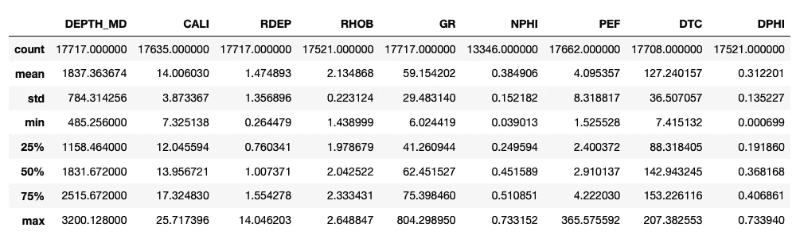
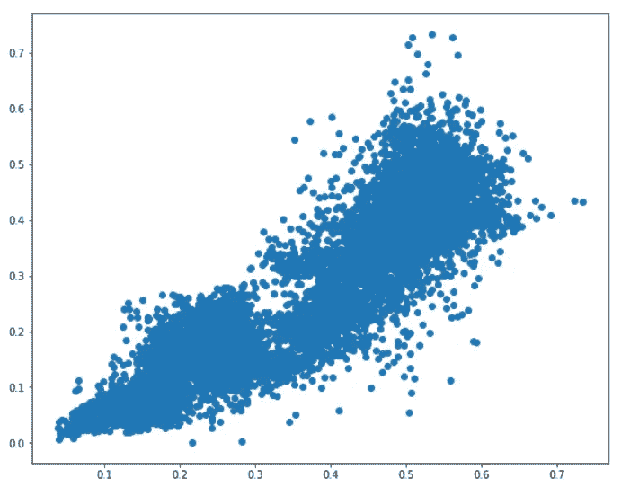
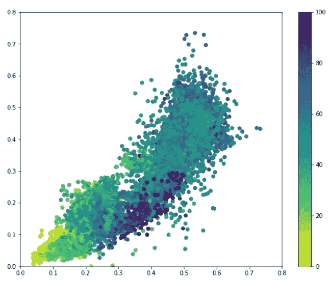
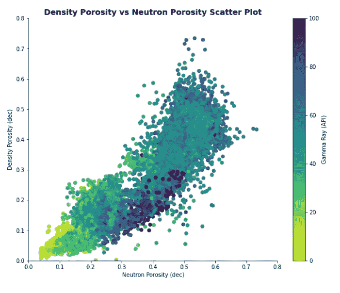
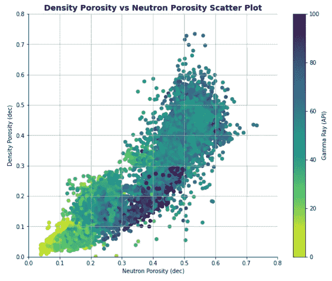
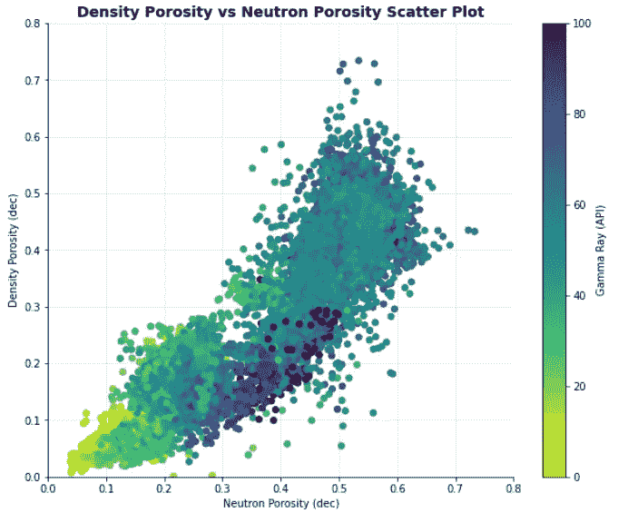
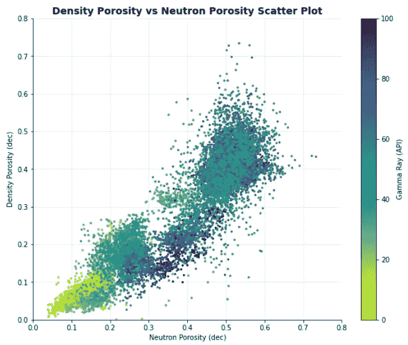
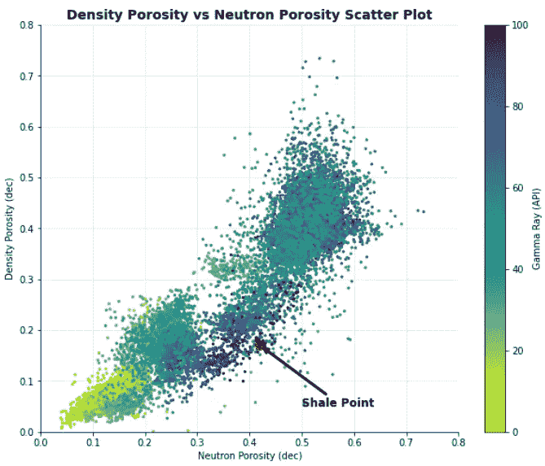
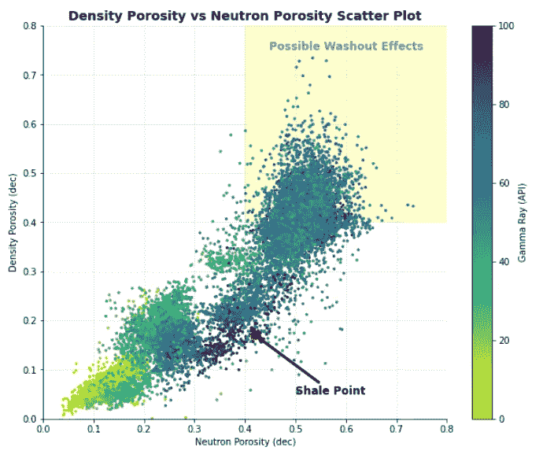

# 增强 Matplotlib 图表的 7 种简单方法

> 原文：<https://towardsdatascience.com/7-simple-ways-to-enhance-your-matplotlib-charts-a232823efed9>

## 用这些简单的步骤改善你的 matplotlib 图形


照片由 Mikael Blomkvist 拍摄:[https://www . pexels . com/photo/person-holding-white-ipad-on-brown-wood-table-6476589/](https://www.pexels.com/photo/person-holding-white-ipad-on-brown-wooden-table-6476589/)

Matplotlib 是 [Python](https://www.python.org) 中最流行的数据可视化库之一。它通常是学习 python 时遇到的第一个数据可视化库。尽管您可以用几行代码生成图形，但创建的图通常很差，视觉上没有吸引力，没有信息。

为了解决这个问题，我们可以用几行额外的代码来增强图形的交流能力。在本文中，我们将介绍如何从一个基本的 [matplotlib 散点图](https://matplotlib.org/stable/api/_as_gen/matplotlib.pyplot.scatter.html)转变为一个对最终用户/读者来说更具视觉吸引力和信息量更大的散点图。


增强 matplotlib 图形之前和之后。图片由作者提供。

# 导入库和数据

在以下如何在 [matplotlib](https://matplotlib.org) 中增强散点图的示例中，我们将使用一个更大数据集的子集，该数据集是 Xeek 和 FORCE 2020 *(Bormann 等人，2020)* 举办的机器学习竞赛的一部分。它是在挪威政府的 NOLD 2.0 许可下发布的，详细信息可以在这里找到:[挪威开放政府数据许可(NLOD) 2.0](https://data.norge.no/nlod/en/2.0/) 。

完整的数据集可以通过以下链接获得:[https://doi.org/10.5281/zenodo.4351155](https://doi.org/10.5281/zenodo.4351155)。

对于本教程，我们将需要导入 [matplotlib](https://matplotlib.org) 和 [pandas](https://pandas.pydata.org) 。

然后使用 pandas 方法`read_csv()`将数据读入数据帧。我们还将计算一个密度孔隙度列，用于绘制中子孔隙度。

```
import pandas as pd
import matplotlib.pyplot as pltdf = pd.read_csv('data/Xeek_Well_15-9-15.csv')df['DPHI'] = (2.65 - df['RHOB'])/1.65df.describe()
```

当我们运行上面的代码时，我们用新的 DPHI 列得到下面的数据摘要。



Xeek / Force 2020 数据集中 15/9–15 井测井测量的统计总结。图片由作者提供。

# 创造一个基本情节

数据成功加载后，我们可以创建第一个散点图。为此，我们将在 x 轴上绘制中子孔隙度(NPHI ),在 y 轴上绘制密度孔隙度(DPHI)。

我们还会将图形大小设置为 10 x 8。

```
plt.figure(figsize=(10,8))plt.scatter(df['NPHI'], df['DPHI'])
```



通过这两行代码，我们得到了上面的图。看起来很淡，不是吗？让我们添加一些颜色，使它在视觉上更具吸引力，并允许我们获得一些数据的洞察力。

# 用第三个变量添加颜色

为此，我们将通过伽马射线(GR)对数据进行着色，并将颜色范围设置在 0 到 100 之间(`vmin`和`vmax`参数)。

我们需要使用`plt.colorbar()`来显示颜色条。

最后，我们将通过调用`plt.xlim()`和`plt.ylim()`将图表的 x 和 y 限制设置为从 0 到 0.8。这将使两个轴都从 0 开始，并达到最大值 0.8。

```
plt.figure(figsize=(10,8))plt.scatter(df['NPHI'], df['DPHI'], c=df['GR'], vmin=0, vmax=100, cmap='viridis_r')
plt.xlim(0, 0.8)
plt.ylim(0, 0.8)
plt.colorbar()
```

我们使用的彩色地图是反过来的绿色。这种颜色图在高值和低值之间提供了很好的对比，同时保持了均匀性并且是色盲友好的。

当我们运行上面的代码时，我们得到了下面的图。



matplotlib 的基本散点图显示密度孔隙度与中子孔隙度。图片由作者提供。

如果你想了解更多关于选择彩色地图的信息，以及为什么有些彩色地图并不适合所有人，那么我强烈推荐你在这里观看这个视频:

# 从图中删除脊线

我们要做的下一个改变是去掉围绕着图的黑框。这个盒子的每一面被称为一个书脊。移除顶部和右侧有助于使我们的情节更清晰，更具视觉吸引力。

我们可以通过调用`plt.gca().spines[side].set_visible(False)`来删除右轴和顶轴，这里边可以是顶部、右侧、左侧或底部。

```
plt.figure(figsize=(10,8))plt.scatter(df['NPHI'], df['DPHI'], c=df['GR'], vmin=0, vmax=100, cmap='viridis_r')
plt.xlim(0, 0.8)
plt.ylim(0, 0.8)
plt.colorbar()plt.gca().spines['top'].set_visible(False)
plt.gca().spines['right'].set_visible(False)
```

在去除了这些刺之后，我们的情节看起来更干净，也更少杂乱。此外，颜色条现在感觉像是情节的一部分，而不是看起来被分割开来。


移除右侧和顶部脊线(边缘)后的 Matplotlib 散点图。图片由作者提供。

# 添加标题和轴标签

当查看上面的散点图时，我们可能知道每个轴代表什么，但其他人如何理解这个图是关于什么的，颜色代表什么，什么相对于什么绘制？

为我们的绘图添加标题和轴标签是创建有效可视化的重要部分。这些可以简单地通过使用:`plt.xlabel`、`plt.ylabel`和`plt.title`来添加。在每个函数中，我们传递想要显示的文本和任何字体属性，比如字体大小。

此外，在标签中包含测量单位也是一种很好的做法。这有助于读者更好地理解情节。

```
plt.figure(figsize=(10,8))plt.scatter(df['NPHI'], df['DPHI'], c=df['GR'], vmin=0, vmax=100, cmap='viridis_r')
plt.xlim(0, 0.8)
plt.ylim(0, 0.8)
plt.colorbar(label='Gamma Ray (API)')plt.gca().spines['top'].set_visible(False)
plt.gca().spines['right'].set_visible(False)plt.title('Density Porosity vs Neutron Porosity Scatter Plot', fontsize=14, fontweight='bold')
plt.xlabel('Neutron Porosity (dec)')
plt.ylabel('Density Porosity (dec)')
plt.show()
```

当我们运行上面的代码时，我们得到了下面的图。我们马上就知道轴上画的是什么，图表是关于什么的，颜色范围代表什么。



向坐标轴添加标题和标签后的散点图。图片由作者提供。

# 添加模糊网格(可选)

根据绘图的目的，我们可能希望向添加一个网格，以便图表的读者可以直观方便地浏览绘图。如果我们想从图中定量提取值，这一点尤其重要。然而，有些时候网格线被认为是“垃圾”,最好不要使用。例如，如果您只想显示数据集中的总体趋势，而不想让读者过多关注原始值。

在本例中，我们将添加一些模糊的网格线，以便它们不会过多地影响数据。为此，我们需要在代码中添加`plt.grid()`。

```
plt.figure(figsize=(10,8))plt.scatter(df['NPHI'], df['DPHI'], c=df['GR'], vmin=0, vmax=100, cmap='viridis_r')
plt.xlim(0, 0.8)
plt.ylim(0, 0.8)
plt.colorbar(label='Gamma Ray (API)')plt.gca().spines['top'].set_visible(False)
plt.gca().spines['right'].set_visible(False)plt.title('Density Porosity vs Neutron Porosity Scatter Plot', fontsize=14, fontweight='bold')
plt.xlabel('Neutron Porosity (dec)')
plt.ylabel('Density Porosity (dec)')plt.grid()
plt.show()
```

然而，当我们这样做的时候，我们会发现网格线出现在我们的图的顶部，它看起来并不吸引人。



添加网格线后的散点图。图片由作者提供。

为了在后面绘制网格线，我们需要移动`plt.grid()`线，使其在调用`plt.scatter()`之前，并为`zorder`添加参数。这控制了图表组件的绘制顺序。应注意，这些值是相对于图上的其他项目而言的。

对于网格，我们希望`zorder`值小于我们用于散点图的值。在这个例子中，我将网格的`zorder`设为 1，散点图的`zorder`设为 2。

此外，我们将为网格添加更多的参数，即控制网格线颜色的`color`和控制网格线透明度的`alpha`。

```
plt.figure(figsize=(10,8))
plt.grid(color='lightgray', alpha=0.5, zorder=1)plt.scatter(df['NPHI'], df['DPHI'], c=df['GR'], vmin=0, vmax=100, cmap='viridis_r', zorder=2)
plt.xlim(0, 0.8)
plt.ylim(0, 0.8)
plt.colorbar(label='Gamma Ray (API)')plt.gca().spines['top'].set_visible(False)
plt.gca().spines['right'].set_visible(False)plt.title('Density Porosity vs Neutron Porosity Scatter Plot', fontsize=14, fontweight='bold')
plt.xlabel('Neutron Porosity (dec)')
plt.ylabel('Density Porosity (dec)')plt.show()
```

这将返回一个更好的情节，网格线不会太分散注意力。



网格线移动到图的后面和数据后面后的 Matplotlib 散点图。图片由作者提供。

# 更改磅值

下一步是改变每个数据点的大小。目前，这些点相对较大，在我们拥有高密度数据的地方，数据点可以相互重叠。

解决这个问题的一个方法是减少数据点的大小。这是通过`plt.scatter()`功能中的`s`参数实现的。在本例中，我们将它设置为 5。

```
plt.figure(figsize=(10,8))
plt.grid(color='lightgray', alpha=0.5, zorder=1)plt.scatter(df['NPHI'], df['DPHI'], c=df['GR'], vmin=0, vmax=100, zorder=2, s=5, cmap='viridis_r')
plt.xlim(0, 0.8)
plt.ylim(0, 0.8)
plt.colorbar(label='Gamma Ray (API)')plt.gca().spines['top'].set_visible(False)
plt.gca().spines['right'].set_visible(False)plt.title('Density Porosity vs Neutron Porosity Scatter Plot', fontsize=14, fontweight='bold')
plt.xlabel('Neutron Porosity (dec)')
plt.ylabel('Density Porosity (dec)')
plt.show()
```

当我们运行这段代码时，我们可以看到数据中更多的变化，并更好地了解一个点的真实位置。



更改点大小后的 matplotlib 散点图。图片由作者提供。

# 注释点

当创建数据可视化时，我们经常想把读者的注意力吸引到特定的兴趣点上。这可能包括异常数据点或关键结果。

要添加注释，我们可以使用下面一行:

```
plt.annotate('Text We Want to Display', xy=(x,y), xytext=(x_of_text, y_of_text)
```

其中`xy`是图表上我们想要指向的点，而`xytext`是文本的位置。

如果我们愿意，我们还可以包含一个从文本指向图表上的点的箭头。如果文本注释离所讨论的点较远，这很有用。

为了进一步突出显示一个点或者在一个点不存在的地方添加一个点，我们可以在现有的散点图之上添加另一个散点图，并传入一个 x 和 y 值，以及相应的颜色和样式。

```
plt.figure(figsize=(10,8))plt.grid(color='lightgray', alpha=0.5, zorder=1)plt.scatter(df['NPHI'], df['DPHI'], c=df['GR'], vmin=0, vmax=100, cmap='viridis_r',
            zorder=2, s=5)
plt.xlim(0, 0.8)
plt.ylim(0, 0.8)
plt.colorbar(label='Gamma Ray (API)')plt.gca().spines['top'].set_visible(False)
plt.gca().spines['right'].set_visible(False)plt.title('Density Porosity vs Neutron Porosity Scatter Plot', fontsize=14, fontweight='bold')
plt.xlabel('Neutron Porosity (dec)')
plt.ylabel('Density Porosity (dec)')plt.scatter(0.42 ,0.17, color='red', marker='o', s=100, zorder=3)
plt.annotate('Shale Point', xy=(0.42 ,0.17), xytext=(0.5, 0.05),
             fontsize=12, fontweight='bold', 
             arrowprops=dict(arrowstyle='->',lw=3), zorder=4)plt.show()
```

当这段代码运行时，我们得到了下面的图。我们可以看到，一个潜在的页岩点在图上用红色圆圈突出显示，一个清晰的注释用箭头指向它。



matplotlib 密度孔隙度与中子孔隙度散点图，带文本注释和箭头。图片由作者提供。

请注意，所选点仅用于突出显示目的，需要更详细的解释来确定该数据中的真实页岩点。

# 突出感兴趣的领域

如果我们想要突出显示绘图上的整个区域，我们可以添加一个简单的矩形(或另一个形状)来给该区域加阴影。

为此，我们需要从`matplotlib.patches`导入`Rectangle`，然后调用下面的代码行。

```
plt.gca().add_patch(Rectangle((x_position, y_position), width, height, alpha=0.2, color='yellow'))
```

`x_position`和`y_position`代表矩形的左下角。从那里开始添加宽度和高度。

我们还可以添加一些文本来表明该区域代表什么:

```
plt.text(x_position, y_position, s='Text You Want to Display, fontsize=12, fontweight='bold', ha='center', color='grey')
```

`ha`用于水平定位文本。如果设置为居中，则 x_position 和 y_position 代表文本字符串的中心。如果设置为 left，则 x_position 和 y_position 表示该文本字符串的左侧边缘。

```
from matplotlib.patches import Rectangleplt.figure(figsize=(10,8))plt.grid(color='lightgray', alpha=0.5, zorder=1)plt.scatter(df['NPHI'], df['DPHI'], c=df['GR'], vmin=0, vmax=100, cmap='viridis_r',
            zorder=2, s=5)
plt.xlim(0, 0.8)
plt.ylim(0, 0.8)
plt.colorbar(label='Gamma Ray (API)')plt.gca().spines['top'].set_visible(False)
plt.gca().spines['right'].set_visible(False)plt.title('Density Porosity vs Neutron Porosity Scatter Plot', fontsize=14, fontweight='bold')
plt.xlabel('Neutron Porosity (dec)')
plt.ylabel('Density Porosity (dec)')plt.scatter(0.42 ,0.17, color='red', marker='o', s=100, zorder=3)
plt.annotate('Shale Point', xy=(0.42 ,0.17), xytext=(0.5, 0.05),
             fontsize=12, fontweight='bold', 
             arrowprops=dict(arrowstyle='->',lw=3), zorder=4)plt.text(0.6, 0.75, s='Possible Washout Effects', fontsize=12, fontweight='bold', ha='center', color='grey')plt.gca().add_patch(Rectangle((0.4, 0.4), 0.4, 0.4, alpha=0.2, color='yellow'))plt.show()
```

这段代码返回下面的图，其中我们突出显示了我们的区域。



添加阴影区域后的 matplotlib 散点图，以突出冲刷造成的潜在影响。图片由作者提供。

# 摘要

在这个简短的教程中，我们看到了如何从一个由 [matplotlib](https://matplotlib.org) 生成的基本散点图到一个可读性更强、视觉效果更好的散点图。这表明，通过一点点工作，我们可以得到一个更好的情节，我们可以与他人分享，并轻松地让我们的故事。

我们已经看到了如何通过去除脊柱、添加网格线以帮助定性分析、添加标题和标签以显示我们正在显示的内容，以及突出我们想要引起读者注意的关键点来消除不必要的混乱。


增强 matplotlib 图形之前和之后。图片由作者提供。

*感谢阅读。在你走之前，你一定要订阅我的内容，把我的文章放到你的收件箱里。* [***你可以在这里做！***](https://andymcdonaldgeo.medium.com/subscribe)**或者，您也可以* [***注册我的简讯***](https://fabulous-founder-2965.ck.page/2ca286e572) *免费将更多内容直接发送到您的收件箱。**

*其次，通过注册会员，你可以获得完整的媒介体验，并支持我和其他成千上万的作家。每月只需花费你 5 美元，你就可以接触到所有精彩的媒体文章，也有机会通过写作赚钱。如果你用 [***我的链接***](https://andymcdonaldgeo.medium.com/membership)**报名，你直接用你的一部分费用支持我，不会多花你多少钱。如果你这样做了，非常感谢你的支持！***

# **参考**

**博尔曼，彼得，奥桑德，彼得，迪里布，法哈德，曼拉尔，投降，&迪辛顿，彼得。(2020).机器学习竞赛 FORCE 2020 井测井和岩相数据集[数据集]。芝诺多。[http://doi.org/10.5281/zenodo.4351156](http://doi.org/10.5281/zenodo.4351156)**