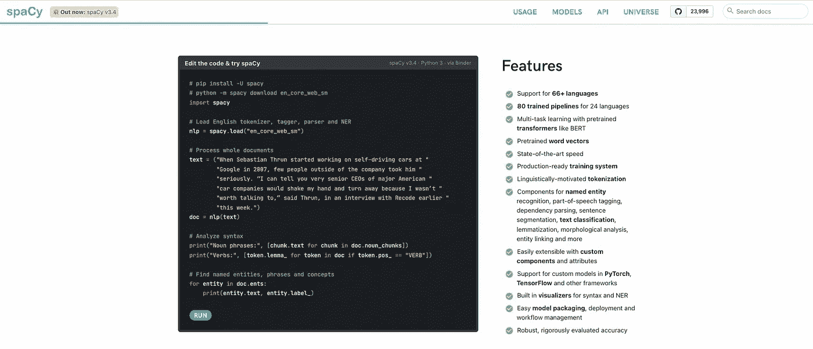
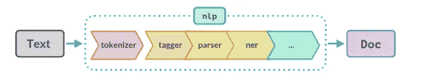
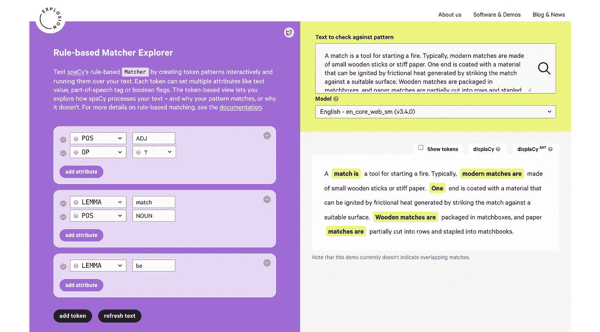
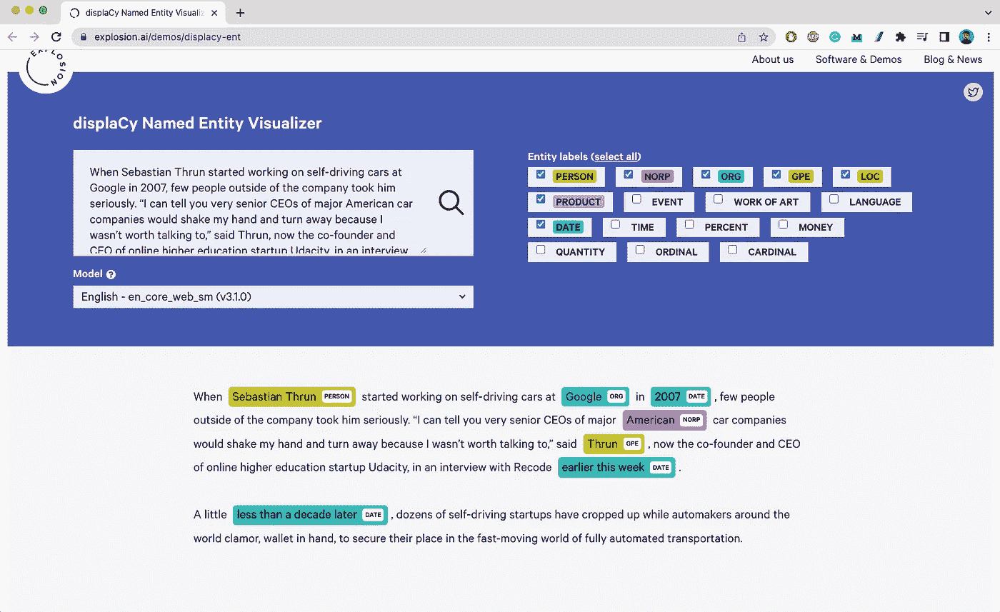
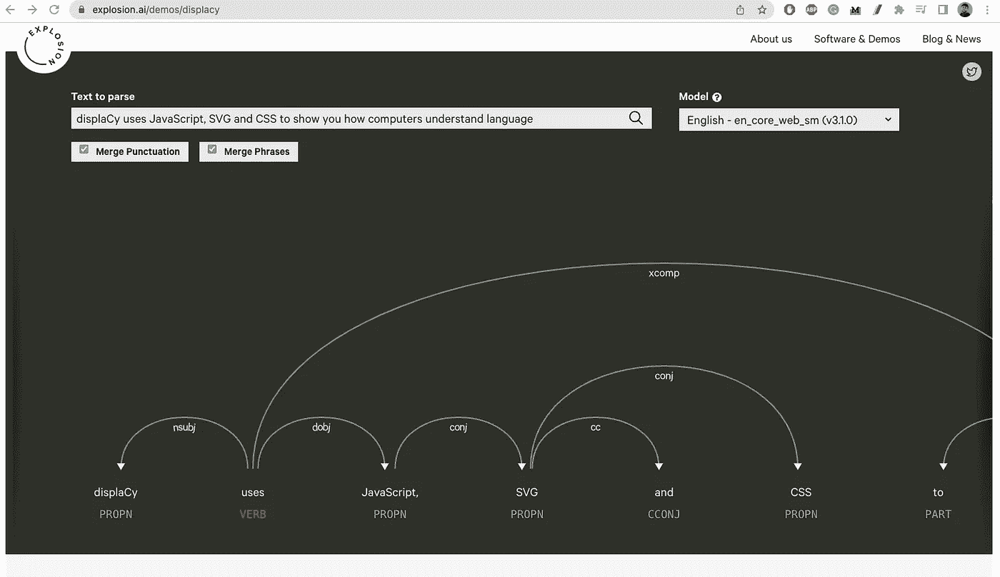
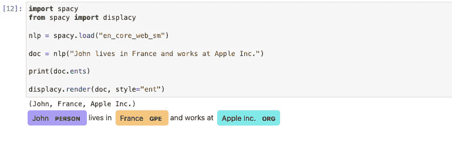
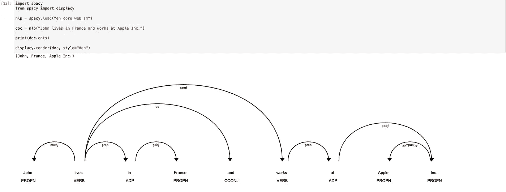
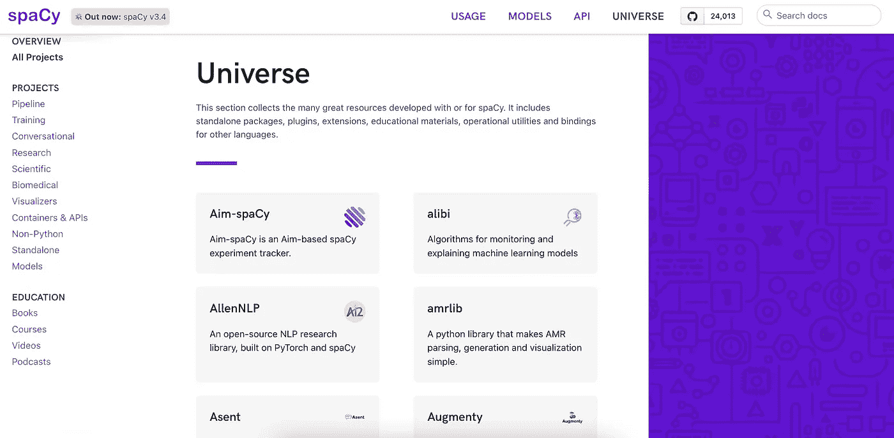

# 7 个空间特性，提升您的 NLP 管道并节省时间

> 原文：<https://towardsdatascience.com/7-spacy-features-to-boost-your-nlp-pipelines-and-save-time-9e12d18c3742>

## 除了简单的命名实体识别任务之外，我从未使用过 spaCy。男孩，我错了。


由 [Lucas Kapla](https://unsplash.com/@aznbokchoy?utm_source=medium&utm_medium=referral) 在 [Unsplash](https://unsplash.com?utm_source=medium&utm_medium=referral) 上拍摄的照片

我最近开始重新访问 spaCy 库，并尝试它的许多核心功能来执行低级语言任务。

如果您从未听说过它，spaCy 是一个现代自然语言处理库，它处理+66 种语言，提供最先进的速度，并具有用于命名实体识别任务、词性标记、实体链接等的各种组件。此外，它很容易通过定制组件和属性进行扩展。



作者截图

> ***在本帖中，我将与您分享 7 个技巧，以充分利用 spaCy 并利用它来工业化和扩展您的 NLP 管道。***

如果你是一名从事 NLP 项目的数据科学家，并且愿意改进自己的工具箱并学习新的强大工具，你绝对应该看看这篇文章。

事不宜迟，让我们来看看🔍

***PS**** *:如果你是 spaCy 新手，推荐你看一下这个* [*链接*](https://spacy.io/usage/spacy-101) *就可以入门了。*

[](https://medium.com/membership/@ahmedbesbes) [## 加入我的介绍链接媒体-艾哈迈德贝斯

### 阅读 Ahmed Besbes 的每一个故事(以及媒体上成千上万的其他作家)。您的会员费直接支持…

medium.com](https://medium.com/membership/@ahmedbesbes) 

# 1—强大的管道:您需要的一切都封装在 Doc 对象中

我很少见过界面如此简单易用的库。

假设您想要接收一堆文本文档，应用一些处理，如标记化和词汇化，然后预测命名实体、词性(POS)标记和语法依赖。

如果您使用传统的库，这看起来像是一个接一个地调用和管道传输大量的后续函数。

然而，使用 spaCy，所有这些都可以在 3 行代码中完成。

*   进口空间(咄！)
*   加载预训练模型
*   将文本列表传递给模型并提取文档对象

```
**import spacy****nlp = spacy.load("en_core_news_sm")
texts = ... # texts loaded in a list
docs = nlp(docs)**
```

> **Doc 对象里面是什么？我听到你问了。**

当你把一个文本传递给`nlp`对象时，spaCy 会把它变成一个`Doc`对象。

此 Doc 对象是处理管道的结果，该管道包括:

*   标记化
*   词性标注
*   依存句法分析
*   命名实体识别(NER)
*   以及更多您可以自己设计的定制组件



作者截图

更具体地说，Doc 对象是由令牌化算法产生的令牌对象列表。每个令牌将每个步骤的输出存储为一个属性。

以下是其中的一些:

*   `text`:令牌的文本
*   `dep_`:句法依存关系
*   `tag_`:词性标签
*   `lemma_`:令牌的基本形式，没有屈折后缀

要了解更多关于令牌属性以及可以从 Doc 对象中获得什么，请查看这个[页面](https://spacy.io/api/token#attributes)。

# 2 —一流的处理速度

spaCy 旨在处理大量文档，并用于工业环境。因此，它提供了对多处理的内置支持。

如果你在`nlp`对象中放入一大串文本，你不会得到任何加速。

为了加速推理，您必须使用`nlp.pipe`函数，设置`n_process`参数来利用多处理，并设置`batch_size`参数来启用批处理。

小心，批处理并不总是有效的。这取决于您的数据集和您使用的模型。查看此[页面](https://spacy.io/usage/processing-pipelines/#multiprocessing)了解更多信息

> ***仅启用您正在使用的组件***

还有另一个技巧可以用来加速 spaCy 处理管道:当实例化 spaCy 对象时，**只启用您感兴趣的组件**。

例如，如果您想使用命名实体识别器组件，您不一定需要位置标记器或依赖解析器，因为这些组件独立于 NER 组件。

当加载一个模型时，您可以使用`disable`参数来禁用这些组件。

```
**import spacy****nlp = spacy.load("en_core_web_sm", disable=["tagger", "parser"])**
```

# 3-使用 Matcher 类进行高级模式匹配

有一个 spaCy 功能我忽略了很长时间，尽管它的效率令人难以置信，但我从未真正使用过。是[匹配器](https://spacy.io/api/matcher)类。

这个类是一个规则匹配引擎，允许您基于模式匹配标记序列。从概念上讲，这类似于正则表达式，但是这个类处理更复杂的依赖于标记注释(即属性)的模式。

> ***spaCy 图案是什么样子的？***

令牌模式是一个字典，它结合了令牌属性、操作符和属性。

如果您不确定什么是操作符和属性，请继续关注我，让我们看看下面的例子。

→假设我们想在您的文档中匹配单词“Hello”。(非常简单，但也很公平)

为此，我们将编写一个使用令牌文本属性的模式。

```
**pattern = [
   {"TEXT": "Hello"}
]**
```

然后，将此模式添加到匹配器中。

```
**from spacy.matcher import Matcher****nlp = spacy.load("en_core_web_sm")****matcher = Matcher(nlp.vocab)
matcher.add("HelloPattern", [pattern])**
```

一旦空间文档被传递给匹配器，我们将获得元组形式的匹配(match_id，token_start，token_end)。

```
**doc = nlp("Hello my friend!")****matcher(doc)****[(10496072603676489703, 0, 1)]**
```

以下是完整的代码:

→如果我们想使模式不区分大小写，我们可以使用 LOWER 键:

```
**{"LOWER": "hello"}**
```

→现在，假设我想匹配一个文档中的所有名词。简单！用 POS 键就行了。在这种情况下，依赖空间令牌的属性是有用的。

```
**{"POS": "NOUN"}**
```

→如果想匹配所有以“爱”或“恨”为基础形式(即 lemma)的表征怎么办？使用与`IN`属性结合的 LEMMA 键。

```
**{"LEMMA": {"IN": ["love", "hate"]}}**
```

→你如何发现连续出现的两个名词**？您使用 POS 属性并将其与`{n}`操作符结合使用。**

```
**{"POS": "PROPN", "OP": "{2}"}**
```

**到目前为止，我们只看到了单个令牌的模式。当您将多个模式堆叠在一起以匹配标记序列(即短语)时，实际上会变得更加有趣。**

**下面是 Matcher 类派上用场的一些用例:**

*   **匹配两个连续令牌“买入/卖出”和“比特币/dogecoin”的组合。**

*   **根据标记的位置属性匹配标记序列。这为什么有用？想象一下，出于某种原因，您希望匹配由一个形容词后跟一个名词组成的表达式(快乐的电影，糟糕的餐馆)**

```
**pattern = [
    {"POS": "ADJ"},
    {"POS": "NOUN"}, 
]**
```

*   **匹配日期，电子邮件，网址，数字**

```
**pattern_email = [["LIKE_EMAIL": True]]
pattern_url = [["LIKE_URL": True]]
pattern_num = [["LIKE_NUM": True]]**
```

*   **匹配基于其引理和词性标签的记号**

```
**# Matches "love cats" or "likes flowers"
pattern_lemma_pos = [
    {"LEMMA": {"IN": ["like", "love"]}}, 
    {"POS": "NOUN"}
]**
```

*   **根据令牌的长度匹配令牌**

```
**pattern_length = [
    {"LENGTH": {">=": 10}}
]**
```

**要了解更多关于匹配引擎的功能，请看这个[页面](https://spacy.io/api/matcher)。这将为您提供属性、操作符、属性的语法以及如何组合它们的详细概述。**

**您还可以使用基于规则的匹配器浏览器，它允许您交互式地创建令牌模式，并在您的输入文本上显示检测结果。**

****

**作者截图**

# **4—将知识库与统计模型相结合，以改进 NER 任务**

**通过使用 spaCy 提供的 EntityRuler 类，您可以基于命名实体的字典构建自己的命名实体识别器。**

> ***→这意味着如果您需要检测一堆文档中的这些命名实体，* ***您不必实现搜索逻辑或正则表达式来匹配它们*** *。您只需要将模式传递给 EntityRuler，将实体标尺作为组件添加到管道中，并将文档传递给 spaCy 来为您处理检测。***

**当使用 EntityRuler 时，您可以在空白模型中注入模式，也可以在已经有 NER 组件的模型中注入模式:在这种情况下，spaCy 完成将统计模型的预测与基于规则的模式相结合的工作。**

**让我们来说明这两种情况；**

****→例#1:给空白模型添加实体标尺**从一个空白的英文模型开始，给它添加图案。在这个例子中，我们采用了一个没有 NER 模块的空间模型，并向它传递了一个我们希望检测为命名实体的模式列表。**

**这是一个很简单的例子，看起来不是很有用。实际上，当您添加一个带有不同标签的大型模式列表(例如，疾病列表、化合物、技术术语、非常具体的组织名称等)时，实体标尺非常有用。)预训练的模型不能检测(即训练的)。**

****→示例#2:向具有 NER 组件的模型添加实体标尺** 从具有经过训练(即统计)的 NER 组件的 spaCy 英语模型开始，并向其添加先前未检测到的附加实体的模式列表。潜在的目标是提高模型的性能。**

**以下是添加实体标尺改善统计模型预测的一个用例:检测生物医学实体🧪.**

**模式是从知识库和本体中构建和管理的，然后被注入到空间模型中。**

> **为什么不重新培训一名新的 NER 模特呢？**

**虽然这似乎是一种有效的方法，但重新训练模型肯定效率较低，因为它需要大量的数据。事实上，你感兴趣的新模式必须出现在不同的上下文中(如句子)，这样模型才能捕捉到它们。在一个训练好的模型上添加这些模式通常是一个快速的胜利。**

> ****在哪里放置实体标尺，在 NER 组件之前还是之后？****

**实体标尺可以添加在 NER 组件之前或之后。**

**→如果将其添加到 NER 组件之前，该组件将考虑现有的实体跨度，并围绕其调整预测。在大多数情况下，这是 spaCy 推荐的方式。**

**→如果添加在 NER 组件之后，实体标尺将仅在跨度不与现有实体重叠时添加跨度到`doc.ents`。**

**您可以在此了解更多关于组合统计模型和实体标尺的信息[。](https://spacy.io/usage/rule-based-matching#models-rules)**

# **5 —范围、实体和依赖关系的丰富可视化**

**spaCy 提供了内置的可视化工具(displaCy 和 displaCy-ent ),能够显示有趣的标记属性，如词性(POS)标记、语法依赖图、命名实体或范围。**

**这种可视化是直接从浏览器或 jupyter 笔记本上完成的。**

**我个人经常使用 displaCy 来可视化命名实体，以便调试我的模型。**

**→这里有一个显示命名实体可视化工具的演示**

****

**作者截图**

**→这里有一个[演示](https://explosion.ai/demos/displacy-ent)依赖关系图的显示可视化工具(水平滚动以可视化整个图形)**

****

**作者截图**

**下面是一个可视化实体的代码示例。**

**如果您从笔记本上运行它，您将得到以下输出:**

****

**作者截图**

**如果您将样式属性设置为`dep`，您将得到以下输出:**

****

**作者截图**

**【Streamlit 用户奖励📍spaCy 可视化工具也可以嵌入到 Streamlit 应用程序中。如果你像我一样是 Streamlit 的粉丝，你可以使用 [spacy-streamlit](https://github.com/explosion/spacy-streamlit) ，这是一个帮助你将 spacy 可视化集成到你的 web 应用程序中的包。**

# **6—多种预训练语言模型**

**spaCy 为许多语言提供了预训练模型(+66)。对于每种语言，都有不同大小的模型，这取决于它们的架构和训练语料库。**

**例如，如果你对英语感兴趣，你会发现这三种不同的模式:**

*   **网络版(12MB)**
*   **网络版(40MB)**
*   **en _ core _ web _ LG(560 米)**

**这些模型在内存消耗和准确性方面(略有)不同。它们都支持相同的任务。有趣的是，只有中型和大型模型有词向量(即嵌入)。**

**可以在这里 了解型号 [*。*](https://spacy.io/models/en)**

**您还可以在这里查看社区使用 spaCy [所产生的内容。](https://github.com/search?q=spacy&type=Repositories)**

# **7—丰富的开源项目和插件库**

**spaCy 有一个充满活力的社区，它在构建开源项目、培训语言模型和开发可视化或高级语言任务的插件方面做了令人惊叹的工作。**

**希望你能在这个[页面](https://spacy.io/universe/category/apis)上找到这些参考项目。**

**这有助于开始或激发灵感，并且在大多数情况下，有助于解决官方图书馆尚未解决的问题。**

****

# **资源**

*   **[https://medium . com/besedo-engineering/spacy-matchers-guidelines-c 38207 f 884d 7](https://medium.com/besedo-engineering/spacy-matchers-guidelines-c38207f884d7)**
*   **[https://course.spacy.io/en/chapter1](https://course.spacy.io/en/chapter1)**
*   **[https://www.youtube.com/watch?v=BXzFAjtenHM&ab _ channel =爆炸](https://www.youtube.com/watch?v=BXzFAjtenHM&ab_channel=Explosion)**
*   **https://youtu.be/mDiC6at1TlE**
*   **[https://medium . com/forward-data-science/in-depth-spacy-tutorial-for-初学者-nlp-2ba4d961328f](https://medium.com/towards-data-science/in-depth-spacy-tutorial-for-beginners-in-nlp-2ba4d961328f)**

# **感谢阅读🙏**

**如果你做到了这一步，我想感谢你的时间，我希望你和我一样喜欢这些关于空间的小贴士。**

**spaCy 非常强大，这篇文章绝不是对它所有特性的详尽概述。显然，在培训管道和与变形金刚库的集成之间还有更多的内容要涵盖。**

**但这可能是另一篇文章的主题。**

**不管怎样，我今天就到这里了。下次见！👋**

# **新到中？你可以每月订阅 5 美元，并解锁各种主题的无限文章(技术、设计、创业……)你可以通过点击我的推荐链接[来支持我](https://ahmedbesbes.medium.com/membership)**

**[](https://ahmedbesbes.medium.com/membership) [## 加入我的介绍链接媒体-艾哈迈德贝斯

### 阅读 Ahmed Besbes 的每一个故事(以及媒体上成千上万的其他作家)。您的会员费直接支持…

ahmedbesbes.medium.com](https://ahmedbesbes.medium.com/membership)**