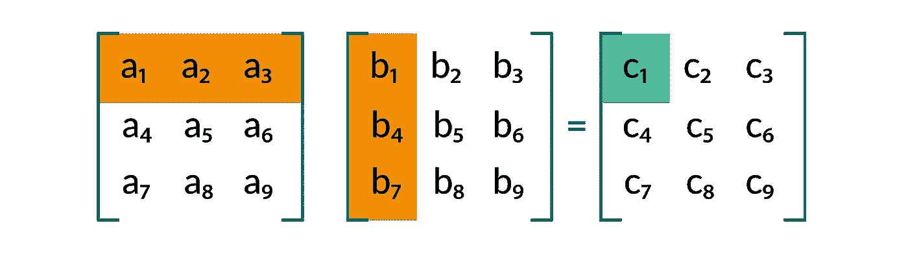
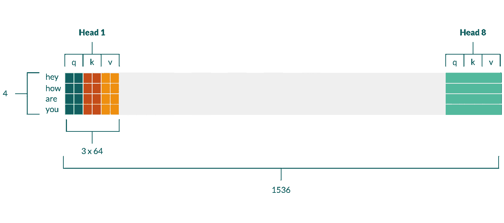
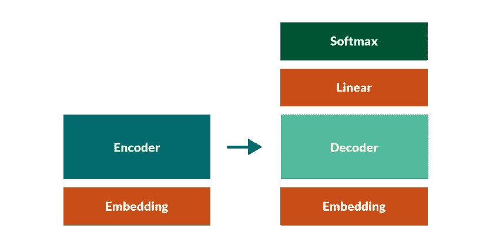

# 从头开始实现转换器

> 原文：<https://towardsdatascience.com/7-things-you-didnt-know-about-the-transformer-a70d93ced6b2>

## 关于变压器，你可能不知道的 7 件令人惊讶的事情


在 [Unsplash](https://unsplash.com?utm_source=medium&utm_medium=referral) 上由 [Silas Baisch](https://unsplash.com/@silasbaisch?utm_source=medium&utm_medium=referral) 拍摄

# 介绍

为了更好地熟悉变形金刚的具体细节，我决定从头开始实现“[注意力是你所需要的全部”](https://papers.nips.cc/paper/2017/file/3f5ee243547dee91fbd053c1c4a845aa-Paper.pdf)一文中的原始架构。我以为我知道所有该知道的事情，但是令我自己惊讶的是，我遇到了几个意想不到的实现细节，这让我更好地理解了所有事情是如何在幕后工作的。

这篇文章的目的不是讨论整个实现——有很多很好的资源可以讨论——而是为了**强调** **我发现的特别令人惊讶或有见地的七件事，以及你可能不知道的**。我将通过使用超级链接机器人[指向我的](https://github.com/jsbaan/transformer-from-scratch)[代码](https://github.com/jsbaan/transformer-from-scratch)中的特定行来具体说明这一点🤖(试试吧！).代码应该很容易理解:它有很好的文档记录，并使用 Github 动作自动进行单元测试和类型检查。

这个帖子的结构很简单。前三点围绕实施多头关注；最后四个是关于其他组件的。我假设你对变形金刚和多头注意力有概念上的熟悉(如果没有；一个很好的起点是[图解变形金刚](https://jalammar.github.io/illustrated-transformer/)，它极大地帮助了我更好地理解多头注意力背后的机制。也是涉及最多的一点。

```
**Table of Contents**[Introduction](#29a2)
1\. [Multi-head attention is implemented with one weight matrix](#81ba)
2\. [The dimensionality of the key, query and value vectors is not a hyperparameter](#e7de)
3\. [Scaling in dot-product attention avoids extremely small gradients](#5d70)
4\. [The source embedding, target embedding AND pre-softmax linear share the same weight matrix](#1f65)
5\. [During inference we perform a decoder forward pass for every token; during training we perform a single forward pass for the entire sequence](#0c55)
6\. [Transformers can handle arbitrarily long sequences, in theory](#f5d8)
7\. [Transformers are residual streams](#7ea0)
[Wrapping up](#2830)
```

# **1。多头注意力通过一个权重矩阵实现**

在我们深入研究之前；回想一下，对于每个注意力头**，我们需要一个查询、键以及每个输入令牌的值向量**。然后我们计算**注意力分数**作为一个查询和句子中所有关键向量[之间的**比例点积**的软最大值🤖](https://github.com/jsbaan/transformer-from-scratch/blob/main/multi_head_attention.py#L170))。下面的等式一次计算每个输入标记的所有值向量的**注意力加权**平均值。 **Q** 是为所有输入令牌堆叠 **q** 查询向量的矩阵； **K** 和 **V** 对 **k** ey 和**V**value 向量做同样的事情。


那么，我们如何有效地为所有令牌和头文件获得这些查询、键和值向量**？事实证明，我们可以使用单个权重矩阵** `W`一次性完成这个**。这不同于人们在阅读[论文](https://papers.nips.cc/paper/2017/file/3f5ee243547dee91fbd053c1c4a845aa-Paper.pdf)或[图解变压器](https://jalammar.github.io/illustrated-transformer/)后可能期望的**三个**投影权重矩阵。让我们来看看这是如何工作的。**

假设我们的输入由`4`个记号组成:[“嘿”、“怎么样”、“是”、“你”]，我们的嵌入大小是`512`。暂时忽略批处理，让`X`作为行的`4x512`矩阵堆栈令牌嵌入。

设`W`是一个有`512`行和`1536`列的权重矩阵。我们现在将放大这个`512x1536`维度权重矩阵`W` ( [**🤖**](https://github.com/jsbaan/transformer-from-scratch/blob/main/multi_head_attention.py#L20) )找出**为什么**我们需要`1536`维度和**如何**乘以`X`得到矩阵`P`(对于 **p** 项目)包含我们需要的所有查询、键和值向量。(代码中的[🤖](https://github.com/jsbaan/transformer-from-scratch/blob/main/multi_head_attention.py#L94)我称这个矩阵为`qkv`

## 多头注意力背后的矩阵乘法

得到的`4x1536`矩阵`P=X@W`中的每一个元素都是 `X`【一个嵌入】**中的一个行向量******和** `W`中的一个列向量** **【某些权重】之间的**(换句话说:点积)**的和**。****

作为矩阵乘法的复习，下图展示了当两个`3x3`矩阵相乘时，如何计算简单`3x3`矩阵的第一个元素。同样的策略也适用于我们更大的矩阵`X`和`W`。



举例:如何计算 3×3 矩阵乘法中的第一个元素？作者和 Rosalie Gubbels 的图片。

所以，我们投影矩阵中第`i`行`P[i, :]`的每个**元素**都是`i`第**令牌** **嵌入** `X[i, :]`和`W`中**权重列**之一的**线性组合**。这意味着我们可以简单地在权重矩阵`W`中堆叠更多的列，从而为嵌入在`X`中的每个令牌创建更多独立的线性组合(标量)。换句话说，`P`中的每个元素都是嵌入在`X`中的令牌的不同标量“**视图**或“**摘要**”，由`W`中的一列加权。这是理解带有“查询”、“键”和“值”向量的八个“头”**如何在`P`的每一行中隐藏**的关键。

## 揭示注意力和查询、关键和价值向量

我们可以**将**我们为`W`选择的`1536`列(最终作为`P`中的列数)分解到`1536 = 8 * 3 * 64`中。**在** `P`中，我们现在发现了隐藏在每一行中的八个头，每一个都有三个 64 维向量！每个这样的“向量”或“块”由嵌入令牌的`64`不同加权线性组合组成，我们**选择** **以某种方式解释**。你可以在下图中看到`P`的可视化表示以及如何分解它。分解也发生在代码中([🤖](https://github.com/jsbaan/transformer-from-scratch/blob/main/multi_head_attention.py#L96))。



P=X@W 包含所有头部的查询、键和值投影。作者和 Rosalie Gubbels 的图片。

对于一个**批次**中的多个句子，简单地想象一下在 P“后面”的第三维，它将 2D 矩阵变成 3D 矩阵。

## 编码器-解码器注意

对于编码器-解码器来说，这稍微复杂一些。回想一下，编码器-解码器关注允许每个解码器关注由最顶端的编码器输出的嵌入

为了引起编码器-解码器的注意，我们需要**查询向量**用于**解码器**令牌嵌入，以及**键和值向量**用于最顶层的**编码器**令牌嵌入。这就是为什么我们将`W`一分为二——一个`512x512`和一个`512x1024`矩阵([🤖](https://github.com/jsbaan/transformer-from-scratch/blob/main/multi_head_attention.py#L122) ) —并执行两个独立的投影:一个从编码器的嵌入中获得键和值向量([🤖](https://github.com/jsbaan/transformer-from-scratch/blob/main/multi_head_attention.py#L125))，一个用于获得解码器嵌入的查询向量([🤖](https://github.com/jsbaan/transformer-from-scratch/blob/main/multi_head_attention.py#L132))。

最后，注意我们确实需要**第二个权重矩阵** ( [🤖](https://github.com/jsbaan/transformer-from-scratch/blob/main/multi_head_attention.py#L21))在多头注意力中混合来自每个头的值向量，并获得每个令牌的单个上下文嵌入([🤖](https://github.com/jsbaan/transformer-from-scratch/blob/main/multi_head_attention.py#L76))。

# 2.关键字、查询和值向量的维度是**而不是超参数**

我从未真正考虑过这个问题，但我总是假设查询、键和值向量的维度是一个超参数。结果，**被动态设置为嵌入维数除以头数** : `qkv_dim = embed_dim/num_heads = 512/8 = 64` ( [🤖](https://github.com/jsbaan/transformer-from-scratch/blob/main/multi_head_attention.py#L16))。

这似乎是 Vaswani 等人的设计选择，以保持多头注意力中的参数数量恒定，而不管选择的头数。**虽然您可能认为参数的数量会随着头的增加而增加，但实际情况是查询、键和值向量的维度会减少。**

如果我们看看上面显示`R=X@W`的图，并想象单头注意力，这就变得很清楚了。`X`、`W`和`R`中的元素数量保持八个头不变，但是我们**解释`R` 中的**元素的方式改变了**。**使用单个头，我们每个令牌嵌入只有一个查询、键和值投影(`P`中的一行)，它们将跨越每行的三分之一:`512`元素—与嵌入大小相同。

你可能会想，多头有什么意义呢？嗯，Vaswani 等人认为，它允许头部捕捉不同的“表征子空间”。比如说；一个头可能跟踪句法关系，而另一个更关注位置信息。有相当多的工作调查这在实践中是否确实发生，例如在[翻译](https://aclanthology.org/P19-1580.pdf)中。事实上，几年前在[总结](https://arxiv.org/pdf/1911.03898.pdf)中我自己也做了一些这方面的工作。

# **3。点积注意力的缩放避免了极小的梯度**

类似于前一点，我从来没有真正思考过**为什么**我们用一些常数来划分注意力逻辑🤖但是这实际上很简单。

回想一下，每个 logit 都是一个查询和一个关键向量之间的点积(即元素乘积之和)的结果。因此，更大的维度数`qkv_dim`会导致该总和中更多的乘积——导致注意力逻辑中**更高的方差**。正如我们在下面的例子中看到的，对具有**高方差**的 logits 进行 softmax 变换会导致**极小的输出概率**——因此**微小的梯度**。

# 4.源嵌入、目标嵌入和预 softmax 线性共享相同的权重矩阵

我们现在从多头注意力转移到“**权重绑定**”——序列到序列模型的常见做法。我发现这很有趣，因为嵌入权重矩阵实际上弥补了相对于模型其余部分的**巨大**数量的参数。给定 30k 令牌的词汇表和 512 的嵌入大小，这个矩阵包含**1530 万个**参数！

想象一下有三个这样的矩阵:一个将源标记索引映射到嵌入，一个将目标标记映射到嵌入，一个将解码器的每个最顶层上下文化标记嵌入映射到目标词汇表(前 softmax 线性层)上的逻辑。是啊；这给我们留下了 4600 万个参数。



重量捆绑:三个红色方块共享相同的重量矩阵。作者和 Rosalie Gubbels 的图片。

在代码中你可以看到我初始化了主 transformer 类中的**一个**嵌入层([🤖](https://github.com/jsbaan/transformer-from-scratch/blob/main/transformer.py#L33))，我用它作为编码器嵌入(￠[￠](https://github.com/jsbaan/transformer-from-scratch/blob/main/encoder.py#L24))，解码器嵌入([🤖](https://github.com/jsbaan/transformer-from-scratch/blob/main/decoder.py#L31))和解码器预软最大变换权重([🤖](https://github.com/jsbaan/transformer-from-scratch/blob/main/decoder.py#L44))。

# 5.在推理过程中，我们为每个令牌执行一次解码器前向传递；在训练中，我们在整个序列中执行一次向前传球

这一点对某些人来说可能是显而易见的——尤其是那些从事序列到序列任务的人——但是对于理解一个变形人实际上是如何被训练的却至关重要。

## 推理

假设我们处于**推理模式**，在这种模式下，我们自回归(一个接一个)预测目标令牌。转换器总是输出**批**中每个令牌的词汇分布。基于批次中最后一个令牌索引[的的**输出分布**预测下一个令牌🤖****](https://github.com/jsbaan/transformer-from-scratch/blob/main/transformer.py#L112))。这意味着我们基本上**抛弃**所有先前指数的所有输出分布。

## 培训和教师强制

这与我们使用**老师强迫**的**培训**形成对比。在训练期间，我们只执行**一次**正向通过解码器**，而不管序列长度** ( [🤖](https://github.com/jsbaan/transformer-from-scratch/blob/main/train.py#L46))。我们(**老师)** **强制**——一次性喂完整批**。这给了我们**所有**下一个令牌预测，为此我们计算**平均**损失。**

**注意**每个标记预测都是基于先前的地面实况标记，而不是先前预测的标记！**还要注意，这种单次前向传递等同于仅使用地面真实令牌作为输入并忽略先前预测的自回归解码(！)，但效率要高得多。我们使用一个**注意力** **掩码**来限制解码器自我注意力模块关注未来令牌(标签)并作弊。**

**我认为，认识到这种称为教师强制的训练方式不仅适用于翻译模型，也适用于最受欢迎的预训练自回归语言模型，如 GPT-3，是很有用的。**

# **6.理论上，变压器可以处理任意长的序列…**

**…然而，实际上，多头注意力具有[计算和内存需求](https://ai.googleblog.com/2021/03/constructing-transformers-for-longer.html#:~:text=With commonly available current hardware,summarization or genome fragment classification)，将序列长度限制在 512 个令牌左右。事实上，像 BERT 这样的模型对输入序列长度施加了硬限制，因为它们使用学习嵌入而不是正弦编码。这些学习到的位置嵌入类似于令牌嵌入，并且类似地仅适用于达到某个数量的预定义位置集(例如，对于 BERT 为 512)。**

# **7.变形金刚是残余流**

**说到最后一点。我喜欢把一个变压器想象成多个“剩余流”。这类似于 LSTM 如何在逐个处理新令牌的同时保持从左到右的水平“内存流”，并通过门来调节信息流。**

**在一个 transformer 中，这个流不是跨令牌横向 **运行**，而是跨层**(例如编码器)和子层(即多头关注和全连接层)纵向** **。每个子层使用剩余连接简单地将信息添加到剩余流中。[这篇](https://transformer-circuits.pub/2021/framework/index.html)是一篇非常棒的博文，更详细地讨论了剩余流，而[这篇](https://openreview.net/pdf?id=HyzdRiR9Y7)是一篇很酷的论文，利用了“垂直递归”的概念。****

**这个剩余流的结果是**中间令牌表示的维数在所有(子)层**中必须相同，因为剩余连接**增加了** **两个向量**(编码器中的例子:[🤖](https://github.com/jsbaan/transformer-from-scratch/blob/main/encoder.py#L90))。最重要的是，因为编码器(和类似的解码器)层相互堆叠，它们的输出形状必须与输入形状匹配。**

# **正在总结…**

**感谢你阅读这篇文章！如果你喜欢它，有问题，或者发现了错误，请告诉我。你可以在推特上给我发消息，或者在 LinkedIn 上联系我。看看我在 jorisbaan.nl/posts 的其他博客。**

**尽管我写的[代码](https://github.com/jsbaan/transformer-from-scratch)很容易理解(它有很好的文档记录，经过单元测试和类型检查),请在实践中使用官方的 PyTorch 实现😁。**

**感谢 David Stap 提出从零开始实现变形金刚的想法，感谢 Dennis Ulmer 和 Elisa Bassignana 对本文的反馈，感谢 Lucas de Haas 的 bug 搜索会议和 Rosalie Gubbels 的视觉创作。我寻找灵感的一些伟大资源是 PyTorch transformer [教程](https://pytorch.org/tutorials/beginner/transformer_tutorial.html)和[实现](https://github.com/pytorch/pytorch/blob/master/torch/nn/modules/transformer.py)；菲利普·利佩的《变形金刚》[教程](https://uvadlc-notebooks.readthedocs.io/en/latest/tutorial_notebooks/tutorial6/Transformers_and_MHAttention.html)；亚历山大·拉什的[带注释的变形金刚](https://nlp.seas.harvard.edu/2018/04/03/attention.html)和杰伊·阿拉玛的[带插图的变形金刚](https://jalammar.github.io/illustrated-transformer/)。**