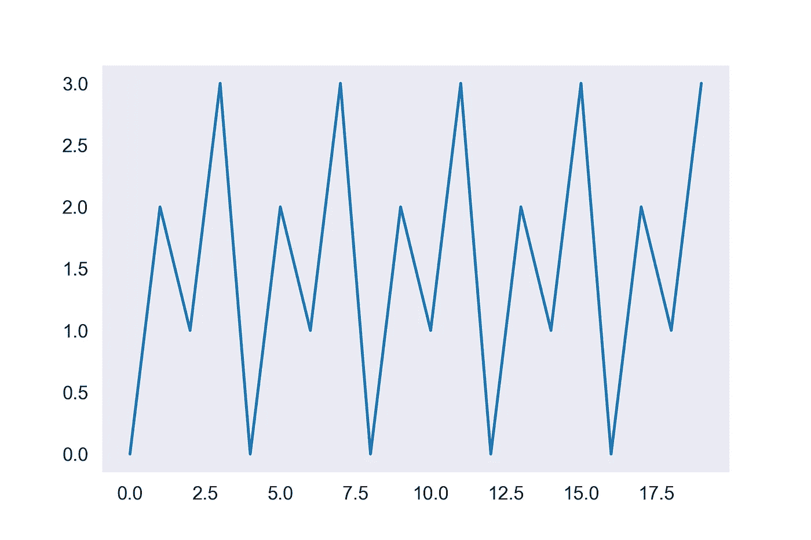
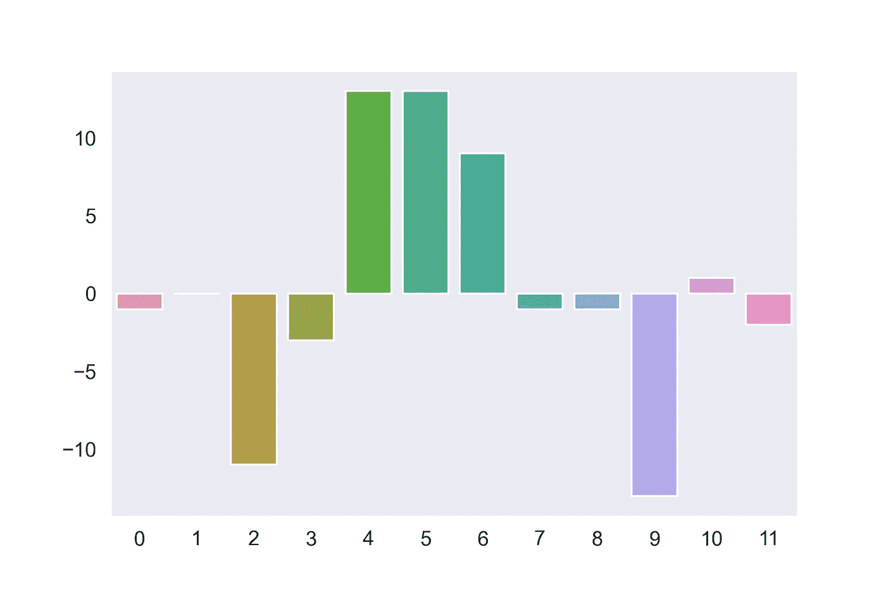
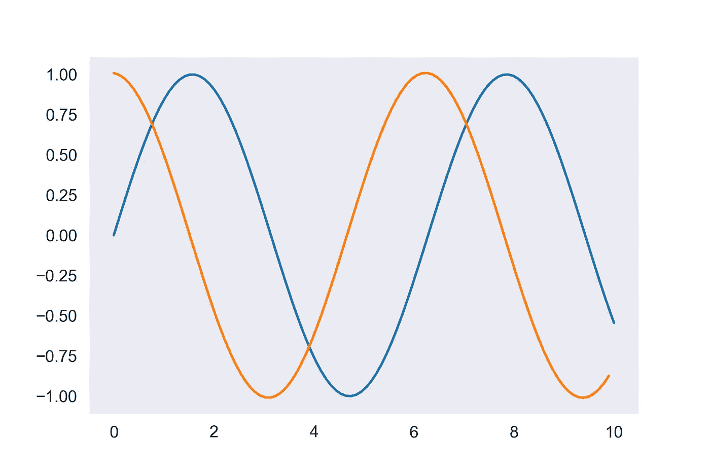

# Python 的 itertools 的 7 个有用例子

> 原文：<https://towardsdatascience.com/7-useful-examples-of-pythons-itertools-e561dc9f15ca>

## 通过灵活的实用函数和范例节省时间和代码

Python `itertools`库为处理可重复项提供了非常有用的实用函数。通过熟练掌握`itertools`函数，您可以以新的方式组合它们，并使用它们作为构建模块，用很少几行代码解决复杂的问题。在本文中，你将看到 7 个应用`itertools`函数的实例。

如果您想继续下去，确保导入`itertools`以及`matplotlib`、`seaborn`和`numpy` 用于涉及可视化的例子。

```
import itertools
import matplotlib.pyplot as plt
import seaborn as sns
import numpy as np
```

## 1.用 cycle()制作重复序列

函数将无限重复你给它的任何 iterable。通过使用`islice()`函数，您可以获得任意长度的序列，其中包含您选择的重复子序列。您可以使用它来快速生成一些周期性数据。下面的代码创建了一个 20 项的列表，包含重复序列 0，2，1，3，…

```
data = list(itertools.islice(itertools.cycle([0, 2, 1, 3]), 0, 20))
sns.lineplot(x=range(len(data)), y=data)
```



作者图片

除了`cycle()`，你可能还会发现`count()`很有用，它只是在一个无限迭代器中从一个给定的数字向上计数。

## 2.用组合()获得集合的所有可能组合

假设你和你的朋友想要制定一个烹饪计划，每周两个人为整个团队做饭。有多少独特的厨师组合？这是数学组合的经典案例，用`combinations()`就能轻松得到答案。

```
names = ["Alice", "Bob", "Charlie", "Dora", "Evgenia", "Farhat"]
print(list(itertools.combinations(names, 2)))# [('Alice', 'Bob'),
#  ('Alice', 'Charlie'),
#  ('Alice', 'Dora'),
#  ('Alice', 'Evgenia'),
#  ('Alice', 'Farhat'),
#  ('Bob', 'Charlie'),
#  ('Bob', 'Dora'),
#  ('Bob', 'Evgenia'),
#  ('Bob', 'Farhat'),
#  ('Charlie', 'Dora'),
#  ('Charlie', 'Evgenia'),
#  ('Charlie', 'Farhat'),
#  ('Dora', 'Evgenia'),
#  ('Dora', 'Farhat'),
#  ('Evgenia', 'Farhat')]
```

组合还会告诉你一组 N 个人互相握手所需的独特握手的数量，或者 N 个变量的协方差值的数量。

## 3.用产品()替换嵌套循环

在一副扑克牌中，你有 13 种面值和 4 种花色，总共 52 张牌。大家可以看到，牌的总数是 13 和 4 的乘积，所有牌的集合是面值的集合和花色的集合的[笛卡尔积](https://en.wikipedia.org/wiki/Cartesian_product)。您可以使用`product()`功能快速获得所有扑克牌的列表，而无需诉诸循环。我经常发现使用`product()`比创建难以阅读的嵌套循环要优雅得多。

```
values = ["Ace", "2", "3", "4", "5", "6", "7", "8", "9", "10", "Jack", "Queen", "King"]
suits = ["Hearts", "Diamonds", "Clubs", "Spades"]
print(list(itertools.product(values, suits)))
```

另一个例子是数据集。假设您有几种语言的数据集，对于每种语言，您都有一个测试、训练和验证集。您可以使用`product()`，而不是使用嵌套循环来表示尽可能多的文件名。

```
datasets = ["english", "spanish", "arabic", "chinese", "japanese"]
splits = ["train", "test", "validation"]for dataset, split in itertools.product(datasets, splits):
    print(f"{dataset}_{split}.txt")# english_train.txt
# english_test.txt
# english_validation.txt
# spanish_train.txt
# ...
```

## 4.使用带有 compress()的布尔索引从列表中选择数据

如果您使用过像`pandas`这样的数据科学库，您可能习惯于使用布尔索引来索引一个系列或数据帧。换句话说，您可以获取一系列布尔值，如`[True, False, False, True, ...]`，并选择系列或数据帧中的行，这样结果就只包括相应布尔值为`True`的行。那么，你知道你实际上也可以用 Python 列表和 iterables 做到这一点吗？假设您只想要字母表中每三个字母的列表。您可以使用`compress()`函数，它接受一个 iterable 和一个 iterable 的真/假(或 1/0)值，并执行布尔索引。下面的代码以两种不同的方式实现这一点，每一种都使用不同的先前见过的`itertools`函数作为助手。

```
import stringprint(list(itertools.compress(string.ascii_lowercase, itertools.cycle([1, 0, 0]))))
# ['a', 'd', 'g', 'j', 'm', 'p', 's', 'v', 'y']print(list(itertools.compress(string.ascii_lowercase, map(lambda x: x % 3 == 0, itertools.count()))))
# ['a', 'd', 'g', 'j', 'm', 'p', 's', 'v', 'y']
```

## 5.用 accumulate()计算累积和与积

这里有一个有趣的问题:给定一个长度为 N 的列表，您的任务是创建一个函数，该函数采用两个索引 I 和 j(使得 i < j ),并计算位于索引 I 和索引 j 之间的子列表中的项目的总和。您可以对列表进行什么样的预计算以使这些查询尽可能快？

`accumulate()`函数从开始到结束计算列表中项目的累积和(默认情况下)。下面的代码生成一个随机的整数数组，用`accumulate()`在一行中预先计算一个累积和列表，并使用这个预先计算的数组返回子列表问题的常数时间解决方案。

```
original_list = np.random.randint(0, 100, (100,))
cumulative_list = list(itertools.accumulate(original_list))def query(i, j):
    return cumulative_list[j] - cumulative_list[i]
```

您可以提供另一个函数作为`accumulate()`的参数来改变行为，这样您就可以很容易地计算累积积或一些其他函数。

## 6.用 Repeat()无限重复一个值

假设您想要创建一个以人名作为关键字的字典，除了您想要每个人在创建字典时最初都有一个特定的默认值。您可以遍历名称列表，并将默认值与每个名称相关联。一种更优雅的方式是使用`dict()`构造函数、`zip()`函数和`itertools.repeat()`。`repeat()`函数将简单地在一个无限迭代器中重复相同的值，这意味着当你将它与一个有限列表压缩在一起时，将会生成精确的重复次数。`dict()`构造函数可以接受(键，值)元组的 iterable，初始化一个字典，每个键映射到每个值。我们可以不使用循环就完成我们想要的。

```
names = ["Alice", "Bob", "Charlie", "Dora", "Evgenia", "Farhat"]
names_dict = dict(zip(names, itertools.repeat("Default")))# {'Alice': 'Default',
#  'Bob': 'Default',
#  'Charlie': 'Default',
#  'Dora': 'Default',
#  'Evgenia': 'Default',
#  'Farhat': 'Default'}
```

## 7.用 starmap()在元组列表中映射函数

`starmap()`函数类似于 Python 的内置`map()`函数，它将函数应用于 iterable。不同之处在于，starmap()将一个双参数函数应用于元组的 iterable，例如`starmap(lambda x, y: x ** y, [(2, 3), (3, 2), (1, 5)])`将返回序列`[8, 9, 1]`的迭代器，即`[2**3, 3**2, 1**5]`。这种方法的一个潜在应用是计算列表中成对项目之间的差异。下面的代码使用`zip()`和列表切片从`temps`列表中创建一个成对条目的 iterable，然后应用减法函数。这就产生了一个每日温度变化的列表，我们可以将其绘制成柱状图。

```
temps = [70, 69, 69, 58, 55, 68, 81, 90, 89, 88, 75, 76, 74]
diffs = list(itertools.starmap(np.subtract, zip(temps[1:], temps[:-1])))
data = {"x": list(range(len(diffs))), "y": diffs}
sns.barplot(data=data, x="x", y="y")
```



作者图片

我们可以用同样的想法来创建一个函数导数的数值近似值。如果我们在 x 的一个小变化上有一个值序列(在这种情况下，正弦函数每 0.1 个单位计算一次)，我们将值的成对差除以 x 的变化，我们会得到一条看起来完全像余弦函数的曲线，它实际上是 sin(x)的导数。

```
x = np.linspace(0, 10, 100)
y = np.sin(x)              
diffs = list(itertools.starmap(lambda x, y: (x-y)/0.1, zip(y[1:], y[:-1]))) # this list is one shorter than the original list
sns.lineplot(x=x, y=y)
sns.lineplot(x=x[:-1], y=diffs)
```



蓝色曲线是根据原始列表绘制的，包含均匀分布的 x 值和相应的 sin(x)值。橙色曲线来自于使用 starmap()对列表中的值进行成对差分。图片作者。

虽然这是一个有些做作的例子，但希望您能看到这在各种情况下是如何有用的。您不局限于使用简单的函数，如减法和取幂，而是可以提供您自己的自定义函数作为`starmap()`的第一个参数。

## 结论

我希望你喜欢这些例子。这些功能你有什么喜欢的用法吗？关于`itertools`的伟大之处在于，一旦你习惯了它们，你就有无穷无尽的方法来混合和搭配它们。拥有这些方便的子例程在处理较难的问题时会有很大帮助，并最终使我的代码更加优雅和健壮。查看`itertools` [文档](https://docs.python.org/3/library/itertools.html)中更多的函数和例子！