# 你需要知道的 7 个有用的熊猫展示选项

> 原文：<https://towardsdatascience.com/7-useful-pandas-display-options-you-need-to-know-51956e89aa2f>

## 一步一步提升你的熊猫技能


熊猫图书馆提供了许多不同的选择。图片由作者使用 DALL-E 2 生成。

[Pandas](https://pandas.pydata.org/) 是数据科学中常用的强大的 [Python](https://www.python.org/) 库。它允许您从各种来源加载和操作数据集，并且通常是您在数据科学之旅中遇到的第一批库之一。

当使用熊猫时，默认选项将适合大多数人。但是，有时您可能希望更改显示内容的格式。熊猫有许多用户可配置的选项，允许你定制东西是如何显示的。

以下部分说明了更改这些默认设置的一些用例。可用选项的完整列表可在 [**这里**](https://pandas.pydata.org/pandas-docs/stable/user_guide/options.html#available-options) 找到。

在本文中，我们将讨论:

*   **控制显示行数**
*   **控制要显示的列数**
*   **压制科学记数法**
*   **控制浮点精度**
*   **控制十进制格式**
*   **改变后端绘图库**
*   **重置显示选项**

# 1.控制熊猫数据框显示的行数

有时，在查看数据帧时，您经常希望看到比默认行数(设置为 10)更多的行数。这包括数据帧的前 5 行和后 5 行。

这可以防止 pandas 在调用 dataframes 时显示大量数据，从而降低计算机速度。

要生成此示例的示例数据，您可以使用以下代码:

```
arr_data = np.random.default_rng().uniform(0, 100, size=(100,5))
pd.DataFrame(arr_data, columns=list('ABCDE'))
```

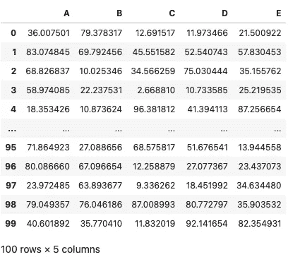

pandas 使用默认选项生成的基本数据帧。图片由作者提供。

有两个选项可用于控制显示多少行。

第一个是`display.max_rows`，它控制在截断数据帧之前显示的最大行数。如果数据帧中的行数超过此数，则显示将被截断。默认情况下，该值设置为 60。

如果您想在 dataframe 被调用时显示所有的行，您需要更改`display.max_rows`选项并将其设置为`None`。请注意，如果您有一个非常大的数据帧，这可能会降低您的计算机速度。

```
pd.set_option('display.max_rows', None)
```

当您调用我们的数据框架时，您可以看到其中的每一行。

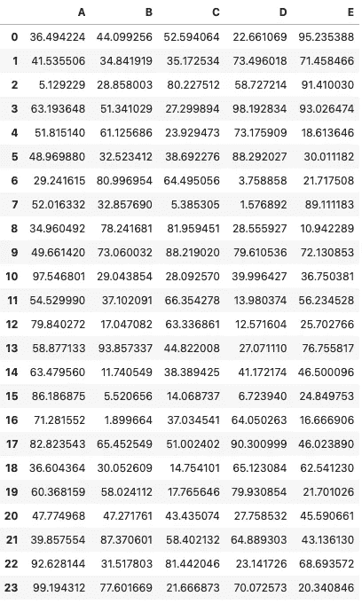

更改 max_rows 的默认选项后的 Pandas dataframe。图片由作者提供。

如果 dataframe 包含的行数多于`max_rows`设置的行数，那么您必须将`display.min_rows`参数更改为您想要显示的值。你还需要确保`max_rows`参数大于`min_rows`。

```
pd.set_option('display.min_rows', 20)
```

如果您将`min_rows`设置为`20`，当您调用数据帧进行查看时，您将看到数据帧顶部的 10 行和底部的 10 行。

# 2.控制数据帧中显示的列数

当处理包含大量列的数据集时，pandas 将截断数据帧显示以显示 20 列。要了解您的 dataframe 列是否已被截断，请查找下图中第 9 列和第 15 列之间的三个点(省略号)。

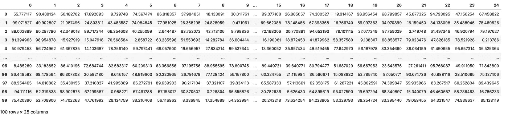

如果您想要生成上述数据，您可以使用以下代码:

```
arr_data = np.random.default_rng().uniform(0, 100, size=(100,25))
df = pd.DataFrame(arr_data)
df
```

要在显示屏上看到更多列，您可以像这样更改`display.max_columns`参数:

```
pd.set_option('display.max_columns', 30)
```

执行此操作时，最多会显示 30 列。然而，这可能会导致其他问题，例如当您想要在这样的帖子中显示图形时，它会变得难以阅读。


更改 max_columns 显示选项后的熊猫数据帧。图片由作者提供。

# 3.压制科学符号

当处理科学数据时，你经常会遇到非常大的数字。一旦这些数字达到数百万，熊猫会将它们重新格式化为科学符号，这可能是有帮助的，但并不总是如此。

要生成具有非常大的值的 dataframe，可以使用下面的代码。

```
arr_data = np.random.default_rng().uniform(0, 10000000, size=(10,3))
df = pd.DataFrame(arr_data)
df
```

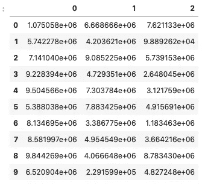

显示非常大数的科学记数法的数据帧。图片由作者提供。

有时，您可能希望以完整形式显示这些数字，而不使用科学符号。这可以通过改变`float_format`显示选项并传入一个小的 lambda 函数来实现。这将重新格式化显示，使值不含科学记数法，最多有 3 个小数位。

```
pd.set_option('display.float_format', lambda x: f'{x:.3f}')
```

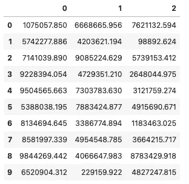

将科学记数法转换成数字后的熊猫数据图。图片由作者提供。

如果你想让它看起来更好，你可以在千位之间加一个逗号分隔符。

下面的代码可能看起来和上面的一样，但是如果你仔细观察代码的`f'{x:`部分，就会发现有一个逗号。

```
pd.set_option('display.float_format', lambda x: f'{x:,.3f}')
```

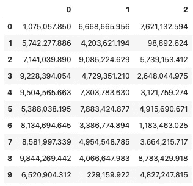

熊猫数据帧包含带有千位分隔符的大数。图片由作者提供。

# 4.更改数据帧内的浮点精度

有时，您正在处理的数据可能在小数点后有太多的值。这有时会使它看起来很乱。默认情况下，熊猫会在小数点后显示 6 个数值。

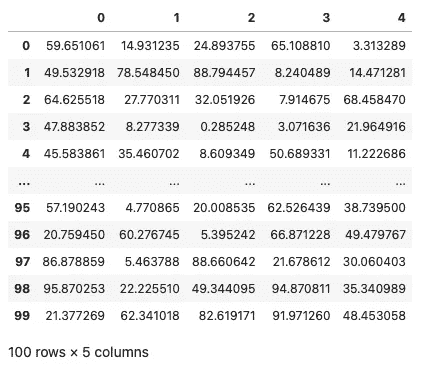

显示浮点数精确到小数点后 6 位的数据帧。图片由作者提供。

为了便于阅读，您可以通过调用`display.precision`选项来减少显示的值的数量，并传入您想要显示的值的数量。

```
pd.set_option('display.precision', 2)
```

当您查看原始数据帧时，您会看到我们的数字列的浮点精度已经降低到 2。

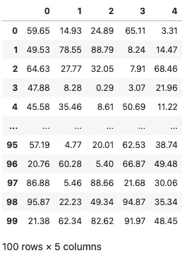

改变浮点精度后的数据帧。图片由作者提供。

***记住，该设置仅改变数据的显示方式。它不会更改基础数据值。***

# 5.控制浮点格式

有时，您处理的数字可能代表百分比或货币值。如果是这种情况，用正确的单位对它们进行格式化会很方便。

要将百分号附加到您的列中，您可以调用`display.float_format`选项，并使用 f 字符串传递您想要显示的格式:

```
pd.set_option('display.float_format',  f'{:,.3f}%')
```

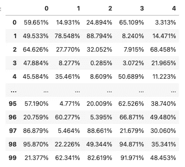

熊猫数据框以百分比显示所有数值。图片由作者提供。

要以美元符号开始浮点数，您可以像这样更改代码:

```
pd.set_option('display.float_format',  f'${:,.2f}')
```

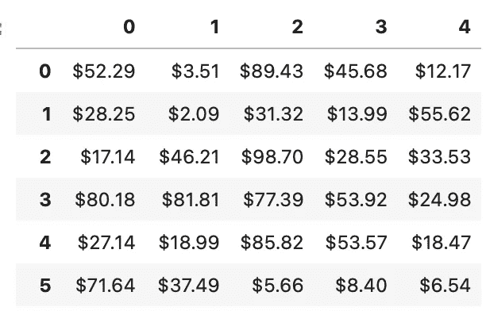

更改显示选项以在开头包含$符号后的熊猫数据帧。图片由作者提供。

# 6.更改默认熊猫绘图库

在进行探索性数据分析时，您经常需要快速绘制数据图。您可以使用 [matplotlib](https://matplotlib.org/) 构建一个情节，然而，您可以使用熊猫通过`.plot()` 方法用几行代码来完成。

熊猫为我们提供了一系列绘图库供我们使用:

*   [matplotlib](https://pandas.pydata.org/pandas-docs/stable/reference/api/pandas.DataFrame.plot.html)
*   [hvplot > = 0.5.1](https://hvplot.holoviz.org/user_guide/Pandas_API.html)
*   [全息视图](https://hvplot.holoviz.org/user_guide/Pandas_API.html)
*   [熊猫 _ 散景](https://github.com/PatrikHlobil/Pandas-Bokeh)
*   [plotly > = 4.8](https://plotly.com/python/pandas-backend/)
*   [牛郎星](https://github.com/altair-viz/altair_pandas)

要更改当前实例的默认绘图库，您需要更改 pandas 的`plotting.backend`选项。

```
pd.options.plotting.backend = "hvplot"
```

一旦你这样做了，你就可以开始用`.plot`方法创建你的地块了

```
df.plot(kind='scatter', x='1', y='2')
```

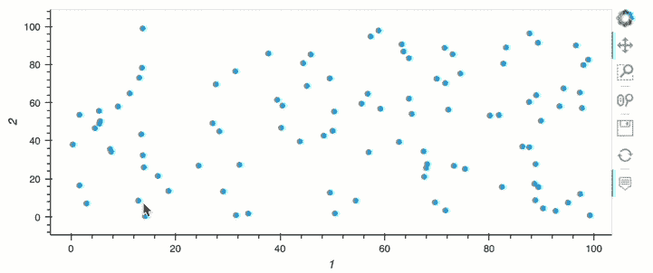

将熊猫的后端绘图选项改为 hvplot 后，强大的交互式绘图。图片由作者提供。

# 7.重置熊猫显示选项

如果您想将特定选项的参数设置回默认值，您可以调用`reset_option`方法并传入您想要重置的选项。

```
pd.reset_option('display.max_rows')
```

或者，如果您已经更改了多个选项，您可以通过提供单词`all`作为参数，将它们全部改回默认值。

```
pd.reset_option('all')
```

# 一次更改多个选项

您可以利用字典的强大功能，然后遍历并设置每个选项，而不是逐个更改之前的设置。

这样做有助于节省时间，减少编写的代码量，并提高可读性。

```
import pandas as pd
```

```
settings = {
    'max_columns': 30,
    'min_rows':40,
    'max_rows': 30,
    'precision': 3
    }for option, value in settings.items():
    pd.set_option("display.{}".format(option), value)
```

# 摘要

Pandas 是一个强大的库，可以直接使用，但是，默认选项可能不适合您的需要。本文介绍了一些流行的选项，您可能希望更改这些选项来改进查看数据框的方式。

*感谢阅读。在你走之前，你一定要订阅我的内容，把我的文章放到你的收件箱里。* [***你可以在这里做！***](https://andymcdonaldgeo.medium.com/subscribe)**或者，您可以* [***注册我的简讯***](https://fabulous-founder-2965.ck.page/2ca286e572) *免费获取更多内容直接发送到您的收件箱。**

*其次，通过注册会员，你可以获得完整的媒介体验，并支持我和其他成千上万的作家。每月只需花费你 5 美元，你就可以接触到所有精彩的媒体文章，也有机会通过写作赚钱。如果你用 [***我的链接***](https://andymcdonaldgeo.medium.com/membership)**报名，你直接用你的一部分费用支持我，不会多花你多少钱。如果你这样做了，非常感谢你的支持！***