# 7 用 Python 可视化表达等级随时间的变化

> 原文：<https://towardsdatascience.com/7-visualizations-with-python-to-express-changes-in-rank-over-time-71c1f11d7e4b>

## 使用 Python 可视化等级随时间的变化


澳大利亚八月在 [Unsplash](https://unsplash.com?utm_source=medium&utm_medium=referral) 拍摄的照片

排序数据是按数字顺序排列的数据位置。这是一种简单的信息交流方式，因为它有助于读者毫不费力地理解序列。排序是处理多个观察值或分类数据的好方法。

然而，事情总是在变化。随着时间的推移，排名的位置可以不断改变。可视化一段时间内的等级位置有助于通知变化和进展。

这篇文章将会用一些想法来引导你想象等级随时间的变化。

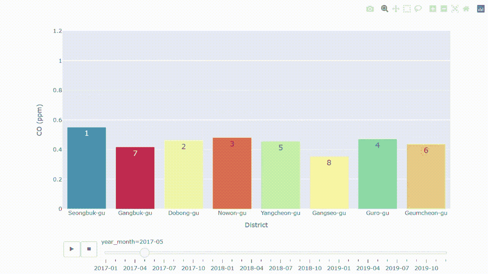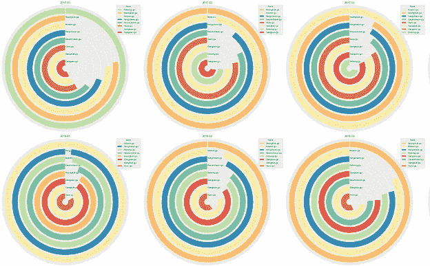

本文中使用 Python 进行数据可视化的示例，展示了等级随时间的变化。作者提供的图片

我们开始吧

## 检索数据

为了说明这里提到的方法可以应用于真实世界的数据集，我将使用来自 Kaggle ( [链接](http://www.kaggle.com/datasets/bappekim/air-pollution-in-seoul))的“首尔空气污染”数据集。数据由首尔市政府提供([链接](https://data.seoul.go.kr/dataList/OA-15526/S/1/datasetView.do#))。这些数据是在知识共享许可[的条款下由](https://creativecommons.org/about/cclicenses/)抄送使用的。

该数据集由 2017 年至 2019 年期间在韩国首尔 25 个区记录的空气污染数据组成:SO2、NO2、CO、O3、PM10 和 PM2.5。

在这篇文章中，我们将与一氧化碳(CO)一起工作，这是一种对人类有害的常见空气污染物。测量单位为[百万分率](https://en.wikipedia.org/wiki/Parts-per_notation) (ppm)。

## 输入数据

下载数据集后，从导入库开始。

```
import numpy as np
import pandas as pd
import math
import matplotlib.pyplot as plt
import seaborn as sns

%matplotlib inline
```

用熊猫看‘Measurement _ summary . CSV’

```
df = pd.read_csv('<file location>/Measurement_summary.csv')
df.head()
```

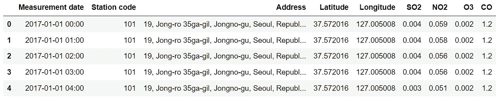

## 浏览数据

作为第一步，探索数据集总是一个好主意。幸运的是，下面的结果表明我们不必处理丢失的值。

```
df.info()
```

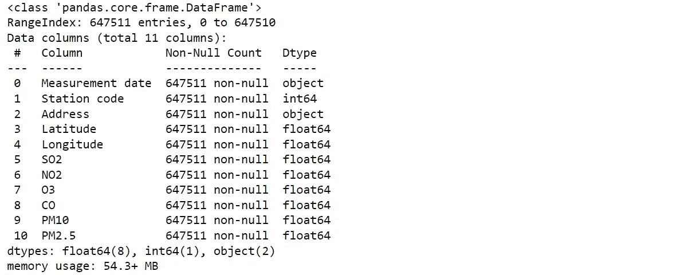

让我们看看变量“车站代码”的总数

```
df['Station code'].nunique()

## output
## 25
```

总共有 25 个区。

```
set(df['Station code'])

## output
## {101, 102, 103, 104, 105, 106, 107, 108, 109, 110, 111, 112, 113, 114,
## 115, 116, 117, 118, 119, 120, 121, 122, 123, 124, 125}
```

## 选择和准备数据

例如，我将选择车站代码 111-118。如果您想绘制其他站号，请随意修改下面的代码。

```
list_stations = [111, 112, 113, 114, 115, 116, 117, 118]
df_select = df[df['Station code'].isin(list_stations)]
df_select.head()
```

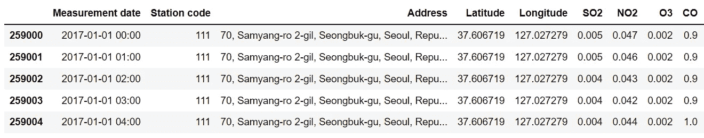

检索到的数据集尚未准备好进行绘制。有些列需要在使用前创建或修改。

```
## crete year_month, year and month columns
year_month = [i[0:7] for i in list(df_select['Measurement date'])]
df_select['year_month'] = year_month
df_select['year'] = [i[0:4] for i in year_month]
df_select['month'] = [i[-2:] for i in year_month]

## create district name column
district = [i.split(', ')[2] for i in df_select['Address']]
df_select['District'] = district

## change Station code column type
df_select = df_select.astype({'Station code': str})

## groupby with location and point of time
df_month = df_select.groupby(['Station code','District',
                              'year_month','year','month']).mean()
df_month.reset_index(inplace=True)
df_month.head()
```

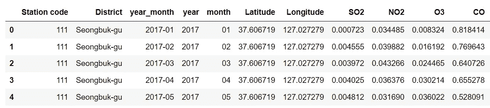

这是重要的一步。本文的主要思想是为排名数据创建可视化。接下来，我们将创建一个列，用于对每个时间点的地区 CO 数(ppm)进行排名。

```
keep = []
for i in list(set(df_month['year_month'])):
    df = df_month[df_month['year_month']==i]
    order = df['CO'].rank(ascending=0)
    df['rank'] = [int(i) for i in order]
    keep.append(df)

df_month = pd.concat(keep)
df_month.sort_values(['year_month', 'Station code'], ascending=True,
                     inplace=True, ignore_index=True)
df_month.head()
```

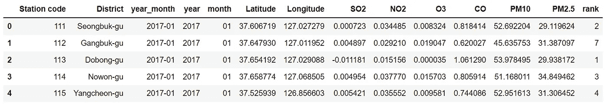

在继续之前，我们将定义一个颜色字典，以便于绘图过程。

```
#extract color palette, the palette can be changed
list_dist = list(set(df_select['District']))
pal = list(sns.color_palette(palette='Spectral',
                             n_colors=len(list_dist)).as_hex())
dict_color = dict(zip(list_dist, pal))
```

## 数据可视化

本文旨在用一些可视化的思想来指导对数据进行排序。因此，获得的结果应该易于理解，同时允许读者比较不同时间点之间的数据等级。

在继续之前需要澄清一些事情。每张图都有它的优点和缺点。当然，没有什么是完美的。这里提出的一些想法可能只是为了一个吸引眼球的效果。但是它们都具有相同的目的，即显示数据等级随时间的变化。

本文中的图表可以分为两组:动画和图表。

## **动画**

除了是一个吸引注意力的好主意，动画可以很容易地显示排名随时间的变化。

## 1.将条形图高度与动画条形图进行比较

[Plotly](https://plotly.com/python/) 是一个制作交互式动画图形的有用图形库。应用动画条形图的概念是固定每个地区的位置。每个条形都将标注排名数字。通过这样做，可以比较一段时间内的一氧化碳含量。

```
import plotly.express as px
fig = px.bar(df_month, x='District', y='CO',
             color='District', text='rank',
             color_discrete_map= dict_color,
             animation_frame='year_month',
             animation_group='Station code',
             range_y=[0,1.2],
             labels={ 'CO': 'CO (ppm)'},
            )
fig.update_layout(width=1000, height=600, showlegend=False,
                  xaxis = dict(tickmode = 'linear', dtick = 1))
fig.update_traces(textfont_size=16, textangle=0)
fig.show()
```

瞧啊。！


动画条形图显示地区的月度排名和 CO(ppm)量。作者图片。

上面所附的结果可能看起来很快，因为这只是结果的一个例子。不用担心；有一个暂停按钮用于暂停，还有一个按钮用于选择特定的时间点。

## 2.带动画散点图的赛车

现在让我们换个角度，根据各个地区在不同时间点的排名来移动它们。散布点的大小可以用来显示一氧化碳数量。

为了方便用 [Plotly](https://plotly.com/python/animations/) 绘图，我们需要在 DataFrame 中添加两列，X 轴上的位置，以及注释文本。

```
ym = list(set(year_month))
ym.sort()

df_month['posi'] = [ym.index(i) for i in df_month['year_month']]
df_month['CO_str'] = [str(round(i,2)) for i in df_month['CO']]
df_month['CO_text'] = [str(round(i,2))+' ppm' for i in df_month['CO']]
df_month.head()
```

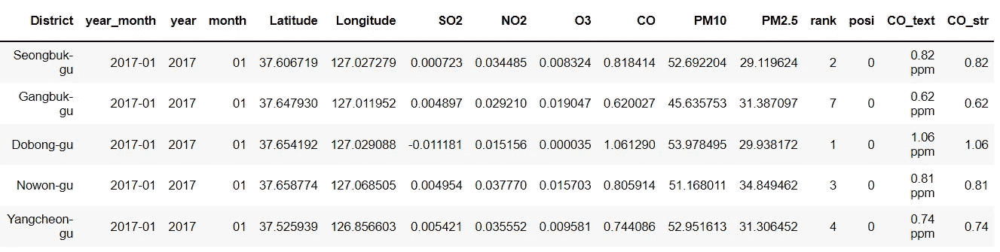

接下来，绘制动画散点图。

```
import plotly.express as px
fig = px.scatter(df_month, x='posi', y='rank',
                 size= 'CO',
                 color='District', text='CO_text',
                 color_discrete_map= dict_color,
                 animation_frame='year_month',
                 animation_group='District',
                 range_x=[-2,len(ym)],
                 range_y=[0.5,6.5]
                )
fig.update_xaxes(title='', visible=False)
fig.update_yaxes(autorange='reversed', title='Rank',
                 visible=True, showticklabels=True)
fig.update_layout(xaxis=dict(showgrid=False),
                  yaxis=dict(showgrid=True))
fig.update_traces(textposition='middle left')
fig.show()
```

哒哒…


动画散点图显示地区的月度排名和 CO(ppm)量。作者图片。

## 图表

动画图表通常受限于只能表达一个时间点。为了显示多个时间点，可以应用一些图表和方法来一次展示多个时间点。

## 3.使用凹凸图绘制线条

基本上，凹凸图应用多条线来显示排名随时间的变化。使用 Plotly 绘制凹凸图允许用户在将光标悬停在每个数据点上时过滤结果并提供更多信息，如下面的结果所示。

```
import plotly.express as px
fig = px.line(df_month, x = 'year_month', y = 'rank',
              color = 'District',
              color_discrete_map= dict_color, 
              markers=True,
              hover_name = 'CO_text')
fig.update_traces(marker=dict(size=11))
fig.update_yaxes(autorange='reversed', title='Rank',
                 visible=True, showticklabels=True)
fig.update_xaxes(title='', visible=True, showticklabels=True)
fig.update_layout(xaxis=dict(showgrid=False),
                  yaxis=dict(showgrid=False) )
fig.show()
```

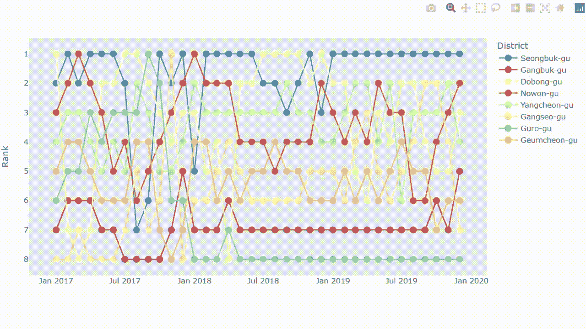

凹凸图显示了各区的排名和每月的一氧化碳含量(ppm)。可以过滤结果并提供更多信息，如图所示。作者图片。

## 4.创建条形图的照片拼贴

一个简单的柱状图可以表达一个时间点的排名。有了很多时间点，我们可以创建很多条形图，然后组合成一个照片拼贴。首先使用 [Seaborn](https://seaborn.pydata.org/) 库创建一个条形图。

```
df_select = df_month[df_month['year_month']=='2017-01']
fig, ax = plt.subplots(figsize=(15, 6))

sns.set_style('darkgrid')
sns.barplot(data = df_select,
            x = 'District', y ='CO',
            order=df_select.sort_values('CO', ascending=False)['District'],
            palette=dict_color)
ax.bar_label(ax.containers[0],
             labels=df_select.sort_values('CO', ascending=False)['CO_str'],
             label_type='edge', size=11)
plt.ylabel('CO (ppm)')
plt.title('2017-01')
plt.show()
```

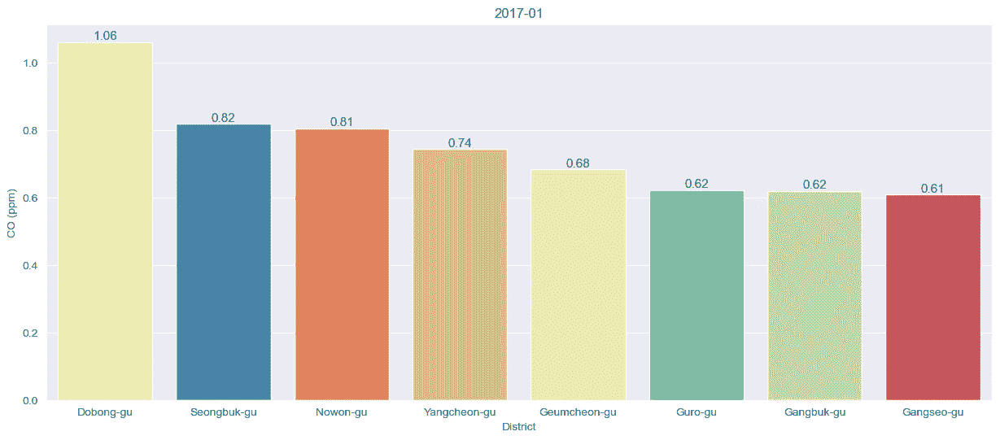

条形图按排名显示各区的一氧化碳含量(ppm)。作者图片。

使用 for-loop 函数创建不同时间点的条形图。请注意，下面的代码会将图表导出到您的计算机，以便以后导入。

```
keep_save = []
for t in ym:
    df_ = df_month[df_month['year_month']==t]
    fig, ax = plt.subplots(figsize=(8.5, 5))
    sns.set_style('darkgrid')
    sns.barplot(data = df_,
                x = 'District', y ='CO',
                order = df_.sort_values('CO', ascending=False)['District'],
                palette=dict_color)
    ax.bar_label(ax.containers[0],
                 labels=df_.sort_values('CO', ascending=False)['CO_str'],
                 label_type='edge', size=11)
    plt.ylim([0, 1.2])
    plt.ylabel('CO (ppm)')
    plt.title(t)
    plt.tight_layout()
    s_name = t + '_bar.png'
    keep_save.append(s_name)
    plt.savefig(s_name)
    plt.show()
```

创建一个函数来合并图表。我发现了一个很好的代码来组合这个[链接](https://stackoverflow.com/questions/35438802/making-a-collage-in-pil)上堆栈溢出的许多情节。

应用函数。

```
## get_collage(n_col, n_row, width, height, save_name, 'output.png')
# width = n_col * figure width
# height = n_row * figure height 

get_collage(12, 3, 12*850, 3*500, keep_save, 'order_bar.png')
```

哒哒…

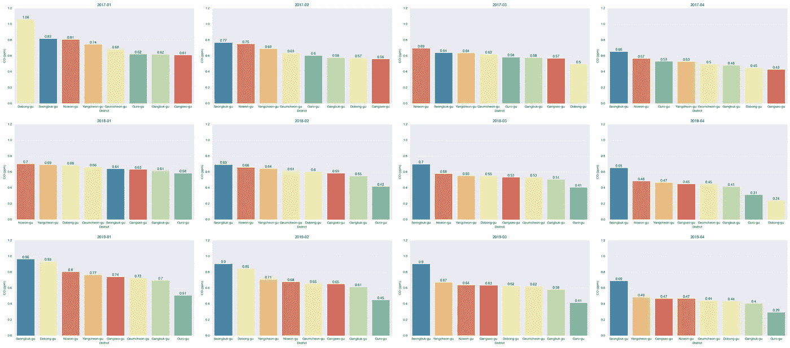

照片拼贴的一部分结合了条形图，显示了各区的排名和每月的二氧化碳含量(百万分之几)。作者图片。

结果显示每个地区的月度 CO 值，同时显示一段时间内的排名顺序。因此，我们可以同时比较多个时间点的区域等级和污染量。

## 5.想象有圆形条形图的条形图

与前面的想法相同的概念，我们可以将普通的条形图变成[圆形条形图](https://www.python-graph-gallery.com/circular-barplot/)(又名赛道图)，并将它们组合成照片拼贴。

如前所述，凡事都有利弊。由于每个条形的长度比例不相等，圆图上的每个条形可能很难比较。然而，这可以被认为是一个很好的选择，以创造一个引人注目的效果。

从创建圆形条形图的示例开始。

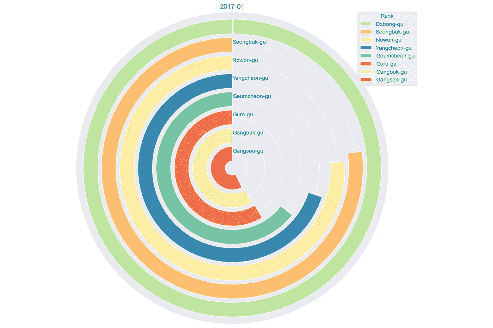

圆形条形图按等级显示各区的一氧化碳含量(百万分之几)。作者图片。

应用 for-loop 函数获得其他圆形条形图。结果将导出到您的计算机中，以便以后导入。

使用函数获取照片拼贴。

```
get_collage(12, 3, 12*860, 3*810, keep_cir, 'order_cir.png')
```

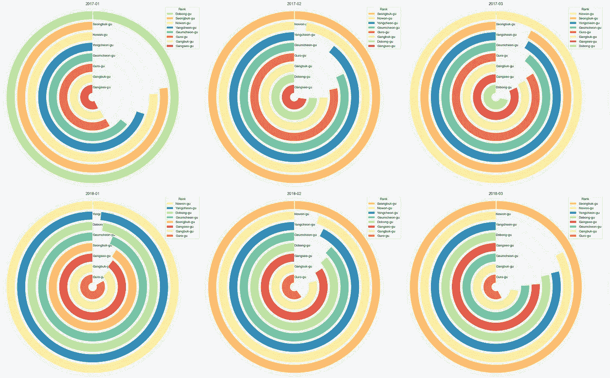

一张照片拼贴画的一部分结合了圆形条形图，显示了各区的排名和每月的二氧化碳含量(百万分之几)。作者图片。

## 6.另一种用径向条形图想象条形图的方法

用[径向条形图](https://www.python-graph-gallery.com/circular-barplot-basic)改变条形图的方向，从中心开始。这是另一个吸引注意力的方法。然而，可以注意到，彼此不靠近的条很难比较。

从一个放射状条形图的例子开始。


放射状条形图按等级显示各区的一氧化碳含量(ppm)。作者图片。

应用 for-loop 函数创建其他径向条形图。结果也将导出到您的计算机，以便以后导入。

应用该函数获得一个照片拼贴。

```
get_collage(12, 3, 12*800, 3*800, keep_rad, 'order_rad.png')
```

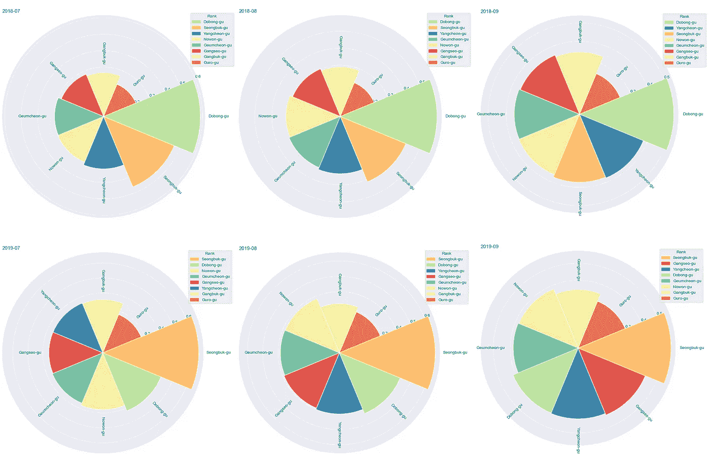

一张照片拼贴画的一部分结合了放射状的条形图，显示了各区的排名和每月的二氧化碳含量(百万分之几)。作者图片。

## 7.在热图中使用颜色

通常，热图是一种常见的图表，用于将数据呈现为二维图表，并用颜色显示值。对于我们的数据集，可以应用颜色来显示等级数。

首先用 pd.pivot()创建一个数据透视表。

```
df_pivot = pd.pivot(data=df_month, index='District',
                    columns='year_month', values='rank')
df_pivot
```

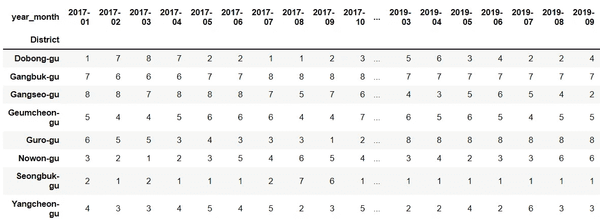

获得数据透视表后，我们可以用几行代码轻松创建热图。

```
plt.figure(figsize=(20,9.5))
sns.heatmap(df_pivot, cmap='viridis_r', annot=True, cbar=False)
plt.show()
```

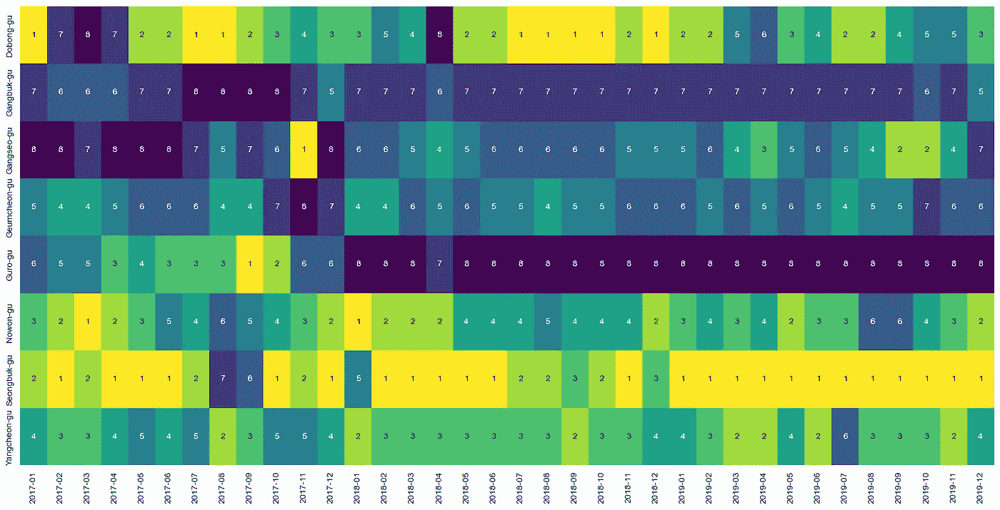

应用热图显示地区排名随时间的变化。作者图片。

通过颜色和注释，我们可以找出 CO 值最高(黄色)和最低(深蓝色)的地区。随着时间的推移，可以注意到排名的变化。

## 摘要

本文介绍了用 Python 代码表达数据等级随时间变化的七种可视化思想。如前所述，凡事都有利弊。重要的是找到适合数据的正确图表。

我敢肯定，随着时间的推移，有比这里提到的更多的数据排名图。本文仅用一些思路指导。如果有什么建议或推荐，欢迎随时留言评论。我很乐意看到它。

感谢阅读

这些是我的数据可视化文章，您可能会感兴趣:

*   8 用 Python 处理多个时序数据的可视化([链接](/8-visualizations-with-python-to-handle-multiple-time-series-data-19b5b2e66dd0))
*   6 可视化与 Python 技巧处理超长时间序列数据([链接](/6-visualization-tricks-to-handle-ultra-long-time-series-data-57dad97e0fc2))
*   9 用 Python 可视化显示比例，而不是饼状图([链接](https://medium.com/p/4e8d81617451/))
*   9 个比条形图更引人注目的 Python 可视化([链接](/9-visualizations-that-catch-more-attention-than-a-bar-chart-72d3aeb2e091))

## 参考

*   首尔市政府。(2021 年 5 月)。韩国首尔的空气污染测量信息。检索于 2022 年 11 月 23 日，来自[https://www . ka ggle . com/datasets/bappekim/air-pollution-in-Seoul](https://www.kaggle.com/datasets/bappekim/air-pollution-in-seoul)
*   *서울시 대기오염 측정정보* 。서울열린데이터광장.检索于 2022 年 11 月 26 日，来自[https://data . Seoul . go . kr/dataList/OA-15526/S/1/dataset view . do](https://data.seoul.go.kr/dataList/OA-15526/S/1/datasetView.do)