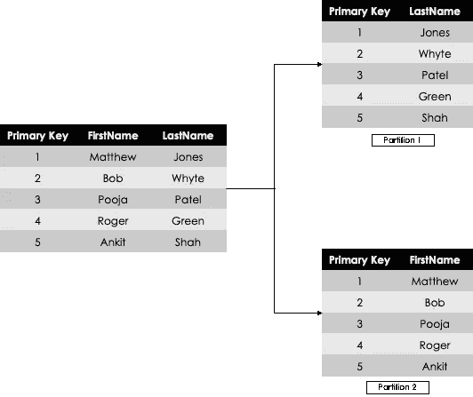
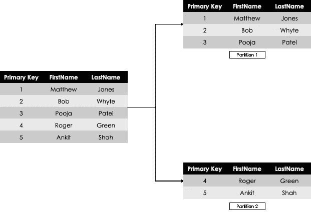

# 提高数据仓库性能的 7 种方法

> 原文：<https://towardsdatascience.com/7-ways-to-improve-performance-of-your-data-warehouse-4544456bcc3>

## 通过应用以下步骤来改善数据仓库的低性能

哈雷戴维森在 [Unsplash](https://unsplash.com?utm_source=medium&utm_medium=referral) 上的照片

P oor 性能是数据仓库(DWH)名声不佳的主要原因之一。无论何时交付 DWH，都应该有一个性能改进策略。这确保了 DWH 保持相关性，并按时满足业务最终用户的要求。

通常，缓慢的 DWH 会产生多种下游影响，例如不完整的批处理作业导致缺少报告，或者仪表板加载缓慢导致用户沮丧。最糟糕的是，当这种情况持续几周甚至几个月，而没有采取任何措施来改善这种情况时，随着时间的推移，最终用户的信心会受到侵蚀。

让我们确保我们不会成为 DWH 死亡的原因。今天，我们将学习提高 DWH 表现的七种方法。

## 1.索引

想象一下，走进一家超市买糖；你会看到 10 个不同的过道，没有标签或指示。你必须扫描整个超市才能找到商品。你可能会幸运地在第一个过道找到它，或者非常不幸地在第十个过道的最后一个架子上找到它。

添加一些搜索功能或索引可以大大提高您更快找到您的项目的机会。索引将给定列中的值存储在可搜索的结构中，这允许查询读取更少的数据来查找信息。

例如，一个包含 1000 行人名的表，主键为，没有索引，每次在 WHERE 子句中搜索名字时，都需要对整个表进行扫描。然而，如果索引被添加到主键列*和名字列*中，那么搜索标准是严格的。这减少了查询所需的读取次数，从而减少了获取信息的时间。

然而，并不是所有的阳光和彩虹都有索引。它们有开销，索引太多会降低 DWH 的插入和更新操作的速度。同样，给超市里的所有东西贴上标签会减缓货架的堆叠过程。

## 2.压缩

现代云 DWH 像红移使用自动编码/压缩，所以你可能必须配置它。传统上，压缩通过减少冗余/重复数据值来帮助节省大量磁盘空间。

例如，假设您已在 DWH 上设置了变更数据捕获，并对未结记录使用高端日期，如“31/12/9999”。您可以将该日期值压缩为一条记录。其余的记录可以用价值 2 位的非常经济的替代值来引用。这使您不必在磁盘上重复存储上述日期。

如果您不知道变更数据捕获的各种方法，请查看下面的文章:

<https://medium.com/geekculture/6-different-types-of-slowly-changing-dimensions-and-how-to-apply-them-b152ef908d4e>  

除了多值压缩，最好还进行行值压缩。如果有一行只是“Y”和“N”的值，并且数据类型是 Char(1000)，那么所有这些字节都没有用。压缩它可以节省大量的磁盘空间，而不会影响查询的输出。

请注意，并非所有的行和列都可以或应该被压缩，因为它们可能会对正常功能产生意外影响。建议不要压缩使用行级安全性的主键列或行。

## 3.收集统计数据

收集统计信息是一种帮助 DWH 以最佳方式形成执行计划的方法，有助于提高查询的性能。收集统计数据的最常见过程是在 ETL 作业完成后立即进行。随着新数据进入 DWH，拥有特定表的最新统计信息有助于所有后续查询及其执行计划。

收集经常用于下游连接、聚合或排序的列的统计数据是非常重要的。此外，有时，拥有陈旧的统计数据比没有统计数据更糟糕。这意味着不准确的表统计可能会导致较差的查询执行计划。所以要保持这些数据的更新。

像索引和其他性能技术这样的统计数据收集也有全表扫描的开销；有一些创建样本统计数据的方法可以减轻这种负担，帮助保持统计数据的新鲜。

## 4.创建构建基块和视图

建议不要直接转到底层数据表，而是在构建块或视图中对最常用的查询执行一些预聚合。这有助于快速获得信息，而不必反复查询同一个表。

即使如此，视图仍然会查询基础表；聚集索引视图将临时存储所需的信息，从而加快查询响应速度。取决于 DWH 的设置(高度标准化等。)，可能需要构建模块来帮助获得最终答案。

占据磁盘空间的物化视图可以作为普通聚合的替代方案。它将减少所需的数据量，并允许快速检索相同的常见聚合查询。

> 有 101 种错误编写查询的方式，只有少数几种可以优化

## 5.分区和分片

分区是在逻辑上将大表分成更小的、可管理的块。因为表现在是更小的块，所以整个查询运行得更快，因为它需要扫描的数据更少。

分区，也称为“垂直分区”，或可归类为数据的规范化，是一种垂直划分数据表的方法，如下所示:

作者图片:垂直分割

水平分区，也称为“分片”，将数据水平划分，通常位于不同的数据库实例上，这降低了单台服务器的性能压力。

作者图片:水平分割

记得索引吗？分区有助于减小表的大小，进而减小索引的大小，这进一步加快了 DWH 操作的速度。但是，分区也增加了查询的复杂性，并增加了管理更多数据表的开销，尤其是备份。因此，在开始分片之前，尝试一些其他的性能技术。

## 6.查询优化

坦率地说，没有什么性能改进可以替代写得很差的查询。有 101 种错误编写查询的方式，只有少数几种可以优化。

学习查询构建和执行计划的基础知识是编写最佳查询的一种极好的方式。如今，有了更复杂的 ETL 工具，查询直接由工具本身编写。然而，在我看来，查询优化的强大知识是无可替代的。

例如，不使用 SELECT *，避免复杂的连接，使用 LIMIT 返回有限数量的行，在 WHERE 子句中使用索引列等。，是一些优化查询的方法。

您选择的 DWH 技术中的执行计划也将为提高查询性能提供有价值的见解。

## 7.数据最小化

这是一个不寻常的问题，但在今天这个数据伦理和隐私的时代却很重要。问问你自己，你是否需要所有这些数据来回答你的关键业务问题。由于数据湖的廉价存储和使用，该行业正处于数据昏迷状态。

消费者的每一个举动都会被跟踪、记录和存储。除了不道德之外，这也是一项巨大的责任，因为这些信息需要根据您所在地区的相关法规进行处理。那么，你能在不存储每一位数据的情况下生存吗？如果可以，你能清除这些数据或者不收集这些数据吗？

这将减少你拥有的数据量，降低存储数据的开销，使这个行业更具可持续性。

## 结论

这些是帮助你加快 DWH 的一些关键技术。尝试一次实施一种方法，定期微调你的 DWH 绩效策略。

如果你觉得这篇文章有帮助，请在下面留言告诉我。查看我在 Medium 上的其他帖子:

</how-to-create-a-data-warehouse-in-5-important-steps-95a8f893a3fd>  

如果您没有订阅 Medium，请考虑使用我的推荐链接订阅[。它比网飞便宜，而且客观上能更好地利用你的时间。](https://hanzalaqureshi.medium.com/membership)如果你使用我的链接，我会获得一小笔佣金，而你可以在 Medium 上获得无限的故事。

我也定期在推特上写东西；跟着[我这里](https://twitter.com/hanzalaqureshi_)。