# 数据科学新手应该知道的 8 种机器学习算法

> 原文：<https://towardsdatascience.com/8-machine-learning-algorithms-everyone-new-to-data-science-should-know-772bd0f1eca1>

## 简要解释机器学习背后的算法

戴维·莱夫克在 [Unsplash](https://unsplash.com?utm_source=medium&utm_medium=referral) 上拍摄的照片

如果你刚开始接触数据科学，你也会很快接触到[机器学习](https://databasecamp.de/en/machine-learning)。下面我们列出了每个[数据科学家](https://databasecamp.de/en/ml-blog/data-scientists)都应该知道和了解的八个基本[机器学习](https://databasecamp.de/en/machine-learning)算法。如果你在阅读这篇文章的时候意识到你根本不知道这个算法或者还不够了解，那么请随意使用每种情况下链接的文章。在那里你会找到详细的解释，应用，以及每个算法的优缺点。

# 1.线性回归

回归用于建立两个变量 x 和 y 之间的数学关系。[统计](https://databasecamp.de/en/statistics)和[机器学习](https://databasecamp.de/en/machine-learning)基础处理如何用一个或多个变量 x 来描述变量 y。以下是一些示例:

*   学习时间(= x)对期末考试成绩(= y)有什么影响？
*   农业的实际收成取决于植物肥料的使用吗？
*   警察人数的变化能解释这个城市犯罪率上升的原因吗？

我们称变量 y 为因变量或回归变量，因为它的变化依赖于外部因素。

另一方面，变量 x 被称为**自变量**或回归变量，因为它是因变量变化的可能原因。

对于[线性回归](https://databasecamp.de/en/ml/linear-regression-basics)，我们试图找到描述 x 对 y 的影响的线性数学关系。在此过程中，算法通过最小化直线和所有数据点之间的总距离，将直线拟合到训练数据集。

如果我们只有一个独立变量，这些是[线性回归](https://databasecamp.de/en/ml/linear-regression-basics)需要拟合的参数:

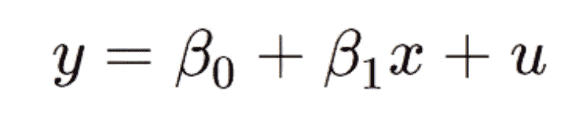

*   β0:与 y 轴的交点，例如不学习可以达到的考试成绩。
*   β1:回归线的增加，例如多学习一小时对考试成绩的影响。
*   u:错误项，如所有对考试成绩有影响但学习时间没有捕捉到的影响，如先验知识。
*   y:变量，在线性回归的帮助下，你想预测哪个变量，在我们的例子中是期末考试成绩。
*   x:变量，用作预测的基础，并对 y 有影响，在本例中，为考试学习的小时数。

<https://databasecamp.de/en/ml/linear-regression-basics>  

# 2.逻辑回归

[逻辑回归](https://databasecamp.de/en/ml/logistic-regression)是回归分析领域的一个子类，它提供了使用普通比例因变量的机会。这意味着回归变量只能取有限数量的值。然后，[逻辑回归](https://databasecamp.de/en/ml/logistic-regression)结果被解释为数据点属于某个类别的概率。

在[逻辑回归](https://databasecamp.de/en/ml/logistic-regression)中，基础仍然是将回归方程拟合到一组给定的数据点。只是，在这种情况下，我们不能再用线性方程了，因为我们有一个有序回归方程。让我们用一个真实的例子来看看为什么:

我们的模型应该预测特定个人购买电动自行车的可能性。它使用的独立变量是个人的年龄。我们通过在街上随机采访人们得到的数据集如下:

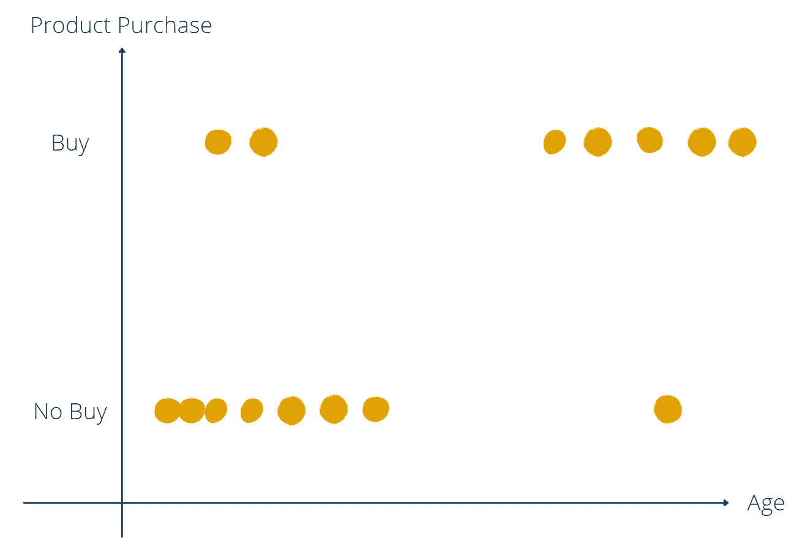

电动自行车配送|图片:作者

从这个图表中，我们可以推断年轻人不太可能购买电动自行车(左下角)，而老年人大多拥有一辆(右上角)。即使在两个年龄组中都有异常值，我们会假设模型会推断随着年龄的增长，人们更有可能购买电动自行车。但是我们如何用数学方法来定义它呢？

首先，我们需要找到一个数学函数来表示图中的点分布，这显然不是一个线性函数。我们需要的是一个位于 y 轴上 0 和 1 之间的函数，因为有两个组也可以用 0 和 1 来表示。我们正在寻找的数学函数是 sigmoid 函数:

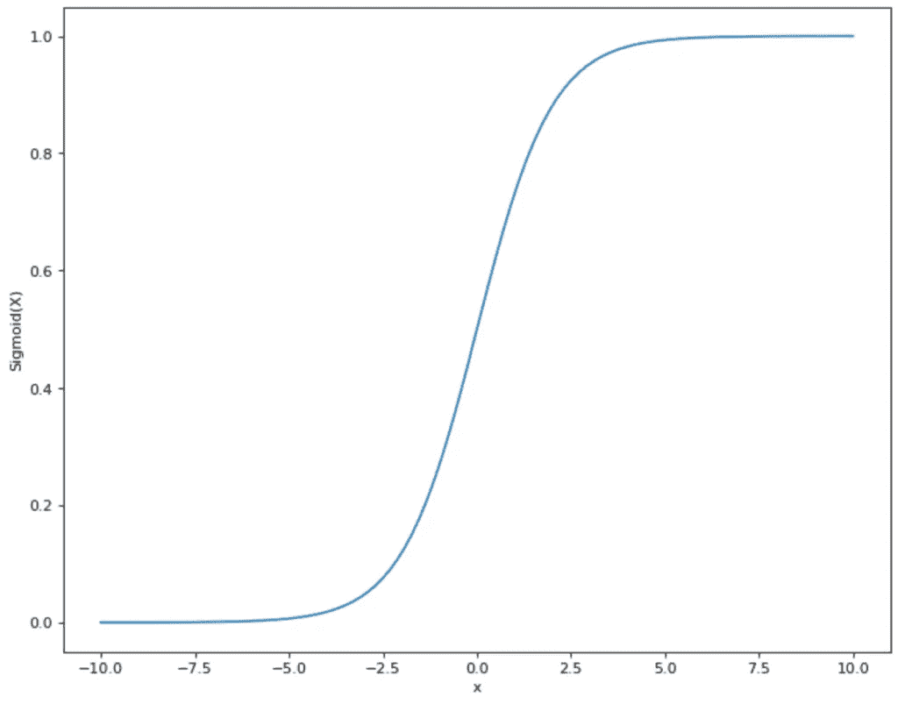

Sigmoid 函数曲线|图片:作者

其函数方程如下:

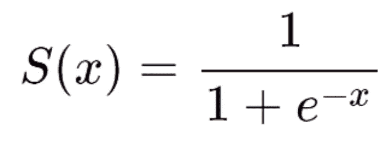

在电动自行车的例子中，这将转化为:

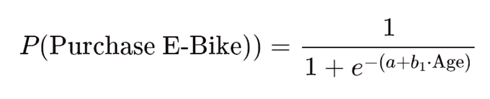

现在，我们已经为我们的[逻辑回归](https://databasecamp.de/en/ml/logistic-regression)打下了基础，我们可以通过使用我们的数据集开始迭代拟合参数 a 和 b。这样，我们将得到一个完全符合给定数据的函数:

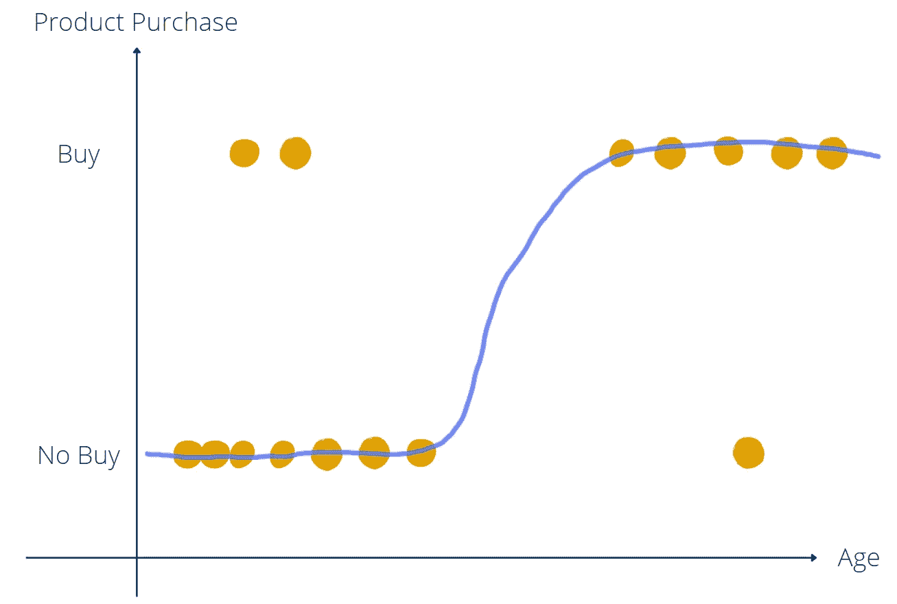

购买电动自行车的逻辑回归|图片:作者

在现实生活中，函数符号与您在本文中看到的符号大部分不同。在那里，你重新安排它，使它具有类似于[线性回归](https://databasecamp.de/en/ml/linear-regression-basics)的形式:

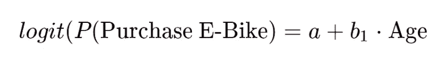<https://databasecamp.de/en/ml/logistic-regression>  

# 3.支持向量机

[支持向量机](https://databasecamp.de/en/ml/svm-explained) (SVMs)属于[机器学习](https://databasecamp.de/en/machine-learning)算法，有其数学基础。它们是用来做分类的，比如[图像分类](https://databasecamp.de/en/use-case/cnn-in-tensorflow)。在这方面，它们比神经网络[更有优势，因为它们可以被快速训练，并且不需要大量的训练数据来获得好的结果。](https://databasecamp.de/en/ml/artificial-neural-networks)

我们可以将 [SVM](https://databasecamp.de/en/ml/svm-explained) 用于以下数据集，其中我们有两个类别(蓝色和黄色)以及两个特征(x 轴和 y 轴)。我们的算法应该学习我们的训练数据集的颜色分类。在二维空间中，数据集可能如下所示:

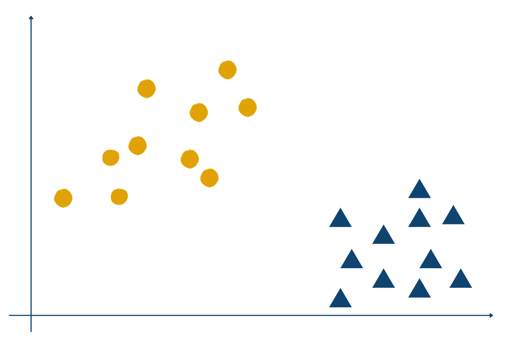

示例数据支持向量机|图片:作者

[支持向量机](https://databasecamp.de/en/ml/svm-explained)试图拟合一个所谓的超平面，该超平面应该以可能的最佳方式将两个组分开。根据维度的不同，超平面可以是一条直线，就像我们的例子一样，也可以是多维的平面。

然后，可以使用合适的平面来将对象分类。在我们的例子中，位于平面图左侧的所有数据点都属于“黄色”类，位于右侧的所有数据点都属于“蓝色”类。

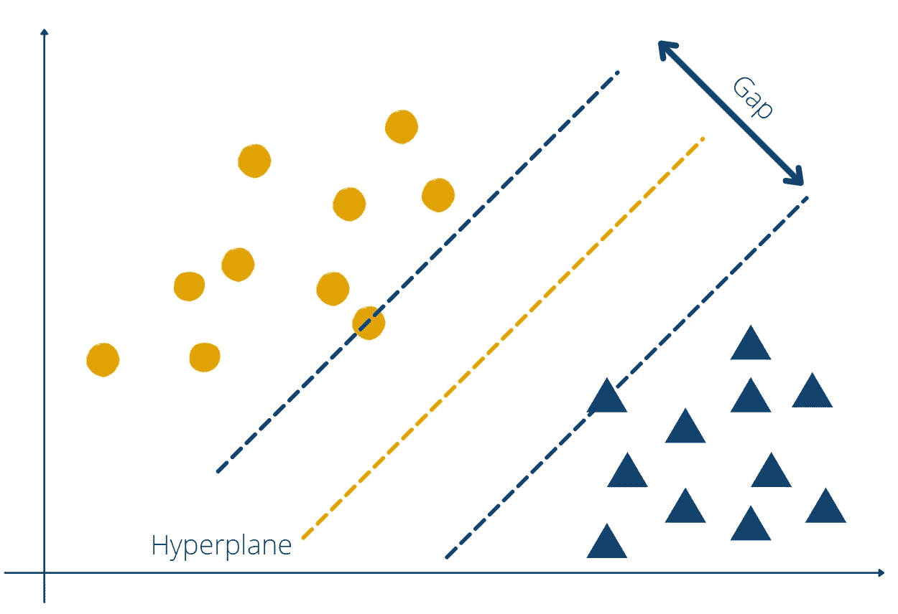

支持向量机|图片:作者

[SVM](https://databasecamp.de/en/ml/svm-explained) 使用不同的训练跑来尽可能最佳地适应飞机。目标是最大化间隙，间隙是从每个组的最近点到超平面的距离，意味着平面应该完美地位于中间。

<https://databasecamp.de/en/ml/svm-explained>  

# 4.决策图表

[决策树](https://databasecamp.de/en/ml/decision-trees)以决策而闻名，并且已经找到了进入[机器学习](https://databasecamp.de/en/machine-learning)世界的方法。树状结构试图学习多个决策阶段及其可能的响应路径。决策树可用于回归分析或分类。

树有三个主要部分，即根、分支和节点。下面的例子是一个[决策树](https://databasecamp.de/en/ml/decision-trees)关于我们是否应该进行户外运动。它有助于更好地理解结构:

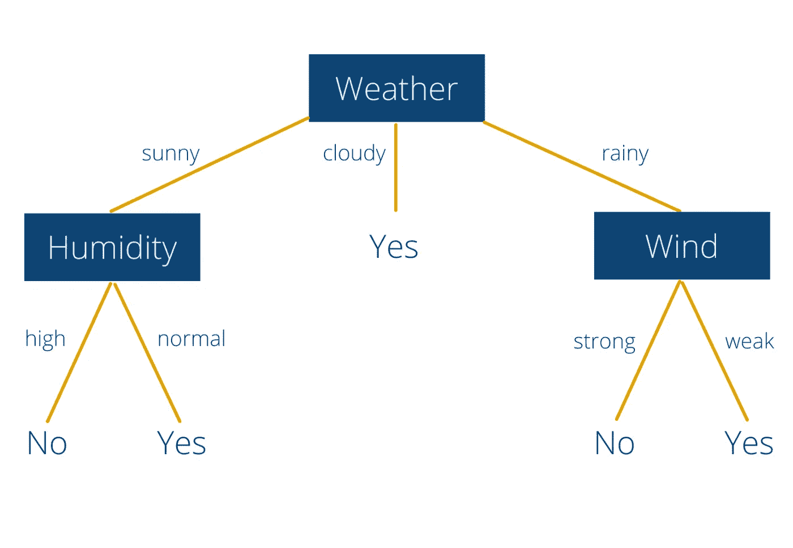

决策树示例|图片:作者

在我们的例子中，节点“Weather”是根节点**。它被用作我们决策过程的起点。一棵树通常只有一个根点，以便所有决策都有一个相似的起点。**

从根节点开始，总共有三个**分支**(晴天、阴天、雨天)。其中两个后面是新的**节点**(晴雨)。在这些节点上，人们需要做出另一个决定。只有在天气多云的时候，一颗叶子才会落下来，也就是所谓的**叶子**。这意味着当天气多云时，一个人应该经常出去锻炼，至少[决策树](https://databasecamp.de/en/ml/decision-trees)是这么告诉我们的。

在晴天或雨天，还要根据湿度做出另一个决定。如果天气晴朗，湿度值可能为“高”或“正常”。这意味着晴朗的天气加上高湿度并不是户外运动的最佳天气。

在雨天，还有一个重要的决策分支。在这种情况下，风在决策中变得更加重要。由此，我们可以推断出两条规律。如果天气下雨，风很大，就不应该在外面做运动。然而，在雨天和微风的情况下，人们可以到户外做一些运动。

</a-complete-guide-to-decision-trees-ac8656a0b4bb>  

# 5.随机森林

[随机森林](https://databasecamp.de/en/ml/random-forests)是来自[监督学习](https://databasecamp.de/en/ml/supervised-learning-models)领域的[机器学习](https://databasecamp.de/en/machine-learning)算法。它是所谓的集成模型，因为它由多个[决策树](https://databasecamp.de/en/ml/decision-trees)组成。

每一棵单独的树都对手头的任务做出预测，例如，分类。然后,[随机森林](https://databasecamp.de/en/ml/random-forests)组合所有的个体决策，并得到大多数树支持的结果。但是为什么用多棵树预测同一个用例比用一棵树好呢？

这背后的意图是所谓的群体智慧。它的观点是，单个个人的决定总是比许多人的决定更糟糕。这是在 1906 年的一次博览会上首次发现的。

当时，一头公牛被展示给 800 名观众，要求他们估计这头公牛的重量。之后，应该通过称重动物来正式确认体重。一位数学家分析了这些估计值，发现人群估计值的中位数与实际体重只有 1 %的差距。然而，没有一个人提交更接近正确结果的估计。这使他引入了群体的智慧，即多数人的估计比一个人的估计要好。

我们可以将这一点应用到随机森林中，即不同决策树的集合将总是优于任何一个单独的树。

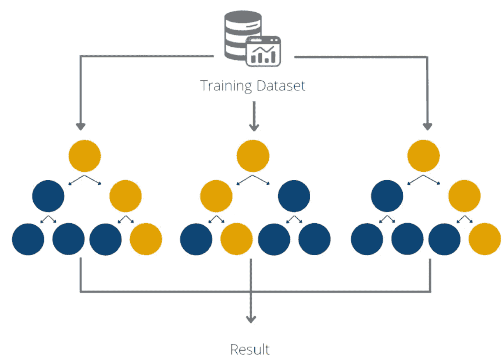

随机森林合奏|图片:作者

只有一个小条件需要满足:树和它们的错误不允许以任何方式与相关。这样，单棵树的误差可以由别人来补偿。

在我们的重量估算例子中，这意味着所有的估算都应该单独进行，而不需要事先讨论。否则，一个人可能会受到另一个参与者的估计的影响，因此他们的误差是相关的。然后，群众的智慧不再出现。

</introduction-to-random-forest-algorithm-fed4b8c8e848>  

# 6.朴素贝叶斯

在[朴素贝叶斯](https://databasecamp.de/en/ml/naive-bayes-algorithm)中，我们有另一种基于数学定理的基本分类方法，叫做贝叶斯定理。然而，只有当我们假设所有的特征都[彼此不相关](https://databasecamp.de/en/statistics/correlation-and-causation)时，才能使用它。这就是算法幼稚的原因，因为这个假设通常是错误的。

贝叶斯定理描述了条件概率 P(A|B)的公式，条件概率 P(A | B)意味着当事件 B 已经发生时 A 发生的概率(如果我的快速测试是阳性的(=事件 B)，我有电晕(=事件 A)的概率是多少？).

贝叶斯定理的公式是:

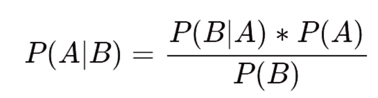

*   P(B|A) =如果事件 A 已经发生，事件 B 发生的概率
*   P(A) =事件 A 发生的概率
*   P(B) =事件 B 发生的概率

实际上，概率 P(A|B)很难找到。以电晕为例，我们需要一个更复杂的测试来确定这个人是否真的是阳性。逆概率 P(B|A)就好找多了。在我们的例子中，它测量了一个感染了冠状病毒的人快速检测呈阳性的可能性。

我们可以通过对已确诊感染的人进行快速检测来发现这种可能性。之后，我们可以计算这些测试中有多少实际上是阳性的，与进行了多少测试相比。现在，我们可以使用概率 P(B|A)，P(A)和 P(B)来计算条件概率 P(A|B)。

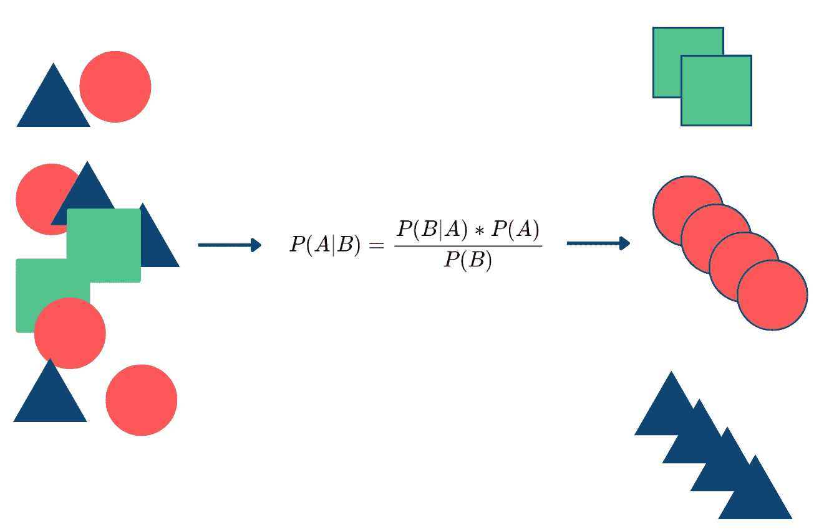

朴素贝叶斯算法|图片:作者

对于具有多个特征的数据集，算法保持不变，我们为特征 x 和类 k 之间的每个组合计算条件概率。之后，将一个特征的所有类概率相乘。具有最高总体概率的类是预测。

<https://databasecamp.de/en/ml/naive-bayes-algorithm>  

# 7.感知器

感知器是[神经网络](https://databasecamp.de/en/ml/artificial-neural-networks)的基本构建模块，也是[监督学习](https://databasecamp.de/en/ml/supervised-learning-models)的一部分。它包含单个神经元，通过使用激活函数和加权输入值来计算输出。

基本算法来自数学，后来用于计算机科学和[机器学习](https://databasecamp.de/en/machine-learning)。它试图模仿人类大脑的结构，并能够学习复杂的关系。

一个感知器可以有多个能够处理数值的输入。输入具有说明输入对于最终输出的重要性的权重。学习过程包括改变这些权重，以产生尽可能接近来自训练集的输出值。

感知机的结构|图片:作者

神经元计算输入值和输出权重的加权和。然后它被提供给激活函数，该函数是从 0 到 1 缩放的特殊函数。在其最简单的形式中，神经元只能有一个二进制输出(是/否，真/假，活动/不活动)。

在大多数情况下，所谓的 Sigmoid 函数被用作激活函数，因为它的范围从 0 到 1，并且在 x = 0 时急剧增加。这就是为什么它是二元分类的好方法。

</what-is-a-perceptron-5ac56720d8cf>  

# 8.人工神经网络

[人工神经网络](https://databasecamp.de/en/ml/artificial-neural-networks)是单个感知器的进步，更加接近我们的人脑。它用于解决更困难的分类或回归问题。

基本神经网络使用多层感知器结构，其中一个感知器的输出只是下一层中另一个感知器的输入。然而，感知器的基本概念仍然被使用:

1.  权重因子决定了输入对于神经元的重要性。高权重意味着输入对于解决手头的问题非常重要。
2.  然后，我们通过将输入值和它们的权重相乘来计算加权和。此外，还有一个附加的偏差:

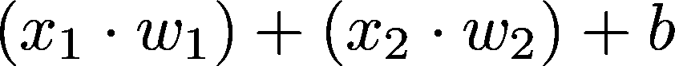

3.随后，结果被赋予所谓的激活函数。

激活功能的选择取决于使用情况。它可以是用于二元分类的 sigmoid 函数，也可以是其他阶跃函数。

信息通过网络的不同层传递:

*   **输入层**:包含我们从数据集获得的输入，这些输入应该通过网络进行处理。
*   **隐藏层**:一个或多个所谓的隐藏层以我们描述的方式接收输入并计算输出。根据架构的不同，它们的输出被传输到另一层神经元。这些层是隐藏的，因为这些层没有给出任何可见的结果，而是将它们的输出传递给其他神经元。
*   **输出层**:该层跟随最后一个隐层，计算网络的最终结果。

神经网络结构|图片:作者

该架构然后被给予训练，这使得网络学习如何为特定的用例产生完美的结果。一种使用具有特定数据点和相应结果的训练数据集。对于每个数据点，网络计算其结果，并将其与数据集的正确结果进行比较。

<https://medium.com/codex/understanding-the-backpropagation-algorithm-7a2e3cb4a69c>  

如果计算结果不正确，则使用反向传播算法改变单个神经元的权重。通过对整个数据集反复重复这一过程，神经网络的性能正在提高。

<https://medium.com/illumination/intuitive-guide-to-artificial-neural-networks-5a2925ea3fa2>  

# 这是你应该带走的东西

*   每个数据科学家都有扎实的机器学习算法知识。
*   在本文中，我们介绍了常用的算法，并简要解释了它们是如何工作的。
*   它们为今天使用的更先进的模型奠定了基础。

*如果你喜欢我的作品，请在这里订阅*<https://medium.com/subscribe/@niklas_lang>**或者查看我的网站* [*数据大本营*](http://www.databasecamp.de/en/homepage) *！此外，媒体允许你每月免费阅读三篇文章***。如果你想让***无限制地访问我的文章和数以千计的精彩文章，不要犹豫，通过点击我的推荐链接:*[【https://medium.com/@niklas_lang/membership】](https://medium.com/@niklas_lang/membership)每月花$ ***5*** 获得会员资格***

**</beginners-guide-to-gradient-descent-47f8d0f4ce3b>  </beginners-guide-extract-transform-load-etl-49104a8f9294>  </introducing-nosql-databases-with-mongodb-d46c976da5bf> **