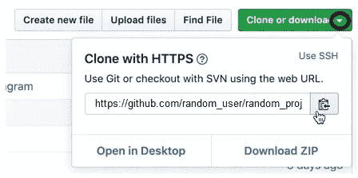
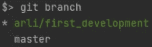
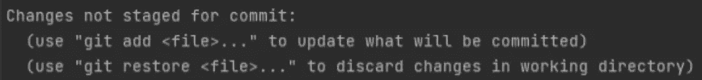
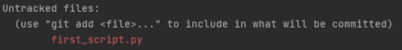
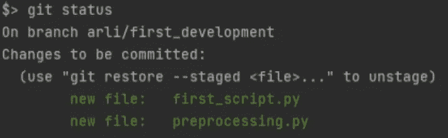
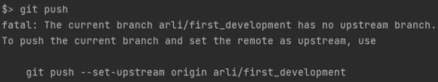
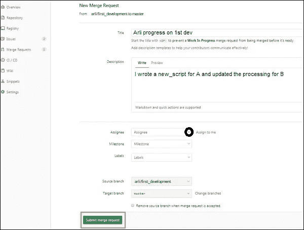

# 8 分钟满足 99%的 Git 需求

> 原文：<https://towardsdatascience.com/8-minutes-to-cover-99-of-your-git-needs-2c904c43590a>

## 通往 Git 和理解主要概念的更简单的途径


照片由 [Praveen Thirumurugan](https://unsplash.com/@praveentcom?utm_source=medium&utm_medium=referral) 在 [Unsplash](https://unsplash.com?utm_source=medium&utm_medium=referral) 上拍摄

*“这些都是什么命令？”“我要花多少小时才能全部学会？”“我应该按什么顺序使用它们？”*

如果这些问题听起来很熟悉，那么你来对地方了。

Git 可能会非常令人沮丧和难以掌握，互联网上可用的信息量使它更加令人不知所措。

我们都经历过与 Git 打交道的痛苦，陷入了无法逃脱的黑洞，我们觉得没有人能把我们从我们制造的混乱中拯救出来。我们在这里不是教你如何在每一个困难的 Git 情况下重新站起来(这可能需要 8 分钟以上的时间)，而是给你做 Git 的正确方法，避免所有可能导致你失败的陷阱。预防总是胜于治疗。

在本教程中，我们将带着出现的问题走过标准的项目路径，并为您提供在 GitHub/GitLab 上高效推进工作的解决方案。

# **同步本地&远程**

首先，我们需要将本地计算机与远程 Git 项目同步。

在大多数公司，你将会在一个已经构建好的 Git 项目上工作，要么是因为一个团队为你创建了公司认证的 Git 模板，要么是你被指派去改进一个现有的项目。我们还假设您的计算机和 GitHub/GitLab 之间已经建立了 SSH 连接。

如果不是这样，我建议您使用 GitHub/GitLab 的图形用户界面创建存储库，并创建和关联 Git SSH 密钥，或者您也可以在您的机器上编写 **git init** 来本地启动存储库。如果是这种情况，您可以直接进入**分支**部分。

要与 Git 项目同步(在远程 Git 上已经可用)，最简单的方法是在 Github 上点击“ **Clone”或“Download** ”上的向下箭头后，通过点击剪贴板复制粘贴 HTTPS 链接(在 GitLab 上只是**“Clone”**)。然后点击**剪贴板**复制存储库的链接。



现在打开一个 bash 命令，转到想要下载存储库的文件夹，输入(通过编写 **git 克隆**并粘贴**复制的链接**):

```
git clone https://github.com/random_user/random_project
```

恭喜您，您现在已经与*random _ user/random _ project*远程存储库同步了！

您也可以在本地已经有项目的情况下，因此 **git pull** 是您需要与远程存储库的最新更新同步的东西。

# **创建你的分支**

假设现在你想添加一些开发，要么在现有的脚本/模块上，要么一个全新的开发。

最佳实践是始终创建一个**分支**。

一个**分支**就像是一个新的空间，你创造它来进行你的开发，不干扰主干道，它在 GitLab 中也被称为**主**分支，在 GitHub 中被称为**主**分支。

把**主**分支想成是每个人都同意工作质量足以被共享和克隆的地方。而你的甚至都没写。

要创建分支，最佳做法是键入:

```
git checkout -b "arli/first_development"
```

这个命令实际上做了两件事:

*   它创建了分支 *arli/first_development*
*   它会将您发送到分支机构 *arli/first_development*

但是，您也可以连续编写被上面的命令替换的两个子命令。

**git branch**"*arli/first _ development*t "如果您只想创建分支而不想切换到分支

**git check out***arli/first _ development*如果要切换到分支

一条消息写: ***切换到新的分支‘arli/first _ development’***应该会出现。

你总是可以通过写 **git branch** 来检查你是否在好的分支中，一个星号应该出现在左边指示你在哪个分支中:



# 开始你的发展

太好了，现在是你工作的时间了！

*… 3 小时后…*

假设你努力开发了一个名为*‘first _ script . py’*的新脚本，并且改进了*‘preprocessing . py’。*

您可以通过输入以下命令来检查您是否取得了一些进展，并因此更改了一些本地文件:

```
git status
```

在这里你会看到:



因为您向现有的*预处理添加了代码*


您还将拥有:



来自你写的新' *first_script.py'* 。

你必须用命令**添加**这些改变(取决于你的 IDE*first _ script . py*可以在你创建的时候自动添加，但是下面的命令不会有任何伤害):

```
git add preprocessing.py
git add first_script.py
```

通过键入 **git status** ，您应该会看到:



# 提交您的工作

您改进了本地文件中的代码，这很好，但现在您需要将其推送到远程存储库，这样每个人都可以看到您疯狂的工作。

但是在推之前，你需要**提交**你的工作，而且你要经常提交！*一个* *经验法则*(这很难尊重我同意)是:每一个**承诺**应该对应一个**独特点**的发展你解决。

为了提交您的工作，您还需要分配一个**提交消息**，它将告诉您提交的内容。

假设我们开发了开发 1 的第一个迭代:

```
git commit -m "first iteration development 1"
```

它应该告诉您，您修改了 2 个文件，与之前的状态相比，插入和删除的行数。您可以在每次修改文件时**提交**(不要忘记 **git add** )。

太好了，现在让我们来推动提交！

# **推动你的工作**

一个**推**仅仅是将你的本地工作交付给远程存储库，或者有一个或者几个**提交**。

就写:

```
git push
```

你要面对这个通常的*【致命】*错误(其实根本不致命):



它告诉你要编写*git push—set—upstream origin arli/first _ development*而不仅仅是 git push。

每次你创建一个新的分支并推动它时，你都需要写这个。

我会给你一个不再写这个命令的方法。诀窍是修改一个内部 git 文件，它将自动创建并同步您在远程存储库上的本地分支，通过写(取决于您是否有 git *版本≥ 2.37* ，但是无论如何，执行这两个命令都没有坏处):

```
git config --global push.default current
git config --global --add --bool push.autoSetupRemote true
```

现在，执行 **git push** ，你就可以进行下一步了！

# 合并/拉取请求

在 GitLab 中称为*“合并请求”*，在 GitHub 中称为*“拉取请求”*。我将继续使用 GitLab 术语。

执行*合并请求*最简单的方法是转到 GitLab/GitHub GUI。

通常，你会发现一条横幅消息，告诉你你推进了一个分支，它建议你**打开**一个*合并请求*。

你可以点击它，然后继续提交合并请求:给一个标题，写一些关于你的发展的描述，分配一些你正在工作的审阅者，然后点击绿色的大**提交合并请求**。



如果您没有找到横幅，只需走标准路线，并转到*合并请求*文件夹，您将必须指定您的开发分支( *arli/first_development* )和目标分支(应该是 *master* )，然后单击比较分支并通过完成上面截图上的信息继续。

恭喜您，您的*合并请求*已提交。现在，需要有人对其进行合并(无论是你自己还是某些审核者都可以)。

# **合并合并请求:重定基还是不重定基**

这里可能会发生两种情况:

M **戈尔**按钮是绿色的，你(或者评论者)可以点击它，好工作你的工作现在与主分支合并了(并且不需要重设基础)！


如果你成功了，恭喜你，你已经完成了本教程！

然而，当你和不同的人在同一个项目上工作时，你迟早会面临可怕而令人沮丧的灰色**合并**按钮:


好的，跟着我，深呼吸，我们会解决这个问题的。

问题的出现是因为从现在到您最后一次将您的本地存储库与主分支同步之间，有人对同一个文件进行了更改，并且已经合并了一个您没有见过的修改版本，Git 出于预防措施，不会尝试将您的代码与他的代码合并。这就是 Git 让你做 rebase 的原因。

按照下面的步骤一个一个来。你需要在你的分支 *arli/first_development* 中，你的 *master* 分支(GitLab)可以被命名为 *main* (GitHub)，所以如果需要的话，在下面的代码中将 *master* 替换为 *main* 。

首先，获取同事合并的代码的最新版本:

```
git pull --rebase origin master
```

可能会因为有未提交的文件而出错。要么用 git add 和 git commit 提交它们，要么用 git restore 将它们恢复到以前的状态。

如果没有错误，写入 **git 状态**以了解哪个(哪些)文件处于*冲突*。

打开文件，搜索标记**<<<<<<<头**和标记 **=======** 。在这两个标记中，你让你的同事和你做同样的代码。

在 **=======** 和**>>>>>>>**之间你会发现你对文件的修改。通过选择您的版本或他的版本来解决冲突，并删除标记和未选择的代码版本。

对每个有*冲突*的文件重复该过程。当您没有在任何文件上留下标记时，您可以添加那些已解析的文件:

```
git add random_name_of_the_file_I_resolved.py
git add second_file_I_resolved.py 
```

**提交**您的更改:

```
git commit -m "Fix conflict with coworker work on A"
```

并使用以下代码完成重置:

```
git rebase --continue
```

强制(带租约)推回基数:

```
git push --force-with-lease
```

我们使用选项*——force-with-lease*而不是*——force*的原因是，如果当您正在做 rebase 时，其他人更新了您的分支，根据预防原则，Git 会告诉您有问题。

如果你面临这种非常罕见的情况，你将不得不重新开始 rebase 的所有步骤，但你需要从你的*分支*、*远程分支*(如果你单独在你的*分支*工作，这种情况不会发生)。

现在如果你进入你提交的**合并/拉取请求**的页面，你会发现，你的挣扎的终点，那个神圣的绿色**合并按钮**:


恭喜你，你已经成功推动你的工作，并将其与主/主分支合并。

使用本手册了解更多关于 Git 的信息:

[Git 袖珍指南](https://www.amazon.fr/Git-Pocket-Guide-Richard-Silverman/dp/1449325866/ref=sr_1_7?__mk_fr_FR=%25C3%2585M%25C3%2585%25C5%25BD%25C3%2595%25C3%2591&amp;crid=2XVXLD1B3BFYX&amp;keywords=Git&amp;qid=1675767494&amp;sprefix=git%252Caps%252C81&amp;sr=8-7&_encoding=UTF8&tag=arli94-21&linkCode=ur2&linkId=9c3b1931f8f11112f9dd4aeb4586d385&camp=1642&creative=6746)

无需额外费用，您可以通过我的推荐链接订阅 Medium。

<https://medium.com/@arli94/membership>  

或者你可以在收件箱里收到我所有的帖子。*[***做到这里*** *！*](https://arli94.medium.com/subscribe)*