# 用于分析的 8 个更有用的熊猫功能

> 原文：<https://towardsdatascience.com/8-more-useful-pandas-functionalities-for-your-analyses-ef87dcfe5d74>


帕斯卡·米勒在 [Unsplash](https://unsplash.com/s/photos/pandas?utm_source=unsplash&utm_medium=referral&utm_content=creditCopyText) 上的照片

# 用于分析的 8 个更有用的熊猫功能

## 它们可以让你的日常工作更轻松、更快捷

在这篇后续文章中(你可以在这里找到第一篇)，我想展示几个更有用的`pandas`方法/函数，它们是我最近在日常工作中一直在使用的。为了管理期望，这不是一篇展示`pandas`基本功能的文章，也没有特别的方法主题。事不宜迟，我们开始吧！

# 1.n 最小/n 最大

这些方法非常简单明了。它们根据某一列(或多列)返回具有最大/最小值的前 *n* 行。还值得注意以下几点(来自`nlargest`的文档):

> 这个方法相当于`df.sort_values(columns, ascending=False).head(n)`，但是性能更高。

首先，让我们创建一个示例数据帧:

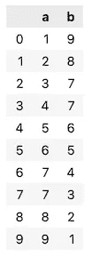

作者图片

然后，我们选择在`a`列中包含最大值的 3 行。

```
df.nlargest(3, "a")
```

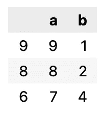

作者图片

您可能已经注意到，当我们创建 DataFrame 时，两列中都有重复的值。默认情况下，方法选择具有最大值的第一行。但是，我们可以更改此行为以包括所有事件。为此，我们指定了`keep`参数。

```
df.nlargest(3, "a", *keep*="all")
```

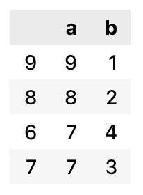

作者图片

我们还可以使用`“first”` / `“last”`作为`keep`参数的值，这将分别对第一次/最后一次出现进行优先级排序。

此外，我们还可以通过多列选择最大/最小值。为此，我们只需要提供一个列名列表，而不是单个名称。

# 2.隐藏索引/隐藏列

另一个有趣的功能是隐藏索引或列的选项。这在向风险承担者展示结果时尤其有用。这种情况在过去发生过很多次，当呈现一个过滤后的数据帧的片段时，有人会问左边奇怪的、看似随机的数字(指数)。利用`hide_index`，我们可以轻松避免回答这类问题的麻烦。

让我们使用与上一个示例相同的数据帧，并过滤掉`a`列中大于 5 的值。一气呵成，让我们隐藏索引。

```
df[df["a"] > 5].style.hide_index()
```

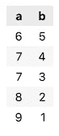

作者图片

**注意:**我们需要使用`.style.hide_index()`来访问该方法。

我们可以更进一步，也隐藏一列。我们使用以下语法来实现:

```
df[df["a"] > 5].style.hide_index().hide_columns("b")
```

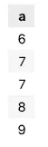

作者图片

因为我们已经使用了`style`，我们不需要再次调用它。当然，我们可以一次隐藏多个列，我们只需要提供一个列名列表。

# 3.询问

我经常使用这个，我想你会很快明白为什么。在上面的例子中，我们过滤了值大于 5 的观察值。我们可以使用`query`方法应用相同的过滤。

```
df.query("a > 5")
```

代码返回完全相同的结果。就个人而言，我发现语法更容易写/读，尤其是当有多个条件时。例如，我认为

```
df.query("a > 5 and b < 3")
```

对眼睛来说比

```
df[(df["a"] > 5) & (df["b"] < 3)]
```

但这是个人偏好，最好了解过滤数据帧的最常见方法的替代方法。

# 4.第一个有效索引/最后一个有效索引

当我们想要找到第一个/最后一个非 NA 值的索引值时，这些方法非常方便。在没有有效索引的情况下，这些方法返回`None`。

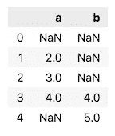

作者图片

查看上面的数据帧，第一个有效索引(包含非 NA 值)应该是`1`。我们可以通过运行以下代码来验证我们的直觉:

```
df.first_valid_index()
```

实际上，运行该命令会返回`1`。我们还可以将该方法与`apply`结合起来，为每一列找到第一个有效的索引。

```
df.apply(lambda x: x.first_valid_index())
```

它返回以下内容:

```
a    1 
b    3
```

# 5.单调性/单调性递减

这个函数可能对我们的数据进行一些健全性检查很有用。它检查数据帧/序列中的值是否按升序/降序排序。你可以在这里阅读更多关于单调性[的内容。](https://en.wikipedia.org/wiki/Monotonic_function)

首先，让我们创建一个简单的数据框架:

```
df = pd.DataFrame(data={"a": [1, 2, 3, 4, 5, 6]})df
```

然后我们可以如下使用`is_monotonic`方法:

```
df[“a”].is_monotonic
```

答案是:

```
True
```

我们还可以检查相反的情况，即值是否按降序排列:

```
df["a"].is_monotonic_decreasing
```

答案自然是:

```
False
```

值得一提的是，这些函数不检查严格的单调性。这意味着它们允许重复值，例如，如果我们有这样一个值序列

```
[1, 2, 2, 3]
```

这些方法仍然表明序列是单调的。

最后，该方法不限于数字。我们也可以用它来约会:

```
pd.date_range("2000-01-01", "2000-01-31").is_monotonic
```

它返回一个`True`，假定范围已经排序。

# 6.替换

这是另一个不言自明的例子。它只是替换数据帧中的值。但是，有几种方法可以使用它。让我们用一个例子来展示更多的细节。

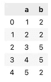

作者图片

我们可以做的第一件事是用另一个值替换整个数据帧中的所有值。使用下面的语法，我们用 999 替换所有的 2。

```
df.replace(2, 999)
```

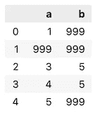

作者图片

或者，我们也可以进行更复杂的替换。下面，我们仅将`a`列中的值替换为用单词表示的数字。

```
df.replace({"a" : {1: "one", 2: "two", 3: "three", 4: "four", 5: "five"}})
```

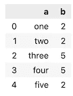

作者图片

# 7.面具/哪里

在上面的例子中，我们已经替换了具体的值。但是，也有基于条件替换值的有用方法。它们是 if-else 语句，您可以在下面找到它们的简短描述:

*   `mask` —替换条件评估为`True`的值，
*   `where` —替换条件评估为`False`的值。

对于以下示例，我们使用与`replace`示例中相同的数据帧。`mask`方法的语法如下:

```
df["a"].mask(df["a"] < 4, "Less than 3")
```

它返回以下序列:

```
0    Less than 3 
1    Less than 3 
2    Less than 3 
3              4 
4              5 
Name: a, dtype: object
```

`where`非常类似，它只是替换了条件为`False`的值。

```
df["a"].where(df["a"] < 4, "More than 3")
```

它返回以下内容:

```
0              1 
1              2 
2              3 
3    More than 3 
4    More than 3 
Name: a, dtype: object
```

# 8.夹子

`clip`用边界值替换指定边界外的值。例如，它可以用作一种非常简单的异常值去除方法。

首先，让我们用一些数值创建一个数据帧。

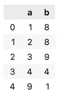

作者图片

现在，让我们将所有值裁剪到[4，7]的范围内:

```
df.clip(4, 7)
```

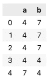

作者图片

我们也可以使用`clip`方法只在一端裁剪值。使用下面的语法，我们只限制上限值:

```
df.clip(upper=7)
```

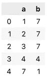

作者图片

# 在你走之前

今天到此为止。毫无疑问,`pandas`库还有许多更有趣、更有用的功能。我可能很快会写另一篇关于他们的文章。

您可以在我的 [GitHub](https://github.com/erykml/medium_articles/blob/master/Data%20Wrangling/useful_pandas_2.ipynb) 上找到本文使用的代码。此外，欢迎任何建设性的反馈。我很乐意听到一些让您的工作更轻松的功能！你可以在推特上或者评论里联系我。

喜欢这篇文章吗？成为一个媒介成员，通过无限制的阅读继续学习。如果你使用[这个链接](https://eryk-lewinson.medium.com/membership)成为会员，你将支持我，不需要你额外付费。提前感谢，再见！

您可能还会对以下内容感兴趣:

[](/9-useful-pandas-methods-you-probably-have-not-heard-about-28ff6c0bceee) [## 你可能没听说过的 9 种有用的熊猫方法

### 它们可以让你的日常工作更容易、更快捷。

towardsdatascience.com](/9-useful-pandas-methods-you-probably-have-not-heard-about-28ff6c0bceee) [](/one-thing-you-might-not-have-known-about-linear-regression-634446de7559) [## 关于线性回归，有一点你可能不知道

### 如何训练具有多个输出的单个模型

towardsdatascience.com](/one-thing-you-might-not-have-known-about-linear-regression-634446de7559) [](/phik-k-get-familiar-with-the-latest-correlation-coefficient-9ba0032b37e7) [## 菲克(𝜙k)——熟悉最新的相关系数

### 这在分类变量、序数变量和区间变量之间也是一致的！

towardsdatascience.com](/phik-k-get-familiar-with-the-latest-correlation-coefficient-9ba0032b37e7)