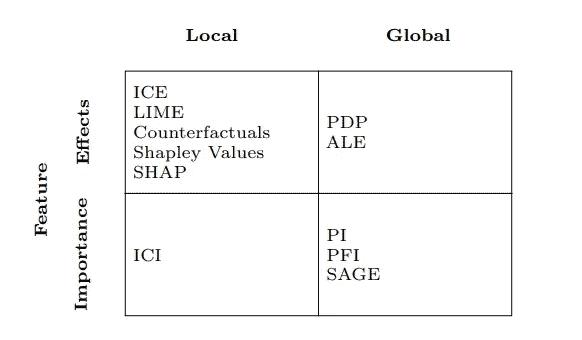
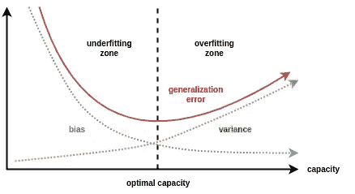
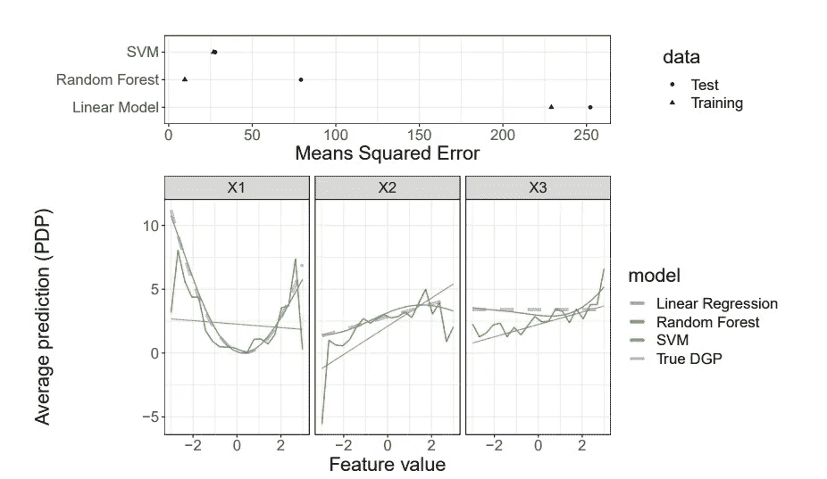
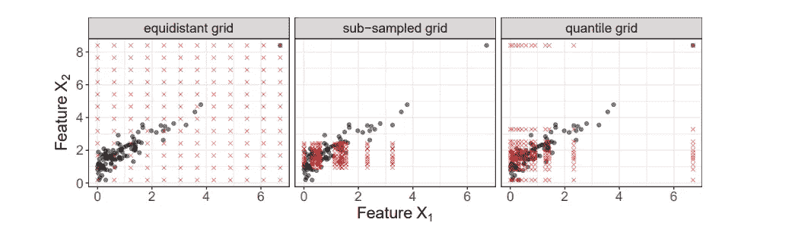
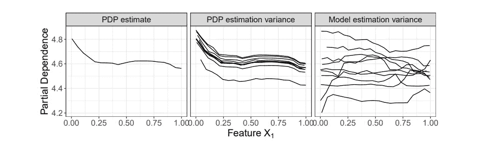
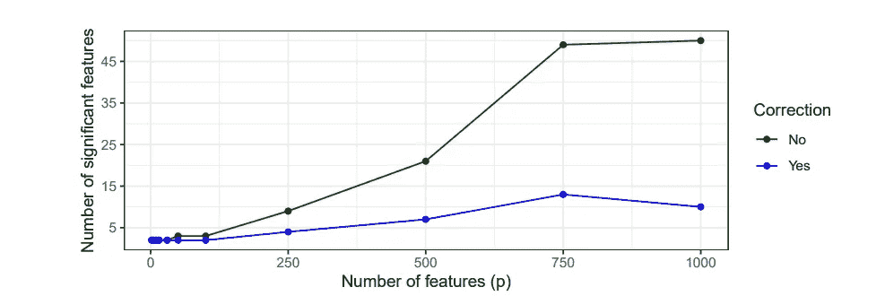

# 使用模型不可知解释技术时要避免的 7 个陷阱

> 原文：<https://towardsdatascience.com/8-pitfalls-to-avoid-while-using-model-agnostic-interpretation-techniques-d0fcca544711>

## 可解释机器学习的一般陷阱

图片由[穆罕默德·哈桑](https://pixabay.com/users/mohamed_hassan-5229782/?utm_source=link-attribution&amp;utm_medium=referral&amp;utm_campaign=image&amp;utm_content=4082314)来自 [Pixabay](https://pixabay.com/?utm_source=link-attribution&amp;utm_medium=referral&amp;utm_campaign=image&amp;utm_content=4082314)

随着越来越多不容易解释的复杂机器学习算法被采用，可解释的机器学习技术在数据科学社区中越来越受欢迎。

模型不可知的解释技术不关心底层的模型，但是它们有能力解释模型并提供有洞察力的模型解释。用于机器学习模型的一些流行的模型不可知的解释技术是 ***【部分依赖图】******置换特征重要性(PFI)、LIME、*** 和***【SHAP】***。如果应用不当，这些模型不可知的解释技术会导致错误的见解或结论。在本文中，我们将讨论在使用解释技术时要避免的一些常见的 8 个陷阱。

> 这篇文章的灵感来自 Christoph Molnar 和他的团队于 2021 年 8 月发表的一篇论文。我用通俗易懂的文字概括了这篇文章。

# 开始使用:

下面提到的 8 个陷阱指的是如果数据科学家使用解释技术，他们会在哪里出错。

## 1)假设一个适合所有人的可解释性:

有不同种类的解释技术服务于不同的目的。数据科学家首先需要考虑基于业务约束需要什么样的可解释性。

**解决方案:**任何单一的模型解释技术都不适合所有的用例或模型。SHAP 是计算特征对模型预测的重要性的首选方法，因为它可以计算每个实例中每个特征的 shapely 值。然而，置换特征重要性(PFI)优选地用于计算特征重要性 wrt 以进行模型概括。

([来源](https://arxiv.org/pdf/2007.04131.pdf))，选择流行的模型不可知解释技术

## 2)模型泛化能力差:

模型解释技术基于模型是最佳拟合的假设来提供见解。模型解释和底层模型一样好。拟合不足或拟合过度的模型会导致错误的解释见解。

**解决方案:**数据科学家应该监控、跟踪和调试底层模型，并对其进行调整，以获得一个健壮的通用模型。

([来源](https://www.kaggle.com/general/198890))，偏差方差权衡

## 3)复杂模型的不必要使用:

有时简单和复杂的模型在期望的度量上有相似的性能。对于模型解释而言，简单模型应始终优先于具有可比性能的复杂模型。

**解决方案:**与具有内核的 SVM 或复杂的神经网络模型相比，线性回归和决策树等模型更易于解释。

( [Source](https://arxiv.org/pdf/2007.04131.pdf) )， **Top:** 对线性回归模型(欠拟合)、随机森林(过拟合)和具有径向基核的支持向量机(良好拟合)的训练和测试数据的性能估计， **Bottom:** 对数据生成过程(DGP)——这是基本事实——和三个模型的性能估计

## 4)忽略特征相关性:

PFI、PDP、LIME 或 SHAP 等不可知模型解释技术可能会误导在多重共线性数据集上训练的机器学习模型。

**解决方案:**数据科学家应该使用各种统计测试和可视化来检查数据集中相关性的存在，并且应该在建模和解释之前对其进行处理。

([来源](https://arxiv.org/pdf/2007.04131.pdf))，外推解释

## 5)忽略模型和近似不确定性:

许多解释技术只提供了一个平均估计值，并没有量化不确定性。忽略不确定性的来源会导致对数据中噪声的解释。

**解决方案:**数据科学家必须反复尝试计算指标，但使用不同的引导样本来量化不确定性。

(来源)，特征“x1”的部分相关性图

## 6)无法扩展到高维度设置:

对于人类思维来说，解释高维数据的结果是相当困难的。对高维数据集应用模型解释可能会导致大量的高维输出。此外，计算高维数据的模型解释在计算上是昂贵的。

**解决方案:**建议在特征工程管道中使用降维技术或将相似特征分组。

> 请参考我之前的文章了解 [8 降维技术](/8-dimensionality-reduction-techniques-every-data-scientists-should-know-1c594f0aa7f2)。

</8-dimensionality-reduction-techniques-every-data-scientists-should-know-1c594f0aa7f2>  

## 7)不合理的随意解释:

大多数从业者对数据生成过程的偶然洞察感兴趣，这是模型不可知的解释技术所不能提供的。标准的监督 ML 模型被设计成仅仅利用关联，而不是模拟偶然的关系。

**解决方案:**数据科学从业者必须仔细评估是否可以对底层数据生成、学习模型和解释技术做出充分的假设。如果假设得到满足，那么随意的解释是可能的。

([来源](https://arxiv.org/pdf/2007.04131.pdf))，重要特征数量与特征数量的关系图

# 结论:

在本文中，我们已经讨论了模型不可知解释技术的 7 个陷阱，例如，在不良的模型概括、依赖特征、特征之间的交互或者因果解释的情况下，在生成模型解释之前需要记住这些陷阱

# 参考资料:

[1]机器学习模型的模型不可知解释方法的一般陷阱(2021 年 8 月 17 日):【https://arxiv.org/pdf/2007.04131.pdf

> 感谢您的阅读