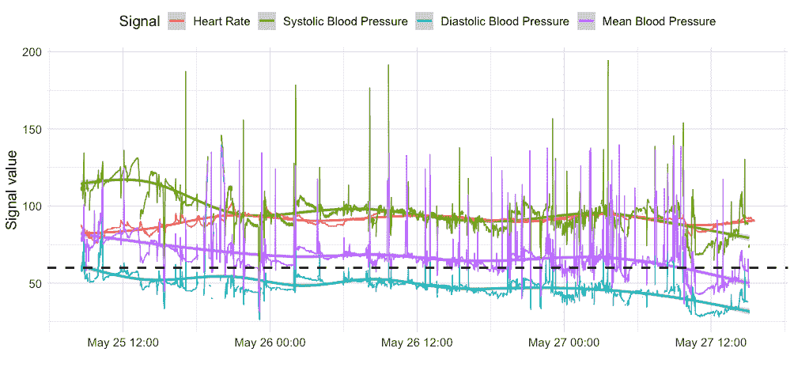

# 预测困难的 8 个原因

> 原文：<https://towardsdatascience.com/8-reasons-why-forecasting-is-hard-481755a05325>

## 以下是让预测成为如此棘手任务的原因，以及如何应对这些问题

Jukan Tateisi 在 [Unsplash](https://unsplash.com?utm_source=medium&utm_medium=referral) 上拍摄的照片

**预测是数据科学中一个热门而又困难的问题。**

从非平稳性到噪声和缺失值，挑战的出现有多种原因。解决这些问题可能是提高预测性能的关键。

# 介绍

时间序列是按时间排序的数值序列。这些数据集的关键方面是观测值之间的时间依赖性。过去发生的事情会影响未来的发展。

时间序列代表跨许多应用程序的真实世界系统。实例出现在金融、零售或运输等领域。

因此，时间序列分析是数据科学中的一个热门话题。它使专业人员能够做出数据驱动的决策。

但是，从时间序列中学习具有挑战性。在这个故事中，我列出了预测是一项困难任务的几个原因。

# 1.非平稳性

平稳性是时间序列中的一个核心概念。如果时间序列的属性(如平均水平)不随时间变化，则时间序列是静态的。正如我在上一篇[文章](/12-things-you-should-know-about-time-series-975a185f4eb2)中所说的:观察不取决于它们被观察的时间。

许多现有的方法都是在时间序列是平稳的假设下工作的。但是，趋势或季节性之类的东西打破了平稳性。

转换时间序列可以减少这个问题。例如，差异有助于稳定系列的水平。取对数可以稳定方差。

有几种统计测试来检查时间序列是否是平稳的。这些包括[增强的迪基-富勒](https://www.statsmodels.org/dev/generated/statsmodels.tsa.stattools.adfuller.html)、[菲利普-佩龙](https://bashtage.github.io/arch/unitroot/generated/arch.unitroot.PhillipsPerron.html)或 [KPSS](https://www.statsmodels.org/dev/generated/statsmodels.tsa.stattools.kpss.html) 测试。

# 2.对多重视野的兴趣

西蒙·伯杰在 [Unsplash](https://unsplash.com?utm_source=medium&utm_medium=referral) 拍摄的照片

预测通常被定义为预测时间序列的下一个值。

但是，提前预测许多值具有重要的实际优势。它减少了长期的不确定性，从而实现了更好的运营规划。

预测未来会增加不确定性。因此，对于更长的时间范围，预测变得更加困难。

在之前的一篇文章中，我描述了 6 种不同的多步预测方法。

# 3.对罕见事件的兴趣

照片由[尼克·费因斯](https://unsplash.com/@jannerboy62?utm_source=medium&utm_medium=referral)在 [Unsplash](https://unsplash.com?utm_source=medium&utm_medium=referral) 上拍摄

通常，我们对预测罕见病例感兴趣。这些是分布的尾部。

以能源生产为例。预测用电高峰对于管理电网的供需至关重要。

通常，罕见的事件会带来重大的长期后果。一个典型的例子是股市崩盘。这些事件导致许多投资者倾家荡产。

罕见事件可能会影响数据分布，从而导致当前模型过时。更多关于原因 5(改变点)的信息请见下文。

关于罕见事件的主要挑战是…嗯，它们是罕见的。

关于这些案例以及它们是如何发生的信息很少。因此，预测模型很难预测它们。

有几种方法可以改进极值的预测。其中包括:

*   使用对成本敏感的模型；
*   利用面向极端情况的统计分布；
*   对训练数据的分布进行重采样。

# 4.额外的依赖项和维度

除了时间之外，时间序列通常还有额外的相关性。

时空数据是一个常见的例子。每个观察结果都在两个维度上相关联。具有其自身的滞后(时间相关性)和附近位置的滞后(空间相关性)。

时空数据是多元时间序列的一个特例。这些时间序列由多个变量表示。

额外的变量可能包含有价值的信息。因此，对它们进行建模可能对提高预测性能至关重要。

# 5.改变点

照片由 [Unsplash](https://unsplash.com?utm_source=medium&utm_medium=referral) 上的[hkon grim stad](https://unsplash.com/@grimstad?utm_source=medium&utm_medium=referral)拍摄

事情会随着时间而变化。代表这些事物的时间序列的数据分布也是如此。

重大变化被称为**变化点**。当它们突然发生时，这些变化被称为结构突变。其他时候，变化发生得更慢。这些被称为渐变。

在文献中，变化点检测是一个被充分研究的主题。查阅参考文献[1]进行全面阅读。

有时改变点是已知的。

市场崩溃或战争爆发，会深刻影响组织的运作。然而，还不清楚人们应该如何应对这种变化。旧的观察结果不像以前那么有用了，因为分布已经改变了。但是，几乎没有关于新分布的信息。

检测和适应变化对于保持模型最新非常重要。监控这些模型的性能是检测变化的好方法。

# 6.低信噪比

不严格地说，信噪比量化了时间序列的可预测性。

信号是数据的相关部分。你试图模拟和理解的东西。但是，这种信号往往被背景噪声——看似随机的不可预测的波动——所掩盖。

有时候，这种背景噪音根本就是知识匮乏。我们不知道哪些因素影响了数据。也可能这些因素很难量化。所以，这个系列的运动看起来是随机的。

金融数据是一个普遍存在低信噪比的臭名昭著的例子。

# 7.噪音和缺失值

图 2:床边监护仪捕捉到的医院病人的生理信号。原始信号有噪声。局部回归平滑了它们的动态。[链接](https://physionet.org/content/mimiciii/1.4/)为数据源。图片作者。

噪声可能源于数据收集不足。

现实世界的系统被噪音和缺失值所困扰。图 2 描述了这个问题。它显示了医院病人的生物信号。原始变量不稳定。但是，在应用局部回归(黄土)后，它们的动态变得更加清晰。

由于设备故障，可能会出现噪音和缺失值。传感器故障导致数据丢失。或者有干扰，导致错误的读数。

噪声也可能是由于贴错标签造成的。当注释者给数据分配了错误的标签时，就会出现这种情况。

适当的预处理步骤可能有助于增强该系列的信号。例子包括卡尔曼滤波器或指数平滑。

# 8.小样本量

有时，时间序列包含少量的观察值。在这种情况下，算法可能没有足够的数据来建立足够的模型。

这个问题可能是由于低采样频率引起的。例如，时间序列只能按月或按年观察。或者它们所代表的事物不常发生(例如极端天气事件)。

在零售领域，您可能会遇到冷启动问题。这指的是新产品的信息很少的情况。

由于变化，可能会出现数据缺乏的情况(见第 5 点。以上)。如果发生重大变化，历史数据就会过时。然后，您需要反映新分布的新数据。

正如我在[之前的一篇文章](/machine-learning-for-forecasting-size-matters-b5271ec784dc)中所写的，如果有足够的数据，机器学习模型会更好。否则，你应该选择简单的解决方案。

使用全球预测模型可以缓解缺乏数据的问题。这些利用许多时间序列来建立模型。你可以在[之前的故事](/introduction-to-global-forecasting-models-3ca8e69a6524)中了解更多。

# 外卖

在这篇文章中，我描述了你在预测任务中遇到的 8 个挑战。这里有一个总结:

1.  **非平稳性:**当数据属性随时间变化时；
2.  **多步提前预测**:对长期预测感兴趣；
3.  **极值**:极少数情况下的兴趣；
4.  **额外相关性**:对准确预测至关重要的额外变量；
5.  **变化**:检测分布的变化；
6.  **低信噪比**:时间序列可预测性低时；
7.  **噪声**:数据的随机波动；
8.  **小样本**:数据不足时。

感谢您的阅读，下一个故事再见！

## 进一步阅读

[1] Aminikhanghahi、Samaneh 和 Diane J. Cook。"时间序列变点检测方法综述."*知识和信息系统*51.2(2017):339–367。

[2] Karpatne，Anuj 等，“面向地球科学的机器学习:挑战与机遇” *IEEE 知识与数据工程汇刊*31.8(2018):1544–1554。