# Python 中单变量探索性数据分析(EDA)的 8 个 Seaborn 图

> 原文：<https://towardsdatascience.com/8-seaborn-plots-for-univariate-exploratory-data-analysis-eda-in-python-9d280b6fe67f>

## 了解如何使用 seaborn 和 matplotlib 一次可视化和分析一个变量


照片由 [**Pixabay**](https://www.pexels.com/@pixabay?utm_content=attributionCopyText&utm_medium=referral&utm_source=pexels) 来自 [**像素**](https://www.pexels.com/photo/business-charts-commerce-computer-265087/?utm_content=attributionCopyText&utm_medium=referral&utm_source=pexels)

数据探索，尤其是探索性数据分析(EDA)，是数据科学项目中我最喜欢的部分。一组新数据带来了挥之不去的好奇和兴奋，有机会发现微妙的关系和意想不到的趋势。

在以前的一篇文章中，我介绍了我每次在新数据集上使用的 [11 个基本 EDA 代码块](/11-simple-code-blocks-for-complete-exploratory-data-analysis-eda-67c2817f56cd)。今天的文章关注 [seaborn](https://seaborn.pydata.org/) 可视化图，用于[单变量分析](https://en.wikipedia.org/wiki/Univariate_analysis)(一次关注一个特征)。在[数据科学流程](https://www.datasciencegraduateprograms.com/the-data-science-process/)的任何阶段使用这些图。

**加载库和数据**

我们将探索来自 Kaggle 的[车辆数据集](https://www.kaggle.com/datasets/nehalbirla/vehicle-dataset-from-cardekho?ref=hackernoon.com&select=Car+details+v3.csv) [](#45d1)。还要注意，在本文中，单词“变量”、“特性”和“列”的意思都是一样的。

打开一个新的 Jupyter 笔记本并导入所需的库。`Seaborn`依赖于`matplotlib`,我们将同时导入它们。另外，设置`style`和`font`。

```
import pandas as pd
import seaborn as sns
import matplotlib.pyplot as plt
import numpy as np
sns.set_style('darkgrid')
sns.set(font_scale=1.3)
```

接下来，我们加载`csv file`并运行一些 EDA 代码行，以获得数据的总体概述。

```
cars = pd.read_csv('Car details v3.csv')
cars.head()
```

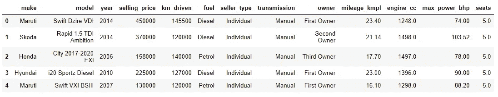

作者图片

```
cars.shape
#(8128, 13)cars.dtypes
```

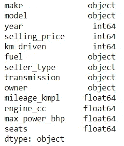

作者图片

通过这些结果，我们了解了数据集的大小(行数=8128，列数=13)、列名和它们的数据类型，并显示了 5 行，以便对数据中的值有所了解。

## 单变量分析

前缀“Uni”的意思是一，意味着“单变量分析”是一次分析一个变量。

对于数字特性，我们希望知道存在的值的范围以及这些值(或值组)出现的频率。

对于分类特征，我们想知道唯一类的数量以及它们出现的频率。

**第 1 部分:数字特征**

这些是带有数字的要素，您可以对其执行数学运算。它们又进一步分为离散(边界清晰的可数整数)和连续(可以取某个范围内的任意值，甚至小数)。

我们首先使用 `df.describe()`显示每个数字特征的汇总统计数据。这向我们展示了实际的统计数据。

```
cars.describe()
```

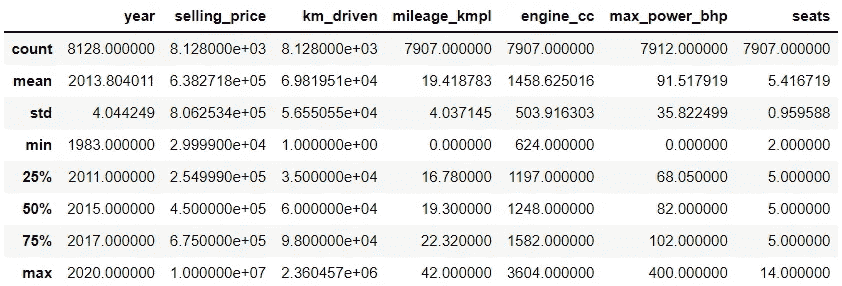

数字要素的汇总统计数据

为了更直观地理解这种分布，我们需要用图形将它们可视化。

**1。直方图—** `**sns.histplot()**`

直方图将值分组到不同的范围(或条块)中，条形的高度显示有多少个值落在该范围内。

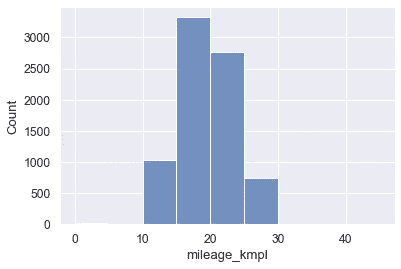

作者直方图

从直方图中，我们将得到以下结果:

*   数据的范围。最小值和最大值位于直方图的相对边缘。高度集中的区域也很明显。高条是大多数数据点所在的位置，而稀疏表示的范围显示为间隙或短条。
*   特征的形状或偏斜度。要素可以是右偏的(尾部向右)、左偏的(左尾)、正态分布的(一个中心)或随机分布的(没有明显的模式，多个峰值)。
*   异常值的存在。这些显示为最左边或最右边的孤立条。

下面的代码为我们的目标变量`selling price`创建了一个 seaborn 直方图。

```
sns.histplot(x='selling_price', data=cars);
```

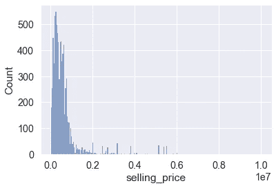

作者直方图

下面的代码利用一个循环为所有数字变量创建单独的直方图。

```
cols = 3
rows = 3
num_cols = cars.select_dtypes(**exclude**='object').columnsfig = plt.figure( figsize=(cols*5, rows*5))for i, col in enumerate(num_cols):

    ax=fig.add_subplot(rows,cols,i+1)

    sns.histplot(x = cars[col], ax = ax)

fig.tight_layout()  
plt.show()
```

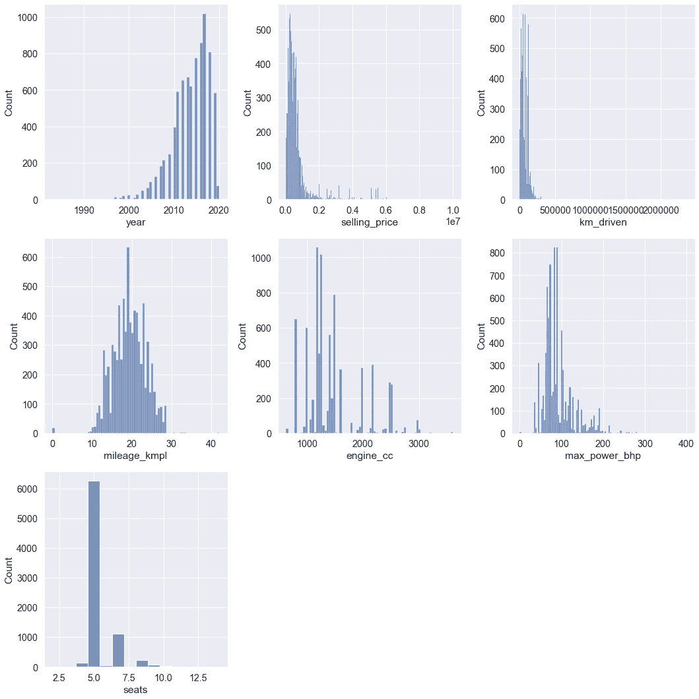

**2。KDE 剧情—** `**sns.kdeplot()**`

[“内核密度估计”图](https://seaborn.pydata.org/generated/seaborn.kdeplot.html)通过将所有点标准化为出现在一条曲线下，创建了一个平滑版本的直方图。

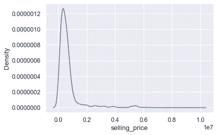

作者的 KDE 情节

它最适用于比较一个变量在另一个变量组之间的分布，这个概念被称为[分段单变量分布](https://www.linkedin.com/pulse/segmented-univariate-analysis-junaid-alam/)。

下面的代码比较了`engine sizes`如何在`fuel types`之间分配。我们通过`hue=’fuel’`按照燃料类型分割数据。

```
sns.kdeplot(x='engine_cc', data=cars, hue='fuel')
```

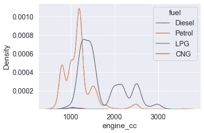

作者的 kdeplot

**3。带直方图的 KDE 图—** `**sns.histplot(kde=True)**`

我们可以用如下的 KDE 曲线显示一个直方图。见[这篇文章](https://stackoverflow.com/a/63799529/3262118)了解 kde 和直方图。

```
sns.histplot(x='selling_price', data=cars, kde=True)
```

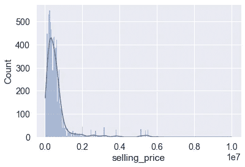

作者 kde 直方图

**4。地毯图—** `**sns.rugplot()**`

[rug plot](https://en.wikipedia.org/wiki/Rug_plot) 在 x 轴上绘制记号，显示各个数据点的位置。

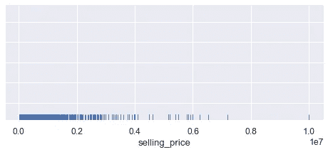

作者的 Rugplot

密集区域是大多数观测值都落在其中的地方，而分笔成交点的高度则无关紧要。

Rug 图是对直方图的补充，因为我们可以看到异常数据点的位置。下面的代码为`kilometers driven`特征创建了[一个褶皱图](https://seaborn.pydata.org/generated/seaborn.rugplot.html)和直方图。注意异常位置。

```
sns.rugplot(x='km_driven', data=cars, height=.03, color='darkblue')
sns.histplot(x='km_driven', data=cars, kde=True)
```

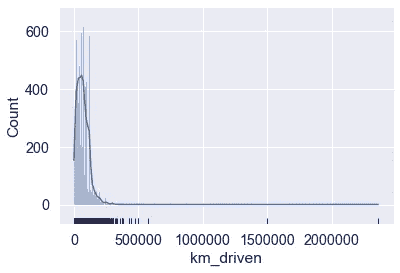

作者的皱纹图和直方图

**5。箱形图—** `**sns.boxplot()**`

一个[箱线图](https://www.simplypsychology.org/boxplots.html)显示一个数字特征的分布、中心和偏斜度。它将数据分成包含大约 25%数据的部分。


作者创作的箱线图插图

[异常值](https://en.wikipedia.org/wiki/Outlier)，如果存在，在两端显示为圆点。从框中伸出的触须代表最小值和最大值。方框描述了[四分位数间距](https://en.wikipedia.org/wiki/Interquartile_range)，并保存了 50%的数据。

箱线图比直方图占用更少的空间，因为它们不太详细。它们还定义了四分位位置，有利于快速比较不同的要素或分段。

下面的代码创建了一个`mileage`特性的箱线图。

```
sns.boxplot(x=cars['mileage_kmpl'])
```

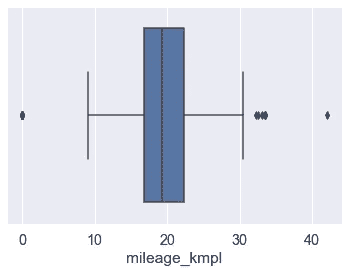

作者的箱线图

假设您想要比较两个相关列的分布情况；也许他们有相同的测量单位。我们可以创建一个方框图，并在`data`中传递两列，如下所示。

```
sns.boxplot(data=cars.loc[:, ['engine_cc', 'max_power_bhp']])
```

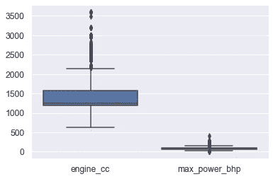

作者的箱线图

下面的代码在一个循环中为所有的数字变量创建箱线图。

```
cols = 3
rows = 3
num_cols = cars.select_dtypes(exclude='object').columnsfig = plt.figure(figsize= (15,9))for i, col in enumerate(num_cols):

    ax=fig.add_subplot( rows, cols, i+1)

    sns.boxplot(x=cars[col], ax=ax)

fig.tight_layout()  
plt.show()
```

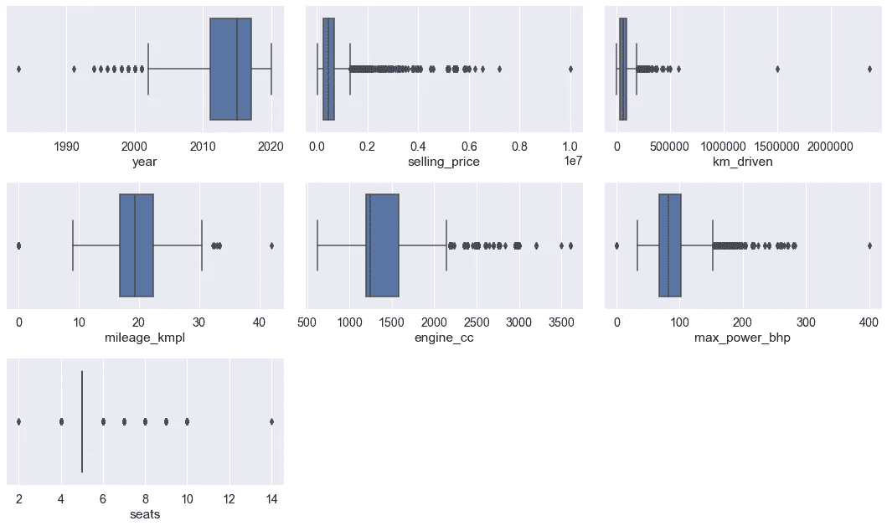

按作者列出的所有要素的箱线图

6。小提琴剧情— `**sns.violinplot()**`

[小提琴图](/violin-plots-explained-fb1d115e023d)结合了盒子图和内核密度图。这意味着除了显示四分位数之外，它还展示了潜在的分布，例如不同峰值的存在和位置。


图片来自[来源](https://orangedatamining.com/widget-catalog/visualize/violinplot/)

下面的代码创建了一个`year`数据的 [seaborn violin 图](https://seaborn.pydata.org/generated/seaborn.violinplot.html)。

```
sns.violinplot(x=cars["year"])
```

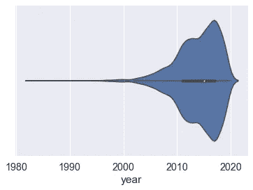

作者的小提琴情节

**7。带状图—** `**sns.stripplot()**`

一个[带状图](https://seaborn.pydata.org/generated/seaborn.stripplot.html)实现了一个散点图来显示一个特征的单个观察值的分布。

密集位置表示有许多重叠点的区域，您可以快速发现异常值。然而，与箱线图不同的是，建立相对中心是很困难的，对于较小的数据集来说，这是最好的。

下面的代码创建了一个`selling price`的带状图。

```
sns.stripplot(x=cars["selling_price"]);
```

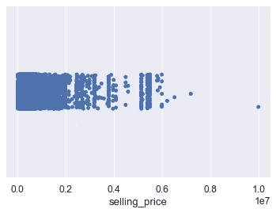

作者的带状图

## **第 2 部分:分类特征**

[这些](https://www.datacamp.com/community/tutorials/categorical-data)是可能值数量有限的列。例如性别、国家或年龄组。

在创建图之前，我们将首先运行汇总统计数据，显示每个要素的唯一类的数量等信息。这将告诉我们哪些特征可以被有效地可视化。如果有太多的类，情节是混乱和不可读的。

```
cars.describe(include='object')
```

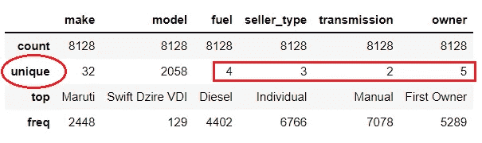

作者图片

现在我们可以想象上面强调的四个分类特征。

**8。计数图—** `**sns.countplot()**`

[计数图](https://seaborn.pydata.org/generated/seaborn.countplot.html)比较分类特征的不同类别及其出现频率。想象一个条形图，其条形高度显示每个类在数据中出现的次数。

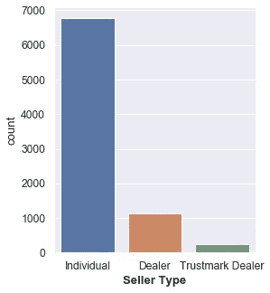

按作者统计情节

下面的代码使用循环为唯一类小于 10 的分类要素创建计数图。

```
cols = 4
rows = 1
fig = plt.figure(figsize= (16,6))all_cats = cars.select_dtypes(include='object')cat_cols = all_categs.columns[all_categs.nunique() < 10]for i, col in enumerate(cat_cols):

    ax=fig.add_subplot(rows, cols, i+1)

    sns.countplot(x=cars[col], ax=ax)

    plt.xticks(rotation=45, ha='right')

fig.tight_layout()  
plt.show()
```

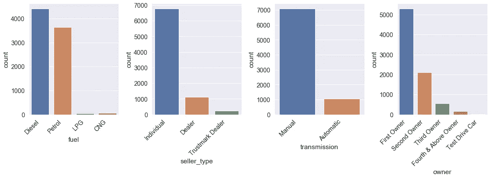

作者计数图

9。饼状图—`**plt.pie()**`

一个[饼图](https://byjus.com/maths/pie-chart/)在一个圆形图中显示一个分类变量的百分比分布。

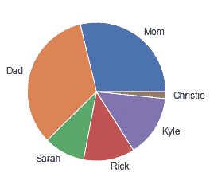

按作者排列的饼图

饼图在可视化社区中不是很受欢迎。首先，当组数超过四个时，图表会显得混乱。第二，有时切片的宽度不是直观清晰的。

Seaborn 不实现饼图。我们将使用 matplotlib 版本。

与 seaborn 图不同，饼状图不计算引擎盖下的计数。因此，我们将使用`Series.value_counts()`获得计数。

```
df = cars['transmission'].value_counts()###df
Manual       7078
Automatic    1050
Name: transmission, dtype: int64
```

接下来，我们使用`plt.pie()`创建饼图，并向它传递每个组的值、每个切片的标签(可选)，以及如何显示切片内的值(可选)。

```
plt.pie(df, labels=df.index, autopct="%.0f%%");
```

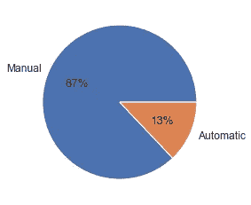

按作者排列的饼图

`autopct = “%.0f%%”`创建格式化字符串。(`%.0f`)是舍入到 0 位小数的浮点值的占位符。最后一部分(2 个百分比符号)由占位符(%)和要打印的实际百分比符号组成。

**结论**

单变量分析只涵盖了数据探索的一个方面。它检查单个要素的分布，以确定它们在数据中的重要性。下一步是理解特征之间的关系和相互作用，也称为双变量[和多变量](https://en.wikipedia.org/wiki/Bivariate_analysis)[分析。](https://www.mygreatlearning.com/blog/introduction-to-multivariate-analysis/)

我希望你喜欢这篇文章。所有的代码和数据文件都在[这个 GitHub](https://github.com/suemnjeri/medium-articles/blob/main/Seaborn%20plot%20functions/Univariate%20analysis%20cars.ipynb) 链接中。

欢迎您[订阅此处](https://suemnjeri.medium.com/subscribe/@suemnjeri)每当我发布数据科学文章时，您都会收到电子邮件提醒。如果你不是一个媒体成员，你可以通过[这个链接](https://medium.com/@suemnjeri/membership)加入来支持我作为一个作家，我将赚取一小笔佣金。感谢您的阅读，祝您的数据之旅一帆风顺！

**参考文献**

1.  [](https://www.kaggle.com/datasets/nehalbirla/vehicle-dataset-from-cardekho?ref=hackernoon.com&select=Car+details+v3.csv)[尼哈尔·比拉](https://www.kaggle.com/nehalbirla)[尼尚特·维尔马](https://www.kaggle.com/nishantverma02)和[尼基尔·库什瓦哈](https://www.kaggle.com/kushbun27)的车辆数据集在[【DbCL】](https://opendatacommons.org/licenses/dbcl/1-0/)下获得许可