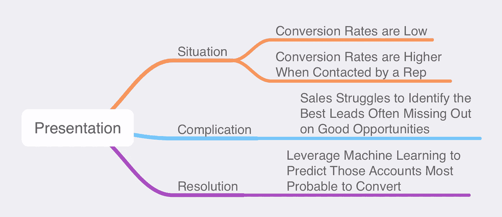
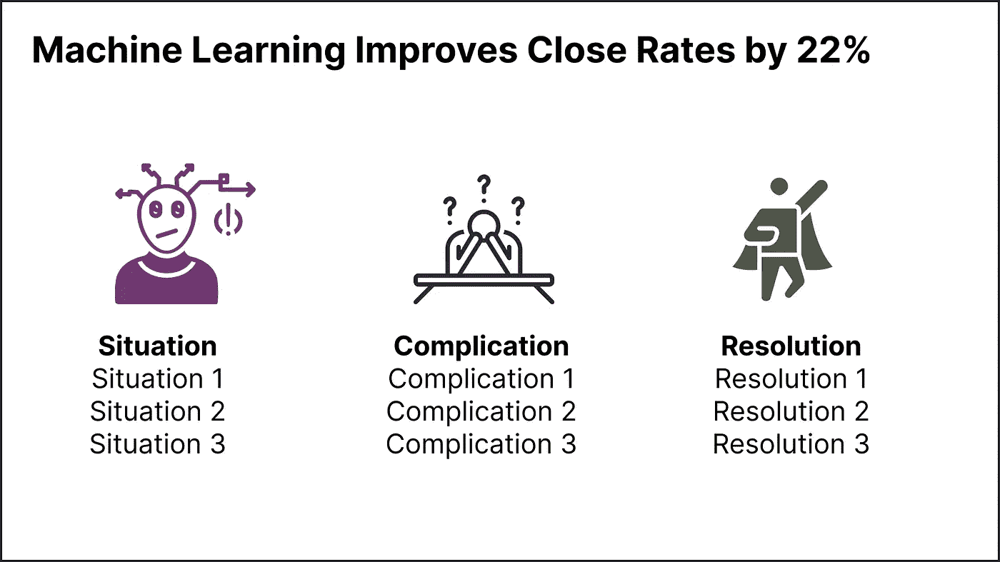
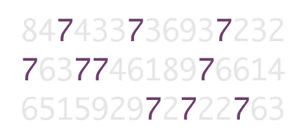

# 为数据科学创建引人注目的演示文稿的 8 个技巧

> 原文：<https://towardsdatascience.com/8-tips-for-creating-a-compelling-presentation-for-data-science-dd48c09683b0>

## 每位分析师和数据科学家都可以学习的技巧，以制作令人信服的演示文稿

宇宙时间旅行者在 [Unsplash](https://unsplash.com?utm_source=medium&utm_medium=referral) 上拍摄的照片

作为数据科学家或分析师，我们花费无数的时间来完善我们分析数据的能力，建立机器学习模型，并跟上最新的技术趋势。然而，每个人都需要的一项技能是创建引人注目的演示文稿的能力。

> *每个数据科学家、分析师和数据工程师都需要擅长构建一个令人信服的演示文稿。*

以下是我 20 多年来收集的向高管、客户和同事展示的技巧和诀窍。这些技巧并不局限于数据科学，任何人在创建演示文稿时都可以使用；让我们快速浏览一下。

1.  从大纲开始
2.  用情境、复杂性和解决方案讲故事
3.  每张幻灯片一分钟的规则
4.  三的法则
5.  将幻灯片标题作为结果写入
6.  大声朗读标题
7.  集中你的观众的注意力
8.  创建引人注目的数据可视化

我们开始吧！

# 从大纲开始

开始演示时，他们通常会打开 PowerPoint、Keynote 或他们选择的工具，并立即开始尝试构建演示文稿。当然，这个问题是，你将在幻灯片上迭代 100 次，很可能最终删除你已经创建的大部分内容。

一个更好的方法是从一个**大纲**开始，和你在英语 101 中所学的没什么不同。但是不要认为这是你想要创建的幻灯片的大纲。把大纲想象成你将要讲述的故事。创建大纲有两种常见的方法。第一种是简单地使用**有序列表**并通过你故事的想法或部分来构建你的大纲(我将在接下来讲述故事的部分)。如果你是一个更加视觉化的人，你可以使用**思维导图**并以类似的方式构建它。

一旦你有了大纲，创建支持内容就变得轻而易举了。

# 用情境、复杂性和解决方案讲故事

一个经典的讲故事框架是[英雄之旅](https://en.wikipedia.org/wiki/Hero%27s_journey)。大意是，一个英雄去旅行，引入一些障碍；最后，英雄可以克服那个障碍，从此每个人都过着幸福的生活。

在我们的业务演示中，我们可以使用一个类似的框架，称为**情境-复杂-解决**或 **SCR** 。我第一次接触到 SCR 是通过芭芭拉·明托的书[金字塔原理](https://www.amazon.com/Pyramid-Principle-Logic-Writing-Thinking/dp/1292372265)，他在麦肯锡咨询公司工作时推广了这个方法。这种结构非常适合创造一个商业故事。这是一个简单的框架，让你在结构中保持有组织，带来面向行动的结果，并符合三原则，我将在后面介绍。

*   **情境**:关于当前状态的事实。
*   **并发症**:根据情况需要采取行动。
*   **解决方案**:采取或建议采取措施解决复杂问题。

使用我们的大纲格式，这里是一个过于简化的 SCR 的例子。在实践中，您将引入更多的细节作为节点的子项。利用 SCR 将帮助你创造一个干净的，引人注目的故事！

作者图片

# 每张幻灯片一分钟的规则

这个简单有效。考虑到每个主要内容幻灯片将花费**一分钟来演示**，而不是创建您的演示并排练时间。如果你有一个 20 分钟的演示，目标是 20 张包含内容的幻灯片。你不应该把分隔线、封面或闭幕标志幻灯片算在内。这些年来我发现，一般来说，有些会花更长时间，有些会更短，但平均来说，他们会花大约一分钟。

消除计算你需要创建多少内容的压力。

# 三的法则

另一个指导原则是三个的**法则。三的规则很简单:**在构建你的结构、你的故事的各个部分或者你幻灯片上的项目符号的数量时，坚持三个并且只有三个项目**。**

[苹果](https://www.inc.com/carmine-gallo/apple-is-obsessed-with-magical-number-3-it-will-transform-your-presentations-too.html)已经在他们的展示和产品线中实现了这一点，而[科学已经向](http://uberconvince.com/2018/01/14/rule-3-trios-makes-copy-memorable-according-science/)表明我们的大脑喜欢模式，而三是形成[模式](https://copyblogger.com/rule-of-three/)所需的最小数字。

利用三法则来组织你的幻灯片将有助于你的观众记住你的内容并简化演示。你可能会想，“越多的信息越好，用四个、六个或八个要点。没有人能完全理解，所以把它缩减到三个最有影响力的信息。

如果你有稍微多一点的信息，另一个技巧是像下面的图片一样三乘三地组织它。

作者图片

# 将幻灯片标题作为结果写入

我经常看到数据科学家写他们的幻灯片标题描述幻灯片上的内容，而不是幻灯片的**结果**或**收获**是什么。这个简单的练习可以让你不费吹灰之力就能极大地改善你的演讲。让我们来看几个例子。

*   *算法训练和验证* vs. **以 92%的准确率预测客户流失**
*   *Q1 交谈率*与**直接联系的客户购买**的可能性高出 5 倍
*   *利用 XGBoost 对客户进行分类*与**机器学习将成交率提高了 22%**

很明显，像这样的例子更能吸引你的观众。记住，你的幻灯片标题是你的幻灯片的**结果**！

# 大声朗读标题

有很多[文章](https://www.techwell.com/2013/10/give-better-presentation-don-t-read-your-slides)会告诉你不要大声朗读你的幻灯片。直接从你的幻灯片上阅读你的内容肯定会让你的观众厌烦并失去他们的注意力。

然而，我对这条规则有一个警告；大声读出你的幻灯片标题。

根据 [Naegle](https://doi.org/10.1371/journal.pcbi.1009554) :

阅读和语言处理使用相同的认知渠道——因此，由于认知超载，观众可以阅读幻灯片，听你说话，或者两者兼而有之(两者都很差)。

通过在开始每张幻灯片时只阅读标题，观众将能够更容易地理解信息，这比边听边读文字要容易得多。虽然一开始可能会觉得不舒服，但你可以和一些同事一起练习一下，然后自己看看！

对于幻灯片的其余部分，请不要阅读内容，尤其是当您使用大量项目符号列表或有序列表时。如上所述，阅读你所有的内容可能会很单调。

# 集中你的观众的注意力

当你的幻灯片上有不止一个单词或数字时(这也是一个非常强大的练习)，你可以利用技巧或属性将观众的注意力集中在最重要的单词上。这些注意力吸引器被称为**前注意属性**。

当你的眼睛和大脑第一次看到幻灯片时，在最初的几分之一秒内，你会被不同的突出元素所吸引。物品可以是**粗体**、**斜体**，或者不同的**颜色**或**尺寸**。它们与正文不同的事实是你如何能集中你的注意力。

这方面的一个很好的例子改编自斯蒂芬·诺的《挖掘视觉的力量》。当我们看第一段文字时，它们都倾向于融合在一起。如果我们问你，“告诉我有多少个数字 7”，这需要一点时间。

作者图片

然而，当你看第二张图时，我们已经接入了**粗体**和**颜色**的预先注意属性，我们可以看到每一个七。

作者图片

这个概念也直接适用于构建数据可视化，我们将在接下来讨论。

# 创建引人注目的数据可视化

仅这一部分就可以保证写一整篇文章(或一本书)来讨论它。好消息是已经有很好的了。我推荐两个你应该马上买的:

1.  [用数据讲故事](https://www.amazon.com/Storytelling-Data-Visualization-Business-Professionals/dp/1119002257)作者**科尔·努斯鲍默·克纳弗里克**
2.  [数据故事](https://www.amazon.com/DataStory-Explain-Inspire-Action-Through/dp/1940858984)作者**南希·杜阿尔特**

这两本书都涵盖了如何建立一个更好的可视化。阅读这些内容，研究它们，并在每次构建视觉效果和演示文稿时参考它们。

# 结论

学习如何令人信服地展示您的数据科学项目结果是您可以学习的最重要的技能之一。我们讨论了如何从大纲开始，利用讲故事的框架来组织你的演讲，一分钟规则和三分钟规则。我们还讨论了如何通过将标题写成结果而不是主题来形成更好的标题。我们讨论了两种吸引观众注意力的方法:演讲时大声朗读你的标题，以及通过粗体和颜色等方法挖掘预先注意的属性。最后，我们讲述了如何创建引人注目的数据可视化。遵循这些作为你下一次演讲的指导方针，我相信你能够创造出一个令人信服的演讲。

如果你喜欢阅读这样的故事，并想支持我成为一名作家，考虑注册成为一名媒体会员。一个月 5 美元，让你可以无限制地访问成千上万篇文章。如果您使用 [*【我的链接】*](https://medium.com/@broepke/membership) *注册，我将为您赚取一小笔佣金，无需额外费用。*