# 使用散景在 Python 中创建数据可视化的 8 个技巧

> 原文：<https://towardsdatascience.com/8-tips-for-creating-data-visualizations-in-python-using-bokeh-d7a01701503d>

## 使用散景库创建数据可视化的快速提示和示例


卢卡斯·布拉塞克在 [Unsplash](https://unsplash.com/?utm_source=unsplash&utm_medium=referral&utm_content=creditCopyText) 上的照片

Python 是一个很好的创建数据可视化的开源工具。有许多可用的数据可视化库，包括 Matplotlib、Seaborn 和 Bokeh。

Bokeh 是一个 Python 数据可视化库，旨在创建 ***交互式*** 图表。虽然可以免费使用，但通常需要大量的时间来学习细节。

下面是我在使用散景创建数据可视化的过程中学到的一些技巧。

*注:所有显示的示例，包括代码和数据集，都可以在* [*这里*](https://payalnpatel.github.io/Bokeh/) *找到。*

## 1-设置图表标题、轴标题和轴标签的格式，以便于阅读

格式良好的标题和标签可以提高图表的可读性和可用性。易于阅读的标题、标签和轴允许用户快速查看和处理可视化。

设计数据可视化时，记住标题和标签的格式很重要，包括字体粗细、字体大小和字体颜色。

例如，下面的条形图按经验级别显示了数据科学专业人员的平均工资。该可视化使用标题和标签的默认值。

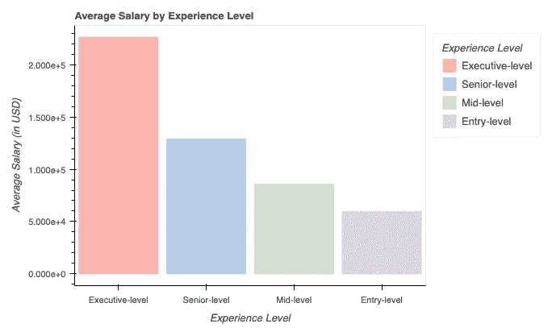

按作者分类的图像:带有默认标题和轴标签的条形图

更改默认设置可以增强数据的可视化。下面是我在用散景格式化图表标题和坐标轴时使用的一些技巧。

*   **粗体图表&轴标题** —粗体标题使其突出。这使得用户更容易快速找到识别信息。
*   **居中图表标题** —默认情况下，图表标题左对齐。将标题居中，用对称元素平衡视觉效果。
*   **增加图表字体&轴标题** —增加标题的字体大小，使其更容易阅读。确保坐标轴标题小于图表标题，这样它们就不会压倒图表。
*   **设置轴范围** —默认情况下，轴不从 0 开始。正如我们在上面的例子中所看到的，这导致条形看起来偏离了 x 轴。要格式化 x 或 y 轴的范围，使用 *Range1d* 功能。
*   **用** **刻度格式化器**修改轴标签——Bokeh 包含几个刻度格式化器，如*numeratickformatter*和*categoricalticktformatter*。这些刻度格式化程序可以更改 x 轴和 y 轴刻度标签的格式。在上面的例子中，*numeratickformatter*可以删除 y 轴的科学记数格式。查看散景文档以查看适用于您的版本的格式化程序。
*   **用自定义标签覆盖轴标签** —当标签包含以千、百万等为单位的大数字时，自定义会有所帮助。使用自定义标签创建别名或简称。例如，如果标签显示值“1，000，000”，自定义标签可以将显示更改为“1M”，以便于阅读。

下图显示了应用这些技术后的条形图。虽然这些变化很细微，但它们提高了图表的可读性和可用性。

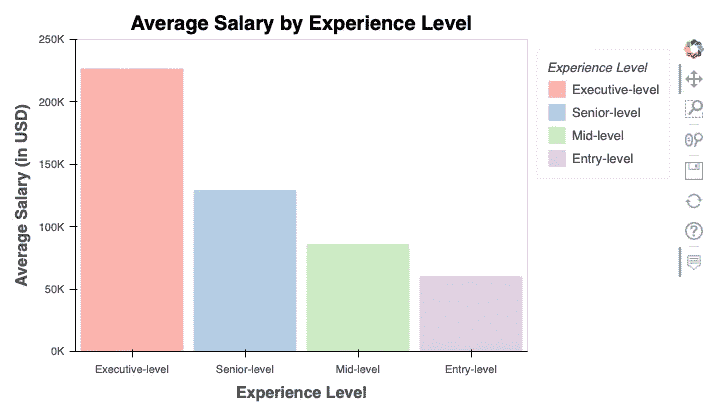

作者图片:修改了标题和标签的条形图

## 2-创建交互式图例

图例为数据可视化提供了有用的上下文，允许用户快速识别相似的数据点—无论是通过颜色、形状还是大小。使用 Python 中的散景库，用户可以创建交互式图例。交互式图例隐藏或隐藏部分数据。当有大量组时，或者如果几个数据点重叠时，交互式图例会很有帮助。

例如，下面的线形图显示了 2013 年至 2019 年因加州野火而被烧毁的总英亩数。这个线图上有 6 个县，有几条重叠的线。

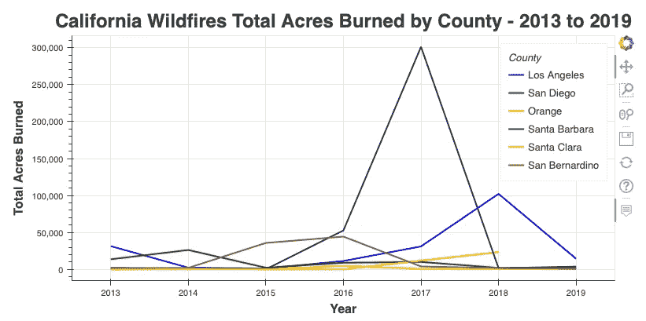

图片作者:加州野火线形图

创建交互式图例允许用户选择要从视图中移除的项目。可以通过将人物的 *click_policy* 设置为“隐藏”或“静音”来“隐藏”或“静音”项目，如下面的命令所示。

```
# Set Legend Click Policy for Figure 'p' 
p.legend.click_policy="mute"
```

我更喜欢将图例中的项目静音，因为静音的项目会显示为灰色，而不是完全从视图中移除。这样，用户可以专注于他们想要的组，同时确保完整的数据集得以呈现。

*注意:如果静音项目，应为绘制的每条线指定 muted_color 和 muted_alpha 字段。查看此可视化的完整代码* [*此处*](https://payalnpatel.github.io/Bokeh/) *。*

在加州野火折线图中， *click_policy* 设置为“静音”，灰色为 *muted_color* ，0.2 为 *muted_alpha* 值。通过从视图中移除特定的县，用户能够更快、更有效地在更小的范围内比较县。例如，如果用户想要比较洛杉矶的野火和圣地亚哥的野火，这将是困难的，因为几条线重叠。在下图中，除了洛杉矶和圣地亚哥之外的所有县都被静音，这样可以更容易地比较这两个县之间的总烧毁英亩数。

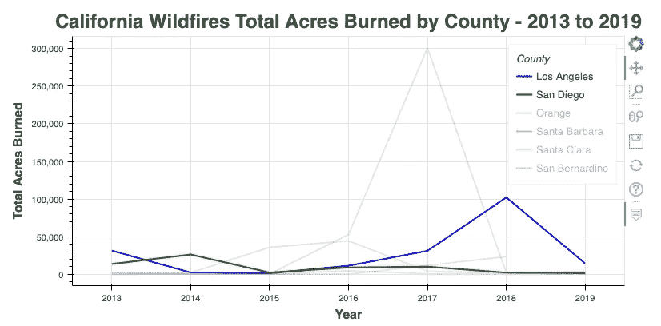

作者图片:加州野火线形图，部分县被屏蔽

交互式图例也可以应用于其他可视化。下面的散点图按种族显示了学生数学和阅读成绩之间的关系。添加交互式图例会有所帮助，因为有几个重叠的数据点。要创建带有交互式图例的散点图，请单独绘制每个组。我们可以看到，通过屏蔽组 A、B 和 C，我们能够轻松地比较组 D 和 E。*点击* *查看此数据可视化* [*的完整代码。*](https://payalnpatel.github.io/Bokeh/)

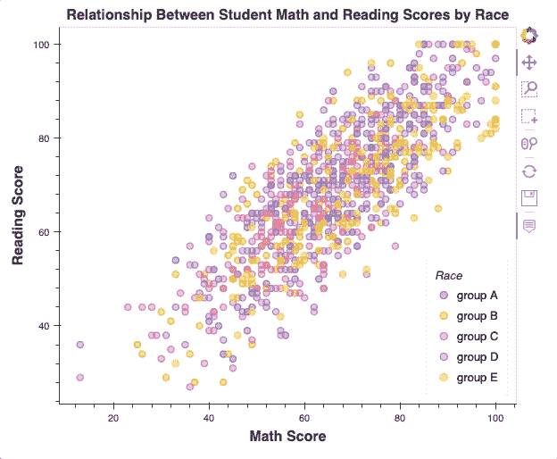

作者图片:带有交互式图例的散点图

## 3-通过将图例放置在图形外部来最大化空间

在 Python 中，许多数据可视化(如折线图、散点图和条形图)允许您使用简单的命令添加图例。用户通常会保留图例的默认位置，或者将图例移动到包含可视化的图内的某个地方*，例如左上角或右上角。虽然在大多数情况下这是好的，但也有图例覆盖可视化关键区域的情况。在下面的*按国家划分的巧克力平均等级*条形图中，默认图例位置包括比利时和英国，因此很难确定两者孰高孰低。*

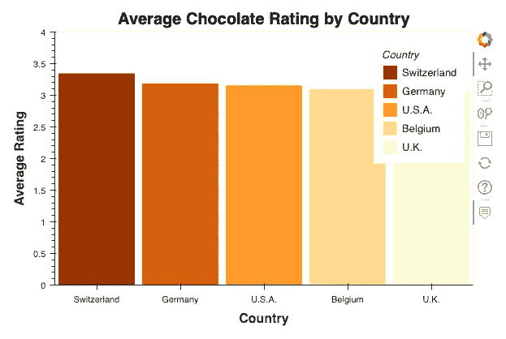

按作者分类的图像:带有默认图例位置的条形图

如果可视化有几个数据点，或者如果向可视化添加图例会导致覆盖关键信息，请将可视化放置在图形的一侧。

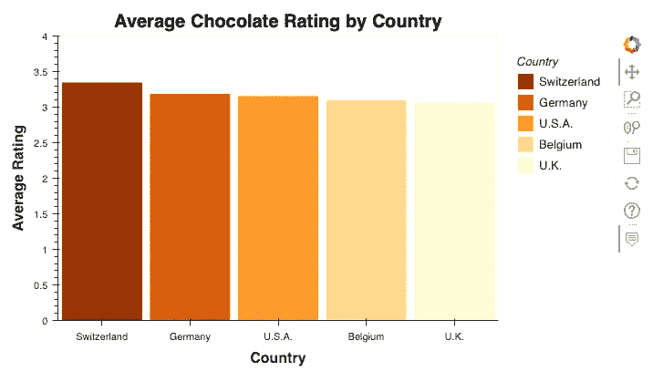

作者图片:图例位于图右侧的条形图

通过将图例移出框架，我们能够完整地看到可视化效果，同时将图例作为有用的参考。

要在图形 p 的右侧添加图例，请使用以下命令。

```
p.add_layout(Legend(), ‘right’)
```

*注意:要使用散景中的图例功能，请导入以下功能。查看此可视化的完整代码* [*此处*](https://payalnpatel.github.io/Bokeh/) *。*

```
from bokeh.models import Legend
from bokeh.models import Range1d
```

## 4-添加工具提示

工具提示，通常称为悬停文本，是当您将光标移动到可视化效果或可视化效果的部分上时出现的文本。使用工具提示与查看者共享其他信息。Bokeh 库允许将工具提示添加到几种可视化类型中，包括条形图、折线图和散点图。

要向可视化添加工具提示，请导入*悬停工具*功能，如下所示。

```
from bokeh.models.tools import HoverTool
```

以下面的条形图为例，*按国家列出的巧克力平均等级*。此图表中的工具提示显示光标悬停在其上的国家的*国家名称*和*平均等级*。

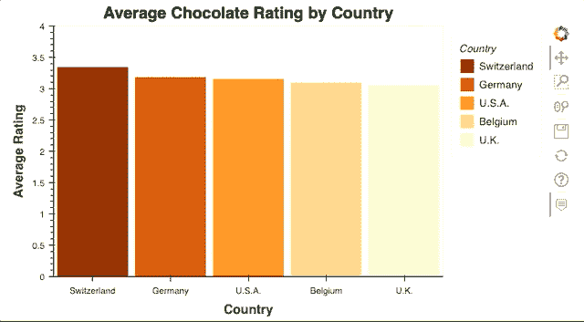

作者图像:启用工具提示的条形图

类似于设置图表标题和标签的格式，您还需要记住如何在工具提示中设置文本的样式！

在下面的条形图*按经验水平平均工资*中，工具提示包含了关于*经验水平*和*平均工资*的信息，单位为美元。

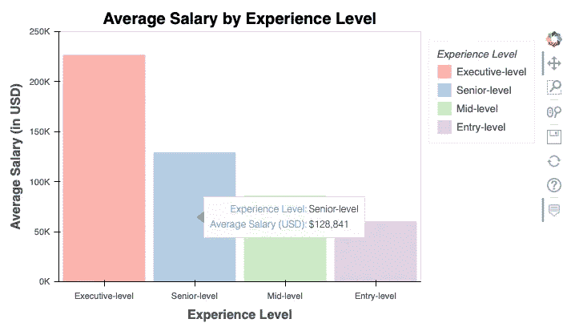

作者图像:启用工具提示的条形图

默认情况下*平均工资*文本不自动格式化为货币；然而，经过几处修改，我们可以将文本格式化为包含美元符号和逗号。创建数据可视化以格式化工具提示时，添加了以下代码行。*查看本可视化完整代码* [*此处为*](https://payalnpatel.github.io/Bokeh/) *。*

```
# Add hover text 
p.add_tools(HoverTool(tooltips=[(“Experience Level”, “@types”), 
 (“Average Salary (USD)”, “$@values{0,0}”)]))
```

工具提示还可以包含 x 轴和 y 轴以外的信息。以下散点图按性别显示了学生的数学和阅读成绩。本示例中的工具提示显示了每个学生的性别、数学分数和阅读分数。

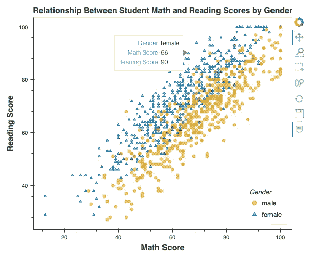

作者图像:启用工具提示的散点图

## 5-使用选项卡组织数据可视化

使用 Bokeh，可以使用选项卡显示数据可视化。与仪表板类似，每个选项卡都由自己的内容组成。选项卡显示彼此相关的多个可视化效果，无需生成仪表板，也无需在 Jupyter 笔记本中滚动多个图像。它们对于显示同一图形的不同视图也很有用。

下图显示了如何使用选项卡来显示散点图的变体。第一个散点图按性别显示学生的数学和阅读成绩，第二个散点图按种族显示学生的数学和阅读成绩。

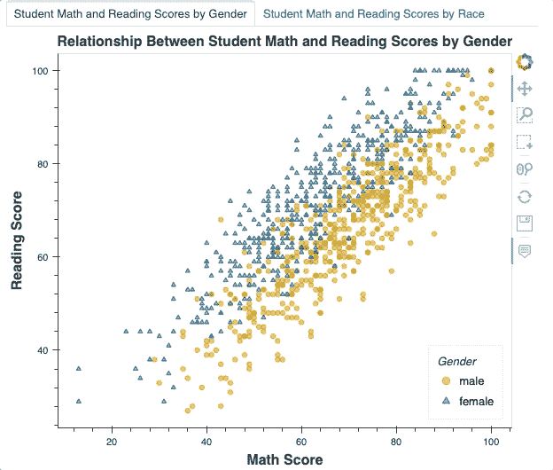

作者图像:Bokeh 示例中的 tab 对象

要创建带有标签的对象，使用以下命令导入*标签*和*面板*小部件。

```
 from bokeh.models.widgets import Tabs, Panel
```

一旦创建了图形，就可以将它们添加到选项卡式对象中。以下代码片段显示了如何创建学生成绩散点图的选项卡式对象。*在这里* *查看这个可视化* [*的完整代码。*](https://payalnpatel.github.io/Bokeh/)

```
# Create tab panel for scatterplot visualizations

# Create the two panels 
tab1 = Panel(child = p, title = 'Student Math and Reading Scores by Gender')
tab2 = Panel(child = r, title = 'Student Math and Reading Scores by Race')

# Add the tabs into a Tabs object
tabs_object = Tabs(tabs = [tab1, tab2])

# Output the plot
show(tabs_object)
```

虽然上面的例子显示了每个选项卡一个可视化，但是可以为每个选项卡添加多个可视化——只要记住布局和整体流程就行了！

## 6-删除网格线

默认情况下，网格线出现在使用散景创建的数据可视化效果上。通过从可视化中移除网格线来减少视觉混乱。这使得用户更容易查看和解释手头的数据。

查看下面的*按经验级别划分的平均工资*条形图，我们会看到自动添加的网格线。

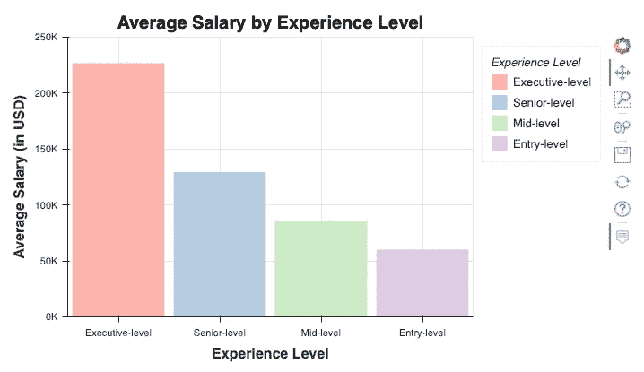

按作者分类的图像:带有默认网格线的条形图

通过删除网格线，可视化效果变得不那么杂乱，如下图所示。

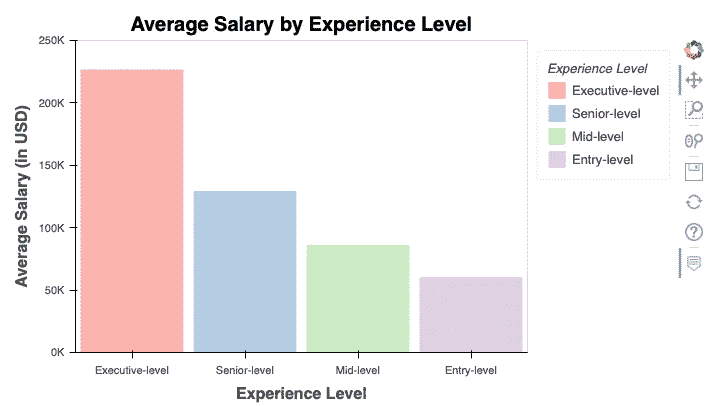

按作者分类的图像:移除网格线的条形图

在散景中，移除网格线是一个快速的过程，可以通过将 *grid_line_color* 设置为“无”来完成。*点击* *查看此可视化* [*的完整代码。*](https://payalnpatel.github.io/Bokeh/)

```
p.xgrid.grid_line_color = None
p.ygrid.grid_line_color = None
```

## 7-使用预定义的颜色和调色板

颜色是任何数据可视化的关键部分，决定使用正确的颜色需要时间。散景库附带了几种预定义的颜色和调色板。

可用的调色板可能因您使用的散景版本而异。要查看单个颜色名称的列表，请点击查看[散景文档。](https://docs.bokeh.org/en/2.4.2/docs/reference/colors.html)

要查看特定版本的可用调色板，请查看[散景官方文档](https://docs.bokeh.org/en/2.4.3/docs/reference/palettes.html)，或运行以下命令。此命令根据运行的散景版本列出可用的调色板。

```
bokeh.palettes.all_palettes.keys()
```

散景调色板由不同的大小组成。要查看调色板中可用的特定十六进制颜色以及可用的不同大小，请使用以下命令。该命令列出了' *Set3* '调色板的可用尺寸，包括十六进制颜色。

```
bokeh.palettes.all_palettes[‘Set3’]
```

要导入特定大小的调色板，请运行以下命令。该命令导入尺寸 3 *设置 3* 调色板。

```
from bokeh.palettes import Set3_3
```

或者，通过指定调色板名称来导入调色板中的所有尺寸。以下示例显示了如何为 *Cividis* 调色板导入所有尺寸。

```
from bokeh.palettes import cividis
```

可能很难解释十六进制颜色。要快速查看这些十六进制颜色，您可以使用如下函数。

```
from IPython.display import Markdown, display

def printColorPalette(color_palette):
 display(Markdown(‘<br>’.join(
 f’<span style=”color: {color}; font-family: courier;”><span>{color}: </span>&#9608;&#9608;&#9608;&#9608;&#9608;&#9608;&#9608;</span>’
 for color in color_palette
 )))
```

这个函数获取一个十六进制数的列表，并打印出十六进制数和相应的颜色块。下图显示了各种尺寸的 *Cividis* 、 *Set3* 和*光谱*调色板的输出。

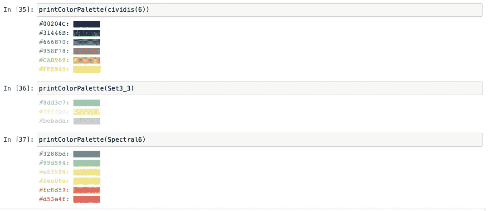

作者图片:使用函数打印各种调色板

*更多示例* v *查看完整代码* [*此处*](https://payalnpatel.github.io/Bokeh/) *。*

## 8-直接在 Jupyter 笔记本中显示可视化效果

在 Jupyter Notebook 中创建散景可视化效果时，默认设置会在新网页中显示输出。直接在笔记本中显示可视化效果，以便快速排除故障和开发可视化效果。

要在 Jupyter Notebook 中显示散景数据可视化，请导入以下函数。

```
from bokeh.io import output_notebook, show
from bokeh.resources import INLINE
```

在开发任何可视化之前，调用 Bokeh 的`[**output_notebook()**](https://docs.bokeh.org/en/latest/docs/reference/io.html#bokeh.io.output_notebook)`函数，如下所示。

```
output_notebook(resources=INLINE)
```

一旦设置了可视化的输出，使用 *show()* 功能为每个数据可视化显示笔记本中的输出。

例如，下图显示了如何调用函数 *show()* 来显示 Jupyter 笔记本中的散点图 *p* 。

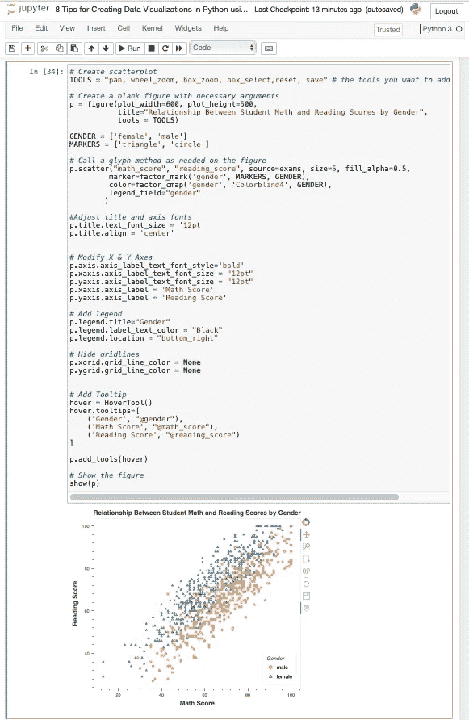

作者图片:Jupyter 笔记本中显示的数据可视化

直接在笔记本中显示可视化效果有助于将可视化效果保存在一个文档中。这使得稍后引用可视化变得容易，而不必重新运行整个笔记本。

这是一些用散景增强数据可视化的方法！所有的例子，包括代码和数据集，都可以在[这里](https://payalnpatel.github.io/Bokeh/)找到。

Payal 是 IBM 的一名数据科学家。在业余时间，她喜欢阅读、旅游和写作。如果你喜欢她的作品， [*关注或订阅*](/@payal-patel) *她的列表，不要错过一个故事！*

*以上文章是个人观点，不代表 IBM 的立场、策略或观点。*

**参考文献**

[1]: Larxel。"巧克力分级"*卡格尔*，[https://www.kaggle.com/datasets/andrewmvd/chocolate-ratings](https://www.kaggle.com/datasets/andrewmvd/chocolate-ratings)2022 年 12 月 8 日访问。(CC0:公共领域许可证)

[2]:沙哈内，绍拉布。"数据科学工作薪水数据集." *Kaggle* ，[www . ka ggle . com/datasets/saurabhshahane/data-science-jobs-salary](https://www.kaggle.com/datasets/saurabhshahane/data-science-jobs-salaries)2022 年 12 月 8 日访问。(CC0:公共领域许可证)

【3】:阿瑞斯。"加州野火(2013 年至 2020 年)." *Kaggle* ，[https://www . ka ggle . com/datasets/ananthu 017/California-wild fire-incidents-2013 2020](https://www.kaggle.com/datasets/ananthu017/california-wildfire-incidents-20132020)2022 年 12 月 8 日访问。(CC0:公共领域许可证)

[4]:肖汉，阿满。"学生在考试中的表现." *Kaggle* ，[https://www . ka ggle . com/datasets/whenamancodes/students-performance-in-examings](https://www.kaggle.com/datasets/whenamancodes/students-performance-in-exams)2022 年 12 月 8 日访问。(CC0:公共领域许可证)