# 为视觉相似性建立强大的深度学习模型的 8 个技巧

> 原文：<https://towardsdatascience.com/8-tips-to-build-powerful-deep-learning-models-for-visual-similarity-738eb6f69275>

## 3 个月浓缩的一般最佳实践，使您的暹罗网络表现良好，并产生高质量的嵌入

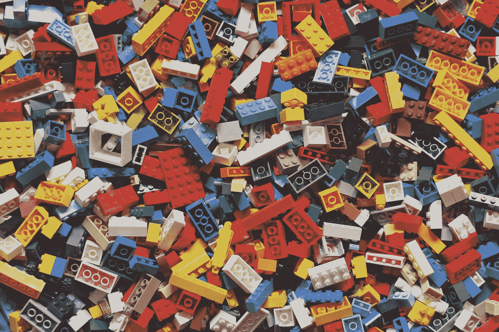

哈维·卡夫雷拉在 [Unsplash](https://unsplash.com?utm_source=medium&utm_medium=referral) 上的照片

答不久前，我参加了前公司举办的数据科学挑战赛。目的是帮助海洋研究人员更好地根据鲸鱼的吸虫外观来识别鲸鱼。

更具体地说，我们被要求为测试集的每个图像预测来自完整数据库(训练+测试)的前 20 个最相似的图像。

这不是一个标准的分类任务。

我花了 3 个月的时间做原型，最终在最终(私人)排行榜的 300 名参与者中名列第三。

*对于这个故事，宙斯是我家的 GPU 驱动的服务器。没错，它有名字。*

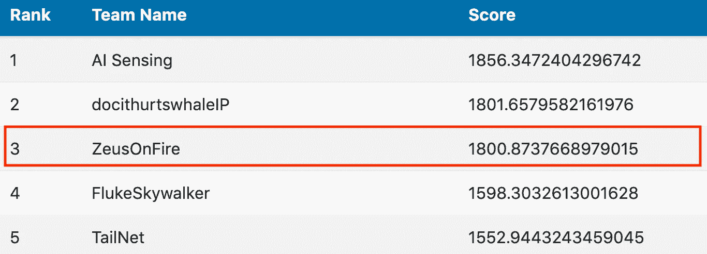

决赛(私人)排行榜

但是让我们不要进入这个挑战的细节。

> *这篇帖子的目的是和大家分享* ***我的关于构建视觉相似性任务强嵌入模型的小技巧*** *。这次挑战是一次极好的学习机会，我尝试了许多不同的技术。因此，我将在这里与大家分享什么是最有效的，什么是无效的，我将详细说明我在这个过程中采取的不同步骤。*

事不宜迟，让我们来看看🔍

*PS:以下实验的代码在我的 Github*[*repo*](https://github.com/ahmedbesbes/whales-classification)*上。*

# 1 —将问题形式化，选择正确的损失？

我首先问自己的潜在问题是:**我如何构建一个可以有效嵌入其特征并用于相似性任务的鲸鱼爪的数字表示？**

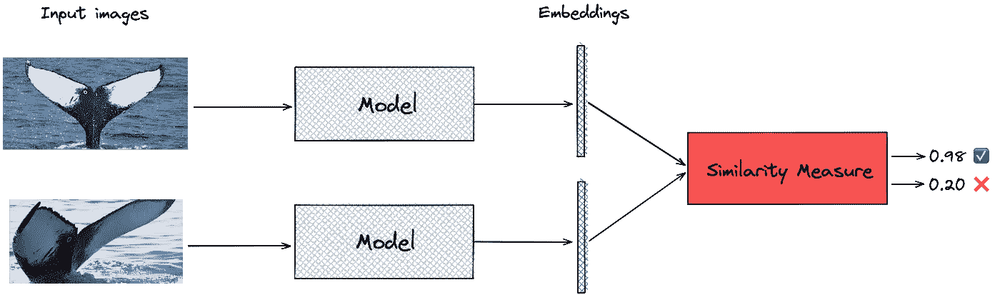

我们的目标是构建一个模型，生成输入图像的“良好”表示:作者的一张鲸鱼的图片

## 第一种方法:分类

我最初采用的天真方法是训练一个卷积神经网络(CNN ),使用标准的 softmax 交叉熵损失对图像的标签集(鲸鱼 id)进行分类，然后将最后一个完全连接的层的输出作为嵌入。**不幸的是，训练网络来优化交叉熵并不能产生良好的相似性嵌入向量。** 在这个问题中效率不是很高的原因是交叉熵只学习如何将图像映射到标签，而不学习输入之间的相对距离(或相似度)。

**当你需要嵌入视觉相似性任务时，你的网络应该在训练时明确地学习如何在彼此之间比较和排列项目。**如果你想了解更多，我推荐这篇[帖子](https://omoindrot.github.io/triplet-loss)。

## 从分类到度量学习

学习相互比较和排列输入的有效嵌入的任务被称为 [**度量学习**](http://researchers.lille.inria.fr/abellet/talks/metric_learning_tutorial_CIL.pdf) **。** 这是一个经过充分研究的课题，已经应用于人脸识别或图像检索等热门应用中。
我不会在这篇文章中讨论什么是度量学习。有很好的教程解释的很好[这里](https://gombru.github.io/2019/04/03/ranking_loss/)和[这里](https://omoindrot.github.io/triplet-loss)。

我将介绍我在这次挑战中试验的两个损失函数。

*   三重损失
*   弧面损失

## 1.三重损失

2015 年，谷歌在 FaceNet [论文](https://arxiv.org/pdf/1503.03832.pdf)中介绍了三重态损失。
作者通过设计一个系统来探索人脸嵌入的新技术，该系统学习从人脸图像到紧致欧氏空间的映射，其中距离直接对应于人脸相似性的度量。
提出的方法**优化了嵌入本身**，而不是没有明确解决问题的中间损失。

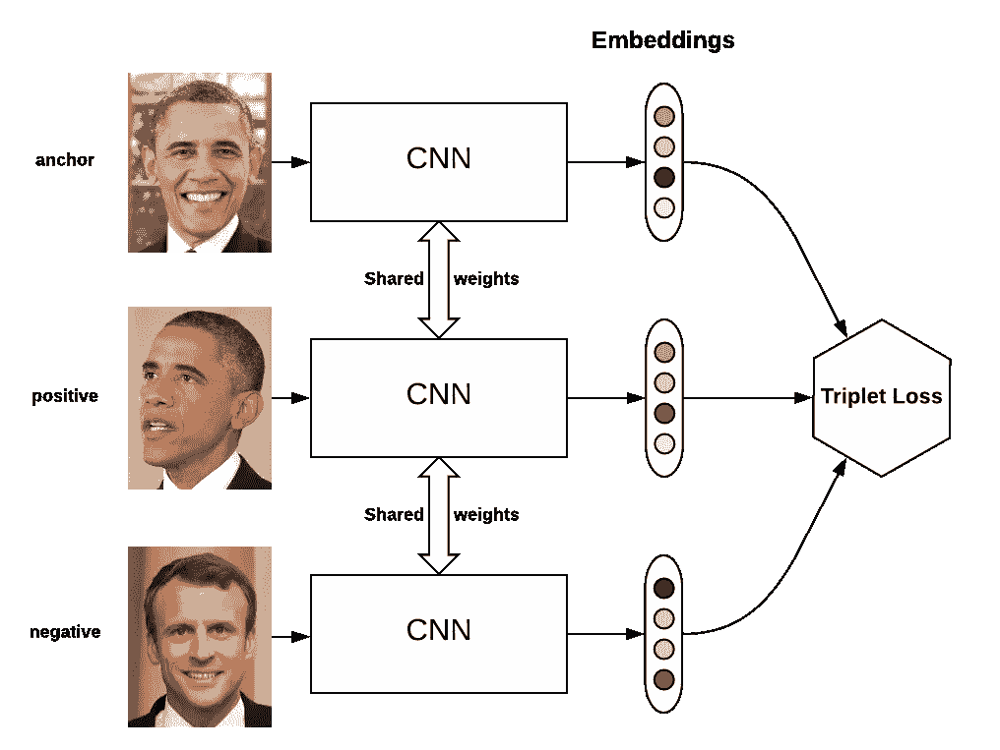

来源:[https://omoindrot.github.io/triplet-loss](https://omoindrot.github.io/triplet-loss)

这种损失由三组数据定义:

*   代表引用的**锚图像**
*   与主播同级的**正面形象**
*   不同类别的**负像**

并且以这样的方式优化模型的权重:

*   锚的嵌入和正图像的嵌入之间的欧几里德距离，即 d(a，p)很低
*   锚的嵌入和负像的嵌入之间的欧几里德距离，即 d(a，n)很高

三重态损失可以形式化为:

> ***L = max(d(a，p) — d(a，n) + margin，0)***

根据定义，这种损失的下限为 0。所以优化网络会尽可能把它推向 0。培训完成后:

*   d(a，p)变得很小~0
*   d(a，n)大于 d(a，p) +余量

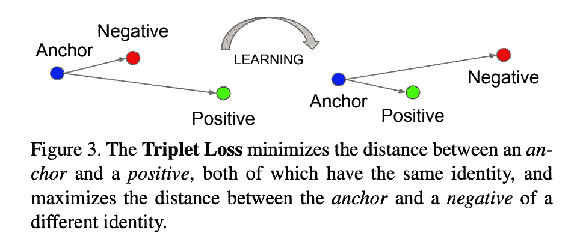

我用了一些训练技巧来提高三连音缺失训练:

*   **硬采样**:我使用硬三连音只是为了优化损失。
    一个硬三元组(A，p，n)满足这个不等式:d(a，n) < d(a，p)
*   **PK 采样**:我在我的 PyTorch 数据加载器中使用了一个采样器来确保每一批都是 PK 大小的，由 P 个不同的类组成，每个类有 K 个图像。
*   **在线生成**三胞胎

你可以在我的 Github [repo](https://github.com/ahmedbesbes/whales-classification/tree/master) 上找到这些技巧的实现细节，如果你想了解更多这些技术，我推荐你阅读这篇[论文](https://arxiv.org/pdf/1703.07737.pdf)。

## 2.弧形面

我在挑战结束前三周遇到了这种失败，在我尝试的那一刻，我就被它的有效性震惊了。

ArcFace loss 已于 2019 年(CVPR)推出，其主要目标是通过学习用于人脸识别的高区分度特征来最大化人脸类别的可分性。根据该论文的作者，该方法在最常见的人脸识别基准上优于三重损失、内损失和间损失。

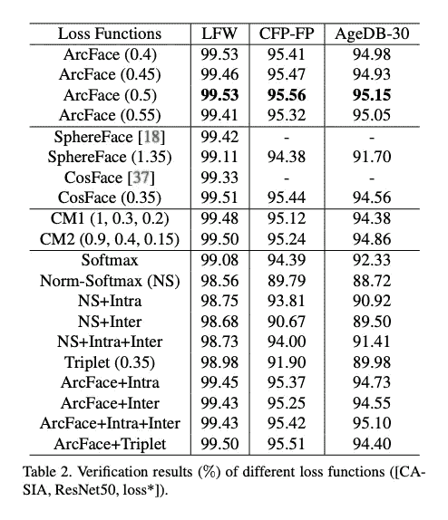

来源:ArcFace [论文](https://arxiv.org/pdf/1801.07698.pdf)

当给定从网络中提取的特征向量和相应的地面真实值(在本例中为鲸鱼 id)时，arcface 会学习一个权重矩阵来将计算映射到一个新的空间，在该空间中计算特征和目标之间的角度。因此，这个空间有一个几何解释。
然后给这个角度增加一个余量，回复到原来的空间，应用交叉熵 softmax loss。这种损失的主要好处是过渡到一个新的空间，在那里分离性被最大化。尽管如此，ArcFace 与 softmax 交叉熵损失并无不同，因此训练开销很小。

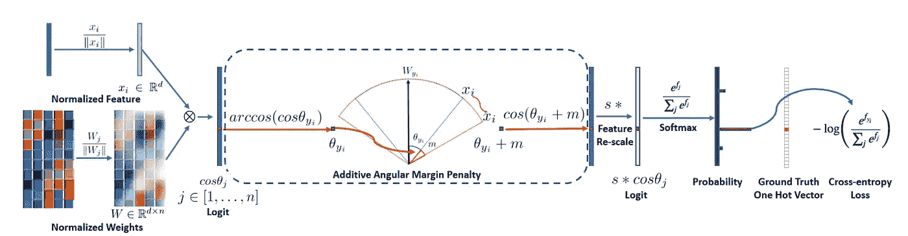

来源:ArcFace [论文](https://arxiv.org/pdf/1801.07698.pdf)

当我用 ArcFace 做实验时，我注意到三重态损失的一些好处:

*   ArcFace 可以很好地适应大量的类
*   它减轻了在训练三重损失时遇到的硬样本挖掘的问题(因为它不需要一个)。它需要的只是数据和相应的标签。
*   它提供了一个很好的几何解释
*   它提供了稳定的训练
*   它收敛得更快
*   最重要的是，用这种损失训练的单个模型比用三重损失训练的五个模型的混合模型表现得更好。

这就是为什么我在最终提交的作品中使用了它。

ArcFace 是我的解决方案的基石。现在，让我们来看看帮助我有效设置培训的不同步骤。

# 2-成为数据🗂的一员

这是不言而喻的，但我还是要说:花尽可能多的时间检查你的数据。无论你是在计算机视觉还是 NLP 领域工作，**深度学习模型，就像任何其他模型一样，都是垃圾进垃圾出**。不管它有多少深层。如果你给它提供质量差的数据，你就不要指望有好的结果。

我对这个挑战的数据做了几件事(这个过程显然适用于度量学习任务中的任何数据集):

*   我去掉了那些分辨率很低或者根本看不到鲸爪的嘈杂和混乱的图像
*   我丢弃了只有一个图像的类:这被证明是非常有效的。这背后的原因是度量学习任务需要一点关于每个类的上下文:每个类一个图像显然是不够的。
*   我提取了鲸鱼尾巴的包围盒，以便丢弃任何周围的噪音(水溅声、海浪声)并放大相关信息。这后来作为一个**注意机制**。
    为了做到这一点，我在 makesense.ai 上标注了大约 300 头福禄克鲸后，从头开始训练了 Yolo-V3 福禄克探测器，make sense . ai 是由 [Piotr Skalski](https://medium.com/u/11b65705ec0?source=post_page-----738eb6f69275--------------------------------) 构建的图像标记工具。
    我还用这个优秀的 [repo](https://github.com/ultralytics/yolov3) 训练了 Yolo-V3 模型。

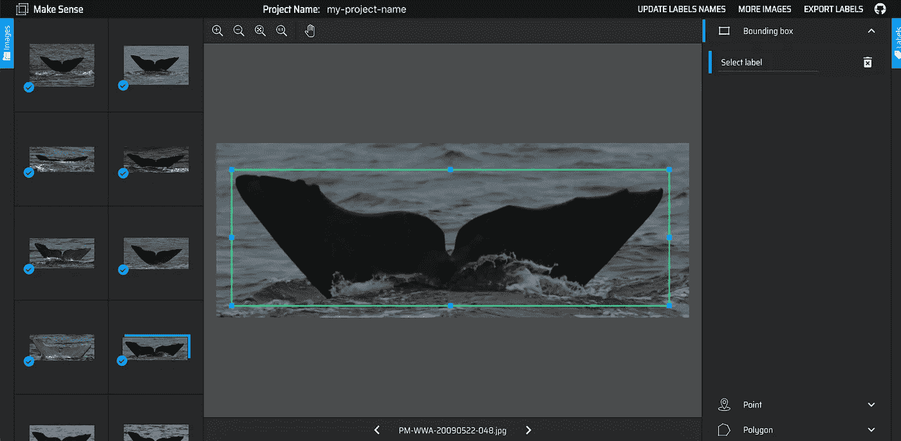

作者截图

**按键学习**👨‍🏫 **:** 与复杂的建模相比，适当清理数据可能会让你赢得更多分数。

# 3 —不要低估迁移学习的力量🔄

在比赛的前几周，我使用了 ImageNet 预训练模型(renset34、densenet121 等。)作为骨干。还好，我的模型在一段时间后收敛了。

然后我调查了 Kaggle 座头鲸识别[比赛](https://www.kaggle.com/c/humpback-whale-identification)数据。

*   尽管有排行榜指标，但这场比赛与我们的挑战非常相似
*   这些数据和我们的结构一样，有着同样的阶级不平衡问题
*   这些吸虫和我们的竞争对手看起来不太一样。他们来自另一个物种——但这没什么。

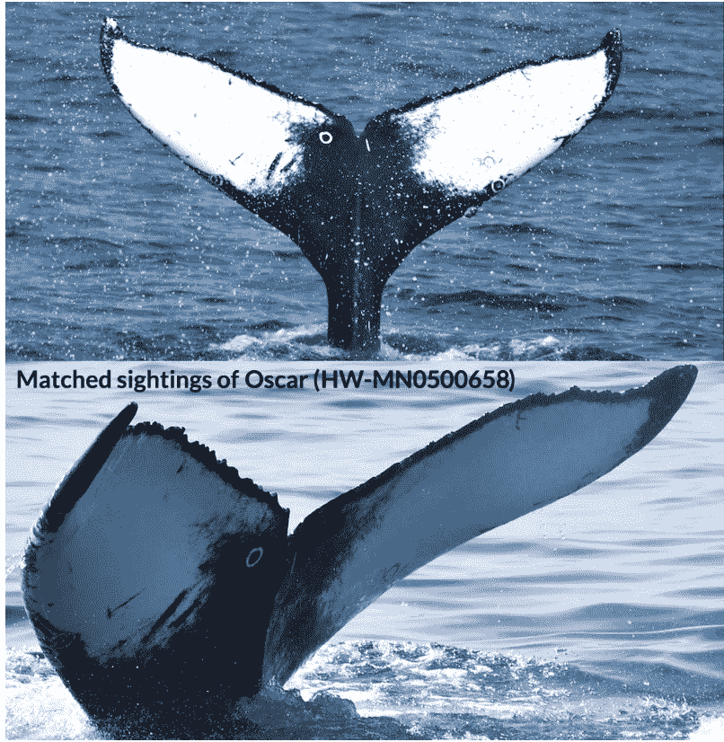

卡格尔鲸的侥幸——来源:[卡格尔](https://www.kaggle.com/c/humpback-whale-identification)

我立即决定使用三重损失对 ImageNet 预训练模型进行微调。

事情的发展很有趣:

*   这产生了巨大的影响！我在排行榜上跳了起来
*   网络能够更快地聚合(在 30%的时间内)

**主要收获**👨‍🏫 **:**

*   迁移学习很少会有伤害。如果你从预先训练了 1000 个普通物体(动物、汽车等)的 ImageNet 模型开始。)，更有可能的是，在你的类似数据集上的预训练网络更好。
*   迁移学习是一种间接的方式，可以给你的培训带来更多的数据

# 4-输入形状非常重要📏📐 🔍

关于这项挑战的数据，有一个重要的细节值得一提:它的**高分辨率**。由于专业设备，部分图像达到 3000x1200 像素甚至更高。

当我开始比赛时，我将我的网络的输入大小设置为 224x224 像素，就像我在大多数图像分类问题中通常做的那样。

然而，当我开始改变输入大小时，我的性能得到了提升。480x480 是最适合我的输入图形。

**主要学习内容**👨‍🏫 **:**

*   如果您正在处理高分辨率图像，请尝试增加网络的输入大小。ImageNet 推荐的默认 224x224 输入形状并不总是最佳选择。**有了更大的输入形状，你的网络可以学习具体的小细节**来区分不同的鲸鱼。
*   **越大不一定越好**。如果您将输入形状增加到 1000 像素左右，您很可能会遇到以下两个问题:

1.  慢速训练:随着输入形状的增加，你的网络有更多的参数，这显然需要更多的计算能力，并且由于过度拟合也不能保证收敛。
2.  小图像性能差:当微小图像被上采样到 1000x1000px 分辨率时，原始信号被破坏。

# 5 —复杂的架构不一定是最佳选择🤹

如果你对计算机视觉生态系统有点熟悉，你可能听说过一些流行的架构，如 VGG 或 ResNet，或者不太可能听说过最近的复杂架构，如 ResNet-Inception-V4 或 NASNet。

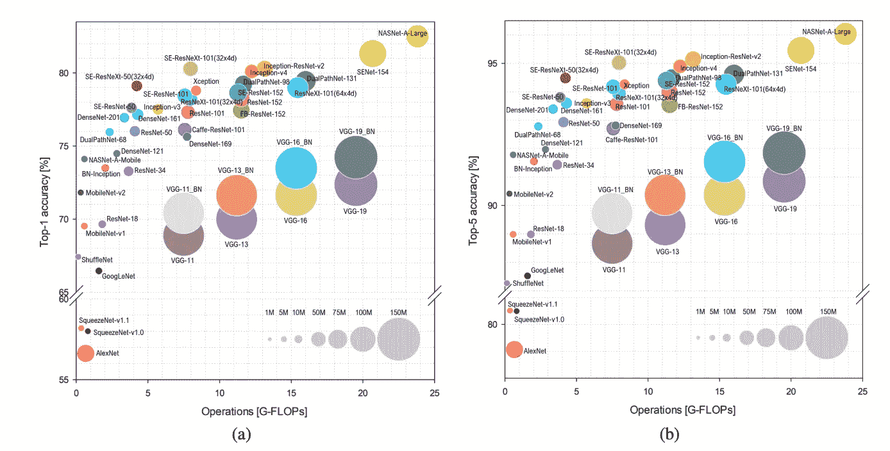

代表性深度神经网络架构的基准分析:[论文](https://arxiv.org/pdf/1810.00736.pdf)

以下是**项重要学习**👨‍🏫经过三个月的实验，我终于明白了:

*   大而深的最先进的主干并不总是最佳的选择:如果你的数据集很小(就像这次挑战中的那个)，它们很快就会过度适应，如果你的计算资源很少，你就无法训练它们
*   好的方法是从简单的网络开始，逐步增加复杂性，同时监控验证数据集的性能
*   如果您计划在 web 应用程序中发布您的解决方案，您必须考虑模型大小、内存消耗、推理时间等。

# 6 —设计稳健的管道⚙

我制定的培训计划包括 5 个主要步骤:

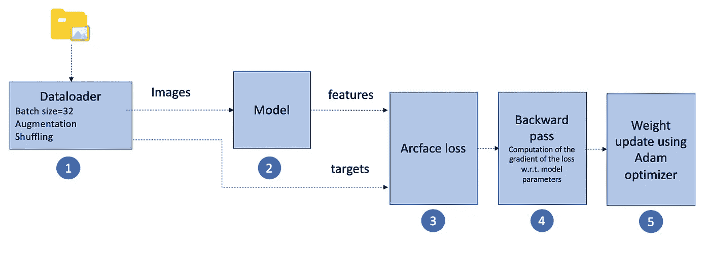

培训管道—来源:我的 Github [回购](https://github.com/ahmedbesbes/whales-classification)

*   **第一步:**dataloder 连接到数据库，批量向网络提供图像和相应的标签。它还负责在不同时期之间调整数据，并应用动态数据增强。
    **重度增强**已作为正则化效果应用于更好的泛化。变换包括:高斯噪声和模糊、运动模糊、随机雨(模拟飞溅效果)、颜色偏移、亮度、色调和饱和度的随机变化、锐化、透视的随机变化、弹性变换、随机旋转、仿射变换(平移和剪切)和随机遮挡(增加概括能力)
*   **第二步:**向前传球。该模型将图像作为输入并生成特征。
*   **步骤 3** :计算特征和目标之间的弧面损失
*   **第四步:**反向传播。计算损耗 w.r.t .模型参数的梯度
*   **步骤 5:**Adam 优化器使用损失的梯度更新权重。该操作在每个批次上执行。

# 7 —顶级教练的一般训练技巧👨‍🏫

在这次比赛中，我做了很多实验。以下是我列出的让训练安全、可重复、稳健的建议。

*   固定种子以确保**再现性**。您很可能必须在脚本的开头编写这几行代码

更多详情[此处](https://pytorch.org/docs/stable/notes/randomness.html)。

*   亚当是一个安全的优化器。但是，您不应该忘记**将重量衰减设置为非零值**。这起到了规则化的作用，防止了损耗波动。使用值:1e-3
*   大幅增强确实提高了结果。我从简单的旋转和平移开始，但是当我添加上面提到的转换时，我得到了更好的结果。扩充缓解了数据缺乏的问题，提高了模型的稳定性和泛化能力。为了建立一个有效的增强管道，我强烈推荐[白蛋白](https://github.com/albumentations-team/albumentations)库。
*   使用学习率计划程序来降低整个培训过程中的学习率。这防止损失停留在局部最小值。
    我最终选择的是一个**预热调度程序，后面是余弦退火**。
    它基本上从一个小的学习速率开始，在几个时期内达到目标值(开始学习速率)(这被称为预热阶段),然后按照余弦退火法降低学习速率，直到结束学习速率。
    预热阶段起到了调整作用，以防止早期过度拟合。

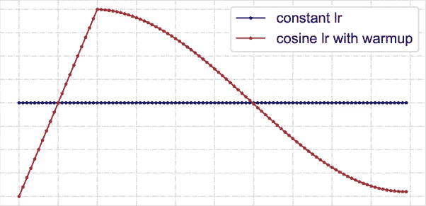

来源:researchgate.ne

*   在每个时期结束时监控损失值和其他指标。我用 Tensorbaord 画的。
*   伪标签可以给你一个优势:这种技术常用于 Kaggle 比赛。它包括根据您的训练数据训练一个模型，使用它对测试数据进行预测，获得最有信心的预测(> 0.9 的概率)，将它们添加到原始训练数据中，然后再次重新训练。
*   确保你有合适的硬件。我可以使用一台 11Gb GPU 内存和 64GB RAM 的 GPU 服务器。在软件方面，我使用的是带有 PyTorch 1.1.0 和 torchvision 0.3.0 的 conda 虚拟环境。
    在 480px 分辨率的图像上用 ArcFace loss 训练 Densenet121 主干每个历元大约需要 1 分钟。收敛大约是 90 个纪元。
*   通过记录您的模型来记录您的体验，并在培训结束时或培训期间保存它们。你会在我的 Github [repo](https://github.com/ahmedbesbes/whales-classification) 中发现这是如何做到的。

# 8-分而治之:将多个模型组合成一个最终提交⚡

我使用之前的管道和以下参数训练了两个模型:

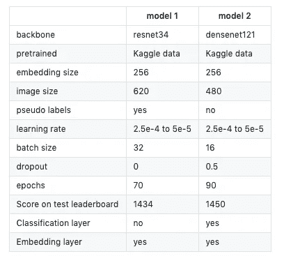

Github [回购](https://github.com/ahmedbesbes/whales-classification)

让我在最终得分中占据优势的是我将它们组合在一起的方式。这是一个简单的**元嵌入技术**，在自然语言处理中非常常用。

它包括在所有样本上生成每个模型的嵌入，然后连接它们。

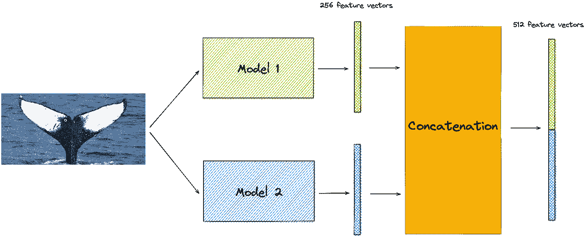

元嵌入模型——作者的图像

该方法用于生成训练和测试数据集的元嵌入。然后，使用相同的计算来生成提交。

**按键学习**👨‍🏫：

*   当基础模型在主干架构(resnet34 与 densenet121)、图像输入大小(480 与 620)、正则化方案(丢失与不丢失)方面不同时，元嵌入级联技术提供了有趣的嵌入
*   每个单独的基础模型“看到”不同的东西:组合它们的嵌入产生一个新的混合模型，具有增强的表示能力。

# 最后的话🙏

我要感谢整个 GDSC 团队，感谢他们把这次挑战变成了一次很好的学习机会，感谢 Lisa Steiner 给了我们把知识应用到新领域的机会。

我希望你能在这里找到可以在其他计算机视觉和深度学习项目中使用的资源。

# 参考📜

*   **face net**:【https://arxiv.org/pdf/1503.03832.pdf】T4
*   **为三重失认人辩护:**[https://arxiv.org/pdf/1703.07737.pdf](https://arxiv.org/pdf/1703.07737.pdf)
*   **排名损失、对比损失、差额损失、三联损失、铰链损失:**https://gombru.github.io/2019/04/03/ranking_loss/
*   **三重缺失:**[https://omoindrot.github.io/triplet-loss](https://omoindrot.github.io/triplet-loss)
*   **ArcFace 论文:**[https://arxiv.org/pdf/1801.07698.pdf](https://arxiv.org/pdf/1801.07698.pdf)
*   **解释 arc face loss:**[https://medium . com/1-minute-papers/arc face-additive-angular-margin-loss-for-deep-face-recognition-d 02297605 f8d](https://medium.com/1-minute-papers/arcface-additive-angular-margin-loss-for-deep-face-recognition-d02297605f8d)

# 新到中？你可以每月订阅 5 美元，并解锁各种主题的无限文章(技术、设计、创业……)你可以通过点击我的推荐链接[来支持我](https://ahmedbesbes.medium.com/membership)

<https://ahmedbesbes.medium.com/membership>  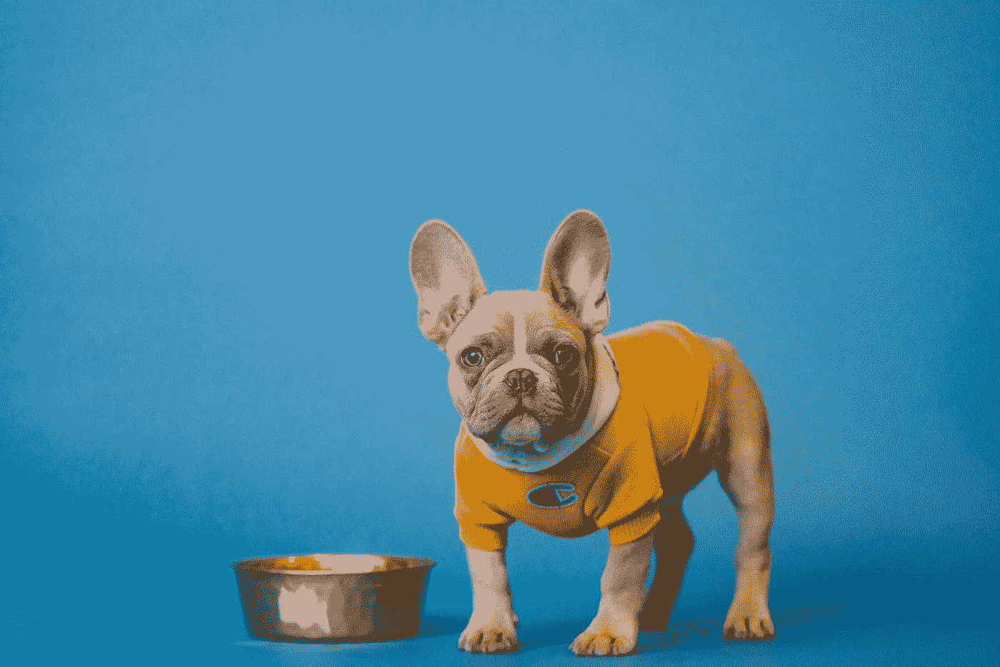

由 [Unsplash](https://unsplash.com?utm_source=medium&utm_medium=referral) 上的 [Karsten Winegeart](https://unsplash.com/@karsten116?utm_source=medium&utm_medium=referral) 拍摄