# 8 用 Python 处理多个时间序列数据的可视化

> 原文：<https://towardsdatascience.com/8-visualizations-with-python-to-handle-multiple-time-series-data-19b5b2e66dd0>

## 避免多时间序列图中重叠线条的可视化想法


朱莉安娜在 [Unsplash](https://unsplash.com?utm_source=medium&utm_medium=referral) 拍摄的照片

[奇异博士](https://en.wikipedia.org/wiki/Doctor_Strange)，一个虚构的角色，是我最喜欢的超级英雄。他令人难以置信的能力之一是预见事件的可能性。如果我能像他一样同时看到很多东西，那该多好。事实上，我不需要任何超能力也能做到。只要一个正确的可视化和 Python 类型就足够了。

# 多重时间序列数据

单线时间序列图有助于用长序列表示数据。它由代表时间线的 X 轴和显示值的 Y 轴组成。这是一个标准的方法，因为这个概念简单易懂。该图可以帮助我们提取一些洞察信息，如[趋势和季节效应](https://otexts.com/fpp2/tspatterns.html)。

然而，多时间序列图上的多条线会使事情变得困难。让我们考虑下面的例子。

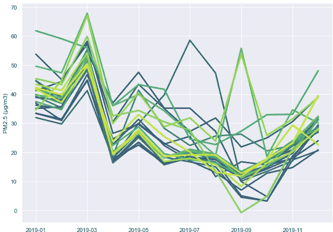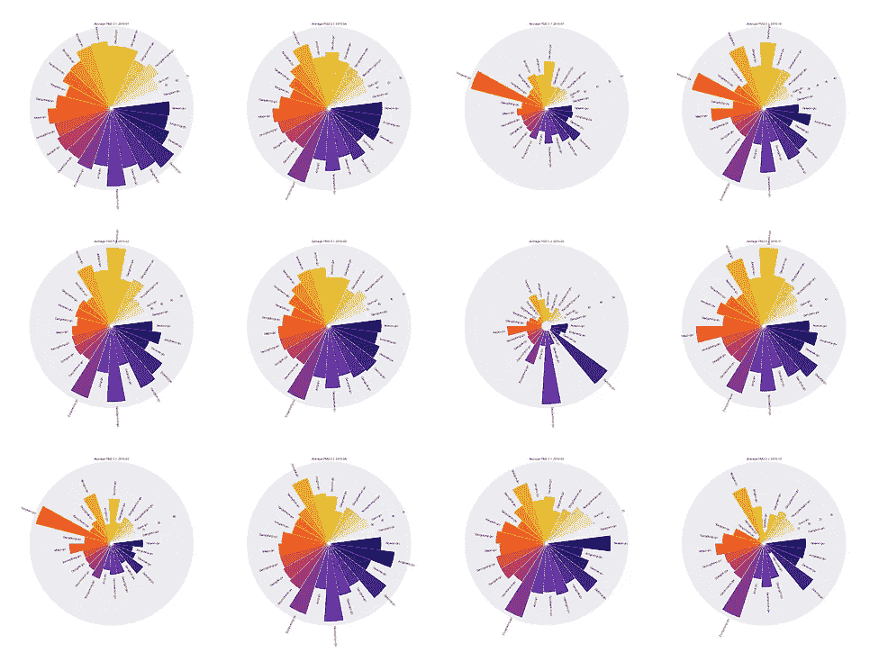

第一张图:多时间序列线图显示 2019 年首尔 25 个区的 PM2.5。第二张图片:径向图中的相同数据集。首尔的空气污染来自 Kaggle 的数据。作者图片。

这似乎有些夸张，但有时可能会遇到这种数据，如下图所示。第一张图字里行间很难分辨，很难读懂。对于相同的数据集，第二张图中的径向图有助于处理重叠图，这将在本文中作为一个想法进行解释。

本文将使用 Python 代码演示 8 种可视化思想，以应对绘制多个时序数据时的混乱。让我们开始吧。

# 检索数据

为了处理一个真实的案例，我将使用 Kaggle( [链接](http://www.kaggle.com/datasets/bappekim/air-pollution-in-seoul))的首尔数据集中的空气污染。数据由首尔市政府提供。它是关于 2017 年至 2019 年期间来自韩国首都首尔 25 个区的空气污染信息，包括 SO2、NO2、CO、O3、PM10 和 PM2.5。

本文以 25 个地区的 [PM2.5](https://www.epa.gov/pm-pollution/particulate-matter-pm-basics) 为主要变量，绘制成多条时间序列线。PM2.5 被定义为直径小于 2.5 米的细小颗粒物质。它被认为是一种导致[短期健康影响](https://www.health.ny.gov/environmental/indoors/air/pmq_a.htm#:~:text=Exposure%20to%20fine%20particles%20can,as%20asthma%20and%20heart%20disease.)的污染。

从许多位置可视化 PM2.5 有助于比较污染如何影响城市。

# 输入数据

从导入库开始。

```
import numpy as np
import pandas as pd
import matplotlib.pyplot as plt
import seaborn as sns
import matplotlib.ticker as ticker
```

和熊猫一起读 Measurement_summary.csv。

```
df = pd.read_csv('<file locaion>/Measurement_summary.csv')
df.head()
```

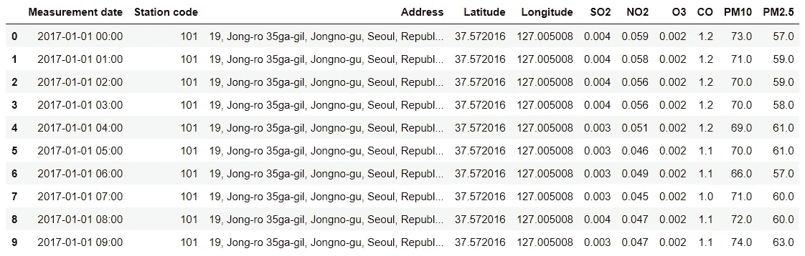

# 浏览数据

现在我们已经导入了数据集。继续检查每个列的缺失值和数据类型。

```
df.info()
```

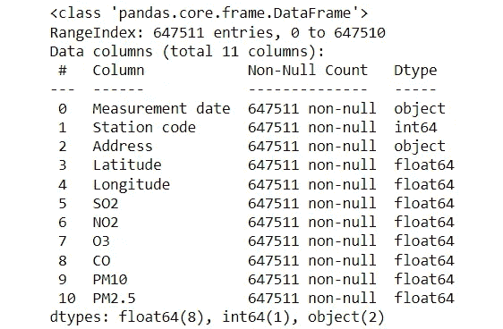

好消息是没有丢失值。下一步是检查不同站点代码的数量。

```
df['Station code'].nunique()###output:
###25
```

总共有 25 个站。检查车站代码。

```
list_scode = list(set(df['Station code']))
list_scode###output:
### [101, 102, 103, 104, ..., 125]
```

# 预处理数据

从 101 到 125，车站代码代表首尔的区。就个人而言，使用地区名称更便于标记可视化，因为它更便于阅读。将从“地址”列中提取姓名以创建“地区”列。

```
list_add = list(df['Address'])
District = [i.split(', ')[2] for i in list_add]df['District'] = District
```

创建一个包含 25 个地区名称的列表供以后使用。

```
list_district = list(set(District))
```

准备另外三列，YM(年月)、年和月，以应用一些图表。为了更容易形象化，我们将他们分组为平均每月数据框架*。*

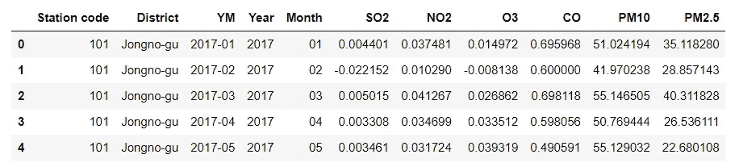

# 绘图数据

现在一切都准备好了，让我们做多重时间序列图。

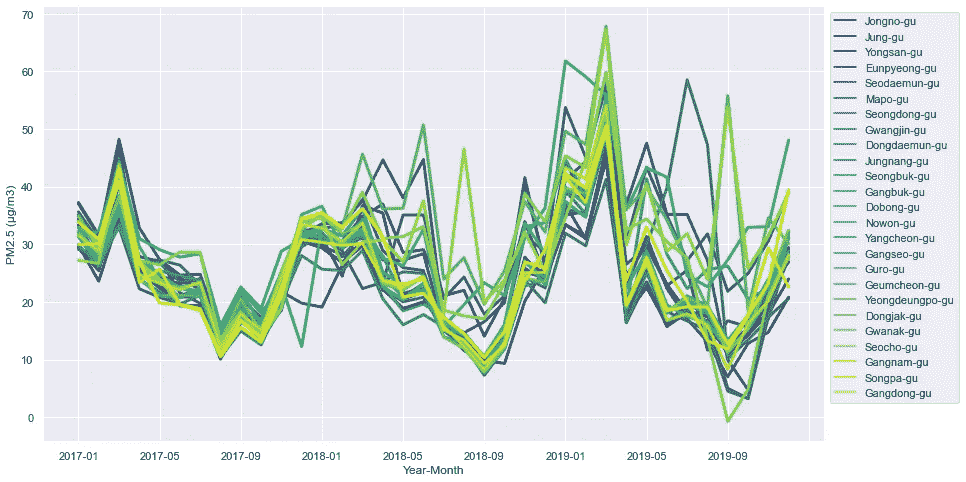

多时间序列线图显示了 2017 年至 2019 年首尔 25 个区的月平均 PM2.5。图片由作者提供。

重叠的线条很难辨认。2017 年可以看到很多站的 PM2.5 量都是同向的。但 2018 年和 2019 年，污染线肆意而为，难以分辨。

# 可视化想法

本文的主要目的是用 Python 的一些可视化思想来指导处理多个时间序列数据。

在继续之前，我需要澄清一些事情。正如我们已经看到的，本文中推荐的可视化主要用于处理重叠图，因为这是绘制多个时间序列数据的主要问题。

每张图都有它的优点和缺点。显然，没有什么是完美的。有些可能只是为了一个吸引眼球的效果。但是它们都有相同的目的，在类别之间比较序列。

## 1.什么都不改变，只是让剧情互动起来。

Plotly 是一个用于制作交互式图形的图形库。交互式图表有助于放大具有重叠线条的区域。

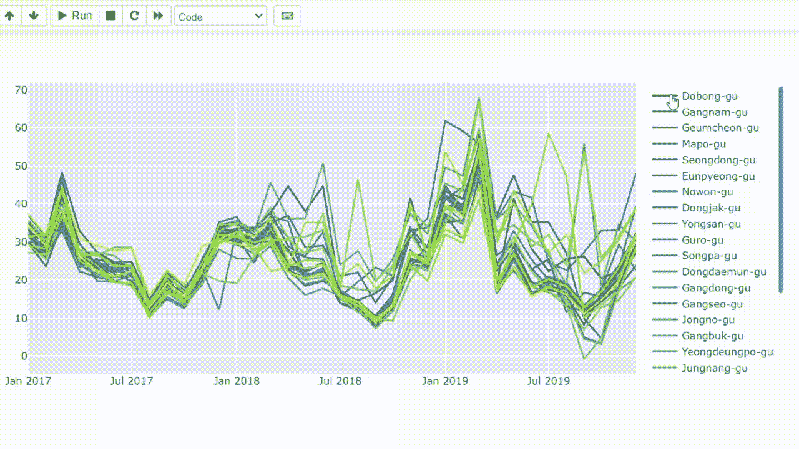

使用[plottly](https://plotly.com/python)创建交互式多时序线图的结果。作者图片。

使用 Plotly，还可以制作交互式面积图。

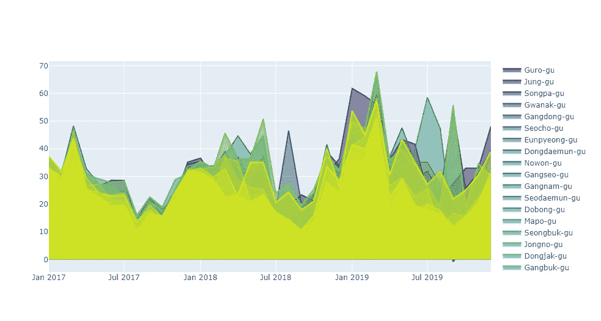

用颜色填充线条下的区域。图片由作者提供。

## 2.与多个小时间序列逐一比较。

有了 [Seaborn](https://seaborn.pydata.org/index.html) 库，我们可以做小倍数的时间序列。这些图背后的想法是一条一条地绘制每条线，同时仍然将它们与其他线的轮廓进行比较。官网链接上的代码是[这里是](https://seaborn.pydata.org/examples/timeseries_facets.html)。

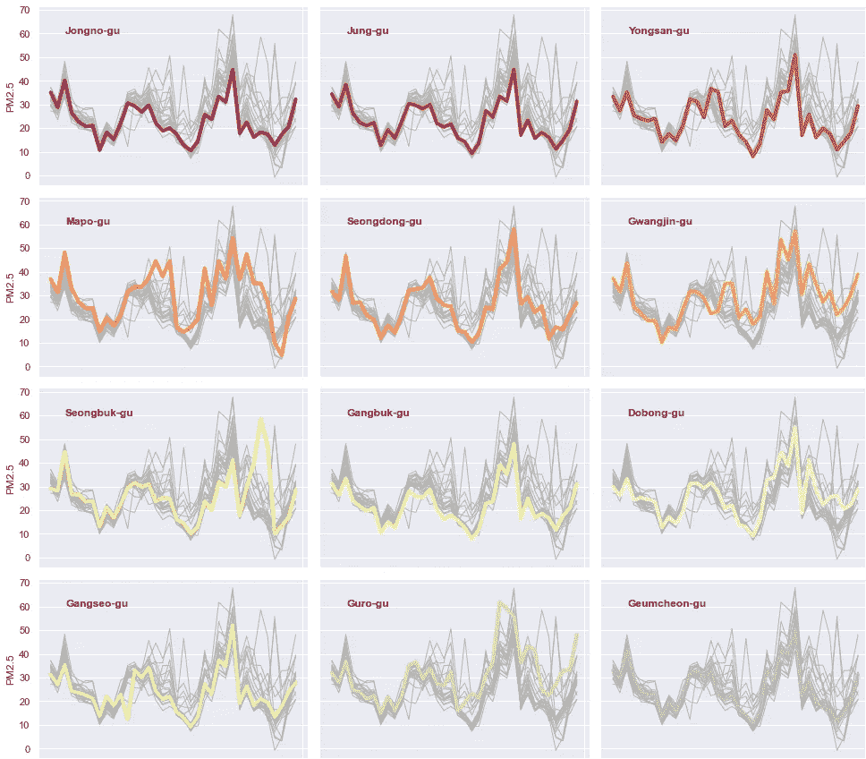

小型多重时间序列图的一部分。作者图片。

## 3.使用小平面网格更改视点

Seaborn 的 FacetGrid 可以用来制作多点网格。在这种情况下,“月”和“年”属性分别设置为行和列。从另一个角度来看，这些值可以同时进行纵向的月度比较和横向的年度比较。

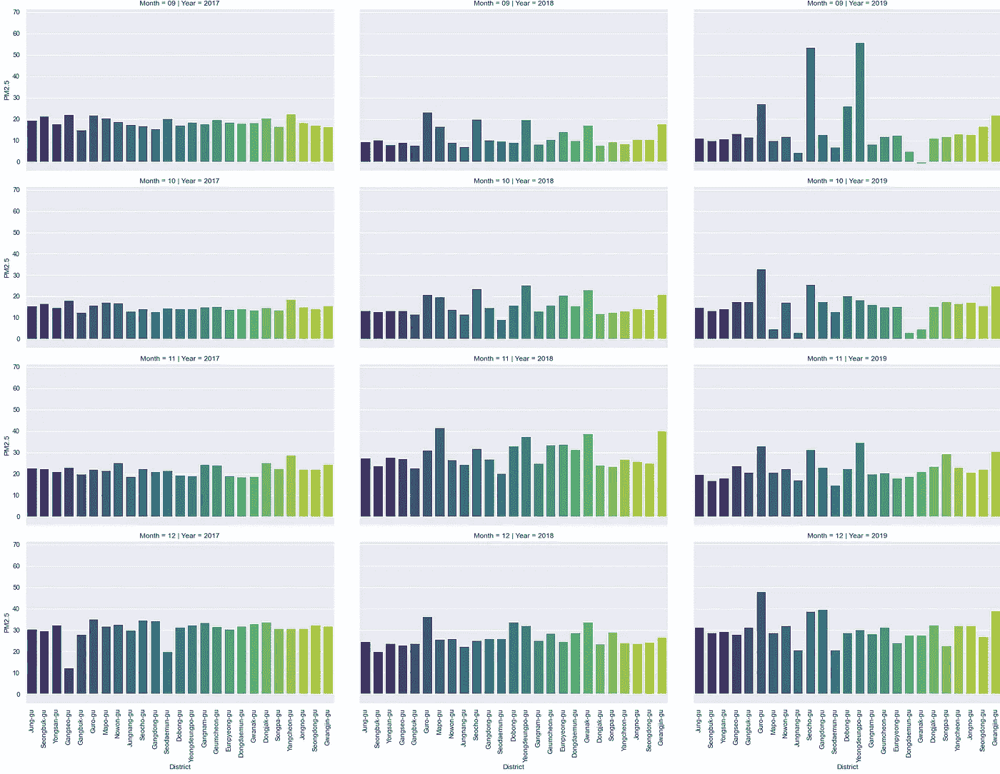

小平面网格图的一部分。作者图片。

## 4.在热图中使用颜色

热图将数据表示成二维图表，用颜色显示数值。为了处理时间序列数据，我们可以在垂直维度上设置组，在水平维度上设置时间轴。颜色的不同有助于区分不同的群体。

旋转数据框

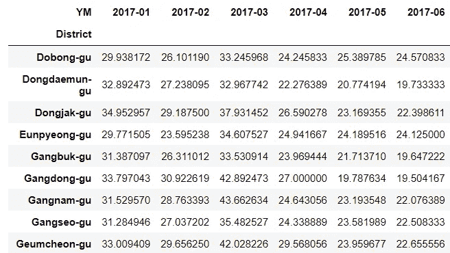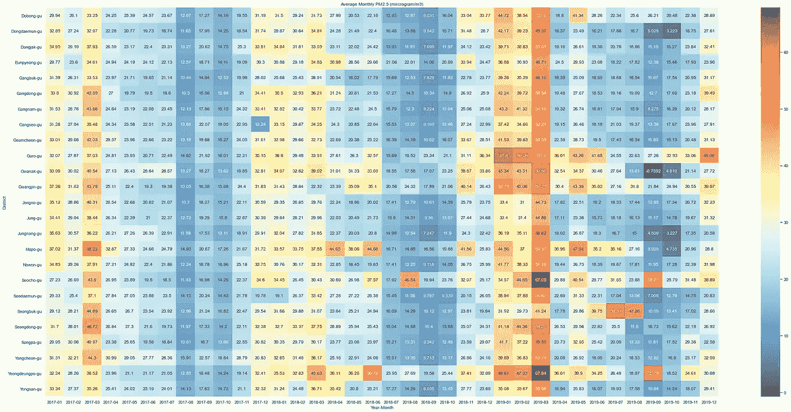

热图显示了 2017 年至 2019 年首尔 25 个区的月平均 PM2.5。图片由作者提供。

## 5.在雷达图中应用角度

我们可以在 Plotly 中设置散点图的角轴，以创建一个交互式[雷达图](https://plotly.com/python/radar-chart/)。每个月将被选为圆上的一个变量。比如在本文中，我们会创建一个雷达图，对比 25 个区 2019 年的月均 PM2.5。

仅使用 2019 年的数据过滤数据框

```
df_19 = df_monthly[df_monthly['Year']=='2019']
```

创建雷达图。使用 Plotly 的一个好处是雷达图是交互式的。所以我们可以很容易地过滤图表。

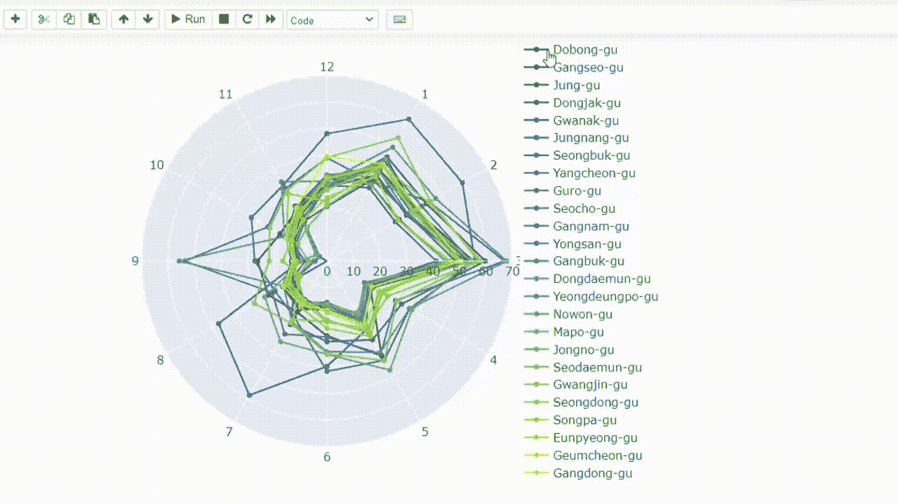

使用 [Plotly](https://plotly.com/python) 创建交互式雷达图的结果。作者图片。

让我们更进一步，逐一填充每个不同的雷达区域，并将每个区域与其他区域进行比较。然后创建一个照片拼贴。

定义一个函数来创建一个照片拼贴。我发现了一个很好的方法，可以在栈溢出时组合这个[链接](https://stackoverflow.com/questions/35438802/making-a-collage-in-pil)中的图。

使用该功能

瞧啊。！…

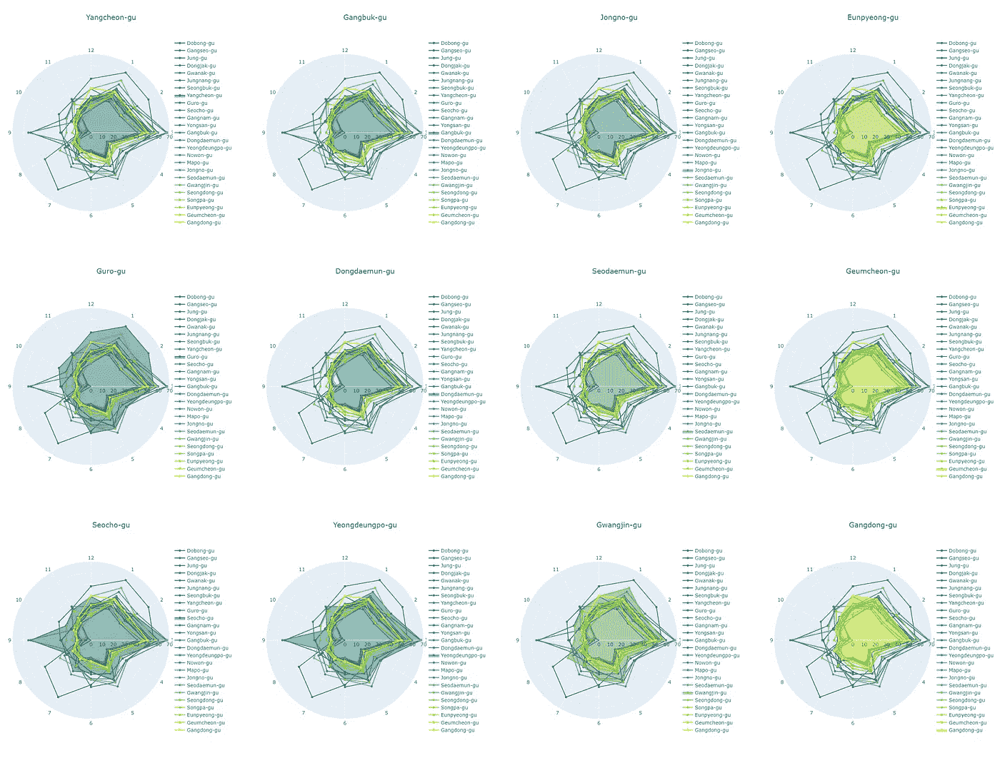

照片拼贴画中的一些雷达图。作者图片。

## 6.喜欢圆形条形图的条形图(跑道图)

[圆形条形图](https://python-graph-gallery.com/circular-barplot/)(又名赛道图)的概念非常简单，因为它只是一个圆圈中的条形图。我们可以按月绘制圆形条形图，然后制作照片拼贴，沿着时间对比过程。

下图显示了我们将要创建的圆形条形图的示例。这个图表的缺点是很难在类别之间进行比较。对了，用吸睛的效果来获得关注是个不错的选择。

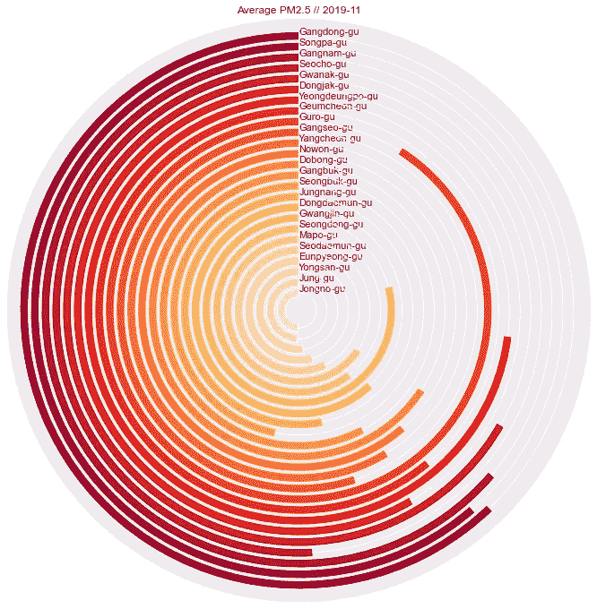

圆形条形图，图片由作者提供。

定义一个函数来创建圆形条形图

应用该功能

创建照片拼贴

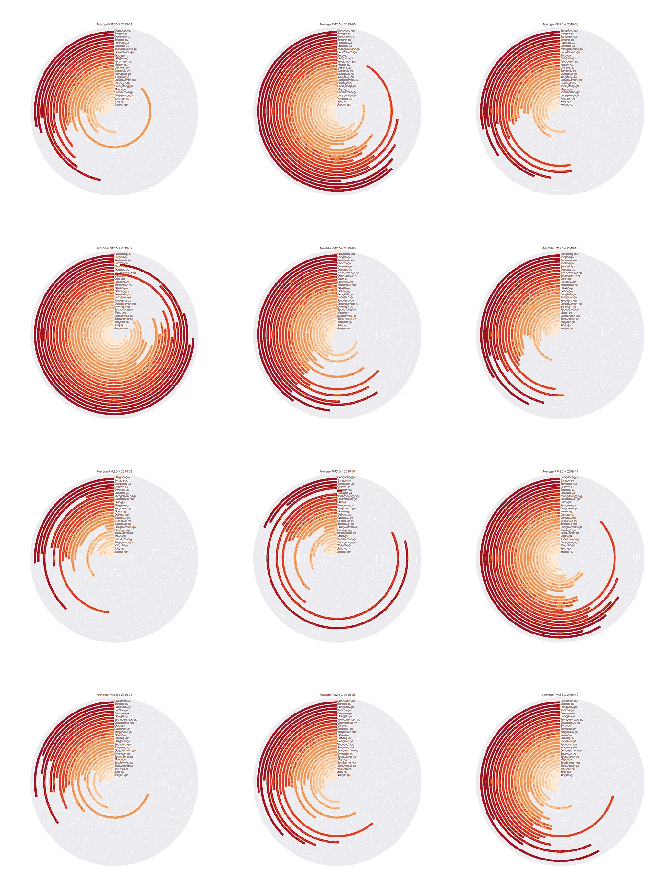

圆形条形图显示了 2017 年至 2019 年首尔 25 个区的每月 PM2.5。作者图片。

## **7。从中心开始绘制径向图**

像圆形条形图一样，[径向图](https://python-graph-gallery.com/circular-barplot-basic)基于使用极坐标而非笛卡尔坐标的条形图。当比较相距较远的类别时，这种图表类型很不方便，但它是引起注意的绝佳选择。它可以用在信息图表中。

下图显示了 2019 年 1 月 25 个区的平均 PM2.5 的径向图示例。

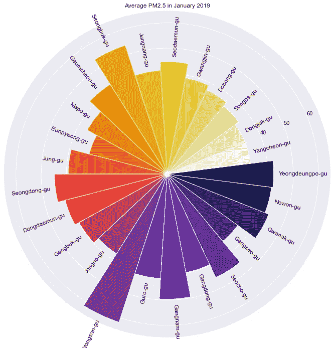

放射状的情节，图片由作者提供。

应用该功能

创建照片拼贴

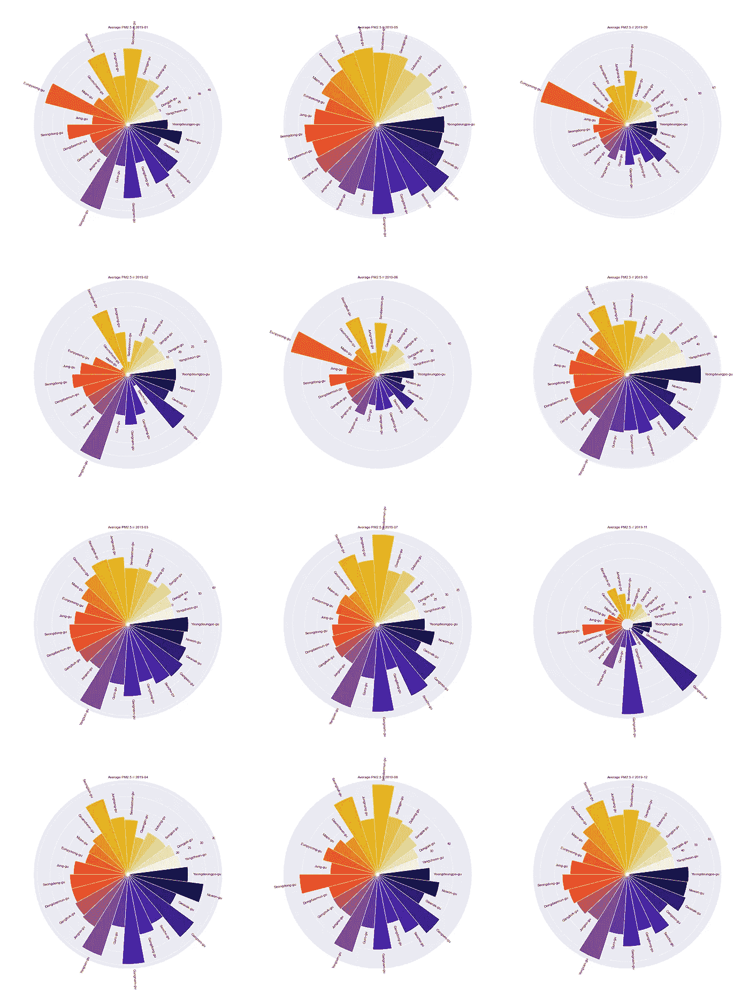

辐射图显示了 2017 年至 2019 年首尔 25 个区的每月 PM2.5。作者图片。

## 8.显示具有重叠密度的密度(山脊图)

通过将轴设置为时间轴，重叠密度(山脊图)可用于多个时间序列数据。像圆形条形图和放射状图一样，山脊图更能引起人们的注意。Seaborn 官网上的代码是[这里是](https://seaborn.pydata.org/examples/kde_ridgeplot.html)。

下图显示了 2019 年某区 PM2.5 密度的山脊图示例。

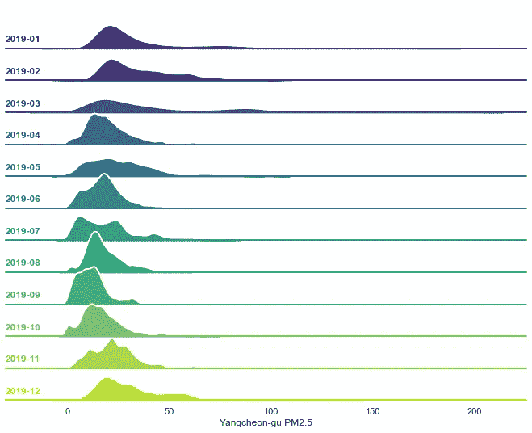

重叠密度(山脊图)，图片由作者提供。

定义用于创建山脊图的函数

应用该功能

创建照片拼贴

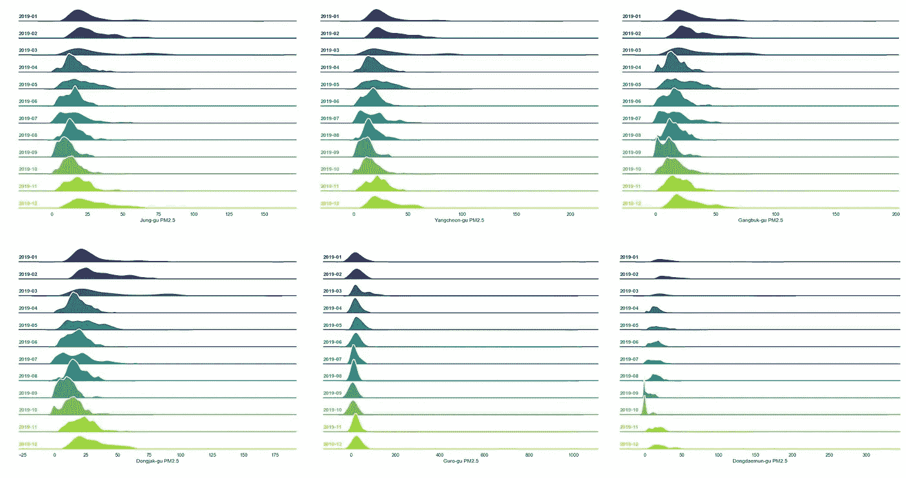

照片拼贴画中的一些山脊图。作者图片。

## 摘要

本文展示了一些可视化的 Python 代码示例，用于处理多时间序列图中的重叠线。两个主要的概念是使用交互式的情节和分离他们。交互式图表有助于允许用户自由选择类别的选项，而分隔图表有助于用户轻松比较它们。

这些只是一些想法。我确信，除了本文中提到的图表，还有更多处理多个时间序列数据的可视化方法。如果您有任何问题或建议，请随时留下评论。感谢阅读。

这些是关于数据可视化的其他文章，您可能会感兴趣。

*   用 Python 可视化光速([链接](/visualizing-the-speed-of-light-in-the-solar-system-with-python-fa9ead33ac86))
*   用 NASA 数据和 Python ( [链接](/visualize-the-invisible-so2-with-nasa-data-and-python-2619f8ed4ea1))可视化看不见的二氧化硫
*   用 Python 分 4 步进行图像颜色提取([链接](/image-color-extraction-with-python-in-4-steps-8d9370d9216e))

## 参考

*   首尔市政府。(2021 年 5 月)。韩国首尔的空气污染测量信息。2022 年 4 月 24 日检索自[https://www . ka ggle . com/datasets/bappekim/air-pollution-in-Seoul](https://www.kaggle.com/datasets/bappekim/air-pollution-in-seoul)
*   作者:Plotly Technologies Inc .书名:协作数据科学出版社:Plotly Technologies Inc .出版地点:马萨诸塞州蒙特利尔出版日期:2015 URL: [https://plot.ly](https://plot.ly)