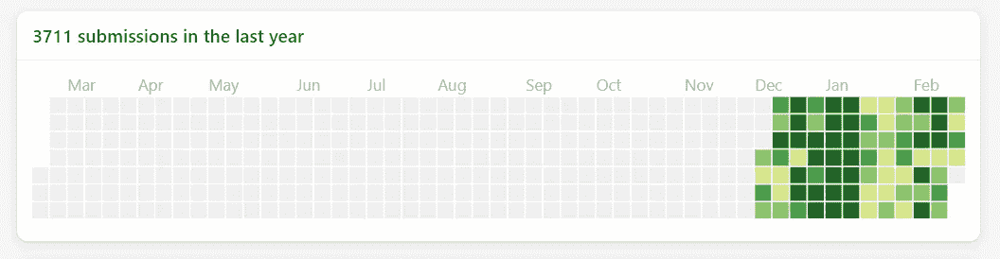
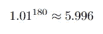
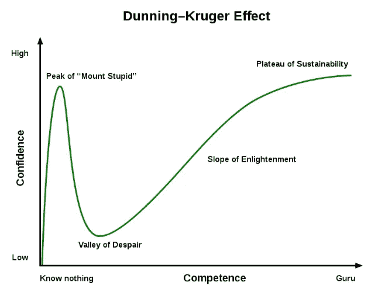
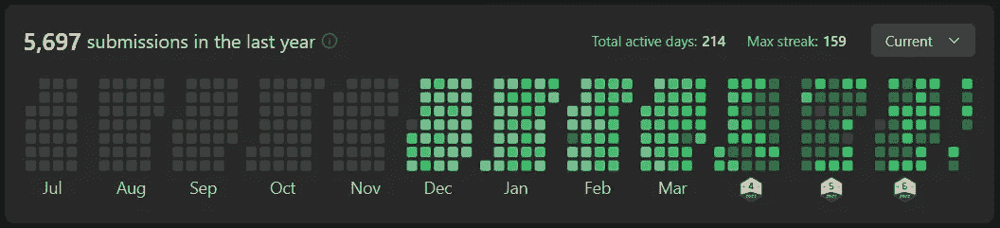

# 进入法昂需要 80 天

> 原文：<https://towardsdatascience.com/80-days-to-get-into-faang-5c77f27d5224>

## 我是如何在有限的准备时间内征服技术面试的

图片由[凯利·西克玛](https://unsplash.com/@kellysikkema)在 [Unsplash](https://unsplash.com/) 上拍摄

临近 2021 年底，我在考虑找份新工作。我曾计划在发出申请之前，花至少六个月的时间来更新我的数据结构和算法(DSA)知识。具有讽刺意味的是，在我开始这个计划的 2 周后，FAANG 的一名招聘人员向我提供了一个机器学习的机会。

经过“仔细”的考虑，我决定继续面试，同时尽可能多地从 LeetCode(一个练习 DSA 的在线平台)中学习。在我看来，这只是一个获得更多面试经验的机会。我从来没有想过我会在所有的技术回合中表现出色。我不知道，在我最初计划的 80 天后，我会收到他们的邀请。

我在 [LeetCode](https://leetcode.com/) 上的提交历史，当时我得到了 offer。

这篇文章将总结我的旅程。更重要的是，它将概述和解决我的主要准备工作，日常事务，斗争，以及我如何克服这些。我将主要关注技术面试。我希望这将有助于任何有抱负的 SWE/MLE 寻找下一个大的飞跃。

请注意，系统设计、ML 设计和行为面试同等重要(如果不是更重要的话)，你也应该花大量的时间来准备它们。在上图中，较浅绿色的日子是我花额外时间学习非编码的日子。

**目录**

∘ [1。最重要的事情](#af8d)∘[2。主要对手](#89f6)
∘ [3。资源](#7227)
∘ [4。结论](#b428)

## **1。最重要的事情**

就是要有计划。并坚持下去。

破解技术面试的旅程是一场马拉松。事情在变得容易之前会变得困难。很有可能你需要至少六个月的持续训练和准备，然后才能开始适应处理更难的问题和面试。因此，制定一个计划并坚持下去是非常重要的。一个设计良好的计划会给你一个清晰的行动项目和进展路线图。这也能让你避免拖延或偏离轨道。

我最初的 6 个月计划是这样的:

*   每天花 30 分钟回顾关键概念，直到感觉舒服为止；
*   在 LeetCode 上做 50-100 道简单题；
*   然后做 50-100 个中等题；
*   然后开始做难题，参加竞赛。

(注意，我的计划中没有时间表。我相信设定目标并真正完成和理解每一步比给自己一个 X 周的期限来完成 Y 个问题更有帮助。)

因为我决定用很少的时间来完成面试，所以我修改了计划:

*   997.

(“996”在中国是一种流行的工作时间表，员工被要求一周工作 6 天，早上 9 点到晚上 9 点。在这里，997 只是 996 + 1 额外的一天:我每天学习 12 个小时，每周 7 天。)

换句话说，我醒着的大部分时间都在为面试做准备(好像我没有选择)。此时我也有一份全职工作。但是一两年后，你的工作效率会变得非常高，并且可以在不到三个小时内完成大部分日常任务。

我不会建议任何人尝试这个计划。就我个人而言，我发现自己非常幸运能够做到这一点。但是我再也不会尝试了。这肯定会让你筋疲力尽。赢得比赛的关键是一致性。

## 2.主要对手

我最努力的是保持自律和相信自己。然而，我发现在技术面试准备中，精神挑战通常不会被公开讨论(或者根本不会)。如果你在学习中遇到这些问题，要知道你并不孤单，你有能力克服它们。

*   冒名顶替综合征:

一路走来，你可能会发现只是要学的东西太多，概念太抽象，或者问题太难。

有这种感觉是完全正常的。但是，请记住，这座知识之山是要经过很长一段时间才能被征服的，无论谁想要获得它，都必须经历一个类似的过程。如果你读这篇文章是为了寻找旅途的动力或建议，我想说你已经在精神上有了一个很好的开始。

听起来可能很老套，但如果你打算在 6 个月内每天只提高 1%的话，这里有一个结果:

也就是说，你会比现在好 6 倍。

最后，如果事情仍然难以承受，我的建议是定期休息，并着眼于更长的时间，比如 1-2 年。

*   邓宁-克鲁格效应；

图片来自维基百科

感觉不知所措很容易，说服自己已经知道如何解决问题也同样容易。毕竟，LeetCode 的目标只是得到一个可接受的解决方案。

有些问题我会纠结很多，然后我会看提示，论坛，我会告诉自己我知道如何解决它们。但当我一周后遇到同样的问题时，我的大脑会一片空白。

这里只有一个解决办法，那就是对自己诚实。对于那些我仍然需要参考提示和讨论论坛的问题，我会在个人清单中跟踪它们，并在一周后重新访问它们。

*   缺乏动力:

这也许是我们所有人面临的最大挑战。从日常事务中走出来，踏上一段需要长时间太多努力的旅程，并不容易。我强烈建议你找一个动力的来源来帮助引导你完成这个过程。问问自己:为什么要做这一跳？金钱是唯一的驱动力吗？如果是的话，保持这种决心可能会很有挑战性。

有一个支持的来源也同样重要。可能是任何人:你的朋友，你爱的人，甚至你的论坛用户。有人谈论你的进步和奋斗是非常宝贵的。如果你有一个朋友一起训练和准备，你会发现这个过程非常愉快。

也就是说，如果你能坚持每天至少学习一个小时，坚持至少 8 周，你会发现动力和支持不再是问题。至此，学习已经成为一种习惯，成为你一天中半潜意识的一部分。无论你决定做什么，这个习惯都将是你未来成功的重要因素。甚至在我拿到 offer 之后，我还是刻意的试图保持这个习惯。在我不能研究任何问题的日子里，我会有一种“学习退缩”的感觉。这对你的健康有害，所以不要停止学习。

## **3。资源**

现在，有很多免费的资源可以用来学习 DSA。你可能会找到比我列出的更好的资源，那就更好了。以下是帮助我开始的资源摘要:

*   基本概念:维基+ YouTube 视频。
*   对于算法:[麻省理工学院 6.006:算法简介](https://www.youtube.com/playlist?list=PLFXdam636ef0nESQ6ya4fDA0Th43foCDl)。对于一个技术面试来说，有些讲座太多了，所以只看那些你觉得相关的:二分搜索法、西普、BFS、DFS、DP……我从这门课上学到了大部分图形知识，我为 BFS 编写的代码风格几乎与这些讲座中介绍的伪代码完全相同。
*   [你的语言]中的编程面试元素:这本书非常有帮助，有很多很好的提示和解释。这本书里有很多你在别处找不到的见解(例如，位操作对我来说一直是一个很难的话题，但这本书让它变得容易理解得多)。平装书的另一大好处是你可以在任何地方阅读。
*   LeetCode 讨论:如果你是 DSA 新手，讨论部分可能会很吓人。顶级解决方案有时会非常复杂。尽管如此，还是有一些非常好的帖子有非常详细的解释。花点时间阅读这些，确保你理解了。对我来说，这是唯一最重要的知识来源。
*   LeetCode Premium:我发现免费讨论已经足够有帮助了。然而，如果你想真正关注一两家特定的公司，或者看看锁定的问题，你可以使用 Premium。也就是说，出于额外的预防措施，我确实购买了两个月的保费。
*   对于系统设计和 ML 设计面试:这本身就是一个巨大的话题。在这篇文章中，我将重点讨论技术面试。

## **4。结论**

征服 FAANG 面试是一个漫长的旅程。然而，我相信付出的努力是值得的。从大的方面来看，你将花费 6 个月到 1 年的时间来*显著地*改善你未来的职业生涯，这很可能是 30 年或更长。换句话说，越早开始，投资回报越好。(并不是说如果你开始的太晚，那就不要打扰。不管怎样，这仍然是一项伟大的投资。)

在旅程的最后，你可能会发现 DSA 很有趣。我知道我做到了，这已经成为我日常娱乐的一部分。既然找工作的压力已经消除，我发现自己期待着每周的比赛，作为工作周的一个休息。

写这篇文章时，我在 [LeetCode](https://leetcode.com/) 上的提交历史。

在这篇文章中，我概述了处理编码面试的主要资源和障碍，以及我如何克服它们。希望这将有助于你自己的冒险，并祝你未来的职业生涯好运！

如果你愿意支持 Thu，你可以考虑注册成为一名中等会员。每月支付 5 美元，你就可以无限制地阅读媒体上的故事。如果你使用他的推荐链接，Thu 也会得到一小笔佣金。

 