# 改进数据可视化游戏的 9 种可行方法

> 原文：<https://towardsdatascience.com/9-actionable-ways-to-improve-your-data-visualization-game-384923e54044>

## 图文并茂

亚历山大·辛恩在 [Unsplash](https://unsplash.com?utm_source=medium&utm_medium=referral) 上的照片

有一句来自 [Patrick Winston](www.youtube.com/watch?v=Unzc731iCUY) 的名言:

> 你在生活中的成功很大程度上取决于你的说话能力、写作能力和想法的质量，按此顺序排列”

虽然他没有明确地说*数据可视化*，我谦恭地相信他会同意我们绘制数据的能力属于写作范畴。而且，就像写作一样，有很多陷阱，我们都很容易陷入其中，除非我们事先很好地意识到它们。

在本文中，我总结了多年来我在如何提高数据可视化技能方面获得的一些主要见解。这些大致分为两类:我们应该经常做的事情和如何更好地交流想法。正如在我的大多数文章中一样，我试图给你尽可能多的可行的建议。到本文结束时，您应该已经掌握了一些新的技巧和一些新的资源来获得灵感。

# #1 解释一切

一个好的情节最重要的方面是自成一体。它应该表明它显示什么(标题)，它的轴代表什么(轴标签)，使用的测量单位，它覆盖的数值范围，以及它有什么系列。换句话说，你的情节应该能够独立存在，不需要其他任何东西。你唯一的退路应该是情节的标题。

最糟糕的阅读经历之一是在浏览一篇文章时发现一个看起来很棒的情节，然后发现如果不阅读整篇文章你就无法理解它所表达的内容。它充满了缩写和自定义符号。虽然你可能认为这可能会让人们阅读你的作品，但这更有可能让他们关闭它，继续下一个。

**快速检查表:**你的图有标题，每个轴有标签，数值范围清晰，有网格(或者暗示)，数列命名恰当。任何其他添加也应该清楚。例如，如果你要做对数图，确保这很容易被注意到。

这是一个本可以更好的情节:

图片由[作者](https://onlinelibrary.wiley.com/doi/abs/10.1111/cgf.13529)

这里的主要问题不是情节本身，而是没有被它解释的信息量。请注意需要在标题上放置多少信息来填补所有的空白。例如，色带可以指示阴影与采样密度相关。

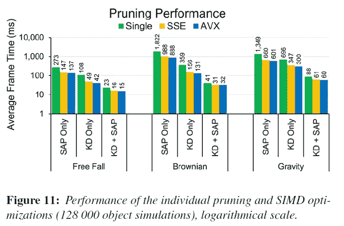

图片由[作者](https://onlinelibrary.wiley.com/doi/abs/10.1111/cgf.13529)

来自同样的[作品](https://onlinelibrary.wiley.com/doi/abs/10.1111/cgf.13529)，这里有一个好得多的情节。X 轴显示三个设置(自由落体、布朗运动和重力)，每个设置都有三个子设置(仅 SAP、仅 KD 和 KD + SAP)和三个系列(单一、SSE 和 AVX)。Y 轴代表时间，由于我们熟悉 10 的幂，可以看到它是用对数绘制的。

**多做一点:**蛋糕上的樱桃是每一格顶端的数字。大多数人很难理解对数图的数字含义。我们可以同时传达指数级的速度提升，同时通过显示实际数字呈现直观的结果视图。通常很难在不造成视觉污染的情况下显示每个数据点背后的数字。然而，只要有可能，请去做。尤其是在处理对数标度这样的事情时。

# #2 框定您的数据

视觉上，每个情节都应该表明一切，并且足够全面，以便观众能够理解所代表的数值。这意味着在数据周围有一些网格和清晰框架的暗示。时刻提醒自己，剧情是*视觉表*，不是画面。你不会弄脏桌子的，对吧？不要让数字难以看清。

先说一个不好的例子:

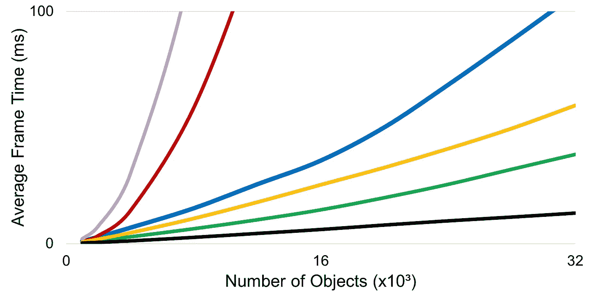

图片由[作者](https://onlinelibrary.wiley.com/doi/abs/10.1111/cgf.13529)

我们只知道这里有一堆曲线。有的超过 100 个，剧情到 32000 个对象结束。我们可以相互比较数列，但我们没有真正的数字意义——除非你拿起尺子和铅笔来勾画一些参考值。现在考虑以下情况:

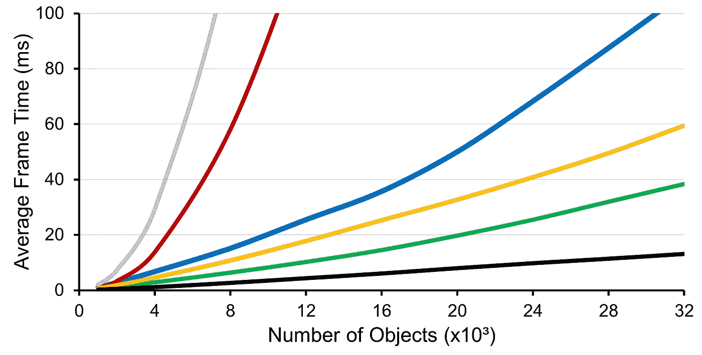

图片由[作者](https://onlinelibrary.wiley.com/doi/abs/10.1111/cgf.13529)

这一次，我们不需要一把尺子来看黑色曲线在< 20, the green one ends almost at 40, etc. The added markings and the subtle grid make all the difference. One could write a relatively accurate table out of this visualization without the need for a ruler or some other device.

**处的结束，多走一步:**在图中添加框架和箭头会非常有效。这个想法是引导你的观众走向本质。当可视化复杂或有噪声时，这些添加可能很重要。这里有一个例子:

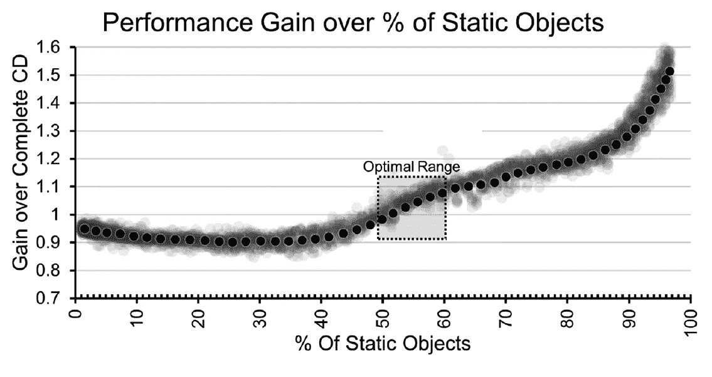

图片由[作者](https://onlinelibrary.wiley.com/doi/abs/10.1111/cgf.13529)

# #3 使用多种工具

看上面的情节。当我们需要向绘图添加框、文本和箭头时，使用 Matplotlib 这样的工具可能会令人望而生畏。获得正确的定位是一件痛苦的事情，每当你需要重新定位东西的时候，你总是需要做一些反复试验的工作。当我们试图找到更好的字体大小或颜色时也是如此——无休止的猜测循环。

更好的方法是将内容导出到另一个应用程序。我最引以为豪的大部分情节都是通过几个工具和少量的图像编辑完成的。例如，使用 PowerPoint 或幻灯片添加箭头和方框要比在绘图库中或通过 Excel 容易得多。你也可以使用免费的工具来试颜色，比如 Paint.Net 的[和它的滤镜，比如色调-饱和度和亮度-对比度。](https://www.getpaint.net)

**更进一步:**大多数绘图包导出到 [SVG](https://en.wikipedia.org/wiki/Scalable_Vector_Graphics) 。因此，你可以使用利用这种格式的 [Inkscape](https://inkscape.org) 和 [Adobe Illustrator](https://www.adobe.com/products/illustrator.html) 工具轻松修改任何内容。另外，SVG 是一种基于 XML 的文件格式，因此您可以在 [VS Code](https://code.visualstudio.com) 上打开它，并通过使用查找和替换工具来做一些事情，例如大量的颜色更改。

**LaTeX 提示:** LaTeX 不支持 SVG。但是，您可以将 SVG 文件转换为 PDF，并将其作为图像包含在内，以实现矢量质量可视化。

# #4 使用一致的尺度

在我继续之前，看看这三个情节。它们展示了两个过程的演变。曲线越低越好。在这种情况下，以下哪一项取得了最佳效果？

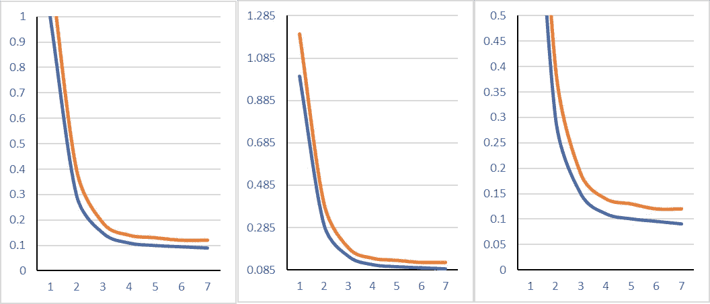

图片由作者提供。

如果你说中间的蓝色曲线，你是…不对对吗？

问题是这些都是相同的曲线。图与图之间变化的是 Y 轴刻度。一个从 0 到 1，第二个从 0.085 到 1.285，第三个从 0 到 0.5。从某种意义上说，这些只是相同曲线的不同缩放。下面是我们为所有三幅图设置相同范围时它们的样子:

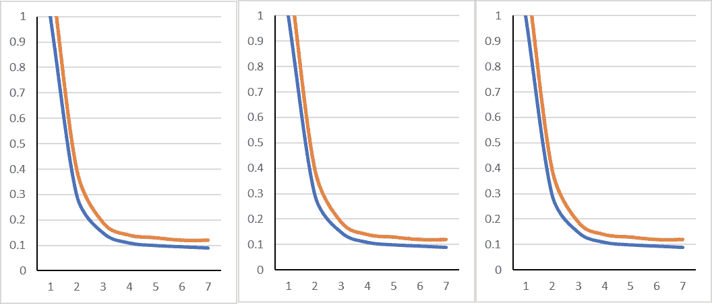

图片由作者提供。每个图使用相同的 Y 轴设置。

特别是当你使用多张图比较同一问题的几种方法时，**一定要确保它们使用相同的观察尺度**。再者，**使用合理的尺度**。例如，如果你的数据是一个百分比，坚持 0-100 的范围。如果一个变量的范围只能是 1 到 2，那么就使用它。

在这种情况下，恶意的策划者喜欢利用这个“小错误”来故意改变我们对数据的看法。例如，考虑下面的三幅图。左边，我们有原始数据；在中心位置，我们有一个精心选择的比例，使蓝色的方法看起来比橙色的曲线好得多；在右边，轴范围使它看起来像两种方法收敛到相同的值。**千万不要这样**。

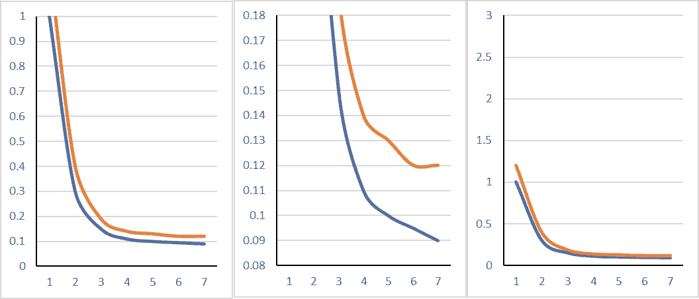

图片由作者提供。极其恶意的 Y 轴设置。

这里有另一个例子，说明秤是如何被用来有意误导人们的。在下面的图表中，这家虚构的公司增长了 1.1%，然后是 1.2%和 1.5%。增长率相对适中，但可视化使公司看起来像是呈指数增长——甚至有一个箭头！

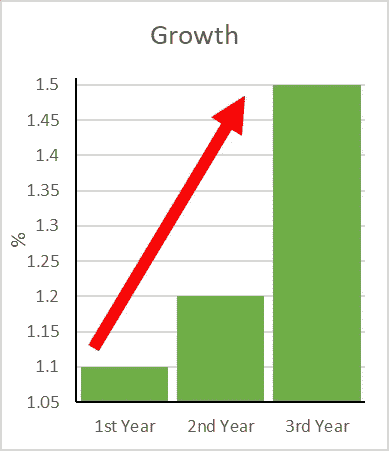

**更进一步:**这里有两篇很棒的文章展示了恶意行为者如何利用数据可视化撒谎。[如何用图表撒谎](https://analythical.com/blog/fox-chart-fail)和[误导统计](https://analythical.com/blog/fox-chart-fail)。两部作品都有真实的情节，展示了这些战术在实践中是如何运用的。确保你永远不会犯这些错误(也不会上当)。

# #5 遵循预设的配色方案

除非你是一名设计师或者有很强的审美感，否则坚持使用经过反复试验的配色方案。我们几乎没有理由不这样做——而且这样可以节省时间。Matplotlib 的文档有一篇很棒的文章介绍了他们的彩色地图及其背后的想法。对于 Excel 用户来说，手工复制这些颜色就可以了。

以下是一些可用预设的快速概述:

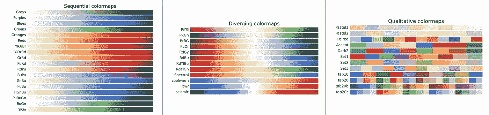

使用 [matplotlib](https://matplotlib.org/3.5.0/tutorials/colors/colormaps.html) 生成

可用的色彩映射表被整齐地分为顺序的、发散的、循环的、定量的和混杂的。此外，它们提供了感觉上一致的方案，这在考虑打印为灰度时的打印效果时非常有用。

在杂项类别中，有两个值得注意。首先，cubehelix 是一个优秀的方案。其次，Jet 是我们与火焰和夜视联系在一起的配色方案——它几乎总是有效。

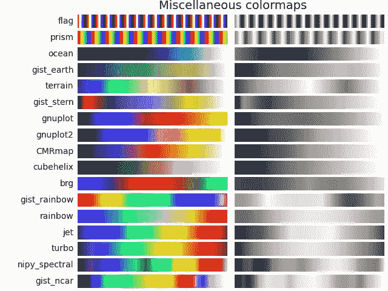

使用 [matplotlib](https://matplotlib.org/3.5.0/tutorials/colors/colormaps.html) 生成

**多做一点:**如果你觉得你需要自己的调味汁，你可以在 Paint.net 或 Photoshop 上得到一些这样的彩色地图，通过调整色调和饱和度来开发新的创意。然后，您需要复制颜色或直接编写更改脚本。这里有两个样本玩喷射和立方体螺旋颜色地图色调和饱和度:

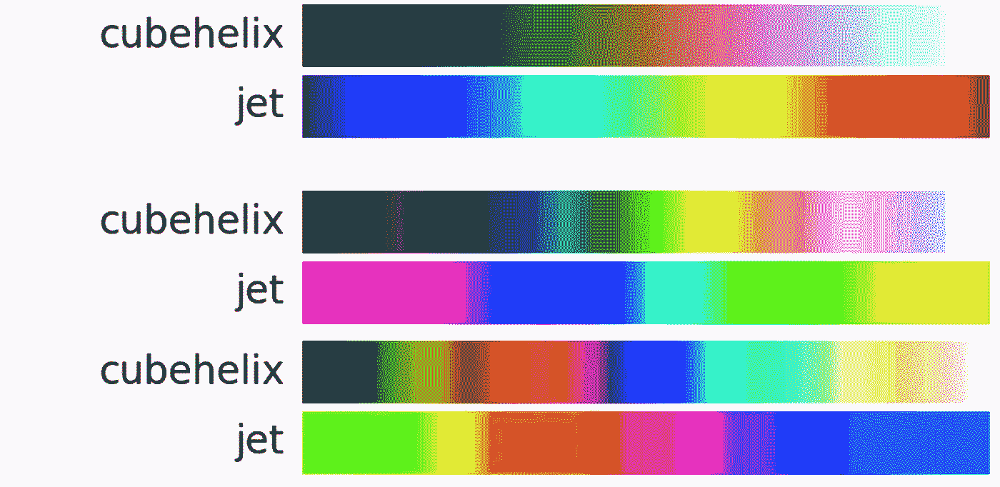

使用 [matplotlib](https://matplotlib.org/3.5.0/tutorials/colors/colormaps.html) 生成。由作者编辑。

# #6 尽可能使用语义

想象一下比较美国、巴西和加拿大。你会用哪种颜色？如果是脸书、推特、Youtube 和 Instagram，你会怎么选择？我们很自然地把国家和他们的国旗联系在一起，把品牌和他们的标志联系在一起。这种联系可能意味着某些选择。例如，考虑以下情况:

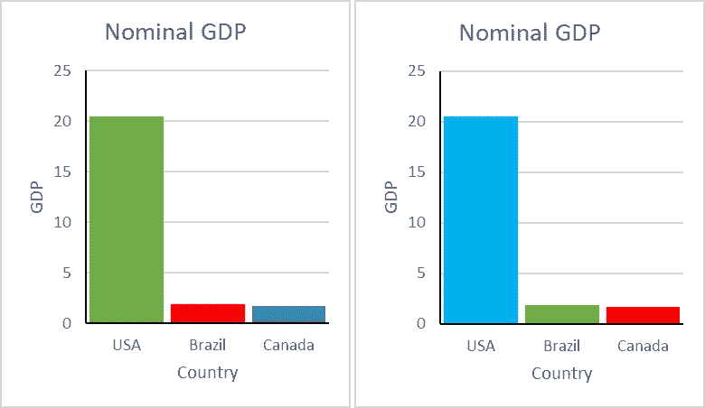

图片由作者提供。来自国际货币基金组织的数据

左边是绿色的美国，红色的巴西，蓝色的加拿大。这完全是武断的。在右边，我把美国重新映射成浅蓝色，巴西重新映射成绿色，加拿大重新映射成红色。如果你熟悉这些国家，你会把这些颜色和各自的国旗联系起来。这是语义的显式使用。你可能会说这里的蓝色比美国国旗上使用的颜色浅，但这比把它涂成绿色(或巴西涂成红色)要好。

对了，剧情显示美国 GDP 在 20 左右… 20 什么？几十亿？万亿？你可能知道答案，但不是每个人都知道。还有，GDP 代表什么？这是一个故意的错误标签的例子(检查提示 1)。标题应该是“国内生产总值(GDP)”，而轴标签应该是“数万亿美元”。

第二个例子是对 2020 年美国总统选举结果的有问题的解读:

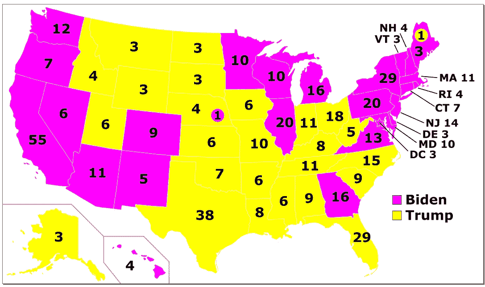

来源:[维基百科](https://en.wikipedia.org/wiki/File:ElectoralCollege2020.svg)。由作者编辑。

除了蓝色和红色，没有任何媒体会把民主党和共和党描绘成其他颜色(请看[原版](https://en.wikipedia.org/wiki/File:ElectoralCollege2020.svg))。这里的整个想法是利用观众与我们想要呈现的内容之间已经存在的关系，这样他们就可以直观地理解数据。

**多做一点:**有时，语义可能非常微妙，并且仅限于特定的受众。例如，在下图中，颜色表示算法的来源。绿色解决方案是基线，蓝色解决方案来自[子弹库](https://pybullet.org/wordpress/)，其余的方法来自不同的来源。这种关系对于那些不熟悉主题的人来说不是很明显，但是对他们有很大的帮助。

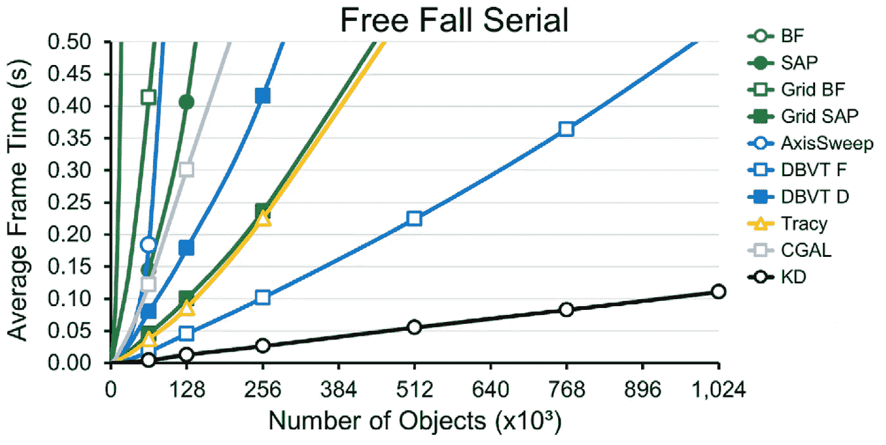

图片由[作者](https://onlinelibrary.wiley.com/doi/full/10.1111/cgf.13884)

# #7 强调关系

再次考虑上面的情节。一些系列使用开放标记(例如，未填充的正方形)，而其他系列使用封闭标记(例如，填充的正方形)。这是显示解决方案相关的简便方法。例如，两个 DBVT 系列共享方形标记，一个打开，另一个关闭。BF/SAP 和 Grid BF/SAP 也是如此。

有很多微妙的方式来表现关系。例如，仔细分配标记可以创造奇迹。除此之外，我们还可以使用其他工具，比如线条样式和填充阴影。例如，如果我们有并行 DBVT F 和并行 DBVT D 解决方案，我们可以用虚线表示串行方法，用实线表示并行方法。同样，我们可以在平行的对应物上附加一个 P。

以下是关于如何使用自定义标记关联系列的一些想法:

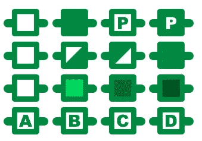

传达标记之间关系的简单想法。作者图片

第一个选项允许我们呈现两个变量(填充/未填充和串行/并行)。第二行可以表示基线方法、优化 A、优化 B 和 A + B。第三行可以显示一些属性的增加的级别，例如优化积极性。最后，第四行使用字母，允许 4 个以上的变体。

多做一点:事实上，不要。取而代之的是一个表格或多个图。有时候，最好是让事情更简单、更有重点，而不是试图将所有事情都塞进一个单一的主情节中。

# #8 注意灰度

虽然听起来可能很老套，但很多人还是会打印东西，而且很多时候，他们不会用彩色来做。因此，请始终确保您的地块在有限的颜色设置下工作。如果你认为这太多了，就把这当作一个对比检查。如果您的绘图仍然在灰度下工作，则您选择的配色方案有足够的对比度来取悦广大观众。

考虑下面的灰度图:

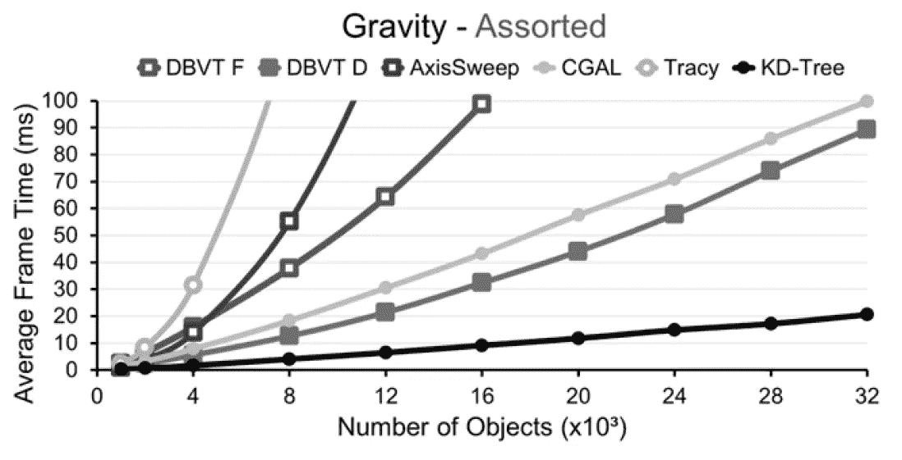

图片由[作者](https://onlinelibrary.wiley.com/doi/abs/10.1111/cgf.13529)提供。

尽管没有颜色，通过跟随标记和整体灰色阴影来识别每条曲线还是相对容易的。此外，注意唯一的黑色曲线相对于其他曲线的权重。我建议在你最想引起注意的地方使用黑色。例如，你自己提出的方法。

**更进一步:**更极端的说法是，你也可以把所有东西都变成黑色，以模拟一台有故障的打印机。下面是上面全黑的情节。我们不再能够完全区分 DBVT F 和 AxisSweep 或者 CGAL 和 KD-Tree，但是我们仍然能够理解发生了什么。你可以使用 Paint.Net[的颜色曲线功能或者改变对比度来复制这个。](https://www.getpaint.net)

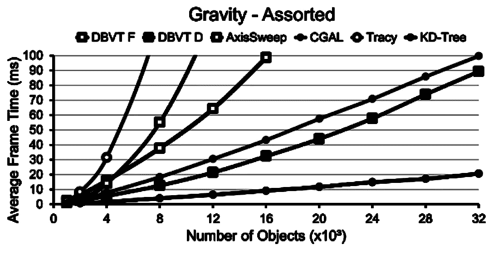

图片由[作者](https://onlinelibrary.wiley.com/doi/abs/10.1111/cgf.13529)提供。

# #9 作为灵感来源的画廊

大多数情况下，您想要绘制的并不是一个简单的 2D 数据集，该数据集很容易放入散点图中。取而代之的是一个多维度或者层次性的问题，没有清晰的可视化。在这种情况下，你最好的选择是浏览画廊寻找灵感。

我的三大灵感来源是:

*   [Seaborn 的示例图库](https://seaborn.pydata.org/examples/index.html)
*   [Plotly 的文档](https://plotly.com/python/plotly-fundamentals/)
*   [带代码的论文简讯](https://paperswithcode.com/newsletter)

这里的想法是看一眼每个样本，然后想，“如果我这样绘制，我的数据可能会是什么样子？”或者，“这个图显示了我需要的维数吗？”例如，[这个](https://seaborn.pydata.org/examples/kde_ridgeplot.html)可以在一个压缩空间中显示几个变量，而[绘图矩阵](https://seaborn.pydata.org/examples/pair_grid_with_kde.html)可以是一个很好的方式来一次可视化几个维度。从 Plotly 来看，有一些很酷的可视化效果，比如[风玫瑰图](https://plotly.com/python/wind-rose-charts/)和[三元图](https://plotly.com/python/ternary-contour/)。

你可能想知道为什么《带代码的报纸》会在这里。如果你现在就去看看，你会发现，除了阅读建议，他们还从他们的作品中挑选了最具知识性的图表和情节。如果你问我，这是一个可视化的灵感金矿。做我的客人，绕着最后几期走一走。

在某种程度上，相关工作也是一种画廊。例如，假设您正在撰写一篇关于小说分类体系结构的学术论文，但不确定要绘制什么以及如何绘制。对你来说，有很多关于这个话题的论文，你可以从中得到一些启发。把你看到的每一个不可思议的情节都保存一张图，以备后用，这是一个明智的投资。[这里是一个很好的起点。](https://sh-tsang.medium.com/overview-my-reviewed-paper-lists-tutorials-946ce59fbf9e)

暂时就这些了。如果你对这篇文章有任何问题，或者你想让我对你的任何视觉化的东西发表评论，请随意评论或者[联系我](https://www.linkedin.com/in/ygorreboucas/)。你也可以订阅每当我在这里发布[的时候就会收到通知](https://ygorserpa.medium.com/subscribe)。我尽我所能每周出版。

如果你是中新，我强烈推荐[订阅](https://ygorserpa.medium.com/membership)。对于数据和 IT 专业人员来说，中型文章是 StackOverflow 的完美组合，对于新手来说更是如此。当注册或[为我买杯咖啡](https://www.buymeacoffee.com/ygorreboucas):)时，请考虑使用[我的会员链接](https://ygorserpa.medium.com/membership)

感谢阅读:)