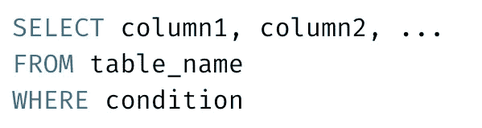
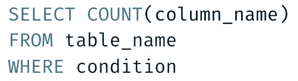
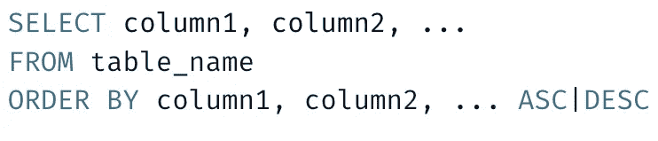
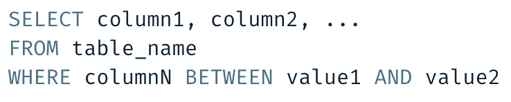
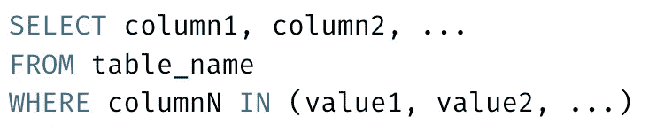
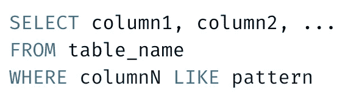

# 帮助我获得第一份数据分析师工作的 9 个 SQL 核心概念

> 原文：<https://towardsdatascience.com/9-sql-core-concepts-that-helped-me-get-my-first-data-analyst-job-a582f892276f>

## 掌握 SQL 的第一步


图片来自 Shutterstock，授权给 Frank Andrade

如果我必须重新开始我的数据科学之旅，我会首先学习 SQL。

我不太喜欢 SQL，但最有可能的是，你需要 SQL 来通过数据科学/分析师面试，无论你的职位如何，你都会经常使用 SQL 来创建查询并与公司的数据库进行交互。

以下是帮助我通过第一次数据分析师面试的 9 个 SQL 核心概念。

## 数据

为了展示您应该知道的 9 个 SQL 核心概念，我们将使用一个包含 100 多名顶级足球运动员信息的表。您可以在这里下载这些数据[，并将其导入您的数据库。](https://drive.google.com/file/d/1ZpBC71J-SFbA0tgJjWiNy58QA57YT1I8/view?usp=sharing)

下面是我们将使用的表格，我将其命名为`players_description`。

```
Initial table: players_description

+----+-------------------+------------+-----+-----+---------------+
| ID |     FirstName     |  LastName  | Age | ... | Team_Position |
+----+-------------------+------------+-----+-----+---------------+
|  1 | Lionel Andrés     | Messi      |  32 | ... | RW            |
|  2 | Cristiano Ronaldo | dos Santos |  34 | ... | LW            |
|  3 | Neymar            | da Silva   |  27 | ... | CAM           |
|  4 | Jan               | Oblak      |  26 | ... | GK            |
|  5 | Eden              | Hazard     |  28 | ... | LW            |
|  6 | Kevin             | De Bruyne  |  28 | ... | CAM           |
|  7 | Marc-André        | ter Stegen |  27 | ... | GK            |
|  8 | Virgil            | van Dijk   |  27 | ... | LF            |
|  9 | Luka              | Modrić     |  33 | ... | CM            |
| 10 | Mohamed           | Salah      |  27 | ... | RW            |
| .. |     ...           |   ...      | ... | ... | ...           |
+----+-------------------+------------+-----+-----+---------------+
```

## 1.选择指令

SELECT 语句允许我们从数据库中选择数据。这是 SQL 中最常见的语句，所以请记住下面的语法。


让我们从`players_description`表中选择列`FirstName`、`LastName`和`Height`。

```
Query:**SELECT** FirstName, LastName, Height
**FROM** players_description;Output:+---------------------+--------------+--------+
|      FirstName      |   LastName   | Height |
+---------------------+--------------+--------+
| "Lionel Andrés"     | Messi        |    170 |
| "Cristiano Ronaldo" | "dos Santos" |    187 |
| Neymar              | "da Silva"   |    175 |
| Jan                 | Oblak        |    188 |
| Eden                | Hazard       |    175 |
| Kevin               | "De Bruyne"  |    181 |
| Marc-André          | "ter Stegen" |    187 |
| Virgil              | "van Dijk"   |    193 |
| Luka                | Modrić       |    172 |
| Mohamed             | Salah        |    175 |
+---------------------+--------------+--------+
```

## 2.选择不同的语句

每当我们想从一列中选择唯一的元素时，我们就使用 SELECT DISTINCT 语句。


让我们从`players_description`表中看到独特的`Team_Position`。

```
Query:**SELECT** **DISTINCT** Team_Position
**FROM** players_description;Output:+---------------+
| Team_Position |
+---------------+
| RW            |
| LW            |
| CAM           |
| GK            |
| LF            |
| CM            |
| ST            |
| CDM           |
| LM            |
| RM            |
| RB            |
| CF            |
| CB            |
| RAM           |
| LAM           |
+---------------+
```

## 3.WHERE 子句

WHERE 子句允许我们在查询中添加一个条件。只有满足条件的值才会在输出表中返回。



让我们创建一个查询，只过滤那些`Height`大于 180cm 的球员。

```
Query:**SELECT** FirstName, LastName, Height
**FROM** players_description
**WHERE** Height>180;Output:+---------------------+--------------+--------+
|      FirstName      |   LastName   | Height |
+---------------------+--------------+--------+
| "Cristiano Ronaldo" | "dos Santos" |    187 |
| Jan                 | Oblak        |    188 |
| Kevin               | "De Bruyne"  |    181 |
| Marc-André          | "ter Stegen" |    187 |
| Virgil              | "van Dijk"   |    193 |
| Kalidou             | Koulibaly    |    187 |
| Harry               | Kane         |    188 |
| Alisson             | Becker       |    191 |
| David               | "De Gea"     |    192 |
| Giorgio             | Chiellini    |    187 |
+---------------------+--------------+--------+
```

## 4.COUNT()、AVG()和 SUM()函数

SQL 中一些最常见的函数是 COUNT“COUNT()”、average“AVG()”和 SUM“SUM()”。

如果我们考虑一下以前学过的 WHERE 子句，下面是 COUNT()、AVG()和 SUM()的语法。



让我们看看我们能从巴塞罗那俱乐部得到什么启示。

```
Query 1: Let's see how many Barcelona players are in our table**SELECT COUNT**(Playerid)
**FROM** players_description
**WHERE** Club="FC Barcelona";Output 1:+-----------------+
| COUNT(Playerid) |
+-----------------+
|              15 |
+-----------------+Query 2: Calculate the average height of Barcelona players**SELECT AVG**(Height)
**FROM** players_description
**WHERE** Club="FC Barcelona";Output 2:+-------------+
| AVG(Height) |
+-------------+
|    181.2667 |
+-------------+Query 3: Sum the wage of Barcelona players**SELECT** **SUM**(Wage_eur)
**FROM** players_description
**WHERE** Club="FC Barcelona";Output 3:+---------------+
| SUM(Wage_eur) |
+---------------+
|          3945 |
+---------------+
```

## 5.以...排序

每当我们想对输出表进行升序或降序排序时，我们就使用 ORDER BY 关键字。



让我们找出谁是我们桌上最高的球员。

```
Query:**SELECT** FirstName, LastName, Height
**FROM** players_description
**ORDER** **BY** Height **DESC**;Output:+-----------+-------------+--------+
| FirstName |  LastName   | Height |
+-----------+-------------+--------+
| Thibaut   | Courtois    |    199 |
| Gianluigi | Donnarumma  |    196 |
| Jiří      | Pavlenka    |    196 |
| Wojciech  | Szczęsny    |    195 |
| Niklas    | Süle        |    195 |
| Zlatan    | Ibrahimović |    195 |
| Gerard    | Piqué       |    194 |
| Virgil    | "van Dijk"  |    193 |
| Samir     | Handanovič  |    193 |
| Manuel    | Neuer       |    193 |
+-----------+-------------+--------+
```

## 6.和/或运算符

我们可以将 WHERE 子句与不同的运算符(如 AND/OR)结合使用。

下面是要使用的语法。


这是这些运算符之间的区别。

*   如果所有条件都为真，则显示一条记录
*   或者在任何条件为真时显示一条记录

让我们看一些用 AND/OR 的例子。

```
Query: Show players from France (FRA) with height greater than 180cm.**SELECT** FirstName, LastName, Height, Nationality
**FROM** players_description
**WHERE** Height>180 **AND** Nationality="FRA";Output:+-----------+-----------+--------+-------------+
| FirstName | LastName  | Height | Nationality |
+-----------+-----------+--------+-------------+
| Paul      | Pogba     |    191 | FRA         |
| Hugo      | Lloris    |    188 | FRA         |
| Aymeric   | Laporte   |    189 | FRA         |
| Karim     | Benzema   |    185 | FRA         |
| Samuel    | Umtiti    |    182 | FRA         |
| Raphaël   | Varane    |    191 | FRA         |
| Clément   | Lenglet   |    186 | FRA         |
| Lucas     | Hernández |    182 | FRA         |
| Stéphane  | Ruffier   |    188 | FRA         |
+-----------+-----------+--------+-------------+Query: Show players that are from France (FRA) or that have a height greater than 180cm.**SELECT** FirstName, LastName, Height, Nationality
**FROM** players_description
**WHERE** Height>180 **OR** Nationality="FRA";Output:+---------------------+--------------+--------+-------------+
|      FirstName      |   LastName   | Height | Nationality |
+---------------------+--------------+--------+-------------+
| "Cristiano Ronaldo" | "dos Santos" |    187 | PRT         |
| Jan                 | Oblak        |    188 | SGP         |
| Kevin               | "De Bruyne"  |    181 | BLX         |
| Marc-André          | "ter Stegen" |    187 | DEU         |
| Virgil              | "van Dijk"   |    193 | NPL         |
| Kylian              | Mbappé       |    178 | FRA         |
| Kalidou             | Koulibaly    |    187 | SEN         |
| Harry               | Kane         |    188 | UK          |
| Alisson             | Becker       |    191 | BRA         |
| David               | "De Gea"     |    192 | ESP         |
+---------------------+--------------+--------+-------------+
```

## 7.操作员之间

BETWEEN 运算符选择给定范围内的值(例如，数字、文本或日期)。该运算符是包含性的，这意味着开始值和结束值都包含在内。



让我们来看看哪些球员年龄在 20 岁到 30 岁之间。

```
Query:**SELECT** FirstName, LastName, Age
**FROM** players_description
**WHERE** Age **BETWEEN** 20 **AND** 30;Output:+------------+--------------+-----+
| FirstName  |   LastName   | Age |
+------------+--------------+-----+
| Neymar     | "da Silva"   |  27 |
| Jan        | Oblak        |  26 |
| Eden       | Hazard       |  28 |
| Kevin      | "De Bruyne"  |  28 |
| Marc-André | "ter Stegen" |  27 |
| Virgil     | "van Dijk"   |  27 |
| Mohamed    | Salah        |  27 |
| Kylian     | Mbappé       |  20 |
| Kalidou    | Koulibaly    |  28 |
| Harry      | Kane         |  25 |
+------------+--------------+-----+
```

## 8.在/不在运算符中

当我们想要在 WHERE 子句中指定多个值时，我们使用 IN 操作符。



让我们得到一份为巴塞罗那俱乐部或皇家马德里队效力的球员名单。

```
Query:**SELECT** FirstName, LastName, Age, Club
**FROM** players_description
**WHERE** Club **IN** ('FC Barcelona', 'Real Madrid');Output:+-----------------+--------------+-----+----------------+
|    FirstName    |   LastName   | Age |      Club      |
+-----------------+--------------+-----+----------------+
| "Lionel Andrés" | Messi        |  32 | "FC Barcelona" |
| Eden            | Hazard       |  28 | "Real Madrid"  |
| Marc-André      | "ter Stegen" |  27 | "FC Barcelona" |
| Luka            | Modrić       |  33 | "Real Madrid"  |
| Sergio          | Ramos        |  33 | "Real Madrid"  |
| Luis            | Alberto      |  32 | "FC Barcelona" |
| Sergio          | Busquets     |  30 | "FC Barcelona" |
| Antoine         | Griezmann    |  28 | "FC Barcelona" |
| Thibaut         | Courtois     |  27 | "Real Madrid"  |
| Gerard          | Piqué        |  32 | "FC Barcelona" |
+-----------------+--------------+-----+----------------+
```

## 9.像-不像运算符

当我们想要在列中搜索特定的模式时，我们使用 LIKE 操作符。



我们可以在模式中使用不同的通配符。以下是两种最常见的通配符:

*   %:表示零个、一个或多个字符
*   _:表示单个字符

让我们过滤那些名字以字母“s”开头的玩家

```
Query:**SELECT** FirstName, LastName
**FROM** players_description
**WHERE** FirstName **LIKE** 's%';Output:+-----------+------------------+
| FirstName |     LastName     |
+-----------+------------------+
| Sergio    | Agüero           |
| Sergio    | Ramos            |
| Sergio    | Busquets         |
| Samir     | Handanovič       |
| Sadio     | Mané             |
| Samuel    | Umtiti           |
| Sergej    | Milinković-Savić |
| Saúl      | Ñíguez           |
| Serge     | Gnabry           |
| Stefan    | "de Vrij"        |
| Stéphane  | Ruffier          |
| Salvatore | Sirigu           |
| Sokratis  | Papastathopoulos |
| Sergio    | Canales          |
+-----------+------------------+
```

您可以使用`%`和`_`创建许多模式。[在这里](https://www.w3schools.com/sql/sql_like.asp)你可以找到其中的一些。

学习 SQL —数据专业人员最需要的技能。 [**加入我的 20k+人电子邮件列表，获取我的免费 SQL 备忘单。**](https://frankandrade.ck.page/f2fbbdc6db)

如果你喜欢阅读这样的故事，并想支持我成为一名作家，可以考虑报名成为一名媒体成员。每月 5 美元，让您可以无限制地访问数以千计的 Python 指南和数据科学文章。如果你使用[我的链接](https://frank-andrade.medium.com/membership)注册，我会赚一小笔佣金，不需要你额外付费。

[](https://frank-andrade.medium.com/membership) 