# 比条形图更引人注目的 9 种 Python 可视化

> 原文：<https://towardsdatascience.com/9-visualizations-that-catch-more-attention-than-a-bar-chart-72d3aeb2e091>

## 使用 Python 创建引人注目的图表，以代替条形图。


照片由[巴迪·阿巴斯](https://unsplash.com/@bady) 在 [Unsplash](https://unsplash.com?utm_source=medium&utm_medium=referral) 上拍摄

条形图是一种二维图形，在 X 轴或 Y 轴上有矩形条。我们使用矩形条通过比较高度或长度来比较离散类别中的值。这个图表在数据可视化中很典型，因为它易于创建和理解。

但是，在某些情况下，例如创建信息图或向公众展示需要引起人们注意的数据，条形图可能不够吸引人。有时使用过多的条形图可能会导致显示效果不佳。

数据可视化中有多种图表。实际上，图形可以改进或改变形式。本文将展示九个想法，你不仅可以用它们来代替条形图，还可以让获得的结果看起来更好。

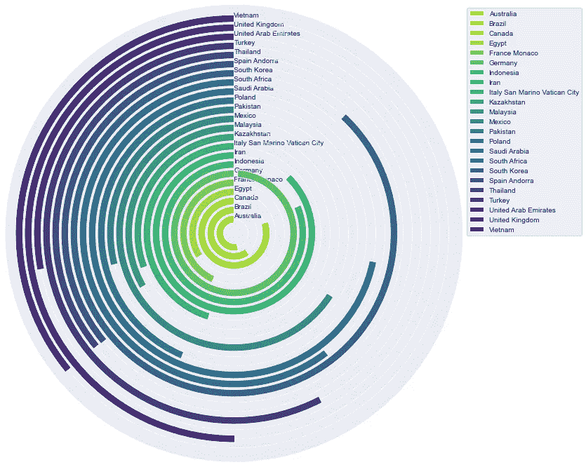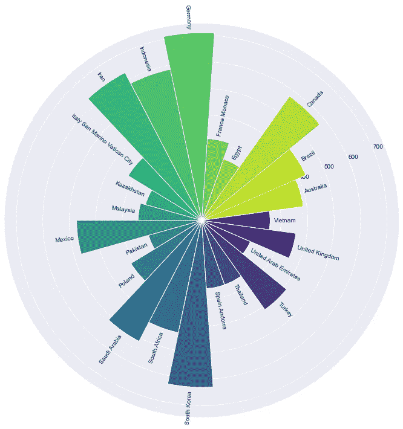

本文中有两个可视化的例子，可以用来代替条形图来引起注意。图片由作者提供。

## **免责声明！！**

这篇文章的意图不是反对条形图。每个图表都有它的优点。本文旨在展示比条形图更能吸引注意力的可视化效果。顺便说一句，它们并不完美；它们也各有利弊。

让我们开始吧。

# 检索数据

从导入库开始

```
import numpy as np
import pandas as pd
import matplotlib.pyplot as plt
import seaborn as sns%matplotlib inline
```

为了表明本文中提到的方法可以应用于现实世界的数据，我们将使用维基百科上按二氧化碳排放量列出的国家列表中的数据。这篇文章展示了 2018 年二氧化碳排放量的主权国家和领土名单。

本文根据[知识共享署名-类似共享 3.0 未授权许可](https://en.wikipedia.org/wiki/Wikipedia:Copyrights)的条款使用了来自维基百科的数据。

我按照有用的步骤从[网络下载数据，将维基百科表抓取到数据帧](https://medium.com/analytics-vidhya/web-scraping-a-wikipedia-table-into-a-dataframe-c52617e1f451)。

使用 BeautifulSoup 解析获得的数据

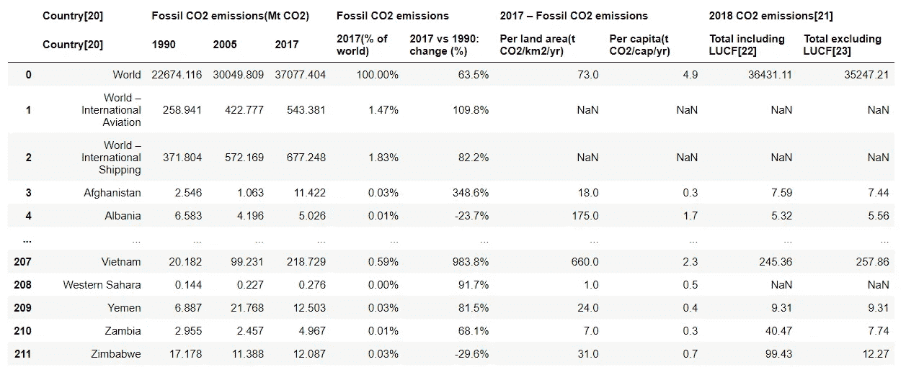

例如，我将选择最后一列，2018 年二氧化碳排放量/总排放量，不包括 LUCF(土地利用-变化和林业)，并只过滤二氧化碳排放量在 200 到 1000 [MTCO2e](https://www.epa.gov/sites/default/files/2014-12/documents/ghgcalculatorhelp.pdf) (二氧化碳当量公吨)之间的国家。

如果您想要使用其他列或更改 CO2 排放范围，可以修改以下代码。

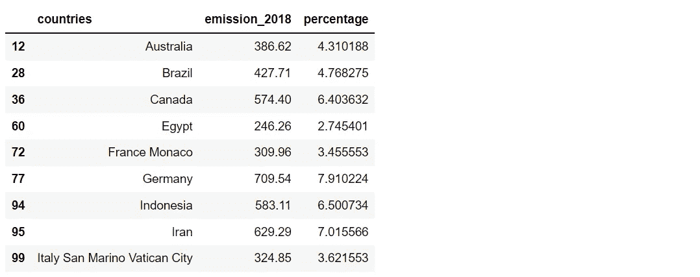

得到数据帧后，我们将对二氧化碳排放量进行分类，得到另一个数据帧。正常数据帧和排序数据帧都将用于以后的绘图。创建两个数据帧的原因是为了表明结果可能不同。

```
df_s = df.sort_values(by='emission_2018', ascending=False)
df_s.head(9)
```

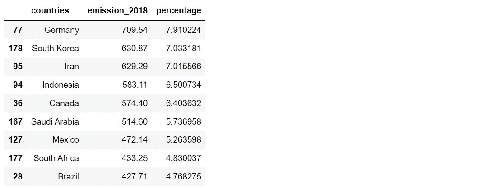

现在一切都准备好了，让我们绘制一个条形图，以便稍后与其他可视化结果进行比较。

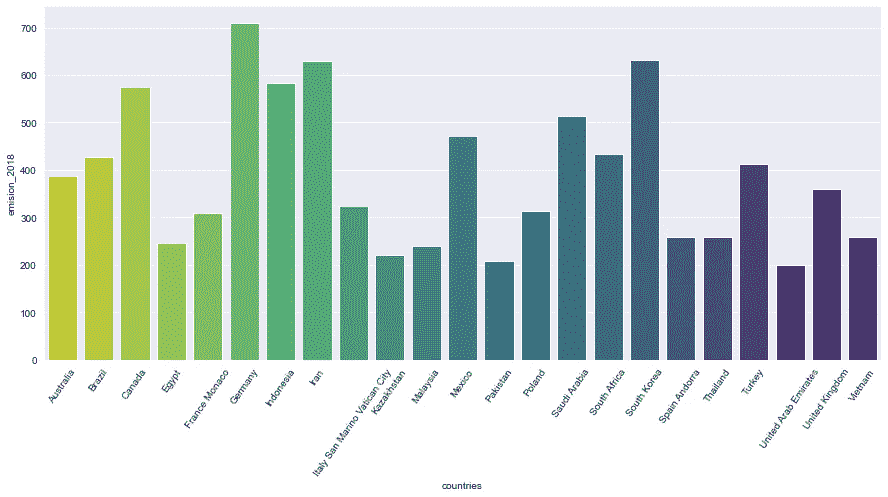

柱状图显示了 2018 年各国二氧化碳排放量在 200 到 1000[mtco 2e](https://www.epa.gov/sites/default/files/2014-12/documents/ghgcalculatorhelp.pdf)之间。数据来自[维基百科](https://en.wikipedia.org/wiki/List_of_countries_by_carbon_dioxide_emissions)。图片由作者提供。

在继续之前，我们将定义一个函数来提取一个颜色列表，供以后在每个可视化中使用。

应用该函数获得颜色列表。

```
pal_vi = get_color('viridis_r', len(df))
pal_plas = get_color('plasma_r', len(df))
pal_spec = get_color('Spectral', len(df))
pal_hsv = get_color('hsv', len(df))
```

# 形象化

在本文中，有 9 个可视化，我们可以将它们分为两组:

**修改矩形条**

*   圆形条形图(又名赛道图)
*   放射状条形图
*   树形图
*   华夫饼图表
*   交互式条形图

**改变形式**

*   圆形分格统计图表
*   雷达图
*   泡泡图
*   圆形包装

1.  **用圆形条形图改变方向(又名赛道图)**

圆形条形图的概念是表示围绕圆心的条形。每个小节从相同的度数开始，并向相同的方向移动。能完成循环的人价值最高。

这是一个吸引读者注意力的好主意。顺便说一句，停在圆圈中间的小节很难读。请注意，每个小节的长度并不相等。靠近中心的长度会比远离中心的长度短。

用数据框画一个圆形条形图


圆形条形图显示了 2018 年各国二氧化碳排放量在 200 至 1,000 MTCO2e 之间。图片由作者提供。

用排序后的数据框绘制一个圆形条形图

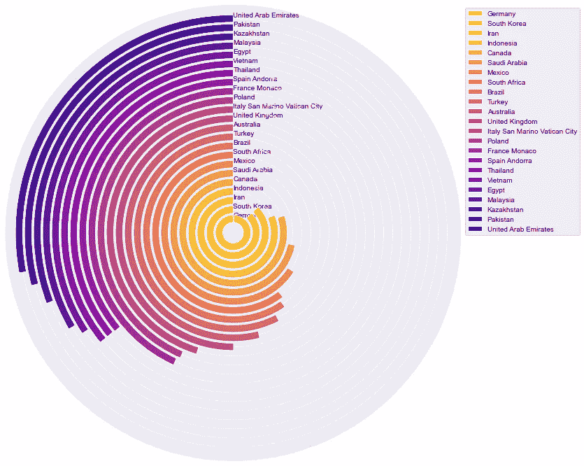

圆形条形图显示了 2018 年各国二氧化碳排放量在 200 至 1,000 MTCO2e 之间。图片由作者提供。

**2。从中心开始用放射状条形图**

放射状条形图的概念是改变条形的方向。每个条形不是具有相同的方向，而是从圆心开始，以不同的方向移动到圆的边缘。

请注意，彼此不相邻的条形可能很难比较。标签沿着径向条处于不同的角度；这会给用户带来不便。

用数据框绘制一个径向条形图


放射状条形图显示了 2018 年各国二氧化碳排放量在 200 至 1,000 MTCO2e 之间。图片由作者提供。

用排序后的数据框绘制一个径向条形图

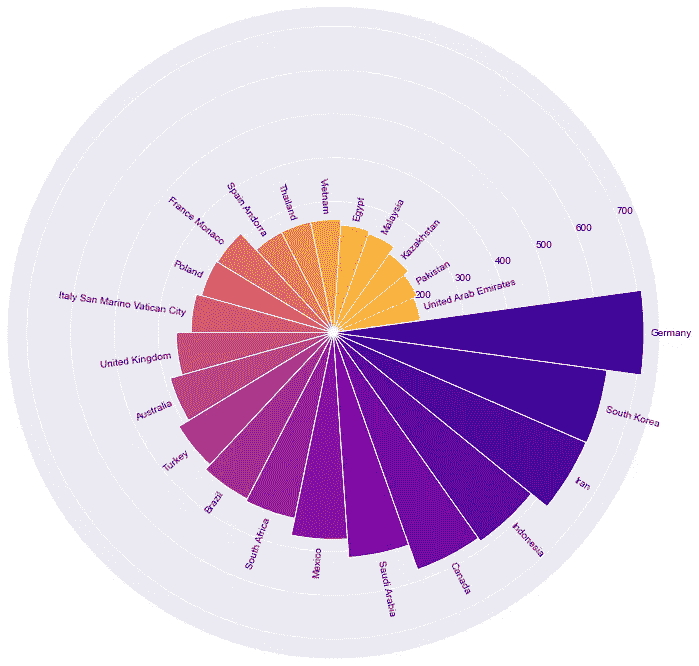

放射状条形图显示了 2018 年各国二氧化碳排放量在 200 至 1,000 MTCO2e 之间。图片由作者提供。

**3。使用区域与树形图进行比较**

树形图通过使用矩形区域来帮助显示分层数据。即使我们的数据没有层次结构，我们仍然可以通过只显示一个层次结构级别来应用树形图。

绘制树形图时，通常数据从最大值开始降序排列。如果有许多矩形，请注意小的可能很难阅读或区分。

用[创建一个互动的树形图](https://plotly.com/python/treemaps/):

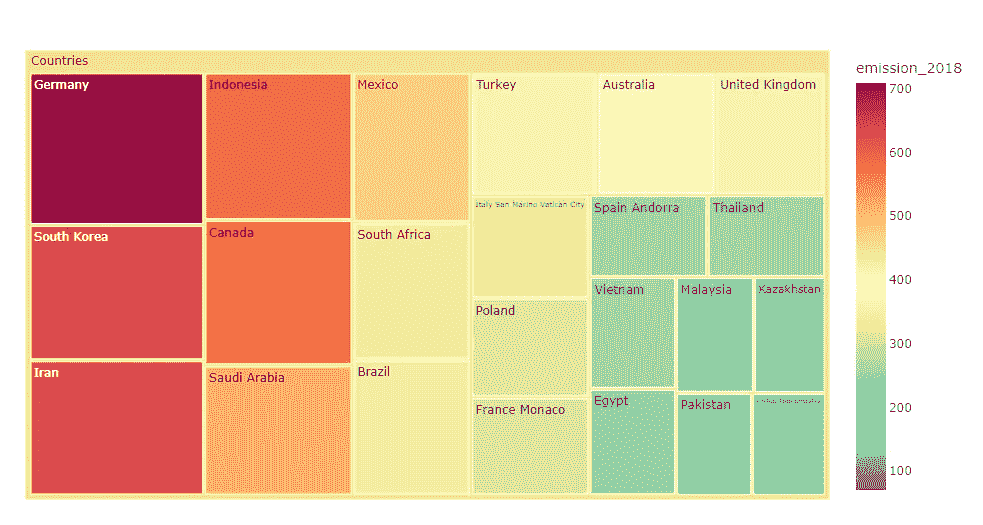

Treemap 显示了 2018 年各国的二氧化碳排放量在 200 至 1,000 MTCO2e 之间。图片由作者提供。

**4。将小方块与华夫饼图结合**

除了这个奇特的名字，华夫饼干图也是创建信息图的一个好主意。它由许多小方块组合成一个大矩形，使结果看起来像一个华夫饼干。

通常，这些方块以 10 乘 10 的布局排列，以显示比率或进度。顺便说一下，可以改变方块的数量以适应数据。

绘制一张显示每个国家二氧化碳排放量的饼状图

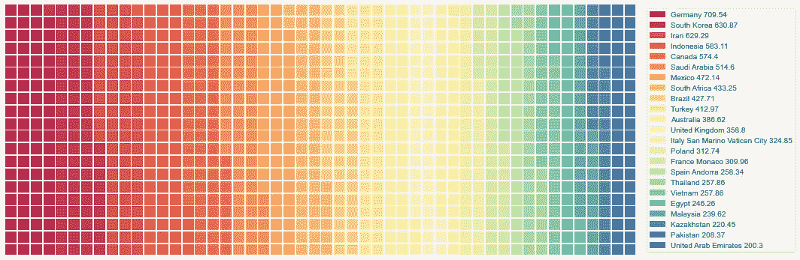

华夫格图显示了 2018 年各国二氧化碳排放量在 200 至 1,000 MTCO2e 之间。图片由作者提供。

结果可能看起来很吸引人，色彩丰富，但很难区分颜色的深浅。这可以被认为是华夫格图的局限性。因此，可以说华夫格图适用于比较几类数据。

为了避免阅读上的困难，让我们将每个国家一个接一个地与其他国家相对照。然后，将它们组合成照片拼贴画。使用下面的代码，请考虑这些图将在您的计算机上导出，以便以后导入。

绘制每个国家的华夫饼图表

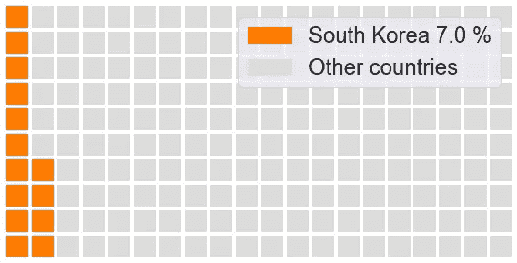

2018 年，一个国家的二氧化碳排放量与其他国家的二氧化碳排放量之间的饼状图示例。图片由作者提供。

现在我们有了每个国家的华夫饼图表，让我们定义一个函数来创建一个照片拼贴。我在下面找到了一个很棒的代码，把 Stack Overflow( [link](https://stackoverflow.com/questions/35438802/making-a-collage-in-pil) )的情节组合起来。

应用该函数获得一个照片拼贴

```
# to create a fit photo collage: 
# width = number of columns * figure width
# height = number of rows * figure heightget_collage(5, 5, 2840, 1445, save_name, 'Collage_waffle.png')
```

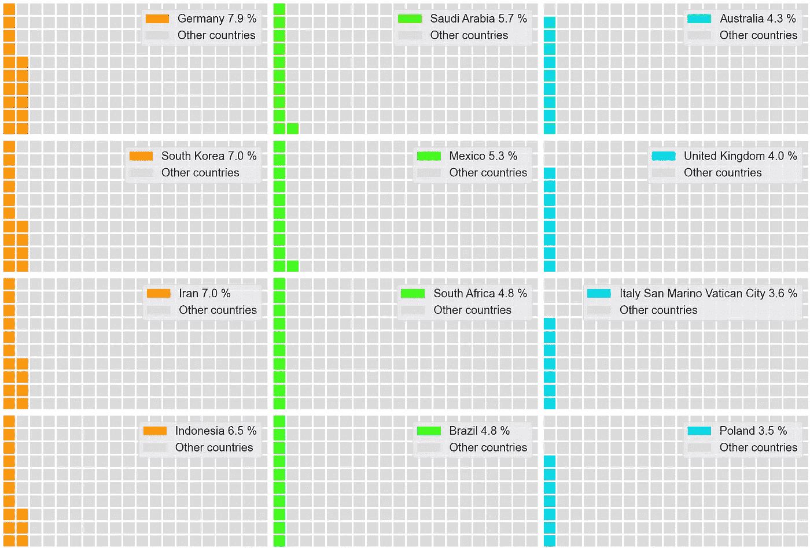

照片拼贴的一部分，结合了每个国家的华夫饼图表。图片由作者提供。

**5。除了使条形图互动之外什么也不改变**

我们可以把一个简单的条形图变成一个交互式的。如果您想继续使用条形图，这是一个好主意。获得的结果可以播放或过滤的方式，用户想要的。是一个有用的库，可以帮助你轻松地创建一个交互式的饼状图。

唯一关心的是向最终用户显示交互式条形图；应该有一个说明解释如何使用该功能。

绘制交互式条形图

交互式条形图显示了 2018 年各国二氧化碳排放量在 200 至 1,000 MTCO2e 之间。图片由作者提供。

**6。在饼图中显示百分比**

饼图是数据可视化中的另一种典型图表。它基本上是一个圆形的统计图，分成若干片以显示数字比例。普通的饼状图可以转换成交互式的饼状图，以便可以播放或过滤结果。我们可以使用 [Plotly](https://plotly.com/python/pie-charts/) 创建一个交互式饼图。

与使用交互式条形图一样，如果读者是最终用户，应该有一个说明来解释如何使用该功能。

绘制交互式饼图

交互式饼图显示了 2018 年各国二氧化碳排放量在 200 至 1,000 MTCO2e 之间。图片由作者提供。

**7。用雷达图围绕一个圆绘图**

[雷达图](https://en.wikipedia.org/wiki/Radar_chart)是显示[多元](https://en.wikipedia.org/wiki/Multivariate_statistics)数据的图形化方法。相比之下，条形图主要用于[分类](https://en.wikipedia.org/wiki/Categorical_variable)数据。为了应用带有分类数据的雷达图，我们可以将每个分类视为多元数据中的一个变量。每个类别的值将从中心绘制。

对于许多类别，用户会发现很难比较位置不相邻的数据。这可以通过应用带有分类数据的雷达图来解决。因此，用户可以确定哪些值高于或低于其他值。

用数据框绘制雷达图。

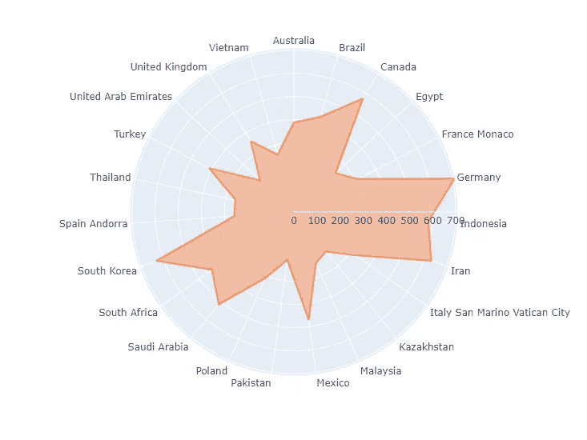

雷达图显示，2018 年各国的二氧化碳排放量在 200 至 1,000 MTCO2e 之间。图片由作者提供。

用排序后的数据框绘制雷达图。


雷达图显示，2018 年各国的二氧化碳排放量在 200 至 1,000 MTCO2e 之间。图片由作者提供。

**8。在气泡图中使用多个圆圈**

理论上，气泡图是一个[散点图](https://en.wikipedia.org/wiki/Scatter_plot)，具有不同大小的数据点。这是显示三维数据、X 值、Y 值和数据大小的理想绘图。

应用没有 X 和 Y 值的分类数据的气泡图的一个好处是，我们可以按照我们想要的方式定位气泡。例如，下面的代码显示了如何垂直绘制气泡。

创建 X 值、Y 值和标签的列表。然后，将它们作为列添加到数据框架中。如果您想要在水平方向绘制气泡，请在 X 和 Y 列之间交替值。

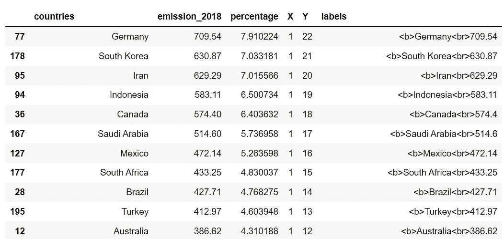

绘制垂直气泡图

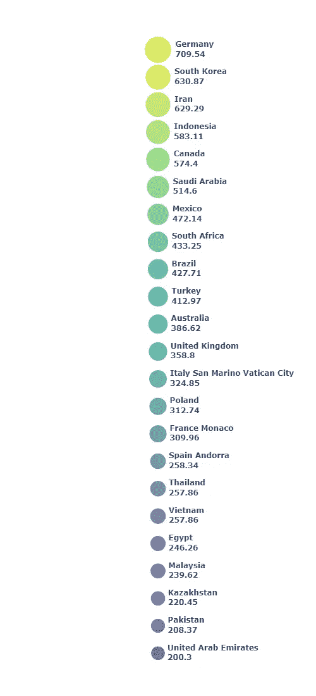

垂直气泡图显示了 2018 年各国二氧化碳排放量在 200 至 1,000 MTCO2e 之间。图片由作者提供。

为了更进一步，我们可以用不同的形式显示气泡。让我们试着把它们画在一个圆形的方向上。

为此，我们需要计算 X 和 Y 坐标。从 360 度除以行数开始。然后，用余弦和正弦函数转换度数，分别得到 X 和 Y 坐标。

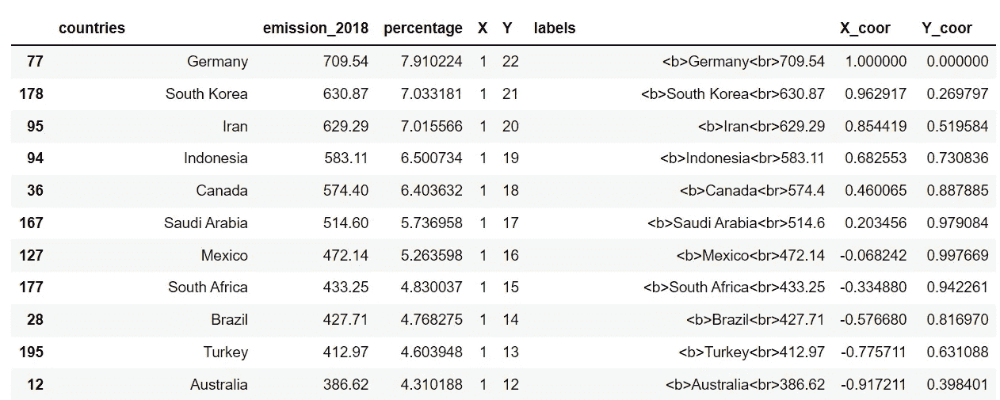

沿圆周方向绘制气泡

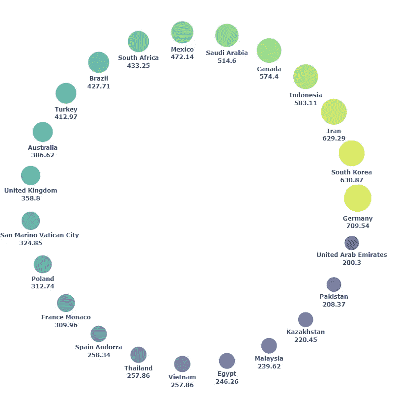

圆形气泡图显示了 2018 年各国二氧化碳排放量在 200 至 1,000 MTCO2e 之间。图片由作者提供。

可以注意到，我们定位气泡越复杂，我们失去的空间就越多。我们可以用垂直或水平气泡图为其他可视化节省空间。

**9。用圆形包装聚集气泡**

最后，让我们将没有重叠区域的气泡分组。圆形包装是绘制气泡图的好主意，同时节省空间。我们需要计算每个气泡的位置和大小。幸运的是，有一个名为 [circlify](https://pypi.org/project/circlify/) 的库使得计算变得容易。

圆形包装的一个缺点是很难区分大小相近的气泡。这可以通过给每个气泡标上它的值来解决。

绘制圆形包装

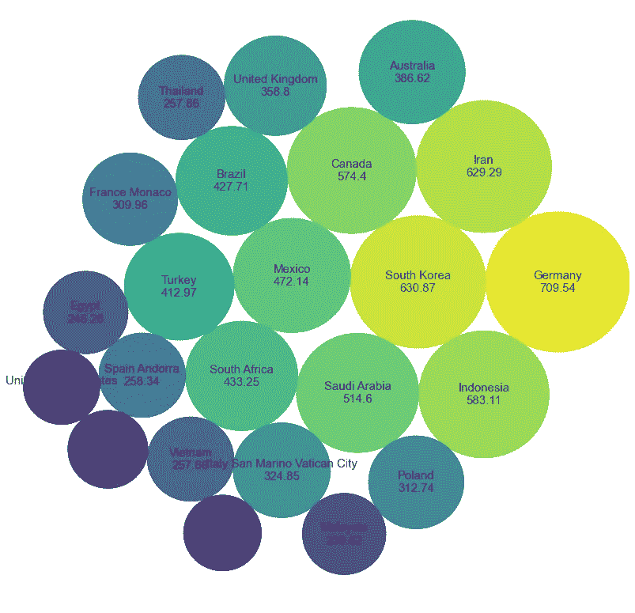

圆形包装显示 2018 年各国二氧化碳排放量在 200 至 1,000 MTCO2e 之间。图片由作者提供。

## 摘要

条形图没有问题。实际上，条形图简单易用。然而，任何图表都是完美的，适合每一份工作。数据可视化有时需要引起注意，例如创建信息图，条形图可能无法提供吸引力。

本文展示了九种可视化效果，显示了与条形图相同的数据维度，引起了人们的注意。顺便说一下，这些图表也有它们的缺点。请考虑它们可能难以阅读或不适合用于正式报告。

如果有什么建议或推荐，欢迎随时留言评论。感谢阅读。

以下是您可能会感兴趣的关于数据可视化的其他文章:

*   9 用 Python 可视化显示比例或百分比，而不是饼图([链接](/9-visualizations-to-show-proportions-or-percentages-instead-of-a-pie-chart-4e8d81617451))
*   8 用 Python 处理多个时间序列数据的可视化([链接](/8-visualizations-with-python-to-handle-multiple-time-series-data-19b5b2e66dd0)
*   用 Python 处理超长时间序列数据的 6 个可视化技巧([链接](/6-visualization-tricks-to-handle-ultra-long-time-series-data-57dad97e0fc2))
*   超越云:用 Python 代替 Word Cloud 的 4 种可视化([链接](/beyond-the-cloud-4-visualizations-to-use-instead-of-word-cloud-960dd516f215))

## 参考

*   维基媒体基金会。(2022 年 5 月 18 日)。*二氧化碳排放国家名单*。维基百科。2022 年 8 月 3 日检索，来自[https://en . Wikipedia . org/wiki/List _ of _ countries _ by _ carbon _ CO2 _ emissions](https://en.wikipedia.org/wiki/List_of_countries_by_carbon_dioxide_emissions)
*   拉克霍迪亚，N. (2021 年 1 月 11 日)。*将维基百科表格抓取成数据帧*。中等。2022 年 8 月 3 日检索，来自[https://medium . com/analytics-vid hya/web-scraping-a-Wikipedia-table-into-a-data frame-c 52617 E1 f 451](https://medium.com/analytics-vidhya/web-scraping-a-wikipedia-table-into-a-dataframe-c52617e1f451)