# 9 用 Python 可视化显示比例或百分比，而不是饼图

> 原文：<https://towardsdatascience.com/9-visualizations-to-show-proportions-or-percentages-instead-of-a-pie-chart-4e8d81617451>

## 用 Python 创建替代饼状图的方法


由 [Elle inlom](https://unsplash.com/ja/@elliethailand64?utm_source=medium&utm_medium=referral) 在 [Unsplash](https://unsplash.com?utm_source=medium&utm_medium=referral) 上拍摄

饼图是显示分类数据比例的典型图表。基本上，这是一个分成若干部分的圆形图形，用来显示数据占总数的比例。通过计算等于 100%的总 360 度，面积可以用百分比表示。

该图表经常用于数据可视化，因为其概念易于创建，结果也易于理解。

然而，有一些有争议的问题。一些消息来源解释说，人类很难从图上的切片中测量数量([链接](https://scc.ms.unimelb.edu.au/resources/data-visualisation-and-exploration/no_pie-charts#:~:text=The%20quantities%20in%20each%20category,slices%20can%20be%20hard%20work.))。而且信息会被扭曲，误导读者([链接](https://en.wikipedia.org/wiki/Misleading_graph#:~:text=Comparing%20pie%20charts%20of%20different,the%20sample%20size%20is%20small.))。

幸运的是，饼状图不是我们可以使用的唯一选择。有各种图形可以表示比例或百分比。本文将介绍九种替代方法，它们可以像饼图一样展示相同的数据维度。

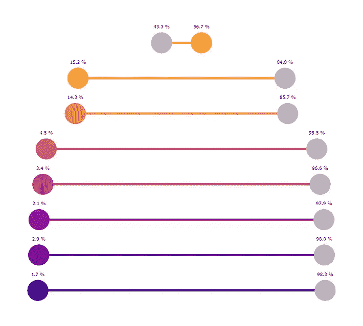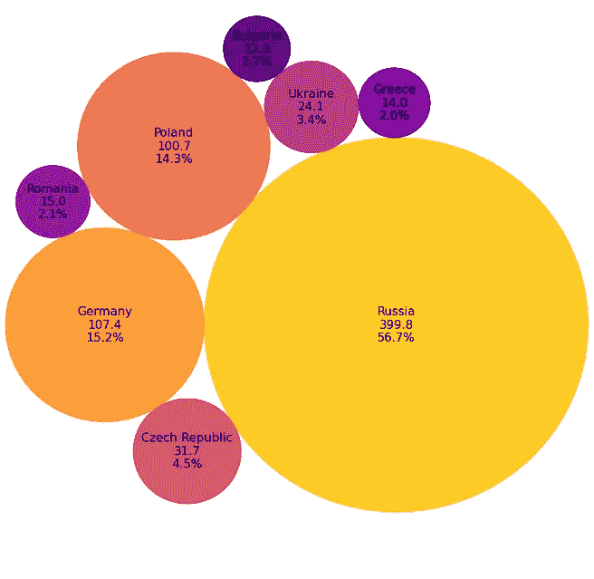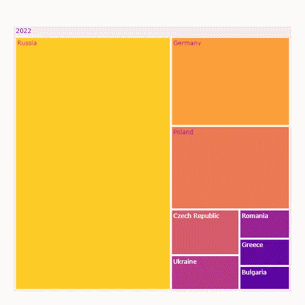

本文中的一些可视化示例。图片由作者提供。

## 免责声明！！

这篇文章的意图不是反对饼状图。每个图表都有它的优点和缺点。主要目的是指导一些图表，这些图表可以用与总数相比的比例或百分比来表示数据。

请考虑到这些可视化并不完美；它们也有利弊。

让我们开始吧。

# 检索数据

从导入库开始

```
import numpy as np
import pandas as pd
import matplotlib.pyplot as plt
import seaborn as sns%matplotlib inline
```

为了说明本文中提到的方法可以应用于现实世界的数据，我将使用维基百科上按煤炭产量列出的国家列表中的数据。本文列出了截至 2020 年煤炭产量超过 500 万吨的主权国家和地区。

来自维基百科的数据是根据[知识共享署名-类似共享 3.0 未授权许可](https://en.wikipedia.org/wiki/Wikipedia:Copyrights)的条款使用的。

我按照有用且实用的步骤从[网上下载数据，将维基百科的一个表格抓取到一个数据帧](https://medium.com/analytics-vidhya/web-scraping-a-wikipedia-table-into-a-dataframe-c52617e1f451)。

下载后，用 [BeautifulSoup](https://www.crummy.com/software/BeautifulSoup/bs4/doc/) 解析下载的数据

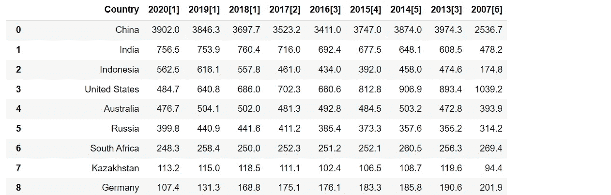

在这篇文章中，我将选择一些 2020 年煤炭产量的欧洲国家。例如，选定的国家有俄罗斯、德国、波兰、捷克共和国、乌克兰、罗马尼亚、希腊和保加利亚。

如果您想选择其他国家或更改年份，请随意修改下面的代码。

```
list_country = ['Russia', 'Germany', 'Poland', 'Czech Republic',
                'Ukraine', 'Romania', 'Greece', 'Bulgaria']
```


熔化数据帧，并创建一个百分比列以备后用

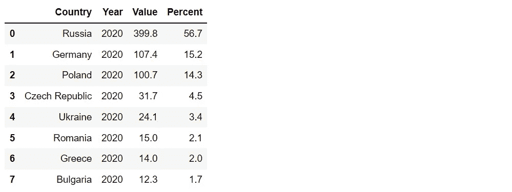

在继续之前，让我们绘制一个饼图，以便与本文后面获得的结果进行比较。

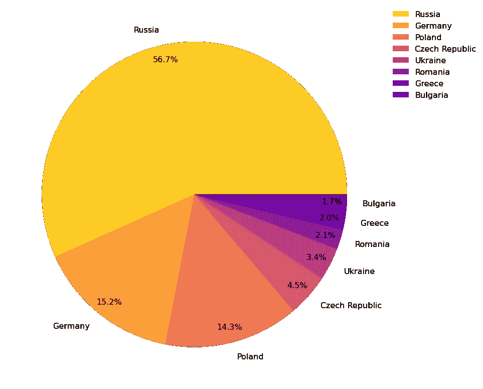

饼图显示了 2020 年煤炭产量超过 500 万吨的欧洲国家的比例。与所选数据集中的其他国家/地区进行比较时的百分比。图片由作者提供。

# 数据可视化

本文将介绍 9 种可视化方法来代替饼图。这些备选方案可分为两组:

**圆形图形**

*   哑铃图(又名杠铃图)
*   泡泡图
*   圆形包装
*   交互式饼图
*   交互式圆环图

**其他形式**

*   树形图
*   华夫饼图表
*   条形图
*   堆积条形图

**1 用哑铃图(又名杠铃图)比较每个类别**

哑铃图是比较两个数据点的图表。如前所述，比较饼图中的切片可能很困难。我们可以用哑铃图对每一类进行比较。

顾名思义，哑铃图由两个用一条直线统一的圆形图形组成。通常，Dumbell 图表用于比较数据值。在本文中，我们将设置 X 轴范围从 0 到 100 %,以显示煤炭产量的百分比。

例如，我们可以比较国家或显示每个国家与其他国家相比的百分比。首先，我们将创建另一个数据框架来应用哑铃图。

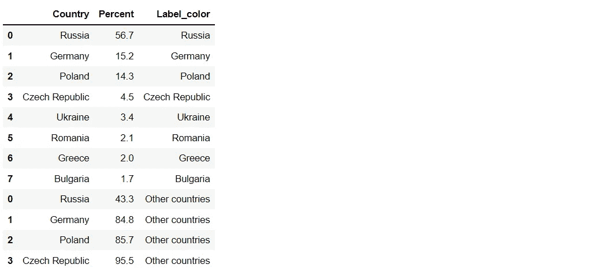

画出 2020 年煤炭产量最高的两个国家

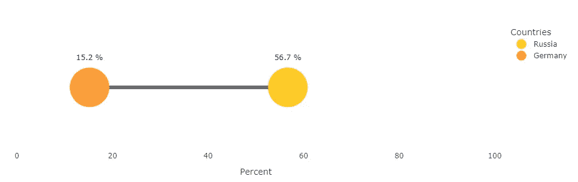

哑铃图比较了所选数据集中 2020 年煤炭产量最高的两个欧洲国家。图片由作者提供。

画出每个国家与其他国家相比的百分比

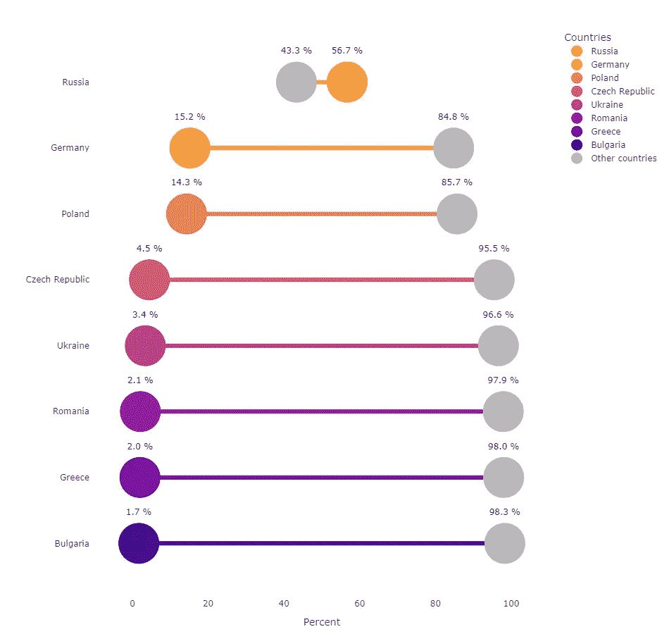

哑铃形图表显示了与所选数据集中其他国家的数据相比，每个欧洲国家的煤炭产量的百分比。图片由作者提供。

结果看起来不错，但是数据点都是相等的。这可能不方便进行国与国之间的比较。我们可以通过根据百分比值改变圆形大小来改善结果。不同的尺寸将有助于比较不同类别的百分比。


哑铃形图表显示了与所选数据集中其他国家的数据相比，每个欧洲国家的煤炭产量的百分比。图片由作者提供。

**2 使用带有气泡图的圆形区域**

我们可以使用气泡图中的多个圆，而不是饼图中的一个圆。基本上，气泡图是一个具有不同大小数据点的[散点图](https://en.wikipedia.org/wiki/Scatter_plot)。这是显示三维数据、X 值、Y 值和数据大小的理想绘图。

使用气泡图替代饼图的好处是，我们不必担心 X 和 Y 值。气泡可以按照我们想要的方式定位。例如，让我们水平绘制气泡。

在绘制之前对值进行排序将使结果看起来有条理。

添加 X 和 Y 列

```
df_coal['Y'] = [1]*len(df_coal)
list_x = list(range(0,len(df_coal)))
df_coal['X'] = list_x
df_coal
```

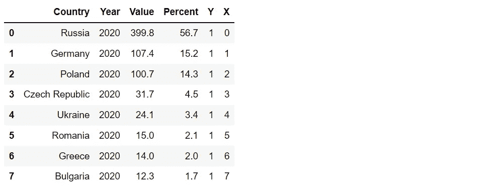

绘制气泡图

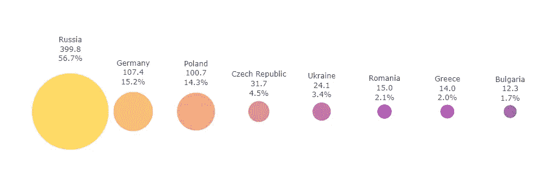

气泡图显示了 2020 年煤炭产量超过 500 万吨的欧洲国家。与所选数据集中的其他国家/地区进行比较时的百分比。图片由作者提供。

应用气泡图的一个问题是绘图空间。绘制的圆越多，需要的面积就越大。

**3 用圆形包装组织气泡**

圆形包装由多个具有较少间隙和无重叠区域的圆形组成。当处理许多圆形图形时，这种技术有助于节省绘图空间。

圆形包装的一个缺点是很难区分大小相近的气泡。一个简单的解决方法是给每个圈标上它的信息。

在绘图之前，我们需要计算每个圆的大小和位置。幸运的是，可以使用一个名为 [circlify](https://pypi.org/project/circlify/) 的库来简化计算。

绘制圆形包装


圆形包装显示了 2020 年煤炭产量超过 500 万吨的欧洲国家。与所选数据集中的其他国家/地区进行比较时的百分比。图片由作者提供。

**4 坚持用饼状图……没问题……我们来做个互动饼状图吧。**

尽管饼状图有一些缺点，如前所述，我们不能否认它很容易理解。了解你的观众是必须的。如果你的读者不习惯复杂的图表，饼图仍然是传达信息的好选择。

我们可以制作一个交互式饼图来改进一个典型的饼图。通过这样做，读者可以过滤和处理图表，以获得他们想要的数据。然而，有时，读者可能不知道这些功能。应该有说明或注释来告知如何使用它。

[Plotly](https://plotly.com/python/pie-charts/) 是一个创建交互式图表的有用库。

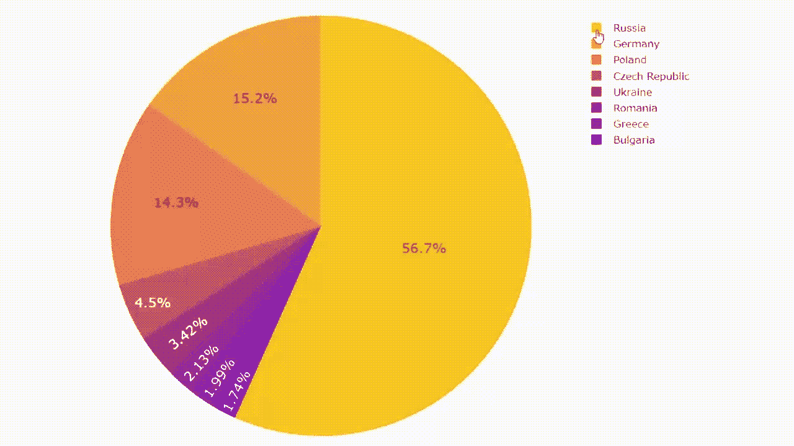

交互式饼图显示了 2020 年煤炭产量超过 500 万吨的每个欧洲国家。与所选数据集中的其他国家/地区进行比较时的百分比。图片由作者提供。

**5 切掉中心，创建一个交互式圆环图**

实际上，圆环图是一个中间空白的饼图。顺便说一下，一些消息来源解释说它比饼状图有一些优势，例如便于读者叙述或者可以在中心添加更多信息( [link1](https://moqups.com/templates/charts-graphs/pie-donut-chart/) 和 [link2](https://datavizcatalogue.com/methods/donut_chart.html) )。

交互式圆环图与交互式饼图有一些相同的优点和缺点。我们还可以用 [Plotly](https://plotly.com/python/pie-charts/) 创建一个交互式圆环图。

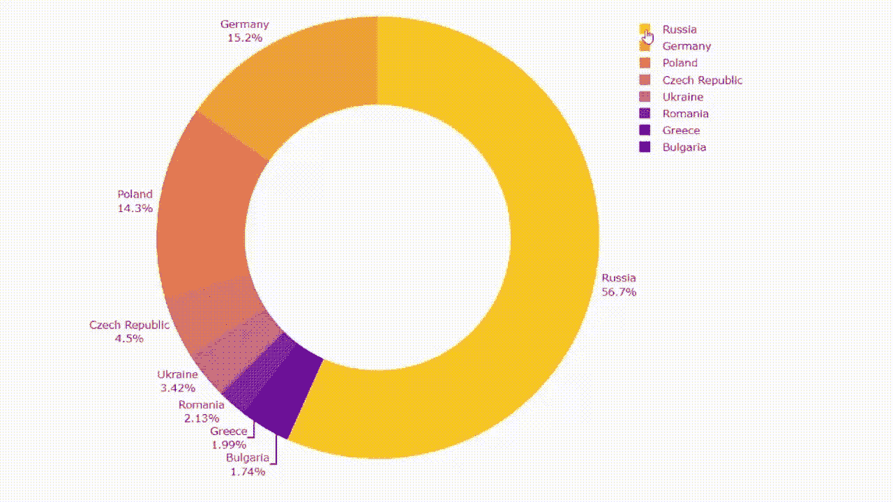

交互式圆环图显示了 2020 年煤炭产量超过 500 万吨的每个欧洲国家。与所选数据集中的其他国家/地区进行比较时的百分比。图片由作者提供。

**6 使用带树形图的矩形区域**

理论上，树形图是显示分层数据的可视化方式。在一个大矩形内，使用多个矩形区域来比较比例。即使我们的数据没有层次，我们仍然可以应用该方法来显示比例贡献。

与饼图相同，总面积之和等于 100%。

需要考虑的一件事是，如果价值观之间有太多的类别或差异，小区域可能很难与其他区域区分开来。

绘制一张树状图

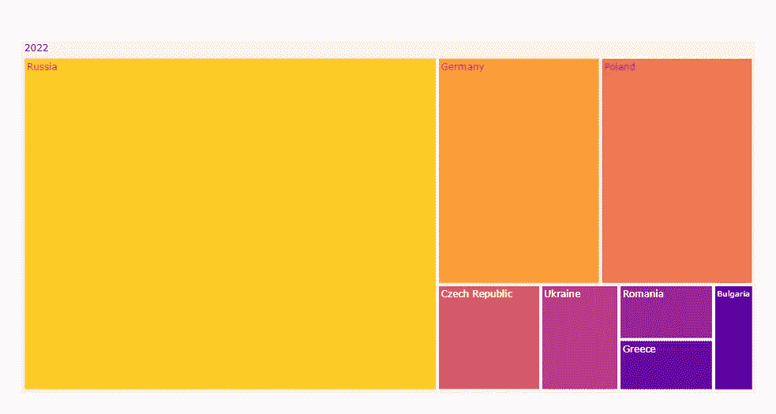

Treemap 显示了 2020 年煤炭产量超过 500 万吨的欧洲国家。与所选数据集中的其他国家/地区进行比较时的比例。图片由作者提供。

**7 将小矩形与华夫饼图表结合起来**

我们使用了一个饼图和圆环图；现在是时候做一个华夫图了。有了这个花里胡哨的名字，这个图形将多个大小相同的小矩形组合成一个大矩形图形。

华夫格图通常用于显示任务的进度百分比。因此，我们可以应用这个概念来显示分类数据的百分比。

绘制一个华夫饼图表

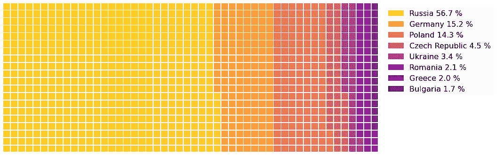

华夫格图显示了 2020 年煤炭产量超过 500 万吨的欧洲国家。与所选数据集中的其他国家/地区进行比较时的百分比。图片由作者提供。

尽管结果看起来不错，但可以注意到区分相近的颜色可能很困难。这可能是对许多分类数据应用华夫图的一个缺点。

为了解决这个问题，我们可以绘制每个类别的百分比，并将它们组合成一张照片拼贴画。请注意，下面代码的结果将被导出到您的计算机上，以便以后导入。

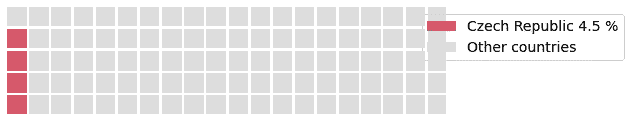

绘制华夫饼图表的结果，该图表显示每个国家相对于所选数据集中其他国家的百分比。图片由作者提供。

定义一个函数来创建一个照片拼贴。我在下面找到了一段很棒的代码，用来组合来自 Stack Overflow( [link](https://stackoverflow.com/questions/35438802/making-a-collage-in-pil) )的情节。

应用该功能

```
# to create a fit photo collage: 
# width = number of columns * figure width
# height = number of rows * figure heightget_collage(1, 7, 644, 123*7, keep_sname, 'collage_waffle.png')
```

瞧啊。！

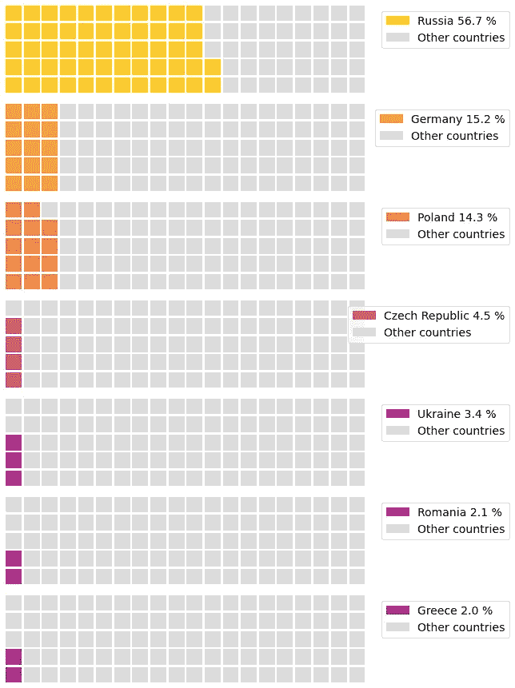

华夫格图显示了 2020 年煤炭产量超过 500 万吨的每个欧洲国家。与所选数据集中的其他国家/地区进行比较时的百分比。图片由作者提供。

现在我们可以比之前的结果更清楚地看到每个国家的百分比。照片拼贴也可以用作信息图。

**第八回** **基本带条形图**

另一个典型的图形是条形图，它是一个二维图形，在 X 轴或 Y 轴上有矩形条。这些条形用于通过比较高度或长度来分析数据值。与饼图相比，条形图需要更多的空间来处理大量的类别。

在本文中，我们将通过使用 [Plotly](https://plotly.com/python/bar-charts/) 来改进一个普通的条形图，当光标悬停在条形图上时显示信息。建议在绘图前对数据进行排序，以便于分析。

创建交互式条形图的一个好处是，当光标悬停在每个条形图上时，带有小注释文本的类别更容易阅读。

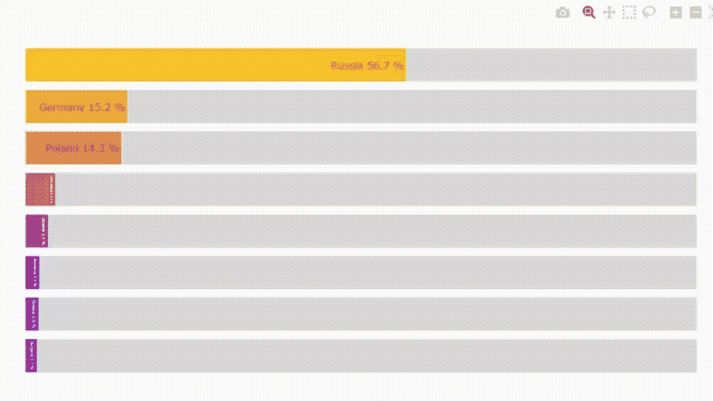

条形图显示了 2020 年煤炭产量超过 500 万吨的每个欧洲国家。与所选数据集中的其他国家/地区进行比较时的百分比。图片由作者提供。

**9 使用堆叠条形图节省空间**

堆积条形图是一种显示单个数据点占总数的比例的条形图。根据这个概念，我们将应用一个堆积条形图来显示我们拥有的数据的比例。总面积等于 100%。

它和条形图有同样的问题。如果有太多的类别或类别之间的差异，小区域可能很难阅读。创建交互式堆积条形图将有助于在光标悬停在该区域上时显示信息。

绘制堆积条形图

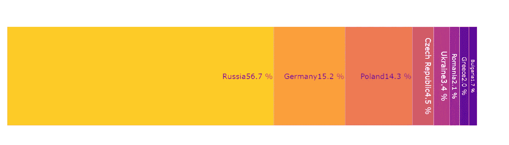

堆积条形图显示了 2020 年煤炭产量超过 500 万吨的每个欧洲国家。与所选数据集中的其他国家/地区进行比较时的百分比。图片由作者提供。

我们可以注意到，在这种情况下，堆积条形图与条形图相比可以节省绘图区域。

## **总结**

饼图是典型的数据可视化。它具有节省绘图空间、易于理解等优点。然而，没有什么是完美的。有一些缺点，如读者很难估计数量，信息可能会被扭曲。

这篇文章展示了 9 种替代饼图的方法。请考虑到它们也各有利弊。

我敢肯定，除了本文中提到的，还有更多图表可以显示比例或百分比。如果有什么建议，欢迎留言。

最后，**条形图**是另一个和饼图一样常用的图表。顺便说一句，使用太多的条形图可能会导致单调的显示。如果你正在寻找可以代替条形图使用的想法，你可能会发现文章 [9 可视化比条形图](/9-visualizations-that-catch-more-attention-than-a-bar-chart-72d3aeb2e091)更吸引人的注意。

感谢阅读。

以下是您可能会感兴趣的关于数据可视化的其他文章:

*   9 个比条形图更引人注目的 Python 可视化([链接](/9-visualizations-that-catch-more-attention-than-a-bar-chart-72d3aeb2e091))
*   用 Python 处理超长时间序列数据的 6 个可视化技巧([链接](/6-visualization-tricks-to-handle-ultra-long-time-series-data-57dad97e0fc2))
*   8 用 Python 处理多个时序数据的可视化([链接](/8-visualizations-with-python-to-handle-multiple-time-series-data-19b5b2e66dd0))
*   使用 Python ( [链接](https://medium.com/p/87e8f1bb5fd2/))最大化聚类散点图

**参考文献**

*   维基媒体基金会。(2022 年 4 月 21 日)。*煤炭生产国家列表*。维基百科。2022 年 9 月 3 日检索，来自[https://en . Wikipedia . org/wiki/List _ of _ countries _ by _ coal _ production](https://en.wikipedia.org/wiki/List_of_countries_by_coal_production)
*   拉克霍迪亚，N. (2021 年 1 月 11 日)。*将维基百科表格抓取成数据帧*。中等。2022 年 8 月 3 日检索，来自[https://medium . com/analytics-vid hya/web-scraping-a-Wikipedia-table-into-a-data frame-c 52617 E1 f 451](https://medium.com/analytics-vidhya/web-scraping-a-wikipedia-table-into-a-dataframe-c52617e1f451)