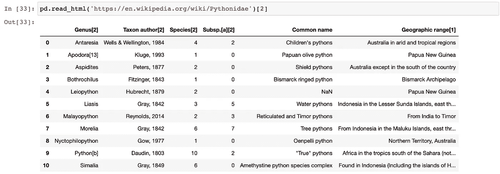
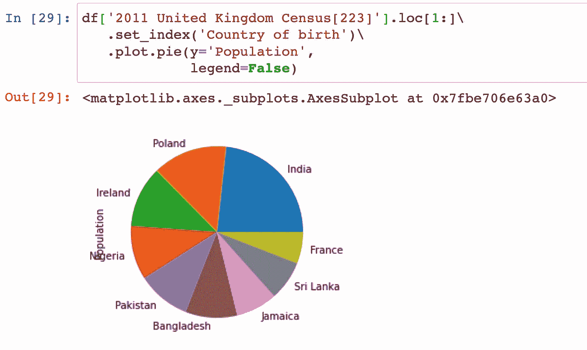
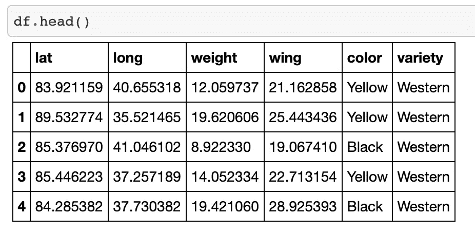
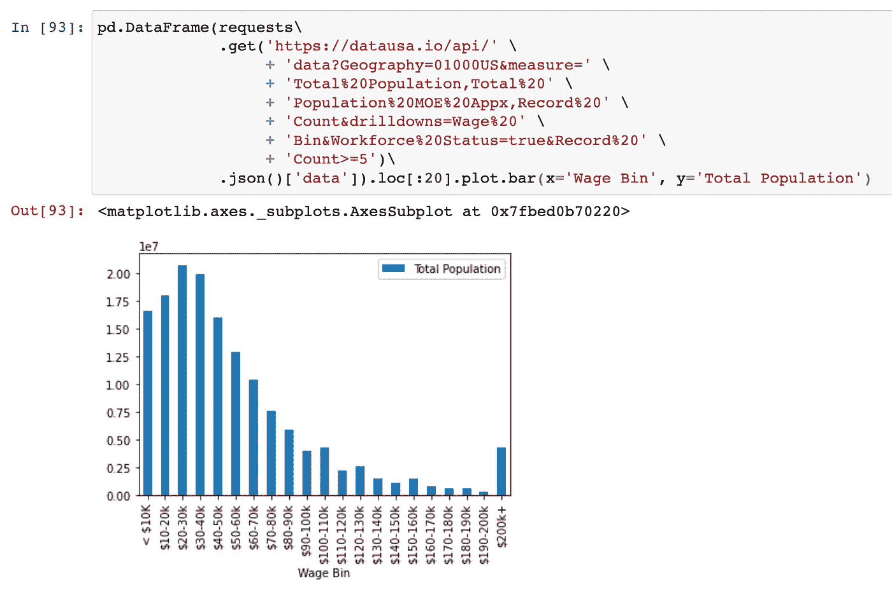
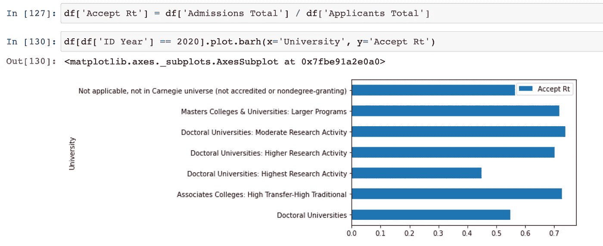
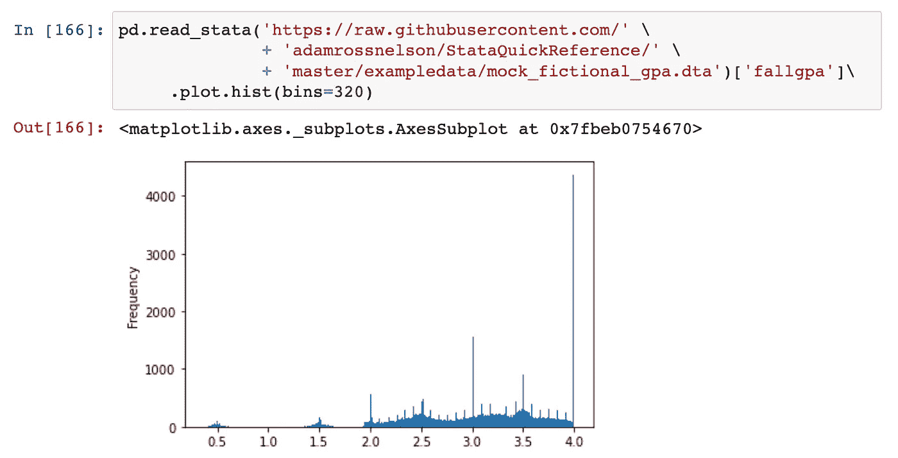
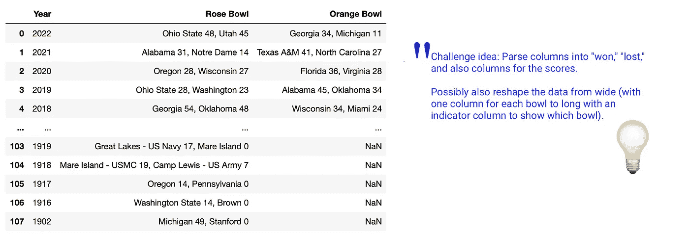
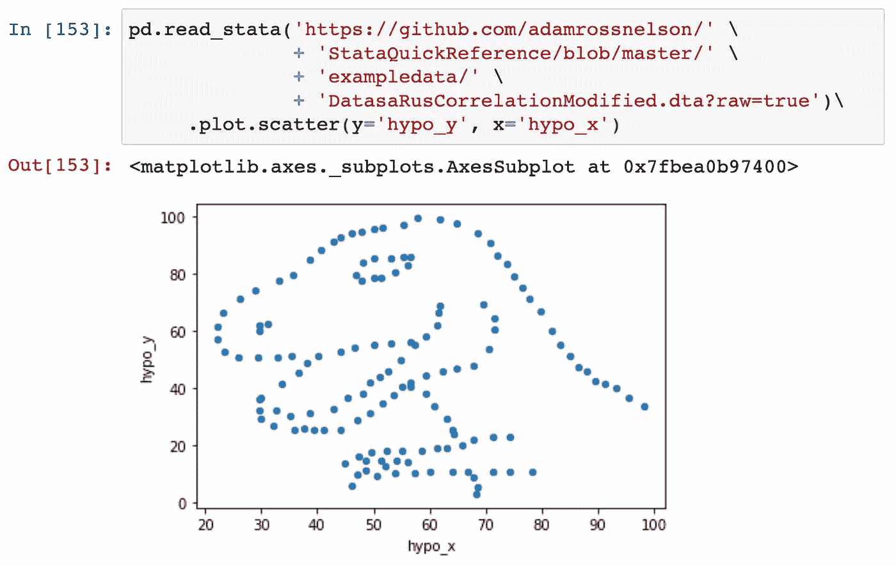

# 用一行代码加载 93 个数据集

> 原文：<https://towardsdatascience.com/93-datasets-that-load-with-a-single-line-of-code-7b5ffe62b655>

## 你如何即时地从几十个例子中找出一个政治、体育、教育和其他框架。

TLDR:如果你对老一套的示例数据感到厌倦，请将这篇文章收藏起来。它会向你展示近 100 个你以前可能没有用过的例子。每个示例加载一行代码。

例子来自政治、教育、健康、体育、科技，也只是为了好玩。


图片来源:作者在 Canva 创作的插图。

# 介绍

F 数据科学中的培训、测试、演示或其他相关目的需要数据。快速加载示例数据集(在一行代码中)通常非常容易。如果你像我一样，也许你已经陷入了有一个或两个“去”选择的实践中。

为了增加工作的多样性，我列出了一行代码中加载的近 100 个数据源。我希望其他人也会发现这个列表很有用。

数据来源按字母顺序包括:datausa.io、ESPN(体育)、五卅八(体育、政治、其他)、维基百科等。在准备本文时，我避免了一些更常见的数据源选项，比如 Kaggle。这篇文章是关于扩展我们的工作到新的例子。

因为我搜寻了一些不太常见的例子，所以本文将向您展示如何在一行代码中快速加载一系列数据帧，从而拓宽您的视野。

本文将展示 Python、R 和 Stata 中的许多数据框。本文底部讨论的一些限制。

## 为什么是三个软件

为什么不是三个？真的，不管你用的最多的编码语言是什么，我只是想尽可能的帮助更多的人。我用 Python 演示了每一个例子。大多数例子也引用 Stata 和/或 r。

这三个软件选项是我最常使用的三个。你想在这里看到另一种语言吗？让我知道，我们可以合作添加第四个(或第五个)。此外，如果您还不知道:

Python——“Python 是一种编程语言，可以让你快速工作，更有效地集成系统。”[Python.org](https://www.python.org/)对于大多数数据工作，您还需要 Pandas——它是“一个快速、强大、灵活且易于使用的开源数据分析和操作工具，构建于 Python 编程语言之上。”[Pandas.Pydata.org](https://pandas.pydata.org/)。同样有用的是，这篇文章大量使用了`pd.read_html()`。我建议读者也阅读一下这个方便的熊猫方法的完整文档。

R—“R 是一个用于统计计算和图形的自由软件环境。它可以在多种 UNIX 平台、Windows 和 MacOS 上编译和运行。”[R-Project.org](https://www.r-project.org/)。在 R 中从在线 csv 文件加载数据的主要工具是`read.csv()`。

stata——“数据科学的统计软件”[Stata.com](https://www.stata.com/)。以下解决方案使用 Stata 的`import delimited`命令(用于 CSV 文件)及其`use`命令(用于 Stata dta 文件)。这两个命令都支持 url internet 网址。

# 1–4538 数据

根据维基百科，“FiveThirtyEight，有时被翻译为 538，是一个专注于民意调查分析、政治、经济和体育博客的美国网站。”该网站还提供或制作博客、YouTube 视频和播客。

到目前为止，我还没有找到一个优雅的解决方案，可以从网上找到的`zip`文件中获取数据，然后在一行代码中加载所有数据。如果有人有，告诉我。同时，也值得一读[Five 38 的数据存档](https://data.fivethirtyeight.com/)，它将大部分数据封装在一个`zip`中。

## 支持率调查结果

我想到我会在下学期的统计学课上把这些数据推荐给学生。这将是他们学期项目的素材。

```
# Python
pd.read_csv('[https://projects.fivethirtyeight.com/polls/data/favorability_polls.csv'](https://projects.fivethirtyeight.com/polls/data/favorability_polls.csv'))// Stata
import delimited [https://raw.githubusercontent.com/mwaskom/seaborn-data/master/attention.csv](https://raw.githubusercontent.com/adamrossnelson/BirdsDataCreation/main/BirdVarietyData_March2021.csv)# R
read.csv("[https://raw.githubusercontent.com/mwaskom/seaborn-data/master/attention.csv](https://raw.githubusercontent.com/adamrossnelson/BirdsDataCreation/main/BirdVarietyData_March2021.csv)")
```

## **去年总统民调结果**

这个有 16，700 多行。

```
# Python
pd.read_csv('[https://projects.fivethirtyeight.com/polls/data/president_polls_historical.csv](https://projects.fivethirtyeight.com/polls/data/president_polls_historical.csv)')// Stata
import delimited [https://projects.fivethirtyeight.com/polls/data/president_polls_historical.csv](https://projects.fivethirtyeight.com/polls/data/president_polls_historical.csv)# R
read.csv("[https://projects.fivethirtyeight.com/polls/data/president_polls_historical.csv](https://projects.fivethirtyeight.com/polls/data/president_polls_historical.csv)")
```

## 参议院和众议院投票结果(历史性)

```
# Python House
pd.read_csv('[https://projects.fivethirtyeight.com/polls/data/house_polls_historical.csv](https://projects.fivethirtyeight.com/polls/data/house_polls_historical.csv)')
# Python Senate
pd.read_csv('[https://projects.fivethirtyeight.com/polls/data/senate_polls_historical.csv](https://projects.fivethirtyeight.com/polls/data/senate_polls_historical.csv)')// Stata House
import delimited [https://projects.fivethirtyeight.com/polls/data/house_polls_historical.csv](https://projects.fivethirtyeight.com/polls/data/house_polls_historical.csv)
// Stata Senate
import delimited [https://projects.fivethirtyeight.com/polls/data/senate_polls_historical.csv](https://projects.fivethirtyeight.com/polls/data/senate_polls_historical.csv)# R House
read.csv("[https://projects.fivethirtyeight.com/polls/data/house_polls_historical.csv](https://projects.fivethirtyeight.com/polls/data/house_polls_historical.csv)")
# R Senate
read.csv("[https://projects.fivethirtyeight.com/polls/data/senate_polls_historical.csv](https://projects.fivethirtyeight.com/polls/data/senate_polls_historical.csv)")
```

# 5–11 个杂项启动器数据文件

这些鲜为人知的资源是从网上收集的数据。它们中很少是用来作为数据源的。然而，它们很有用，值得一看。

## 全球食品价格

这需要一段时间(大文件包括 2，050，638 条记录和 18 列)。

```
# Python
pd.read_csv('[https://data.humdata.org/dataset/4fdcd4dc-5c2f-43af-a1e4-93c9b6539a27/resource/12d7c8e3-eff9-4db0-93b7-726825c4fe9a/download/wfpvam_foodprices.csv](https://data.humdata.org/dataset/4fdcd4dc-5c2f-43af-a1e4-93c9b6539a27/resource/12d7c8e3-eff9-4db0-93b7-726825c4fe9a/download/wfpvam_foodprices.csv)')// Stata
import delimited [https://data.humdata.org/dataset/4fdcd4dc-5c2f-43af-a1e4-93c9b6539a27/resource/12d7c8e3-eff9-4db0-93b7
726825c4fe9a/download/wfpvam_foodprices.csv](https://data.humdata.org/dataset/4fdcd4dc-5c2f-43af-a1e4-93c9b6539a27/resource/12d7c8e3-eff9-4db0-93b7-726825c4fe9a/download/wfpvam_foodprices.csv)# R
read.csv("[https://data.humdata.org/dataset/4fdcd4dc-5c2f-43af-a1e4-93c9b6539a27/resource/12d7c8e3-eff9-4db0-93b7-726825c4fe9a/download/wfpvam_foodprices.csv](https://data.humdata.org/dataset/4fdcd4dc-5c2f-43af-a1e4-93c9b6539a27/resource/12d7c8e3-eff9-4db0-93b7-726825c4fe9a/download/wfpvam_foodprices.csv)")
```

## 维基百科 HTML 表格

维基百科中的表格经常需要改进。它们不是为数据分析而优化的。如果您正在寻找关于数据清理、准备或争论主题的示例数据，这些表格是很好的选择，因为它们模拟了没有为分析目的准备的“真实世界”数据。

这些数据的另一个挑战是 Python Pandas 有一个开发良好且成熟的读取 HTML 数据表的解决方案。Stata 和 R 中的等效解决方案不太成熟。因此，本节只提供 Python 代码。

**蛇(真蟒蛇)**易于在其他平台加载`pd.read_html()`及相关工具。

```
# Python
pd.read_html('[https://en.wikipedia.org/wiki/Pythonidae')[2](https://en.wikipedia.org/wiki/Pythonidae')[2)]
```



列出了 10 种蟒蛇的表格。图片鸣谢:亚当·罗斯·尼尔森(作者)。

**美国 NFL 体育场的桌子怎么样？运动爱好者的好选择。**

```
# Python
pd.read_html('https://en.wikipedia.org/wiki/National_Football_League')[3]
```

**美国总统的名单。**

```
# Python
pd.read_html('https://en.wikipedia.org/wiki/List_of_presidents_of_the_United_States')[1]
```

**世界国家列表。**

```
# Python
pd.read_html('https://en.wikipedia.org/wiki/List_of_sovereign_states')[0]
```

**英国人口普查数据**

```
# Python
pd.read_html('[https://en.wikipedia.org/wiki/London](https://en.wikipedia.org/wiki/London)')[6]
```

英国人口普查数据是展示快速饼状图的好地方。

```
df['2011 United Kingdom Census[223]'].loc[1:]\
   .set_index('Country of birth')\
   .plot.pie(y='Population', 
             legend=False)
```



饼状图中来自维基百科的英国人口普查数据。图片鸣谢:亚当·罗斯·尼尔森(作者)。

## 州缩写和代码

你多久需要一次州名缩写和代码的列表(在美国)？Clerk.org 来救援了。

```
# Python
states = pd.read_html(http://app02.clerk.org/menu/ccis/Help/CCIS%20Codes/state_codes.html)[0]
```

# 12–16 来自 ESPN.com 的数据

**NFL 球场上座率记录**。这些数据是过去 20 年的。以下是过去 5 年的代码。有人对想象疫情的萧条感兴趣吗？

```
# Python
pd.read_html('[http://www.espn.com/nfl/attendance/_/year/2021'](http://www.espn.com/nfl/attendance/_/year/2021'), 
             header=1)[0]
pd.read_html('[http://www.espn.com/nfl/attendance/_/year/2020'](http://www.espn.com/nfl/attendance/_/year/2021'), 
             header=1)[0]
pd.read_html('[http://www.espn.com/nfl/attendance/_/year/2019'](http://www.espn.com/nfl/attendance/_/year/2021'), 
             header=1)[0]
pd.read_html('[http://www.espn.com/nfl/attendance/_/year/2018'](http://www.espn.com/nfl/attendance/_/year/2021'), 
             header=1)[0]
pd.read_html('[http://www.espn.com/nfl/attendance/_/year/2017'](http://www.espn.com/nfl/attendance/_/year/2021'), 
             header=1)[0]
```

# 17 只假鸟

所谓的假鸟数据来自我之前的一些文章，这些文章演示了[生成假数据](/how-to-make-fictional-data-7a79ce86a350)的过程，后来还演示了 [k 近邻](/fake-birds-machine-learning-acc553312a8f)。您可以使用以下内容加载这些数据:

```
# Python
pd.read_csv('[https://raw.githubusercontent.com/adamrossnelson/BirdsDataCreation/main/BirdVarietyData_March2021.csv](https://raw.githubusercontent.com/adamrossnelson/BirdsDataCreation/main/BirdVarietyData_March2021.csv)')// Stata
import delimited [https://raw.githubusercontent.com/adamrossnelson/BirdsDataCreation/main/BirdVarietyData_March2021.csv](https://raw.githubusercontent.com/adamrossnelson/BirdsDataCreation/main/BirdVarietyData_March2021.csv)# R
read.csv("[https://raw.githubusercontent.com/adamrossnelson/BirdsDataCreation/main/BirdVarietyData_March2021.csv](https://raw.githubusercontent.com/adamrossnelson/BirdsDataCreation/main/BirdVarietyData_March2021.csv)")
```



虚构的鸟类数据。图片鸣谢:亚当·罗斯·尼尔森(作者)。

# 18–26 作为数据源的 Stata 集合

如上所述，Stata 是一个统计、数据分析和数据科学平台，它还附带有大量数据，可用于培训演示。下面的代码将加载我最喜欢的十个选项，包括 auto(类似于 Seaborn 的 mpg)、bplong、bpwide(虚构的血压)、cancer(药物试验数据中的患者存活率)、Census(stata 提供的 1980 年美国人口普查数据)、nlsw88(全国妇女纵向调查，1988 年摘录)、sp500(标准普尔 500 股票数据)和 voter (1992 年美国总统选举人)。

```
# Python
pd.read_stata('http://www.stata-press.com/data/r15/auto.dta')
pd.read_stata('http://www.stata-press.com/data/r15/bplong.dta')
pd.read_stata('http://www.stata-press.com/data/r15/bpwide.dta')
pd.read_stata('http://www.stata-press.com/data/r15/cancer.dta')
pd.read_stata('http://www.stata-press.com/data/r15/census.dta')
pd.read_stata('http://www.stata-press.com/data/r15/nlsw88.dta')
pd.read_stata('http://www.stata-press.com/data/r15/sp500.dta')
pd.read_stata('http://www.stata-press.com/data/r15/voter.dta')
pd.read_stata('http://www.stata-press.com/data/r15/pop2000.dta')// Stata
sysuse auto
sysuse bplong
sysuse bpwide
sysuse cancer
sysuse census
sysuse nlsw88
sysuse sp500
sysuse 2p500
sysuse voeter
```

Stata 自带的一些数据也可以从其他来源获得。例如，`nlsw88`数据也在 [rdrr.io](https://rdrr.io/cran/Counterfactual/man/nlsw88.html#heading-1) 和[rdocumentation.org](https://www.rdocumentation.org/packages/Counterfactual/versions/1.2/topics/nlsw88)处。

# 27–36 作为数据源的 Seaborn 集合

Seaborn 附带的数据众所周知。网上一些最好的项目例子涉及到 Seaborn 收录库中的数据。我最喜欢用`tips`数据来教初学者统计学。

对于中级或有经验的用户来说，这些 Seaborn 数据是经常使用的。它们被设计成可以在 Python 中快速加载。然而，如果你在 Stata(或者其他可以在线打开 CSV 的工具)中，你也可以使用这些。各种聪明的解决方案将 Seaborn 带到了 R。然而，要在 R 中使用这些数据，最简单的方法是使用 R 的`read.csv()`。

在这里，我演示了多个单行选项，加载我的 Seaborn 收藏夹注意，车祸，锻炼，企鹅，mpg，钻石，航班，虹膜，提示和泰坦尼克号数据。

```
# Python
df = sns.load_dataset('attention')
df = sns.load_dataset('car_crashes')
df = sns.load_dataset('exercise')
df = sns.load_dataset('penguins')
df = sns.load_dataset('mpg')
df = sns.load_dataset('diamonds')
df = sns.load_dataset('flights')
df = sns.load_dataset('iris')
df = sns.load_dataset('tips')
df = sns.load_dataset('titanic')// Stata
import delimited [https://raw.githubusercontent.com/mwaskom/seaborn-data/master/](https://raw.githubusercontent.com/mwaskom/seaborn-data/master/penguins.csv)attention.csvimport delimited [https://raw.githubusercontent.com/mwaskom/seaborn-data/master/](https://raw.githubusercontent.com/mwaskom/seaborn-data/master/penguins.csv)car_crashes.csvimport delimited [https://raw.githubusercontent.com/mwaskom/seaborn-data/master/](https://raw.githubusercontent.com/mwaskom/seaborn-data/master/penguins.csv)exercise.csvimport delimited [https://raw.githubusercontent.com/mwaskom/seaborn-data/master/penguins.csv](https://raw.githubusercontent.com/mwaskom/seaborn-data/master/penguins.csv)import delimited [https://raw.githubusercontent.com/mwaskom/seaborn-data/master/mpg.csv](https://raw.githubusercontent.com/mwaskom/seaborn-data/master/mpg.csv)import delimited [https://raw.githubusercontent.com/mwaskom/seaborn-data/master/](https://raw.githubusercontent.com/mwaskom/seaborn-data/master/penguins.csv)diamonds.csvimport delimited [https://raw.githubusercontent.com/mwaskom/seaborn-data/master/](https://raw.githubusercontent.com/mwaskom/seaborn-data/master/penguins.csv)flights.csvimport delimited [https://raw.githubusercontent.com/mwaskom/seaborn-data/master/](https://raw.githubusercontent.com/mwaskom/seaborn-data/master/penguins.csv)iris.csvimport delimited [https://raw.githubusercontent.com/mwaskom/seaborn-data/master/](https://raw.githubusercontent.com/mwaskom/seaborn-data/master/penguins.csv)tips.csvimport delimited [https://raw.githubusercontent.com/mwaskom/seaborn-data/master/](https://raw.githubusercontent.com/mwaskom/seaborn-data/master/penguins.csv)titanic.csv# In R
read.csv("[https://raw.githubusercontent.com/mwaskom/seaborn-data/master/](https://raw.githubusercontent.com/mwaskom/seaborn-data/master/penguins.csv)attention.csv")
read.csv("[https://raw.githubusercontent.com/mwaskom/seaborn-data/master/](https://raw.githubusercontent.com/mwaskom/seaborn-data/master/penguins.csv)car_crashes.csv")
read.csv("[https://raw.githubusercontent.com/mwaskom/seaborn-data/master/](https://raw.githubusercontent.com/mwaskom/seaborn-data/master/penguins.csv)exercise.csv")
read.csv("[https://raw.githubusercontent.com/mwaskom/seaborn-data/master/penguins.csv](https://raw.githubusercontent.com/mwaskom/seaborn-data/master/penguins.csv)")
read.csv("[https://raw.githubusercontent.com/mwaskom/seaborn-data/master/mpg.csv](https://raw.githubusercontent.com/mwaskom/seaborn-data/master/mpg.csv)")
read.csv("[https://raw.githubusercontent.com/mwaskom/seaborn-data/master/](https://raw.githubusercontent.com/mwaskom/seaborn-data/master/penguins.csv)diamonds.csv")
read.csv("[https://raw.githubusercontent.com/mwaskom/seaborn-data/master/](https://raw.githubusercontent.com/mwaskom/seaborn-data/master/penguins.csv)flights.csv")
read.csv("[https://raw.githubusercontent.com/mwaskom/seaborn-data/master/](https://raw.githubusercontent.com/mwaskom/seaborn-data/master/penguins.csv)iris.csv")
read.csv("[https://raw.githubusercontent.com/mwaskom/seaborn-data/master/](https://raw.githubusercontent.com/mwaskom/seaborn-data/master/penguins.csv)tips.csv")
read.csv("[https://raw.githubusercontent.com/mwaskom/seaborn-data/master/](https://raw.githubusercontent.com/mwaskom/seaborn-data/master/penguins.csv)titanic.csv")
```

# 37–53 数据 USA.io 数据

该网站负责分享来自美国政府的数据。数据涉及一系列主题，包括城市、州、行业、工作、大学、学位、健康等等。该平台还支持用户在线生成可视化的能力，而无需首先下载数据。

此外，从技术上讲，在 Python 中，这段代码需要一个额外的导入`import requests`。不要把它算作第二行代码(我不这么认为)。

## 城市数据示例

纽约州纽约市所说的世界语言。

```
# Python
pd.DataFrame(requests\
             .get('[https://datausa.io/api/'](https://datausa.io/api/') \
                  + 'data?Geography=16000US3651000&' \
                  + 'measure=Languages%20' \
                  + 'Spoken&drilldowns=Language%20' \
                  + 'Spoken%20at%20Home')\
             .json()['data'])
```

伊利诺伊州芝加哥出生年龄(出生地)。

```
# Python
pd.DataFrame(requests\
             .get('[https://datausa.io/api/'](https://datausa.io/api/') \
                  + 'data?Geography=16000US1714000&' \
                  + 'measures=Birthplace,Birthplace%20' \
                  + 'Moe&drilldowns=Place%20of%20Birth,Age')\
             .json()['data'])
```

## 状态数据示例

弗吉尼亚外国战争的退伍军人。下表比较了

```
# Python
pd.DataFrame(requests\
             .get('[https://datausa.io/api/'](https://datausa.io/api/') \
                  + 'data?Geography=04000US51,01000US&' \
                  + 'measure=Veterans,Veterans%20' \
                  + 'Moe&drilldowns=Period%20of%20Service')\
             .json()['data'])
```

该数据概述了明尼苏达州与邻近各州相比的美国公民百分比。

```
# Python
pd.DataFrame(requests\
             .get('[https://datausa.io/api/'](https://datausa.io/api/') \
                  + 'data?measure=Citizenship%20' \
                  + 'Status&drilldowns=' \
                  + 'Citizenship&Geography=04000US27,' \
                  + '04000US27:neighbors,' \
                  + '04000US27:parents,04000US27:similar')\
             .json()['data'])
```

## 行业数据示例

高薪职业(医生)。

```
# Python
pd.DataFrame(requests\
             .get('[https://datausa.io/api/'](https://datausa.io/api/') \
                  + 'data?PUMS%20Industry=31-33&measure=Total%20' \
                  + 'Population,Total%20Population%20MOE%20' \
                  + 'Appx,Average%20Wage,Average%20Wage%20' \
                  + 'Appx%20MOE,yiopop%20RCA,Record%20' \
                  + 'Count&Record%20Count%3E=5&Workforce%20' \
                  + 'Status=true&drilldowns=Detailed%20' \
                  + 'Occupation&order=Average%20Wage&sort=desc')\
             .json()['data'])
```

分行业收入分配。

```
# Python
pd.DataFrame(requests\
             .get('[https://datausa.io/api/'](https://datausa.io/api/') \
                  + 'data?Geography=01000US&measure=' \
                  + 'Total%20Population,Total%20' \
                  + 'Population%20MOE%20Appx,Record%20' \
                  + 'Count&drilldowns=Wage%20' \
                  + 'Bin&Workforce%20Status=true&Record%20' \
                  + 'Count>=5')\
             .json()['data'])
```



收入分配数据。图片鸣谢:亚当·罗斯·尼尔森(作者)。

## 作业数据示例

失业保险索赔。

```
# Python
pd.DataFrame(requests\
     .get('[https://datausa.io/api/covid19/employment/latest/')\](https://datausa.io/api/covid19/employment/latest/')\)
     .json()['data'])
```

按工业部门分列的失业情况。

```
# Python
pd.DataFrame(requests\
             .get('[https://api-ts-uranium.datausa.io/'](https://api-ts-uranium.datausa.io/') \
                  + 'tesseract/data.jsonrecords?cube=BLS%20' \
                  + 'Employment%20-%20Supersector%20' \
                  + 'Only&drilldowns=Month%20of%20' \
                  + 'Year,Supersector&measures=NSA%20' \
                  + 'Employees&State=04000US06') \
             .json()['data'])
```

## 经济学

中等家庭收入。

```
# Python
pd.DataFrame(requests\
             .get('[https://datausa.io/api/'](https://datausa.io/api/') \
                  + 'data?measure=Household%20' \
                  + 'Income%20by%20Race,Household%20' \
                  + 'Income%20by%20Race%20' \
                  + 'Moe&Geography=04000US06:' \
                  + 'neighbors:parents,04000US06,' \ 
                  + '04000US06:similar') \
             .json()['data'])
```

普通工作中按性别分列的工资。

```
# Python
pd.DataFrame(requests\
             .get('[https://datausa.io/api/'](https://datausa.io/api/') \
                  + 'data?Geography=04000US06' \
                  + '&measure=Average%20Wage,Average%20' \
                  + 'Wage%20Appx%20MOE,Total%20' \
                  + 'Population,Total%20Population%20' \
                  + 'MOE%20Appx,Record%20' \
                  + 'Count&drilldowns=Gender&Employment%20' \
                  + 'Time%20Status=1&Detailed%20' \
                  + 'Occupation=1191XX,412010,412031,' \
                  + '533030,291141&Record%20Count%3E=5')\
             .json()['data'])
```

## 大学数据示例

比较菲尼克斯-亚利桑那大学按收入分组的财政资助和其他机构和机构类型按收入分组的财政资助。机构类型包括

```
# Python
pd.DataFrame(requests\
             .get('[https://datausa.io/api/'](https://datausa.io/api/') \
                  + 'data?University=484613:' \
                  + 'similar,484613,484613:parents&' \
                  + 'measures=Median%20Grant%20' \
                  + 'Or%20Scholarship%20' \
                  + 'Award&drilldowns=Income%20Range')\
             .json()['data'])
```

按机构类型分列的录取率。对于这一项，你必须用被录取的学生人数除以被录取的学生人数来计算录取率。

```
# Python
pd.DataFrame(requests\
             .get('[https://datausa.io/api/'](https://datausa.io/api/') \
                  + 'data?University=15:similar,15,15:' \
                  + 'parents&measures=Admissions%20' \
                  + 'Total,Applicants%20Total')\
             .json()['data'])
```

在计算出接受率后，Pandas 迅速进行了数据可视化工作。



按大学类型显示录取率的条形图。图片鸣谢:亚当·罗斯·尼尔森(作者)。

## 学位数据示例

该网站通过 CIP 代码对其学位数据进行排序和组织。如果你不熟悉 CIP 代码，它们是“教学程序分类”代码。这些代码表示支持准确跟踪和报告研究领域/学术专业的方案。

由郡授予的学位(在美国)。

```
# Python
pd.DataFrame(requests\
             .get('[https://datausa.io/api/'](https://datausa.io/api/') \
                  + 'data?CIP=2401&drilldowns=' \
                  + 'County&measure=Completions')\
             .json()['data'])
```

按学位类型授予的学位。

```
# Python
pd.DataFrame(requests\
             .get('[https://datausa.io/api/'](https://datausa.io/api/') \
                  + 'data?CIP=2401&measure=' \
                  + 'Completions&drilldowns=' \
                  + 'Degree&order=Completions&sort=desc')\
             .json()['data'])
```

## 健康数据示例

患者与初级保健比率。

```
pd.DataFrame(requests\
             .get('[https://datausa.io/api/'](https://datausa.io/api/') \
                  + 'data?measure=Patient%20to%20' \
                  + 'Primary%20Care%20Physician%20' \
                  + 'Ratio,Patient%20to%20Primary%20' \
                  + 'Care%20Physician%20Ratio%20' \
                  + 'Data%20Source%20Years&Geography=' \
                  + '04000US06:neighbors,04000US06') \
             .json()['data'])
```

每天的新 Covid 病例。

```
# Python
pd.DataFrame(requests\
             .get('[https://datausa.io/api/covid19/statesnew')\](https://datausa.io/api/covid19/statesnew')\)
             .json()['data'])
```

# 54–59 犯罪数据

该数据最初来自 fbi.gov，包括人口数据和按类别分类的犯罪数据(财产、盗窃、暴力等)。)从 1960 年到 2019 年的美国各州。感谢瑞安·惠特科姆、朱明财和管波，他们通过 GitHub 维护这个网站，省去了从`.zip`文件中挖掘数据的需要。

```
# Python
pd.read_csv('[https://corgis-edu.github.io/'](https://corgis-edu.github.io/') \
            + 'corgis/datasets/csv/state_crime/' \
            + 'state_crime.csv')// Stata
import delimited [https://corgis-edu.github.io/corgis/datasets/csv/state_crime/state_crime.csv](https://corgis-edu.github.io/corgis/datasets/csv/state_crime/state_crime.csv)# R
read.csv("[https://corgis-edu.github.io/corgis/datasets/csv/state_crime/state_crime.csv](https://corgis-edu.github.io/corgis/datasets/csv/state_crime/state_crime.csv)")
```

## 服务呼叫

这里的每个例子有近 500，000 条记录，是过去几年里来自新奥尔良市的“服务电话”。[点击前往 data.gov 探索岁月](https://catalog.data.gov/dataset?res_format=CSV&tags=crime)。

```
# Python (2016)
pd.read_csv('[https://data.nola.gov/'](https://data.nola.gov/') \
            + 'api/views/wgrp-d3ma/' \
            + 'rows.csv?accessType=DOWNLOAD')
# Python (2015)
pd.read_csv('[https://data.nola.gov/'](https://data.nola.gov/') \
            + 'api/views/w68y-xmk6/' \
            + 'rows.csv?accessType=DOWNLOAD')
# Python (2014)
pd.read_csv('[https://data.nola.gov/'](https://data.nola.gov/') \
            + 'api/views/jsyu-nz5r/' \
            + 'rows.csv?accessType=DOWNLOAD')// Stata (2016)
import delimited [https://data.nola.gov/](https://data.nola.gov/')api/views/wgrp-d3ma/rows.csv?accessType=DOWNLOAD
// Stata (2015)
import delimited [https://data.nola.gov/](https://data.nola.gov/')api/views/w68y-xmk6/rows.csv?accessType=DOWNLOAD
// Stata (2014)
import delimited [https://data.nola.gov/](https://data.nola.gov/')api/views/jsyu-nz5r/rows.csv?accessType=DOWNLOAD# R (2016)
read.csv("[https://data.nola.gov/](https://data.nola.gov/')api/views/wgrp-d3ma/rows.csv?accessType=DOWNLOAD")
# R (2015)
read.csv("[https://data.nola.gov/](https://data.nola.gov/')api/views/w68y-xmk6/rows.csv?accessType=DOWNLOAD
# R (2014)")
read.csv("[https://data.nola.gov/](https://data.nola.gov/')api/views/jsyu-nz5r/rows.csv?accessType=DOWNLOAD")
```

## 纽约市停止提问和搜身数据

这个有争议的项目包括由纽约市警察随机截停、盘问和搜身。NYC.gov 网站公布了这些数据。如下所示，CSV 中仅包含部分年份。

```
# Python (2016)
pd.read_csv('[https://www1.nyc.gov/'](https://www1.nyc.gov/') \
            + 'assets/nypd/downloads/' \
            + 'excel/analysis_and_planning/' \
            + 'stop-question-frisk/sqf-2016.csv')
# Python (2015)
pd.read_csv('[https://www1.nyc.gov/'](https://www1.nyc.gov/') \
            + 'assets/nypd/downloads/' \
            + 'excel/analysis_and_planning/' \
            + 'stop-question-frisk/sqf-2015.csv')// Stata (2016)
import delimited [https://www1.nyc.gov/assets/nypd/downloads/excel/analysis_and_planning/stop-question-frisk/sqf-2016.csv](https://www1.nyc.gov/assets/nypd/downloads/excel/analysis_and_planning/stop-question-frisk/sqf-2016.csv)
// Stata (2015)
import delimited [https://www1.nyc.gov/assets/nypd/downloads/excel/analysis_and_planning/stop-question-frisk/sqf-2015.csv](https://www1.nyc.gov/assets/nypd/downloads/excel/analysis_and_planning/stop-question-frisk/sqf-2015.csv)# R (2016)
read.csv("[https://www1.nyc.gov/assets/nypd/downloads/excel/analysis_and_planning/stop-question-frisk/sqf-2016.csv](https://www1.nyc.gov/assets/nypd/downloads/excel/analysis_and_planning/stop-question-frisk/sqf-2016.csv)")
# R (2015)
read.csv("[https://www1.nyc.gov/assets/nypd/downloads/excel/analysis_and_planning/stop-question-frisk/sqf-2015.csv](https://www1.nyc.gov/assets/nypd/downloads/excel/analysis_and_planning/stop-question-frisk/sqf-2016.csv)")
```

# 60 个虚构的平均绩点数据

大多数学校(高中或大学)的学生在任何一个学期的平均绩点都有独特的分布。这个虚构的数据复制了这种分布。多种多样的变量让你试验学期 gpa，累计 gpa，专业，经济资助等。

```
# Python
pd.read_stata('[https://raw.githubusercontent.com/'](https://raw.githubusercontent.com/') \
              + 'adamrossnelson/StataQuickReference/' \
              + 'master/exampledata/mock_fictional_gpa.dta')// Stata
use https://raw.githubusercontent.com/adamrossnelson/StataQuickReference/master/exampledata/mock_fictional_gpa.dta
```

这是虚构的学期 gpa 数据的独特分布(以直方图的形式)。



虚构 GPA 数据的直方图。图片鸣谢:亚当·罗斯·尼尔森(作者)。

# 61–66 来自 Burkardt 教授

偶尔，教授或老师会在网上收藏一些数据文件。数学和软件教授 burkardt[有大约 50 个 CSV 文件](https://people.sc.fsu.edu/~jburkardt/data/csv/csv.html)。在本文中，我将展示如何在一行代码中加载其中的 10 个。

`airtravel.csv`-1958-1960 年间，每月横跨大西洋的航空旅行，乘客数以千计。有 4 个字段，“月”、“1958 年”、“1959 年”和“1960 年”，以及 12 个记录，“一月”到“十二月”。还有一个初始标题行。

`ford_excorts.csv`——福特护航待售。有 23 条年份，里程，价格的记录。

`homes.csv`-国内销售统计。五十家销售，销售价格，要价，居住面积，房间，卧室，浴室，年龄，面积，税收。

`hw_25000.csv`——25000 个人的身高体重每条记录包括 3 个值:指数、身高(英寸)、体重(磅)。

`news_decline.csv`-2009-2011 年 6 个电视新闻杂志的平均每夜收视率。每个记录包括 4 个值:显示名称，2009，2010，2011。存储了六个记录，分别是“60 分钟”、“48 小时神秘”、“20/20”、“晚间新闻”、“星期五日期新闻”和“星期日日期新闻”

```
# Python
pd.read_csv('[https://people.sc.fsu.edu/~jburkardt/data/csv/airtravel.csv](https://people.sc.fsu.edu/~jburkardt/data/csv/airtravel.csv)')
pd.read_csv('[https://people.sc.fsu.edu/~jburkardt/data/csv/ford_escort.csv](https://people.sc.fsu.edu/~jburkardt/data/csv/ford_escort.csv)')
pd.read_csv('[https://people.sc.fsu.edu/~jburkardt/data/csv/homes.csv](https://people.sc.fsu.edu/~jburkardt/data/csv/homes.csv)')
pd.read_csv('[https://people.sc.fsu.edu/~jburkardt/data/csv/hw_25000.csv](https://people.sc.fsu.edu/~jburkardt/data/csv/hw_25000.csv)')
pd.read_csv('[https://people.sc.fsu.edu/~jburkardt/data/csv/mlb_players.csv](https://people.sc.fsu.edu/~jburkardt/data/csv/mlb_players.csv)')
pd.read_csv('[https://people.sc.fsu.edu/~jburkardt/data/csv/news_decline.csv](https://people.sc.fsu.edu/~jburkardt/data/csv/news_decline.csv)')// Stata
import delimited [https://people.sc.fsu.edu/~jburkardt/data/csv/airtravel.csv](https://people.sc.fsu.edu/~jburkardt/data/csv/airtravel.csv)
import delimited [https://people.sc.fsu.edu/~jburkardt/data/csv/ford_escort.csv](https://people.sc.fsu.edu/~jburkardt/data/csv/ford_escort.csv)
import delimited [https://people.sc.fsu.edu/~jburkardt/data/csv/homes.csv](https://people.sc.fsu.edu/~jburkardt/data/csv/homes.csv)
import delimited [https://people.sc.fsu.edu/~jburkardt/data/csv/hw_25000.csv](https://people.sc.fsu.edu/~jburkardt/data/csv/hw_25000.csv)
import delimited [https://people.sc.fsu.edu/~jburkardt/data/csv/mlb_players.csv](https://people.sc.fsu.edu/~jburkardt/data/csv/mlb_players.csv)
import delimited [https://people.sc.fsu.edu/~jburkardt/data/csv/news_decline.csv](https://people.sc.fsu.edu/~jburkardt/data/csv/news_decline.csv)# R
read.csv("[https://people.sc.fsu.edu/~jburkardt/data/csv/airtravel.csv](https://people.sc.fsu.edu/~jburkardt/data/csv/airtravel.csv)")
read.csv("[https://people.sc.fsu.edu/~jburkardt/data/csv/ford_escort.csv](https://people.sc.fsu.edu/~jburkardt/data/csv/ford_escort.csv)")
read.csv("[https://people.sc.fsu.edu/~jburkardt/data/csv/homes.csv](https://people.sc.fsu.edu/~jburkardt/data/csv/homes.csv)")
read.csv("[https://people.sc.fsu.edu/~jburkardt/data/csv/hw_25000.csv](https://people.sc.fsu.edu/~jburkardt/data/csv/hw_25000.csv)")
read.csv("[https://people.sc.fsu.edu/~jburkardt/data/csv/mlb_players.csv](https://people.sc.fsu.edu/~jburkardt/data/csv/mlb_players.csv)")
read.csv("[https://people.sc.fsu.edu/~jburkardt/data/csv/news_decline.csv](https://people.sc.fsu.edu/~jburkardt/data/csv/news_decline.csv)")
```

# 67–68 个欧洲数据源(data.europa.eu)

## 除颤器

欧洲各地关于除颤器的地理位置数据如何？

```
# Python
pd.read_csv('[https://admin.aedmap.org/'](https://admin.aedmap.org/') \
            + 'media/upload/defibmap_393_.csv')// Stata
import deliminted [https://admin.aedmap.org/](https://admin.aedmap.org/')media/upload/defibmap_393_.csv# R
read.csv('[https://admin.aedmap.org/](https://admin.aedmap.org/')media/upload/defibmap_393_.csv')
```

## 2010 年伦敦年度调查

根据其在 data.europa.eu 上的条目，这一数据“来自 BMG 研究公司在 2010 年初对大伦敦地区 1490 名居民进行的面对面调查……(它探讨了)市长政策和优先考虑的领域，包括治安和安全、环境、交通、奥运会和伦敦生活。”

为了理解这些数据，你将[需要数据字典](https://s3-eu-west-1.amazonaws.com/londondatastore-upload/gla-als-2010-variable-list.csv)，因为原始数据不包括变量名。

```
# Python
pd.read_csv('[https://s3-eu-west-1.amazonaws.com/'](https://s3-eu-west-1.amazonaws.com/') \
            + 'londondatastore-upload/' \
            + 'gla-als-2010-responses.csv')// Stata
import delimited [https://s3-eu-west-1.amazonaws.com/londondatastore-upload/gla-als-2010-responses.csv](https://s3-eu-west-1.amazonaws.com/londondatastore-upload/gla-als-2010-responses.csv)# R
read.csv("[https://s3-eu-west-1.amazonaws.com/londondatastore-upload/gla-als-2010-responses.csv](https://s3-eu-west-1.amazonaws.com/londondatastore-upload/gla-als-2010-responses.csv)")
```

# 69–71 加州大学欧文分校机器学习知识库

作为对机器学习社区的一项服务，提供了 600 多种数据文件，涉及许多主题和许多格式。[在这里找到完整的图书馆](https://archive-beta.ics.uci.edu/)。下面是一些值得注意的例子，不一定是最受欢迎的，但很受欢迎。

## 红酒和白酒

与红色和白色相关的两个数据集。

```
# Python
pd.read_csv('[https://archive.ics.uci.edu/ml/machine-learning-databases/wine-quality/winequality-red.csv](https://archive.ics.uci.edu/ml/machine-learning-databases/wine-quality/winequality-red.csv)')
pd.read_csv('[https://archive.ics.uci.edu/ml/machine-learning-databases/wine-quality/winequality-white.csv](https://archive.ics.uci.edu/ml/machine-learning-databases/wine-quality/winequality-white.csv)')// Stata
import delimited [https://archive.ics.uci.edu/ml/machine-learning-databases/wine-quality/winequality-red.csv](https://archive.ics.uci.edu/ml/machine-learning-databases/wine-quality/winequality-red.csv)
import delimited [https://archive.ics.uci.edu/ml/machine-learning-databases/wine-quality/winequality-white.csv](https://archive.ics.uci.edu/ml/machine-learning-databases/wine-quality/winequality-white.csv)# R
read.csv("[https://archive.ics.uci.edu/ml/machine-learning-databases/wine-quality/winequality-red.csv](https://archive.ics.uci.edu/ml/machine-learning-databases/wine-quality/winequality-red.csv)")
read.csv("[https://archive.ics.uci.edu/ml/machine-learning-databases/wine-quality/winequality-white.csv](https://archive.ics.uci.edu/ml/machine-learning-databases/wine-quality/winequality-white.csv)")
```

## 按姓名分类的性别/按性别分类的姓名

用性别映射名字，并给出计数和概率。

```
# Python
pd.read_csv('[https://archive.ics.uci.edu/ml/machine-learning-databases/00591/name_gender_dataset.csv](https://archive.ics.uci.edu/ml/machine-learning-databases/00591/name_gender_dataset.csv)')// Stata
import delimited [https://archive.ics.uci.edu/ml/machine-learning-databases/00591/name_gender_dataset.csv](https://archive.ics.uci.edu/ml/machine-learning-databases/00591/name_gender_dataset.csv)# R
read.csv("[https://archive.ics.uci.edu/ml/machine-learning-databases/00591/name_gender_dataset.csv](https://archive.ics.uci.edu/ml/machine-learning-databases/00591/name_gender_dataset.csv)")
```

# 72 火山数据

在这里，我展示了你可以从史密森尼博物馆的[volcano.si.edu](https://volcano.si.edu/)获得的少数数据文件之一。从史密森尼学会网站的一行代码中获取数据有点棘手。但是谷歌的一点魔力在各种 GitHub 网站上找到了他们的文件。注意，对于这个 CSV，代码需要额外的参数来标识带有列名的行号。

```
# Python
pd.read_csv('[https://raw.githubusercontent.com/'](https://raw.githubusercontent.com/') \
            + 'ptillemans/volcanoes/master/' \
            + 'GVP_Volcano_List_Holocene.csv', header=1)# Stata
import delimited [https://raw.githubusercontent.com/ptillemans/volcanoes/master/GVP_Volcano_List_Holocene.csv](https://raw.githubusercontent.com/ptillemans/volcanoes/master/GVP_Volcano_List_Holocene.csv), varnames(2)
```

# 纽约市的 73 只松鼠

来自“纽约市数据部”的数据来自 thesquirrelcensus.com 的纽约松鼠普查。读取数据，但不是真正的纽约市计划，对不对？在 GitHub 的帮助下，只需一行代码就可以加载这些数据。

```
# Python
pd.read_csv('[https://raw.githubusercontent.com/'](https://raw.githubusercontent.com/') \
            + 'ptillemans/volcanoes/master/' \
            + 'GVP_Volcano_List_Holocene.csv', header=1)// Stata 
import delimited [https://raw.githubusercontent.com/rfordatascience/tidytuesday/master/data/2019/2019-10-29/nyc_squirrels.csv](https://raw.githubusercontent.com/rfordatascience/tidytuesday/master/data/2019/2019-10-29/nyc_squirrels.csv)# R
read.csv('[https://raw.githubusercontent.com/rfordatascience/tidytuesday/master/data/2019/2019-10-29/nyc_squirrels.csv](https://raw.githubusercontent.com/rfordatascience/tidytuesday/master/data/2019/2019-10-29/nyc_squirrels.csv)')
```

# 74 份加州车牌申请

2015 年和 2016 年收到的个性化车牌申请(23k +)加州 DMV。显然不是所有的申请。这个会让你咯咯笑。

```
# Python
pd.read_csv('[https://raw.githubusercontent.com/'](https://raw.githubusercontent.com/') \
            + 'veltman/ca-license-plates/master/' \
            + 'applications.csv')// Stata
import delimited [https://raw.githubusercontent.com/veltman/ca-license-plates/master/applications.csv](https://raw.githubusercontent.com/veltman/ca-license-plates/master/applications.csv)# R
read.csv('[https://raw.githubusercontent.com/veltman/ca-license-plates/master/applications.csv](https://raw.githubusercontent.com/veltman/ca-license-plates/master/applications.csv)')
```

# 75–81 个来自 iWebLists.com 的例子

在 iWebLists.com，该网站建议你可以“学习(晦涩难懂的)问题的答案，然后测试你聪明的朋友！”该网站很容易从 Pandas 的 HTML 表格中获取列表。

注意，这个站点的代码需要来自`requests.get()`的帮助和使用`header()`参数。不是最漂亮的代码(有更好的实现，但是你可以清理它)。本文的目标是用一行代码演示数据。

## 持续时间最长的百老汇秀

```
# Python
pd.read_html(requests.get('[https://www.iweblists.com/'](https://www.iweblists.com/') \
                          + 'entertainment/broadway/' \
                          + 'LongestRunningBroadwayShows.html',
                          headers={'User-Agent': 
                                   'Mozilla/5.0 ' \
                                   + '(Macintosh;' \
                                   + 'Intel Mac OS X 10_10_1) ' \
                                   + 'AppleWebKit/537.36 ' \
                                   + '(KHTML, like Gecko) ' \
                                   + 'Chrome/39.0.2171.95 ' \
                                   + 'Safari/537.36'}).text)[0]
```

## 洛格斯特河

```
# Python
pd.read_html(requests.get('[https://www.iweblists.com/'](https://www.iweblists.com/') \
                          + 'world/geography/LongestRivers.html',
                          headers={'User-Agent': 
                                   'Mozilla/5.0 ' \
                                   + '(Macintosh;' \
                                   + 'Intel Mac OS X 10_10_1) ' \
                                   + 'AppleWebKit/537.36 ' \
                                   + '(KHTML, like Gecko) ' \
                                   + 'Chrome/39.0.2171.95 ' \
                                   + 'Safari/537.36'}).text)[0]
```

## 篮球冠军得主

```
# Python
pd.read_html(requests.get('[https://www.iweblists.com/'](https://www.iweblists.com/') \
                          + 'sports/ncaa/' \
                          + 'BasketballChampionships.html',
                          headers={'User-Agent': 
                                   'Mozilla/5.0 ' \
                                   + '(Macintosh;' \
                                   + 'Intel Mac OS X 10_10_1) ' \
                                   + 'AppleWebKit/537.36 ' \
                                   + '(KHTML, like Gecko) ' \
                                   + 'Chrome/39.0.2171.95 ' \
                                   + 'Safari/537.36'}).text)[0]
```

## 碗火柴(玫瑰色和橙色)

最后一个将多个数据字段合并到一列中。解析出这些单独的数据元素将是一个很好的挑战。

```
# Python
pd.read_html(requests.get('[https://www.iweblists.com/'](https://www.iweblists.com/') \
                          + 'sports/ncaa/' \
                          + 'RoseBowlandOrangeBowl.html',
                          headers={'User-Agent': 
                                   'Mozilla/5.0 ' \
                                   + '(Macintosh;' \
                                   + 'Intel Mac OS X 10_10_1) ' \
                                   + 'AppleWebKit/537.36 ' \
                                   + '(KHTML, like Gecko) ' \
                                   + 'Chrome/39.0.2171.95 ' \
                                   + 'Safari/537.36'}).text)[0]
```



Rose & Orange Bowl 数据摘录。图片鸣谢:亚当·罗斯·尼尔森(作者)。

## 世界政府首都城市

```
# Python
pd.read_html(requests.get('[https://www.iweblists.com/'](https://www.iweblists.com/') \
                          + 'world/government/' \
                          + 'Capitals.html',
                          headers={'User-Agent': 
                                   'Mozilla/5.0 ' \
                                   + '(Macintosh;' \
                                   + 'Intel Mac OS X 10_10_1) ' \
                                   + 'AppleWebKit/537.36 ' \
                                   + '(KHTML, like Gecko) ' \
                                   + 'Chrome/39.0.2171.95 ' \
                                   + 'Safari/537.36'}).text)[0]
```

## 世界政府世界领导人

```
# Python
pd.read_html(requests.get('[https://www.iweblists.com/'](https://www.iweblists.com/') \
                          + 'world/government/' \
                          + 'WorldLeaders.html',
                          headers={'User-Agent': 
                                   'Mozilla/5.0 ' \
                                   + '(Macintosh;' \
                                   + 'Intel Mac OS X 10_10_1) ' \
                                   + 'AppleWebKit/537.36 ' \
                                   + '(KHTML, like Gecko) ' \
                                   + 'Chrome/39.0.2171.95 ' \
                                   + 'Safari/537.36'}).text)[0]
```

## 欧洲联盟成员资格

```
# Python
pd.read_html(requests.get('[https://www.iweblists.com/'](https://www.iweblists.com/') \
                          + 'world/government/' \
                          + 'EuropeanUnion.html',
                          headers={'User-Agent': 
                                   'Mozilla/5.0 ' \
                                   + '(Macintosh;' \
                                   + 'Intel Mac OS X 10_10_1) ' \
                                   + 'AppleWebKit/537.36 ' \
                                   + '(KHTML, like Gecko) ' \
                                   + 'Chrome/39.0.2171.95 ' \
                                   + 'Safari/537.36'}).text)[0]
```

# 82–85 表格数据

作为一个重要的数据可视化软件提供商，Tableau 提供了一个示例数据库。以下是几个受欢迎的选择。

## 好莱坞有利可图的故事

```
# Python
pd.read_csv('[https://public.tableau.com/s/sites/default/files/media/HollywoodsMostProfitableStories.csv](https://public.tableau.com/s/sites/default/files/media/HollywoodsMostProfitableStories.csv)')// Stata
import delimited [https://public.tableau.com/s/sites/default/files/media/HollywoodsMostProfitableStories.csv](https://public.tableau.com/s/sites/default/files/media/HollywoodsMostProfitableStories.csv)# R
read.csv("[https://public.tableau.com/s/sites/default/files/media/HollywoodsMostProfitableStories.csv](https://public.tableau.com/s/sites/default/files/media/HollywoodsMostProfitableStories.csv)")
```

## FIFA 18 球员评分

```
# Python
pd.read_csv('[https://public.tableau.com/s/sites/default/files/media/fifa18_clean.csv](https://public.tableau.com/s/sites/default/files/media/fifa18_clean.csv)')// Stata
import delimited [https://public.tableau.com/s/sites/default/files/media/fifa18_clean.csv](https://public.tableau.com/s/sites/default/files/media/fifa18_clean.csv)# R
read.csv("[https://public.tableau.com/s/sites/default/files/media/fifa18_clean.csv](https://public.tableau.com/s/sites/default/files/media/fifa18_clean.csv)")
```

## Tenis 温布尔登冠军

```
# Python
pd. read_csv('[https://public.tableau.com/s/sites/default/files/media/wimbledons_champions.csv](https://public.tableau.com/s/sites/default/files/media/wimbledons_champions.csv)')// Stata
import delimited [https://public.tableau.com/s/sites/default/files/media/wimbledons_champions.csv](https://public.tableau.com/s/sites/default/files/media/wimbledons_champions.csv)# R
read.csv("[https://public.tableau.com/s/sites/default/files/media/wimbledons_champions.csv](https://public.tableau.com/s/sites/default/files/media/wimbledons_champions.csv)")
```

## 美国房屋销售，1963 年至 2016 年

```
# Python
pd.read_csv('[https://public.tableau.com/s/sites/default/files/media/enigma-us.gov_.census.eits_.ressales-e7513e56d76050c05caf638306055c98_1.csv](https://public.tableau.com/s/sites/default/files/media/enigma-us.gov_.census.eits_.ressales-e7513e56d76050c05caf638306055c98_1.csv)')// Stata
import delimited [https://public.tableau.com/s/sites/default/files/media/enigma-us.gov_.census.eits_.ressales-e7513e56d76050c05caf638306055c98_1.csv](https://public.tableau.com/s/sites/default/files/media/enigma-us.gov_.census.eits_.ressales-e7513e56d76050c05caf638306055c98_1.csv)# R
read.csv("[https://public.tableau.com/s/sites/default/files/media/enigma-us.gov_.census.eits_.ressales-e7513e56d76050c05caf638306055c98_1.csv](https://public.tableau.com/s/sites/default/files/media/enigma-us.gov_.census.eits_.ressales-e7513e56d76050c05caf638306055c98_1.csv)")
```

## 2016 年总统候选人支出

```
# Python
pd.read_csv('[https://public.tableau.com/s/sites/default/files/media/2016_presidential_candidate_expenditures.csv](https://public.tableau.com/s/sites/default/files/media/2016_presidential_candidate_expenditures.csv)')// Stata
import delimited [https://public.tableau.com/s/sites/default/files/media/2016_presidential_candidate_expenditures.csv](https://public.tableau.com/s/sites/default/files/media/2016_presidential_candidate_expenditures.csv)# R
read.csv("[https://public.tableau.com/s/sites/default/files/media/2016_presidential_candidate_expenditures.csv](https://public.tableau.com/s/sites/default/files/media/2016_presidential_candidate_expenditures.csv)")
```

## 美国最受欢迎的婴儿名字

```
# Python
pd.read_csv('[https://public.tableau.com/s/sites/default/files/media/TopBabyNamesbyState.csv](https://public.tableau.com/s/sites/default/files/media/TopBabyNamesbyState.csv)')// Stata
import delimited [https://public.tableau.com/s/sites/default/files/media/TopBabyNamesbyState.csv](https://public.tableau.com/s/sites/default/files/media/TopBabyNamesbyState.csv)# R
read.csv("[https://public.tableau.com/s/sites/default/files/media/TopBabyNamesbyState.csv](https://public.tableau.com/s/sites/default/files/media/TopBabyNamesbyState.csv)")
```

# 86 百老汇剧院数据

来自百老汇联盟(百老汇工业的国家贸易协会)。

```
# Python
pd.read_csv('[https://think.cs.vt.edu/corgis/datasets/csv/broadway/broadway.csv](https://think.cs.vt.edu/corgis/datasets/csv/broadway/broadway.csv)')// Stata
import delimited [https://think.cs.vt.edu/corgis/datasets/csv/broadway/broadway.csv](https://think.cs.vt.edu/corgis/datasets/csv/broadway/broadway.csv)# R
read.csv("[https://think.cs.vt.edu/corgis/datasets/csv/broadway/broadway.csv](https://think.cs.vt.edu/corgis/datasets/csv/broadway/broadway.csv)")
```

# 87 家医院的数据

与心脏病发作、急诊护理、预防性护理、中风护理和其他状况相关的数据。

```
# Python
pd.read_csv('[https://think.cs.vt.edu/corgis/datasets/csv/hospitals/hospitals.csv](https://think.cs.vt.edu/corgis/datasets/csv/hospitals/hospitals.csv)')// Stata
import delimited [https://think.cs.vt.edu/corgis/datasets/csv/hospitals/hospitals.csv](https://think.cs.vt.edu/corgis/datasets/csv/hospitals/hospitals.csv)# R
read.csv("[https://think.cs.vt.edu/corgis/datasets/csv/hospitals/hospitals.csv](https://think.cs.vt.edu/corgis/datasets/csv/hospitals/hospitals.csv)")
```

# 88 泰特博物馆艺术收藏

泰特美术馆的艺术元数据。不是他们收藏的所有作品，而是很多。

```
# Python
pd.read_csv('[https://think.cs.vt.edu/corgis/datasets/csv/tate/tate.csv](https://think.cs.vt.edu/corgis/datasets/csv/tate/tate.csv)')// Stata
import delimited [https://think.cs.vt.edu/corgis/datasets/csv/tate/tate.csv](https://think.cs.vt.edu/corgis/datasets/csv/tate/tate.csv)# R
read.csv("[https://think.cs.vt.edu/corgis/datasets/csv/tate/tate.csv](https://think.cs.vt.edu/corgis/datasets/csv/tate/tate.csv)")
```

# 89 起致命的警察枪击事件

一名警察卷入了美国的致命枪击事件。

```
# Python
pd.read_csv('[https://think.cs.vt.edu/corgis/datasets/csv/police_shootings/police_shootings.csv](https://think.cs.vt.edu/corgis/datasets/csv/police_shootings/police_shootings.csv)')// Stata
import delimited [https://think.cs.vt.edu/corgis/datasets/csv/police_shootings/police_shootings.csv](https://think.cs.vt.edu/corgis/datasets/csv/police_shootings/police_shootings.csv)# R
read.csv("[https://think.cs.vt.edu/corgis/datasets/csv/police_shootings/police_shootings.csv](https://think.cs.vt.edu/corgis/datasets/csv/police_shootings/police_shootings.csv)")
```

# 90 个食品数据

来自美国农业部的食物成分数据库

```
# Python
pd.read_csv('[https://think.cs.vt.edu/corgis/datasets/csv/food/food.csv](https://think.cs.vt.edu/corgis/datasets/csv/food/food.csv)')// Stata
import delimited [https://think.cs.vt.edu/corgis/datasets/csv/food/food.csv](https://think.cs.vt.edu/corgis/datasets/csv/food/food.csv)# R
read.csv("[https://think.cs.vt.edu/corgis/datasets/csv/food/food.csv](https://think.cs.vt.edu/corgis/datasets/csv/food/food.csv)")
```

# 91 位亿万富翁

几十年来超级富豪的数据库。

```
# Python
pd.read_csv('[https://think.cs.vt.edu/corgis/datasets/csv/billionaires/billionaires.csv](https://think.cs.vt.edu/corgis/datasets/csv/billionaires/billionaires.csv)')// Stata
import delimited [https://think.cs.vt.edu/corgis/datasets/csv/billionaires/billionaires.csv](https://think.cs.vt.edu/corgis/datasets/csv/billionaires/billionaires.csv)# R
read.csv("[https://think.cs.vt.edu/corgis/datasets/csv/billionaires/billionaires.csv](https://think.cs.vt.edu/corgis/datasets/csv/billionaires/billionaires.csv)")
```

# 92 古腾堡计划

古腾堡计划中最受欢迎的 1000 本书。

```
# Python
pd.read_csv('[https://think.cs.vt.edu/corgis/datasets/csv/classics/classics.csv](https://think.cs.vt.edu/corgis/datasets/csv/classics/classics.csv)')// Stata
import delimited [https://think.cs.vt.edu/corgis/datasets/csv/classics/classics.csv](https://think.cs.vt.edu/corgis/datasets/csv/classics/classics.csv)# R
read.csv("[https://think.cs.vt.edu/corgis/datasets/csv/classics/classics.csv](https://think.cs.vt.edu/corgis/datasets/csv/classics/classics.csv)")
```

# 93 恐龙数据

我保留了一个基于[有趣的“datasaRus”示例](https://github.com/jumpingrivers/datasauRus)的 CSV。保留这个 CSV 文件使得用一行代码加载更加容易。

```
# Python
pd.read_stata('[https://github.com/adamrossnelson/'](https://github.com/adamrossnelson/') \
              + 'StataQuickReference/blob/master/' \
              + 'exampledata/' \
              + 'DatasaRusCorrelationModified.dta?raw=true')// Stata
use [https://github.com/adamrossnelson/StataQuickReference/blob/master/exampledata/DatasaRusCorrelationModified.dta?raw=true](https://github.com/adamrossnelson/StataQuickReference/blob/master/exampledata/DatasaRusCorrelationModified.dta?raw=true)
```

假设的 x `hypo_x`和假设的 y `hypo_y`的散点图显示了为什么这个数据很有趣(以及它是如何得名的)。



[“datasaRus”](https://github.com/jumpingrivers/datasauRus)数据的散点图。图片鸣谢:亚当·罗斯·尼尔森(作者)。

# 限制

这篇文章有一些限制和警告。

## 行延续

对于一些例子，本文使用了行继续符。在 Python 中，反斜杠`\`完成了行的延续。在 Stata 中，三重正斜杠`///`起了作用。就本文而言，换行(或续行)不算第二行代码。

## 串并置

为了使代码在中型平台上看起来更好，并避免奇怪的换行，本文还在一些地方使用了字符串连接。

## 索引列表表格列表

正如你在`pd.read_html()`的文档中看到的，这段代码返回了熊猫数据帧的列表。方括号中的列表索引跟在`pd.read_html()[i]`后面，这里`i`表示列表上的索引，它查找感兴趣的数据帧。

本文还使用了`requests.get().json()`或`requests.get().json()[data]`从网上抓取并识别 json 数据。在上面的几个例子中，方括号符号隔离了感兴趣的数据。

# 感谢阅读

你准备好了解更多关于数据科学职业的信息了吗？我进行一对一的职业辅导，并有一份每周电子邮件列表，帮助专业求职者获取数据。联系我了解更多信息。

把你的想法和主意发给我。你可以写信只是为了说声嗨。如果你真的需要告诉我是怎么错的，我期待着尽快和你聊天。推特:[@ adamrossnelson](https://twitter.com/adamrossnelson)LinkedIn:[亚当罗斯尼尔森](https://www.linkedin.com/in/arnelson/)。