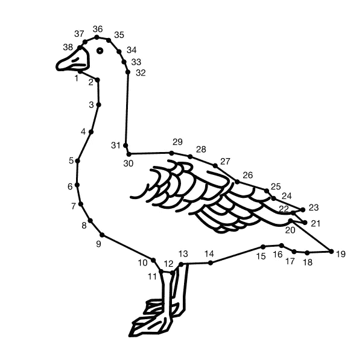
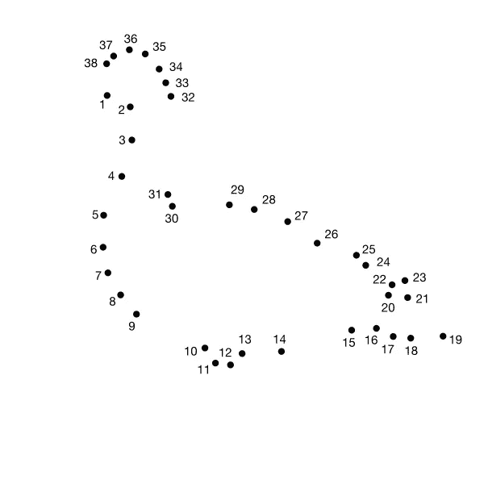
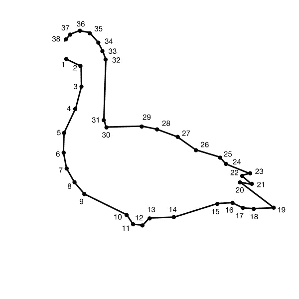

# 99 条关于数据分析的经验教训，来自于将前 5 名置于 5 个 Kaggle 分析挑战中

> 原文：<https://towardsdatascience.com/99-lessons-on-data-analysis-from-placing-top-5-in-5-kaggle-analytics-challenges-453d5e7b4581>

## 大师班:如何应对 Kaggle 分析挑战



(图片由作者提供)

我不得不同意批评者的观点: [Kaggle](https://www.kaggle.com/) 分析挑战与编写真实世界的数据分析报告没有太大关系。但我喜欢它们，因为它们能教会你很多用数据讲故事的基本原理。

> Kaggle Analytics 面临的挑战与编写真实世界的数据分析报告没有太大关系。但是[…]他们可以教你很多东西[…]。

这篇文章原本是一篇有段落和图片的恰当的文章。但是第一稿已经超过 7000 字，所以你只能得到一个列表条。

在这篇文章中，**我分享了迄今为止让我跻身五大 Kaggle Analytics 挑战前五名的“秘方”。**

不要把这个列表误解为规则的集合。在我之前获奖的 Kaggle 笔记本中，我并不总是遵循这些提示。相反，这个列表是我一路走来学到的教训的集合。

对于本文，我将提供 Python 中的代码片段，其中包含来自 Pandas、Matplotlib 和 Seaborn 库的函数。随意使用您喜欢的任何编程语言和补充可视化库。

```
import pandas as pd
import matplotlib.pyplot as plt
import seaborn as sns
```

# 准备

1.  了解**探索性**和**解释性**数据分析的区别。

> “当我们进行探索性分析时，就像在牡蛎中寻找珍珠一样。我们可能要打开 100 个牡蛎[……]才能找到两颗珍珠。当我们在向观众传达我们的分析时，我们真的希望处于解释空间，这意味着你有一个你想解释的具体事情，一个你想讲述的具体故事——可能是关于那两颗珍珠的。”— [3]

2.阅读问题陈述—理解问题陈述。

3.获得**整个数据集**的概览:

*   文件结构是什么？
*   整个数据集有多少个文件？
*   文件之间有什么关系？
*   什么是公共键列？

4.使用`df.info()`获得数据集中每个文件的**概览:**

*   一个文件中有多少列？
*   一个文件中有多少行？
*   列名是什么意思？
*   您拥有什么类型的数据(例如，数字、分类、时间序列、文本等。)?

5.阅读数据集的描述。

6.用`df.nunique()`检查唯一值的合理性和基数。

7.获取缺失值的概述。

```
# Display the percentage of missing values
df.isna().sum(axis = 0) / len(df) * 100# Visualize the missing values
sns.heatmap(df.isna(),       
            cbar = False,    
            cmap = "binary") 
```

8.如果你有一个大的数据集，你不需要查看所有的数据——但是不要在你的选择上偷懒。

9.做好准备，不是你创造的每一个情节都会出现在最终报告中。反正做了很多情节。

10.对于 **单变量分析只需要**三种类型的图:**直方图或箱线图用于数值特征，柱状图(计数图)用于分类特征。**

```
# Explore numerical features
sns.histplot(data = df, 
             x = num_feature)
sns.boxplot(data = df, 
            y = num_feature)# Explore categorical features
sns.countplot(data = df, 
              x = cat_feature)
```

11.记录你在代码中所做的事情——以后你会感谢自己的。

12.在探索性数据分析(EDA)期间，数据清理和特性工程应该自然地发生*。*

*13.数字特征可以伪装成分类特征，反之亦然。*

*14.注意伪装成不可信值的 NaN 值(例如-1、0 或 999)。有时，它们会在看起来并不可疑的分布中显示为可疑的峰值。*

```
*# Replace invalid values with NaN
invalid_value = 9999df["feature"] = np.where((df["feature"] == invalid_value), 
                          np.nan, 
                          df["feature"])*
```

*15.不要忽略离群值。你可能会发现一些有趣的东西。*

*16.看看边缘案例(前 5 名和后 5 名)。*

*17.通过**将一个特征分割成多个特征**或**将多个特征组合成一个新特征**来创建新特征。*

```
*# Splitting features
df["main_cat"] = df[feature].map(lambda x: x.split('_')[0])
df["sub_cat"] = df[feature].map(lambda x: x.split('_')[1])df[["city", "country"]] = df["address"].str.split(', ', expand=True)# Combining features
df["combined"] = df[["feature_1", "feature_2"].agg('_'.join, axis=1)
df["ratio"] = df["feature_1"] / df["feature_2"]*
```

*18.根据文本要素创建计数和长度要素。*

```
*# Creating word count and character count features
df["char_cont"] = df["text"].map(lambda x: len(x))
df["word_count"] = df["text"].map(lambda x: len(x.split(' ')))*
```

*19.`datetime64[ns]`特性包含很多新特性:*

```
*# Convert to datetime data type
df["date"] = pd.to_datetime(df["date"], 
                            format = '%Y-%m-%d')# Creating datetimeindex features
df["year"] = pd.DatetimeIndex(df["date"]).year
df["month"] = pd.DatetimeIndex(df["date"]).month
df["day"] = pd.DatetimeIndex(df["date"]).dayofyear
df["weekday"] = pd.DatetimeIndex(df["date"]).weekday
# etc.*
```

*20.对于坐标，第一个数字始终是纬度，第二个是经度(但是在绘制坐标时，纬度对应于 y 轴，经度对应于 x 轴)。*

```
*# Splitting coordinates into longitude and latitude
df["lat"] = df["coord"].map(lambda x: x.split(", ")[0]))
df["lon"] = df["coord"].map(lambda x: x.split(", ")[1]))*
```

*21.使用附加数据扩展数据集。它展示了你的创造力。您有三种方法可以获得额外的数据(按工作量降序排列):*

*   *创建你自己的数据集，*
*   *找到一个数据集并将其导入 Kaggle，*
*   *或者使用 Kaggle 上已经可用的数据集(我更喜欢这个)。*

*22.合并两个数据帧时，不要丢失有价值的数据点。此外，确保键列的**拼写**在两个数据帧中匹配。通过使用`len(df)`检查结果数据帧的长度，再次检查您的工作。*

*[](/how-to-merge-pandas-dataframes-35afe8b1497c)  

23.查看评估标准。



开始探索数据之前(图片由作者提供)

# 探索性数据分析

24.接受你(可能)无法查看数据中的所有关系。如果 n 是特征的数量，查看每一个可能的组合将会以(n+(n/2)+(n/3)的指数*放大*。

25.从绘制一些(随机)关系开始——只是为了熟悉数据。

26.不要在 EDA 期间浪费时间创建*花哨的*数据可视化(我保证我们稍后会实现)。

27.领域知识为王。做一些研究来熟悉这个话题。

28.投入一些时间去思考你想探索哪些方面。头脑风暴出一系列值得回答的问题。如果不知道从哪里开始，就从挑战主持人建议的研究问题开始。

29.在开始多元分析之前，先了解一下可能的关系(但请记住，以下两种方法都只考虑数字特征)。

```
# Display pair plot
sns.pairplot(df)# Display correlation matrix
sns.heatmap(df.corr(),         
            annot = True,      
            fmt = ".1f",       
            cmap = "coolwarm", 
            vmin = -1,         
            vmax = 1)
```

30.在每个情节之后，用要点的形式记录你的发现。

31.二元分析只需要**四种类型的图:**

*   两个数字特征之间关系的散点图

```
sns.scatterplot(data = df, 
                x = "num_feature_1", 
                y = "num_feature_2")
```

*   分类特征和数字特征之间关系的箱线图

```
sns.boxplot(data = df, 
            x = "cat_feature", 
            y = "num_feature")
```

*   两个分类特征之间关系的热图或条形图

```
temp = pd.crosstab(index = df["cat_feature_1"],
                   columns = df["cat_feature_2"])

# Bar chart
temp.plot.bar()# Heatmap
sns.heatmap(temp, annot = True)
```

32.`groupby()`方法是你多元分析的好朋友。

```
# How many feature_1 per feature_2?
df.groupby("feature_2")["feature_1"].nunique()# What is the average feature_1 for each feature_2?
df.groupby("feature_2")["feature_1"].mean()
```

33.有时间序列数据吗？使用线图进行**趋势分析。**

```
sns.lineplot(data = df, 
             x = "time_feature", 
             y = "num_feature")
```

34.您可以进行**多变量分析，而无需学习任何新的图**:

*   三个数字特征之间关系的色调或大小散点图

```
sns.scatterplot(data = df, 
                x = "num_feature_1", 
                y = "num_feature_2",
                hue = "num_feature_3")sns.scatterplot(data = df, 
                x = "num_feature_1", 
                y = "num_feature_2",
                size = "num_feature_3")
```

*   两个数字特征和一个分类特征之间关系的色调或样式散点图

```
sns.scatterplot(data = df, 
                x = "num_feature_1", 
                y = "num_feature_2",
                style = "cat_feature")sns.scatterplot(data = df, 
                x = "num_feature_1", 
                y = "num_feature_2",
                hue = "cat_feature")
```

*   两个分类特征和一个数值特征之间关系的分组条形图或箱线图

```
sns.barplot(data = df,
            x = "cat_feature_1", 
            y = "num_feature", 
            hue = "cat_feature_2")sns.boxplot(data = df,
            x = "cat_feature_1", 
            y = "num_feature", 
            hue = "cat_feature_2")
```

*   三个分类特征之间关系的堆积分组条形图

35.总是怀疑你的发现。花些时间对你的图表进行理智检查和反复检查，找出数据谬误，如**辛普森悖论** [2]。

> "一种现象，其中一种趋势出现在不同的数据组中，但当这些组被组合时就消失或逆转。"— [2]

36.读，读，读。通过研究扩展你的 EDA。

37.**建模可用于数据分析**。例如，您可以构建一个线性回归模型来预测下一年的值，您可以应用聚类来创建一个新的要素，或者您可以使用要素重要性来获得洞察力。

38.花一分钟来确保你正确地解释了这些情节。

39.确保你有足够多的情节(或洞察力来围绕它们构建一个故事)。

40.重构您的代码。它帮助您检测错误，并使您的代码对您的受众来说更容易访问和重现。

41.在这个阶段，如果各种数据可视化没有给人留下深刻印象，那也没关系。



将点点滴滴连接起来 EDA 之后的感悟(图片由作者提供)

# 解释性数据分析

42.讲故事比数据可视化更重要——相信我，[我赢得一等奖时用的大多是条形图](https://www.kaggle.com/code/iamleonie/japan-country-of-the-rising-women)。

43.选择一个明确的主题，围绕这个主题写一个故事。确保你回答的问题对竞赛主持人有用。

44.Kaggle Analytics 挑战赛的参赛作品是**而不是一组图**。它需要引言、正文和结论。

45.根据你的发现创建一个大纲。

46.不要犹豫丢弃你目前为止的大部分情节。

47.告诉你的听众关于数据集的情况。您正在处理哪些数据？有多少个数据点？是否添加了外部数据？

48.解释你做了什么。

49.展示你没看到的。你是否有一个有趣的假设，但数据并不支持它？展示并讨论它。

50.不要仅仅因为你认为数据可视化很酷就加入一个观点。如果发现与你讲述的整个故事不相关，删掉它。

51.写初稿。

52.现在是幻想情节的时候了(看，我遵守了我的诺言)。

53.如果你知道**你想要显示什么**，你会做更好的数据可视化。

54.仔细检查您正在使用的**指标**是否适合您想要显示的内容。例如，要衡量一个平台的受欢迎程度，你会使用账户总数还是日活跃用户平均数？

55.避免虚荣指标。

56.从[专家](https://medium.com/nightingale)那里获得一些灵感——但是要明白枯燥的数据可视化(也就是条形图)通常是最有效的。

57.根据您想要显示的(分布、关系、组合、比较)，决定使用哪种数据可视化。

58.你的最佳选择是这些**六种类型的图**及其变体:条形图、热图、直方图、散点图、箱线图和线图。

59.请记住，单个数字和表格也可以是数据可视化。

[](/essential-techniques-to-style-pandas-dataframes-8796c74c9ff3)  

60.请不要使用饼图。另外，请不要使用环形图。**如果你的剧情是以一个甜点命名的，那就不要用**(还有[做](https://www.kaggle.com/code/iamleonie/head-in-the-clouds)的时候，知道不应该)**。**

61.用条形图替换文字云。

62.拜托，拜托，请不要用 3D 特效。

63.有意使用 choropleth 地图(不仅仅是因为你有地理数据)。

64.定义调色板。至少有一种亮色和一种对比色。

```
# Set color theme
highlight_color = "#1ebeff"
contrast_color = '#fae042'from matplotlib.colors import LinearSegmentedColormap
custom_palette = LinearSegmentedColormap.from_list(" ",  [highlight_color,  '#ffffff', contrast_color])
plt.cm.register_cmap("custom_palette", custom_palette)
```

65.确保根据您的目的使用正确的调色板:

*   有序值的顺序(例如 1、2、3、…、)
*   具有中性中间值的相反值发散(例如-1，0，1)
*   分类值的定性

66.当你需要从上下文信息中转移焦点时，灰色是你的朋友。

67.确保你的颜色是色盲和影印安全。

[](/is-your-color-palette-stopping-you-from-reaching-your-goals-bf3b32d2ac49)  

68.像成年人一样想象:给你的图添加一个标题和标签。

69.如果合适，添加图例。

70.设置合适的字体大小。

```
plt.rcParams.update({"font.size": 14}) 
```

71.保持简单。从情节中去除任何干扰和冗余。

72.不要在 0 以外的任何地方开始你的条形图的数量轴。

73.不要比较两个不同轴范围的图。

74.不要用你的数据可视化误导你的观众，例如忽略 72。和 73。

75.将注释直接添加到绘图中。

```
ax.annotate("Annotation text", 
            xy = (x_pos, y_pos))
```

76.如果您正在处理有序分类数据，请确保对条形图中的条形进行排序，以正确表示有序要素。

77.利用前注意加工。

78.考虑“移动优先”(因为你的大部分读者会在他们的手机上阅读你的报告)。

79.看看每一个数据可视化。它在没有上下文的情况下传达了信息吗？如果没有，修改。


有效地传达你的见解——探索性和解释性数据分析的区别(图片由作者提供)

# 收尾

80.写第二稿。

81.数据可视化应该总是伴随着一些文本。将项目符号转换成文本。光靠情节是不够的。

82.修改和编辑你的第二稿。

83.在报告的开头使用引人注目的图片。(你可以在 Unsplash 上找到很棒的照片，但一定要注明出处。)

84.没人想看你的代码——把它藏起来。

85.也隐藏控制台警告。

```
import warnings # Supress warnings
warnings.filterwarnings("ignore")
```

86.查看您的细胞输出。如果它不是数据可视化，那么它必须有助于讲述你的故事。否则，也隐藏它。

87.以洞察力为先导——没有人会阅读你报告中的每一个字。在开头以项目符号的形式添加一个摘要。

88.用粗体突出你文章中的重点(因为没有人会去读你报告中的每一个字)。

89.一定要写好结论。我说过没人会读你报告的每一个字吗？

90.使用拼写检查器。语法上我喜欢。

91.确保选中挑战评估标准的所有复选框。

92.唷，表情符号。爱他们或恨他们——只要答应我不要过度，好吗？

93.请记住，您的受众可能不是数据科学家。你的分析可行吗？

94.引用你的消息来源。

95.花些时间想出一个好标题。

96.让一个朋友检查你的报告和/或大声读出来。

97.让报告休息几天。

98.给你的报告做最后的检查。

99.放下完美主义，屈服。

# 喜欢这个故事吗？

*如果你想把我的新故事直接发到你的收件箱里，一定要订阅*[](https://medium.com/subscribe/@iamleonie)**！**

*成为一名媒体会员，阅读更多来自我和其他作家的故事。报名时可以使用我的 [*推荐链接*](https://medium.com/@iamleonie/membership) *支持我。我将收取佣金，不需要你额外付费。**

*[](https://medium.com/@iamleonie/membership)  

*在*[*LinkedIn*](https://www.linkedin.com/in/804250ab/)*和*[*ka ggle*](https://www.kaggle.com/iamleonie)*！*

# 参考

[1]下面我列出了我的获奖 Kaggle 笔记本产品组合，供您参考:

*   2022: [《隐藏的宝石》中一提之后会发生什么？](https://www.kaggle.com/code/iamleonie/what-happens-after-a-mention-in-hidden-gems)参加[隐藏宝石笔记本比赛](https://www.kaggle.com/datasets/headsortails/notebooks-of-the-week-hidden-gems/discussion/317098?sort=recent-comments) ( [第一名](https://www.kaggle.com/datasets/headsortails/notebooks-of-the-week-hidden-gems/discussion/330871?sort=votes))
*   2021: [《云里雾里》](https://www.kaggle.com/code/iamleonie/head-in-the-clouds)为 [2021 Kaggle 机器学习&数据科学调查](https://www.kaggle.com/competitions/kaggle-survey-2021)([5 名获奖者中的 1 名](https://www.kaggle.com/competitions/kaggle-survey-2021/discussion/295401))
*   2020 年:[布卢姆前的马斯洛](https://www.kaggle.com/code/iamleonie/maslow-before-bloom/)为 [LearnPlatform 新冠肺炎对数字学习的影响](https://www.kaggle.com/competitions/learnplatform-covid19-impact-on-digital-learning)([5 个获奖者中有 1 个](https://www.kaggle.com/competitions/learnplatform-covid19-impact-on-digital-learning/discussion/287019))
*   2020:[](https://www.kaggle.com/code/iamleonie/impact-potential-analysis-of-water-use-efficiency)[CDP 用水效率](https://www.kaggle.com/competitions/cdp-unlocking-climate-solutions)影响潜力分析——解开气候方案 ( [第三名](https://www.kaggle.com/competitions/cdp-unlocking-climate-solutions/discussion/204739))
*   2019: [日本:崛起女性之国](https://www.kaggle.com/code/iamleonie/japan-country-of-the-rising-women)参加 [2019 Kaggle 机器学习&数据科学调查](https://www.kaggle.com/competitions/kaggle-survey-2019) ( [第 4 名](https://www.kaggle.com/competitions/kaggle-survey-2019/discussion/121041))

[2] geckoboard，《数据谬误》。geckoboard.com。[https://www . geckoboard . com/best-practice/statistical-fallacies/](https://www.geckoboard.com/best-practice/statistical-fallacies/)(2022 年 8 月 14 日访问)

[3] Nussbaumer Knaflic，C. (2015 年)。*用数据讲故事*。约翰·威利的儿子们。**