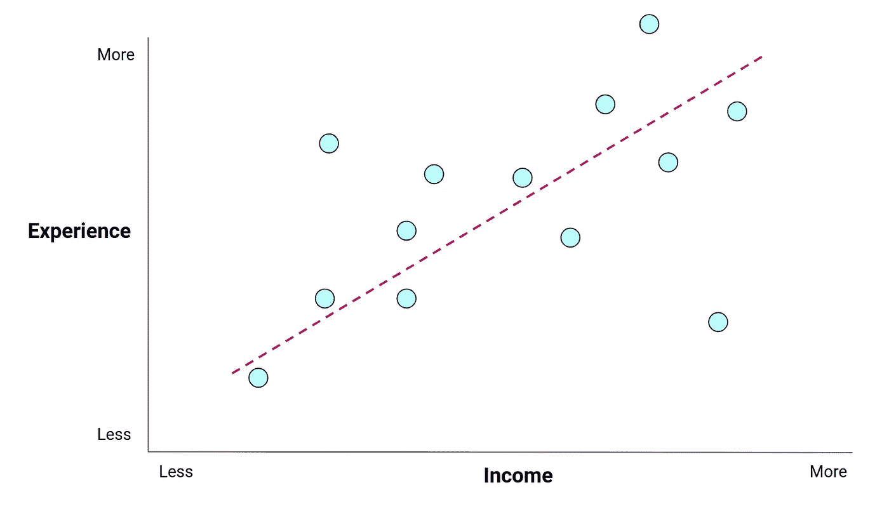
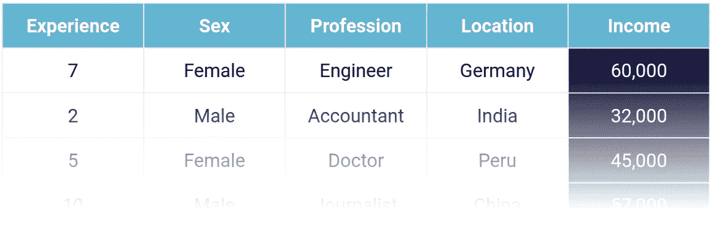
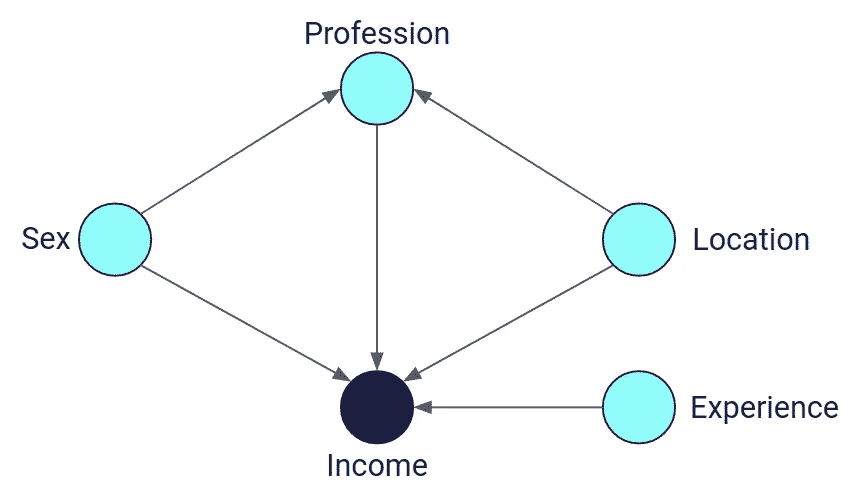
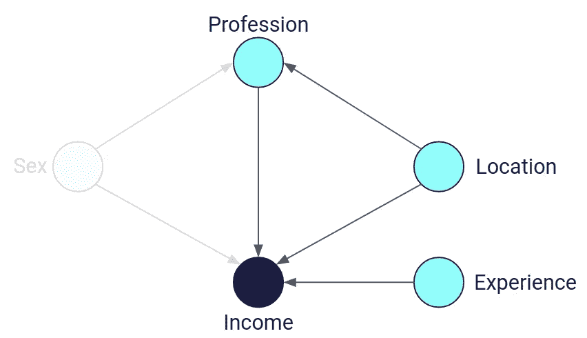
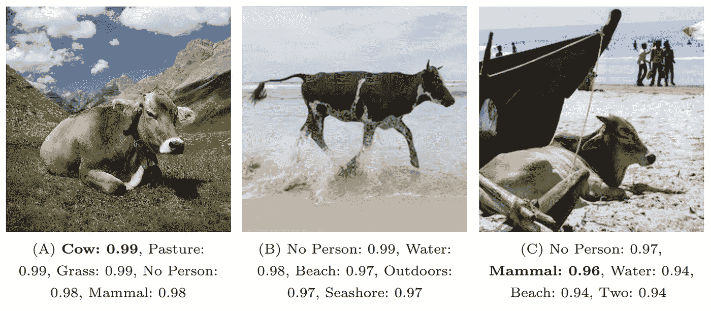

# 因果人工智能的 6 分钟介绍

> 原文：<https://towardsdatascience.com/a-6-minute-introduction-to-causal-ai-50d92ffb5e91>

## 快速了解现代人工智能系统是如何失败的，以及因果关系如何有所帮助

卡尔豪泽在 [Unsplash](https://unsplash.com/t/3d-renders?utm_source=unsplash&utm_medium=referral&utm_content=creditCopyText) 上拍摄的照片

现代人工智能系统使得解决许多以前认为计算机无法解决的问题变得容易。您可能听说过其中的一些成功案例，例如:

*   [**【GPT-3】**](https://www.technologyreview.com/2020/07/20/1005454/openai-machine-learning-language-generator-gpt-3-nlp/)**:**根据您提供的任何初始提示生成类似人类的文本段落。
*   [**alpha fold**](https://alphafold.ebi.ac.uk/)**:**预测蛋白质在 3D 空间中的形态。现代生物学的真正突破。
*   [**DALLE-2**](https://openai.com/dall-e-2/) :从文本描述中创建极其详细和逼真的图像。

这些系统如此之好，以至于他们甚至让那些致力于开发它们的人相信它们是有感知能力的。

然而，尽管取得了成功，这些系统中的许多可以被认为是技术鹦鹉。鹦鹉可以模仿它们的主人，但并不真正知道它们在说什么，也不知道它们为什么这么说。

类似地，现代人工智能系统可以模仿它们从以前的数据中学习到的模式，而无需了解正在解决的问题的真实背景，也不理解为什么会返回给定的预测。现代人工智能系统是大规模的鹦鹉，GPT-3 是在大约 30 亿个网页上训练的，并且具有巨大的社会影响。

这种鹦鹉学舌的最终结果是现代人工智能系统遭受以下三个 B:

1.  盲目的
2.  有偏见的
3.  易碎

这三个 B 意味着现代人工智能系统在处理它们所应用的微妙、复杂和高风险的应用程序方面存在缺陷。让我们探索一下因果关系的方法能有什么帮助。

# 盲目的

现代人工智能系统看不到数据点之间的关系类型，也缺乏它们用来解决的问题的背景。

为了说明这一点，考虑一下经验年限和收入之间的关系。通常，一个人的经验与其收入相关:经验越多，收入越高。反过来也是如此:收入越高，经历越多。你可以称这种双向关联为**联想关系**。

*图 1:显示工作年限和收入之间正相关的图表。*

另一种关系是**因果关系。在这种情况下，一个变量**引起另一个变量**的变化。一个人挣的收入是因为他多年的经验。与联想关系不同，因果关系是单向的；一个人的经历并不是由他们的收入引起的。**

因果技术为你提供了从因果关系中分离出关联的工具。通过**干预**系统，将某人的经验设定为一个给定值，你可以观察这将如何改变他们的收入。通过干预，你可以确定经验和收入之间的关系类型(因果或关联)，以及它的流向(经验导致收入)。你可以把**干预**看作是回答某种“如果”问题的一种方式:如果我是 45 岁，而不是 31 岁，我会挣多少钱？

现代人工智能系统非常擅长识别数据中的关联，这些关系是它们成功的基础。然而，由于这些系统传统上对因果关系视而不见，它们从数据中反复学习误导性的关联。这些误导性的关联，或者说**虚假的关联**，对于人工智能系统来说可能是致命且危险的。

直觉上，当我们不期望它在未来以过去的方式存在时，相关性就是虚假的。你可以在这里找到一个很棒的虚假相关性列表[。消除虚假的相关性是随机对照试验的基础；证明假设的科学黄金标准。](https://www.notion.so/A-6-Minute-Introduction-to-Causal-AI-423f7531c87244e8be874506e82060ca)

因果人工智能是强大的，因为它允许你使用现有的观察数据来识别和消除虚假的相关性——而不需要进行受控试验。

# 有偏见的

虚假相关性无处不在，现代人工智能系统会定期学习这些相关性。这些相关性经常会引入有害的偏见，下面的例子证明了这一点:

*   [谷歌的照片应用将黑人归类为大猩猩](https://www.bbc.co.uk/news/technology-33347866)
*   [一个微软聊天机器人被推特变得激进](https://www.notion.so/A-6-Minute-Introduction-to-Causal-AI-423f7531c87244e8be874506e82060ca)
*   [一种被广泛采用的犯罪预测软件被发现标记黑人被告为“高风险”的比率是其他人的两倍](https://www.notion.so/A-6-Minute-Introduction-to-Causal-AI-423f7531c87244e8be874506e82060ca)

为了说明因果技术如何有所帮助，让我们扩展之前考虑的收入预测示例，添加一些其他变量，如表 1 所示。

*表 1:收集的进一步数据有助于预测不同人群的收入。*

由于表 1 所示的观察数据中的历史偏见，接受过 it 培训的 AI 系统学会将女性与低收入联系起来。为了确保您的模型生成有用且安全的预测，需要控制这种偏差。

因果技术允许创建显示变量之间关系的**因果图**。此图中的每个箭头展示了一个变量如何对另一个变量产生因果影响，例如，经验对收入有因果影响。这允许您明确表示数据中的偏差。

*图 2:映射上表 1 所示变量之间关系的简化因果图示例。*

一旦你有了一个因果图，你相信它准确地描述了数据是如何相互关联的，它就可以被操纵来控制一系列不同的因素，包括消除偏差。

一种操纵可能是干预德国女工程师的性别，看看这将如何影响她们的收入。或者，通过[控制性别](https://en.wikipedia.org/wiki/Controlling_for_a_variable)，你可以从因果图中移除性别的影响。其结果是对其他因素对收入影响的无偏估计。

*图 3:一个经过处理的因果图，已经对性别进行了控制——去除了它对其他数据点的影响。*

# 易碎

现代人工智能系统是精密的系统，需要密切的微调以确保它们被正确配置。尽管接受了大量数据的训练，但从人类的角度来看，它们仍然可能以令人惊讶或微不足道的方式失败。图 4 显示了当奶牛在沙滩上而不是在田野里时，图像处理算法是如何识别不出奶牛的。尽管图像分类器在训练期间已经显示了成千上万的奶牛图像。

*图 4:当将现代物体检测器应用于奶牛图像时，当背景不是绿色时，它很难识别它们——这表明这些算法可能会失败。* [*来源*](https://www.ecva.net/papers/eccv_2018/papers_ECCV/papers/Beery_Recognition_in_Terra_ECCV_2018_paper.pdf) *。*

对于本博客中提到的现代人工智能系统的类型，对看不见和不熟悉的数据进行可靠预测的能力通常被称为一般化。因果机器学习以不同的方式处理一般化，因为现在观察到的数据和相应的因果图都被考虑-参见下面的图 5。

*图 5:可视化多个因果图如何描述相同的数据。从数学上来说，所有这些因果图都是对数据的有效描述，然而直觉上只有最左边的图是正确的。*

因此，因果模型试图从一组条件下的行为推广到另一组条件下的行为。应根据测试因果模型对不断变化的条件的稳定性的标准来选择因果模型，例如，当进行干预时。科学家在进行对照试验以确定因果关系时遵循这一原则。

其结果是，因果模型对现实世界中不断变化的条件更加稳健，能够更快地适应数据的巨大变化。这些优势使得人工智能研究人员开始将这些来自因果人工智能的一般化概念嵌入到他们正在构建的系统中。

# 结论

这是对因果人工智能的简要介绍，讨论了它带来的一些优势，以及这些优势如何帮助克服现代人工智能算法的盲目、偏见和脆弱的本质。

以下是三个关键要点:

1.  **因果图:**通过指定观察数据之间的关系，您可以更好地理解问题领域，减少偏差，并对图表进行操作，以模拟各种情况。
2.  **操纵:**通过操纵因果人工智能，可以对场景进行建模，并回答假设问题。这些操作允许对问题进行更深入的探索，并提供回答假设情况的能力。
3.  **概括:**因果人工智能更好地概括了看不见的数据，因为它是为了适应不断变化的环境而构建的，而不仅仅是不断变化的数据。

# 笔记

*很明显，决定一个人收入水平的因素不止这些。这些将在一个更完整的模型中建立起来，参见“偏见”一节，但为了简单起见，最初我们只考虑影响收入的多年经验，其余因素作为隐藏变量。