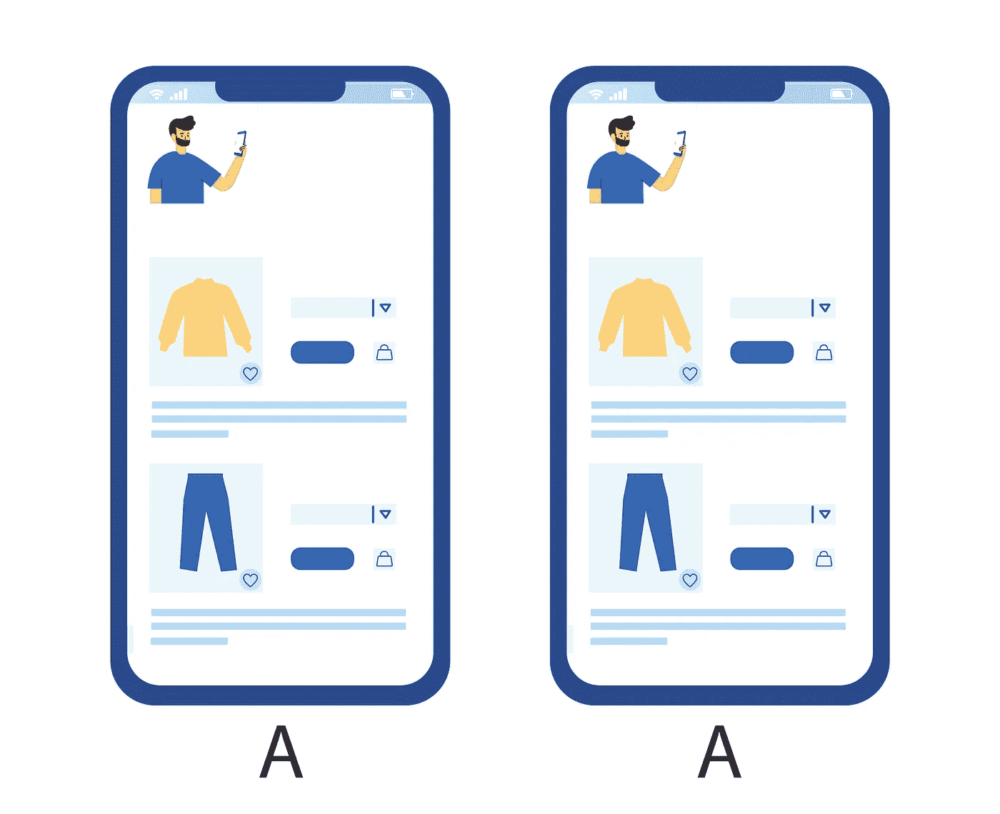

# A/A 测试建立对实验平台的信任

> 原文：<https://towardsdatascience.com/a-a-testing-establishes-trust-in-experimentation-platform-db30387d5bf9>

## 我们如何通过各种 A/A 测试来确保实验平台的可靠性

投稿人: [Max 李](https://medium.com/@qike_max_li)、[、](https://www.linkedin.com/in/chaoqi-bill/)

照片由[亚历克斯·舒特](https://unsplash.com/@faithgiant?utm_source=medium&utm_medium=referral)在 [Unsplash](https://unsplash.com?utm_source=medium&utm_medium=referral) 上拍摄

想象一下你的 A/B 测试平台的误报率高达 50%。你也可以完全放弃 A/B 测试，开始抛硬币来决定你的产品上市。假阳性率高于 50%也不是不可能。在开发我们的[百分位数测试](/how-wish-a-b-tests-percentiles-35ee3e4589e7)时，我们使用 A/A 测试来排除导致误报率高于 50%的测试方法。A/A 测试揭示假阳性，对于建立对 A/B 测试平台的信任至关重要。A/A 测试已经成为 Wish 的标准实践，并帮助我们评估假设和识别错误。

在 [A/A 测试](https://www.optimizely.com/optimization-glossary/aa-testing/#:~:text=What%20is%20A%2FA%20testing,the%20experiment%20is%20statistically%20fair.)中，实验桶(如控制和处理)是相同的。从你的 A/A 测试返回的任何有统计学意义的结果都是假阳性。一个值得信赖的 A/B 测试平台应该很少有来自 A/A 测试的假阳性(如果应用的阈值是标称的*p*-值< 5%)，大约为 5%。

这篇文章分享了我们如何通过各种 A/A 测试获得对我们的 A/B 测试平台的信心。

A/A 测试(*图片来自 Wish 的龚铭)*

# 回顾性 A/A 测试检测实验偏差

我们对每个实验进行回顾性的 A/A 测试(即任务前测试)。A/B 测试比较来自控制用户组和来自治疗用户组的度量数据。预分配测试进行相同的比较，除了在用户第一次接触实验之前 X(例如，60)天生成度量数据。预分配测试的统计显著性结果表明 A/B 测试中存在偏差。

当实验前对照桶和处理桶之间的度量存在预先存在的差异时，我们无法判断 A/B 测试期间出现的度量差异是固有的还是由处理引起的。通过对用户进行适当的随机化，不应该存在统计上显著的预先存在的差异，因为两组用户在实验之前有相同的经历。

来自预分配测试的小的*p*-值表明实验特征的看似显著的度量影响可能是由于用户分配期间引入的偏差。例如，由于不正确的实验设置，应用程序最新版本的用户都被分配到治疗。在这种情况下，即使没有实验中的新用户体验，治疗用户也可能比控制用户更活跃，购买更多。分配前测试会发现，治疗使用者甚至在实验之前就已经有了更多的购买。

我们随意为每个 A/B 测试运行预分配测试，并使用保守阈值:*p*-值< 0.0005。在实践中，有偏差的 A/B 测试通常会产生非常重要的 *p* 值，并导致几个指标的预分配警告。

即使 A/B 测试平台总体上是可靠的，特定实验的不正确设计或不幸运的用户分裂(即随机化)仍然可以使 A/B 测试有偏差。预分配测试评估特定实验和特定用户划分的假阳性。

# A/A 测试显示假阳性

## 揭示不同环境下的误报

我们为不同的场景创建各种 A/A 测试，例如转换漏斗中的多个步骤(例如，产品印象、点击、添加到购物车和购买)、客户端和服务器端实验、注销和登录实验等。

此外，我们鼓励不同的团队保持他们的 A/A 测试，以确保假阳性在他们的领域得到很好的控制。例如，一个主要试验视频购物体验的团队应该对视频购物页面进行 A/A 测试。当他们在视频购物页面上运行的其他实验中出现意外结果时，运行 A/A 测试将作为基线。

## 揭示实验的假阳性

每当 A/B 测试的结果看起来可疑时，我们鼓励 Wish experiments 做的第一件事就是运行一个并行的 A/A 测试——一个与可疑 A/B 测试配置相同的 A/A 测试，除了两个实验桶之间的用户体验没有区别。

我们对平台的一些重大改进始于通过这些 A/A 测试发现的问题。例如，之前的 A/A 测试揭示了我们的分配算法的一些缺点，这导致了显著的[改进](/assign-experiment-variants-at-scale-in-a-b-tests-e80fedb2779d)。

## 揭示由新开发引入的假阳性

我们不断改进我们的实验平台。在每个主要开发之后，我们运行 A/A 测试。A/A 测试通常是新开发后的第一项检查，以防止高假阳性率。例如，由于 A/A 测试发现的问题，我们改进了注销实验的初始实现。

# 结论

A/A 测试是在 A/B 测试平台中建立信任的重要工具。细节往往是魔鬼。尽管 A/B 测试的概念是琐碎的，但是正确地进行 A/B 测试却异常困难。全面的 A/A 测试对于系统地评估 A/B 测试平台是必不可少的。A/A 测试评估假阳性并验证 A/B 测试平台的可靠性。我们之前的出版物介绍了评估假阴性的方法。

# 感谢

感谢史成熙、、托德·霍兹和罗伯·雷思玛设计了 A/A 测试，感谢龚铭设计了这些情节。我们也感谢 Pai Liu 的支持，以及 Pavel Kochetkov、Lance Deng 和 Delia Mitchell 的反馈。