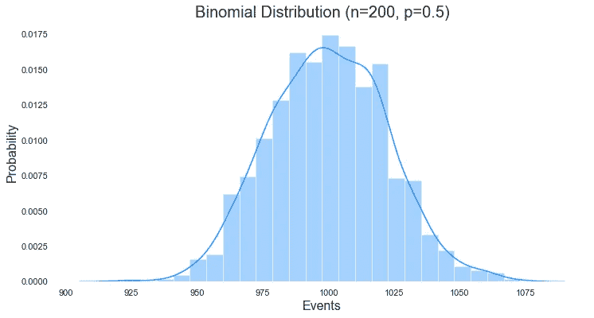
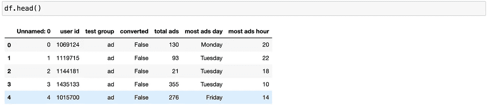
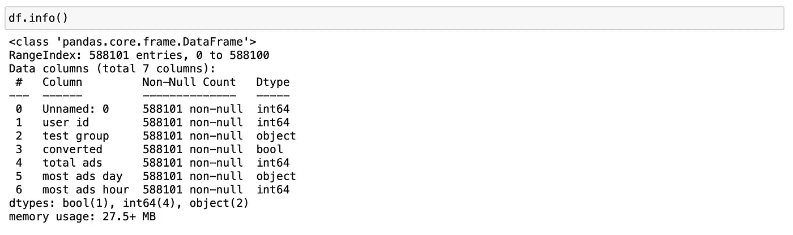
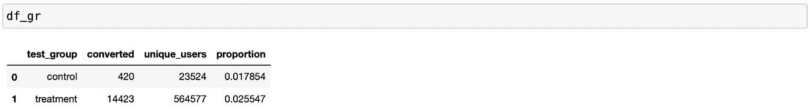
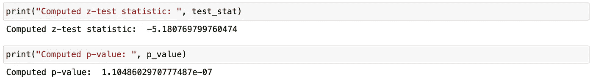

# 二进制数据的 A/B 检验:两个样本比例 z 检验

> 原文：<https://towardsdatascience.com/a-b-testing-with-binary-data-two-sample-proportions-z-test-5c222d7772ad>

## 找出营销活动中两个用户群之间的统计差异

> “但你不再听到这首歌了。你已经走了，我的孩子，进入你的故事。你知道你永远不会变成一条鱼，你永远不会到达伊塞克湖，或者看到白色的船，或者对它说:“你好，白色的船，是我”？你游走了。”
> ― **钦吉兹·艾特玛托夫，白色蒸汽船**


吉尔吉斯斯坦冬季的伊塞克湖。照片由[麦克·杜丁](https://unsplash.com/@mikedudin?utm_source=unsplash&utm_medium=referral&utm_content=creditCopyText)在 [Unsplash](https://unsplash.com/s/photos/issyk-kul-lake?utm_source=unsplash&utm_medium=referral&utm_content=creditCopyText) 上拍摄

# 介绍

在当今数据驱动的世界中，我们总是听到关于 ***数据驱动决策*** 及其在各种评估中的重要性，如医疗试验、预测选举、估计营销活动的效果等。用来做出这些决定的一个强大工具是 ***假设检验*** 。

作为一名数据科学家，我发现与机器学习和深度学习相比，假设检验领域被忽视了。另一方面，我认为有必要更加强调如何使用每项测试，选择哪些测试以及如何正确地解释结果。

在本帖中，我想讨论如何 ***解读双样本比例******z***-***检验*** 的结果，以及如何理解比例的差异是否具有统计显著性。在进入正题之前，我们先讨论一下假设检验和 A/B 检验以及它们之间的联系。

# 什么是假设检验，它是如何工作的？

**假设检验**是一种统计程序，允许使用样本数据得出关于总体的结论。在假设检验中，我们评估关于总体的两个互斥的陈述，并决定哪一个由数据支持[1]。

应用假设检验的一个巨大好处是，您可以使用样本数据得出关于整个人口的结论。然而，这也带来了一个折衷，您需要考虑样本误差。

# **A/B 检验及其与假设检验的联系**

***A/B 测试*** 是*中的一种 ***应用，在科技公司中广泛使用。例如，一家公司想要了解哪个广告的转化率更高。在这种情况下，我们运行一个假设测试，我们将用户分成一个控制组和一个治疗组，并向他们展示不同的广告。然后，我们选择了一个指标来衡量每个小组的参与程度。****

****A/B 测试*** 也有其 ***的弊端*** :*

*   *它可以帮助你比较两个选项，但不能评估你没有考虑过的选项*
*   *由于 ***新奇效应*** 和 ***厌恶等因素，在对现有用户进行测试时可能会产生有偏差的结果。****

****新奇效果:*** 现有用户可能会对新版本产生优势，因为他们可能会对这种变化感到兴奋，即使在更长的时期内这对他们没有任何好处*

****变更厌恶:*** 现有用户可能会因为对变更不满和/或更习惯旧版本而给予旧版本优势[2]。*

# ***二进制数据的 A/B 检验:两样本比例检验***

*首先，我们来谈谈二进制数据。 ***二进制数据*** 只能有两个值:1 或 0，男性或女性，通过或失败等。当我们计算比例或百分比时，二进制数据很有用。如果你能把一个观察结果分成两类——你就有了一个二元变量。*

*二进制数据遵循几种分布中的一种。最常见的是二项分布。 ***二项式分布*** 是一种概率分布，表示在给定的一组假设或参数下，一个值取两个独立值之一的可能性【3】。*

**

*二项式分布的一个例子。图片来源于作者*

*二项分布有以下 ***假设*** :*

1.  ****只有 2 种可能的结果*** 。例如 0 或 1、通过或失败等)*
2.  ****每次审判*** 都是 ***独立***——一次审判的结果不影响另一次审判。例如，抛一枚公平的硬币*
3.  ****概率*** 随时间保持 ***常数*** 。例如，在生产中，随着时间的推移，可能会出现生产缺陷产品的变化*
4.  ****试验次数*** 为 ***固定***【1】。*

*当我们在假设检验和二项分布的背景下谈论二元数据时，我们也可以听到事件、试验和比例。*

****事件*** —结果的集合或二进制数据中的两个值之一。*

****试验*** —每组中被测试的人数或项目数。*

****比例*** —事件/审判[1]。*

*当我们想要检查两个总体的比例是否存在差异时，我们应用两样本比例 z *-* 检验。让我们通过一个 Python 代码的例子来理解测试是如何工作的，以及如何解释它的结果。*

# ***营销活动的双样本比例 z 检验***

## *数据*

*我正在使用来自 Kaggle 的营销活动数据集。提供数据集是为了发现广告是否成功，公司可以从广告中获得多少，以及两组之间的差异是否具有统计学意义[4]。*

*让我们看一下数据*

****

## *数据清理*

*让我们做一些简单的数据清理和汇总数据，看看每个组的比例是多少。*

```
*# Drop a column
df.drop(columns=[‘Unnamed: 0’], inplace=True)# Let us rename columns
df.columns = ['user_id', 'test_group', 'converted', 'total_ads',
              'most_ads_day', 'most_ads_hour']# Let's rename 'ad' and 'psa' to 'treatmen' and 'control'
df.replace({'test_group':{'ad':'treatment',
                          'psa':'control'}}, inplace=True)# Calculate conversion rate/proportion per user group
df_gr = df.groupby('test_group').agg({'converted':'sum',
                                 'user_id':'nunique'}).reset_index()df_gr.columns = ['test_group', 'converted', 'unique_users']
df_gr['proportion'] = (df_gr['converted']) / df_gr['unique_users']*
```

*让我们看看每个用户群的比例*

**

*治疗组的转化率高于对照组，分别为 2.55%和 1.78%。让我们了解一下这种差异在统计上是否显著。*

## *假设检验*

*我们将对照组的**转化率命名为比例 1 ( **p1** )，将处理组**的**转化率命名为比例 2 ( **p2** )。***

*然后，*

*   ****H0: p1 = p2****
*   ****H1: p1 < p2(左尾)****

*零假设表示比例没有差异，而另一个假设表示比例 1 小于比例 2。即存在广告的效果。*

*在我们开始应用双样本比例 z 检验之前，让我们计算一下这个比例差异所需的最小样本量。*

## *估计样本量*

```
*def z_calc(p1, p2, n1, n2):
    p_star = (p1*n1 + p2*n2) / (n1 + n2)
    return (p2 - p1) / math.sqrt(p_star*(1 - p_star)*((1.0 / n1) + (1.0 / n2)))def sample_required(p1, p_diff, alpha):
    if p_diff <= 0:  # p_diff = p2-p1
        raise ValueError("p_diff must be > 0")
    n = 1
    while True:
        z = z_calc(p1, p1+p_diff, n1=n, n2=n)
        p = 1 - stats.norm.cdf(z)
        if p < alpha:
            break
        n += 1
    return nsample_size = sample_required(df_gr[['proportion'][0]][0],
                             (df_gr[['proportion'][0]][1] -       df_gr[['proportion'][0]][0]),
0.05)*
```

*每组的样本量为 1，942。让我们将用于分析的 ***样本量*** 设置为***【20，000】***，这远远高于所需的最小样本量，略低于最小用户群规模(治疗组为 23，524 个用户)。通常，样本量越大，结果就越接近总体结果。*

## *随机抽样*

```
*# Split the data into 2 dataframes for each group
df_tr = df[df[‘test_group’] == ‘treatment’]
df_ctrl = df[df[‘test_group’] == ‘control’]# Take random samples
df_tr_sample = df_tr.sample(n=20000, random_state=23)
df_ctrl_sample = df_ctrl.sample(n=20000, random_state=23)df_sample = pd.concat([df_tr_sample, df_ctrl_sample], ignore_index=True)# Calculate proportions
df_sample_gr = df_sample.groupby('test_group').agg({'converted':'sum',
                                 'user_id':'nunique'}).reset_index()df_sample_gr.columns = ['test_group', 'converted', 'unique_users']
df_sample_gr['proportion'] = (df_sample_gr['converted']) / df_sample_gr['unique_users']*
```

**

*随机样本数据的比例*

## *估计统计显著性*

```
*# Looking at df_sample_gr, let us fill in the success numbers and the total sample sizes for each groupnumber_of_successes = [348, 497]
total_sample_sizes = [20000, 20000]# Calculate z-test statistic and p-value
test_stat, p_value = proportions_ztest(number_of_successes, total_sample_sizes, alternative='smaller')*
```

**

*结果🎉*

*假设在实验开始前建立了 5%的显著性水平。在这种情况下，我们看到我们的 ***结果是统计显著的*** 和 ***我们有证据拒绝零假设*** 。*

****P 值*** 显示样本证据反对零假设的强度。如果低于显著性水平，则您的结果在统计上是显著的。换句话说，p 值告诉您样本数据与空值的矛盾程度。较低的 p 值代表了反对零的更有力的证据。*

# *摘要*

*   ****双样本比例测试*** 允许您 ***比较两个用户组*** 的比例，这在市场营销中用于评估转换率/其他基于二进制数据的指标的差异*
*   *结果显示，在对照组和治疗组之间存在统计学上的显著差异*
*   *随着测试的进行，我们学习了如何计算双样本比例测试的样本量，并了解了假设和 A/B 测试之间的差异。*

*感谢您的阅读，请在下面评论您对 A/B 测试及其在现实问题中的应用的看法。*

*博文的 [Jupyter 笔记本](https://github.com/aig3rim/ab_testing_two_sample_proportions_test/blob/main/ab_testing_two_sample_proportions_test.ipynb)可以在我的 [GitHub](https://github.com/aig3rim) 上找到。*

# *关于作者*

*Aigerim 是一名工程师出身的数据科学家，喜欢从数据中寻找见解。她坚信，通过更好地理解数据和应用机器学习算法，我们可以让世界变得更美好。*

*Aigerim 是一名数据科学家@ Rakuten，通过提供见解和致力于创建可扩展的数据科学产品，帮助各种外部客户做出更好的商业决策。*

*在空闲时间，Aigerim 喜欢阅读书籍，喜欢跑步和与她的助手 Taquito 一起去狗公园🐶*

*最后，请通过 [Linkedin](https://www.linkedin.com/in/aigerimshopenova/) 和 [Medium](https://aigerimshopenova.medium.com/) 联系 Aigerim。*

# *参考*

1.  *弗罗斯特 J. (2020)。*假设检验:数据驱动决策的直观指南*。吉姆出版社的统计。*
2.  *Udacity 关于 A/B 测试的课程:[https://www.udacity.com/course/ab-testing-ud 257](https://www.udacity.com/course/ab-testing--ud257)*
3.  **二项式分布如何工作*。(2021 年 10 月 9 日)。Investopedia。2022 年 7 月 3 日检索，来自[https://www . investopedia . com/terms/b/binomialdistribution . ASP](https://www.investopedia.com/terms/b/binomialdistribution.asp)*
4.  *法维奥·巴斯克斯。(2021).*营销 A/B 测试*(许可证:CC0:公共领域；版本 1)[数据集]。卡格尔。[https://www . ka ggle . com/datasets/faviovaz/marketing-ab-testing](https://www.kaggle.com/datasets/faviovaz/marketing-ab-testing)*