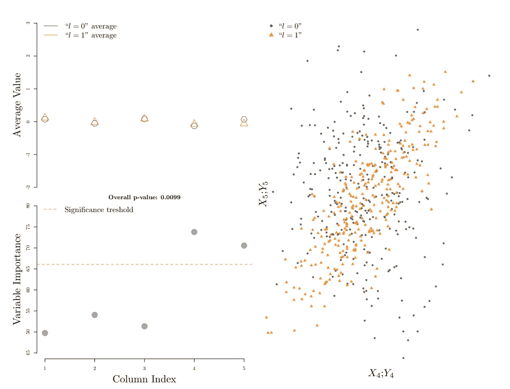
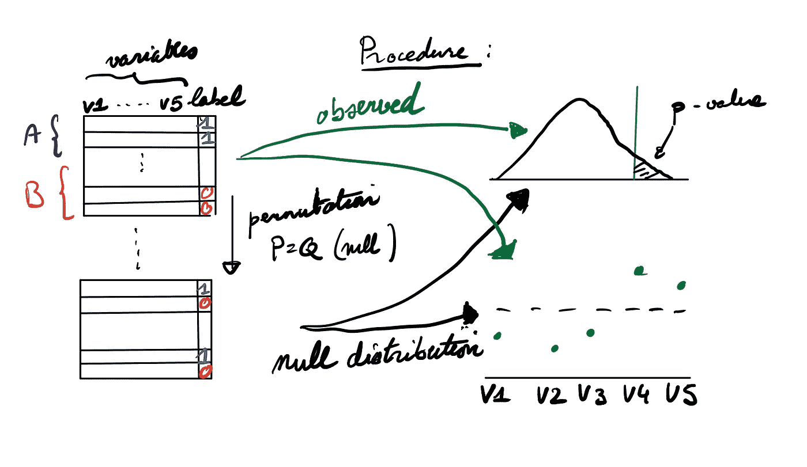

# 随机森林的 A/B 测试

> 原文：<https://towardsdatascience.com/a-b-testing-with-random-forest-b3c1421224dd>

## 基于随机森林的一般非参数 A/B 检验

图 1:来自原始论文的图(作者)**“使用随机森林进行双样本测试”**显示了测试的 p 值和变量重要性(左)以及数据在两个判别分量上的投影(右)。

撰稿人:[洛里斯·米歇尔](https://medium.com/u/f562dceaeb63?source=post_page-----b3c1421224dd--------------------------------)，[杰弗里·纳夫](https://medium.com/u/ca780798011a?source=post_page-----b3c1421224dd--------------------------------)

A/B 测试在商业决策中的重要性并不是一个新话题。我们可以将读者引向这个[故事](/simple-and-complet-guide-to-a-b-testing-c34154d0ce5a)来很好地概括 A/B 测试背后的主要步骤和挑战。

然而，在选择测试统计数据时，有时会发现这是一项具有挑战性的任务，因为缺少比较 A 组和 b 组的精确指标。事实上，我们可能无法提前知道两组中潜在的数据偏移会是什么情况。然而，我们仍然希望获得一个有效的统计检验，该检验可以:

*   *检测*A 组和 B 组之间复杂的变化模式(这意味着该测试具有对抗广泛备选方案的能力)；
*   *告知*分布变化(如果测试不合格，提供关于分布差异的见解)。

在这个故事中，我们想要讨论一个最近的关于在双样本测试中使用分类的研究系列，它允许构造非常灵活的非参数测试，就像我们的 [***论文***](https://arxiv.org/pdf/1903.06287.pdf) 中建议的那样。

# 如何利用分类做 A/B 测试？

一般的双样本检验问题是基于两组样本(A: X_1，…，X_2 和 B: Y_1，..Y_2)假设分别来自两个不同的分布 P 和 Q，不管它们实际上是否来自同一分布，即 P=Q(零假设)。

想象一下，我们给来自 A 组的样品贴上一个标签(比如 1)，给来自 B 组的样品贴上另一个标签(比如 0)，与分类相对应的是一个有趣的类比:

> 如果可以根据给定的比随机更好的分类度量(例如准确度)在两组样本 A 和 B 之间进行分类(辨别),那么这应该见证两组之间的分布差异。相反，如果组 A 和 B 之间存在分布差异，则(适当的)分类器应该能够检测到这种差异，从而比随机地对这两个组进行更好的分类(再次根据某个分类度量)。

测试和分类概念之间更正式和详尽的比较可以在 [Kim et al. 2016](https://arxiv.org/abs/1602.02210) 中找到。我们现在提出一个我们在论文中做出的具体选择，即使用随机森林算法及其非常著名的 out-of-bag 度量。

# 随机森林和袋外(OOB)措施

随机森林是统计学习中非常著名的算法(我们可以将读者引向这篇[的帖子](/understanding-random-forest-58381e0602d2)以获得对随机森林的直观理解)。当涉及到分类任务时，它在真实数据集上的良好性能使它成为机器学习中非常受欢迎的算法(参见例如 [Delgado et al. 2012](https://jmlr.org/papers/volume15/delgado14a/delgado14a.pdf) )。

在我们的论文中，我们建议使用随机森林算法中著名的出袋(OOB)度量(参见这篇[文章](/what-is-out-of-bag-oob-score-in-random-forest-a7fa23d710)以直观理解 OOB 度量)。更具体地说，**我们使用每组(A 和 B)的 OOB 准确度之和作为测试统计量**和**使用排列构建有效测试。**图 2 提供了一个可视化描述我们的过程的模式，对于正式的演示，我们将读者引向我们的 [***页面***](https://arxiv.org/pdf/1903.06287.pdf) r，特别是关于我们的测试的更多细节和上下文的介绍。

图 2:hypo RF 测试程序示意图(作者)。在右侧，我们可以看到 p 值(上图)和变量重要性(下图)是如何通过排列产生的。

# 例子

作为一个玩具说明性示例，我们考虑来自 5 维上的两个分布 P 和 Q 的样本，它们具有以下特性:

*   P 和 Q 都是多元正态分布，有标准正态余量；
*   P 具有作为协方差矩阵(独立边缘)的单位矩阵，而 Q 与 P 的不同之处仅在于在其第四和第五分量之间具有正相关性 0.8。

在图 1 中，我们可以观察到 P 值相当小(例如，显著性为 5%)，这表明测试将拒绝空值(P=Q ),并能够根据左下方的变量重要性图发现分布变化的驱动因素(即使在这种情况下，变化仅出现在相关性中)。右图显示了采样点的最后两个分量。在左上角，估计的平均值，按组成部分和类别，这表明，如果只看边际，没有明显的分布差异。我们可以看到，根据零阈值(红色虚线)，最后两个分量被提取为相关变量。

# 结论

当涉及到 A/B 检验(双样本检验)时，通常情况下，当实验设计允许时，非常简单和基本的检验(t 检验、二项式检验等)就足够了。然而，值得记住的是，受机器学习分类启发的现代方法可以提供有效和强大的双样本测试。当事先不知道 A 组和 b 组之间的潜在差异时，这些测试可以在复杂的环境中帮助数据科学家。

***免责声明和资源:*** *我们意识到我们遗漏了许多细节(效率、关于何时使用或不使用此类测试的指导、功率研究等)，但希望能够打开思维的视野。我们的* [***页面***](https://arxiv.org/pdf/1903.06287.pdf)R**中可以找到 M *矿石的详细信息以及与现有测试的比较，并查看 CRAN 上的 R-package hypolf。***