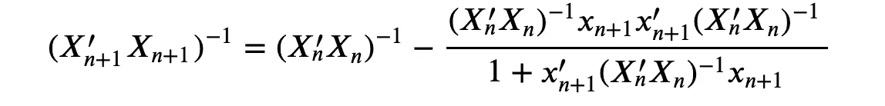
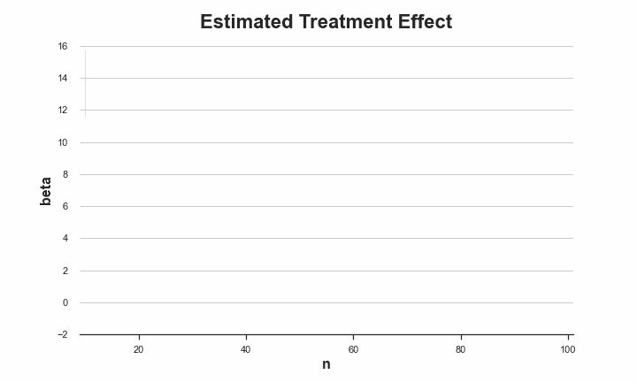
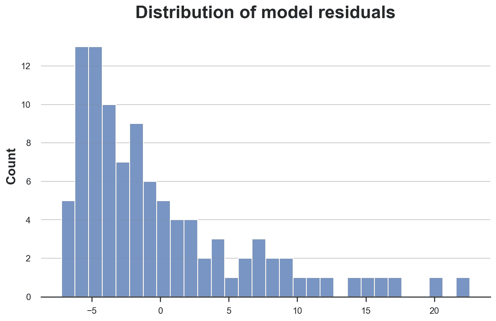
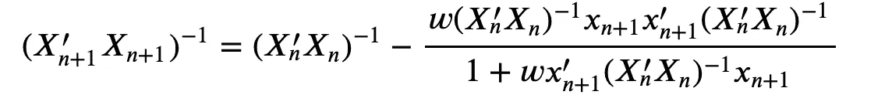

# A/B 测试、隐私和在线回归

> 原文：<https://towardsdatascience.com/a-b-tests-privacy-and-online-regression-b07ab46aa782>

## [因果数据科学](https://towardsdatascience.com/tagged/causal-data-science)

## *如何在不存储个体水平数据的情况下运行实验*

封面图片，由作者使用[nightcafe](https://creator.nightcafe.studio/)生成

**AB 测试**，又名[随机对照试验](https://en.wikipedia.org/wiki/Randomized_controlled_trial)，被广泛认为是计算治疗(药物、广告、产品等)对相关结果(疾病、公司收入、客户满意度等)的**因果**影响的黄金标准技术。该程序包括将一组受试者(患者、使用者、顾客……)随机分为治疗组和对照组，并对治疗组进行治疗。**随机性**确保两组之间的预期差异由治疗引起。

在 A/B 测试中，一个潜在的隐私问题是，为了评估治疗的效果，需要在整个实验过程中存储许多用户的数据。如果我们可以即时运行实验，这不是问题，但是当实验持续时间很长时，这可能会成为一个问题。在这篇文章中，我们将探索这个问题的一个解决方案:**在线回归**。我们将看到如何估计(有条件的)平均治疗效果，以及如何使用中心极限定理和 bootstrapping 进行推断，一次一个观察值，仅存储汇总信息。

⚠️:我已经省略了一些方程式后面的代数运算。如果你想看更多的背景代数，让我知道，我会很高兴地添加另一部分。

# 简单的例子

假设我们是一家金融科技公司。我们为我们的移动应用程序设计了一个新的用户界面(UI ),我们希望了解它是否会降低我们的交易速度。为了评估新用户界面对交易速度的因果影响，我们计划运行一个 **A/B 测试**或随机控制试验:我们将用户随机分成两组，向其中一组展示新用户界面，并比较两组的平均交易速度。

我们有一个主要问题:由于隐私原因，我们不能存储事务级信息。此外，我们不能一次性完成实验，因为我们只在交易完成时观察交易。我们能做什么？

先来看看**数据**。我从`[src.dgp](https://github.com/matteocourthoud/Blog-Posts/blob/main/notebooks/src/dgp.py)`导入数据生成过程`dgp_credit()`，从`[src.utils](https://github.com/matteocourthoud/Blog-Posts/blob/main/notebooks/src/utils.py)`导入一些绘图函数和库。为了不仅包括代码，还包括数据和表格，我使用了 [Deepnote](https://deepnote.com) ，一个类似 Jupyter 的基于网络的协作笔记本环境。

首先，我生成整个数据集。然后，我们将研究如何在数据动态到达的情况下执行实验分析。

我们有 100 个用户的信息，我们观察他们是否被随机分配了`newUI`，他们的`connection`速度和`transfer`速度。

首先，让我们通过在治疗指标(`newUI`)上回归感兴趣的结果(`transfer`速度)来估计治疗效果。随机化确保`newUI`的系数是因果治疗效果的**无偏**估计。

`newUI`的系数为正(6.5008)，但无统计学意义(p=0.113)。

我们怀疑`connection`速度也会影响`transfer`速度，对其进行分析可能会增加其功率。让我们运行同样的回归，添加`log(connection)`作为**协变量**。

实际上，估计的系数没有太大变化，但是标准误差已经减小，系数现在在 5%的水平上**具有统计显著性**(p = 0.031)。

为了理解我们如何一次运行一个数据点的线性回归，我们首先需要一个简单的线性代数回顾。

首先，让我们定义 *y* 因变量，`transfer`速度，以及 *X* 解释变量，`newUI`指示器，`log(connection)`速度和一个常数项。

OLS 估计量由下式给出

OLS 估算公式，作者图片

事实上，我们得到了与使用`smf.ols`命令完全相同的数字！

我们可以一次一个观察值地计算 OLS 系数*β*T4 吗？

答案是肯定的！假设我们有 *n* 个观察值，并且我们刚刚收到第 *n+1* 个观察值:一对(xₙ₊₁，yₙ₊₁).为了计算 *β̂ₙ₊₁，*我们只需要在内存中存储两个对象:

*   *β̂ₙ，*先前估计的 *β*
*   (Xₙ'Xₙ)⁻，X'X)⁻的前值

首先，我们如何更新(X'X)⁻？

更新规则(X'X)⁻，图片由作者提供

更新完(X'X)⁻)之后，我们可以更新 *β̂* 。

更新β *的规则，图片作者*

请注意，这个过程不仅是隐私友好的，而且是记忆友好的。我们的数据集是一个 100×4 的矩阵，而 X'X)⁻是一个 3×3 的矩阵，β是一个 3×1 的矩阵。我们只存储 12 个号码，而不是多达 400 个！

我们现在准备**估算**我们的 OLS 系数，一次一个数据点。然而，我们不能真的从第一次观察开始，因为我们不能对矩阵 X'X 求逆。我们至少需要 *k+1* 个观测值，其中 *k* 是 *X* 中变量的个数。

为了安全起见，我们使用 10 次观察中的一次**热启动**。

我们得到了完全相同的系数！不错！

我们是如何到达那里的？随着数据的积累，我们可以绘制出β̂估计值的演变图。动态标绘功能稍微麻烦一点，不过你可以在`[src.figures](https://github.com/matteocourthoud/Blog-Posts/blob/main/notebooks/src/figures.py)`里找到。

正如我们所看到的，随着数据点数量的增加，估计值似乎变得越来越不稳定。

这是真的吗？像往常一样，我们不仅对`newUI`对支出影响的点估计感兴趣，我们还想了解这个估计有多精确。

# 推理

我们已经看到了如何“在线”估计治疗效果:一次一个观察。我们可以用同样的方法计算估计量的方差吗？

首先，让我们回顾一下 OLS 估计量的方差是什么样子的。在基线假设下，OLS 估计量的方差由下式给出:

OLS 估计量的方差公式，作者图片

其中 *σ̂* 是残差*e=(y−x'β̂*的方差。

回归表报告了系数的标准误差，即 *Var(β̂)* 对角元素的平方根。

让我们检查一下，使用矩阵代数我们确实会得到相同的数。

的确，我们得到了完全相同的数字！

我们已经有方法在线更新 *β̂:* (X'X)⁻ *)的一部分方差。*我们如何更新σ̂？这是更新残差平方和的公式。

按作者更新图像的规则

为了从残差平方和 *S* 中得到残差方差 *σ̂* ，我们需要除以自由度:n–k = 100–3。

注意顺序很重要！S 是使用 X'X)⁻和β̂ 的旧值计算的，因此必须首先更新。

我们现在可以一次一个观测值地计算 *β̂* 及其估计方差。

我们确实得到了同样的结果！

如前所述，我们可以**绘制 OLS 系数估计值随时间的演变**，并增加正负一个标准差的置信区间。

正如我们所看到的，OLS 估计量的估计方差确实随着样本量的增加而减小。

# 引导程序

到目前为止，我们已经使用了中心极限定理背后的渐近假设来计算估计量的标准误差。然而，我们有一个特别小的样本。我们进一步检查模型**残差**的经验分布。

残差好像特别**偏**！在如此小的样本中，这可能是一个问题。

大样本理论的另一种选择是自助法。我们不再依赖[中心极限定理](https://en.wikipedia.org/wiki/Central_limit_theorem)，而是通过替换对数据集进行重新采样来近似估计量的分布。我们可以在线自举吗？

答案再次是肯定的！关键是**用从均值(和方差)等于 1 的泊松分布中提取的整数权重对每个观察值**进行加权。对于每个观察值，我们重复这个过程多次，并存储各自的中间估计值。我们将得到 *K* ，即自举样本的数量，而不是在任何时间点对 *β* 的单一中间估计。

(X'X)⁻和 *β̂* 的更新规则变为

更新规则(X'X)⁻与引导权重，按作者排序的图像

和

使用引导权重更新 *β̂* 的规则，图片作者

其中 *w* 是泊松权重。

我们现在可以运行在线评估。我们自举 *K=1000* 不同于 *β̂* 的估计。

我们可以通过计算自举系数向量的标准差来估计治疗效果的标准差。

估计的标准误差与以前的值[5.05，3.01，1.49]略有不同，但相差不是很远。

最后，有些人可能想知道"*为什么对离散重量而不是连续重量进行采样？*”。的确，我们可以。这个过程被称为**贝叶斯引导**，你可以在这里找到更详细的解释[。](/6ca4a1d45148)

# 结论

在这篇文章中，我们看到了如何运行一个实验，而不存储个人水平的数据。我们如何能够做到这一点？为了计算平均治疗效果，我们不需要每一个单独的观察值，但是存储一个更紧凑的表示就足够了。

该过程不仅是隐私友好的，而且是**存储器高效的**，因为反向得分矩阵(X'X)⁻和估计系数 *β̂* 通常具有比数据集小得多的维度(只要 *X* 的维度小，这可能是随机控制试验中的情况)。

## 参考

[1] W. Chou，[无资料保留的随机对照试验](https://arxiv.org/abs/2102.03316) (2021)，*工作论文*。

## 相关文章

*   [实验、窥视和最佳停止](/954506cec665)
*   [贝叶斯自举](/6ca4a1d45148)

## 密码

你可以在这里找到 Jupyter 的原始笔记本:

 [## Blog-Posts/online _ reg . ipynb at main matter courthoud/Blog-Posts

### 我的中型博客文章的代码和笔记本。为 matteocourthoud/Blog-Posts 的发展作出贡献

github.com](https://github.com/matteocourthoud/Blog-Posts/blob/main/notebooks/online_reg.ipynb) 

## 感谢您的阅读！

我真的很感激！🤗*如果你喜欢这个帖子并且想看更多，可以考虑* [***关注我***](https://medium.com/@matteo.courthoud) *。我每周发布一次与因果推断和数据分析相关的主题。我尽量让我的帖子简单而精确，总是提供代码、例子和模拟。*

*还有，一个小小的* ***免责声明*** *:我写作是为了学习所以错误是家常便饭，尽管我尽力了。当你发现他们的时候，请告诉我。也很欣赏新话题的建议！*