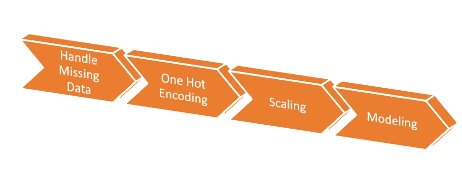
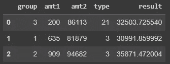
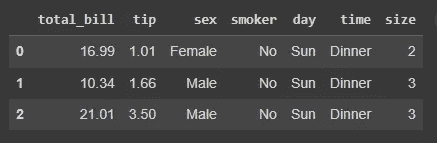
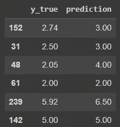

# Scikit Learn 中管道的基本介绍

> 原文：<https://towardsdatascience.com/a-basic-introduction-to-pipelines-in-scikit-learn-bd4cee34ad95>

## 使用 Python 中的 sklearn 创建第一个 ML 管道的 101


照片由[西格蒙德](https://unsplash.com/@sigmund?utm_source=unsplash&utm_medium=referral&utm_content=creditCopyText)在 [Unsplash](https://unsplash.com/s/photos/pipes?utm_source=unsplash&utm_medium=referral&utm_content=creditCopyText) 上拍摄

# 管道

管道是一排管子，你可以把东西从一边放到另一边，而不会中断。

将这个概念转移到我们的领域，数据科学，管道将是按顺序放置的许多操作，其中每个输出都成为下一个任务的输入，就像一个链。

> 管道是一组按顺序发生的任务，其中一个任务的输出成为下一个任务的输入，直到它最终输出最终产品。

管道的好处是，它们使我们的数据准备更快。此外，用它创建的对象也可以很容易地用于测试集，使我们更容易处理尚未转换的测试集或新数据。



数据科学管道图。图片由作者提供。

# 准备

让我们从模块导入开始。

```
# Basics
import pandas as pd
import numpy as np# Pipeline
from sklearn.pipeline import Pipeline# Scaler for standardization
from sklearn.preprocessing import StandardScaler# Modeling
from sklearn.linear_model import LinearRegression
from sklearn.model_selection import train_test_split
```

然后，我们将仅为演示目的创建一个数据集。

```
# Create dataframe
amt1 = np.random.randint(100,999, 1000)
amt2 = np.random.choice(np.random.randint(1500,200000), 1000)
b= np.random.randn(1000)
x = 0.195
x2 = 0.377df = pd.DataFrame({ 'group': np.random.choice([1, 2, 3], 1000),
'amt1': amt1,  'amt2': amt2,
'type': np.random.choice([11, 12, 21, 22, 3], 1000),
'result': ((amt1*x) + (amt2*x2) + b) })
```

数据集看起来像这样。我们将创建一个回归模型来预测*结果*变量。



数据集已创建。图片由作者提供。

如我们所见， *amt2* 的比例比 *amt1、*高得多，因此我们将在训练模型之前将它们放在相同的比例中。因此，一旦我们知道我们的步骤是什么，我们就可以创建一个包含两个元素的元组列表，其中第一个是步骤的名称，第二个是它的实例，如下所示:

```
( name_of_the_step', Instance() )
```

另一个提醒:确保您在管道中使用的实例是 **sklearn** 包的一部分，因为我担心它不能与来自其他库的方法一起工作。

# 建设您的第一条管道

让我们构建我们的第一个管道，并从`sklearn`中了解一些`Pipeline()` 方法。

1.  知道你想执行什么步骤。创建元组列表。

```
# Create the steps to be performed
steps = [('scale', StandardScaler()),
         ('LR', LinearRegression()) ]
```

2.创建管道对象。

```
pipe = Pipeline(steps)
```

3.拟合，预测，评分。

```
# Fit the pipeline
pipe.fit(X,y)# Score (for classification)
pipe.score(X, y)# Predict
pipe.predict(X.iloc[[0]])**[OUT]: array([15935.34117995])**
```

好的。我们刚刚创建了一个管道，将`df`数据框作为输入，在解释变量中应用缩放，并拟合一个线性回归模型。不错！

接下来，让我们在这些知识的基础上再做一点构建，并带来一个包含分类变量的数据集，这样我们就可以应用其他转换，并了解`ColumnTransformer`方法如何也可以非常有用地混合两个管道。

# 多层管道

在这一节中，我们将获得数据集*Tips(*native from seaborn)*—*，因为它有分类变量和数值变量—来处理预处理数据的管道，并用决策树模型对其建模。

让我们用`df = sns.load_dataset("tips")`加载数据。



Tips 数据集，内置于 seaborn。图片由作者提供。

就像我们以前学过的，我们首先必须知道我们要做哪些步骤。

*   我们需要对分类变量进行热编码。
*   我们想要调整数值变量。我们实际上不需要，因为这些数字在一个相似的规模上。但是在这种情况下，我们这样做只是为了学习。

如果你注意到，上面的每一个项目符号代表不同类型的变量:分类变量和数字变量。因此，在这种情况下，我们必须创建两个不同的管道。

首先，让我们在训练和测试中拆分数据集。

```
X = df.drop('tip', axis=1)
y = df.tip# Train test Split
X_train, X_test, y_train, y_test = train_test_split(X, y, test_size=0.2, random_state=12)
```

接下来，我们可以为`OneHotEncoding`创建管道。

```
# Tasks to perform
cat_steps = [('OHE', OneHotEncoder(drop='first', 
                                   handle_unknown='ignore'))]# Pipeline object
pipe_cat = Pipeline(cat_steps)
```

接下来，我们将为数字部分创建管道。

```
# Tasks to perform
num_steps = [('scale', StandardScaler()) ]# Pipeline object
pipe_num = Pipeline(num_steps)
```

好的。现在我们有两个管道对象。但是要将它们粘合在一起，使它们作为一个单独的变压器工作，我们必须使用`sklearn`中的`ColumnTransformer`方法。正在导入。

```
from sklearn.compose import ColumnTransformer
```

接下来，我们将收集分类变量和数值变量的名称作为列表，将它们作为列名输入，由每个管道进行转换。注意，我们调用了`ColumnTransformer`，并传递了 3 个元素的元组(`name, pipeline_object, columns_to_transform`)。

```
# Extracting the names of the categorical variables
categorical_vars = X.select_dtypes('category').columns.tolist()# Extracting the names of the numerical variables
numerical_vars = X.select_dtypes('number').columns.tolist()# Creating the multilayer pipe
one_pipe = ColumnTransformer(transformers=[
          ('numbers', pipe_num, numerical_vars),
          ('categories', pipe_cat, categorical_vars) ] )
```

如果您想看看这个转换的结果是什么样的，只需运行下面的代码。*虽然，这不是模型拟合的必要步骤。*

```
one_pipe.fit_transform(X)
**[OUT]:**
array([[ 1.,  0.,  1., ...,  0.,-0.31471131, -0.60019263],        
[ 0.,  1.,  1.,     ...,  0.,   -1.06323531,  0.45338292],        
[ 0\.        ,  1.,  1., ...,  0.,0.1377799 ,  0.45338292],
```

现在我们的数据已经预处理，我们可以建模。我们将添加一个带有`SelectKBest`的特征选择工具，并为此使用决策树回归器。

因此，下一步是导入`DecisionTreeRegressor`和`SelectKBest`并创建最后一个管道，将预处理和建模收集到一个对象中。

```
from sklearn.tree import DecisionTreeRegressor
from sklearn.feature_selection import SelectKBest, f_regression, mutual_info_regression# Final Pipeline
modeling = Pipeline([('preprocess', one_pipe),
('feature_selection', SelectKBest(score_func=f_regression, k=4)), ('model', DecisionTreeRegressor(criterion='absolute_error',
                                 min_impurity_decrease=0.006)) ])# Fit
modeling.fit(X_train, y_train)
```

这个最终的管道对象将执行以下步骤:

*   将数据作为输入，运行预处理管道。记住它是由执行一个热编码的`pipe_cat`和执行缩放的`pipe_num`组成的。
*   使用`f_regression`评分为模型选择 4 个最佳变量。
*   预处理后的数据将符合`DecisionTreeRegressor`模型。

我们可以评估该模型以查看结果。

```
# Predict
preds = modeling.predict(X_test)# Data Frame with some predictions
pd.DataFrame({'y_true': y_test, 'prediction': preds}).head(10)
```

接下来看看结果预测。



实际与预测。图片由作者提供。

我们看到有一些很好的预测。有些当场正确，有些不太好。让我们检查回归的度量。

```
# Mean Absolute Error
mean_absolute_error(y_test, preds)**[OUT]: 0.8914285714285712**
```

平均来说，我们会少 89 美分。tips 的真实数据平均值为 3.11。因此，0.89/3.11 大约是该值的 28%，表明我们的预测可能高达 30%。它不是最好的模型，但它服务于我们帖子的目的，展示如何在 Scikit Learn 中使用管道。

# 在你走之前

这篇文章向你介绍了 Scikit learn 的`Pipeline`方法。

*   pipelines 是一个在单个对象中链接许多转换的对象。
*   定义步骤，并将它们放入格式为`[('name of the step', Instance())]`的元组列表中
*   数字数据和分类数据的管道必须分开。
*   我们可以使用`ColumnTransformer`方法合并两个或更多的管道。但是它不支持估计器(用于建模的算法)。

如果你喜欢这些内容，请关注我的博客，或者[在 Linkedin](https://www.linkedin.com/in/gurezende/) 上找到我。

[](http://gustavorsantos.medium.com/) [## 古斯塔沃·桑托斯-中等

### 阅读古斯塔夫·桑托斯在媒介上的作品。数据科学家。我从数据中提取见解，以帮助个人和公司…

gustavorsantos.medium.com](http://gustavorsantos.medium.com/) 

# 参考

[](https://scikit-learn.org/stable/modules/generated/sklearn.pipeline.Pipeline.html#sklearn.pipeline.Pipeline) [## sklearn.pipeline.Pipeline

### 使用 sklearn.pipeline.Pipeline 的示例:特征聚集与单变量选择特征聚集与…

scikit-learn.org](https://scikit-learn.org/stable/modules/generated/sklearn.pipeline.Pipeline.html#sklearn.pipeline.Pipeline) [](https://scikit-learn.org/stable/modules/generated/sklearn.feature_selection.SelectKBest.html#sklearn.feature_selection.SelectKBest) [## sklearn.feature_selection。选择最佳

### 使用 sklearn.feature_selection 的示例。select kbest:sci kit 发布亮点-了解 1.1 发布亮点…

scikit-learn.org](https://scikit-learn.org/stable/modules/generated/sklearn.feature_selection.SelectKBest.html#sklearn.feature_selection.SelectKBest) [](/how-to-use-sklearn-pipelines-for-ridiculously-neat-code-a61ab66ca90d) [## 如何将 Sklearn 管道用于极其简洁的代码

### 我喜欢的关于 Scikit-Learn 的一切，都在一个地方

towardsdatascience.com](/how-to-use-sklearn-pipelines-for-ridiculously-neat-code-a61ab66ca90d)