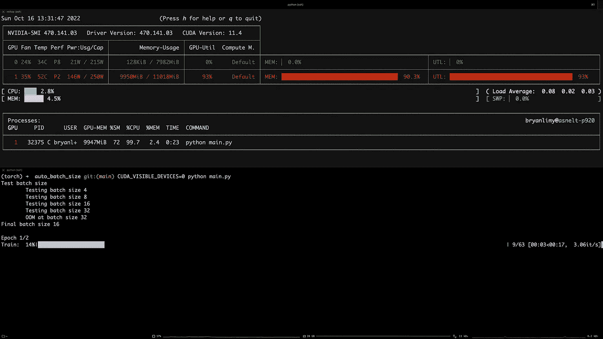

# 批量过大:寻找适合 GPU 的批量大小

> 原文：<https://towardsdatascience.com/a-batch-too-large-finding-the-batch-size-that-fits-on-gpus-aef70902a9f1>

## 一个简单的函数，用于确定 PyTorch 型号的批量大小，该批量可以填充 GPU 内存

我相信你们中的许多人都有以下痛苦的经历:你在你的 GPU 上开始多个 ML 实验以通宵训练，当你 10 个小时后回来检查时，你意识到进度条几乎没有移动，因为硬件利用不足，或者更糟的是，所有实验都因内存不足(OOM)错误而失败。在这个迷你指南中，我们将实现一个自动方法来为您的 PyTorch 模型找到批量大小，该批量大小可以充分利用 GPU 内存而不会导致 OOM！

在 [Unsplash](https://unsplash.com?utm_source=medium&utm_medium=referral) 上由[娜娜杜瓦](https://unsplash.com/@nanadua11?utm_source=medium&utm_medium=referral)拍摄的照片

除了模型架构和参数数量，批处理大小是控制实验使用的 GPU 内存量的最有效的超参数。找到可以充分利用加速器的最佳批量的适当方法是通过 GPU 配置文件，这是一种监控计算设备上的进程的过程。 [TensorFlow](https://www.tensorflow.org/tensorboard/tensorboard_profiling_keras) 和 [PyTorch](https://pytorch.org/tutorials/recipes/recipes/profiler_recipe.html) 都提供了关于如何在其框架中执行概要分析的详细指南和教程。此外，批量大小会极大地影响模型的性能。例如，一个大的批量会导致较差的泛化能力，如果你对这个话题感兴趣的话，可以看看[沈世爱](https://medium.com/@kevinshen-57148?source=post_page-----21c14f7a716e--------------------------------)关于[批量对训练动态的影响](https://medium.com/mini-distill/effect-of-batch-size-on-training-dynamics-21c14f7a716e)的博客文章。

然而，如果你只是想训练一个模型来测试一个想法，那么通过剖析或执行超参数搜索来寻找最佳批量可能是多余的，尤其是在项目的早期阶段。一种常见的方法是，在使用`nvidia-smi`或`[nvitop](https://github.com/XuehaiPan/nvitop)`之类的工具监控 GPU 利用率的同时，用小批量训练模型，从而找到一个不需要 OOM 就可以拟合模型的值。然后，如果模型未充分利用 GPU 内存，则增加该值，并重复该过程，直到达到内存容量。但是，这种手动过程可能非常耗时。更令人恼火的是，当你不得不在不同内存大小的不同 GPU 上运行实验时，你必须为每台设备重复相同的过程。幸运的是，我们可以将这个繁琐的迭代过程转换成代码，并在实际实验之前运行它，这样您就知道您的模型不会导致 OOM。

这个想法很简单:

1.  初始化您的模型。
2.  将批次大小设置为 2(对于 BatchNorm)
3.  创建将样本形状作为真实数据的虚拟数据。
4.  训练模型进行`n`步骤(向前和向后传球)。
5.  如果模型运行时没有出现错误，则增加批量并转到步骤 3。如果 OOM 升高(即 PyTorch 中的`RuntimeError`),则将批量设置为之前的值并终止。
6.  返回最终的批量大小。

把它写成代码

如您所见，该函数有 7 个参数:

*   `model` —你想要拟合的模型，注意，该模型将在函数结束时从内存中删除。
*   `device` — `torch.device`应该是 CUDA 设备。
*   `input_shape` —数据的输入形状。
*   `output_shape` —模型的预期输出形状。
*   `dataset_size` —数据集的大小(当批处理大小已经大于数据集的大小时，我们不想继续搜索)。
*   `max_batch_size` —设置要使用的最大批量的可选参数。
*   `num_iterations` —增加批量前更新模型的迭代次数，默认为 5 次。

让我们快速浏览一下函数中发生了什么。我们首先将模型加载到 GPU，初始化 Adam optimizer，并将初始批处理大小设置为 2(如果您没有使用 BatchNorm，可以从批处理大小 1 开始)。然后我们可以开始迭代过程。首先，我们检查当前的批处理大小是否大于数据集的大小或所需的最大批处理大小，如果是，我们就中断循环。否则，我们创建虚拟输入和目标，将它们移动到 GPU 并拟合模型。我们用 5 个步骤训练模型，以确保向前或向后传球都不会导致 OOM。如果一切正常，我们将批量乘以 2，并重新拟合模型。如果在上述步骤中发生了 OOM，那么我们将批量减少 2 倍并退出循环。最后，我们从内存中清除模型和优化器，并返回最终的批量大小。就是这样！

注意，在 OOM 的情况下，不是简单地将批量大小除以 2，而是可以继续搜索最优值(即，二分搜索法批量大小，将批量大小设置为中断值和最后工作值之间的中点，并继续步骤 3。)来找到最适合 GPU 的批量大小。然而，请记住 PyTorch/TensorFlow 或其他进程可能会在实验过程中请求更多的 GPU 内存，您可能会面临 OOM 的风险，因此我更喜欢有一些回旋的空间。

现在让我们把这个功能投入使用。在这里，我们将 [ResNet50](https://pytorch.org/vision/main/models/generated/torchvision.models.resnet50.html) 拟合在由 [FakeData 数据集](https://pytorch.org/vision/stable/generated/torchvision.datasets.FakeData.html#torchvision.datasets.FakeData)生成的大小为`(3, 224, 224)`的 1000 个列车合成图像上。简单来说，我们首先调用`get_batch_size=(model=ResNet(), input_shape=IMAGE_SHAPE, output_shape=(NUM_CLASSES,), dataset_size=DATASET_SIZE)`来获取能够充分填满 GPU 内存的批量大小。然后，我们可以初始化模型和数据加载器，并像平常一样训练模型！

下面的 GIF 是在 Nvidia RTX 2080 8GB 上运行示例代码的屏幕记录。我在`find_batch_size`函数中添加了一些打印语句，以显示它正在测试的批处理大小，并注意随着函数增加批处理大小，GPU 内存使用量也在增加。我们的脚本确定批处理大小为 16 会导致 OOM，并运行其余的训练代码，批处理大小为 8，GPU 内存利用率约为 66.8%。

在 Nvidia RTX 2080 8GB 上运行示例代码，该脚本确定批量大小为 16 会导致 OOM。[作者 GIF

当我们在 Nvidia RTX 2080Ti 11GB 上运行完全相同的代码时，我们能够以 16 的批处理大小和 90.3%的 GPU 内存利用率运行。

在 Nvidia RTX 2080Ti 11GB 上运行示例代码，该脚本确定批量大小为 32 会导致 OOM。[图片由作者提供]

你有它！您可以将一个简单的函数添加到训练脚本的开头，以找到一个可以充分利用 GPU 内存而不用担心 OOM 错误的批处理大小。

最后，这里有一些关于批量大小及其对深度神经网络的影响的文章和论文。

*   [历元对批量对迭代](/epoch-vs-iterations-vs-batch-size-4dfb9c7ce9c9)
*   [批量大小对训练动态的影响](https://medium.com/mini-distill/effect-of-batch-size-on-training-dynamics-21c14f7a716e)
*   [训练一个神经网络的最佳批量是多少？](https://wandb.ai/ayush-thakur/dl-question-bank/reports/What-s-the-Optimal-Batch-Size-to-Train-a-Neural-Network---VmlldzoyMDkyNDU)
*   [关于深度学习的大批量训练:泛化差距和尖锐极小值](https://arxiv.org/abs/1609.04836)
*   [不衰减学习率，增加批量](https://arxiv.org/abs/1711.00489)