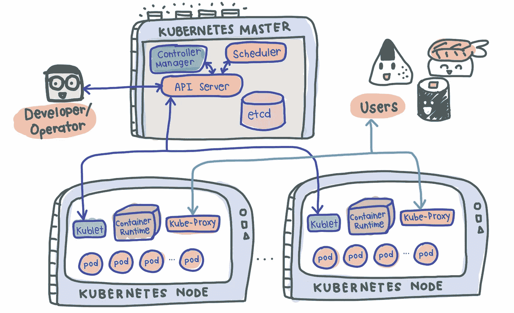
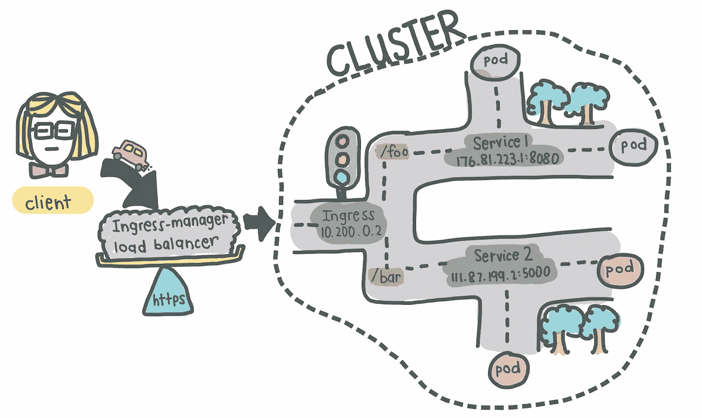
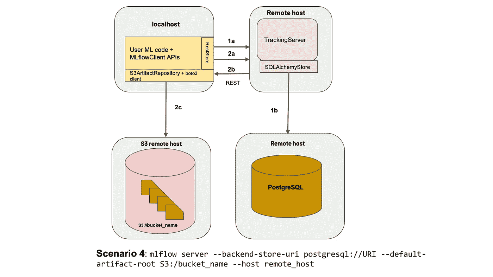
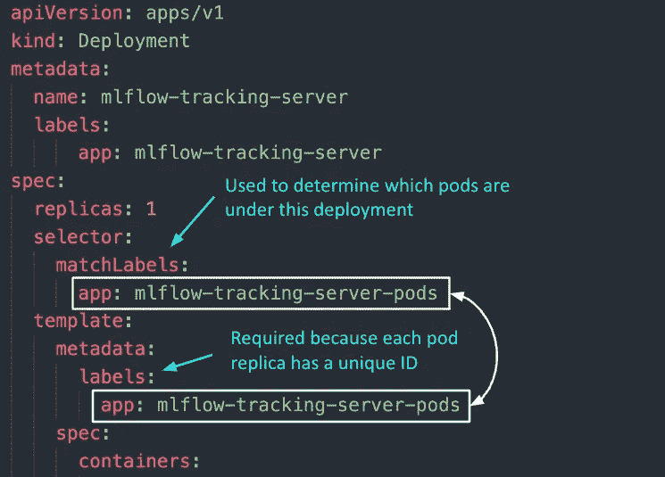

# 对初学者友好的 Kubernetes 介绍

> 原文：<https://towardsdatascience.com/a-beginner-friendly-introduction-to-kubernetes-540b5d63b3d7>

## 没必要这么复杂，对吧？

## 通过动手 MLFlow 部署示例


洛伦佐·埃雷拉在 [Unsplash](https://unsplash.com?utm_source=medium&utm_medium=referral) 上的照片

# 让我们开始吧。

如果你正在阅读这篇文章，很可能是因为你听说过这个时髦词“*Kubernetes*”(K8s)，你很可能在技术领域。您可能也对什么是容器化(或者称为 Docker / dockerization)有所了解，所以我将跳过这个细节，直接进入 K8s 是什么。

# 介绍

简而言之，K8s 只是一个容器编排框架。这实质上意味着 K8s 是一个旨在**自动化容器化应用的生命周期**的系统——从可预测性、可伸缩性到可用性。

> **如果您正在使用 Kubernetes 来设置您的数据科学基础架构，请务必查看一下**[**Saturn Cloud**](https://saturncloud.io/)**，这是一个可扩展、灵活的数据科学平台，提供包括 GPU 在内的计算。**

## 我们为什么需要 Kubernetes？

K8s 的兴起和需求背后的驱动原因源于微服务的使用越来越多，远离传统的单片类型的应用。因此，容器为这些单独的微服务提供了完美的主机，因为容器管理依赖性、独立、与操作系统无关和短暂等优点。

具有许多组件的复杂应用程序通常由数百甚至数千个微服务组成。如果我们要使用定制的程序或脚本来管理所有这些不同的组件，在确保可用性的同时扩展这些微服务是一个极其痛苦的过程，因此需要一种适当的方式来管理这些组件。

线索 *Kubernetes* 。

## Kubernetes 的优势

Kubernetes 承诺使用以下功能解决上述问题:

1.  **高可用性** —这意味着无论您有新的更新要推出，还是有一些意外的 pods 崩溃，您的应用程序都将一直正常运行。
2.  **可伸缩性**——这确保了应用程序的高性能，无论是单个用户还是一千个用户同时涌入你的应用程序。
3.  **灾难恢复** —这确保了如果您的物理或基于云的基础架构发生意外，您的应用将始终拥有最新的数据和状态。

# 它是如何在引擎盖下工作的

K8s 使用主从式架构，其中一个节点充当主节点，在集群中发号施令，而其他节点充当从节点/工作节点，执行由主节点决定的应用程序工作负载。

## 简单的 Kubernetes 建筑

带有一个主节点和两个工作节点的简单 K8s 设置如下所示:



带有一个主节点和两个从节点的 K8s 设置示例(由作者举例说明)

## 主节点

顾名思义，主节点是集群的老板，决定集群状态和每个工作节点的工作。为了设置一个主节点，需要在其上运行 4 个进程:

**1。API 服务器**

*   主**入口点**供用户与集群交互(即集群网关)；当我们使用`kubectl`时，它是发送请求的地方
*   用于**认证**和请求验证的看门人，确保只有特定用户能够执行请求

**2。调度器**

*   决定下一个 pod 将在哪个节点上旋转，但不旋转 pod 本身( *kubelet* 这样做)

**3。控制器管理器**

*   检测群集状态变化(例如，pod 正在死亡)并尝试将群集恢复到其原始状态
*   例如，如果一个 pod 意外死亡，*控制器管理器*向*调度器*发出请求，以决定哪个节点启动新的 pod 来替换死亡的 pod。库伯莱然后旋转新的吊舱。

**4。*etcd***

*   集群脑！
*   群集状态的键值存储
*   所做的任何群集更改都将存储在此处
*   这里不存储应用程序数据，只存储集群状态数据。记住，主节点不做工作，它是集群的**大脑**。具体来说， *etcd* 存储集群状态信息，以便上面的其他进程知道关于集群的信息

## 从属/工作节点

每个 worker 节点必须安装 3 个节点进程，以允许 Kubernetes 与它进行交互，并在每个节点内独立启动 pod。需要的 3 个过程是:

**1。库伯莱**又名`*kubelet*`

*   与节点和容器交互
*   负责获取配置文件并使用容器运行时启动 pod(*见下文！*)安装在节点上

**2。容器运行时间**

*   安装的任何容器运行时(例如， *Docker* ， *containerd* )

**3。库贝代理**又名`*kube-proxy*`

*   实现 Kubernetes *服务*概念的一部分的网络代理
*   位于节点之间，智能地转发请求(节点内或节点间转发)

# 库伯内特斯的成分

现在我们知道了 K8s 的工作原理，让我们来看看 Kubernetes 中一些最常见的*T4 组件，我们将使用它们来部署我们的应用程序。*

## 1.豆荚

*   K8s 的最小单元，通常包含应用程序的实例
*   容器上的抽象
*   每个 pod 都有自己的 IP 地址(公有或私有)
*   短暂—重新创建 pod 时的新 IP 地址

## **2。服务**

*   因为 pod 本来就是短暂的，所以服务提供了一种方法来“给予”pod 一个永久的 IP 地址
*   使用*服务*，如果 pod 终止，其 IP 地址在重新创建时不会改变
*   充当*几乎*的**负载平衡器**，将流量路由到 pod，同时保持静态 IP
*   像负载平衡器一样，*服务*也可以是内部的或外部的，其中外部*服务*是面向公众的(公共 IP ),内部*服务*是针对内部应用的(私有 IP)

## **3。入口**

*   有了服务，我们现在可以在某个端口上公开一个 web 应用程序，比如 IP 地址 10.104.35 上的 8080。实际上，在`[http://10.104.35:8080](http://10.104.35:8080.)` [上访问面向公众的应用是不切实际的。](http://10.104.35:8080.)
*   因此，我们需要一个具有正确域名的入口点(例如，`https://my-domain-name.com`)，然后将请求转发给服务(例如，`[http://10.104.35:8080](http://10.104.35:8080))` [)](http://10.104.35:8080))
*   本质上， **Ingress 向集群**【1】内的服务*公开来自集群*外*的 HTTP 和 HTTPs 路由。*
*   [SSL 终止](https://www.f5.com/services/resources/glossary/ssl-termination#:~:text=SSL%20termination%20refers%20to%20the,along%20to%20a%20web%20server.)(又称为 *SSL 卸载* ) —即服务及其 pod 的流量是明文
*   也就是说，单独创建入口资源没有任何效果。还需要一个*入口控制器*来满足入口。



Ingress 如何与 Ingress 控制器一起工作(由作者说明)

## **4。入口控制器**

*   对群集中服务的传入流量进行负载平衡
*   还管理需要与外部服务通信的服务的出口流量

> ***Ingress 和 Ingress 控制器有什么区别？***
> 
> 入口*包含路由流量的规则，决定传入请求应该路由到集群中的哪个*服务*。*
> 
> Ingress 控制器*是 Ingress 的*实际实现*，负责第四层或第七层代理。*入口控制器*的例子有* [*入口 NGINX 控制器*](https://github.com/kubernetes/ingress-nginx) *和* [*入口 GCE*](https://github.com/kubernetes/ingress-gce) *。每个云提供商和其他第三方提供商将拥有自己的*入口控制器*实施方案。*
> 
> *完整名单可以在* [*这里*](https://kubernetes.io/docs/concepts/services-networking/ingress-controllers/) *找到。*

## 5.配置图

*   顾名思义，它本质上是一个配置文件，您希望公开给用户修改

## 6.秘密

*   也是一个配置文件，但用于存储密码等敏感信息
*   Base64 编码

## 7.卷

*   用于持久数据存储
*   因为 pod 本身是短暂的，所以卷用于持久存储信息，以便现有的和新的 pod 可以引用应用程序的某些状态
*   几乎就像您的豆荚的“外部硬盘驱动器”
*   卷可以本地存储在运行 pod 的同一个节点上，也可以远程存储(例如云存储，NFS)

## 8.部署

*   用于定义 pod 的蓝图
*   实际上，我们处理的是部署，而不是 pod 本身
*   部署通常有副本，因此当应用程序的任何组件失效时，总会有备份
*   然而，像数据库这样的组件不能被复制，因为它们是有状态的应用程序。在这种情况下，我们需要 Kubernetes 组件: **StatefulSet** 。这很难做到，通常情况下，数据库应该托管在 Kubernetes 集群之外

> 好吧，那可能太多了，难以消化。让我们开始动手练习吧！一定要花些时间重新阅读上面的内容，以便清楚地了解整个 K8s 架构中每个组件的职责。

# 我们来练习一下！

因为本文的重点是理解 K8s 的组件本身，而不是如何设置 K8s 集群，所以我们将简单地使用`minikube`来设置我们自己的本地集群。之后，我们将部署一个简单但现实的应用程序—一个 [MLFlow 服务器](https://mlflow.org/)。

如果你想了解源代码，我已经把它们包含在 GitHub repo [这里](https://github.com/davidcjw/mlflow-kubernetes-medium-example)。

## 我们将建立什么

一个典型的应用程序有一个带有后端服务的 web 服务器来保存数据——这是我们今天要复制和部署的目标。为了让事情变得更简单，我们将部署一个 [MLFlow web 服务器](https://mlflow.org/)，它将数据保存在谷歌云平台(GCP)上的云 SQL 数据库中。

设置如下所示:



[具有远程跟踪服务器、后端和工件存储的 ml flow](https://www.mlflow.org/docs/latest/tracking.html#id31)(图片来源: [MLFlow 文档](https://www.mlflow.org/docs/latest/tracking.html#scenario-4-mlflow-with-remote-tracking-server-backend-and-artifact-stores))

对于那些不知道的人来说，MLFlow 主要是一个实验跟踪工具，允许数据科学家通过记录数据和模型工件来跟踪他们的数据科学实验，并可以选择使用 MLFlow 定义的标准化包来部署他们的模型。出于本文的目的，我们将使用 PostgreSQL 后端(托管在云 SQL 上)和 blob 存储(在 Google 云存储上)部署 MLFlow 跟踪 web 服务器。

在此之前，我们必须安装一些东西(如果你已经安装了这些东西，请跳过*)。*

## 装置

1.  [码头工人](https://docs.docker.com/get-docker/)
2.  K8s 命令行工具，`kubectl`。我们最好的朋友——我们用它来与我们的 K8s 星团互动，不管它是 *minikube* 、*云*还是*混合*星团
3.  [Minikube](https://minikube.sigs.k8s.io/docs/start/#what-youll-need) 安装指南
4.  [谷歌云 SDK](https://cloud.google.com/sdk/docs/install)
5.  *`kubectl`、`kubens`、`kubectx`可选*电动工具。按照[这个](https://github.com/ahmetb/kubectx)安装。

## 设置本地集群

从`minikube start`开始你的集群。就是这样！您已经用一个命令创建了自己的本地 Kubernetes 集群:)

您可以验证上面列出的各种组件是用`minikube status`创建的。如果您有几个 K8s 集群上下文，请确保切换到 minikube。

```
# Check context
kubectx# If not on minikube, switch context
kubectx minikube
```

对于本地集群设置，让我们从设置外部组件开始，然后继续部署 Kubernetes 对象。

**1。为 MLFlow 创建一个 docker file**

我们首先需要一个将要部署的 MLFlow web 服务器的 Docker 映像。不幸的是，MLFlow 没有我们可以在 DockerHub 上使用的官方图像，所以我在这里创建了一个供大家使用。让我们从 DockerHub 中调出我创建的图像。

```
docker pull davidcjw/example-mlflow:1.0
```

[ *可选的* ]要测试映像是否在本地工作，只需运行:

```
docker run -p 8080:8080 davidcjw/example-mlflow:1.0
```

**2。在 GCP 上创建一个云 SQL (PostgreSQL)实例**

这将用于存储记录到 MLFlow 跟踪服务器上的运行的元数据。如前所述，在 Kubernetes 集群之外创建有状态应用程序更容易。

*   首先，在 GCP 上创建一个账户和项目，如果你还没有的话
*   使用 CLI 和以下命令创建一个实例:

```
gcloud sql instances create <**your_instance_name**> \
  --assign-ip \
  --authorized-networks=<**your_ip_address**>/32 \
  --database-version=POSTGRES_14 \
  --region=<**your_region**> \
  --cpu=2 \
  --memory=3840MiB \
  --root-password=<**your_password**>
```

要找到`<your_ip_address>`，简单谷歌“我的 ip 是什么”。对于`<region>`，可以指定离你比较近的地区。对我来说，我指定了`asia-southeast1`。

```
**NOTE!** These configs are intended for this example deployment and not suitable for production environments. For production environments, you would want to have minimally **multi-zonal availability** connected over a **Private IP**.
```

**3。创建一个谷歌云存储桶**

这将用于存储用户记录的数据和模型人工制品。在 GCP 上创建一个桶，并为以后记录 URI。对于我自己，我已经使用下面的命令在`gs://example-mlflow-artefacts`创建了一个:

```
gsutil mb -l <**your_region**> gs://example-mlflow-artefacts
```

**4。在本地** `**minikube**` **集群**上创建 ConfigMap 和 Secret

现在，激动人心的部分—在我们的 Kubernetes 集群上部署所需的各种组件。在此之前，了解一些关于 K8s 对象的事情是绝对必要的。

Kubernetes 资源是使用具有特定格式的`.*yaml*`文件创建的(*请参考 Kubernetes 文档[2]了解您正在创建的任何资源类型*)。它们用于定义哪些容器化的应用程序在哪个端口上运行，更重要的是，用于定义这些应用程序如何运行的策略。

**`**.yaml**`**文件有效地定义了我们的集群状态！****

**[描述 Kubernetes 对象](https://kubernetes.io/docs/concepts/overview/working-with-objects/kubernetes-objects/) ( `*.yaml*`文件):**

*   **总是以`apiVersion`、`kind`开头，并有`metadata`**
*   **`apiVersion`:定义 Kubernetes API 的版本号(如果您使用的版本处于稳定模式，通常是 v1)**
*   **`kind`:定义组件类型(如 Secret、ConfigMap、Pod 等)**
*   **`metadata`:唯一标识一个对象的数据，包括`name`、`UID`和`namespace` ( *以后会详细介绍！*)**
*   **`spec`(或规格)/ `data`:特定于组件的细节**

****4a。**让我们从 *ConfigMap* 开始，因为当我们使用*部署*部署我们的 MLFlow 应用程序时，将需要这些配置(**注意** : *资源创建的顺序很重要，特别是当有配置或秘密附加到部署时)。***

```
# configmap.yaml
apiVersion: v1
kind: ConfigMap
metadata:
  name: mlflow-configmap
data:
  *# property-like keys; each key maps to a simple value*
  DEFAULT_ARTIFACT_ROOT: <**your_gs_uri**>
  DB_NAME: postgres
  DB_USERNAME: postgres
  DB_HOST: <**your_cloud_sql_public_ip**>
```

> **💡 ***亲提示！*** *始终有一个官方 K8s 文档的标签处于打开状态，因此您可以参考他们为每个 K8s 组件准备的示例* `*.yaml*` *文件。***

****4b。**接下来，让我们为秘密创建一个。请注意，机密必须是 base64 编码的。只需使用以下工具即可完成:**

```
echo -n "<your_password>" | base64
```

**我们唯一需要编码的是我们之前在 Cloud SQL 上创建 PostgreSQL 实例时定义的密码。让我们对其进行 base64 编码，并将标准输出复制到下面的`.*yaml*`文件中。**

```
# secrets.yaml
apiVersion: v1
kind: Secret
metadata:
  name: mlflow-postgresql-credentials
type: Opaque
data:
  postgresql-password: <**your_base64_encoded_password**>
```

**使用以下方式应用配置映射和密码:**

```
kubectl apply -f k8s/configmap.yaml
kubectl apply -f k8s/secrets.yaml>>> configmap/mlflow-configmap created
>>> secret/mlflow-postgresql-credentials created
```

**太好了！我们现在可以引用我们创建的秘密和配置。**

****5。创建部署和服务****

****5a。**先说*部署*。为了理解部署，让我们后退一步，回忆一下*部署*和 *Pod* 之间的主要区别在于，前者有助于创建将要部署的 Pod 的副本。因此，*部署*的`yaml`文件包含了 *Pod* 的配置，以及我们想要创建的副本数量。**

**如果我们看一下下面的`yaml`文件，我们会注意到`metadata`和`spec`在配置中出现了两次，第一次在配置文件的顶部，第二次在“*模板*键的下面。这是因为在下面**定义的所有内容"*模板*"键都用于 *Pod* 配置。****

> **简而言之，一个 Pod 组件部署我们应用程序的一个实例，而一个部署(通常)由该 Pod 的多个部署组成。如果我们部署中的副本数量为 1，那么它基本上与单个单元相同(但是可以选择纵向扩展)。**

```
# deployment.yaml
**apiVersion**: apps/v1
**kind**: Deployment
**metadata**:
  **name**: mlflow-tracking-server
  **labels**:
      **app**: mlflow-tracking-server
**spec**:
  **replicas**: 1
  **selector**:
    **matchLabels**:
      **app**: mlflow-tracking-server-pods
  # Pod configurations defined here in `template`
  **template**:
    **metadata**:
      **labels**:
        **app**: mlflow-tracking-server-pods
    **spec**:
      **containers**:
        - **name**: mlflow-tracking-server-pod
          **image**: davidcjw/example-mlflow:1.0
          **ports**:
            - **containerPorts**: 5000
          **resources**:
            **limits**:
              **memory**: 1Gi
              **cpu**: "2"
            **requests**:
              **memory**: 1Gi
              **cpu**: "1"
          **imagePullPolicy**: Always
          **env**:
          - **name**: DB_PASSWORD
            **valueFrom**:
              **secretKeyRef**:
                **name**: mlflow-postgresql-credentials
                **key**: postgresql-password
          - **name**: DB_USERNAME
            **valueFrom**:
              **configMapKeyRef**:
                **name**: mlflow-configmap
                **key**: DB_USERNAME
          - **name**: DB_HOST
            **valueFrom**:
              **configMapKeyRef**:
                **name**: mlflow-configmap
                **key**: DB_HOST
          - **name**: DB_NAME
            **valueFrom**:
              **configMapKeyRef:**
                **name**: mlflow-configmap
                **key**: DB_NAME
          - **name**: DEFAULT_ARTIFACT_ROOT
            **valueFrom**:
              **configMapKeyRef**:
                **name**: mlflow-configmap
                **key**: DEFAULT_ARTIFACT_ROOT
```

**需要回答两个重要问题:pod 副本如何组合在一起以被*部署*识别为一个副本？2)*部署*如何知道它属于哪一组 pod 副本？**

1.  **`template > metadata > labels`:与其他组件如 *ConfigMap* 和 *Secret* 不同，此元数据关键字`labels`是强制性的，因为在此部署下创建的每个 pod 副本将具有唯一的 ID(例如， *mlflow-tracking-xyz* ， *mlflow-tracking-abc* )。为了能够将它们作为一个组来共同识别，使用了标签，使得这些 pod 副本中的每一个都将接收这些相同的标签集。**
2.  **`selector > matchLabels`:用于确定本次部署下的吊舱组。注意这里的标签必须**与【1】中的标签**完全匹配。**

****

**作者图片**

****其他关键配置**:**

*   **`replicas`:用于确定 pod 副本的数量**
*   **`containers > image`:每个 pod 使用的图像**
*   **`containers > env`:我们在这里指定将在每个 pod 中初始化的环境变量，从我们之前创建的 *ConfigMap* 和 *Secret* 中引用。**

****5b。** *服务* —如上所述，服务几乎像负载平衡器一样用于将流量分配给每个 pod 副本。因此，以下是关于*服务*的一些重要注意事项。**

*   **`selector`:这个键值对应该与之前在*部署*中指定的`template > metadata > labels`相匹配，这样*服务*就知道将请求路由到哪组 pod。**
*   **`type`:默认为`ClusterIP`，这是集群的内部 IP 地址(其他服务类型的列表可以在[这里](https://kubernetes.io/docs/concepts/services-networking/service/#publishing-services-service-types)找到)。对于我们的用例，我们将使用`NodePort`在节点 IP 地址的端口上公开我们的 web 应用程序。请注意`NodePort`的值只能在 30000–32767 之间。**
*   **`targetPort`:这是您的 pod 公开应用程序的端口，在*部署*中指定。**

```
apiVersion: v1
kind: Service
metadata:
  labels:
    app: mlflow-tracking-server
  name: mlflow-tracking-server
spec:
  type: NodePort
  selector:
    app: mlflow-tracking-server-pods
  ports:
  - port: 5000
    protocol: TCP
    targetPort: 5000
    nodePort: 30001
```

****5c。**整合在一起**

**事实上，您可以将几个`.yaml`配置放在一个文件中——特别是*部署*和*服务*配置，因为我们将一起应用这些更改。为此，只需使用`---`在一个文件中区分这两个配置:**

```
# deployment.yaml
apiVersion: v1
kind: Deployment
...
---
apiVersion: v1
kind: Service
...
```

**最后，我们使用`kubectl apply -f k8s/deployment.yaml`应用这些更改。恭喜你。您现在可以通过`<node_IP>:<nodePort>`访问您的 MLFlow 服务器。以下是如何找出你的`node_IP`是什么:**

```
kubectl get node -o wide# or equivalently:
minikube ip
```

****如果你是苹果芯片或 Windows 用户…****

**如果你像我一样使用 Darwin(或 Windows，WSL)上的 Docker 驱动程序，使用上述方法将无法直接到达节点 IP。完成此[链接](https://minikube.sigs.k8s.io/docs/handbook/accessing/)中列出的步骤 4 和 5，以访问您的应用程序。**

## **清理**

**最后，我们完成了测试应用程序，清理就像`minikube delete --all`一样简单。**

> ****如果您正在使用 Kubernetes 来设置您的数据科学基础架构，请务必查看一下** [**土星云**](https://saturncloud.io/) **，这是一个可扩展、灵活的数据科学平台，提供包括 GPU 在内的计算。****

# **最后的话**

**感谢您的阅读，希望这有助于您了解 Kubernetes。如果你发现了任何错误，或者你想在另一篇文章中了解更多，请告诉我！**

*****支持我！*** —如果你喜欢我的内容并且*没有*订阅 Medium，请考虑支持我并通过我在这里的推荐链接[订阅](https://davidcjw.medium.com/membership) ( *注意:你的一部分会员费将作为推荐费*分摊给我)。**

# **参考**

**【1】[什么是 Ingress？](https://kubernetes.io/docs/concepts/services-networking/ingress/#what-is-ingress)
【2】[Kubernetes 文档](https://kubernetes.io/docs)
【3】[娜娜的 Kubernetes 速成班](https://www.youtube.com/watch?v=s_o8dwzRlu4)
【4】[访问应用(Minikube)](https://minikube.sigs.k8s.io/docs/handbook/accessing/)**