# 文本到图像生成模型的提示设计初学者指南

> 原文：<https://towardsdatascience.com/a-beginners-guide-to-prompt-design-for-text-to-image-generative-models-8242e1361580>

## 在你浪费你的免费试用积分之前，学习这些快速工程技巧

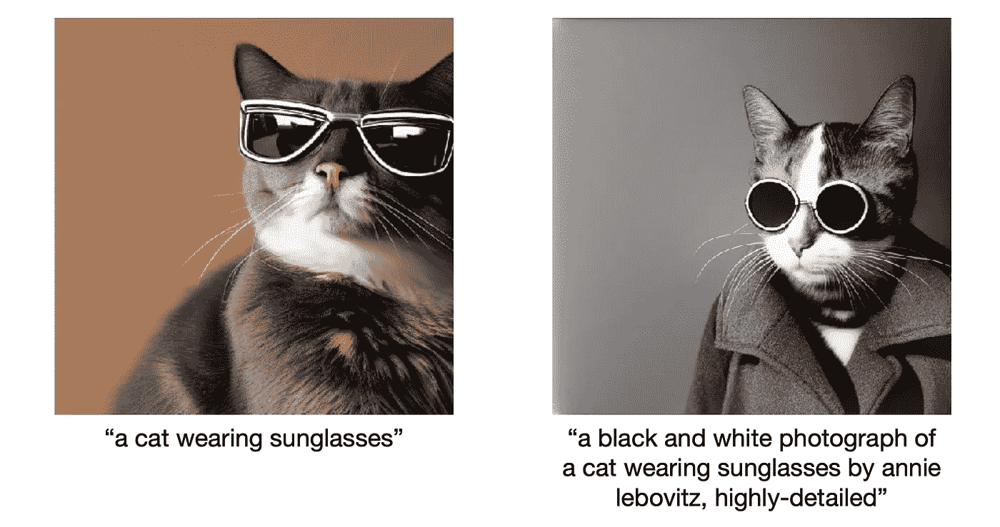

如果你已经体验过文本到图像的生成模型，你就会知道生成你喜欢的图像有多难。

随着[稳定扩散](https://colab.research.google.com/github/huggingface/notebooks/blob/main/diffusers/stable_diffusion.ipynb)、[中途](https://www.midjourney.com/)、 [DALL E2、](https://openai.com/dall-e-2/)的发布，人们一直在说提示工程可能会成为一个新职业。因为中途 Discord 服务器 DALL E2 和 StabilityAI 的 DreamStudio 有一个基于信用的定价模型[3，5，7]，用户被激励使用尽可能少的提示来获得他们喜欢的图像。

> 鼓励用户使用尽可能少的提示。

这篇文章将会给你一个快速指南，在你浪费所有的免费试用积分之前，提示工程。这是一个通用指南，DALL E2，稳定扩散，中途有区别。因此，并非所有提示都适用于您正在使用的特定创成式模型。

我们将使用与[11]类似的基本提示**“一只戴墨镜的猫”**。图像将使用 DreamStudio(用于稳定扩散的 GUI)生成，默认设置为**，固定种子为 42** ，以生成相似的图像进行比较。

关于提示工程的更多灵感，你可以看看[https://lexica.art/](https://lexica.art/)，这是一个提示和它们的稳定扩散产生的结果图像的集合。

# 文本到图像和文本引导的图像到图像生成的提示设计基础

目前，大多数生成模型要么是文本到图像，要么是文本引导的图像到图像生成模型。在这两种情况下，至少有一个输入是提示，它是对您想要生成的图像的描述。

## 提示长度

提示应该相对较短。虽然 Midjourney 允许多达 6000 个字符，但提示应该保持在 60 个字以内。类似地，DALL E2 的提示必须**保持在 400 个字符以内**【9】。

## 字符集

从统计学的角度来看，你最好的选择是用英语表达你的提示。例如，在 [LAION-5B](https://laion.ai/blog/laion-5b/) 数据库的子集上训练稳定扩散，该数据库包含 23 亿个英文图像-文本对和来自 100 多种其他语言的 22 亿个图像-文本对[1，4]。

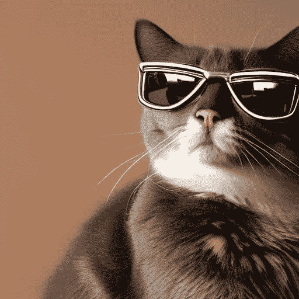

提示:“一只戴墨镜的猫”(图片由作者用 [DreamStudio](https://beta.dreamstudio.ai/) 制作)。

这意味着你不局限于西欧字母表。你可以使用像阿拉伯语或汉语这样的非罗马字符集，你甚至可以使用表情符号。

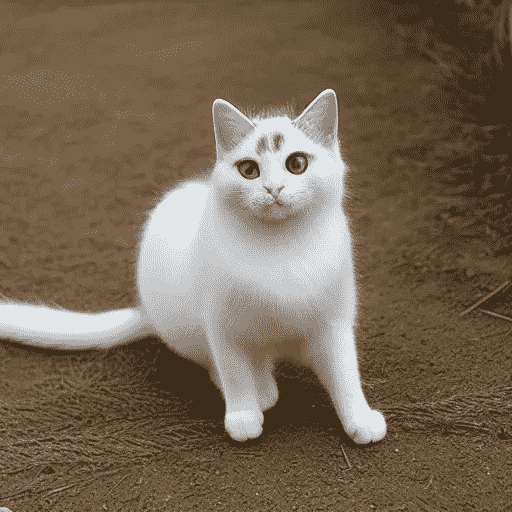

Prompt: “サングラスをかけた猫” (Japanese for “a cat wearing sunglasses”) (Image made by the author with [DreamStudio](https://beta.dreamstudio.ai/))

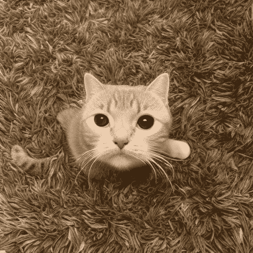

提示: "🐱😎”(作者用 [DreamStudio](https://beta.dreamstudio.ai/) 制作的图片)

然而，正如你所看到的，用日语提示生成的图像和用仅表情符号提示**生成的图像都无法为猫**生成一副太阳镜。

虽然它的效果可能不如英文提示，但您可以使用它来增强效果(参见重复一节)。

同样，例如，中途**不区分大小写**【6】。这意味着你是否大写你的文本不会影响生成的图像；因此，您可以用小写字母书写提示。

## 模板和标记化

提示通常遵循以下模板(由[8]调整而来)。我们将在接下来的章节中讨论每一部分。

```
[Art form] of [subject] by [artist(s)], [detail 1], ..., [detail n]
```

在 prompt engineering 的上下文中，标记化描述了将文本分成更小的单元(标记)。对于提示工程，您可以使用逗号(`,`)、竖线(`|`)或双冒号(`::`)作为硬分隔符[6，10]。然而，标记化的直接影响并不总是清楚的[6]。

# 1.科目

提示最重要的部分是主题。【2，8】你想看什么？虽然这可能是最简单的，但就您想要提供的细节数量而言，这也是最困难的。


提示:“一只戴墨镜的猫”(图片由作者用 [DreamStudio](https://beta.dreamstudio.ai/) 制作)

## 复数

像“猫”这样模糊的复数词，留下了很大的解释空间[6]。你是说两只猫还是 13 只猫？所以，当你想要多个主语时，用复数名词搭配特定的数字[6]。

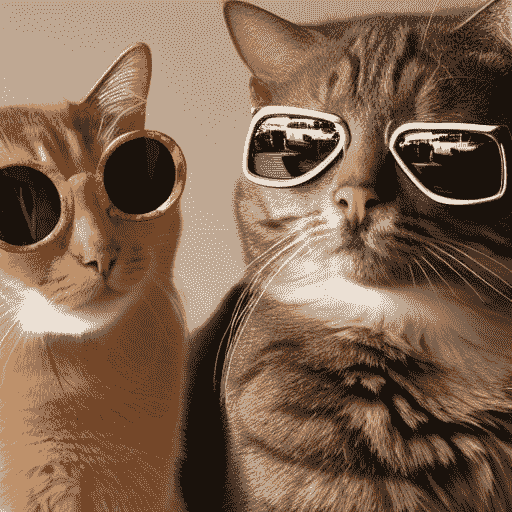

提示:“戴墨镜的猫”(图片由作者用 [DreamStudio](https://beta.dreamstudio.ai/) 制作)

然而，据报道，虽然例如 DALL E2 在一个场景中创建多个对象没有问题，但它在将每个对象的某些特征彼此分开方面有所欠缺[11]。

虽然上面的图像是由 Stable Diffusion 的 DreamStudio 生成的，但它在下面的图像中显示了它的挣扎。你可以看到左边的猫没有戴墨镜。反而是那副墨镜好像飘在了猫的身后。

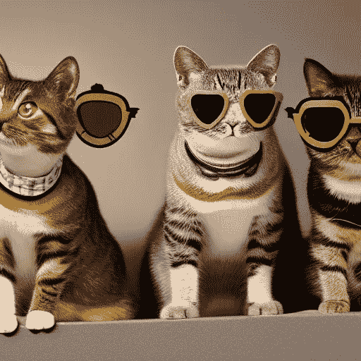

提示:“三只戴墨镜的猫”(作者用 [DreamStudio](https://beta.dreamstudio.ai/) 制作的图像)。

此外，据报道，DALL E2 可以很好地处理多达三个主题的提示，但超过三个主题的提示很难创建，即使你说“12”、“12”、“一打”，或者以多种方式说多次[6]。

在这个问题上，稳定扩散再次显示出与 DALL E2 的差异。然而，它也显示出精确地生成 12 只猫是困难的。

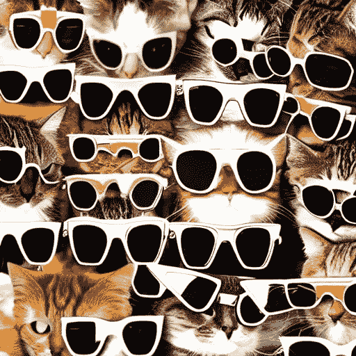

提示:“戴墨镜的十二只猫”(图片由作者用 [DreamStudio](https://beta.dreamstudio.ai/) 制作)

## 砝码

如果你想给一个特定的主题更重的权重，有各种各样的方法可以做到这一点。

1.  **顺序:**靠近提示前面的标记比提示后面的标记权重更大。[10]
2.  **重复:**用不同的措辞重复主题会影响其权重【8，12】。我还见过用不同语言或使用表情符号重复主题的提示。
3.  **参数:**例如，在中途，您可以在提示的任何部分后面加上`::weight`来赋予其权重(例如`::0.5`)【6】。

## 不包括的项目:如接受服务项目是由投保以前已患有的疾病或伤害引致的

包含否定词如“不是”、“但是”、“除了”和“没有”的提示对于文本到图像生成模型来说是难以理解的[6]。虽然 Midjourney 有一个特殊的命令来处理这种情况(`--no` ) [7]，但是你可以通过**避免负面措辞**而不是正面措辞你的提示[6]来绕过这个问题。

# 2.艺术形式

艺术形式是提示的重要组成部分。提示中常用的艺术形式有[2]:

*   **摄影:**影楼摄影，拍立得，拍照手机等。

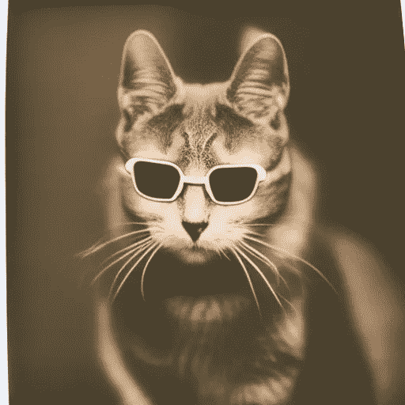

提示:“一只戴着太阳镜的猫的宝丽来照片”(图片由作者用 [DreamStudio](https://beta.dreamstudio.ai/) 制作)

*   **绘画:**油画、肖像画、水彩画等。

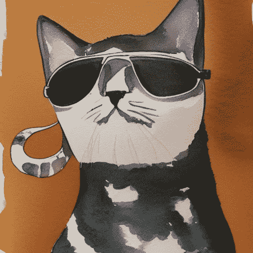

提示:“戴太阳镜的猫的水彩画”(作者用 [DreamStudio](https://beta.dreamstudio.ai/) 制作的图像)

*   **插画:**铅笔画、炭笔素描、蚀刻、漫画、概念艺术、海报等。

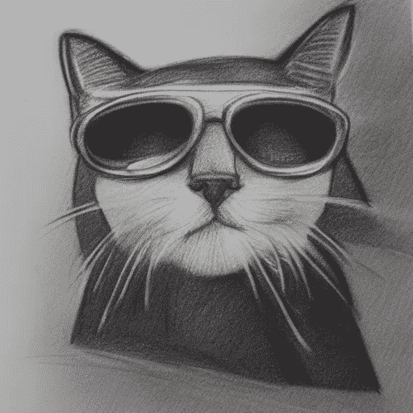

提示:“一只戴墨镜的猫的炭笔素描”(图片由作者用 [DreamStudio](https://beta.dreamstudio.ai/) 制作)

*   **数字艺术:** 3D 渲染、矢量插图、低聚艺术、像素艺术、扫描等。

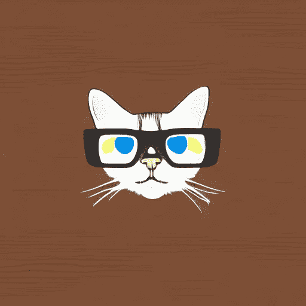

提示:“一只戴墨镜的猫的矢量插图”(图片由作者用 [DreamStudio](https://beta.dreamstudio.ai/) 制作)

*   **电影剧照:**电影、央视等。

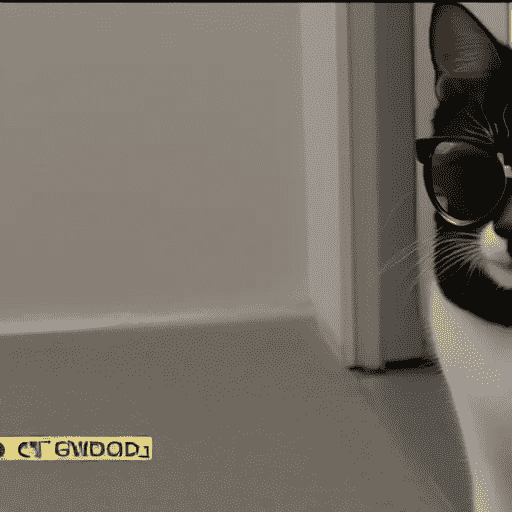

提示:“CCTV 一只戴墨镜的猫的剧照”(图片由作者与[梦工厂](https://beta.dreamstudio.ai/)合作制作)

如你所见，你甚至可以为每种艺术形式定义特定的媒介。例如，对于摄影，您可以通过定义类似[9]的细节来变得非常具体:

*   胶片类型(黑白、拍立得、35mm 等。),
*   取景(特写、广角等。),
*   相机设置(快速快门、微距、鱼眼、运动模糊等。),
*   照明(黄金时间、工作室照明、自然照明等。)

还有各种其他艺术形式，如贴纸和纹身。更多的灵感，可以看看[11]。

如果艺术形式未在提示中指定，则创成式模型通常会选择它在训练期间最常看到的形式。对许多学科来说，这种艺术形式就是摄影。

# 3.风格或艺术家

模板的另一部分可以严重影响生成图像的结果是风格或艺术家[6，8]。简单地使用“由[艺术家]”[11]或“以[风格或艺术家]的风格”。

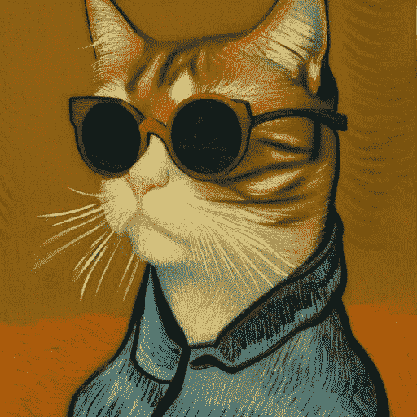

提示:“梵高《戴墨镜的猫》油画”(作者用 [DreamStudio](https://beta.dreamstudio.ai/) 制作的图片)

生成有趣图像的两个技巧是:

*   混合两个或多个艺术家〔2〕

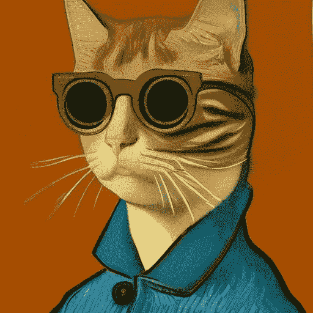

提示:“梵高和安迪·沃霍尔的油画《戴着太阳镜的猫》(图片由作者用 [DreamStudio](https://beta.dreamstudio.ai/) 制作)

*   使用虚构的艺术家[12]

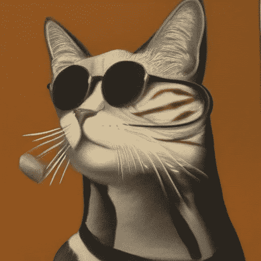

提示:“马克斯·穆斯特曼(max mustermann)的一幅戴着太阳镜的猫的油画”(图片由作者用 [DreamStudio](https://beta.dreamstudio.ai/) 制作)

# 4.组合功能

关于组合艺术家以生成有趣的图像，您也可以组合两个定义明确的概念[6]。您可以尝试以下模板[11]:

```
- "[subject] made of"
- "[subject] that looks like"
- "[subject] as"
```

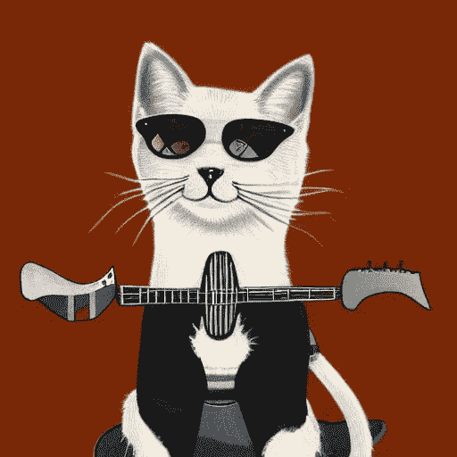

提示:“作为摇滚明星的猫”(图片由作者用 [DreamStudio](https://beta.dreamstudio.ai/) 制作)

# 5.形容词和质量助推器

添加像形容词和质量助推器这样的细节可以显著地影响你的图像的整体美感。

常用的形容词通常描述:

*   取景(特写、风景、肖像、广角等。)
*   配色方案(深色、淡色等。)
*   灯光(电影灯光、自然光等。)
*   其他:史诗般的，美丽的，令人敬畏的

但是也有一些社区已经发现的“神奇术语”似乎可以生成更好看的图像[2，8]:

*   “高度详细”

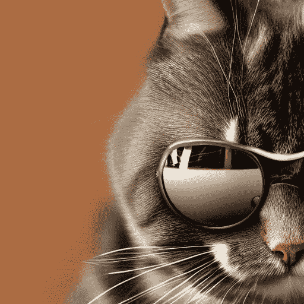

提示:“一只戴墨镜的猫，高细节”(图片由作者用 [DreamStudio](https://beta.dreamstudio.ai/) 制作)

*   “artstation 上的趋势”

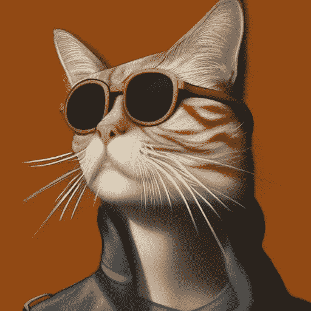

提示:“一只戴墨镜的猫，在 artstation 上流行”(图片由作者用 [DreamStudio](https://beta.dreamstudio.ai/) 制作)

*   "在虚幻引擎中渲染"

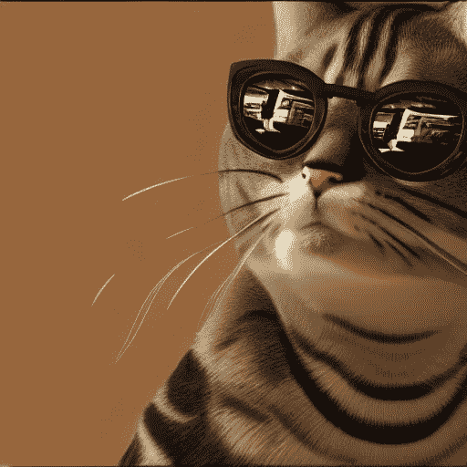

提示:“一只戴墨镜的猫，在虚幻引擎中渲染”(图片由作者用 [DreamStudio](https://beta.dreamstudio.ai/) 制作)

*   “4k”或“8k”

# 结论

在本文中，您了解了如何设计一个提示，以更少的尝试生成带有文本到图像生成模型的图像。

我们讨论了如何从一个只包含“一只戴太阳镜的猫”这样的主题的提示中改进一个看起来可以接受的图像。


提示:“一只戴墨镜的猫”(作者用 [DreamStudio](https://beta.dreamstudio.ai/) 制作的图像)。

基本技巧是:

*   定义精细的艺术形式(例如黑白照片)
*   添加风格或艺术家(如 Annie Lebovitz)
*   添加助推形容词(例如，高度详细)。

通过这些简单的技巧，得到的图像已经看起来更有趣了，如下图所示。


提示:“安妮·勒博维茨拍摄的一张戴着太阳镜的猫的黑白照片，非常详细”(图片由作者用 [DreamStudio](https://beta.dreamstudio.ai/) 制作)

# 喜欢这个故事吗？

*以下是我收集的其他生成性人工智能文章:*


莉奥妮·莫尼加蒂

## 生成人工智能

[View list](https://medium.com/@iamleonie/list/generative-ai-275f9c85361b?source=post_page-----8242e1361580--------------------------------)3 stories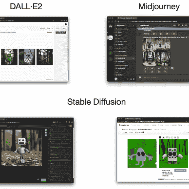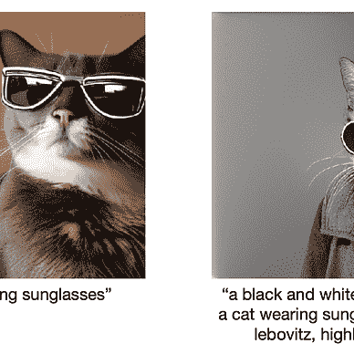

*如果你想把我的新故事直接发到你的收件箱，* [*订阅*](https://medium.com/subscribe/@iamleonie) *！*

成为一名媒体成员，阅读更多来自其他作家和我的故事。报名时可以使用我的 [*推荐链接*](https://medium.com/@iamleonie/membership) *支持我。我将收取佣金，不需要你额外付费。*

[](https://medium.com/@iamleonie/membership) [## 通过我的推荐链接加入 Medium—Leonie Monigatti

### 阅读 Leonie Monigatti(以及媒体上成千上万的其他作家)的每一个故事。您的会员费直接…

medium.com](https://medium.com/@iamleonie/membership) 

*在* [*Twitter 上找我*](https://twitter.com/helloiamleonie)*[*LinkedIn*](https://www.linkedin.com/in/804250ab/)*[*Kaggle*](https://www.kaggle.com/iamleonie)*！***

# **参考**

**[1] R. Beaumont，“LAION-5B:开放大规模多模态数据集的新时代”，LAION . ai .[https://laion.ai/blog/laion-5b/](https://laion.ai/blog/laion-5b/)(2022 年 9 月 10 日访问)**

**[2] DreamStudio，《提示指南》。https://beta.dreamstudio.ai/prompt-guide(2022 年 9 月 10 日访问)**

**[3] DreamStudio，《一般问题》。https://beta.dreamstudio.ai/faq(2022 年 9 月 5 日访问)**

**[4]拥抱脸，“🧨扩散器的稳定扩散”，google.com。[https://colab . research . Google . com/github/hugging face/notebooks/blob/main/diffusers/stable _ diffusion . ipynb # scroll to = GD-vx3 CAV oct](https://colab.research.google.com/github/huggingface/notebooks/blob/main/diffusers/stable_diffusion.ipynb#scrollTo=gd-vX3cavOCt)**

**[5] J. Jang，“信贷是如何运作的”。openai.com。[https://help . open ai . com/en/articles/6399305-how-Dall-e-credits-work](https://help.openai.com/en/articles/6399305-how-dall-e-credits-work)(2022 年 9 月 4 日访问)【9】稳定 AI，《稳定扩散梦想工作室 beta 版服务条款》。稳定. ai .[https://stability.ai/stablediffusion-terms-of-service](https://stability.ai/stablediffusion-terms-of-service)(2022 年 9 月 5 日访问)**

**[6]中途，“医生”，github.com。[https://github.com/midjourney/docs/](https://github.com/midjourney/docs/)(2022 年 9 月 10 日访问)**

**[7]中途，“中途文档”。git book . io .[https://midjourney.gitbook.io/docs/](https://midjourney.gitbook.io/docs/)(2022 年 9 月 4 日访问)**

**[8] J. Oppenlaender，文本到图像生成的提示修饰符分类(2022)， *arXiv 预印本 arXiv:2204.13988* 。**

**[9] G .帕森斯，[达尔 E 2 提示书](https://dallery.gallery/the-dalle-2-prompt-book/) (2022 年)，[https://dallery.gallery/the-dalle-2-prompt-book/](https://dallery.gallery/the-dalle-2-prompt-book/)(2022 年 9 月 10 日访问)**

**[10]“pxan”，“如何获得不烂的图像:从稳定扩散获得酷图像的初级/中级指南”，reddit.com。[https://www . Reddit . com/r/StableDiffusion/comments/x41n 87/how _ to _ get _ images _ that _ dont _ suck _ a/](https://www.reddit.com/r/StableDiffusion/comments/x41n87/how_to_get_images_that_dont_suck_a/)(2022 年 9 月 10 日访问)**

**[11]“rendo 1 # 6021”和“luc#0002”，“DALL E 2 Prompt 工程指南”，google.com。[https://docs . Google . com/document/d/11 wlzjbt 0x rpqhp 9 tfmtxzd 0 q 6 anidhpubkmv-Yb 043 u/edit # heading = h . 8g 22 xmkqjtv 7](https://docs.google.com/document/d/11WlzjBT0xRpQhP9tFMtxzd0q6ANIdHPUBkMV-YB043U/edit#heading=h.8g22xmkqjtv7)(2022 年 9 月 10 日访问)**

**[12] M .泰勒，“提示工程:从文字到艺术”，虎耳草. XYZ .【https://www.saxifrage.xyz/post/prompt-engineering】T4(2022 年 9 月 10 日访问)**