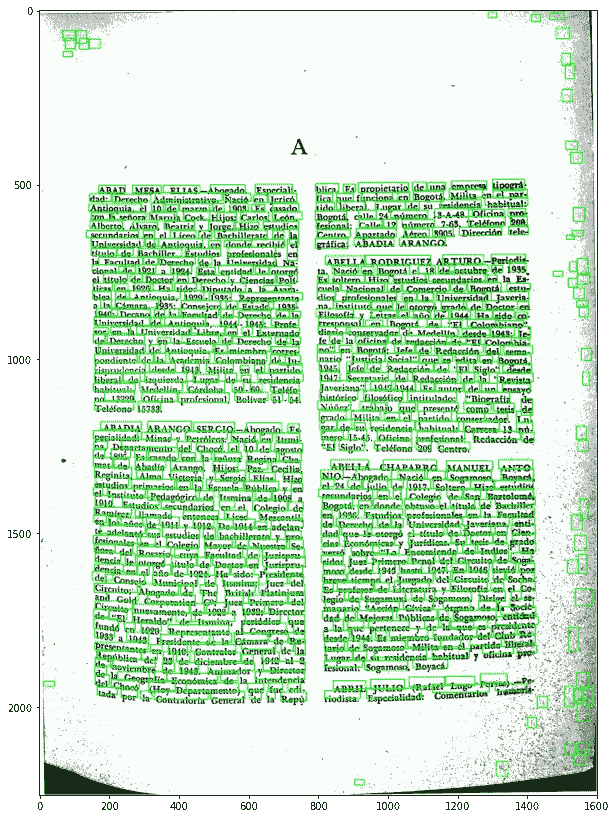
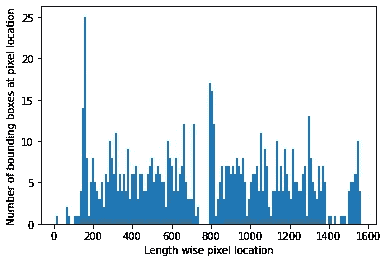
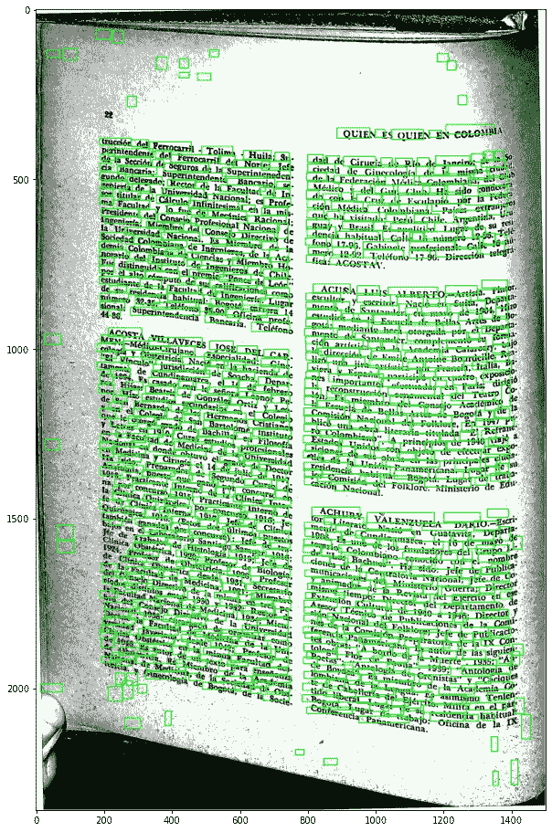
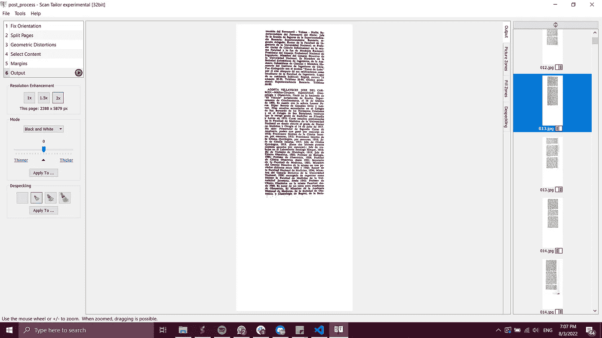

# 为 OCR 处理图像的更好方法

> 原文：<https://towardsdatascience.com/a-better-way-to-process-images-for-ocr-aa634b94d573>

## 我希望我能早点发现斯坎泰勒

在我的上一篇文章中，我介绍了如何使用 Python 代码为 OCR 处理图像。OCR 要求文本视图清晰，可以从左向右阅读。文本看起来越像刚打印出来的，结果就越准确。我最近写了一个更智能的算法，并发现了一个开源软件 ScanTailor，它在处理图像方面做得更好，特别是在几何扭曲(即文本卷曲)方面！我希望这种方法将有助于开发更精确的页面裁剪算法，并重新激起人们对改进 ScanTailor 的兴趣。查看[上一篇文章](/intelligently-cropping-page-marginalia-ab04744a1111)了解图像处理每个步骤的更多细节。

对于相对干净的图像，前面的代码在将图像分割成单个文本列时工作得很好，但是当图像非常失真或“脏”时，性能就很差。该算法依赖于在列之间找到一个干净的空白，但是在所有的边上都有很多黑色的区域，不容易被剪掉。

新的算法方法使用 OpenCV 的 EAST 文本检测器来寻找所有文本的边界框。然后，我基于边界框所有最左边的垂直边缘创建了一个直方图。(边框的右边缘不如左边缘精确，这意味着单词的两端通常会被剪切掉)

> “OpenCV 的 EAST text detector 是一种深度学习模型，基于一种新颖的架构和训练模式。它能够(1)在 720p 图像上以 13 FPS 的速度近乎实时地运行，并且(2)获得最先进的文本检测精度。”

OpenCV 的 EAST 文本检测器在扫描的页面上识别边界框。【图文由作者提供。Quién es quién en Colombia，第二版。(波哥大:奥利韦里奥·佩里，1948 年)。]

接下来，我根据最长的连续“空白”空间和边界框中从最高的后续尖峰开始的第二个文本列的起点来搜索白色中心列。第二个文本列的起点是裁剪位置。我们希望裁剪白色中间列的起点和第二个文本列的边缘的起点之间的点。但是，如果我们平均这些位置，作物位置往往太左。(我们这里的工作误差很小！)

图像上每个长度方向位置左边缘的边界框数量的直方图。[作者提供的图片]

但是有些页面是倾斜的，所以在图像旋转之前没有 0 度垂直线。我通过顺时针和逆时针旋转图像 0.5 度来解决这个问题。每次旋转都以最长的连续“空白”空间来计分。获取边界框花费了相当多的时间，所以如果分数≥8，为了加快代码速度，我选择了那个旋转角度。这个选择是基于观察和反复试验。

起初，我真的很高兴这些图像被裁剪得几乎完美，误差率为 0.4%——直到我运行 OCR。结果很糟糕。靠近装订的文本或文本扭曲的页面上的文本均未被读取。OCR 假定它要查找的文本可以放入一个矩形框中。

页面扭曲时，边界框位置的近似性较差。【图文由作者提供；由*撰写，第二版。(波哥大:奥利韦里奥·佩里，1948 年)。]*

在 Python 上寻找解开文本的方法时，我偶然发现了一个开源软件(直到生产阶段才完成，但自 2014 年以来一直没有维护过)，名为 [ScanTailor](https://github.com/scantailor/scantailor) 。它执行页面分割、倾斜校正、内容选择、二进制化和边距修正，而[实验版本](https://github.com/Tulon/scantailor/releases/tag/EXPERIMENTAL_2015_06_20)还可以校正几何失真和斑点。

该软件并不完美，我不得不手动修改许多页面，但它的界面使简单的拖动和点击变得非常容易。我花了大约一个小时来纠正错误，但与花在编写实际代码上的更多时间相比，这是一个很好的权衡。另外，请注意，文本非常少的页面可能会被删除！

在处理之前的图像以修复几何扭曲、分割页面、选择内容和去斑之后，ScanTailor 程序的屏幕截图。【图文由作者提供；第二版。(波哥大:奥利韦里奥·佩里，1948 年)。]

ScanTailor 也快得多，处理我的图像批次需要 1 个小时，而我的代码需要 8 个小时。但是软件稍微不稳定，RAM 用多了就死机，所以我建议把每次运行分解成批次，每次保存。

[论坛](https://graphicdesign.stackexchange.com/questions/30948/best-way-to-flatten-a-curled-photographed-book-photograph)提供了几个其他选项，  但这是我找到的最直接、最好的解决方案。(我用的是 Windows！)

这种无代码的解决方案对于那些没有技术技能的人来说绝对是一个很大的优势，所以我希望这篇文章能帮助你为 OCR 准备图像！