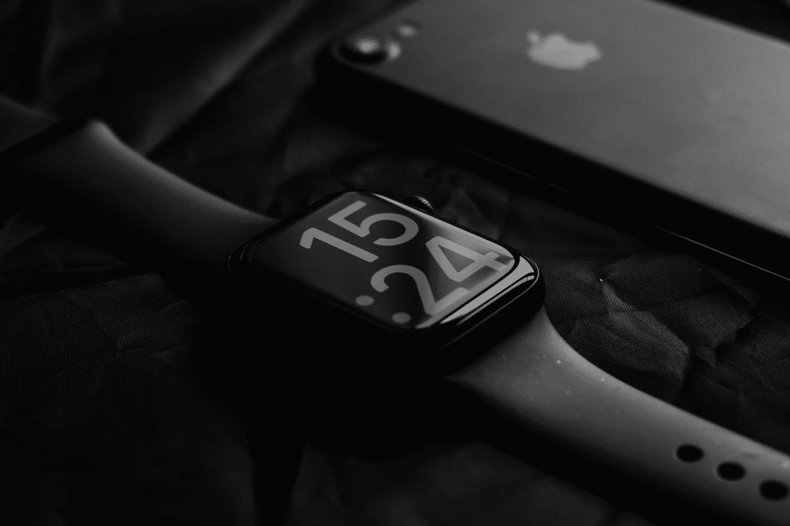
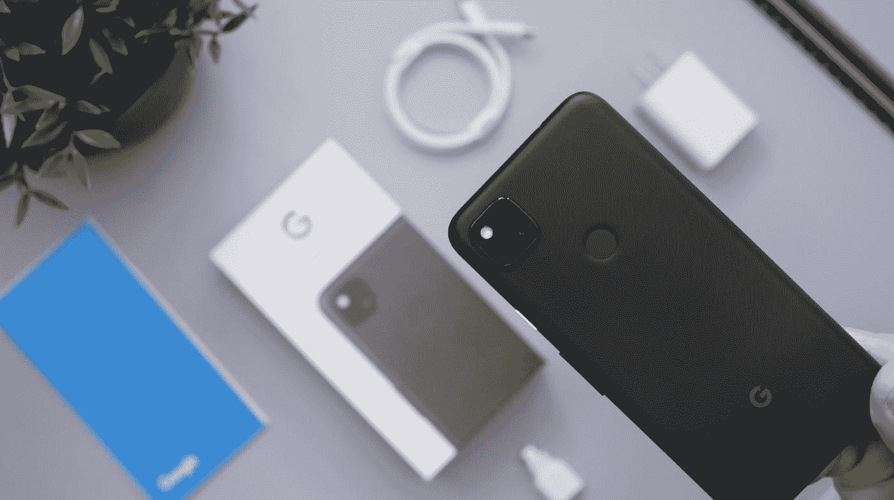
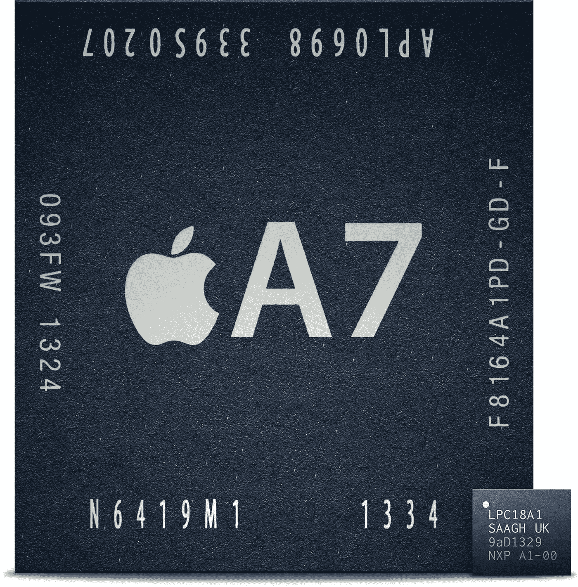

# 嵌入式人工智能简史

> 原文：<https://towardsdatascience.com/a-brief-history-of-embedded-ai-6109be99199d>

## 智能手机上的传感器中枢如何帮助人工智能走向边缘

AIoT、TinyML、EdgeAI 和 MLSensors 是人工智能和嵌入式系统社区的最新热门词汇。围绕设计高度优化、低占用空间的机器学习算法有很多宣传，这些算法运行在超低功耗微控制器和 DSP 上，目标是传感应用，包括但不限于音频和视频。这种方法在“始终在线”的应用中特别有用，在这些应用中，功耗需要最小化，并且侵犯隐私是一个严重的问题。

**一些现有的应用程序已经利用了嵌入式智能:**
-唤醒词检测:“Ok Google”和“Hey Siri”是我们几乎每天都在使用的主要例子
-车祸检测:较新的智能手机可以融合来自麦克风、惯性传感器和 GPS 等多个传感器的数据，以便在发生车祸时检测和警告紧急服务
-计步和锻炼检测:可穿戴设备使用来自惯性和生物传感器的数据以及智能算法来跟踪日常活动。

照片由[克利姆·穆萨利莫夫](https://unsplash.com/@klim11?utm_source=medium&utm_medium=referral)在 [Unsplash](https://unsplash.com?utm_source=medium&utm_medium=referral) 上拍摄

所有这些情况的共同点是使用与传感器紧密耦合的专用低功耗处理硬件，运行高度优化的算法来做出相关的推断。另一个共性是它们都是更复杂设备的子系统。

由于这些发展，在不久的将来，我们可能会在其他*独立*设备中看到嵌入式智能，例如:
-完全离线的智能摄像头[来检测人类的存在](https://blog.tensorflow.org/2019/10/visual-wake-words-with-tensorflow-lite_30.html)【1】
-环境传感器来检测[森林火灾](https://www.bosch.com/stories/early-forest-fire-detection-sensors/)【2】和[非法砍伐树木](https://www.mdpi.com/1424-8220/21/22/7593)【3】

  

嵌入式智能的日益普及和广泛应用令人振奋。
但是这一切是从哪里开始的？以下是我对“传感器中枢”，尤其是智能手机中的传感器中枢如何推动这场运动的快速总结。

**但是首先，什么是传感器集线器？**
根据定义，它是一个协处理器、微控制器或 DSP，负责整合数据，并提供来自设备中多个低功耗传感器的简化见解，以释放主应用处理器的处理带宽。

传感器集线器最初是智能手机中一个简洁的电源优化技巧。早在 iPhone 5s 和 Nexus 5X 和 6P 的手机分别采用了苹果 M7 协处理器[4]和安卓传感器中枢[5]。苹果使用 M7 来处理加速度计、陀螺仪和指南针等要求苛刻的惯性传感器以及传感器融合算法，而 Android Sensor Hub 也做了同样的事情，并运行高级活动识别算法。
摩托罗拉在惯性传感器功能上进一步创新，用朗朗上口的“[快快](https://www.facebook.com/MotorolaIN/videos/chop-chop-to-light-up-do-more-with-the-intuitive-moto-actions-on-the-motog5s-buy/1062923173744146/)手势打开手电筒。

Android 传感器中枢介绍(19:28)

我们也开始看到传感器(麦克风)的重叠和运行在低功耗处理器上的机器学习随着像“嘿 Siri”和“Ok Google”这样的唤醒词检测而变得流行。这些功能通过[快速短语](https://support.google.com/assistant/answer/9475056?hl=en&co=GENIE.Platform%3DAndroid)被推向了更高的高度，现在正在最新的 Pixel 手机上播放。

丹尼尔·罗梅罗在 [Unsplash](https://unsplash.com/?utm_source=medium&utm_medium=referral) 上的照片

因此，在过去的 6-7 年中，智能手机及其传感器中枢被证明是完美的概念证明，向世界展示了在微控制器和 DSP 等极低功耗计算平台上部署传感器的机器学习算法是可能的。
很高兴看到这项运动以 TinyML、EdgeAI 和 MLSensors 社区的形式获得了自己的名字和独立受众。

有趣的是，半导体巨头如 ADI 公司、TDK 和罗伯特·博世设计并制造了大量用于智能手机的传感器，它们对传感器集线器有自己独特的看法。

而目标仍然是一样的:从多个传感器提供有用的见解，同时消耗尽可能少的功率。应用要广泛得多。由于智能手机已经拥有自己的传感器中枢，因此正在为可穿戴设备、汽车和其他智能设备开发独立的传感器中枢。

智能手机上的传感器集线器最初是分立元件。M7 运动协处理器是一款基于恩智浦 LPC18A1 的独立芯片。但随着时间的推移，这些协处理器被集成到主智能手机 SoC 中。

苹果 A7 与 M7 并排(LPC18A1):来源— [维基共享资源](https://commons.wikimedia.org/wiki/File:LPC18A1-and-A7.jpg)

然而，半导体和传感器制造商仍可提供分立传感器集线器。他们将人工智能和传感器结合起来，以实现像[游泳教练](https://www.bosch-sensortec.com/white-paper-swimming.html)【8】这样的利基用例。
通常只有微控制器，通常是 ARM Cortex M 系列，与传感器紧密耦合，并预装算法以支持特定用例。这对这些传感器的制造商来说非常好，因为他们不仅能够将硬件货币化，而且能够将他们为这些传感器开发的算法货币化。
对于使用这些“智能传感器”开发自己的小工具的公司来说，这也很好，因为他们不需要花时间开发利基算法，而是可以专注于系统集成。

传感器集线器仍处于非常初期的阶段，主要使用通用微控制器，但随着硬件的不断改进，可能性是无限的。传感器本身变得越来越精确。ARM v9 及其对 DSP 和 ML 功能的关注将极大地扩展可在嵌入式设备上实现的模型集。Ethos U-55 是 ARM 的一个 microNPU(神经处理单元),它可以很快找到通往已经实施 ARM IPs 的传感器中枢的道路[9]。许多像 [Syntiant](https://www.syntiant.com/) 这样的初创公司也在开发边缘神经网络推理的专用硬件。

传感器世界即将迎来激动人心的时代！敬请关注更多关于 EdgeAI 和智能传感器的思考…

**参考和链接**

[1][https://blog . tensor flow . org/2019/10/visual-wake-words-with-tensor flow-lite _ 30 . html](https://blog.tensorflow.org/2019/10/visual-wake-words-with-tensorflow-lite_30.html)
【2】[https://www . bosch . com/stories/early-forest-fire-detection-sensors/](https://www.bosch.com/stories/early-forest-fire-detection-sensors/)
【3】[https://www.mdpi.com/1424-8220/21/22/7593](https://www.mdpi.com/1424-8220/21/22/7593)
【4】[https://en.wikipedia.org/wiki/Apple_motion_coprocessors](https://en.wikipedia.org/wiki/Apple_motion_coprocessors)
【5】[https://www . androidflow](https://www.androidpolice.com/2015/09/29/the-new-android-sensor-hub-will-significantly-improve-idle-battery-life-while-doing-more-with-sensor-data/)