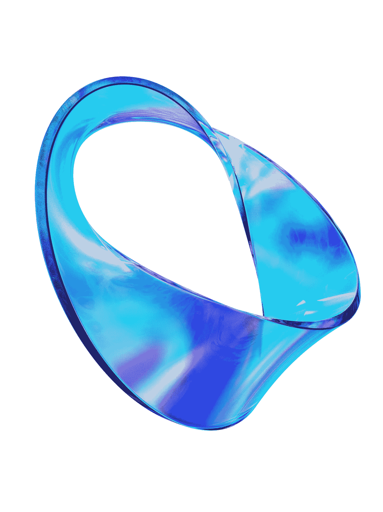
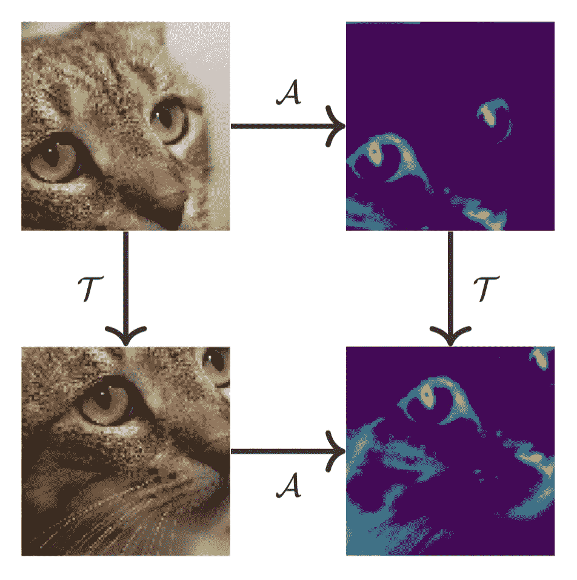
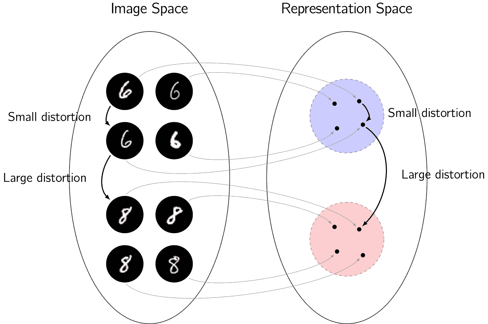
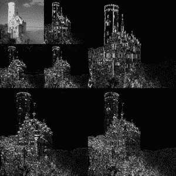
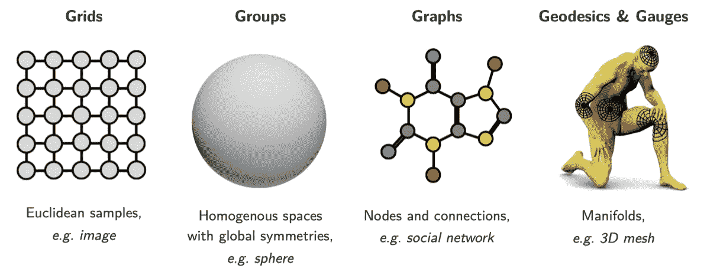
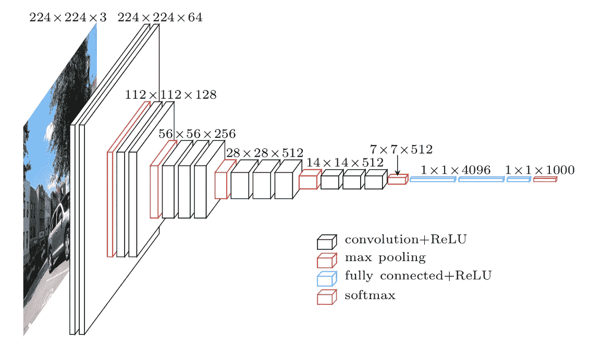

# 几何深度学习简介

> 原文：<https://towardsdatascience.com/a-brief-introduction-to-geometric-deep-learning-dae114923ddb>

## 复杂数据的人工智能

西蒙·李在 [Unsplash](https://unsplash.com?utm_source=medium&utm_medium=referral) 上的照片

持续学习很难。虽然[通用逼近定理](https://en.wikipedia.org/wiki/Universal_approximation_theorem)表明足够复杂的神经网络原则上可以逼近“任何东西”，但并不能保证我们能找到好的模型。

然而，通过明智地选择模型架构，深度学习取得了巨大进展。这些模型架构对[归纳偏差](https://en.wikipedia.org/wiki/Inductive_bias#:~:text=The%20inductive%20bias%20(also%20known,predict%20a%20certain%20target%20output.)进行编码，为模型助一臂之力。最强大的归纳偏见之一是利用几何的概念，产生了*几何深度学习*的领域。

几何深度学习这个术语首先是由该领域的先驱迈克尔·布朗斯坦提出的(参见他的[帖子](https://medium.com/@michael-bronstein)中关于许多最新深度学习研究的有趣见解，以及该领域的广泛概述)。在这篇文章中，我们将对几何深度学习做一个简单的介绍，而不是深入技术领域。我们在很大程度上遵循了布朗斯坦及其同事的优秀新书[1]，但提供了我们自己独特的观点，并专注于高层次的概念，而不是技术细节。

# 几何先验

> 从根本上说，几何深度学习涉及将对数据的几何理解编码为深度学习模型中的归纳偏差，以帮助它们。

我们对世界的几何理解通常通过三种类型的几何先验进行编码:

1.  对称性和不变性
2.  稳定性
3.  多尺度表示

最常见的几何先验之一是将**对称性和不变性**编码为不同类型的变换。在物理学中，对称性通常由物理系统在变换下的不变性来表示。如果我们知道现实世界表现出某些对称性，那么将这些对称性直接编码到我们的深度学习模型中是有意义的。这样我们就能给模型一个有力的帮助，这样它就不必学习对称性，但在某种意义上已经知道了。在我们之前关于 [*的文章中进一步阐述了在深度学习中利用对称性，爱因斯坦可以教给我们关于机器学习的什么*](/what-einstein-can-teach-us-about-machine-learning-1661e26bef2c) *。*

作为编码对称性和不变性的一个例子，传统的卷积神经网络(CNN)表现出所谓的平移等方差，如下图中猫的脸所示。考虑模型的特征空间(在右边)。如果相机或猫移动，即在图像中被平移，特征空间中的内容应该更相似，即也被平移。这种特性被称为平移等方差，在某种意义上确保了一个模式(猫的脸)只需要学习一次。我们不必在所有可能的位置学习模式，而是通过在模型本身中对平移等变进行编码，确保模式可以在所有位置被识别。

平移等方差图。给定一幅图像(左上)，计算特征图(𝒜)(右上)，然后平移(𝒯)特征图(右下)，相当于首先平移图像(左下)，然后计算特征图(右下)。【图表由作者创作，首次呈现[此处](/what-einstein-can-teach-us-about-machine-learning-1661e26bef2c)。]

另一个常见的几何先验是确保表示空间的**稳定性**。我们可以认为数据实例之间的差异是由于某种*失真*造成的，这种失真会将一个数据实例映射到另一个数据实例。例如，对于一个分类问题，小的失真会导致一个类内的变化，而较大的失真会将数据实例从一个类映射到另一个类。然后，两个数据实例之间的失真的大小捕获一个数据实例与另一个数据实例有多“接近”或相似。为了使表示空间表现良好并支持有效的深度学习，我们应该保留数据实例之间的相似性度量。为了保持表示空间中的相似性，特征映射必须表现出稳定性。

作为一个代表性的例子，考虑手写数字的分类。原始图像空间及其表示空间如下图所示。小的变形将一个 6 映射到另一个，捕捉手绘 6 的不同实例之间的类内变化。在表示空间中，这些数据实例应该保持接近。然而，更大的失真可以将 6 映射到 8，从而捕捉到类间变化。同样，在表示空间中，相似性的度量应该被保留，因此在表示空间中 6s 和 8s 之间应该有更大的间隔。需要特征映射的稳定性，以确保保持这样的距离，从而促进有效的学习。

到表示空间的映射的稳定性的说明。小失真是类内变化的原因，而大失真是类间变化的原因。需要映射的稳定性，以确保数据实例之间的相似性度量，即它们之间的失真大小，被保存在表示空间中，以便促进有效的学习。[作者为[2]创建的图表。]

第三种常见的几何先验是对数据的**多尺度、分级**表示进行编码。在一个数据实例中，许多数据不是*独立的，而是以复杂的方式相互关联。以一幅图像为例。每个图像像素不是独立的，而是相邻的像素通常是相关的并且非常相似。取决于内容结构，“附近”的不同概念也是可能的。因此，通过捕捉大量数据的多尺度、分层性质，可以构建有效的表示空间。*

考虑一个标准的 2D 图像作为例子，例如下面显示的城堡图像。下图显示了图像的多比例、分层表示，左上角是原始图像的低分辨率版本，然后是在图表的其他面板中捕获的不同分辨率的剩余图像内容。这为底层图像提供了更有效的表现方式，事实上，这也是推动 [JPEG-2000](https://en.wikipedia.org/wiki/JPEG_2000) 图像压缩的技术。可以利用类似的多尺度、分层表示来为学习提供有效的表示空间。

图像的多尺度、分层表示。原始图像的低分辨率版本显示在左上角，然后在图表的其他面板中捕获不同分辨率的剩余图像内容。可以利用类似的表示为学习提供有效的表示空间。【来源[维基百科](https://en.wikipedia.org/wiki/Discrete_wavelet_transform#/media/File:Jpeg2000_2-level_wavelet_transform-lichtenstein.png)。]

我们已经介绍了几何深度学习中利用的三种主要类型的几何先验。虽然这些提供了几何学习的基本概念，但它们可以应用于许多不同的设置。

# 几何深度学习的类别

在布朗斯坦的新书[1]中，几何深度学习被分为四个基本类别，如下图所示。

几何深度学习的类别。[图片来源于文章[1]，经过许可，添加了带注释的概述和示例。]

布朗斯坦谈到了 5Gs(扩展了 Max Welling [1]首先提出的 4G 分类):网格；团体；图表；测地线和量规。由于这最后两个 g 密切相关，我们只考虑四个不同的类别，即 4g。

**网格**类别捕获定期采样或网格化的数据，如 2D 图像。这些数据可能通常是经典深度学习的产物。然而，也可以从几何角度解释许多经典的深度学习模型(如 CNN 及其平移等变，如上所述)。

**组**类别涵盖了[具有全局对称性的同质空间](https://en.wikipedia.org/wiki/Group_theory)。这个类别的典型例子是球体(在我们的[上一篇文章](/geometric-deep-learning-for-spherical-data-55612742d05f)【3】中有更详细的介绍)。球形数据出现在 myrad 应用中，不仅是在球体上直接获取数据时(如在地球上或通过 360°相机捕捉全景照片和视频)，而且在考虑球形对称性时(如在分子化学或磁共振成像中)。虽然球体是最常见的组设置，但也可以考虑其他组及其相应的对称性。

**图**类别包括可以由[计算图](https://en.wikipedia.org/wiki/Graph_theory)表示的数据，带有节点和边。网络非常适合这种表示，因此图深度学习在社会网络的研究中得到了广泛的应用。几何深度学习的图形方法提供了很大的灵活性，因为许多数据可以用图形来表示。然而，这种灵活性可能伴随着特异性和所提供的优势的损失。例如，通常可以用图表方法来考虑群体设置，但是在这种情况下，人们失去了群体的潜在知识，而这些知识本来是可以利用的。

最后一个**测地线和量规**类别涉及对更复杂形状的深度学习，比如更通用的流形和 3D 网格。这种方法在计算机视觉和图形学中非常有用，例如，人们可以利用 3D 模型及其变形进行深度学习。

# 积木

尽管如上所述，存在许多不同类别的几何深度学习，以及可以利用的不同类型的几何先验，但是几何深度学习的所有方法本质上都采用了以下基础构件的不同体现。

几何深度学习的所有方法都利用了一组核心的基本基础构件。【图片由[森](https://unsplash.com/@sen7?utm_source=medium&utm_medium=referral)在 [Unsplash](https://unsplash.com?utm_source=medium&utm_medium=referral) 上拍摄。]

深度学习架构通常由许多层组成，这些层组合在一起形成整体的[模型架构](/neural-network-architectures-156e5bad51ba)。然后经常重复层的组合。几何深度学习模型通常包括以下类型的层。

1.  **线性等变层:**几何深度学习模型的核心组件是线性层，比如卷积，它对于某种对称变换是等变的。线性变换本身需要为所考虑的几何范畴而构造，例如球和图形上的卷积是困难的，尽管经常有许多类比。
2.  **非线性等变层:**为了确保深度学习模型具有足够的表示能力，它们必须表现出非线性(否则它们只能表示简单的线性映射)。必须引入非线性层来实现这一点，同时还保持等方差。以等变方式引入非线性的标准方法是通过逐点非线性激活函数(如 ReLUs)来实现，尽管有时也考虑其他形式的非线性，特别是针对基础几何形状[3]。
3.  **局部平均:**大多数几何深度学习模型也包括一种形式的局部平均，如 CNN 中的 max pooling layers。此类操作会在特定比例下施加局部不变性，从而确保稳定性，并通过堆叠多个图层块来实现多比例、分层的表示。
4.  **全局平均:**为了在几何深度学习模型中施加全局不变性，通常采用全局平均层，例如 CNN 中的全局池层。

几何深度学习模型的典型例子是用于 2D 平面图像的传统 CNN。虽然许多人可能认为这是一个经典的深度学习模型，但它可以从几何角度进行解释。事实上，CNN 如此成功的一个关键原因是其架构中的几何属性。下图概述了一个典型的 CNN 架构，其中很明显包括了上面讨论的许多几何深度学习层，重复的层块提供了一个分层的多尺度表示空间。

VGG-16 卷积神经网络(CNN)架构。虽然 CNN 通常被认为是分类的深度学习模型，但它们可以从几何角度解释，利用几何深度学习模型的核心类型。[图片[来源](https://www.researchgate.net/figure/The-VGG-16-architecture-for-the-ImageNet-dataset-26_fig13_332412613)。]

# 未来展望

深度学习现在对于标准类型的数据来说是司空见惯的，例如结构化数据、序列数据和图像数据。然而，为了将深度学习的应用扩展到其他更复杂的几何数据集，这些数据的几何必须编码在深度学习模型中，从而产生了几何深度学习领域。

几何深度学习是一个热门且快速发展的领域，已经取得了很多进展。然而，许多未解决的问题仍然存在，不仅在模型本身，而且围绕可扩展性和实际应用。我们将在接下来的文章中解决这些问题，展示解决这些问题对于释放深度学习在大量新应用中的巨大潜力是如何至关重要的。

# 参考

[1]布朗斯坦，布鲁纳，科恩，维利科维奇，*几何深度学习:网格，群，图，测地线，和量规* (2021)， [arXix:2104.13478](https://arxiv.org/abs/2104.13478)

[2] McEwen，Wallis，Mavor-Parker，*可扩展和旋转等变球形 CNN 的球上散射网络*，ICLR (2022)， [arXiv:2102.02828](https://arxiv.org/abs/2102.02828)

[3]科布，沃利斯，马沃-帕克，马利涅尔，普莱斯，达韦扎克，麦克尤恩，*高效广义球面 CNN*，ICLR (2021)， [arXiv:2010.11661](https://arxiv.org/abs/2010.11661#)