# 递归神经网络简介

> 原文：<https://towardsdatascience.com/a-brief-introduction-to-recurrent-neural-networks-638f64a61ff4>

## RNN、LSTM 和 GRU 及其实施情况介绍

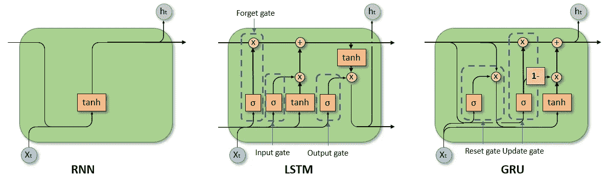

RNN、LSTM 和 GRU 的牢房。

如果您想要对序列或时间序列数据(例如，文本、音频等)进行预测。)传统的神经网络是一个糟糕的选择。但是为什么呢？

在时间序列数据中，当前的观测值依赖于以前的观测值，因此观测值不是相互独立的。然而，传统的神经网络认为每个观察都是独立的，因为网络不能保留过去或历史信息。基本上，他们对过去发生的事情没有记忆。

这导致了递归神经网络(RNNs)的兴起，它通过包括数据点之间的依赖性，将记忆的概念引入神经网络。这样，可以训练 rnn 基于上下文记住概念，即学习重复的模式。

但是 RNN 人是如何获得这种记忆的呢？

RNNs 通过细胞中的反馈回路实现记忆。这是 RNN 和传统神经网络的主要区别。与信息仅在层间传递的前馈神经网络相比，反馈回路允许信息在层内传递。

然后，rnn 必须定义哪些信息足够相关，可以保存在存储器中。为此，不同类型的 RNN 进化而来:

*   传统递归神经网络(RNN)
*   长短期记忆递归神经网络(LSTM)
*   门控递归单元递归神经网络(GRU)

在这篇文章中，我将向你介绍 RNN、LSTM 和格鲁。我将向你展示他们的相同点和不同点以及一些优点和缺点。除了理论基础，我还向您展示了如何使用`tensorflow`在 Python 中实现每种方法。

# 递归神经网络(RNN)

通过反馈回路，一个 RNN 单元的输出也被该单元用作输入。因此，每个单元有两个输入:过去和现在。利用过去的信息会产生短期记忆。

为了更好地理解，我们展开 RNN 单元的反馈回路。展开单元的长度等于输入序列的时间步长数。

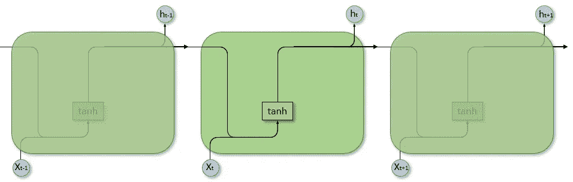

展开的递归神经网络。

我们可以看到过去的观察是如何通过展开的网络作为隐藏状态传递的。在每个单元中，当前时间步长的输入 ***x*** (当前值)、先前时间步长的隐藏状态 ***h*** (过去值)和偏差被组合，然后被激活函数限制以确定当前时间步长的隐藏状态。

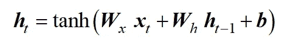

这里，小而粗的字母代表向量，大写的粗字母代表矩阵。

通过时间反向传播(BPTT)算法更新 RNN 的权重 ***W*** 。

rnn 可用于一对一、一对多、多对一和多对多预测。

## RNNs 的优势

由于它们的短期记忆，rnn 可以处理顺序数据并识别历史数据中的模式。此外，rnn 能够处理不同长度的输入。

## RNNs 的缺点

RNN 遭受消失梯度下降。在这种情况下，用于在反向传播期间更新权重的梯度变得非常小。将权重与接近零的梯度相乘可以防止网络学习新的权重。这种学习的停止导致 RNN 人忘记了在更长的序列中看到的东西。消失梯度下降的问题增加了网络的层数。

由于 RNN 只保留了最近的信息，这个模型在考虑很久以前的观测数据时存在问题。因此，RNN 倾向于在长序列上丢失信息，因为它只存储最新的信息。因此，RNN 只有短期记忆，而没有长期记忆。

此外，由于 RNN 及时使用反向传播来更新权重，所以网络还遭受爆炸梯度，并且如果使用 ReLu 激活函数，还遭受死 ReLu 单元。前者可能会导致收敛问题，而后者可能会停止学习。

## RNNs 在 tensorflow 中的实现

我们可以使用`tensorflow`在 Python 中轻松实现 RNN。为此，我们使用`Sequential`模型，它允许我们堆叠 RNN 的层，即`SimpleRNN`层类和`Dense`层类。

```
from tensorflow.keras import Sequential
from tensorflow.keras.layers import SimpleRNN, Dense
from tensorflow.keras.optimizers import Adam
```

只要我们想使用缺省参数，就没有必要导入优化器。然而，如果我们想要定制优化器的任何参数，我们也需要导入优化器。

为了构建网络，我们定义了一个`Sequential`模型，然后使用`add()`方法添加 RNN 层。要添加一个 RNN 层，我们使用`SimpleRNN`类并传递参数，比如单元数量、退出率或激活函数。对于我们的第一层，我们也可以传递输入序列的形状。

如果我们堆叠 RNN 层，我们需要设置前一层的`return_sequence`参数为`True`。这可确保图层的输出对于下一个 RNN 图层具有正确的格式。

为了生成一个输出，我们使用一个`Dense`层作为我们的最后一层，传递输出的数量。

```
# define parameters
n_timesteps, n_features, n_outputs = X_train.shape[1], X_train.shape[2], y_train.shape[1]

# define model
rnn_model = Sequential()
rnn_model.add(SimpleRNN(130, dropout=0.2, return_sequences=True, input_shape=(n_timesteps, n_features)))
rnn_model.add(SimpleRNN(110, dropout=0.2, activation="tanh", return_sequences=True))
rnn_model.add(SimpleRNN(130, dropout=0.2, activation="tanh", return_sequences=True))
rnn_model.add(SimpleRNN(100, dropout=0.2, activation="sigmoid", return_sequences=True))
rnn_model.add(SimpleRNN(40, dropout=0.3, activation="tanh"))
rnn_model.add(Dense(n_outputs)) 
```

在我们定义了我们的 RNN 之后，我们可以使用`compile()`方法编译这个模型。这里，我们传递损失函数和我们想要使用的优化器。`tensorflow`提供了一些内置的[损失函数](https://www.tensorflow.org/api_docs/python/tf/keras/losses)和[优化器](https://www.tensorflow.org/api_docs/python/tf/keras/optimizers)。

```
rnn_model.compile(loss='mean_squared_error', optimizer=Adam(learning_rate=0.001))
```

在我们训练 RNN 之前，我们可以使用`summary()`方法来看看模型和参数的数量。这可以让我们对模型的复杂性有一个大概的了解。

我们使用`[fit()](https://www.tensorflow.org/api_docs/python/tf/keras/Sequential#fit)`方法训练模型。这里，我们需要传递训练数据和不同的参数来定制训练，包括时期数、批量大小、验证分割和提前停止。

```
stop_early = tf.keras.callbacks.EarlyStopping(monitor='val_loss', patience=5)
rnn_model.fit(X_train, y_train, epochs=30, batch_size=32, validation_split=0.2, callbacks=[stop_early])
```

为了对我们的测试数据集或任何未知数据进行预测，我们可以使用`predict()`方法。`verbose`参数只是说明我们是否想要获得任何关于预测过程状态的信息。在这种情况下，我不想打印出任何状态。

```
y_pred = rnn_model.predict(X_test, verbose=0)
```

## 张量流中 RNNs 的超参数调谐

正如我们所见，RNN 的实现非常简单。然而，找到正确的超参数，如每层的单元数、辍学率或激活函数，要困难得多。

但是我们可以使用`keras-tuner`库，而不是手动改变超参数。该库有四个调谐器，`RandomSearch`、`Hyperband`、`BayesianOptimization`和`Sklearn`，用于从给定的搜索空间中识别正确的超参数组合。

要运行调谐器，我们首先需要导入`tensorflow`和 Keras 调谐器。

```
import tensorflow as tf
import keras_tuner as kt
```

然后，我们建立超调模型，其中我们定义了超参数搜索空间。我们可以使用一个函数来构建超级模型，在这个函数中，我们以与上述相同的方式来构建模型。唯一的区别是，我们为每个想要调优的超参数添加了搜索空间。在下面的示例中，我想要调整每个 RNN 图层的单位数、激活函数和辍学率。

```
def build_RNN_model(hp):

    # define parameters
    n_timesteps, n_features, n_outputs = X_train.shape[1], X_train.shape[2], y_train.shape[1]

    # define model
    model = Sequential()

    model.add(SimpleRNN(hp.Int('input_unit',min_value=50,max_value=150,step=20), return_sequences=True, dropout=hp.Float('in_dropout',min_value=0,max_value=.5,step=0.1), input_shape=(n_timesteps, n_features)))
    model.add(SimpleRNN(hp.Int('layer 1',min_value=50,max_value=150,step=20), activation=hp.Choice("l1_activation", values=["tanh", "relu", "sigmoid"]), dropout=hp.Float('l1_dropout',min_value=0,max_value=.5,step=0.1), return_sequences=True))
    model.add(SimpleRNN(hp.Int('layer 2',min_value=50,max_value=150,step=20), activation=hp.Choice("l2_activation", values=["tanh", "relu", "sigmoid"]), dropout=hp.Float('l2_dropout',min_value=0,max_value=.5,step=0.1), return_sequences=True))
    model.add(SimpleRNN(hp.Int('layer 3',min_value=20,max_value=150,step=20), activation=hp.Choice("l3_activation", values=["tanh", "relu", "sigmoid"]), dropout=hp.Float('l3_dropout',min_value=0,max_value=.5,step=0.1), return_sequences=True))
    model.add(SimpleRNN(hp.Int('layer 4',min_value=20,max_value=150,step=20), activation=hp.Choice("l4_activation", values=["tanh", "relu", "sigmoid"]), dropout=hp.Float('l4_dropout',min_value=0,max_value=.5,step=0.1)))

    # output layer
    model.add(Dense(n_outputs))

    model.compile(loss='mean_squared_error', optimizer=Adam(learning_rate=1e-3))

    return model
```

为了定义每个变量的搜索空间，我们可以使用不同的方法，如`hp.Int`、`hp.Float`和`hp.Choice`。前两者的用法非常相似。我们给它们一个名字，一个最小值，一个最大值和一个步长。该名称用于识别超参数，而最小值和最大值定义了我们的值范围。步长参数定义了我们用于调整的范围内的值。`hp.Choice`可用于调整分类超参数，如激活函数。在这里，我们只需要传递一个我们想要测试的选项列表。

在我们构建了超模型之后，我们需要实例化调谐器并执行超调谐。尽管我们可以选择不同的算法进行调优，但它们的实例化非常相似。我们通常需要指定要优化的目标和要训练的最大历元数。这里，建议将时期设置为比我们预期的时期数稍高的数字，然后使用提前停止。

例如，如果我们想要使用`Hyperband`调谐器和验证损耗作为目标，我们可以将调谐器构建为

```
tuner = kt.Hyperband(build_RNN_model,
                     objective="val_loss",
                     max_epochs=100,
                     factor=3,
                     hyperband_iterations=5,
                     directory='kt_dir',
                     project_name='rnn',
                     overwrite=True)
```

在这里，我还传递了存储结果的目录，以及调谐器迭代整个 Hyperband 算法的频率。

在我们实例化了调谐器之后，我们可以使用`search()`方法来执行超参数调谐。

```
stop_early = tf.keras.callbacks.EarlyStopping(monitor='val_loss', patience=5)
tuner.search(X_train, y_train, validation_split=0.2, callbacks=[stop_early])
```

为了提取最佳超参数，我们可以使用`get_best_hyperparameters()`方法和`get()`方法以及我们调整的每个超参数的名称。

```
best_hps=tuner.get_best_hyperparameters(num_trials=1)[0]
print(f"input: {best_hps.get('input_unit')}")
print(f"input dropout: {best_hps.get('in_dropout')}")
```

# 长短期记忆(LSTM)

LSTMs 是一种特殊类型的 rnn，其解决了简单 rnn 的主要问题，即消失梯度的问题，即丢失更远过去的信息。

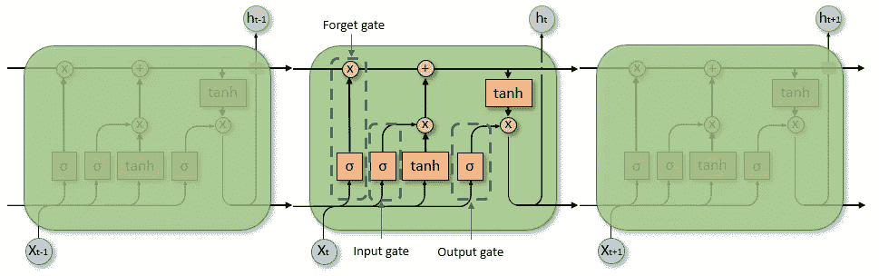

展开的长短期记忆细胞。

LSTMs 的关键是**单元状态**，它从单元的输入传递到输出。因此，单元状态允许信息沿着整个链流动，仅通过三个门进行较小的线性动作。因此，细胞状态代表了 LSTM 的长期记忆。这三个门被称为遗忘门、输入门和输出门。这些门起着过滤器的作用，控制信息的流动，并决定哪些信息被保留或忽略。

**遗忘门**决定要保留多少长期记忆。为此，使用 sigmoid 函数来说明单元状态的重要性。输出在 0 和 1 之间变化，并表示保留了多少信息，即 0 表示不保留信息，1 表示保留单元状态的所有信息。输出由当前输入 ***x*** 、前一时间步的隐藏状态 ***h*** 和 a 偏置 ***b*** 共同决定。

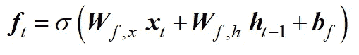

**输入门**决定将哪些信息添加到单元状态，从而添加到长期记忆中。这里，sigmoid 图层决定更新哪些值。

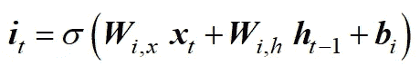

**输出门**决定单元状态的哪些部分建立输出。因此，输出门负责短期记忆。

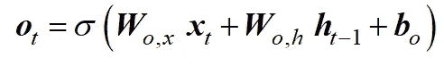

可以看出，所有三个门都由相同的函数表示。只有权重和偏差不同。单元状态通过遗忘门和输入门更新。

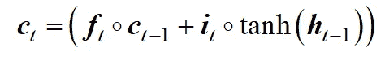

上述等式中的第一项决定了保留多少长期记忆，而第二项向细胞状态添加新信息。

然后，当前时间步长的隐藏状态由输出门和一个双曲正切函数决定，该函数将单元状态限制在-1 和 1 之间。

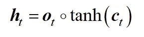

## LSTMs 的优势

LSTM 的优势类似于 RNNs，主要好处是它们可以捕获序列的长期和短期模式。因此，它们是最常用的 rnn。

## LSTMs 的缺点

由于其更复杂的结构，LSTMs 在计算上更昂贵，导致更长的训练时间。

因为 LSTM 也使用时间反向传播算法来更新权重，所以 LSTM 遭受反向传播的缺点(例如，死 ReLu 元素、爆炸梯度)。

## 张量流中 LSTMs 的实现

`tensorflow`中 LSTMs 的实现非常类似于一个简单的 RNN。唯一的区别是我们导入了`LSTM`类，而不是`SimpleRNN`类。

```
from tensorflow.keras import Sequential
from tensorflow.keras.layers import LSTM, Dense
from tensorflow.keras.optimizers import Adam
```

我们可以用简单的 RNN 的方法来组合 LSTM 网络。

```
# define parameters
n_timesteps, n_features, n_outputs = X_train.shape[1], X_train.shape[2], y_train.shape[1]

# define model
lstm_model = Sequential()
lstm_model.add(LSTM(130, return_sequences=True, dropout=0.2, input_shape=(n_timesteps, n_features)))
lstm_model.add(LSTM(70, activation="relu", dropout=0.1, return_sequences=True))
lstm_model.add(LSTM(100, activation="tanh", dropout=0))

# output layer
lstm_model.add(Dense(n_outputs, activation="tanh"))

lstm_model.compile(loss='mean_squared_error', optimizer=Adam(learning_rate=0.001))

stop_early = tf.keras.callbacks.EarlyStopping(monitor='val_loss', patience=5)
lstm_model.fit(X_train, y_train, epochs=30, batch_size=32, validation_split=0.2, callbacks=[stop_early])
```

超参数调谐也与简单 RNN 相同。因此，我们只需要对我上面展示的代码片段做一些小的改动。

# 门控循环单元(GRU)

类似于 LSTMs，GRU 解决了简单 rnn 的消失梯度问题。然而，与 LSTMs 的区别在于 gru 使用较少的门，并且没有单独的内部存储器，即单元状态。因此，GRU 仅仅依靠隐藏状态作为记忆，导致更简单的架构。

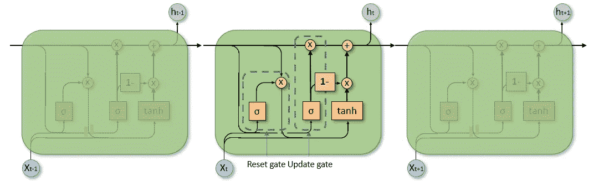

展开门控循环单元(GRU)。

**重置门**负责短期记忆，因为它决定保留和忽略多少过去的信息。

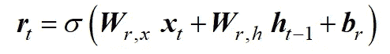

向量 ***r*** 中的值由 sigmoid 函数限制在 0 和 1 之间，并取决于前一时间步的隐藏状态 ***h*** 和当前输入 ***x*** 。使用权重矩阵 ***W*** 对二者进行加权。此外，还增加了一个偏差 ***b*** 。

相比之下，**更新门**负责长期记忆，与 LSTM 的遗忘门相当。

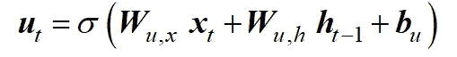

正如我们所看到的，复位和更新门之间的唯一区别是权重 ***W*** 。

当前时间步长的隐藏状态是基于两步过程确定的。首先，确定候选隐藏状态。候选状态是当前输入和前一时间步的隐藏状态以及激活函数的组合。在这个例子中，使用了一个双曲正切函数。前一隐藏状态对候选隐藏状态的影响由复位门控制

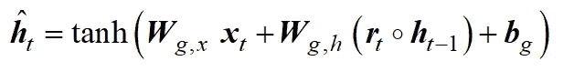

第二步，将候选隐藏状态与前一时间步的隐藏状态相结合，生成当前隐藏状态。如何组合先前隐藏状态和候选隐藏状态由更新门决定。

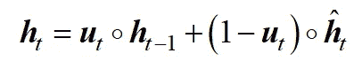

如果更新门给出值 0，则完全忽略先前的隐藏状态，并且当前隐藏状态等于候选隐藏状态。如果更新门给出的值为 1，反之亦然。

## GRUs 的优势

由于与 LSTMs 相比更简单的架构(即，两个而不是三个门，一个状态而不是两个)，gru 在计算上更有效并且训练更快，因为它们需要更少的存储器。

此外，GRUs haven 被证明对于较小的序列更有效。

## GRUs 的缺点

由于 GRUs 没有单独的隐藏细胞状态，它们可能无法考虑远至 LSTM 的观测结果。

类似于 RNN 和 LSTM，GRU 也可能遭受及时反向传播以更新权重的缺点，即，死 ReLu 元素、爆炸梯度。

## 张量流中 GRUs 的实现

至于 LSTM，GRU 的实现非常类似于简单的 RNN。我们只需要导入`GRU`类，其余的保持不变。

```
from tensorflow.keras import Sequential
from tensorflow.keras.layers import GRU, Dense
from tensorflow.keras.optimizers import Adam

# define parameters
n_timesteps, n_features, n_outputs = X_train.shape[1], X_train.shape[2], y_train.shape[1]

# define model
gru_model = Sequential()
gru_model.add(GRU(90,return_sequences=True, dropout=0.2, input_shape=(n_timesteps, n_features)))
gru_model.add(GRU(150, activation="tanh", dropout=0.2, return_sequences=True))
gru_model.add(GRU(60, activation="relu", dropout=0.5))
gru_model.add(Dense(n_outputs))

gru_model.compile(loss='mean_squared_error', optimizer=Adam(learning_rate=0.001))

stop_early = tf.keras.callbacks.EarlyStopping(monitor='val_loss', patience=5)
gru_model.fit(X_train, y_train, epochs=30, batch_size=32, validation_split=0.2, callbacks=[stop_early])
```

这同样适用于超参数调谐。

# 结论

递归神经网络将记忆引入神经网络。这样，序列和时间序列数据中观测值的相关性就包含在我们的预测中。

在本文中，我向您展示了三种类型的递归神经网络，即简单的 RNN、LSTM 和格鲁。我向您展示了它们的工作原理、优缺点以及如何使用`tensorflow`在 Python 中实现它们。

请让我知道你对这篇文章的看法！

*除非另有说明，所有图片均为作者所有。