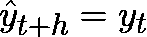
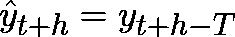
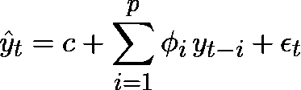
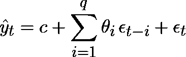
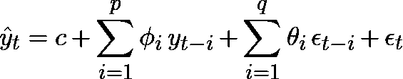

# 时间序列预测的统计方法简介

> 原文：<https://towardsdatascience.com/a-brief-introduction-to-time-series-forecasting-using-statistical-methods-d4ec849658c3>

## 你需要知道的关于 AR，MA，ARMA，ARIMA 和 SARIMA 的一切


费德里科·贝卡里在 Unsplash[拍摄的照片](https://unsplash.com?utm_source=medium&utm_medium=referral)

许多数据都是以时间序列的形式提供的，例如，天气数据、股票价格、销售发展等。通常，我们希望使用可用信息来估计这些时间序列的未来发展，以便为我们当前的决策提供信息。

这就是时间序列预测发挥作用的地方。由于时间序列预测是一个大话题，因为它有许多用例，所以有许多方法可供我们选择。这些方法可以分为两组:统计方法和机器学习方法。

在本文中，我将向您概述五种统计方法:

*   自回归(AR)
*   移动平均线
*   自回归移动平均(ARMA)
*   自回归综合移动平均(ARIMA)
*   季节性自回归综合移动平均线

我不仅会向您展示它们是如何工作的以及我们何时可以使用它们，还会向您展示如何用 Python 轻松地实现它们。

在我们深入研究统计方法之前，我想快速向你们展示时间序列预测最简单的方法:朴素方法。

# 天真的方法

顾名思义，朴素方法是一种非常基本的预测方法，因此经常被用作基线/基准模型。简单方法基于最后观察值预测未来值:



如果时间序列有季节成分，我们可以假设一个季节的值与前一个季节的值相同。因此，代替使用时间序列的最后观察值，我们可以使用最后时段 *T* 的观察值:



通过使用 pandas `[shift()](https://pandas.pydata.org/docs/reference/api/pandas.DataFrame.shift.html)`方法，我们可以很容易地实现这种简单的方法。

# 自回归(AR)

顾名思义，自回归是时间序列的过去值(“自动”)的线性组合(“回归”)，假设当前值和过去值之间存在关系。用于回归的过去值的数量被称为滞后或顺序 *p* 。基于过去值/滞后和附加白噪声 *ε* 和常数 *c* 的加权和来估计未来值:



这里，*φ*是每个滞后的权重。

为了确定滞后/阶数 p 的数量，我们可以使用自相关函数(ACF)和偏自相关函数(PACF)图。我们可以定义订单 *p* 如果

*   ACF 呈指数衰减或正弦衰减
*   PACF 在滞后点*p*有一个显著的峰值，但之后没有

如果 ACF 和 PACF 图没有帮助，我们可以测试不同的阶次 *p* ，然后根据一个准则选择一个模型，比如赤池的信息准则(AIC)。尽管 AIC 没有找到最佳模型，但它帮助我们识别出可以用最少的参数提供良好结果的模型。因此，我们基本上测试不同的订单，然后选择具有最低 AIC 的模型。但是，请注意，低 AIC 并不一定意味着模型提供了良好的预测结果。

自回归应用于没有趋势和/或季节性的时间序列，限制自回归的顺序。高阶(即滞后的数量)表示我们应该使用额外的参数，例如添加移动平均值(MA)。

我们还需要注意，我们只能按照我们选择的顺序来预测未来的目标。例如，如果我们选择 1 的顺序 *p* ，我们只能预测下一个时间步。如果我们使用 4 的顺序，我们可以预测未来的四个时间步。

如果我们想要预测多个时间步长，模型会反馈预测值，并将其用于下一个时间步长的预测。

## 用 Python 实现

我们可以使用 Python 的`statsmodels`包中的`[AutoReg](https://www.statsmodels.org/dev/generated/statsmodels.tsa.ar_model.AutoReg.html)`类在 Python 中实现自回归。我们传递订单(滞后数)，然后调用`fit()`方法来训练模型。对于我们的实际预测，我们称之为`predict()`方法。

```
from statsmodels.tsa.ar_model import AutoReg

model_ar = AutoReg(train_ts, lags=p, seasonal=True, period=96, trend="n").fit()
y_pred = model_ar.predict(start=len(train_ts), end=len(train_ts)+1)
```

我们可以将滞后/订单的数量作为一个整数或一个整数列表来传递。如果我们传递一个整数，那么直到这个整数的所有延迟都会被使用。如果我们传递一个列表，那么只使用传递的特定 lag。

如你所见，`AutoReg`类允许我们预测具有趋势和/或季节性的时间序列。为此，我们需要通过如代码片段所示的季节性周期。

为了进行预测，我们需要确定起点和终点。起点总是根据我们的训练数据集的长度来确定的。例如，如果我们想要预测接下来的两个时间步，开始和结束将分别是我们的训练数据集的长度和我们的训练数据集的长度加 1。如果我们希望有三个时间步长的提前期(即，在未来三个时间步长开始预测)，我们使用训练数据集长度的开始加上 2。

有时，ACF 和 PACF 图对确定顺序 *p* 没有太大帮助。因此，为了帮助我们选择正确的顺序，我们也可以使用`ar_select_order`类。

```
from statsmodels.tsa.ar_model import ar_select_order

mod = ar_select_order(train_ts, maxlag=p, seasonal=True, period=96, trend="n")
mod.ar_lags
```

# 移动平均线

移动平均是过去预测误差的线性组合。因此，该方法依赖于目标值和先前白噪声误差项之间的相关性。该方法不应与[移动平均平滑](https://medium.com/@jodancker/a-brief-introduction-to-time-series-smoothing-4f7ed61f78e1)混淆:



这里， *ε* 表示白噪声(即预测值与实际值之差) *θ* 是每个滞后的权重。移动平均的阶数 q 表示移动平均的窗口宽度，可以通过使用自相关函数(ACF)图来确定。我们可以决定顺序，如果

*   ACF 在滞后*q*时有显著的尖峰，但在之后没有尖峰
*   PACF 呈指数衰减或正弦衰减

一般来说，移动平均可用于平稳时间序列。

## 用 Python 实现

我们可以通过使用 Python 的`statsmodels`中的`[ARIMA](https://www.statsmodels.org/dev/generated/statsmodels.tsa.arima.model.ARIMA.html)`类在 Python 中实现移动平均。因为我们只想建立移动平均模型，所以需要将自回归项和积分项的阶数设置为零。由于 ARIMA 模型将订单参数作为一个形式为 *(p，d，q)* 的元组，我们将前两个订单设置为零。

然后，`ARIMA`类的使用类似于`AutoReg`类，我们调用`fit()`和`predict()`方法来训练模型并进行预测。

```
from statsmodels.tsa.arima.model import ARIMA

model_ma = ARIMA(train_ts, order=(0,0,q)).fit()
y_pred = model_ma.predict(start=len(train_ts), end=len(train_ts)+1)
```

除了使用`predict()`方法，我们还可以使用`forecast()`方法。在这里，我们只需要通过时间步数，我们要预测到未来。

# 自回归移动平均(ARMA)

自回归移动平均将阶为 *p* 的自回归与阶为 *q* 的移动平均相结合。因此，该方法描述了时间序列与其自身以及先前时间步的随机噪声之间的关系:



这里，第一个求和项代表自回归部分，第二个求和项代表移动平均值。

为 ARMA 模型中的 *p* 和 *q* 分量选择正确的阶数可能相当困难，因为如果两个分量都存在，ACF 和 PACF 图可能对我们没有太大帮助。但是，它们可能会指示顺序，并帮助我们找到超参数调整的良好起点。我们也可以使用网格搜索，测试不同的组合 *p* 和 *q* ，然后根据选择的标准选择订单，例如 AIC。

类似于自回归和移动平均，ARMA 方法只对平稳时间序列有效。

## 用 Python 实现

我们可以使用 Python 的`statsmodels`中的`ARIMA`类在 Python 中实现自回归移动平均。为此，我们将自回归和移动平均的次序传递给方法。

```
from statsmodels.tsa.arima.model import ARIMA

model_arma = ARIMA(train_ts, order=(p,0,q)).fit()
y_pred = model_arma.predict(start=len(train_ts), end=len(train_ts)+1)
```

# 自回归综合移动平均(ARIMA)

到目前为止，我只展示了适用于平稳时间序列的方法。但是时间序列通常不是静态的，因为它们具有趋势和/或季节性。为了使时间序列稳定，我们可以使用差分法，从先前的时间步长中减去当前的时间步长。

我们可以通过添加一个差分阶 *d* 将其直接包括在 ARMA 模型中，而不是在单独的步骤中进行差分，这将我们引入自回归综合移动平均模型。1 的顺序 *d* 意味着时间序列被差分一次，而 2 的顺序 *d* 意味着时间序列被差分两次。

为了找到最佳差分顺序，我们可以

*   画出我们的时间序列并比较不同顺序的影响，
*   使用统计测试，例如扩展的 Dickey-Fuller (ADF)测试，
*   看看 ACF 和 PACF 的图，或者
*   使用`auto_arima`。

ADF 用平稳时间序列的替代假设检验时间序列中存在单位根(非平稳性)的零假设。因此，如果 p 值低于 0.05，并且如果检验统计量是负数，我们可以拒绝零假设，并假设我们的时间序列是平稳的。

如果小滞后的自相关为正且很大，然后缓慢下降，则 ACF 图指示一种趋势。相比之下，季节性则由季节性滞后的较大自相关性来表示。

`pmdarima`包中的`[auto_arima](https://alkaline-ml.com/pmdarima/modules/generated/pmdarima.arima.auto_arima.html)`方法可以通过对 *p* 、 *d* 和 *q* 的不同组合进行自动搜索来帮助我们识别正确的参数。如果我们用其默认值运行`auto_arima`，它会通过模拟范围为 *p* = 2…5、 *d* = 0…2 和 *q* = 2…5 的 AIC 找到“正确”的组合。

```
import pmdarima as pm

ARIMA_model = pm.auto_arima(train_ts)
ARIMA_model.summary()
```

虽然 ARIMA 通常提供比上述方法更好的结果，但是 ARIMA 在计算上更昂贵。此外，我们需要调整更多的超参数。

## 用 Python 实现

我们可以使用 Python 的`statsmodels`中的`ARIMA`类在 Python 中实现自回归综合移动平均。对此，我们只是通过模型的 *p* 、 *d* 、 *q* 顺序。

```
from statsmodels.tsa.arima.model import ARIMA

model_arima = ARIMA(train_ts, order=(p,d,q)).fit()
y_pred = model_arima.predict(start=len(train_ts), end=len(train_ts)+1)
```

# 季节性自回归综合移动平均线

如果我们的时间序列有季节性成分，我们可以通过季节性成分扩展 ARIMA 模型。生成的季节性自回归综合移动平均涉及季节性成分的后移，并对季节性成分执行额外的自回归、综合和移动平均。因此，萨日玛可以表示为 *(p，D，q)* 和 *(P，D，Q)m* 分量，其中 *P* 、 *D* 、 *Q* 是季节分量 *m* 的参数。

虽然该模型可以进行更好的预测，但找到正确的参数甚至比 ARIMA 模型更耗时。

同样，我们可以使用`auto_arima`来帮助我们找到最佳参数。对此，我们只需要添加季节参数 *m* ，需要手动确定。 *m* 是季节周期中的时间步数。例如，如果一个季节持续一年，我们有月度数据，那么 *m* = 12。

```
import pmdarima as pm 

ARIMA_model = pm.auto_arima(train_ts, m=12)
ARIMA_model.summary()
```

## 用 Python 实现

我们可以使用 Python 的`statsmodels`中的`ARIMA`类在 Python 中实现季节性自回归综合移动平均线。为此，我们只需传递模型的 *p* 、 *d* 和 *q* 顺序，并添加季节性的参数 *(P，D，Q)m* 。

```
from statsmodels.tsa.arima.model import ARIMA

model_sarima = ARIMA(train_ts, order=(p,d,q), seasonal_order=(P,D,Q,m)).fit()
y_pred = model_sarima.predict(start=len(train_ts), end=len(train_ts)+1)
```

# 决定我们模型的顺序

除了使用 AIC 选择正确数量的模型，我们还应该在进行任何预测之前研究模型的残差。理想情况下，残差应该是白噪声。因此，它们不应该有任何自相关。

为了测试自相关性，我们可以应用 Ljung-Box 检验，它测试数据是独立分布的零假设，即没有表现出序列相关性。如果测试的 p 值低于 0.05，残差不相关，我们可以使用我们的模型进行预测。

我们可以通过使用来自`statsmodels`的`[acorr_ljungbox](https://www.statsmodels.org/dev/generated/statsmodels.stats.diagnostic.acorr_ljungbox.html)`方法在 Python 中实现 Ljung-Box 测试。请记住，我们需要对残差进行测试。

```
from statsmodels.stats.diagnostic import acorr_ljungbox

ljung_box = acorr_ljungbox(model.resid)
print(ljung_box)

fig, axes = plt.subplots(3, figsize=(10,5))
axes[0].plot(model.resid)
plot_pacf(model.resid, lags=100, ax=axes[1])
plot_acf(model.resid, lags=100, ax=axes[2])
```

我们也可以看看 ACF 和 PACF 图来支持永盒测试并验证结果。

# 结论

在这篇简介中，我向你展示了五种统计方法，根据时间序列的特征，你可以很容易地用它们来预测时间序列。

请注意，尽管 Python 中的实现非常简单，但您将花费大量时间预处理时间序列并寻找最佳超参数，即模型的正确阶数。

让我知道你的想法，并留下评论。