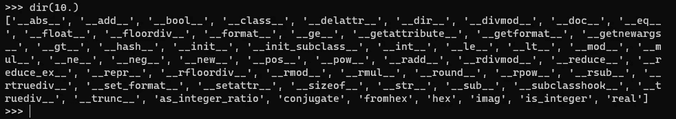

# 可赎回的浮动？Python 中的乐趣和创造力

> 原文：<https://towardsdatascience.com/a-callable-float-fun-and-creativity-in-python-7a311ccd742d>

## PYTHON 编程

## 为了学习创造性，我们将在 Python 中实现可调用的浮点数


[Kai Gradert](https://unsplash.com/@kai?utm_source=medium&utm_medium=referral) 在 [Unsplash](https://unsplash.com?utm_source=medium&utm_medium=referral) 上拍摄的照片

在 Python 的内置数据类型中，我们有许多表示数字的类型，最重要的是`int`和`float`。如同 Python 中的一切，它们的实例是对象；而作为对象，它们有自己的属性和方法。例如，这就是`float`型报价的实例:



如你所见，`float`数字提供了许多不同的使用方法。他们没有提供一个`.__call__()`方法，这意味着你不能调用他们。

你有没有想过为什么我们不能像调用函数一样调用浮点数？看:

```
>>> i = 10.0012
>>> i()
Traceback (most recent call last):
    ...
TypeError: 'float' object is not callable
```

它不起作用。为什么它不起作用？！

老实说……我从来没有考虑过为什么 floats 是不可调用的——但是这对我来说非常有意义。他们为什么要这么做？为什么你觉得他们有什么特别的原因吗？我不知道。

但这并不意味着我们不会实现这样的功能——我们肯定会实现。我们为什么要这么做？原因有三:学习 Python，有创意，学习有创意。

学习创新是学习编程语言的一个重要方面。有一天，在一个 Python 项目中，你会发现自己处于一个困难的境地，标准的解决方案不起作用；你必须*思考*和*有创造性*。你的创造力可能会帮助你找出一个创新的、非典型的解决方案，一个能帮助你解决这个奇怪的或者非典型的问题的方案。

因此，在本文中，我们将实现一个可调用的浮点类型；这绝对不是一个典型的场景。我们将逐步进行，我将详细解释每一步。继续读下去的时候，要尽量有创造性。也许这样会帮助你想出自己的想法来改进解决方案。如果有，就去实现它们，并请在评论中分享。

# 履行

我们将从实现下面的简单方法开始:如果用户调用一个 float，它返回四舍五入到三个十进制数字的数字。现在，让我们简化一下——我将硬编码舍入到三个十进制数字；我们以后会改变这一点。

```
# callable_float.py
class Float(float):
    def __call__(self):
        return round(self, 3)
```

这就是我们所需要的！正如您在下面看到的，在正常的用例中，`Float`的一个实例的行为就像一个常规的`float`对象:

```
>>> from callable_float import Float
>>> i = Float(10.0012)
>>> i * 2
20.0024
>>> i - 1
9.0012
>>> round(2 * (i + 1) / 7, 5)
3.14320
```

然而，与`float`不同的是，`Float`是可调用的:

```
>>> i()
10.001
```

Voilà —可调用的浮点数。

然而，不需要硬编码要在舍入中使用的小数位数。我们可以让用户决定使用多少个十进制数字。为此，只需向`.__call__()`方法添加一个`digits`参数:

```
# callable_float.py
class Float(float):
    def __call__(self, digits=3):
        return round(self, digits)
```

```
>>> i(1)
10.0
>>> i(3)
10.001
>>> i(10)
10.0012
```

完美！请注意，这正是我们将相应的`float`数字四舍五入后得到的结果:

```
>>> j = float(i)
>>> i(1) == round(j, 1)
True
>>> i(3) == round(j, 3)
True
>>> i(10) == round(j, 10)
True
```

我们可能想返回一个`Float`对象，而不是一个`float`:

```
# callable_float.py
class Float(float):
    def __call__(self, digits=3):
        return Float(round(self, digits))
```

在这里，`Float`数字在被调用时唯一能做的就是四舍五入。无聊！让它能够做*任何事情*。

为了实现这样一个通用的概念，我们需要使`.__call__()`方法成为一个高阶方法，这意味着它接受一个函数(实际上是一个可调用的函数)作为参数。下面的类实现了这个功能:

```
# callable_float.py
from typing import Callable

class Float(float):
    def __call__(self, func: Callable):
        return func(self)
```

注意，这一次，我们没有将返回值的类型更改为`Float`，因为用户可能希望使用返回另一种类型的对象的`func()`函数。

这个版本的`Float`是这样工作的:

```
>>> from callable_float import Float
>>> i = Float(12.105)
>>> 2*i
24.21
>>> i(round)
12
>>> i(lambda x: 200)
200
>>> i(lambda x: x + 1)
13.105
>>> def square_root_of(x):
...     return x**.5
>>> i(square_root_of)
3.479224051422961
>>> i(lambda x: round(square_root_of(x), 5))
3.47922
>>> i = Float(12345.12345)
>>> i(lambda x: Float(str(i)[::-1]))
54321.54321
```

它像预期的那样工作，但是它有一个明显的缺点:您不能对`func()`函数使用额外的参数。由于有了`*args`和`**kwargs`参数，我们可以很容易地实现这个功能，使用户能够提供*任何*参数:

```
# callable_float.py
from typing import Callable

class Float(float):
    def __call__(self, func: Callable, *args, **kwargs):
        return func(self, *args, **kwargs)
```

```
>>> i(lambda x, digits: round(x**.5, digits), 5)
111.10861
>>> def rounded_square_root_of(x, digits=3):
...     return round(x**.5, digits)
>>> i(rounded_square_root_of)
111.109
>>> i(rounded_square_root_of, 5)
111.10861
>>> j = float(i)
>>> i(rounded_square_root_of, 5) == rounded_square_root_of(j, 5)
True
```

所有工作都很好。请考虑以下注意事项:

*   用户提供一个应用于类实例的函数。它可以不带参数，也可以带任意数量的参数，包括位置参数(`*args`)和关键字参数(`**kwargs`)。然后将`Float`的值作为函数调用，将函数`func()`作为该函数的参数调用，这与将该值作为其参数调用该函数是一样的……如果这不疯狂，那么什么才是疯狂呢？！
*   这次`Float.__call__()`的返回值可以是任意类型，并且和`func()`函数的返回值是同一个类型。

# 结论

我们已经实现了一个类`Float`，它可以像函数一样调用浮点数。用一个函数作为参数调用一个`Float`类的实例意味着用`Float`实例作为参数调用这个函数。您可以使用任何附加参数，包括位置参数和关键字参数。

我们做这些并不是为了实际使用可调用的`Float`类。我从未实现或使用过任何类似的东西，我也不*也不*期望如此。但对我来说，这很有趣，非常有趣——也是使用 Python 的创造性的一课。我希望你也喜欢这篇文章。我认为做这些疯狂的事情有很大的价值:它帮助你学习 Python，并且帮助你学习这种语言的复杂性，这是你用其他方法学不到的。

`Float`类并不重要。重要的是，当你不得不处理非典型情况时，这种头脑风暴可以帮助你在未来的项目中激发创造力。实践这样的实现可以帮助您在 Python 项目中找到并实现非典型解决方案。

感谢阅读。如果你喜欢这篇文章，你也可以喜欢我写的其他文章；你会在这里看到他们。如果你想加入 Medium，请使用我下面的推荐链接:

[](https://medium.com/@nyggus/membership) [## 加入我的介绍链接媒体-马尔钦科萨克

### 阅读马尔钦·科萨克(以及媒体上成千上万的其他作家)的每一个故事。您的会员费直接支持…

medium.com](https://medium.com/@nyggus/membership)