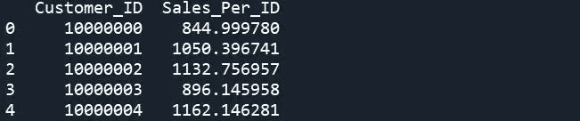
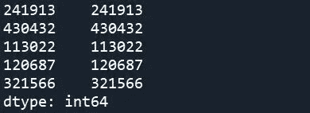
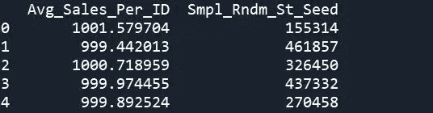

# 通过代码评审优化程序的案例研究

> 原文：<https://towardsdatascience.com/a-case-study-in-optimizing-programs-through-code-review-302f994fe7ec>

## 数据科学项目的持续改进需要坚持不懈的努力


在 [Unsplash](https://unsplash.com?utm_source=medium&utm_medium=referral) 上由 [Max Duzij](https://unsplash.com/@max_duz?utm_source=medium&utm_medium=referral) 拍照

拥有相对成熟的数据科学团队的组织的一个更不受重视的方面是持续改进的强大文化。对于负责创建和维护复杂软件解决方案的技术团队来说，参与到提高团队代码库整体质量的实践中尤为重要。无论是已经在生产中的现有过程，还是完成可重复任务的标准化包/代码，定期和严格的代码审查通过减少错误、安全问题和资源使用的可能性，使主要和第三利益相关者都受益。

审查别人写的代码，通常很少有文档或上下文，有时会很困难和不愉快。但香肠就是这么做的。

在这里，我举例说明了一个例子，在这个例子中，我能够显著减少程序运行所需的最大计算空间和总处理时间。真正酷的是，我最初并没有想这么做；它起源于一个旨在重组程序以在一组已建立的 KPI 上表现更好的计划。**有时候最好的事情发生在你意想不到的时候。**

首先，一些背景。在某一点上，程序(用 Python 编写)从一组对象中随机抽取样本，并记录该组的关键指标。它这样做了很多次。目标是确定一个样本对象，使关键指标的值最大化，供以后使用。在检查代码的正确性时，我发现了一些明显增加了整体运行时和内存使用的东西，这些东西是不需要存在的。

问题在于随机抽样的结果是如何储存的。因为在后面的步骤中需要这个样本，所以程序最初创建了一个列表，使用一个 *for* 循环来存储每次迭代的每个样本的 pandas 数据帧。虽然这达到了它的目的，但内存中列表的大小是作为两个变量的函数而增加的:*for 循环中的迭代次数，以及所取样本的大小。对于相对较小的样本和迭代，该过程运行良好。但是，如果将样本量从 1，000 增加到 100，000，迭代次数从 5，000 增加到 500，000，会发生什么呢？它可以极大地改变所需的内存使用量，而且不管您的技术架构如何，效率低下的程序都会因不必要的计算资源和浪费的时间而给组织带来实实在在的损失。*

让我们快速构建一组示例数据来说明这个问题。我们将使用一个特定时间范围内销售的购物者 id 的例子；它可以是特定于一组产品、销售渠道、地理位置等的销售。—发挥你的想象力！

```
import pandas as pd
import numpy as np# Set how many iterations to run, & size of ID sample in each iteration
n_iters = 100000
smpl_sz = 500000# Create a sample df with 10MM unique IDs
# - Generate some dummy sales data to play with later
id_samp = pd.DataFrame(range(10000000,20000000))
id_samp.columns = ['Customer_ID']
id_samp['Sales_Per_ID'] = np.random.normal(loc = 1000, scale = 150, size = len(id_samp))
print(id_samp.head())
```



Spyder 中上述代码生成的输出的作者图片

如前所述，程序最初将每个样本存储在主列表中，这将样本大小引入了内存存储等式。对于更昂贵的数据对象，例如字符串或用户创建的对象与整数相比，这种情况会变得更糟。

```
# Original version
# Initialize data objects to store sample, info for each iteration’s sample
metric_of_interest = []
samples = []# In the loop, store each sample as it's created
for i in range(n_iters):
 samp = id_samp.sample(n = smpl_sz, axis = ‘rows’, random_state = i)
 samples.append(samp)
 # Do something with the sample & record add’l info as necessary
 metric_of_interest.append(samp[‘Sales_Per_ID’].mean())
```

这里的关键是，我们不需要在创建时存储每个样本，以便以后访问它。我们可以利用随机抽样函数的固有属性，使用一个[随机种子](https://en.wikipedia.org/wiki/Random_seed)来获得可重复性。我不会深究使用随机种子作为最佳实践；但是这里有[的另一篇媒体文章](/how-to-use-random-seeds-effectively-54a4cd855a79)有一个相当彻底的解释，在这里你可以看到一些关于使用种子/随机状态的 [NumPy](https://numpy.org/doc/stable/reference/random/generator.html) 和 [Pandas](https://pandas.pydata.org/docs/reference/api/pandas.DataFrame.sample.html) 文档。主要的收获是一个整数值可以用来“挑选”采样过程的开始；所以如果你存储了这个值，你就可以复制这个样本。*这样，我们能够通过优化我们的存储方法来消除样本大小和数据类型对内存使用的影响*。

结果将是创建一个随机选择的整数组，每个循环迭代有 1 个值来创建样本。下面我展示了我自己独特的随机选择这些整数的方法，但是这可以通过很多方式来实现。

```
# Create a random sample of integers for use as ID sample random state seed
#Here, we pull a seq of nums 50x greater than num iters to samp from
rndm_st_sd_pop = pd.Series(range(0,n_iters*50))
rndm_st_sd_samp = rndm_st_sd_pop.sample(n = n_iters, axis = ‘rows’)
del(rndm_st_sd_pop)
print(rndm_st_sd_samp.head())
```

*注意:在本例中，索引和随机种子值相等*



Spyder 中上述代码生成的输出的作者图片

现在，您可以遍历您的随机种子样本，并将每个值作为参数提供给采样函数。请记住，无论使用何种语言，任何值得使用的采样函数都应该有这个参数。

```
# Initialize data object(s) to store info for each iter’s sample
metric_of_interest = []# In the loop, use the random state/seed to produce a sample you can easily reproduce later
for i in rndm_st_sd_samp:
 samp = id_samp.sample(n = smpl_sz, axis = ‘rows’, random_state = i)
 # Do something with the sample & record add’l info as necessary
 metric_of_interest.append(samp[‘Sales_Per_ID’].mean())# Bind the info saved for each iter to resp seed val for easy lookup
sample_data = pd.DataFrame(
    {'Avg_Sales_Per_ID': metric_of_interest,
     'Smpl_Rndm_St_Seed': rndm_st_sd_samp })
sample_data.reset_index(inplace = True)
print(sample_data.head())
```



Spyder 中上述代码生成的输出的作者图片

在这种情况下，对包和特定使用语言的深刻理解，加上代码审查的标准化过程，导致了运行时性能的实质性提高。这只是影响代码性能和可靠性的一种方式的一个例子，希望能启发你重新审视你很久以前写的东西。至于关于正式审查代码的进一步信息，这里是 Stack Overflow 的博客中对主题的一个非常好的讨论；还有一个专门讨论这个话题的[栈交换](https://codereview.stackexchange.com/)社区。