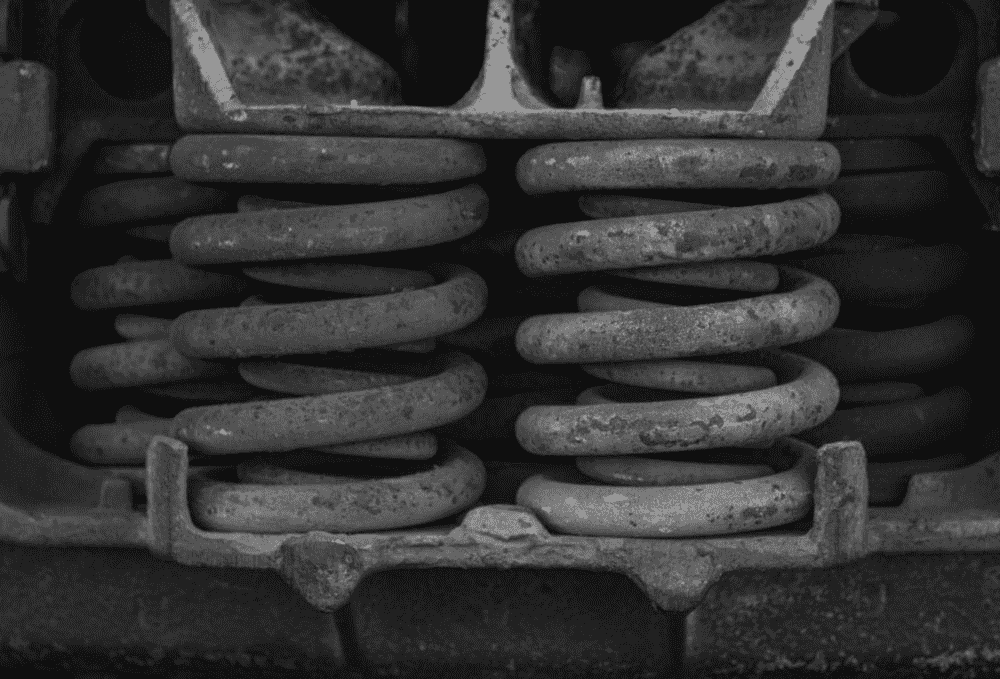
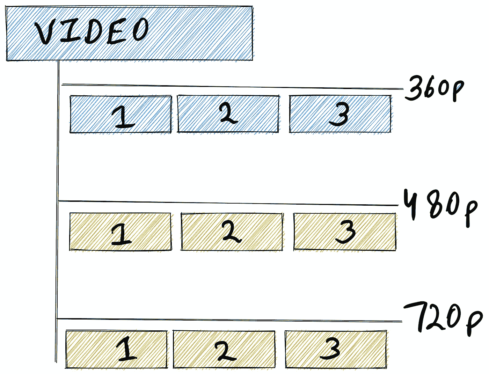
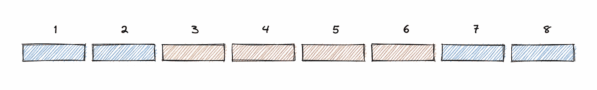
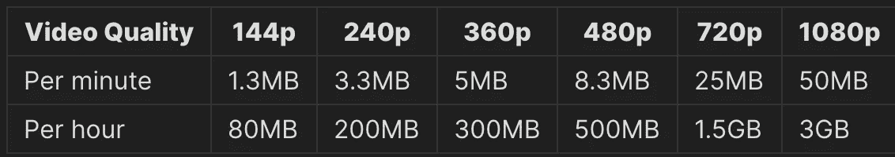
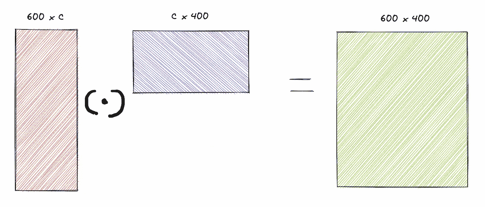
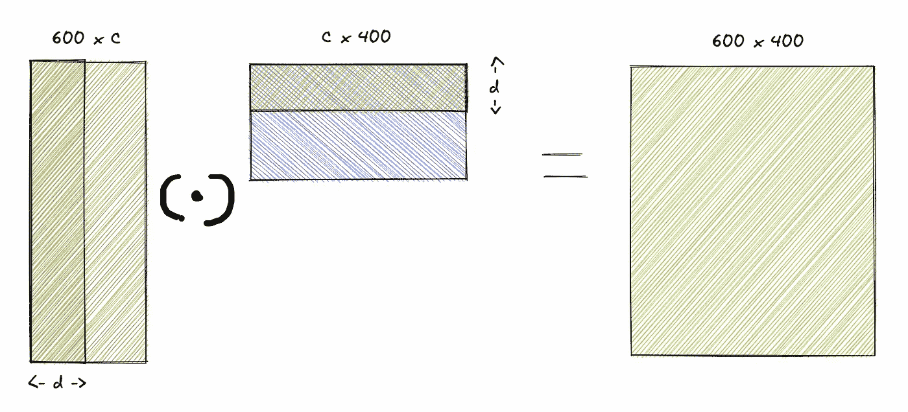
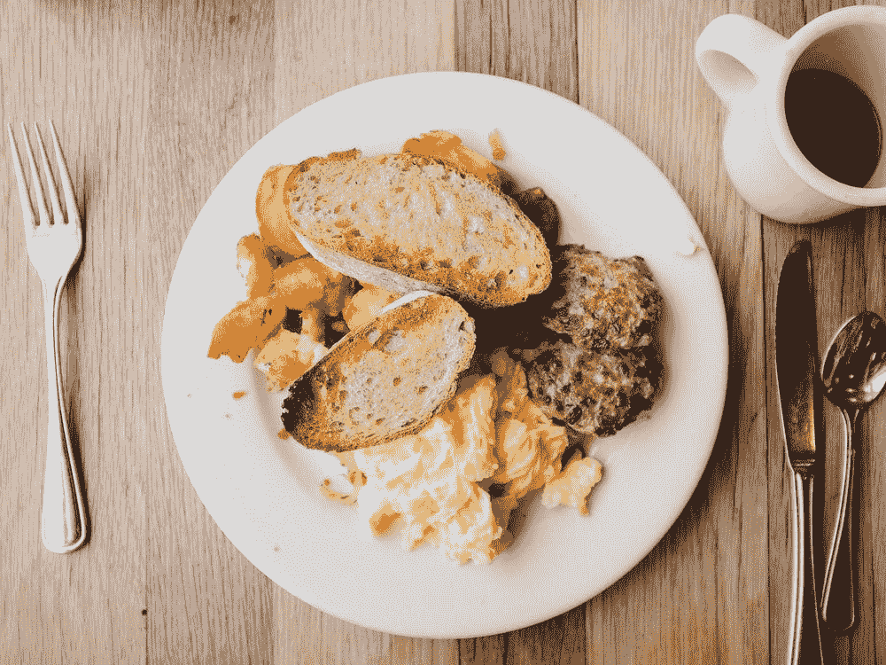
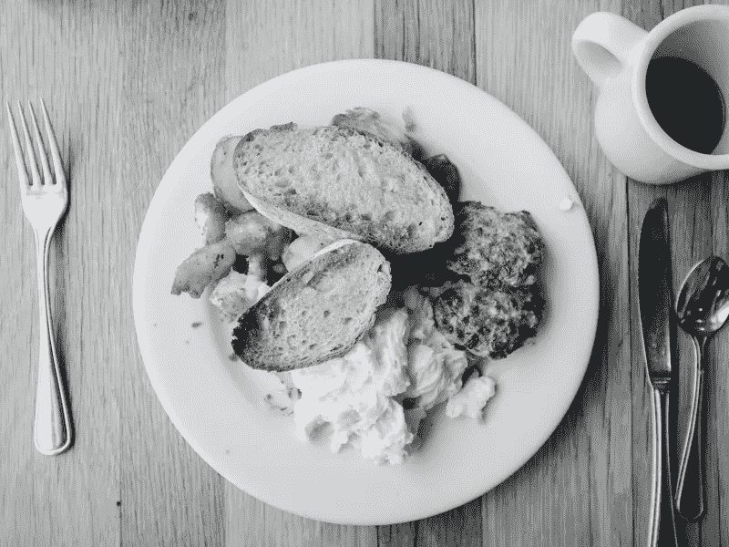
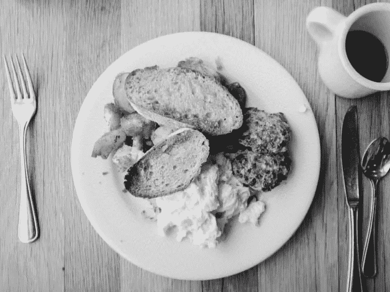
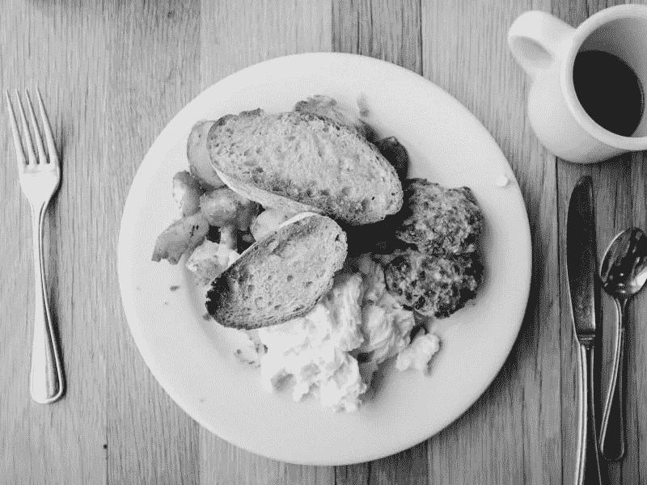

# 随意摆弄图像压缩

> 原文：<https://towardsdatascience.com/a-casual-flirt-with-image-compression-abbb2679f492>



[mustachescactus](https://unsplash.com/@mustachescactus) 在 [Unsplash](https://unsplash.com?utm_source=medium&utm_medium=referral) 上的照片

# 介绍

想象一下。您的网络运行缓慢。Youtube 已经自动将 720p 设置为您的视频质量，您已经从您的 youtube 建议中随机添加了一些内容。有点标准的场景，对吧？

现在，很可能你喜欢内容，然后你突然意识到视频质量应该更好。将光标移至设置按钮，手动将视频设置为更高的质量。但是，你有没有注意到，当你手动调整视频质量时，youtube 为你加载的任何缓冲都丢失了:(

这到底是怎么回事？手动更改视频质量会发生什么情况？youtube 是如何动态改变视频质量的？所有这些都是非常有趣的问题，需要知道答案。让我们在下一节中尝试理解这些

# 动态视频质量切换

为了理解动态视频质量切换，理解视频如何从服务器流到我们的浏览器是非常重要的。一个通用的技巧是将每个视频分成多个分辨率，并将每个分辨率分成更小的片段。然后，浏览器负责请求所需的分辨率和代码片段，然后将它们整齐地拼接在一起，显示在屏幕上。让我们来看看更多的细节。



作者形象

源视频在后端被转换成多个分辨率，分成几秒钟(比如 2 秒)的小块。

现在，当用户在浏览器屏幕上打开视频时，youtube 会以默认分辨率启动，并获取一些块来启动视频。在接下来的几秒钟内，客户端可以更好地统计网络容量，并基于此向服务器请求不同质量的数据块，以便为用户提供最佳体验。该统计数据被持续维护，并不断适应不断变化的网络行为。



作者形象

上图是视频质量在客户端如何动态变化的时间轴示例。

使用在所有主流浏览器中实现的媒体源扩展 API，在客户端将块缝合在一起。它提供了支持无插件的基于网络的流媒体的功能。使用 MSE，可以通过 JavaScript 创建媒体流，并使用`[<audio>](https://developer.mozilla.org/en-US/docs/Web/HTML/Element/audio)`和`[<video>](https://developer.mozilla.org/en-US/docs/Web/HTML/Element/video)`元素播放。

如果你对整个过程的更多细节感兴趣，请参考[这篇中间文章](https://medium.com/canal-tech/how-video-streaming-works-on-the-web-an-introduction-7919739f7e1)

# 那么问题是什么呢？

常见的情况是用户在中途明确改变视频质量。下面的事情发生了，播放突然停止，播放器等待下载更多的块。更重要的是，所有下载的缓冲区都被丢弃。现在，这可能与用户无关，但为技术迷带来了一个有趣的声明。

> 我们能把视频数据构造成本质上是可加的吗？

我来解释一下上面的说法，作为一个大概的估计。



作者图像

上表参考了来自[哨声](https://www.whistleout.com/CellPhones/Guides/How-Much-Data-Does-YouTube-Use)的数据

如果浏览器当前拥有 1 分钟的 360p 缓冲区，然后用户请求 720p 视频质量，则 5MB 数据将被丢弃，另外 25MB 数据用于这 1 分钟的视频。

然而，如果我们有一个附加算法或方法，我们可以只请求服务器只发送大约 20MB 的信息来添加到 360p 视频，并使其成为 720p 视频。那岂不是很酷！

# 公式化优化问题

让我们试着进一步解决这个问题。因为视频最终是一系列图像，所以我们可以用图像而不是视频来表述这个问题吗？让我们也把范围缩小到黑白图像，因为图像本质上是 3 个通道的融合。

> 构建图像数据，使其可以切片以创建一个差的图像，但增加更多的数据切片，图像质量会不断提高！

让我们看一些伪代码

```
base_image **=** get_buffer**(**'my_image'**,** **(**0**,** 20**))**
display**(**base_image**)***# Now let's bring some additive data to improve the image quality* additive_info **=** get_buffer**(**'my_image'**,** **(**20**,** 60**))**
improved_image **=** base_image**.**add**(**additive_info**)**
display**(**improved_image**)**
```

# 图像作为矩阵

图像是数字的矩阵。600x400 的黑白图像必然是形状(600，400)的矩阵。一想到矩阵，矩阵代数就暗示一个矩阵可以由一堆其他矩阵组成。



作者形象

原始图像 X (600，400)可以分解成两个矩阵 A (600，c)和 B (c，400 ),使得 A 和 B 的点积产生 X。

此外，矩阵 A 和 B 应该使得任何切片 A(600，d)和 B(d，400)也尽可能精确地产生原始图像 X。



作者形象

# 基于梯度的优化

一旦清楚地表述了这个问题，用 PyTorch 为它编写一个优化器就非常容易了。我们来看看实现。

让我们把下面的图片作为我们的参考图片。



在 [Unsplash](https://unsplash.com/s/photos/breakfast?utm_source=unsplash&utm_medium=referral&utm_content=creditCopyText) 上 [Flipboard](https://unsplash.com/@flipboard?utm_source=unsplash&utm_medium=referral&utm_content=creditCopyText) 拍摄的照片

让我们加载图像并将其转换为黑白图像。

```
*# imports* from PIL import Image
import numpy **as** np*# load the image and convert it into a b/w image* img **=** Image**.***open***(**'reference_image.png'**)**
bw_img **=** img**.**convert**(**'L'**)**bw_img**.**show**()***# get the numpy matrix from the image data* data **=** bw_img**.**getdata**()**
data **=** np**.**asarray**(**data**)**
```



作者形象

现在让我们编写一个模块，将图像分成两个矩阵，这样两个矩阵的点积就可以重建原始图像

```
*# imports* import torch
import random
from torch.optim import Adam**,** SGD
from torch import nn
from torch.nn.functional import l1_loss *# target variable* Y **=** torch**.**from_numpy**(**data**)**
*# converting b/w data a [0,1] range* Y **=** Y**/**255 **class** **MF(**nn**.**Module**):**
    **def** **__init__(***self***,** H**,** W**,** N**):**
        *super***().**__init__**()**
        *# Defining parameters A and B
*        *self***.**A **=** nn**.**Parameter**(**torch**.**rand**(**H**,** N**))**
        *self***.**B **=** nn**.**Parameter**(**torch**.**rand**(**N**,** W**))**
        torch**.**nn**.**init**.**xavier_uniform_**(***self***.**A**)**
        torch**.**nn**.**init**.**xavier_uniform_**(***self***.**B**)**

    **def** **forward(***self***,** diff**):**
        **if** diff **>** 0**:**
            *# slice matrices 
*            A_i **=** *self***.**A**[:,** **:-**diff**]**
            B_i **=** *self***.**B**[:-**diff**,** **:]**
        **else:**
            A_i **=** *self***.**A
            B_i **=** *self***.**B *# construct image from the matrices
*        y_hat **=** torch**.**sigmoid**(**A_i **@** B_i**)**
        **return** y_hat
```

上面的模块非常简单。我们定义了形状为 A(H，N)和 B(N，W)的两个矩阵 A 和 B，使得矩阵乘法给出形状为(H，W)的矩阵。

此外，正向方法有助于训练矩阵，使得即使是它们的切片也能产生原始图像。

现在让我们看看所有神奇的事情发生的训练循环。

```
*# init the model and the optimizer* D = 200
mf **=** MF**(**H**,** W**,** D**)**
optimizer **=** Adam**(**mf**.**parameters**(),** lr**=**0.001**)***# some variables* running_loss **=** 0
STEPS **=** 128 ***** 50
LOG_STEPS **=** 32losses **=** **[]**
*# Training loop* **for** i **in** *range***(**STEPS**):**
    diff **=** random**.**randint**(**0**,** 100**)**
    y_hat **=** mf**.**forward**(**diff**)**    

    *# l1 + l2 loss
*    loss **=** torch**.***abs***(**Y **-** y_hat**).**mean**()** **+** **(**Y **-** y_hat**).**square**().***sum***().**sqrt**()**
    loss **=** loss
    li **=** loss**.**item**()**
    running_loss **=** 0.9 ***** running_loss **+** 0.1 ***** li

    *# optimizer steps and parameter updates
*    loss**.**backward**()**
    optimizer**.**step**()**
    optimizer**.**zero_grad**()**

    **if** i**%**LOG_STEPS **==** 0**:**
        **print(**running_loss**)**
```

上面的循环随机选择一个数字传递给模型的 forward 方法，该方法在内部对矩阵进行切片并生成原始图像。

> 它迫使矩阵 A 和 B 的参数如此，使得最初的几个切片具有更多信息，而后面的切片具有丰富图像的附加信息

# 结果呢

让我们首先定义一些效用函数，就像我们在开始时在伪代码中设想的那样

```
**def** **get_buffer(**mf**,** rnge**=(**0**,**20**)):**
    *# given the original parameters and a range, return the slices of matrices A and B
*    D = mf.A.shape[1]
    l = int(rnge[0]/100 * D)
    r = int(rnge[1]/100 * D)
    A = mf.A[:, l: r]
    B = mf.B[l: r, :]

    data **=** **(**A**,** B**)**
    **return** data**def** **add_buffers(**buffers**):**
    *# concatenate the buffer slices
*    **return** **(**torch**.**cat**([**b**[**0**]** **for** b **in** buffers**],** dim**=**1**),** torch**.**cat**([**b**[**1**]** **for** b **in** buffers**]))****def** **display(**data**):**
    *# construct image using the buffers
*    img **=** **(**torch**.**sigmoid**(**data**[**0**]@**data**[**1**])***255**).**detach**().**numpy**()**
    **return** Image**.**fromarray**(**np**.**uint8**(**img**))**
```

现在，让我们从 quality (0，20)获得一个缓冲区并显示它

```
*# display the first 20% quality* buff_0_20 **=** get_buffer**(**mf**)**
display**(**buff_0_20**)**
```


作者形象

很糟糕，但还是可以辨认的。现在让我们得到下一组数据来提高这张图像的质量。

```
*# get additional 40% (20, 60) data and append it to the earlier buffer* buff_20_60 **=** get_buffer**(**mf**,** **(**20**,** 60**))**
added_buffer_0_60 **=** add_buffers**([**buff_0_20**,** buff_20_60**])**
display**(**added_buffer_0_60**)**
```



作者形象

现在好多了。让我们看看最终的图像，它具有我们所拥有的最好的质量。

```
*# get the last 40% (60, 100) data and append it to the earlier buffer* buff_60_100 **=** get_buffer**(**mf**,** **(**60**,** 100**))**
added_buffer_0_100 **=** add_buffers**([**added_buffer_0_60**,** buff_60_100**])**
display**(**added_buffer_0_100**)**
```



作者形象

这个图像看起来更接近我们的基础图像。

# 结论

在这篇文章中，我们探讨了动态视频质量在 YouTube 这样的网站上是如何工作的，以及前端和后端技术的结合是如何实现的。我们看到了缓冲区不是可加的，因此当用户要求运行视频的更高质量时，缓冲区会被完全丢弃。

我们使用矩阵分解的思想和定制的训练过程来制定加法方法，该训练过程为输入图像 X 构造两个矩阵 A 和 B，使得

A[:，:N] ⋅ B[:N，:]≈X

使得较大的 N 给出图像 X 的更好的近似

# 参考

*   [视频流如何在网络上工作:简介](https://medium.com/canal-tech/how-video-streaming-works-on-the-web-an-introduction-7919739f7e1)
*   【YouTube 使用了多少数据？
*   [媒体源 API](https://developer.mozilla.org/en-US/docs/Web/API/Media_Source_Extensions_API)
*   【JPEG 是如何工作的